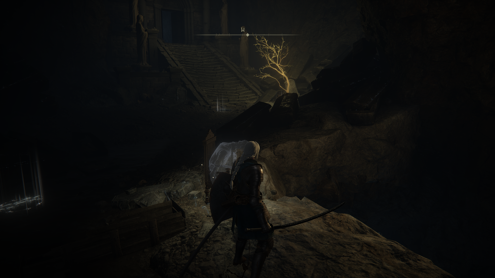
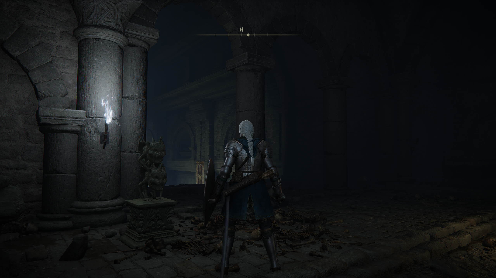
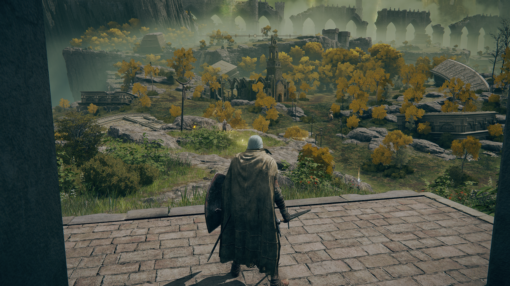
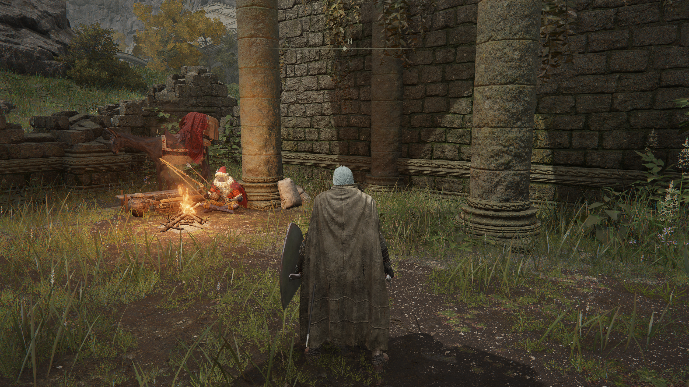
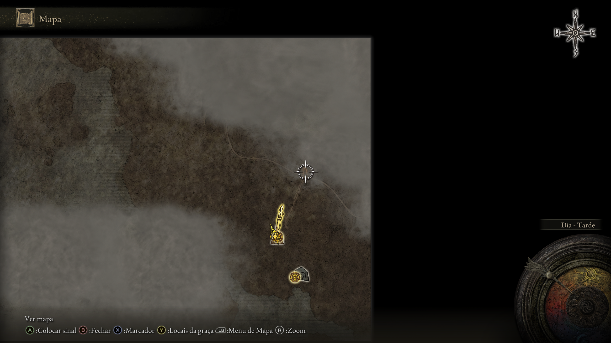
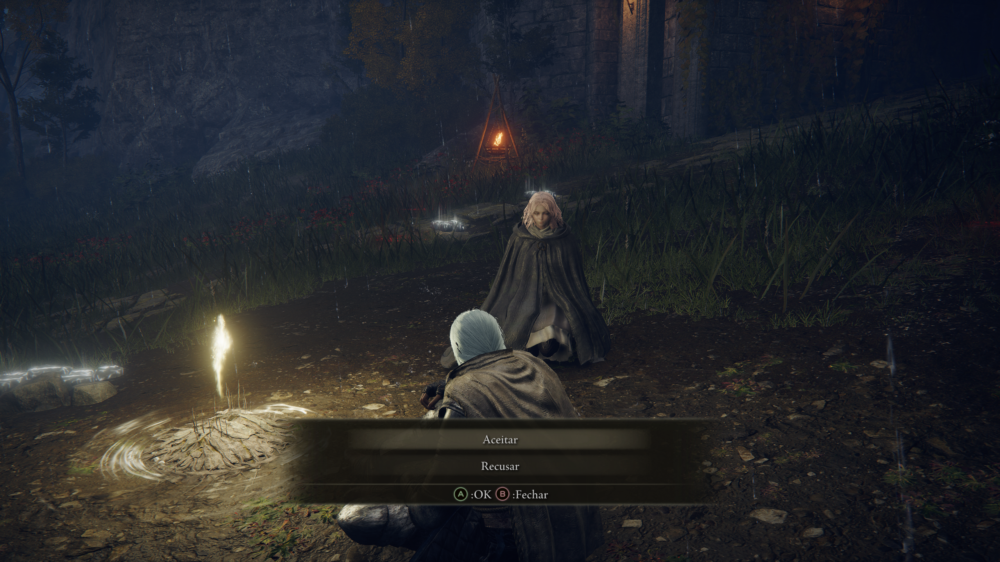
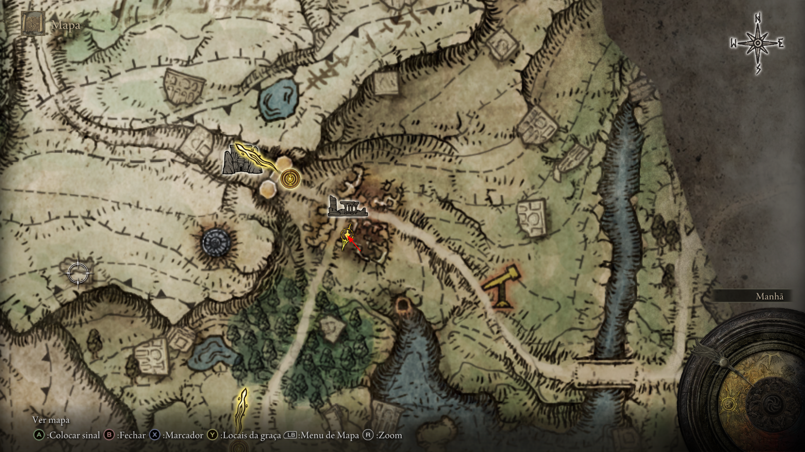

# 📖 O Despertar do Maculado: Crônicas de Limgrave

## 🕯️ Notas de Preparação (Antes de Partir)

Antes de cruzar a névoa para as Terras Intermédias, um Lorde deve esculpir sua imagem e assegurar seu poder.

### 🎭 A Forja da Identidade
A aparência de um Maculado reflete sua linhagem. Se precisar de inspiração para moldar seu rosto, consulte os registros visuais de outros heróis:
* [Diretório de Criação de Personagens (YouTube)](https://www.youtube.com/watch?v=0SUSBqzAm_w&list=PLqSHnyms_ow26cUwVEidFYVgTH6xKX450)

### 🐉 O Ritual do Selo (Acesso Imediato)
Para os que buscam o poder da **Comunhão do Dragão** logo no início, siga este protocolo no **Túmulo do Herói dos Confins** (área inicial do tutorial):
1. **O Legado:** Escolha a **Chave de Espada de Pedra** como item inicial.
2. **A Passagem:** Use a chave na estátua de diabrete logo após acordar no cemitério.
3. **A Descida:** Ignore a carruagem mecânica correndo pelas rampas. No final do caminho, você enfrentará um Espírito de Árvore Ulcerado.
4. **A Recompensa:** Ao derrotar o guardião ou explorar as câmaras laterais, você obterá o **Selo da Comunhão do Dragão**, essencial para builds de Arcano e Fé.
    * [Guia Visual: Como obter o Selo no Início (0:30 - 1:30)](https://www.youtube.com/watch?v=JSoQLWC6iAE)

---

## I. O Prelúdio da Névoa
A jornada começa no limiar entre a vida e a morte...

1.  **A Forja da Identidade:** Molde sua aparência e origem conforme as notas acima.
2.  **O Sacrifício na Antecipação:** Na Capela da Antecipação, você enfrentará o **Descendente Enxertado**. Não tema a derrota; o abismo é o seu verdadeiro tutorial. 
3.  **O Aprendizado nas Sombras:** Desça ao fosso do tutorial. Ali, o **Cavaleiro de Godrick** testará sua têmpera. Derrote-o para colher suas primeiras runas.

  
   
  <em>Figura 1: Localização do fosso aonde deve descer.</em>

4.  **O Selo da Comunhão:** Execute o ritual descrito nas notas de preparação antes de sair para o mundo aberto.

  
   
  <em>Figura 2: Localização do Túmulo do Herói da Margem, coloque a chave de pedra para liberar</em>

## II. O Primeiro Contato com a Graça
Ao abrir as portas para Limgrave, a imensidão das Terras Intermédias se revela.

5.  **A Máscara Branca:** No "Primeiro Passo", fale com **Varré**. Ouça suas palavras sobre a falta de donzelas; ele é o fio condutor de uma jornada sangrenta.

  
   
  <em>Figura 3: Inicio da jornada</em>

6.  **O Refúgio de Elleh:** Siga para as ruínas da Igreja de Elleh. Conheça **Kalé**, o mercador nômade. Ele será seu primeiro aliado comercial.

  
   
  <em>Figura 4: Igreja de Elleh, Kalé o mercador nômade</em>

7.  **O Pacto do Destino:** Na "Frente do Portão", descanse. **Melina** aparecerá para lhe oferecer um acordo. Aceite-o para invocar **Torrente**, seu leal corcel, e colete o **Mapa (Limgrave, Oeste)** e a **Faca de Amolar** no acampamento vizinho.

  
   
  <em>Figura 5: Localizacao do Mapa (Limgrave, Oeste), para mostrar a àrea</em>

  
   
  <em>Figura 6: Falar com a Melina para aceitar o acordo para ela ser a donzela dos dedos</em>

  
   
  <em>Figura 7: Pegar faca de amolar</em>

8.  **A Bruxa da Lua:** Retorne à Igreja de Elleh sob o manto da noite. A bruxa **Renna** o aguarda para entregar o Sino de Invocação Espiritual.

  
   
  <em>Figura 8: Falar com a bruxa</em>

## III. Os Desajustados de Limgrave
O mundo está cheio de almas perdidas clamando por auxílio sob a sombra da Térvore.

9.  **O Alfaiate Escondido:** Próximo à graça "Lago Agheel - Norte", ouça os chamados vindos de uma moita solitária. Golpeie-a para revelar **Boc**, um pequeno ser transformado por uma maldição de aparência. Ele é o primeiro fio de uma das quests mais humanas do jogo.
10. **A Mestra das Pedras:** Sob as "Ruínas do Ponto de Passagem", derrote a flor gigante e a sentinela de pedra para encontrar a **Feiticeira Sellen**. Jure lealdade ao estudo da magia de pedrilhante.
11. **Vislumbres do Leste:** Cavalgue até o **Poço do Rio Siofra** (a estrutura de elevador na floresta) para encontrar o **Mapa (Limgrave, Leste)**, dissipando a névoa das florestas nubladas.
12. **O Caçador de Dedos:** Nas "Ruínas à Beira-Mar", encontre **Yura**, o caçador de Dedos Sangrentos. Ele o alertará sobre o perigo alado que habita o lago.

## IV. Sangue, Escamas e Traição
O poder exige sacrifício e aço afiado. Prepare-se para o primeiro grande embate.

13. **A Invasão Escarlate:** No leito do rio ao norte do Lago Agheel, próximo à **Caverna Águas Murmas**, você sofrerá uma emboscada. Enfrente **Nerijus, o Dedo Sangrento**. Com a ajuda súbita de Yura, conquiste a adaga **Reduvia**. 
    * *Nota de Mestre:* Fortaleça a Reduvia para +1 imediatamente para facilitar os próximos confrontos sangrentos.
14. **O Dragão e o Arcano:** Abata o **Dragão Voador Agheel** no centro do lago. Seus instintos de caçador devem despertar: leve o coração da fera à **Igreja da Comunhão do Dragão** (acessível pela caverna na praia).
    * *Dica de Build:* Eleve seu atributo de **Arcano para 13** para dominar os encantamentos dracônicos.
15. **A Redenção de Boc:** Na "Gruta da Passagem do Dragão" (a caverna na praia), recupere a **Agulha de Costura** dos chefes locais e devolva a dignidade ao pequeno Boc.
16. **O Trapaceiro de Ouro:** Dentro da **Caverna Águas Murmas**, enfrente o infame **Patches**. Quando ele implorar por misericórdia, **poupe-o**. Ele se tornará um mercador. 
    * *Atenção:* Dialogue com ele, mas não abra o baú de armadilha ainda.

## V. O Caminho do Guerreiro e o Exílio da Dama
Novos aliados surgem no horizonte enquanto as estradas se tornam mais perigosas.

17. **A Dama das Cinzas:** No "Barraco da Colina da Tormenta", console a jovem **Roderika**. Fale com ela até que ela lhe confie seus dons. Em seguida, avance para a "Cabana do Mestre da Guerra" e conheça **Bernahl**, o instrutor de artes de combate.
    * *Tesouro Oculto:* Nas proximidades da cabana, procure por um escaravelho que guarda a cinza de guerra **Voto Dourado**.
18. **O Punho de Ferro:** Siga os gritos de socorro para ajudar **Alexander, o Punho de Ferro**, o grande jarro guerreiro. Ele é o símbolo da coragem indestrutível.
19. **O Caçador de Mortos:** Na "Ponte dos Santos", encontre **D, Caçador dos Mortos**. Após o aviso dele, derrote o Marinheiro de Tibia na Vila das Águas Vivas e retorne para mostrar a ele sua prova de vitória.
20. **A Mesa-Redonda:** Siga para a "Igreja Fumegante" na divisa com Caelid. Após enfrentar a invasora **Anastasia**, Melina o convidará para o **Santuário da Mesa-Redonda**. 
    * *Ritos da Mesa:* Fale com todos. Ao abraçar **Fia**, aceite a bênção (mas use o item que ela te der para recuperar seu HP máximo). Se desejar testar seu aço, o invasor **Alberich** o aguarda no andar inferior (cuidado, ele é implacável).

## VI. O Horizonte de Caelid e o Clérigo Bestial
Um breve vislumbre da corrupção vermelha antes de retornar ao sul.

21. **O Banquete de Gurranq:** Através do portal atrás da Terceira Igreja de Marika, viaje ao "Santuário Bestial". Entregue a Raiz da Morte ao **Clérigo Bestial Gurranq**. 
    * *Segredos do Santuário:* Explore as falésias externas para encontrar o **Talismã de Escudo com Brasão de Dragão** e a adaga **Cinqueda**. 
    * *O Truque da Cavalaria:* À noite, leve a Cavalaria da Noite local a cair no precipício para colher uma fortuna em runas.
22. **O Segredo de Dectus:** No "Forte Haight", recupere a metade esquerda do **Medalhão de Dectus** e ajude o nobre **Kenneth Haight**, que o aguarda em uma estrutura elevada sobre a estrada.

## VII. O Uivo na Floresta e a Honra de um Lobo
A lealdade de um meio-lobo e a caça ao traidor.

23. **O Meio-Lobo:** Ouça o uivo nas "Ruínas da Floresta Nebulosa". Peça a Kalé (Igreja de Elleh) o gesto de estalar de dedos e use-o nas ruínas para chamar **Blaidd**. 
24. **A Caçada:** Junte-se a Blaidd para caçar o traidor Darriwil no **Carcere Perpetuo do Cão Abandonado**. Após a luta, fale com Blaidd e depois com Yura nas "Ruínas à Beira-Mar" para selar esse capítulo.

## VIII. O Lamento da Península das Lágrimas
Onde a chuva nunca para e as tragédias se multiplicam.

25. **O Pedido de Irina:** No início da península, aceite a carta da cega **Irina** e jure entregá-la ao seu pai no Castelo Morne.
26. **O Fim da Linhagem:** Atravesse o **Castelo Morne** e encontre o **Castelão Edgar**. Após o diálogo, confronte a prole **Leonina** nos recifes atrás do castelo para conquistar a **Espada Grande da Lâmina Enxertada** (Armamento Lendário). 
27. **A Tragédia Final:** Relate a vitória a Edgar e retorne ao local onde deixou Irina. O destino deste mundo raramente é gentil.
28. **Fortalecimento Final:** Percorra as três igrejas da península (**Igreja da Peregrinação, 4ª Igreja de Marika e Igreja Batismal de Callu**) para maximizar seus frascos. Conquiste a Pedra de Memória na **Torre Pedrilhante de Oridys**.
29. **O Acerto de Contas com Patches:** Retorne à "Caverna da Ala do Mausoléu", fale com Patches e, finalmente, abra o seu baú para dar continuidade à sua excêntrica jornada.

---