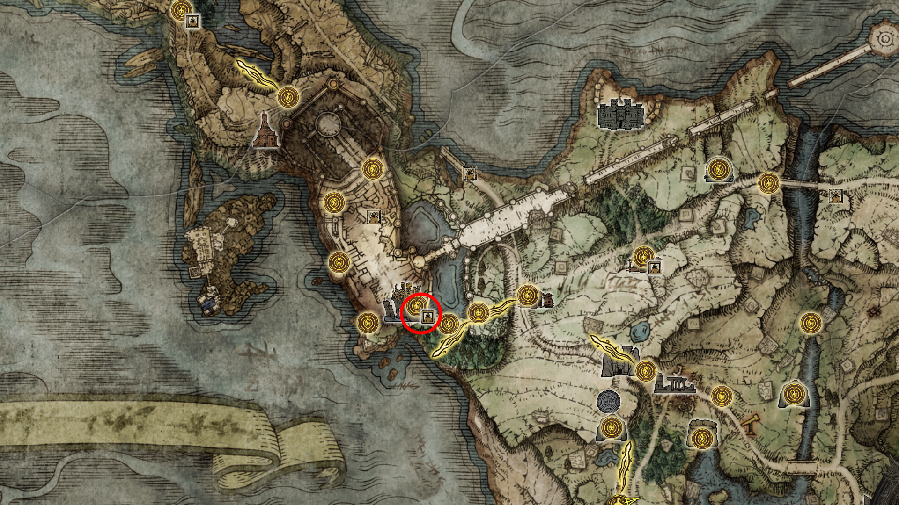
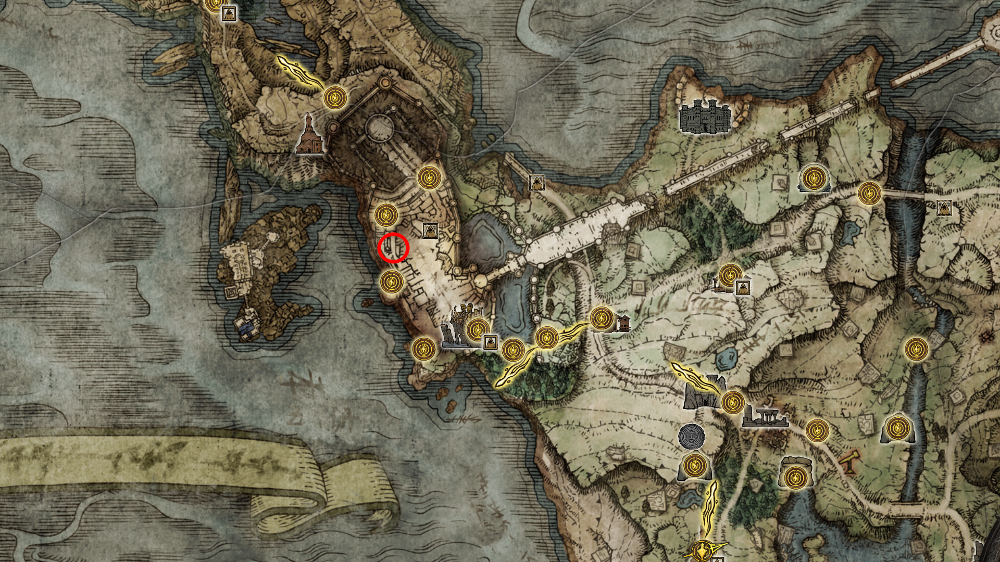
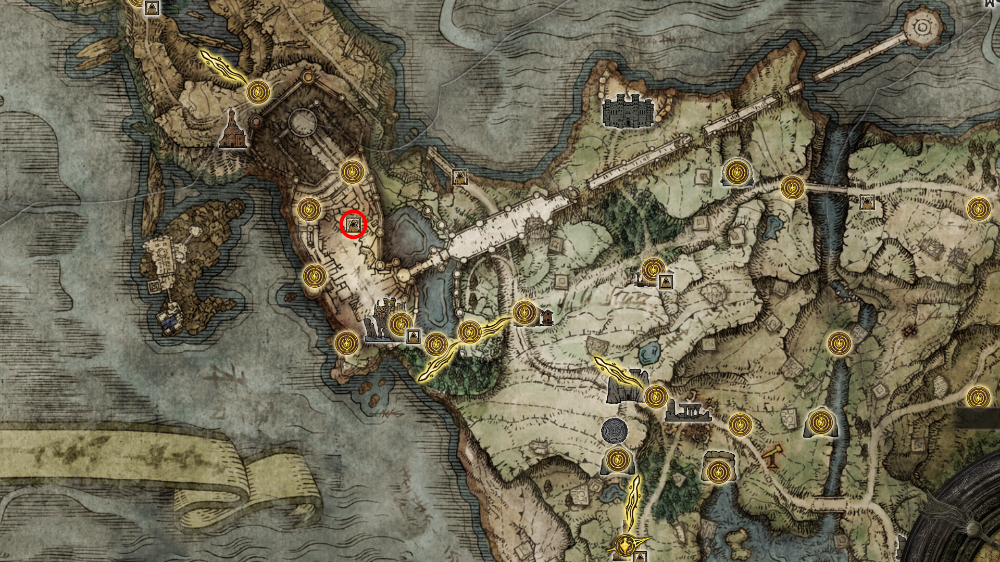
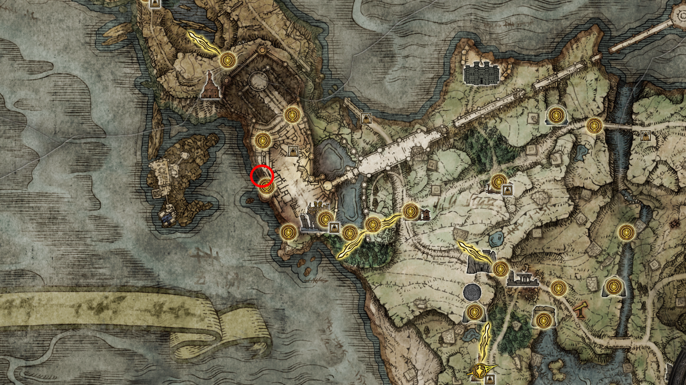
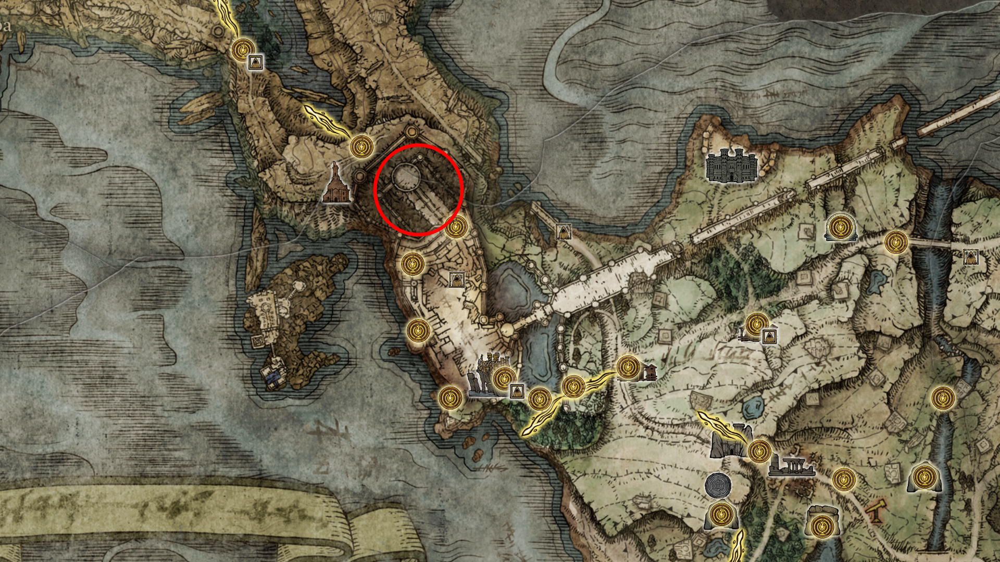
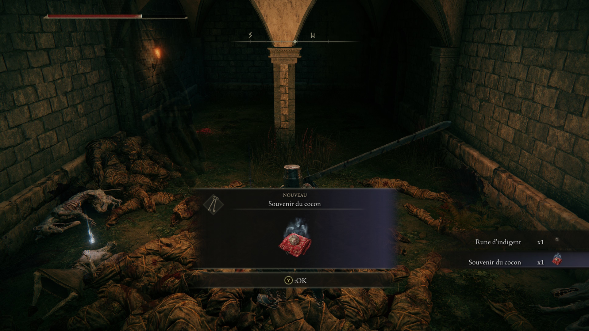
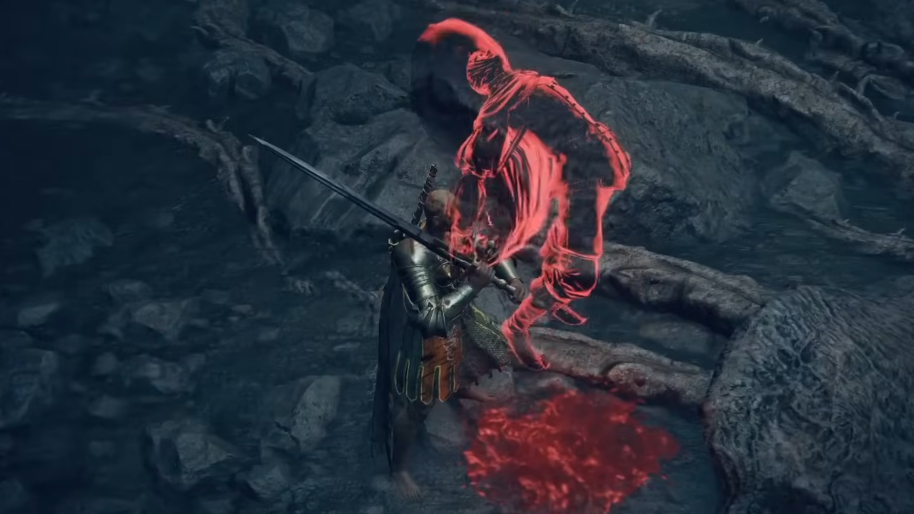
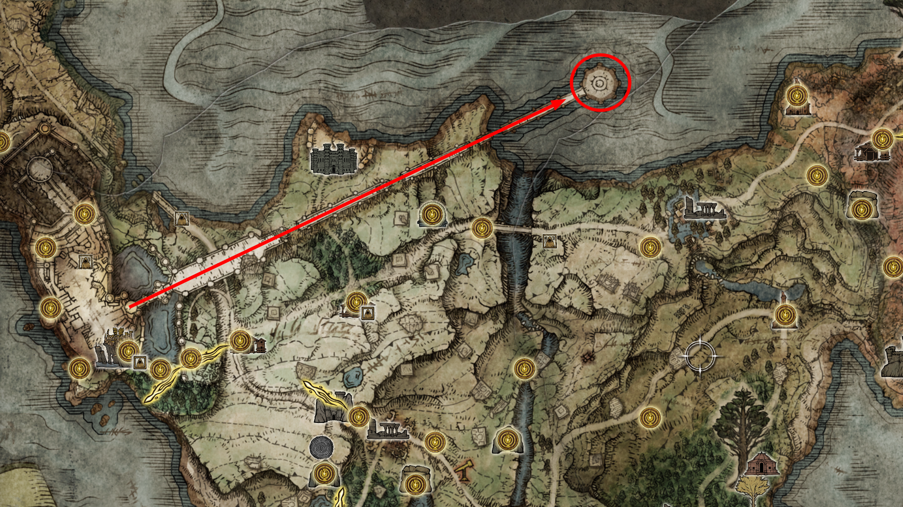

## IX. O Assalto ao Castelo Vento Ligeiro
Onde a arquitetura da Ordem Áurea se encontra com a decadência da Enxertia.

30. **O Portão de Stormveil:** Encontre o **Guardião Gostoc** na sala lateral. **Conselho:** Escolha a rota lateral (buraco na parede) para evitar a chuva de flechas do portão principal.

  
   
  <em>Figura 30: A Entrada Furtiva. Gostoc sugere o caminho pelas falésias. É a rota mais segura para coletar itens sem ser aniquilado pela artilharia pesada.</em>

31. **O Feiticeiro Rogier:** Nas torres centrais, encontre o **Feiticeiro Rogier** na capela. Converse com ele para garantir que ele se mova para a Mesa-Redonda mais tarde.

  
   
  <em>Figura 31: O Estudioso da Morte. Rogier oferece feitiçaria de pedrilhante e informações cruciais sobre a Noite das Facas Negras.</em>

32. **A Relíquia de Roderika:** No pátio vigiado pelo Cão de Caça e muitos corpos enxertados, recupere a **Lembrança da Crisálida**. 
    * *Nota de 100%:* Entregue este item para Roderika na Mesa-Redonda para que ela desbloqueie a sintonização espiritual avançada.

33. **A Guerreira Nepheli Loux:** Antes da névoa do chefe, em uma sala lateral perto dos Gigantes, encontre **Nepheli Loux**. Esgote seus diálogos para que ela possa ser invocada para a batalha final do castelo.

  
   
  <em>Figura 32: A Herdeira da Tempestade. Nepheli busca justiça contra os tiranos. Sua ajuda é fundamental para a progressão de sua questline que cruza todo o jogo.</em>

34. **O Segredo das Profundezas (Opcional Crítico):** Desça até o abismo abaixo das cozinhas do castelo para enfrentar o Espírito de Árvore Ulcerado. Ali, toque na mancha de sangue de Rogier e colete o **Talismã do Pústula do Príncipe da Morte**.

  
   
  <em>Figura 33: A Face da Morte. Abaixo do castelo reside uma manifestação da morte. Tocar a mancha de sangue de Rogier aqui é um passo invisível, mas necessário para a lore de 100%.</em>

35. **O Confronto Final: Godrick, o Enxertado:** Atravesse a névoa com a ajuda de Nepheli. Derrote o Lorde de Stormveil para conquistar sua primeira **Grande Runa** e a **Lembrança do Enxertado**.

  
   
  <em>Figura 34: O Declínio de um Semideus. "Eu sou o Lorde de tudo que é dourado!" - A queda de Godrick marca o fim do prólogo e abre as portas para Liurnia dos Lagos.</em>

## X. O Epílogo da Tempestade: Consequências e Destinos
Com a queda de Godrick, os fios do destino começam a se entrelaçar. Não deixe o castelo sem antes selar os pactos com os sobreviventes.

36. **O Pisotear da Inveja:** Retorne à arena onde Godrick tombou. Você encontrará o **Guardião Gostoc** em um ato de profanação contra o corpo do ex-lorde. 
    * *Nota de Mestre:* Fale com ele até esgotar os diálogos. Embora deplorável, mantê-lo vivo garante recompensas raras no final da jornada.

37. **A Lembrança de Roderika:** Antes de partir, certifique-se de ter coletado a **Lembrança de Crisálidas** (encontrada em uma pilha de corpos vigiada por cães no pátio do castelo). 

  
   
  <em>Figura 37: O Relicário da Dor. Este item é a chave para despertar o verdadeiro potencial de Roderika como Sintonizadora de Espíritos na Mesa-Redonda.</em>

38. **Conclave na Mesa-Redonda:** Viaje para o Refúgio dos Maculados. 
    * **Nepheli Loux:** Encontre-a no andar inferior e receba o amuleto por sua bravura.
    * **Rogier:** Ele agora repousa na sacada. Receba sua espada e informações sobre o futuro.
    * **Leitora de Dedos Enia:** Pela primeira vez, os Dois Dedos permitirão sua entrada. Enia trocará a Lembrança do Enxertado por armas de poder incomensurável.

39. **O Sangue de Rogier:** Desça novamente ao abismo de Stormveil, onde reside o rosto da morte. Toque na **Mancha de Sangue** de Rogier para presenciar o momento em que ele foi amaldiçoado. 
    * *Passo Crítico:* Retorne à Mesa-Redonda, confronte Rogier sobre o ocorrido e depois busque o conforto de **Fia** para obter pistas sobre a "Faca Negra".

  
   
  <em>Figura 39: Fragmentos do Passado. O registro da queda de Rogier é um elo invisível que desbloqueia diálogos fundamentais para a lore da Noite das Facas Negras.</em>

40. **O Sumiço de Varré:** Retorne ao "Primeiro Passo". A Máscara Branca partiu, deixando apenas uma mensagem e o gesto **"Bravo!"**. Siga seu rastro em direção à Igreja da Rosa em Liurnia.

41. **O Olho de Hyetta:** Na sala de trono de Godrick, desça as escadas em direção à saída para Liurnia. Colete a **Uva de Shabriri**. 
    * *Nota de Platina:* Este item repugnante é o único meio de progredir na jornada da donzela cega **Hyetta**, que você encontrará logo à frente.

42. **A Ascensão da Runa:** Atravesse a Ponte da Torre de Limgrave e alcance a **Torre Divina de Limgrave**. No topo, restaure o poder da **Grande Runa de Godrick**.

  
   
  <em>Figura 40: O Despertar do Poder. Com a Grande Runa restaurada, você agora possui o vigor necessário para enfrentar as névoas de Liurnia dos Lagos.</em>

---
[🏠 Retornar ao Guia Principal](../README.md) | [🌊 Prosseguir para Liurnia (Em breve)](../03_liurnia_of_the_lakes/route.md)