# 🗺️ Rota de Navegação: Liurnia dos Lagos
Onde a névoa encontra a magia e os destinos se cruzam nas margens do pântano.

## I. O Despertar no Penhasco
A saída dos fundos do Castelo Vento Ligeiro revela a vastidão azul de Liurnia. Antes de descer às águas, dois aliados aguardam sua atenção.

1.  **O Reencontro com Boc:** Logo na primeira Graça ("Penhasco com Vista do Lago"), você encontrará o seu alfaiate leal. Converse com **Boc** para confirmar que ele seguiu sua jornada com segurança após os eventos em Limgrave.

2.  **A Donzela da Luz Distante:** Próxima à mesma Graça, a cega **Hyetta** busca orientação. 
    * *Ação de Quest:* Entregue a **Uva de Shabriri** (coletada na sala de trono de Godrick). Este é o primeiro passo para a complexa linha de missões do Frenesi.

  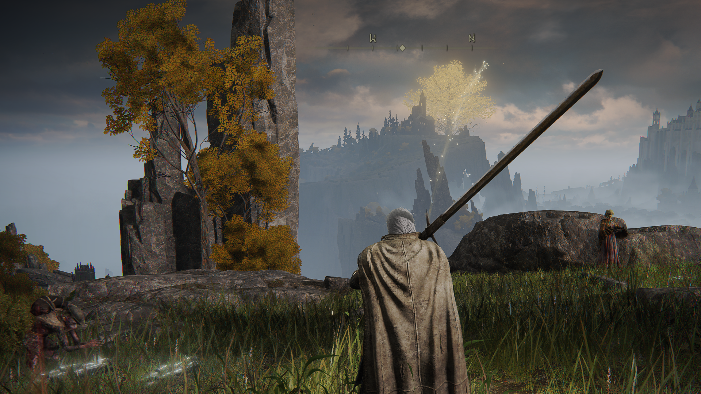
   
  <em>Figura 1: O Horizonte de Liurnia. No penhasco inicial, o destino de Boc e a jornada de Hyetta começam a se entrelaçar sob a sombra da Academia.</em>

---

## II. Cartografia das Águas
Liurnia é vasta e fácil de se perder entre os juncos e a névoa. Para uma navegação eficiente, priorize a recuperação dos mapas antes de explorar as ruínas.

3.  **Mapa (Liurnia, Leste):** Siga pela estrada principal que desce do penhasco em direção ao norte. O pilar do mapa está localizado logo após o acampamento de soldados, na margem do lago.
    * *Ponto de Referência:* Próximo à Graça "Margem do Lago de Liurnia".

4.  **Mapa (Liurnia, Norte):** Continue cavalgando em direção ao centro do pântano, rumo à Academia de Raya Lucaria. O pilar encontra-se próximo às "Ruínas do Bastião do Templo", em uma área inundada com estruturas submersas.

  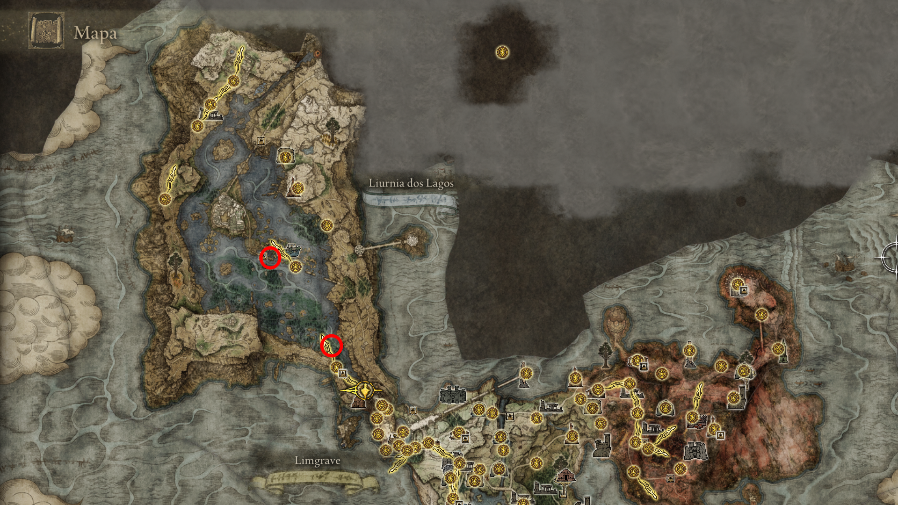
   
  <em>Figura 2: Domínio Geográfico. Desbloquear ambos os fragmentos de mapa revelará a complexa rede de ilhas e o caminho para o Elevador de Dectus e a Mansão Caria.</em>

> [!TIP]
> **Estratégia de Exploração:** Com os mapas em mãos, você notará que Liurnia é dividida em três grandes faixas: a margem leste (estrada), o centro (pântano) e a margem oeste (falésias). Foque primeiro na margem leste para progredir nas missões iniciais de NPC.

---

## III. O Círculo de Proscritos e a Academia
A travessia pelo pântano revela almas em busca de redenção e mercadores de intenções duvidosas.

5.  **A Igreja de Irith (Thops):** Localizada logo na saída de Stormveil. Encontre o **Feiticeiro Thops** e ouça seu lamento sobre a exclusão da Academia. 
    * *Ação de Quest:* Ele solicitará uma Chave de Pedrilhante. **Nota:** Você precisará de uma segunda chave mais tarde para completar sua jornada; guarde esta informação.

  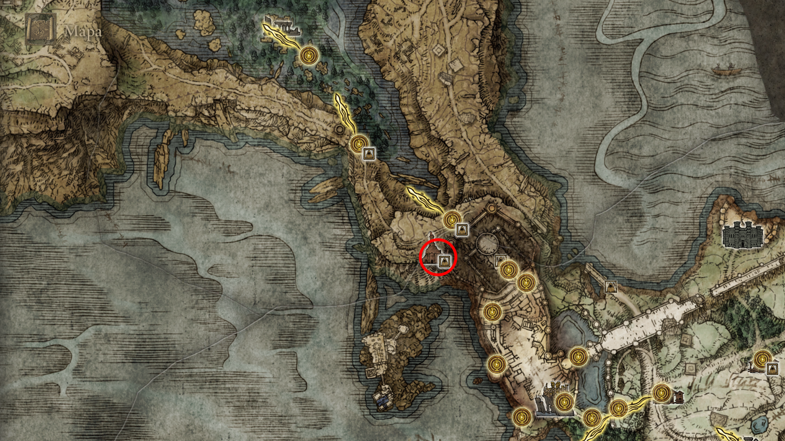
   
  <em>Figura 3: Localização da Igreja de Irith </em>

---    

6.  **O Retorno de Patches:** Encontre o infame **Patches** na "Ilha Panorâmica". Ele o informará sobre a Mansão Vulcânica e mencionará um método peculiar (e perigoso) de chegar lá através da Donzela de Ferro no fundo de Raya Lucaria.

  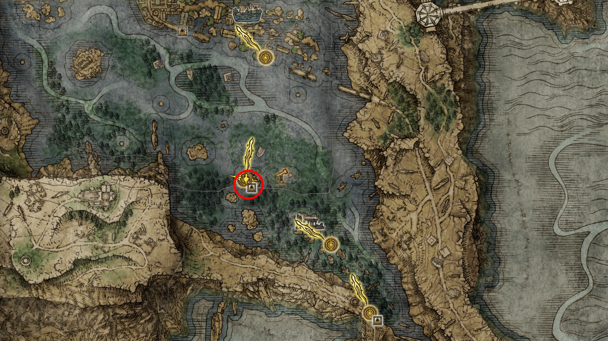
   
  <em>Figura 4: O Conselho do Trapaceiro. Patches continua sendo um guia ambíguo, mas suas pistas sobre a Mansão Vulcânica são o início de uma grande subtrama.</em>

---

7.  **A Mensageira Rya:** Próximo ao telescópio do pântano, encontre **Rya**, a recrutadora da Mansão Vulcânica. Ela foi roubada e solicita que você recupere seu colar valioso.
    * *Postura de Maculado:* Seja gentil e aceite ajudá-la. Esta é a porta de entrada para uma das áreas mais complexas do jogo.    

  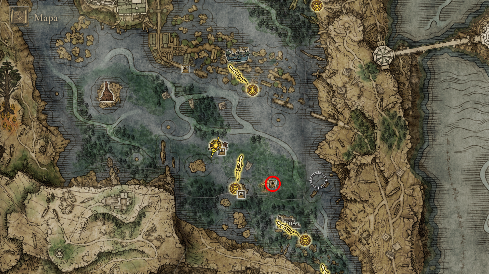
   
  <em>Figura 5: Rya, a recrutadora da Mansão Vulcânica</em>

---

8.  **Negociações na Cabana do Camarão Cozido:** Siga para o noroeste até encontrar o **Arruaceiro**. 
    * *Ação Crítica de 100%:* **NÃO O MATE.** Compre o colar de Rya por 1000 runas. 
    * *Continuidade:* Após recuperar o colar, compre um **Camarão Cozido (600 runas)**. Continue conversando com ele até ganhar o gesto **"Pernas Cruzadas"**. 
    * *Resultado:* Retorne e entregue o colar para Rya para receber o Convite da Mansão Vulcânica.

  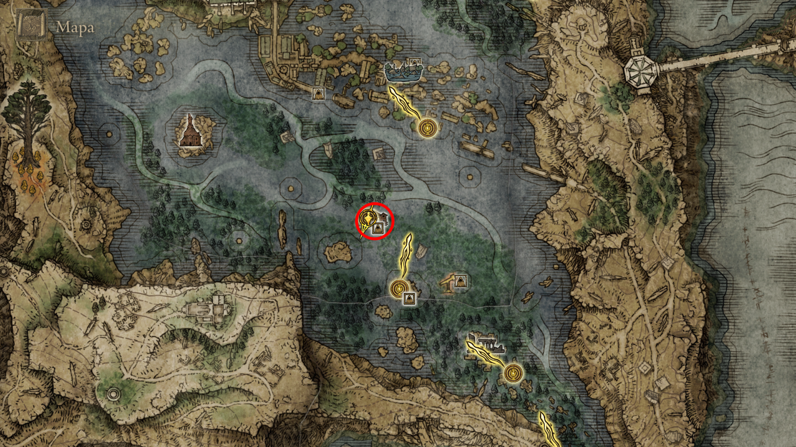
   
  <em>Figura 6: Aliança Inesperada. O Arruaceiro parece um bruto, mas sua amizade (e seus itens de buff) são cruciais para sobreviver a confrontos difíceis no futuro.</em>

> [!CAUTION]
> **Aviso de Ordem:** Certifique-se de comprar o camarão do Arruaceiro **antes** de avançar muito na quest da Mansão Vulcânica. Criar o laço de amizade com ele agora é o que garante a presença dele em Leyndell mais tarde.

---

9.  **O Lamento de Diallos:** Na "Cidade do Portão da Academia", você encontrará o nobre **Diallos** sobre um telhado, lamentando a morte de Lanya. 
    * *Nota de Quest:* Este encontro move a história da Casa Hoslow e se conecta diretamente com a Mansão Vulcânica.  

  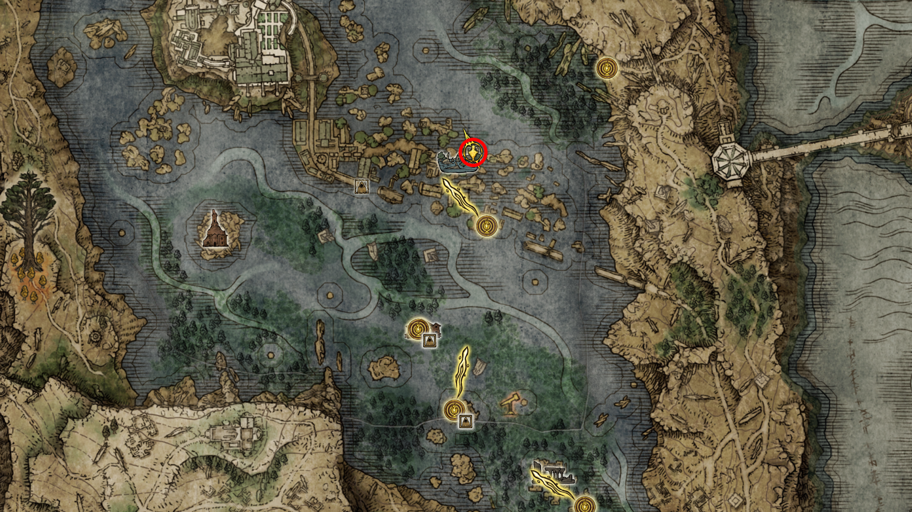
   
  <em>Figura 7: O Lamento de Diallos</em>

---

10. **A Igreja da Rosa (Varré da Máscara Branca):** Encontre Varré na estrutura em ruínas no pântano a oeste da Academia. Ele questionará sua visão sobre os Dois Dedos.
    * *Dica de Suporte:* Varré entregará os Dedos Sangrentos Purulentos. 
    * *Nota de Offline:* Não é obrigatório realizar as invasões multiplayer neste momento. Existe um NPC invasor em Altus que permite progredir nesta quest sem conexão de rede, mantendo sua integridade de 100% em qualquer modo de jogo.

  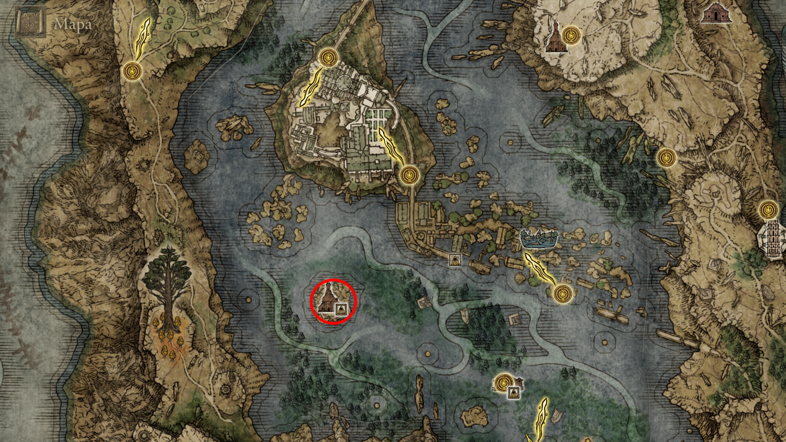
   
  <em>Figura 8: A Igreja da Rosa (Varré da Máscara Branca).</em>

---

11. **O Domínio Geográfico Completo e a Heresia de Adan:** Cavalgue em direção à margem oeste do lago para localizar o último pilar de mapeamento e enfrentar o guardião do fogo.

* **Mapa (Liurnia, Oeste):** Localizado na estrada que sobe em direção às falésias ocidentais. Com este fragmento, toda a bacia de Liurnia estará revelada.
* **Item Lendário:** **Chama do Deus Caído [🏆 PLATINA]**. No topo do platô, acesse o **Cárcere Eterno do Malfeitor** para derrotar Adan, o Ladrão do Fogo.
* **Dica:** O encantamento cria uma esfera de fogo lenta que persegue o alvo. No combate, seja agressivo para interromper Adan, pois ele possui pouca estabilidade (poise) e pode ser facilmente atordoado.

  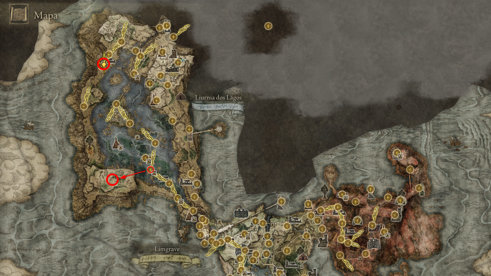
   
  <em>Figura 9a: Mapeamento e Sangue. A revelação do setor oeste permite localizar com precisão a entrada para a Vila dos Albinaúricos.</em>

    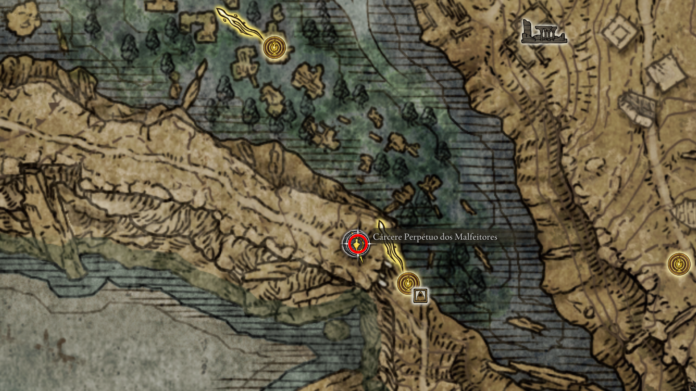
     
    <em>Figura 9b: O Pecado de Adan. A conquista deste feitiço é um passo obrigatório para o troféu de colecionador de magias lendárias.</em>

---

## IV. As Sombras da Vila dos Albinaúricos
Um local de tragédia e segredos guardados por disfarces.

12. **O Caminho para a Vila:** A vila encontra-se sob o imenso platô ao sul de Liurnia. 
    * **Logística de Viagem:** Para otimizar o tempo, teleporte-se para a Graça **"Margem do Lago de Liurnia"** (Leste) ou **"Ilha Panorâmica"** e siga cavalgando em linha reta para o sudoeste. O terreno é pantanoso e escuro, mas a subida para a vila é sinalizada por fogueiras distantes.

13. **O Encontro com Nepheli Loux:** Sob a ponte natural de pedra que leva à Vila dos Albinaúricos, você encontrará **Nepheli Loux** sentada em meio ao desespero. 
    * *Ação de Quest:* Esgote todos os seus diálogos. Ela expressará seu horror pelo massacre cometido. Falar com ela aqui é o gatilho necessário para que ela apareça na Mesa-Redonda (no andar inferior, perto do ferreiro) após a limpeza da vila.

14. **O Segredo de Albus:** Suba a colina da vila, passando pelas casas em ruínas, até encontrar um pote solitário próximo a uma parede de pedra no final do caminho. Golpeie o pote para revelar o velho **Albus**.
    * *Item Crítico de Platina:* Ele lhe entregará a **Metade Direita do Medalhão Secreto da Árvore Sacra (Haligtree)**. 
    * *Atenção:* Este item é obrigatório para acessar o Campo de Neve Consagrado, a Árvore Sacra e enfrentar a **Malenia, Espada de Miquella**.

  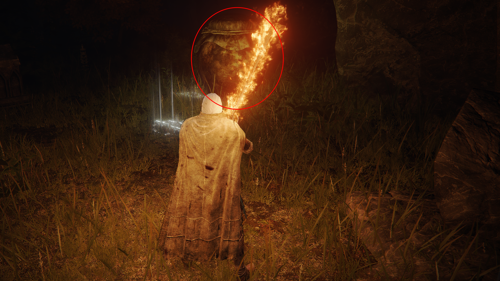
   
  <em>Figura 10: O Segredo de Haligtree. Entre o lamento de Nepheli e o disfarce de Albus, esconde-se a chave para as terras consagradas. Proteja o medalhão a todo custo.</em>

---

15. **O Julgamento do Presságio e o Retorno a Mesa Redonda:** Atravesse a ponte de pedra ao lado de onde encontrou Albus para enfrentar o **Presságio Assassino (Omenkiller)**.
    * *Combate Aliado:* Invoque **Nepheli Loux** para a batalha. Ao derrotá-lo, você obterá o **Talismã de Nó do Crisol**.
    * *Verificação de Segurança:* Após a luta, faça um teleporte rápido para a Graça da Vila e confira se Nepheli ainda está lá. Se ela tiver partido, o ciclo da vila está concluído.

16. **O Ajuste de Contas na Mesa-Redonda:** Ao retornar a Mesa Redonda, prepare-se para eventos simultâneos:
    * **Invasão de Ensha:** Como mencionado, ele o atacará imediatamente por causa do Medalhão. Derrote-o.
    * **Diálogo com Gideon (O Sabe-Tudo):** Fale com ele sobre o paradeiro da Lanya e sobre o estado de Nepheli.
    * **O Lamento de Diallos:** Encontre Diallos novamente. Ele estará transtornado pela descoberta do corpo de Lanya no pântano, jurando vingança contra os recrutadores da Mansão Vulcânica.
    * **Conforto de Nepheli:** Encontre Nepheli no andar inferior, perto do Ferreiro Hewg. Ela estará desolada pelo que presenciou na vila.

17. **A Queda de Edgar, o Vingador:** Siga para o extremo oeste de Liurnia até a **Cabana do Vingador**. 
    * *O Confronto:* Ao se aproximar da cabana, você será invadido por **Edgar, o Vingador**. Tomado pela loucura após os eventos da Península das Lágrimas, ele o atacará em um estado de frenesi.
    * *Item Crítico de Quest:* Ao derrotá-lo, você obterá a segunda **Uva de Shabriri**. Este item é indispensável para a progressão da linhagem dos Três Dedos.

  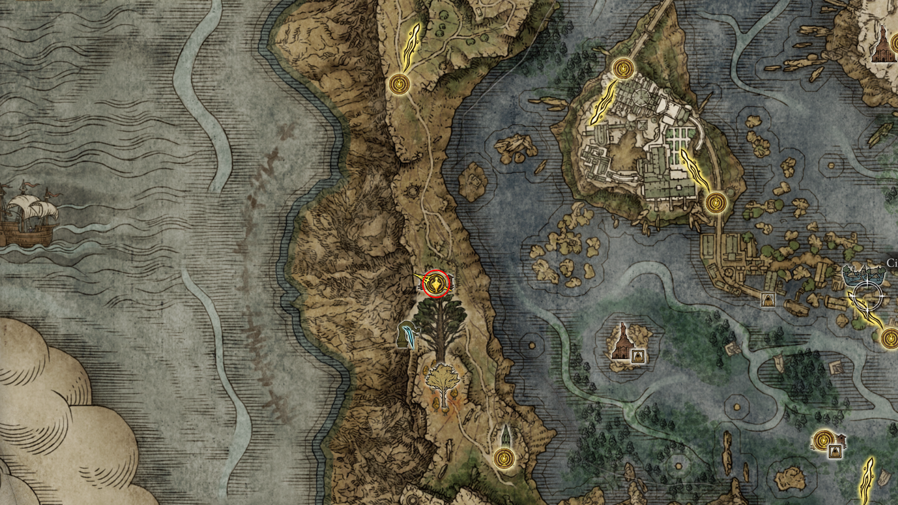
   
  <em>Figura 11: O Fim de uma Promessa. A dor da perda transformou o Castelão Edgar em um invasor implacável. A uva colhida aqui é o selo final de sua tragédia.</em>

---

## V. O Legado de Caria e as Sombras de Liurnia
Antes de invadir a Academia, é necessário consolidar as alianças com os servos de Ranni e encerrar pendências nas catacumbas para garantir os itens de Platina.

18. **Os Quatro Campanários:** Suba a colina no extremo oeste. No topo, abra o baú para obter a **Chave de Espada Imbuída**. Use-a no portal que diz "Precipício da Antecipação".
    * *O Acerto de Contas:* Derrote o enxertado inicial. No castelo, colete as cinzas **Falcão da Tempestade Deenh** e o item **Rei Falcão da Tempestade**.
    * *Nota de Sangue:* Se estiver seguindo a quest de Varré, use o cadáver da donzela aqui para tingir o pano branco.

  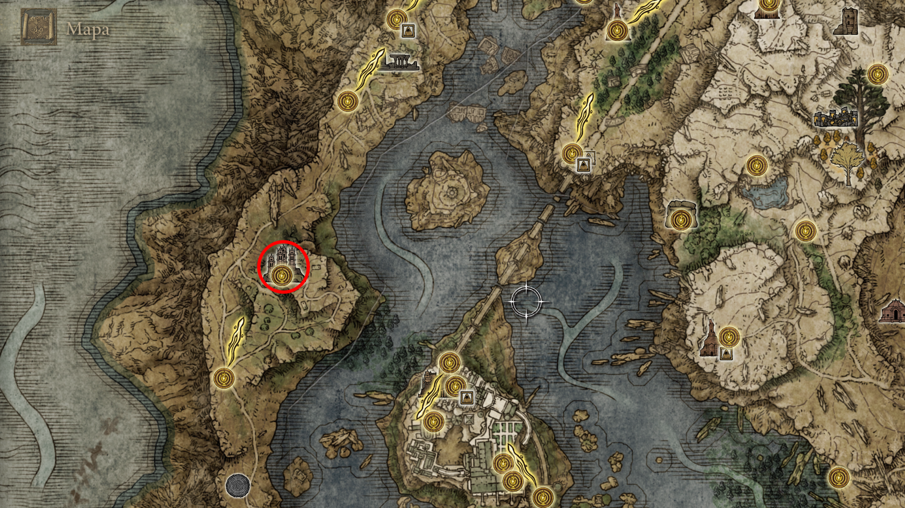
   
  <em>Figura 12: O Retorno às Origens. O Rei Falcão é o item que restaurará a vontade de lutar de Nepheli Loux.</em>

---

19. **O Conselheiro Iji:** Siga para o norte até a Graça "Estrada para a Mansão". Fale com o gigante Iji e mencione que **Blaidd** o enviou para liberar itens exclusivos.

  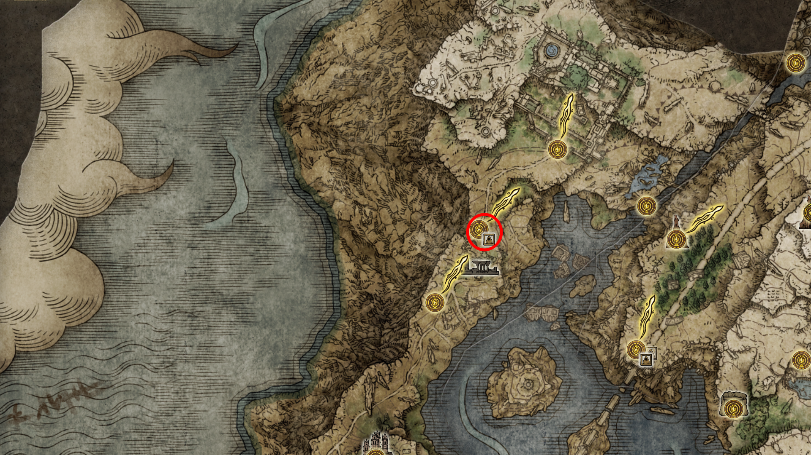
   
  <em>Figura 13: O Conselheiro Iji</em>

---

20. **Igreja da Inibição (Quest da Hyetta):** Prepare-se para o acúmulo de Loucura. Enfrente a invasão de **Vyke dos Dedos Feridos**. 
    * *Drop Crítico:* Ele derruba a **Uva Dactilar**, necessária para a fase final da Hyetta.

  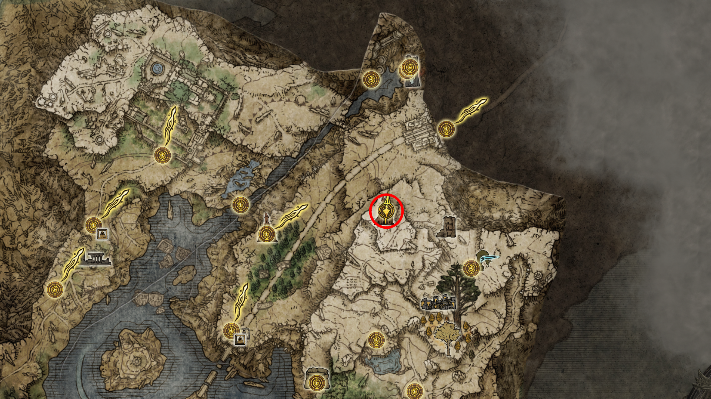
   
  <em>Figura 14: Igreja da Inibição</em>

---

21. **Catacumbas das Facas Negras:** * **O Auxílio do Caçador:** Para o boss principal desta masmorra, você pode invocar o NPC **D, Caçador dos Mortos**. O sinal dourado dele estará disponível logo à frente da névoa, facilitando o controle de grupo contra os mortos-vivos.
    * *Boss Oculto:* Assassino da Faca Negra (atrás de uma parede ilusória no andar de cima). Drop: **Entalhe da Faca Negra**. (Nota: O sinal de D não alcança esta área oculta).
    * *Boss Principal:* Cavaleiro do Mausoléu. Drop: **Raiz da Morte**.

  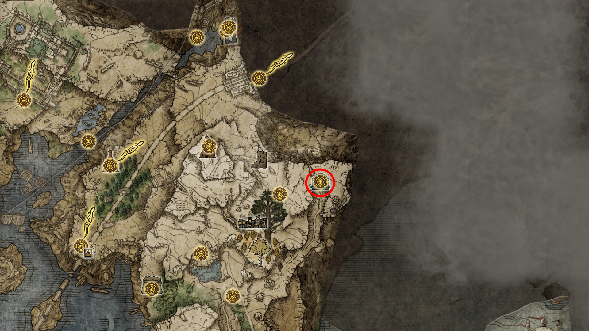
   
  <em>Figura 15: Justiça dos Mortos. Invocar D nesta catacumba não só facilita a batalha como reforça a lore de caçador de mortos-vivos do NPC.</em>

---

22. **O Juramento de Latenna:** Atravesse a "Caverna de Cristal à Beira-lago" até encontrar **Latenna** ao lado de seu lobo. Mostre a ela a metade do Medalhão Secreto de Albus para que ela se torne sua cinza de invocação.

  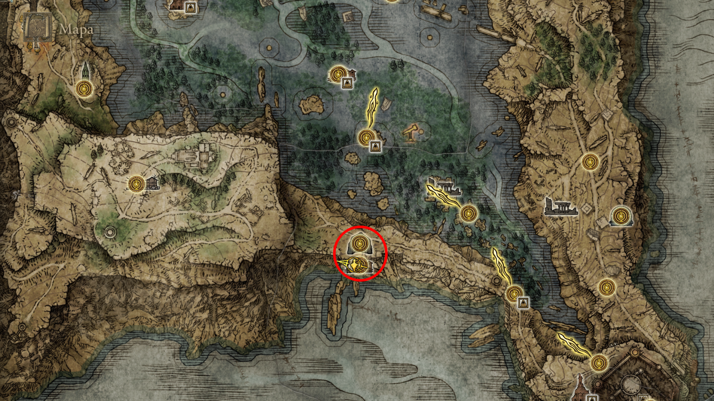
   
  <em>Figura 16: Aliança Albinaúrica. Latenna é fundamental para localizar a outra metade do medalhão no final do jogo.</em>

---
[🏠 Retornar ao Guia Principal](../README.md) | [🌊 Prosseguir para Academia de Raya Lucaria](../04_academy_of_raya_lucaria/route.md)