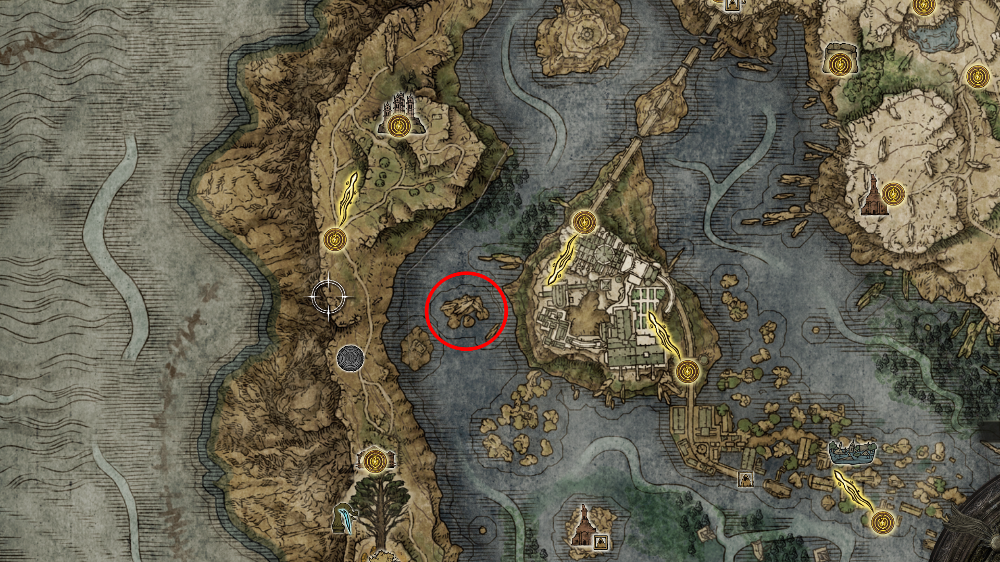
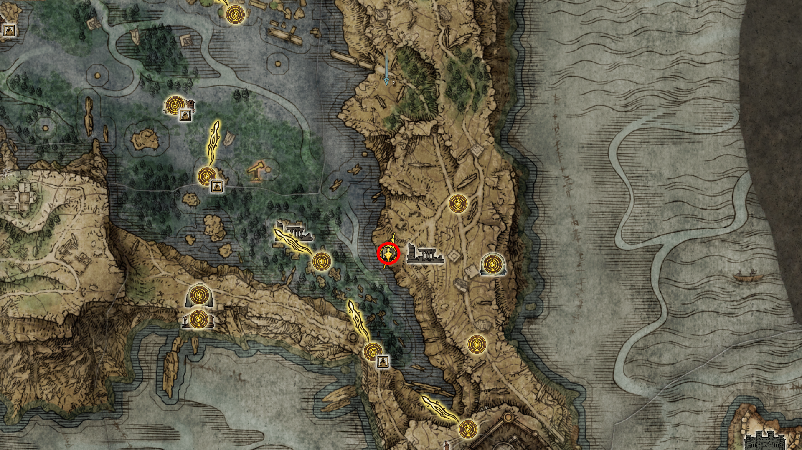
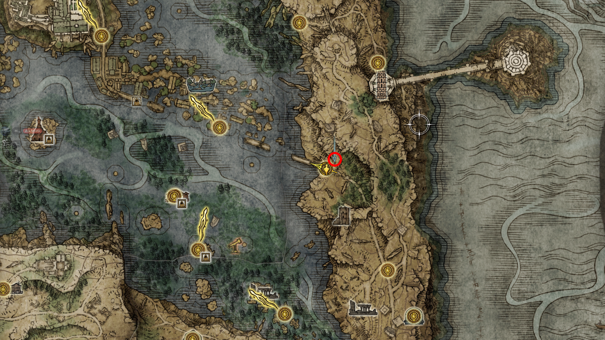
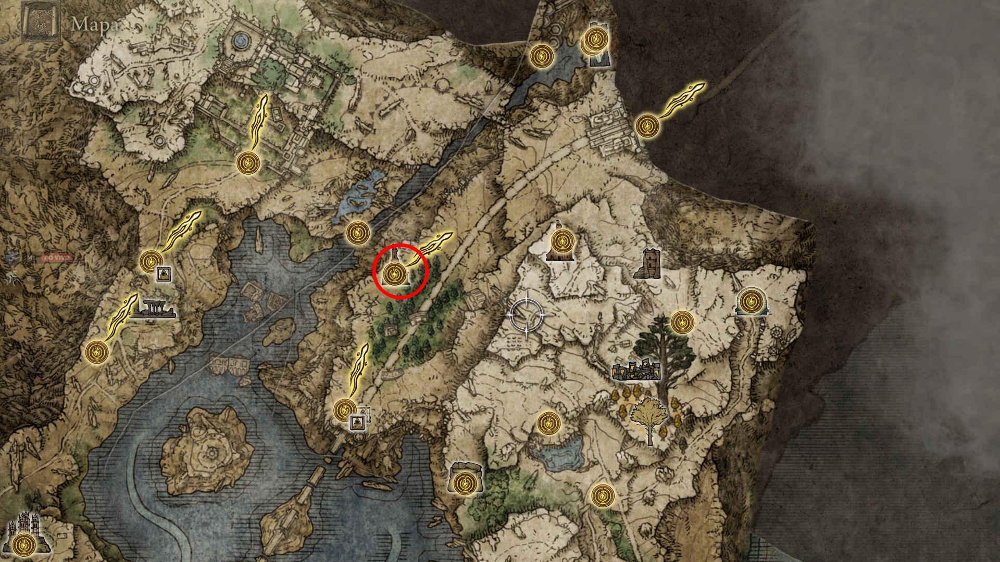
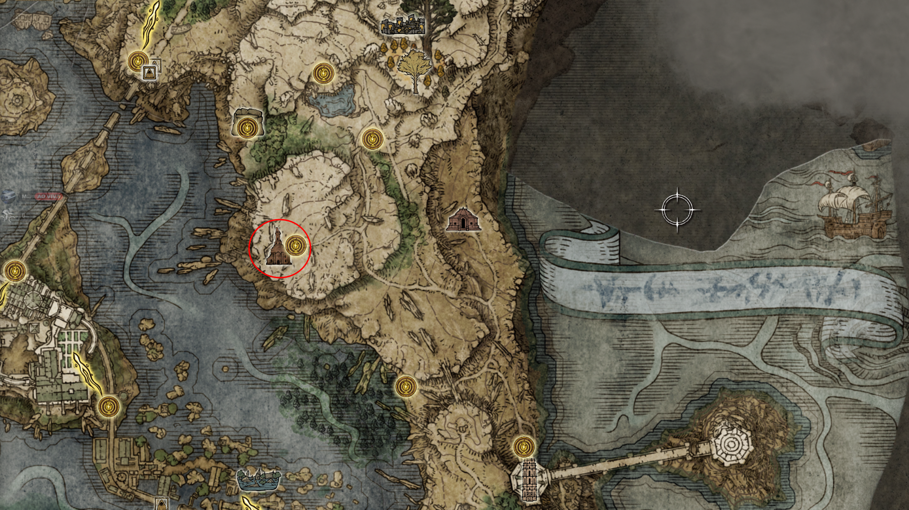
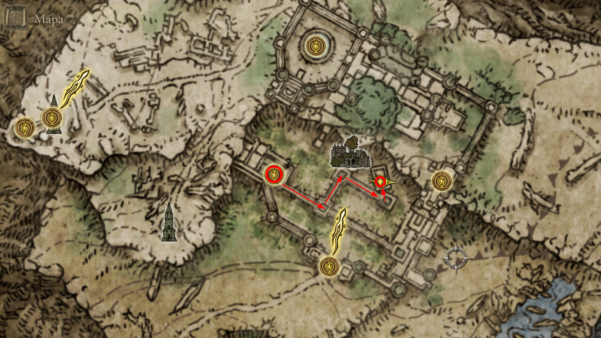
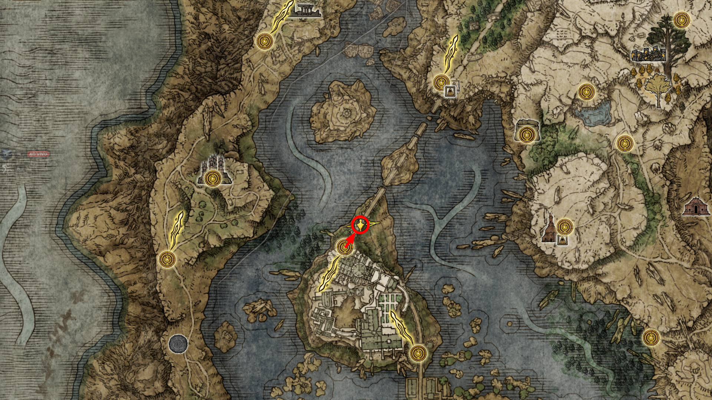
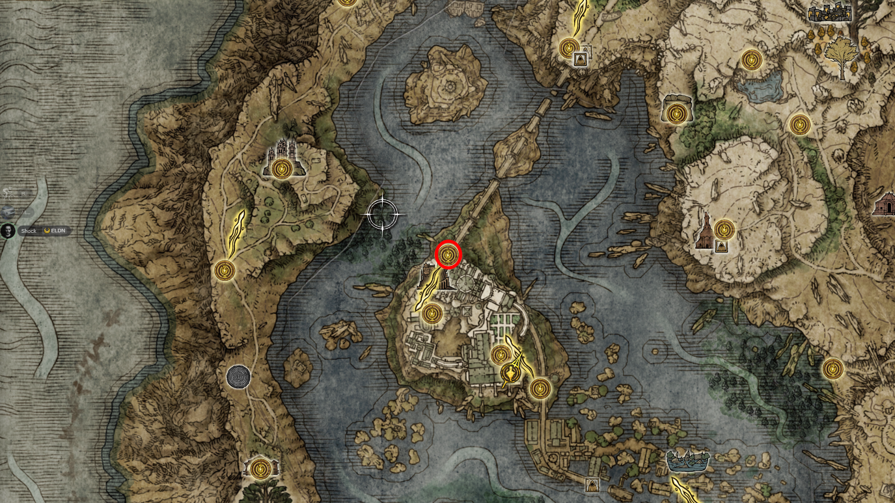
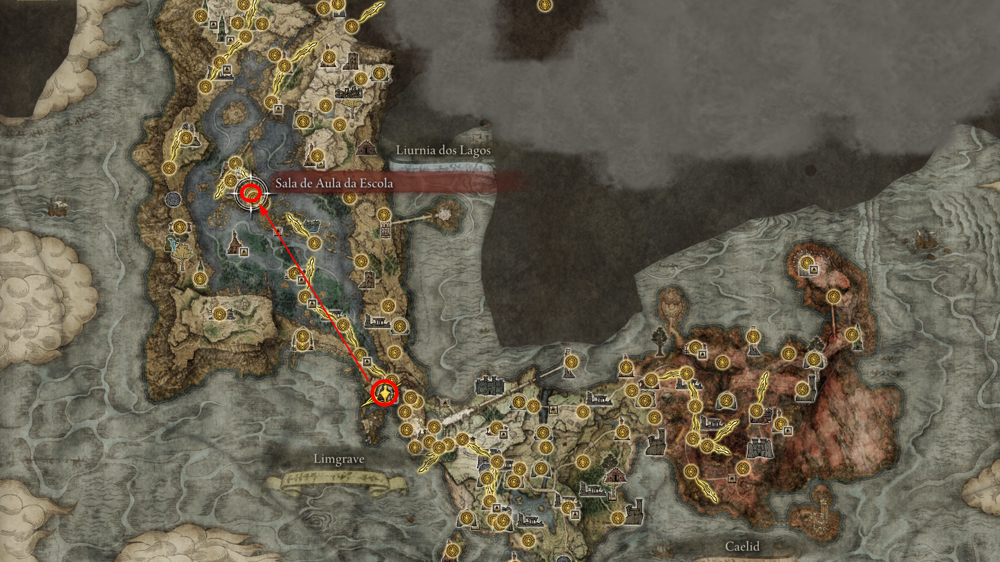
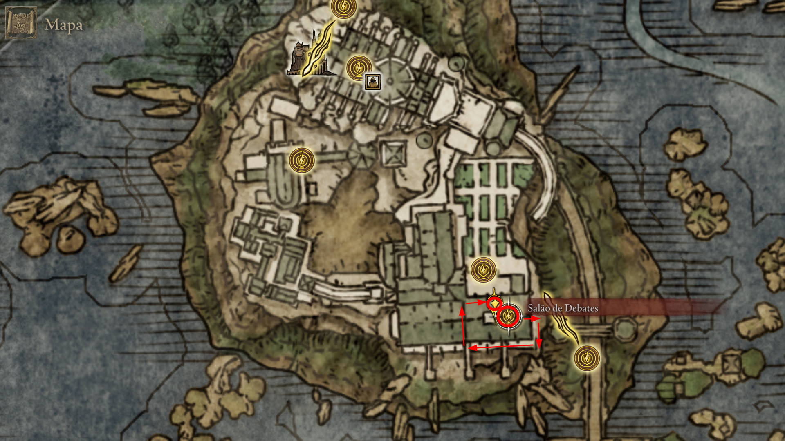

# 🗺️ Rota de Navegação: Academia de Raya Lucaria
Focado na invasão da Academia, confronto com o Lobo Vermelho e Rennala.

## VI. Raya Lucaria: O Selo e a Ascensão de Rennala

23. **A Chave de Pedrilhante:** Vá para a ilha a oeste da Academia. O item está no cadáver atrás do **Dragão Smarag**. (Dica: Você pode coletar e fugir sem lutar).

  
   
  <em>Figura 17: Localização da Chave de Pedrilhante.</em>

---

24. **A Peregrinação Final de Hyetta:**
    Para progredir na linhagem dos Três Dedos, você deve encontrar Hyetta em três locais distintos de Liurnia após o encontro inicial no penhasco.

    * **Etapa 1: Ruínas Purificadas** Entregue a uva encontrada no porão das próprias ruínas. Hyetta estará esperando na parte externa, próxima à borda do lago.
    

      
       
      <em>Figura 18: O Despertar da Fé. A entrega da uva nas ruínas move Hyetta para as proximidades da Academia.</em>
    

    * **Etapa 2: Portão da Academia** Localizada ao norte da "Cidade do Portão da Academia". Aqui ocorre o diálogo crucial: **Conte a verdade sobre as uvas (olhos humanos)**. 
        > [!IMPORTANT]
        > **Ciclo de Diálogo:** Após contar a verdade, ela terá um mal-estar. Descanse na Graça próxima e fale com ela novamente até que ela aceite sua missão como Donzela.
    

      
       
      <em>Figura 19: A Amarga Verdade. Revelar a natureza das uvas é um passo obrigatório para a aceitação do destino da NPC.</em>
    

    * **Etapa 3: Igreja de Bellum** Siga para a estrada ao norte que leva ao Grande Elevador de Dectus. Entregue a **Uva de Digitais** (obtida ao derrotar o invasor Vyke na Igreja da Inibição).
    

      
       
      <em>Figura 20: O Selo de Digitais. Com esta entrega, a jornada de Hyetta em Liurnia se completa, aguardando o encontro final nos esgotos da Capital.</em>
    

---

25. **Igreja dos Votos (Miriel):** Localizada no alto do platô leste de Liurnia. Encontre o **Miriel, Pastor dos Votos**, a tartaruga gigante que guarda o conhecimento sobre as linhagens de Rennala e Radagon.
    * *Absolvição:* Aqui você pode usar Orvalho Celestial na estátua para remover a agressividade de NPCs caso tenha atacado algum por engano.
    * *Item de Quest (Boc):* No baú lateral da igreja, colete o **Kit de Costura de Ouro** e a **Agulha de Ouro**. 
        > [!TIP]
        > **Costura Real:** Estes itens permitem que o **Boc** altere as roupas dos Semideuses (como a de Radahn), desbloqueando diálogos exclusivos e finalizando sua linha de missões com honra.

  
   
  <em>Figura 21: O Guardião dos Segredos. Miriel oferece perdão e conhecimento, enquanto o baú ao fundo guarda as ferramentas necessárias para a redenção do Alfaiate Boc.</em>

---

26. **Mansão Caria: Espada da Noite e da Chama [LENDÁRIO]**
Antes de avançar para a Academia, siga para o norte de Liurnia até a **Mansão Caria**. Esta arma é essencial para o troféu de colecionador de armas lendárias.

**Descrição:** Partindo da Graça "Nível Inferior da Mansão", caminhe pelas passarelas superiores. Olhe para a esquerda (norte) para encontrar um telhado abaixo; pule nele, siga para o próximo nível e desça pela escada para encontrar o baú.

**Lore:** Uma das armas lendárias de "Entre-terras". Simboliza a amizade histórica entre os Astrólogos e os Gigantes de Fogo. Permite usar tanto o feitiço Cometa de Azur quanto uma técnica de fogo devastadora.

* **Item:** **Espada da Noite e da Chama**.
* **Dica:** Esta arma exige fé e inteligência. É obrigatória para a platina. Cuidado com as mãos gigantes ("Fingercreepers") no jardim antes de subir para as passarelas.

    
     
    <em>Figura 22: O Tesouro da Mansão Caria. A localização desta espada lendária é um desvio obrigatório para quem busca a platina.</em>

---

27. **Auxílio a Yura (O Caçador de Dedos Sangrentos):** Após atravessar o selo principal da Academia, não siga direto para o elevador. Caminhe pela ponte em direção ao norte (atravessando o selo azul sem interagir).
    * *O Confronto:* Localize a **marca de invocação vermelha** no chão. Ajude Yura a derrotar o Assassino de Ravenmount.
    * *Recompensa:* Após a vitória, receba as Cinzas de Guerra: **Névoa de Rapina** ao falar com Yura na ponte.

  
   
  <em>Figura 23: Sangue na Academia. Ajudar Yura nesta ponte é o penúltimo passo de sua jornada antes do encontro trágico em Altus.</em>

> [!CAUTION]
> **Aviso de Localização:** A marca de invocação fica na parte metálica da ponte após o primeiro selo. Olhe atentamente para o chão antes de prosseguir.

---

28. **A Ascensão de Raya Lucaria:**
    A invasão à Academia exige atenção para não perder itens de progressão de quest.

    * **O Guardião da Academia:** Derrote o **Lobo Vermelho de Radagon**. Ele bloqueia o acesso ao pátio interno.
    

      
       
      <em>Figura 24: O Sentinela de Pedrilhante. Derrotar o Lobo libera o Ponto de Graça "Sala de Debate".</em>
    

    * **O Segredo dos Candelabros:** Partindo do pátio interno, suba as escadas à esquerda, pule para os telhados e siga até as vigas da **Igreja do Cuco**.
    * **Item de Quest (Thops):** A **Segunda Chave de Pedrilhante** estará em um corpo sobre um dos candelabros.
    

      
       
      <em>Figura 25: O Legado de Thops. Coletar esta chave é o requisito final para que Thops retorne à Academia.</em>
    

    * **Passo de Mestre:** Entregue a chave ao Thops na Igreja de Irith **antes** de derrotar Rennala.
    * Derrote **Rennala, Rainha da Lua Cheia** para liberar o Renascimento.    

---

29. **Ícone de Radagon [TALISMÃ LENDÁRIO]**
Após derrotar o Lobo Vermelho de Radagon, há um segredo importante no lado direito do pátio central.

**Descrição:** Saindo da "Sala de Debate", vire à direita no pátio, pule o muro e suba a escada de mão. Entre pela janela quebrada no andar superior da sala do chefe. O item está em um baú.

**Lore:** Um talismã lendário que retrata o campeão Radagon. Reduz o tempo de conjuração de feitiçarias e encantamentos. 

* **Item:** **Ícone de Radagon**.
* **Dica:** Obrigatório para o troféu "Talismãs Lendários". Essencial para acelerar animações de lançamento de magias ou milagres.

    
     
    <em>Figura 26: O Segredo da Sala de Debate. O Ícone de Radagon está escondido no andar superior, acessível apenas por rota externa.</em>

---
[🏠 Retornar ao Guia Principal](../README.md) | [🌌 Prosseguir para O Destino nas Estrelas Subterrâneas: Ranni e o Rio Siofra](../05_siofra_river/route.md)