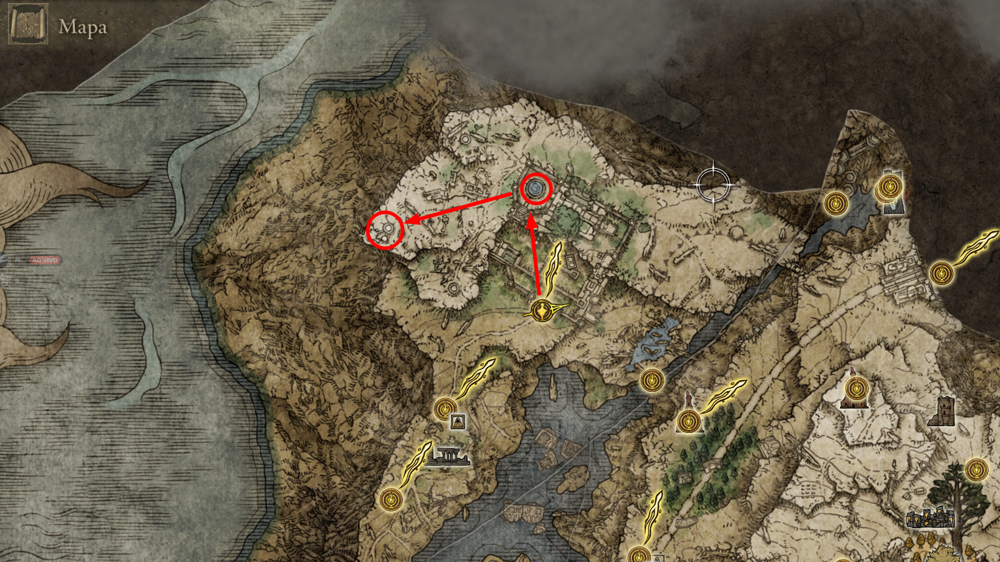
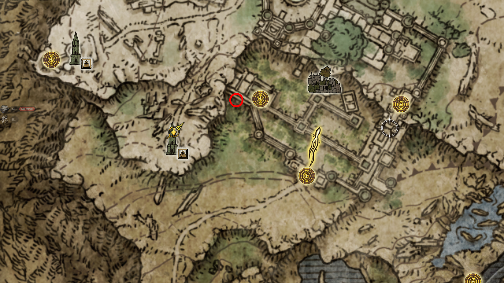
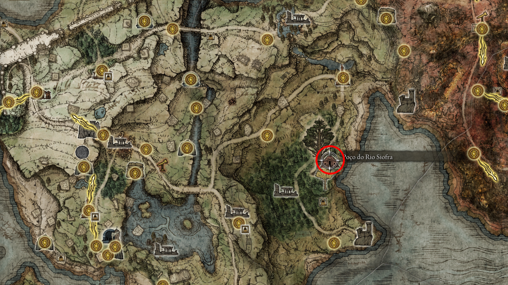
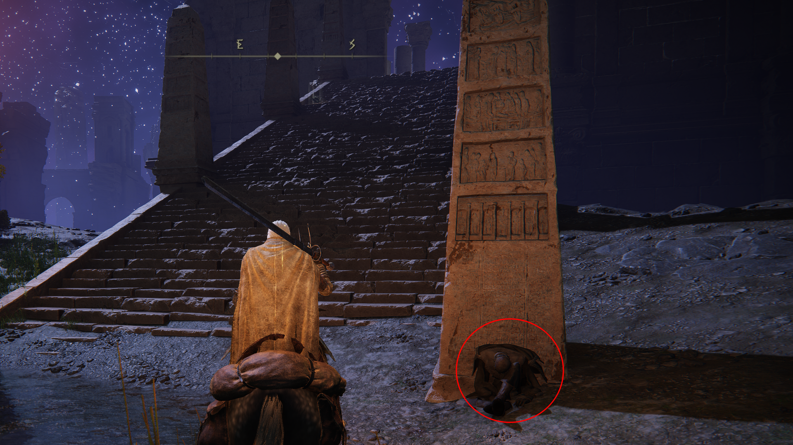
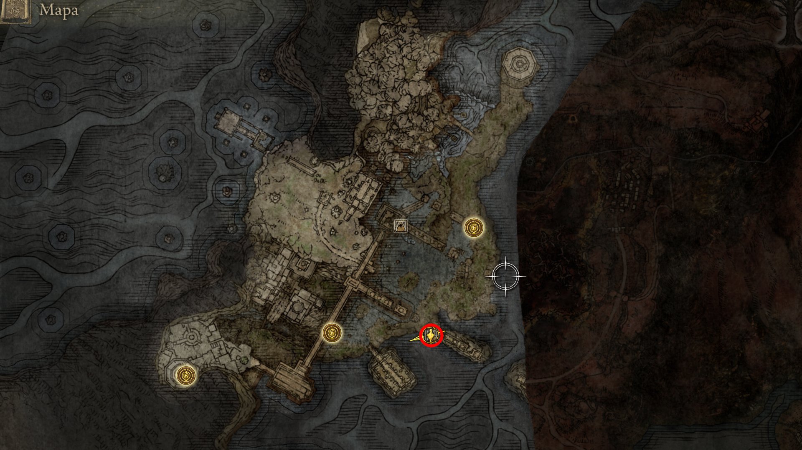

# 🌌 Rota de Navegação: O Firmamento Subterrâneo (Ranni & Siofra)

Esta etapa marca o início da maior linha de missões secundárias de *Elden Ring*. A descida ao Rio Siofra não é apenas uma jornada estética; é uma missão de reconhecimento ordenada pela Bruxa Ranni para localizar a cidade perdida de Nokron. 

Nesta rota, cruzaremos o destino de quatro NPCs fundamentais (**Ranni, Blaidd, Seluvis e Sellen**) enquanto garantimos conquistas de platina ligadas aos segredos ancestrais do subsolo.

> [!CAUTION]
> **Aviso de Dificuldade:** Os arqueiros ancestrais de Siofra possuem um alcance extremo e dano elevado. Recomenda-se o uso de cobertura e movimentação constante com o Torrente nas áreas abertas.

---

## VII. O Firmamento Subterrâneo o Rio Siofra

28. **Invasão à Mansão Caria e o Pacto das Três Irmãs:**

    * **O Confronto na Mansão:** Atravesse o pátio infestado de mãos e suba os níveis da mansão até a área do jardim circular.
    * *Chefe de Área:* Derrote a **Guarda Real Loretta**. A vitória desbloqueia o acesso à área "As Três Irmãs" (onde ficam as torres de Ranni, Seluvis e Renna).
    

      
       
      <em>Figura 25: O Caminho da Lua. Superar as defesas mágicas da Mansão Caria é o pré-requisito para encontrar a Bruxa Ranni.</em>
    

    * **O Segredo de Pidia (O Titeriteiro):** Após derrotar Loretta, partindo da Graça "Pátio Superior da Mansão Caria", siga para o penhasco a leste. Pule nos telhados da mansão e desça pelas plataformas até encontrar uma varanda secreta.
    * *Mercador Raro:* Fale com o servo **Pidia**. Ele vende itens indispensáveis, incluindo uma **Lágrima Larval** (para Respec) e o **Orvalho Celestial** (para Absolvição).
    

      
       
      <em>Figura 26: O Mercador Oculto. A rota de telhados para encontrar Pidia é um segredo valioso para o acúmulo de recursos raros no early game.</em>
    

    * **A Torre de Ranni:** Siga para a torre central. Suba o elevador e fale com **Ranni**. Jure lealdade. (Nota: Se você falou com Rogier anteriormente, mencione o interesse dele).
    * **Protocolo de Saída:** Para que a barreira mágica da torre desapareça, desça e fale com as projeções de **Iji**, **Seluvis** e **Blaidd**. Volte ao topo, fale com Ranni até ela entrar em sono profundo e a saída será liberada.

29. **A Trama de Seluvis e o Fim de Rogier:** Pegue a poção com Seluvis. 
    * Na Mesa-Redonda, fale com Rogier. Repita o ciclo de teleporte e descanso até ele entrar em sono profundo e deixar seu set completo e uma carta de despedida.

30. **O Abismo do Rio Siofra e a Pista de Nokron:** A jornada subterrânea começa na Floresta Nebulosa. Esta área é crucial para a progressão da Ranni e para a conquista de Platina do Espírito Ancestral.

* **A Entrada (Poço do Rio Siofra):** Localize o edifício circular na Floresta Nebulosa (Limgrave), próximo à Pequena Árvore Áurea. Pegue o elevador para uma descida épica ao subsolo.

  
   
  <em>Figura 27: O Portal para o Subsolo. O elevador na Floresta Nebulosa é o seu ponto de acesso para as estrelas subterrâneas.</em>

* **O Mapa e os 8 Pilares (Platina):** Ao chegar no nível principal do rio, colete o mapa no corpo na base da escadaria que leva ao Templo Sagrado. 
    * *Objetivo:* Você deve acender os 8 pilares de fogo espalhados pela região para desbloquear o boss **Espírito Ancestral**.

  
   
  <em>Figura 28: Iluminando o Abismo. Localização estratégica dos 8 pilares necessários para o troféu de platina desta área.</em>

* **O Encontro com Blaidd:** Siga pela margem leste, passando pelos arqueiros ancestrais, até encontrar Blaidd próximo a um penhasco.
    * *Diálogo Crítico:* Ele confirmará que Nokron está visível no alto, mas não há um caminho físico para chegar lá, movendo a investigação para o Seluvis.

  
   
  <em>Figura 29: O Lobo em Impasse. Blaidd é o seu guia nesta etapa; sem este diálogo, a quest da Ranni não avança para a fase de Caelid.</em>

31. **O Plano de Sellen:** Leve a carta de Seluvis para a feiticeira **Sellen** em Limgrave. Leve a resposta de volta para Blaidd no Rio Siofra. O próximo passo é o Festival de Radahn.

32. **A Tragédia de D e Fia:** Fale com Fia na Mesa-Redonda, entregue a adaga para **D**. Teleporte para fora e volte. 
    * Encontre o corpo de D na sala após o ferreiro. Fale com Fia e colete os itens. 
    * Fale com Enia para receber a **Bolsa de Talismã** final desta etapa.

---
[🏠 Retornar ao Guia Principal](../README.md) |  [🔥 Prosseguir para Caelid (Em breve)](#)