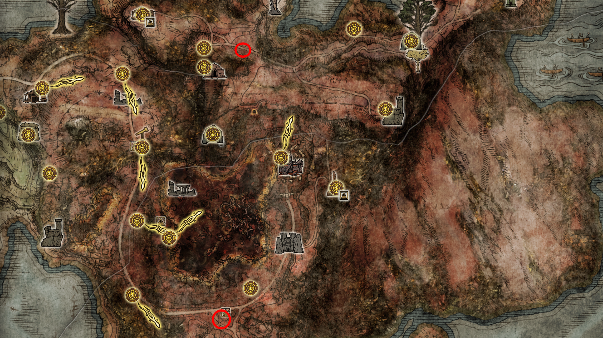
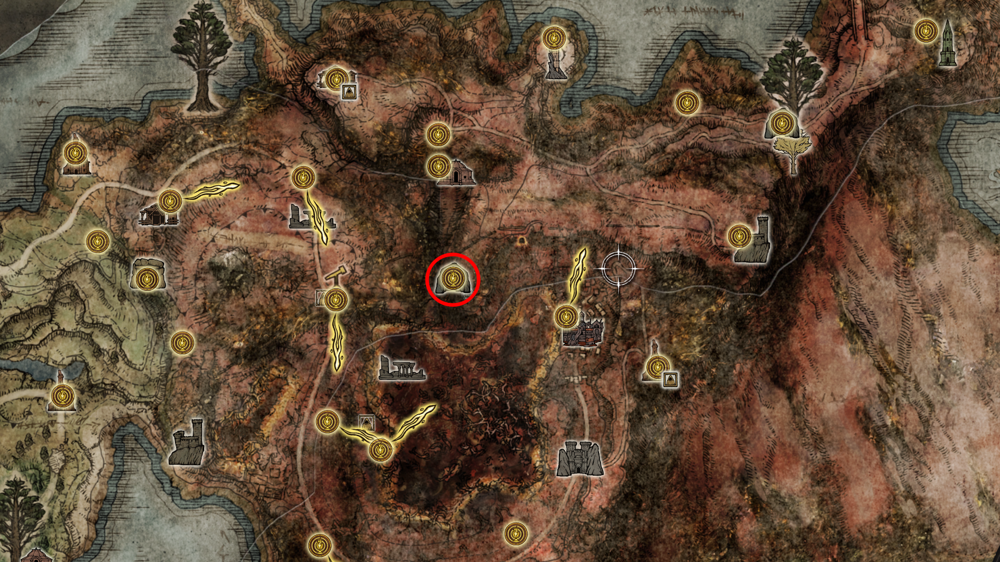
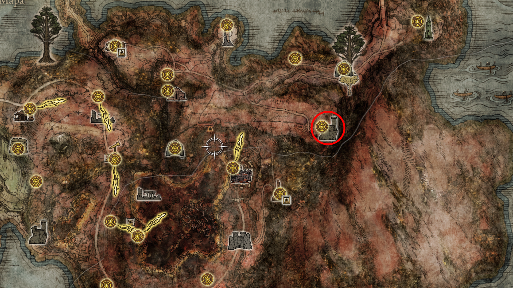
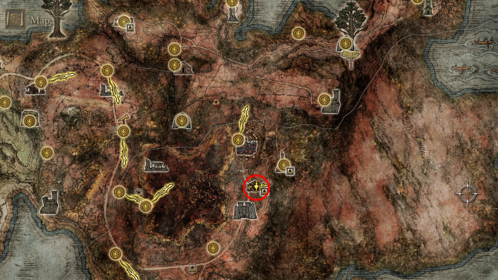
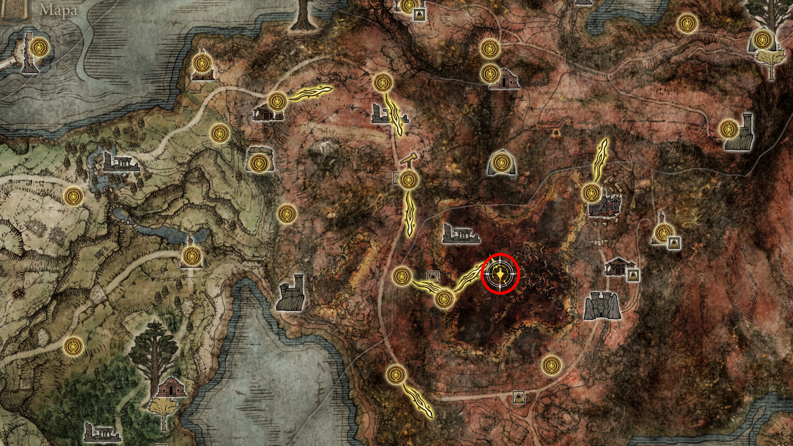
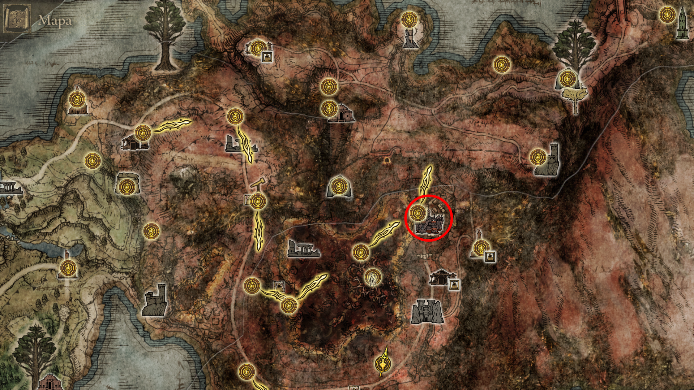
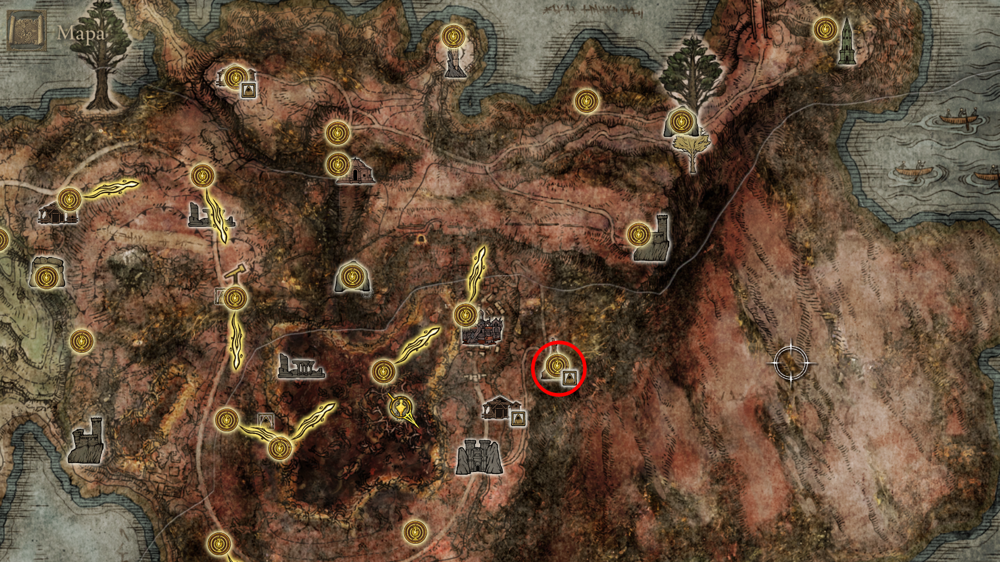
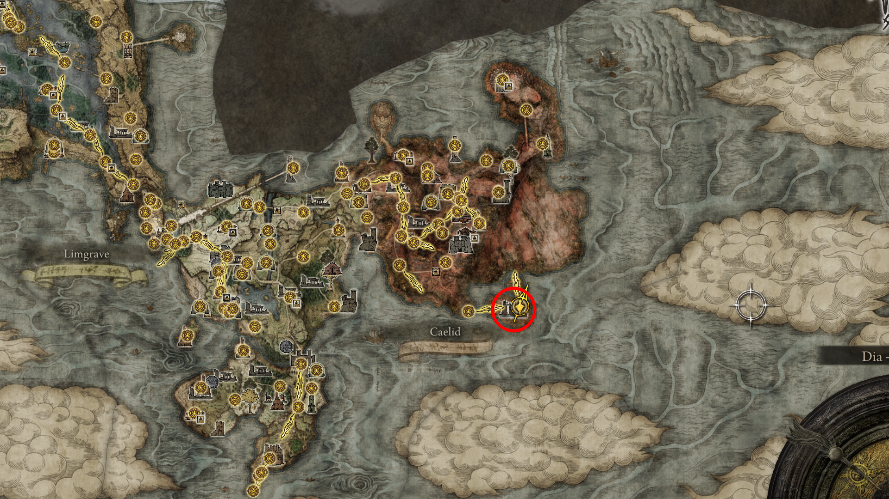

# 🗺️ Rota de Navegação: O Alvorecer do Festival (Caelid)

Esta rota foi planejada para otimizar a coleta de itens de upgrade e a progressão de quests de NPCs antes do confronto final no Castelo da Juba Vermelha. O objetivo é garantir o 100% da área sul sem a necessidade de backtracking após a queda do meteoro.

> [!WARNING]
> **Perigo Biológico:** A Podridão Escarlate drena seu HP rapidamente. Tenha em mãos **Bolos Preservativos** ou o feitiço **"Chama, Limpa-me"** antes de adentrar o Pântano de Aeonia.

---

## VIII. A Travessia de Caelid e o Festival de Combate

### 33. Orientação e Mapeamento (Início da Região)
* **Coleta de Mapas:** Antes de iniciar as quests, é fundamental liberar a visão do território. Caelid possui dois fragmentos principais.
* **Localização:** Siga a estrada principal para o sul para o primeiro mapa, e para o nordeste (Montículo dos Dragões) para o segundo.

  
   
  <em>Figura 30: Cartografia do Horror. Liberar os mapas permite localizar pontos de interesse como o Forte Faroth e a Igreja da Praga com precisão.</em>

### 34. O Item de Platina: Escaravelho de Ouro
* **Localização:** Vá até a **Caverna Abandonada** (centro do desfiladeiro, acessível por galhos de árvore).
* **O Desafio:** Atravesse o pântano de podridão interna e derrote os dois Cavaleiros da Podridão.
* **[🏆 PLATINA] Recompensa:** Este talismã aumenta permanentemente o ganho de runas em **20%**. 

  
   
  <em>Figura 31: O Talismã da Prosperidade. Item obrigatório para colecionadores e essencial para o farm que faremos a seguir.</em>

### 35. O Grande Farm (Dragão Greyoll)
* **Localização:** Siga para o **Forte Faroth** no Montículo dos Dragões.
* **Execução:** Com o **Escaravelho de Ouro equipado**, use uma arma de Sangramento (Bleed) no rabo da dragoa Greyoll.
* *Dica:* Se usar uma "Pata de Galinha em Salmoura Dourada", o bônus acumula com o escaravelho, rendendo quase **100.000 runas** de uma só vez.

  
   
  <em>Figura 32: O Salto de Nível. Com este montante de runas, você poderá elevar seus atributos para enfrentar o Festival de Radahn sem dificuldades.</em>

### 36. A Agulha de Ouro e a Quest de Millicent
Esta etapa é dividida em três atos para evitar o backtracking desnecessário.

* **Ato I: O Acordo com Gowry**
    * Localize a **Cabana de Gowry** no caminho para Sellia. Ele revelará a necessidade de uma agulha especial para salvar Millicent.
    

      
       
      <em>Figura 33: O Início da Jornada. A cabana de Gowry serve como o hub central para esta missão em Caelid.</em>
    

* **Ato II: A Invasão e o Confronto no Pântano de Aeonia**
    * **Alerta de Invasão:** Ao entrar na parte profunda do pântano (próximo ao círculo de bandeiras), a **Millicent (Espírito Sombrio)** invadirá seu mundo. 
    * **Estratégia:** Derrote-a primeiro antes de se aproximar do Comandante O'Neil para evitar um combate 2x1 desvantajoso. Ela dropa itens de cura e runas.
    * **O Chefe:** Prossiga para derrotar o **Comandante O'Neil** no centro do pântano.
    * **Resultado:** Após a vitória, você receberá a **Agulha de Ouro Puro**. Leve-a para Gowry, descanse na Graça e pegue a versão consertada.
    

      
       
      <em>Figura 34: O Coração de Aeonia. Cuidado com a invasão da Millicent ao se aproximar desta área; derrote-a antes de iniciar o boss.</em>
    

* **[INTERMEDIÁRIO] Sellia, Cidade da Feitiçaria**
    * **Objetivo:** Suba nos telhados e acenda as **3 Tochas** nas torres para quebrar os selos mágicos.
    * **Coleta de Itens:** Explore a cidade para coletar a **Semente Dourada**, o feitiço **Cometa de Azur** (no baú selado) e o **Cajado da Perda**.
    * **Conclusão:** Ao quebrar o selo principal no topo da cidade, o caminho para a Igreja da Praga estará fisicamente aberto.
    

      
       
      <em>Figura 35: Quebrando os Selos. Acender as piras em Sellia é o requisito para acessar a parte alta de Caelid.</em>
    

* **Ato III: A Igreja da Praga e a Cura**
    * Suba até a **Igreja da Praga** (atrás de Sellia). Entregue a agulha para Millicent.
    * **Check-out:** Descanse na Graça e fale com ela até ela se levantar. **IMPORTANTE:** Colete a **Lágrima Sagrada** no altar da igreja.
    

      
       
      <em>Figura 36: A Recuperação. Coletar a Lágrima Sagrada aqui é vital para o upgrade final dos seus frascos.</em>
    

* **Ato IV: Retorno à Cabana e Desbloqueio de Feitiços**
    * **Gowry:** Volte à Cabana do Gowry. Ele agora estará disponível como mercador, vendendo feitiçarias de Sellia.
    * **Interação Extra:** Se você recarregar o jogo novamente na cabana, encontrará Millicent lá no lugar dele. Fale com ela para avançar o diálogo de despedida dela de Caelid.
    * **Próximo Passo:** Com a quest "estacionada" aqui, você está livre para seguir para o **Castelo da Juba Vermelha** e enfrentar o Radahn.
    

      
       
      <em>Figura 33: O Hub de Quests. Reencontrar os NPCs aqui confirma que você completou 100% das interações de Caelid antes do Festival.</em>
    

### 37. O Festival de Radahn (O Clímax)

Para garantir o 100%, siga rigorosamente os diálogos abaixo:

**I. Diálogos Pré-Combate (No Pátio):**
* Fale com **Blaidd**, **Alexander** e **Therolina** (esta última garante o gesto "Curvatura Educada").
* Fale com Jerren no topo para iniciar o festival.

**II. [🏆 PLATINA] O Confronto:**
* Use as marcas de invocação na arena e derrote o **Flagelo Estelar Radahn**. A vitória dispara a queda do meteoro em Limgrave.

**III. Diálogos Pós-Combate (Na Arena):**
* **Blaidd:** Fale com ele para marcar o encontro na cratera da Floresta Nebulosa.
* **Alexander:** Fale com o jarro até ele esgotar o diálogo sobre se consertar com os restos dos guerreiros.

  
   
  <em>Figura 37: O Destino das Estrelas. A queda do meteoro encerra esta fase e abre oficialmente o diretório 07_nokron.</em>

---

[🏠 Retornar ao Guia Principal](../README.md) |  [☄️ Prosseguir para Nokron a cidade eterna](../07_nokron_eternal_city/route.md)