# 🗺️ Rota de Navegação: A Cidade Eterna de Nokron

Após a queda do meteoro, o destino de Ranni começa a se concretizar. Esta rota cobre a busca pela Lâmina do Matador de Dedos e a resolução dos conflitos internos dos servos da Princesa Lunar.

---

## IX. O Caminho para o Subsolo

### 38. O Lobo Enclausurado (O Destino de Blaidd)
Antes de descer pela cratera, você notará que Blaidd não apareceu no ponto de encontro combinado. Iji, temendo a instabilidade do meio-lobo, o aprisionou.

* **Localização:** Vá para o **Cárcere Eterno do Cão de Caça** (Limgrave Sul), onde você derrotou Darriwil anteriormente.
* **Ação:** Aproxime-se do centro do cárcere e você ouvirá o uivo de Blaidd. Interaja com a estrutura para falar com ele e escolha **"Abrir o Cárcere"**.
* **Check-out de Lore:** Após libertá-lo, fale com o **Conselheiro de Guerra Iji** (Liurnia Norte) para entender as motivações por trás dessa decisão. 
* **Resultado:** Embora opcional para a Platina, este passo é essencial para o 100% da narrativa e para garantir que a quest do Blaidd não "quebre" visualmente.

  
   
  <em>Figura 38: Lealdade Testada. Libertar Blaidd aqui revela a tensão entre o destino da Ranni e a sanidade de seus seguidores.</em>

### 39. A Cratera na Floresta Nebulosa
* **Localização:** Siga para o sul do **Forte Haight**, na Floresta Nebulosa (Limgrave).
* **A Descida:** Você verá uma enorme cratera cercada por rochas flutuantes. Desça com cuidado usando o Torrent pelas plataformas de pedra.
* **Entrada de Nokron:** Siga pelas ruínas até o topo dos telhados da Cidade Eterna.

  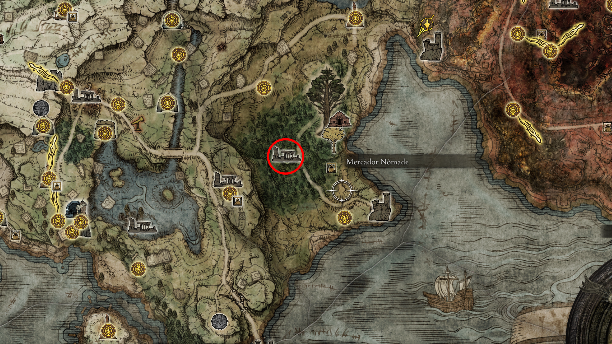
   
  <em>Figura 39: O Impacto do Meteoro. Este buraco massivo é o seu ponto de entrada para a próxima grande área de troféus.</em>

---

## X. Exploração de Nokron

### 40. O Primeiro Ponto de Graça e o Mimic Tear
* **Acesso:** Continue pelos telhados até encontrar a primeira Graça de Nokron.
* **[🏆 PLATINA] Lágrima Mimética:** Siga pelo caminho principal para enfrentar o chefe que copia sua build.
* *Dica de Dev:* Como discutido no guia (vídeo), entre desarmado para o Boss copiar um "personagem vazio" e equipe seus itens logo em seguida para uma vitória fácil.

  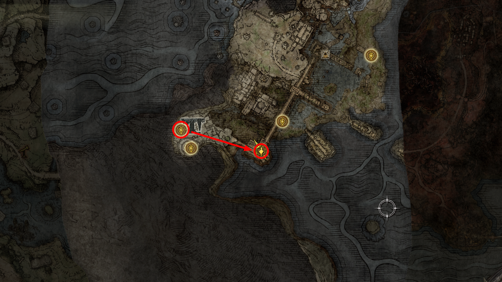
   
  <em>Figura 40: Reflexo de Guerra. A Lágrima Mimética é uma das cinzas de invocação mais poderosas do jogo (Troféu de Platina).</em>

### 41. Ativação dos Pilares e o Espírito Ancestral
Antes de entrar na área urbana, explore o **Floresta Ancestral**. Existem **6 pilares** de fogo que devem ser acesos para liberar o acesso ao Boss opcional da região.

* **Objetivo:** Acender todas as piras espalhadas pela floresta.
* **Boss:** Após acender os 6 pilares, dirija-se ao Templo do Chifre para enfrentar o **Espírito Ancestral Real**.

  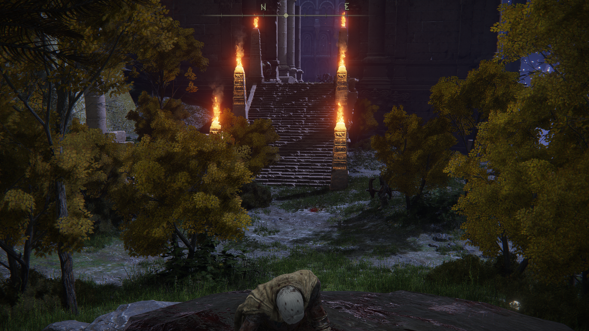
   
  <em>Figura 41: Ritual de Fogo. A ativação dos pilares é o requisito técnico para desbloquear o combate no subsolo.</em>

### 42. Otimização de Build: Lâmina de Amolar Preta
Ao iniciar a descida pelos telhados da **Terra Sagrada da Noite**, você encontrará uma das ferramentas de "configuração" mais importantes para builds de dano de estado.

* **Localização:** Em um cadáver sentado diante de um altar, dentro da igreja antes do caminho principal.
* **Efeito:** Desbloqueia as infusões de **Sangue, Veneno e Oculto** para suas Cinzas de Guerra.

  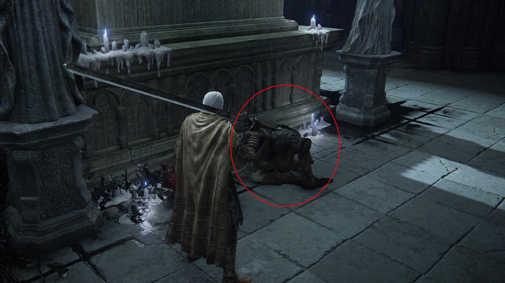
   
  <em>Figura 42: Customização Avançada. Este item permite que armas comuns escalem com Arcano, otimizando o dano de Sangramento.</em>

### 43. [🏆 PLATINA] Cinzas da Lágrima Imitadora (Mimic Tear)
Abaixo dos telhados, você encontrará uma barreira de névoa que exige uma **Chave de Espada de Pedra** para ser aberta.

* **O Tesouro:** Dentro do baú, você obterá a invocação que copia exatamente a sua build, equipamentos e consumíveis.
* **Importância:** É o item lendário necessário para o troféu de Platina e a ferramenta de suporte mais resiliente do jogo.

  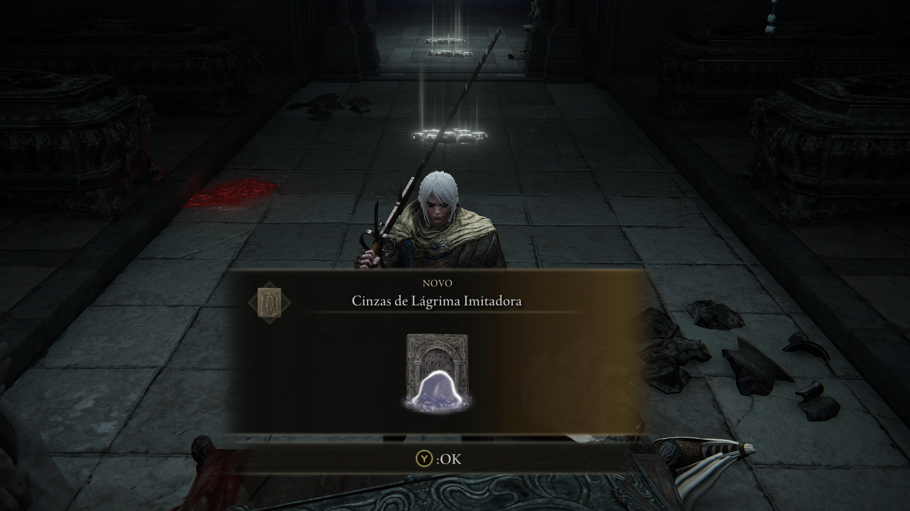
   
  <em>Figura 43: O Espelho de Guerra. As cinzas da Mimic Tear são o recurso definitivo para enfrentar chefes de alta dificuldade.</em>

### 44. [🏆 PLATINA] Faca Matadora de Dedos (Fingerslayer Blade)
Este é o ponto de conclusão da exploração urbana de Nokron e o item que permite o avanço do "script" da Ranni.

* **Localização:** No final da Terra Sagrada da Noite, num baú monumental sob a estátua do esqueleto gigante.
* **Check-out:** Certifique-se de ter explorado tudo em Nokron antes de levar este item para a Ranni, pois ele altera o estado de vários NPCs.

  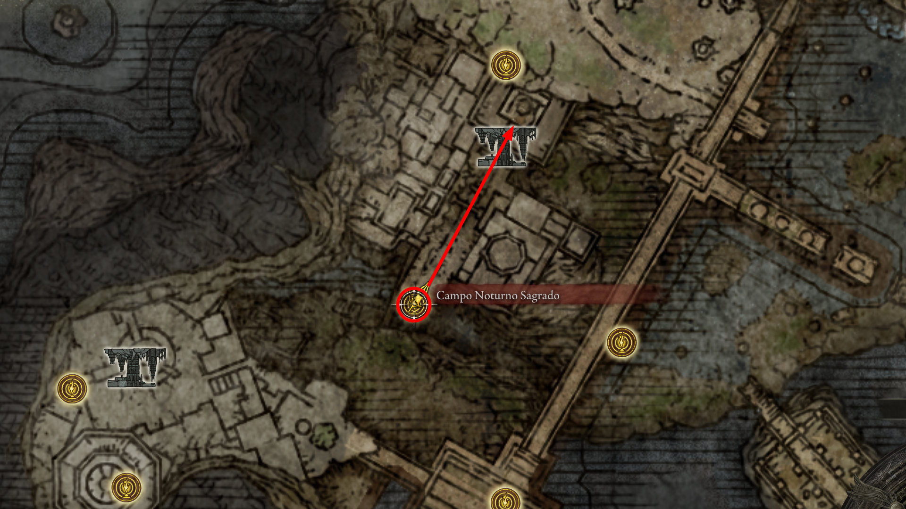
   
  <em>Figura 44: O Destino em Mãos. A obtenção da Faca Matadora de Dedos conclui a missão principal na Cidade Eterna.</em>

### 45. Logística de Quest: O Pote de Óleo para Alexander
Antes de prosseguir para o Aqueduto, é necessário garantir a ferramenta para a próxima etapa da quest do **Alexander (Punho de Ferro)**.

* **Localização:** Dirija-se ao **Mercador Abandonado** no Rio Siofra (acessível subindo o andaime de madeira e atravessando as vigas superiores).
* **Item Necessário:** Compre o **Manual de Guerreiro Nômade [17]**.
* **Utilidade:** Este manual permite a fabricação do **Pote de Óleo**. Sem ele, não é possível ajudar o Alexander quando ele ficar preso novamente em Liurnia, pois ele precisará ser "lubrificado" para sair do buraco.

  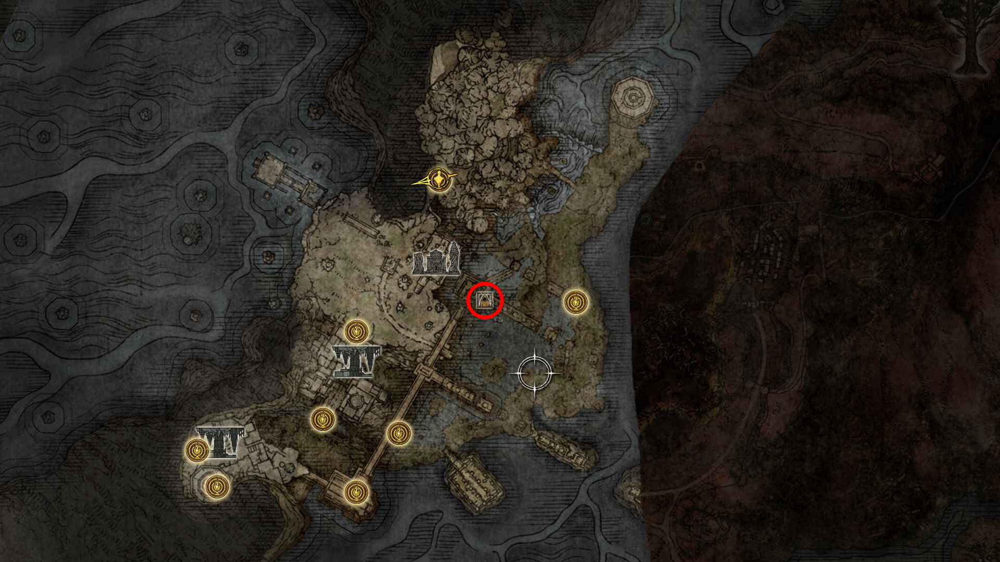
   
  <em>Figura 45: Preparação de Suporte. Garantir esta receita agora é um passo técnico que evita backtracking futuro na quest do Alexander.</em>

### 46. Travessia para o Aqueduto de Siofra
Com todos os itens de Nokron e a receita de óleo coletados, siga para a transição final deste mapa.

* **Caminho:** A partir do Floresta Ancestral, siga para o norte até a área das águas-vivas e desça as plataformas no penhasco.
* **Checkpoint:** Ative a Graça **Penhascos da Vista do Aqueduto** (*Aqueduct-Facing Cliffs*).
* **Ponto de Interesse:** Localize o irmão do NPC D sentado próximo a esta Graça; você precisará entregar a armadura para ele se desejar concluir a quest da Fia.

  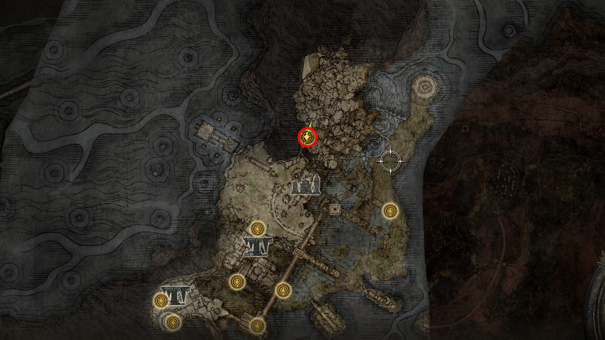
   
  <em>Figura 46: Rumo às Gárgulas. Esta Graça marca o fim da exploração de Nokron e o início do desafio no Aqueduto de Siofra.</em>

---

## XI. Manutenção de Campo: A Jornada de Alexander

### 47. O Reencontro em Liurnia (Alexander no Buraco 2.0)
Após o Festival de Radahn, o Alexander se move para Liurnia dos Lagos, mas acaba preso novamente em um buraco. Desta vez, a força bruta sozinha não será suficiente.

* **Localização:** Fica logo acima da **Sala de Estudo de Carian** (Carian Study Hall), no platô gramado ao sul da Cabana do Artista.
* **O Problema:** Ele está muito seco para deslizar para fora. Tentar batê-lo sem lubrificação apenas causará diálogos de dor.
* **A Solução (Script Técnico):**
    1. Abra o menu de **Produção de Itens**.
    2. Crie um **Pote de Óleo** (Oil Pot) usando o Manual [17] e um Girassol Murcho.
    3. Arremesse o Pote de Óleo no Alexander até que ele fique "brilhando".
    4. Acerte um ataque carregado (R2/RT) nas costas dele para libertá-lo.

  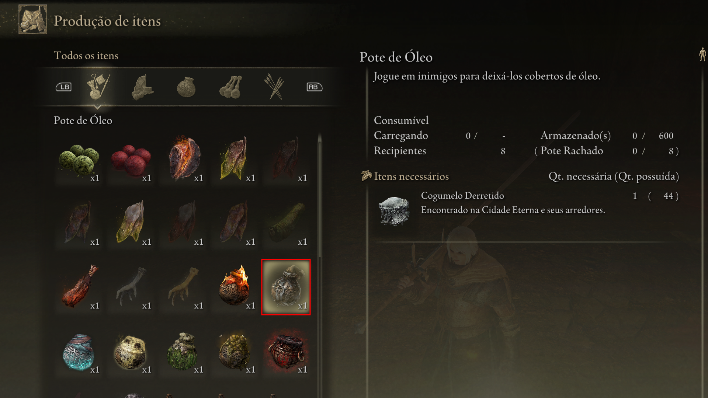
   
  <em>Figura 47: Lubrificação Necessária. O uso do Pote de Óleo é o requisito de script para avançar a quest do Guerreiro Jarro sem feri-lo gravemente.</em>

### 48. Recompensa e Próximo Destino
* **Diálogo:** Fale com ele após ele sair do buraco. Ele agradecerá e mencionará que pretende ir para o norte, para um lugar onde possa "se temperar" no calor.
* **Recompensa:** Ele te entregará carne de alta qualidade e runas.
* **Gatilho de Movimentação:** Este passo é obrigatório para que ele apareça futuramente no **Monte Gelmir** (na lava próximo ao Boss Dragão de Magma).

  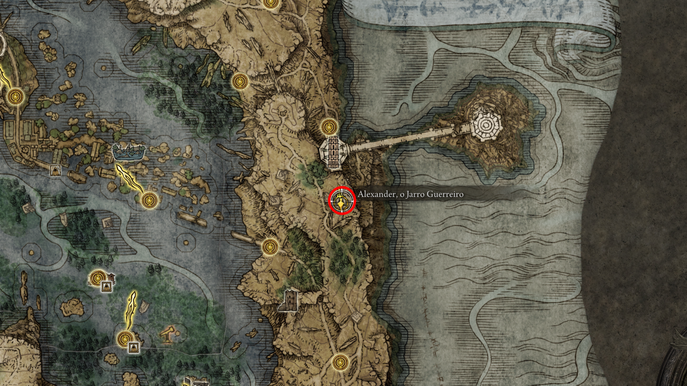
   
  <em>Figura 48: O Caminho do Guerreiro. Com a ajuda do óleo, Alexander segue sua jornada rumo às terras vulcânicas.</em>

### 49. Jarrosburgo (O Vilarejo dos Vasos)
Aproveitando a proximidade com o local onde Alexander estava preso, desça para o vilarejo escondido no penhasco. Este local é um porto seguro para os potes e fundamental para a conclusão da questline dos guerreiros jarros.

* **Localização:** Olhando para o leste a partir do penhasco atrás da **Sala de Estudo de Carian**, localize as plataformas de pedra que saem da parede do desfiladeiro.
* **A Descida:** Use o Torrent para descer saltando com cuidado por essas plataformas até atingir o solo da vila.
* **Ponto de Interesse:** Ative a Graça **Jarrosburgo** (*Jarburg*).
* **Personagem Chave:** Fale com o **Pequeno Pote (Jar-Bairn)** sentado em uma varanda. Ele é o sobrinho de Alexander e será o herdeiro do legado do seu "Tio".

  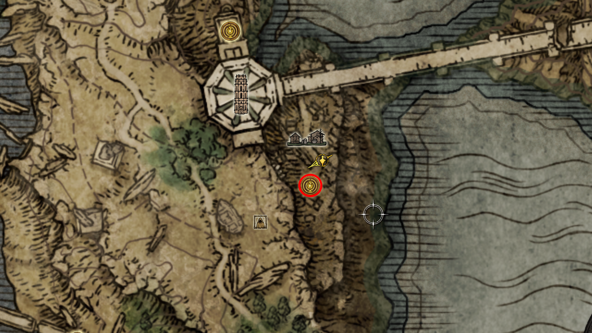
   
  <em>Figura 49: Recanto de Paz. Ativar esta Graça agora facilita o acesso futuro para as quests de Diallos e Jar-Bairn que se conectam com o Alexander.</em>

### 50. Coleta de Recursos em Jarrosburgo
A vila é rica em materiais raros que não tentam te matar, o que é uma raridade em Elden Ring.

* **Flores Raras:** Colete as **Flores de Folha de Erva Estelar** e **Lírios de Miquella** que crescem em abundância nos jardins.
* **Itens de Ritual:** Procure pelos Potes de Ritual e Potes Rachados espalhados pelas casas.
* **Continuidade:** Com este checkpoint salvo, o "set" de Liurnia Oriental está tecnicamente concluído.

  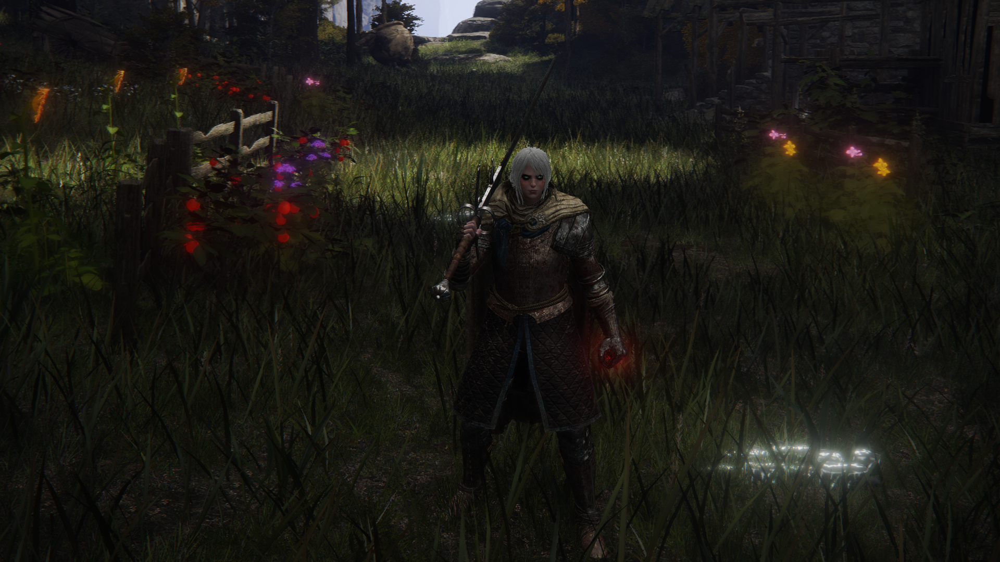
   
  <em>Figura 50: Jardim de Recursos. A vila serve como um excelente ponto de colheita de itens de craft antes de retornar aos combates intensos.</em>

---

## XIII. A Ascensão ao Platô (Rota Alternativa)

### 51. Ruína do Penhasco (Ruin-Strewn Precipice)
Para evitar a busca pelas medalhas do Elevador de Dectus, seguiremos pelo desfiladeiro ao norte de Liurnia. Esta rota é um "farm" natural de Pedras de Forja [4] e [5].

* **Localização:** Siga até o final do rio ao norte do Grande Elevador de Dectus. Suba pelas escadas e elevadores de madeira.
* **Checkpoint:** Ative a Graça **Vila Alinhada ao Penhasco** (*Ravine-Veiled Village*).
* **Inimigos:** Cuidado com as Harpias (Morcegos Cantores); seus ataques de veneno podem ser letais em plataformas estreitas.

  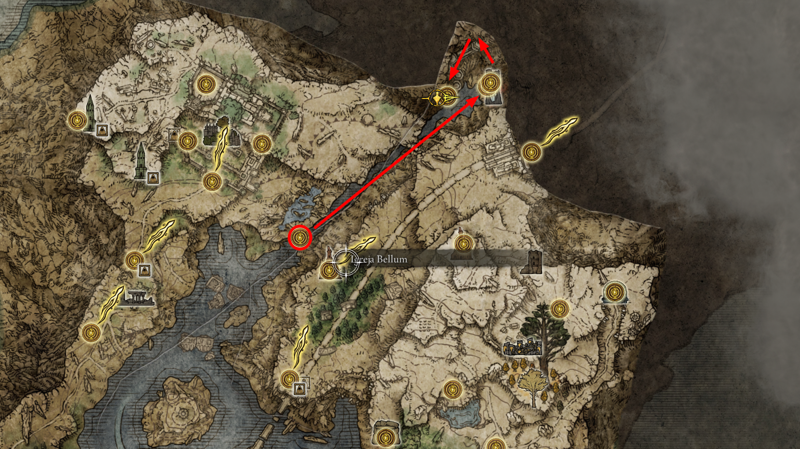
   
  <em>Figura 51: Escalada Vertical. Esta rota é a preferida por desenvolvedores para acessar o Platô Altus cedo e coletar materiais de upgrade.</em>

### 52. Chefe: Dragão de Magma Makar (Magma Wyrm Makar)
No topo das ruínas, você encontrará o guardião da passagem para o Platô Altus.

* **Estratégia:** Makar cospe lava que limita sua movimentação. Tente focar na cabeça para causar quebra de postura.
* **Recompensa:** **Espada de Escamas do Dragão de Magma** e um Coração de Dragão.
* **Resultado:** Ao sair da arena pelo elevador ao fundo, você finalmente chegará ao **Platô Altus**.

  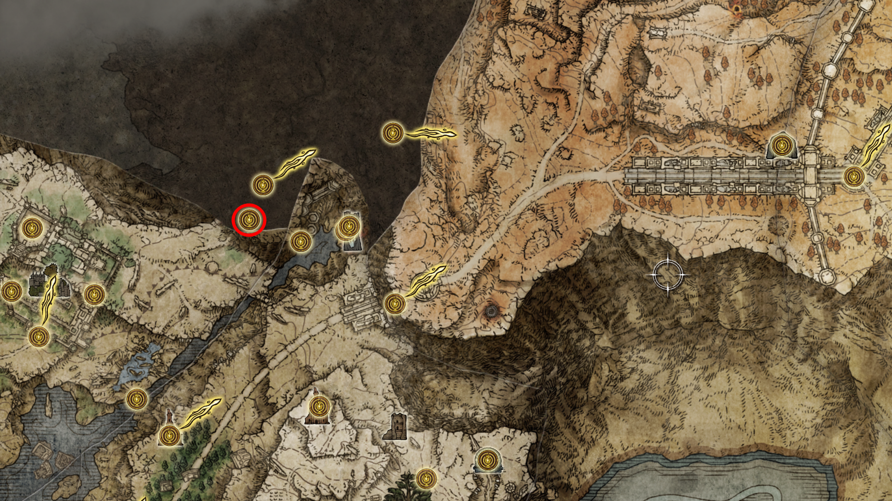
   
  <em>Figura 52: O Guardião do Platô. Derrotar Makar libera o acesso definitivo às terras douradas sem depender de medalhões.</em>

### 53. Cartografia de Altus (Mapeamento Expresso)
Antes de buscar a Luz Estelar Âmbar, aproveitaremos a estadia para liberar a visão total da região. Isso evita que você se perca no "fog of war" enquanto completa os gatilhos da quest.

* **Mapa 1: Platô Altus (Sul)**
    * **Localização:** Siga a estrada principal para o leste a partir da saída do elevador do Boss Makar. O monólito do mapa estará logo à frente, na junção da rodovia.
    * **Ação:** Ative a Graça **Entroncamento da Rodovia de Altus**.

  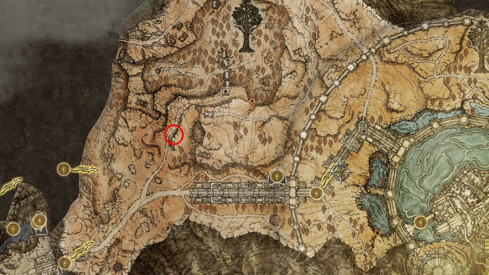
   
  <em>Figura 53: Visão do Sul. Este mapa revela os caminhos que levam tanto à Capital Leyndell quanto ao Monte Gelmir.</em>

* **Mapa 2: Arredores de Leyndell**
    * **Localização:** Continue seguindo a estrada principal para o Leste, em direção às grandes muralhas. O monólito fica logo após passar pelos dois sentinelas da árvore (você pode passar correndo por eles) e entrar pelo portão externo.
    * **Ação:** Ative a Graça **Muralha Externa da Árvore Fantasma**.

  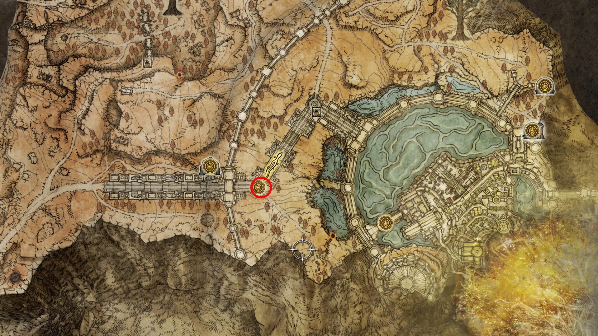
   
  <em>Figura 54: Portões da Capital. Liberar este mapa agora revela toda a periferia de Leyndell, facilitando a navegação futura no Ato 12.</em>

### 54. [🎯 ALVO] Localização da Luz Estelar Âmbar (Amber Starlight)
Este é o objetivo central do nosso desvio técnico para garantir o item perdível do Seluvis.

* **Trajeto:** Da saída do Boss Makar, siga para a Graça **Entroncamento da Rodovia de Altus**. Vá para o norte, em direção ao desfiladeiro que parece uma "fenda" no mapa.
* **O Item:** A **Luz Estelar Âmbar** estará em um pequeno altar diante de uma estátua.
* **⚠️ IMPORTANTE:** Assim que coletar o item, **NÃO AVANCE** para Leyndell ou o moinho de vento se quiser manter o script da Ranni intacto. Use o teletransporte para voltar a Liurnia.

  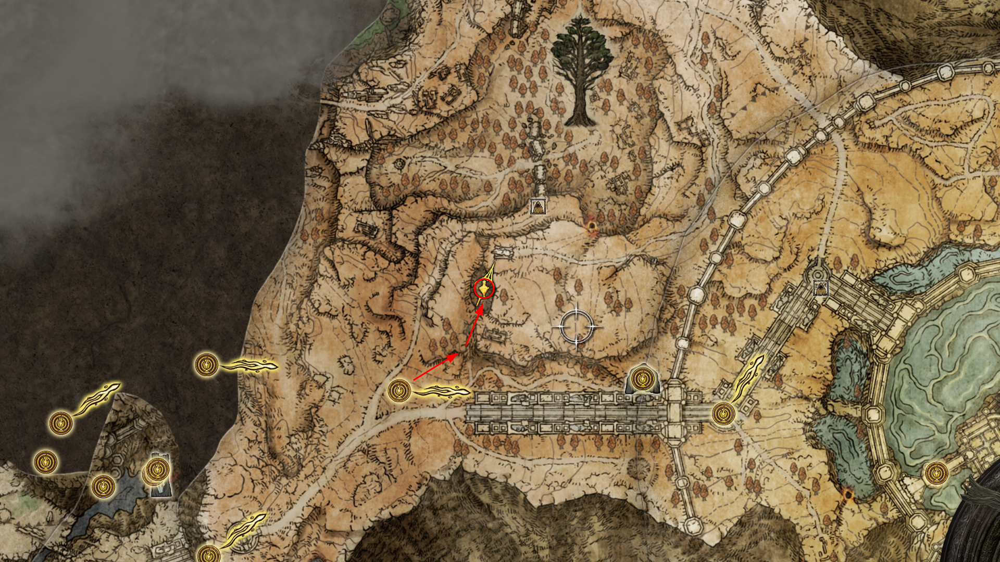
   
  <em>Figura 55: A Chave de Seluvis. Com este item em mãos, o Amuleto de Escorpião Mágico está garantido.</em>

