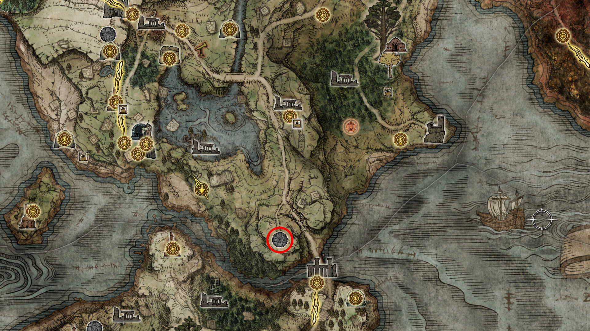

# 🗺️ Rota de Navegação: A Cidade Eterna de Nokron

Após a queda do meteoro, o destino de Ranni começa a se concretizar. Esta rota cobre a busca pela Lâmina do Matador de Dedos e a resolução dos conflitos internos dos servos da Princesa Lunar.

---

## IX. O Caminho para o Subsolo

### 38. O Lobo Enclausurado (O Destino de Blaidd)
Antes de descer pela cratera, você notará que Blaidd não apareceu no ponto de encontro combinado. Iji, temendo a instabilidade do meio-lobo, o aprisionou.

* **Localização:** Vá para o **Cárcere Eterno do Cão de Caça** (Limgrave Sul), onde você derrotou Darriwil anteriormente.
* **Ação:** Aproxime-se do centro do cárcere e você ouvirá o uivo de Blaidd. Interaja com a estrutura para falar com ele e escolha **"Abrir o Cárcere"**.
* **Check-out de Lore:** Após libertá-lo, fale com o **Conselheiro de Guerra Iji** (Liurnia Norte) para entender as motivações por trás dessa decisão. 
* **Resultado:** Embora opcional para a Platina, este passo é essencial para o 100% da narrativa e para garantir que a quest do Blaidd não "quebre" visualmente.

  
   
  <em>Figura 38: Lealdade Testada. Libertar Blaidd aqui revela a tensão entre o destino da Ranni e a sanidade de seus seguidores.</em>

### 39. A Cratera na Floresta Nebulosa
* **Localização:** Siga para o sul do **Forte Haight**, na Floresta Nebulosa (Limgrave).
* **A Descida:** Você verá uma enorme cratera cercada por rochas flutuantes. Desça com cuidado usando o Torrent pelas plataformas de pedra.
* **Entrada de Nokron:** Siga pelas ruínas até o topo dos telhados da Cidade Eterna.

  
   
  <em>Figura 39: O Impacto do Meteoro. Este buraco massivo é o seu ponto de entrada para a próxima grande área de troféus.</em>

---

## X. Exploração de Nokron

### 40. O Primeiro Ponto de Graça e o Mimic Tear
* **Acesso:** Continue pelos telhados até encontrar a primeira Graça de Nokron.
* **[🏆 PLATINA] Lágrima Mimética:** Siga pelo caminho principal para enfrentar o chefe que copia sua build.
* *Dica de Dev:* Como discutido no guia (vídeo), entre desarmado para o Boss copiar um "personagem vazio" e equipe seus itens logo em seguida para uma vitória fácil.

  
   
  <em>Figura 40: Reflexo de Guerra. A Lágrima Mimética é uma das cinzas de invocação mais poderosas do jogo (Troféu de Platina).</em>

---