# 🗺️ Rota de Navegação: Rio Ainsel e Nokstella

Após entregar a Lâmina do Matador de Dedos, Ranni deixa o plano físico e inicia sua jornada pelo "Caminho Negro". Esta rota cobre a exploração das profundezas de Ainsel, o encontro com a Miniatura da Ranni e a caçada à Sombra Funesta.

---
## XIV. O Despertar no Rio Ainsel

### 55. Preparação na Mesa-Redonda e o Segredo de Seluvis
Antes de entregar a Luz Estelar Âmbar, você deve resolver a pendência da poção e descobrir o segredo obscuro do mago.

* **Interação com Gideon Ofnir:** Na biblioteca da Mesa-Redonda, selecione "Mostrar a poção de Seluvis". Ele se oferecerá para descartá-la. Isso mantém **Nepheli Loux** viva para a quest final dela.
* **O Porão Secreto:** Vá até as **Ruínas do Labirinto** (perto da torre de Ranni) e ataque o chão ilusório para revelar o laboratório de marionetes de Seluvis. Leia a mensagem no fundo da sala.
* **Confronto e Recompensa:** 
    1. Volte ao Seluvis e questione-o sobre o laboratório. Ele te dará uma cinza de invocação.
    2. Compre todos os feitiços dele. 
    3. Só então, entregue a **Luz Estelar Âmbar** (Amber Starlight).
* **Resultado:** Ele entregará o **Amuleto de Escorpião Mágico** (item essencial para builds de dano mágico).

  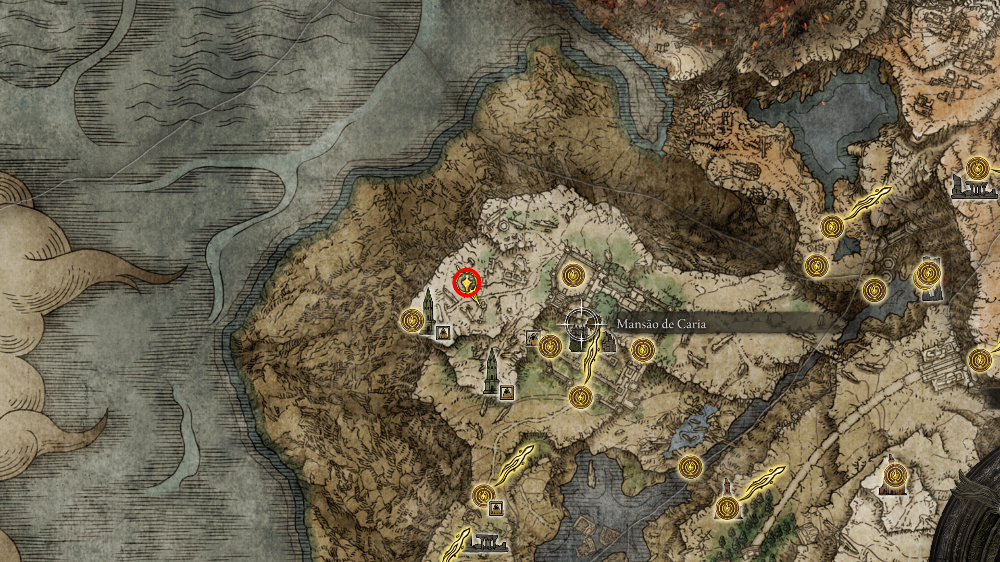
   
  <em>Figura 57: Locakuzação do porão secreto.</em>

---

### 56. Gestão de Espólios
Mesmo que o Seluvis encontre seu fim prematuro, você deve coletar os Sinos para centralizar as compras na Mesa-Redonda:

* **Sino de Seluvis:** Coletado no corpo dele na base de sua torre após o avanço da quest de Ranni. Permite comprar os feitiços de prelazia com as Gêmeas Idosas.
* **Sino da Pidia:** Localizado no nível superior da Mansão Caria (acesse pulando dos penhascos perto das Três Irmãs). 
    * *Dica:* Se Pidia estiver morta, colete o sino em seu corpo para comprar cinzas de guerra e itens de aprimoramento raros.

---

### 57. O Portal da Torre de Renna
Com a partida de Ranni, a barreira mágica da torre ao norte das Três Irmãs desaparece.

* **Localização:** Topo da **Torre de Renna** (Liurnia).
* **Ação:** Utilize o portal de envio. Ele te transportará para uma seção anteriormente inacessível do Rio Ainsel (Ainsel River Main).
* **Item Imediato:** Assim que spawnar, olhe para o caixão à sua frente e colete a **Ranni Miniatura**.

  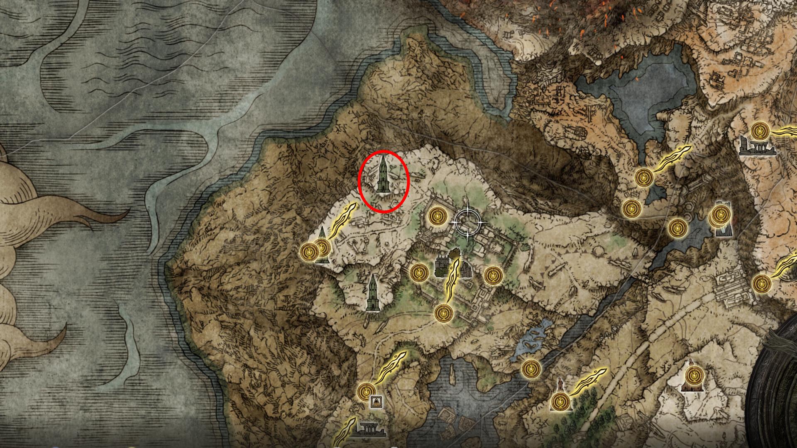
   
  <em>Figura 58: Salto nas Profundezas. Este portal é o único acesso para a fase final da questline da Princesa Lunar.</em>

---

### 58. A Boneca Silenciosa
Não saia correndo! O progresso da quest depende de um detalhe mecânico específico nas fogueiras.

* **Ação:** Descanse na Graça **Ainsel River Main** (logo à frente de onde você spawnou).
* **Mecânica:** Selecione a opção **"Falar com a Ranni Miniatura"**.
* **Repetição:** Você deve clicar nesta opção **3 vezes**. Na terceira, ela finalmente responderá, desbloqueando os diálogos necessários para caçar o Assassino das Sombras.

---

### 59. Nokstella e o Fragmento de Mapa
Ao descer o elevador ou atravessar o portal, você estará no leito do rio. Antes de subir a cidade, você precisa de visão da área.

* **O Fragmento de Mapa (Rio Ainsel):** Siga pelo leito do rio passando pelas formigas gigantes. O mapa está em um corpo encostado em um pilar, logo na entrada de uma estrutura que parece um templo (onde fica o Mercador Eremita).
* **Nokstella:** Suba as escadas à esquerda para acessar a parte alta.
* **[🏆 PLATINA] Talismã Lendário:** No topo de Nokstella, abra o baú na catedral para obter a **Lua de Nokstella**.

  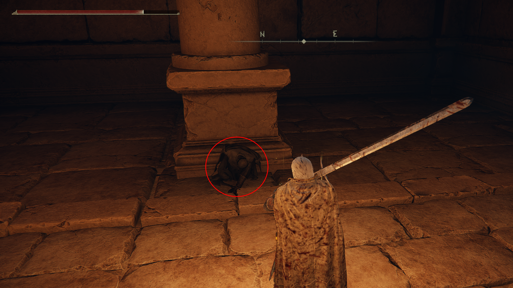
   
  <em>Figura 59: Localização do Fragmento de Mapa. Não avance para o Lago de Podridão sem ele.</em>

---

### 60. O Duelo com o Assassino das Sombras
Após atravessar as pontes de Nokstella e pegar o elevador no fundo da cidade, você chegará a uma caverna com tons avermelhados.

* **Combate:** O **Assassino das Sombras** (Baleful Shadow) aparecerá. 
* **Item de Quest:** Ao derrotá-lo, você recebe a **Chave do Palácio Descartada**.

  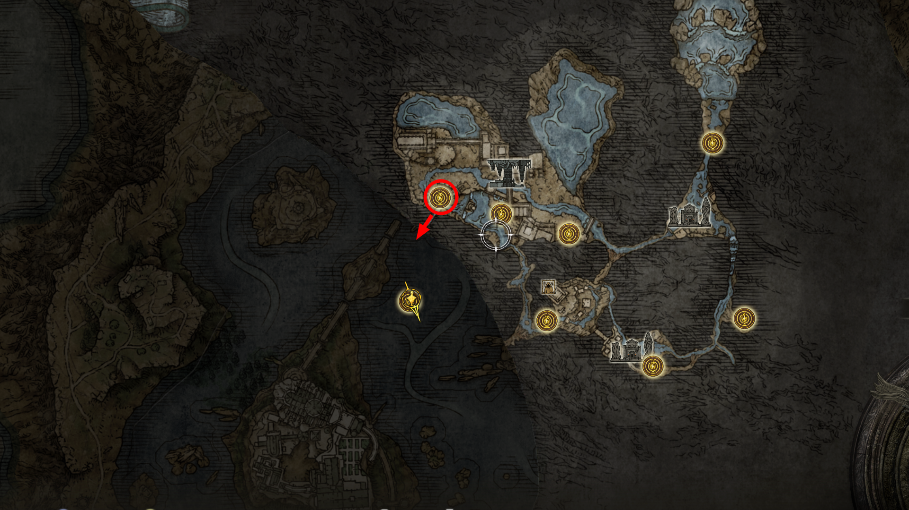
   
  <em>Figura 60: O Assassino das Sombras. Cuidado com o debuff de Destino da Morte (barra preta e vermelha).</em>

---

### 61. O Anel da Lua Sombria (Checkpoint em Liurnia)
**IMPORTANTE:** Você não consegue terminar a quest se esquecer este passo.

* **Ação:** Vá para a sala da Rennala (Raya Lucaria) e abra o baú com a chave recém-adquirida.
* **Item:** **Anel da Lua Sombria** (Dark Moon Ring).

  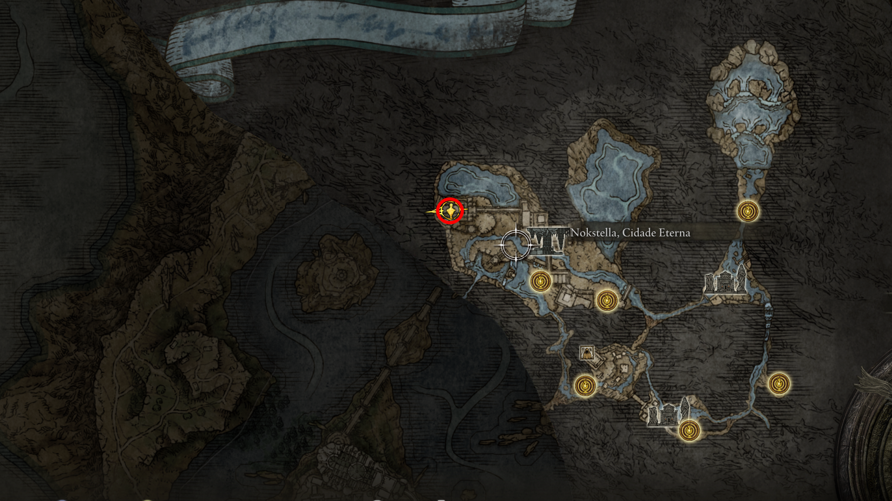
   
  <em>Figura 62: Anel da Lua Sombria.</em>

---

### 62. Exploração do Lago de Podridão (Checklist de Itens)
Chegando proximo da graça "Margem do Lago da Podridão", proximo a margem tem o mapa "Lago da Podridão". Este local é um teste de resistência. Antes de prosseguir para o caixão, certifique-se de coletar o seguinte:

  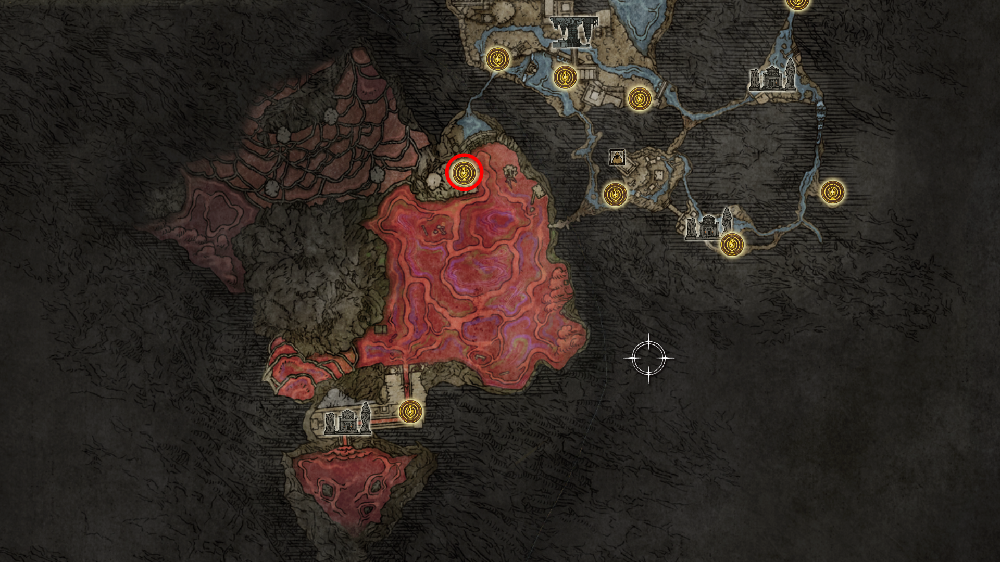
   
  <em>Figura 63: Anel da Lua Sombria.</em>

#### ⚔️ Chefes de Área
* **Soldado Draconiano (Dragonkin Soldier):** Encontra-se no meio do lago. Derrotá-lo concede a **Espada de Escama de Dragão**.
* **Espírito de Árvore Ulcerado:** Localizado no Grande Claustro (área final antes do caixão). Dropa uma **Semente Dourada**.

#### 🎒 Itens Importantes
- [ ] **Talismã de Chifre de Imunidade +1:** Aumenta muito sua resistência à podridão. Encontrado em um corpo no "mar" de líquido vermelho.
- [ ] **Manual de Guerreiro Nômade [22]:** Em uma ruína no canto sudoeste.
- [ ] **Lírio de Luva Fantasma [9]:** Existem vários espalhados pelo Grande Claustro. Não saia sem eles para upar sua Mimic Tear.
- [ ] **Adaga de Escorpião (Stinger):** Em um baú dentro de uma estrutura no Grande Claustro.

---

### 63. [🏆 PLATINA] O Chefe: Astel, Filho Natural da Escuridão
Após entrar no caixão na beira da cachoeira, você chegará à arena de um dos chefes mais icônicos do jogo.

* **Localização:** Além do Grande Claustro.
* **Estratégia:** Astel usa ataques de gravidade e um raio de energia logo na entrada. Fique perto da cabeça para causar dano massivo, mas cuidado com o ataque de "agarre" (teletransporte).
* **Recompensa:** **Lembrança do Filho Natural** e o **Troféu de Platina: Astel, Filho Natural da Escuridão**.

  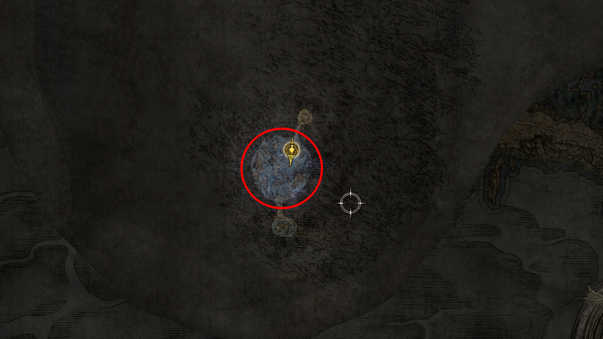
   
  <em>Figura 63: Astel. Derrotar este ser estelar é o requisito final para acessar o Altar Lunar e concluir a quest da Ranni.</em>

---

### 64. O Caminho para o Altar Lunar
Após derrotar Astel, o caminho estará bloqueado por uma barreira mágica.
* **O Selo:** A barreira só abrirá se você tiver o **Anel da Lua Sombria** (coletado no passo 61, no baú da Rennala).
* **Ação:** Pegue o elevador atrás da arena do boss para finalmente emergir na montanha acima de Liurnia.

---

### 65. Altar Lunar: O Platô das Estrelas
Ao subir o elevador após a arena do Astel, você chegará ao Altar Lunar, uma área de Liurnia anteriormente inacessível.

* **Localização:** Sul de Liurnia (topo da montanha).
* **Aviso de Combate:** O dragão **Adula** aparecerá na frente da catedral. Você pode lutar com ele para obter o feitiço "Lâmina da Lua de Adula" ou simplesmente correr para dentro da igreja para ativar a Graça.

---

### 66. Catedral de Manus Celes e a Espada Grande da Lua Sombria
Este é o ponto final da missão da Princesa Lunar.

* **Ação:** Dentro da catedral, à direita da Graça, há um buraco no chão. Desça com cuidado usando as plataformas.
* **O Casamento Real:** Encontre o corpo de Ranni e selecione a opção de "Usar o Anel da Lua Sombria".
* **[🏆 PLATINA] Recompensa Lendária:** Após a cena, a Ranni desaparecerá e deixará em seu lugar a **Espada Grande da Lua Sombria** (Dark Moon Greatsword).
    * *Nota:* Esta é uma das 9 armas lendárias necessárias para o troféu de colecionador.

  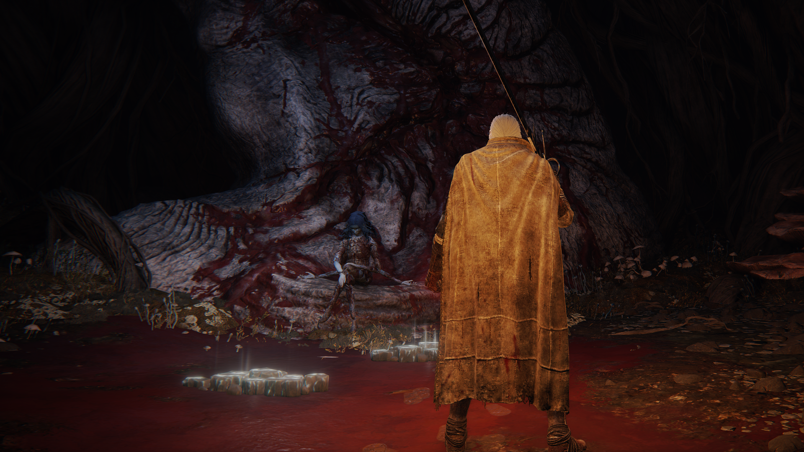
   
  <em>Figura 64: O Selo do Destino. Ao obter esta espada, você garante um dos itens mais difíceis da platina e desbloqueia o final "Era das Estrelas".</em>

---

### 67. Consequências: O Destino de Blaidd e Iji
Agora que Ranni partiu para o seu destino nas estrelas, as histórias de seus conselheiros chegam ao fim.

* **Blaidd:** Volte para a entrada da **Ascensão de Ranni** (Ranni's Rise). Blaidd estará lá, mas perdeu o juízo. 
    * *Resultado:* Você precisará derrotá-lo. Ele deixará o **Set de Armadura do Blaidd** e sua **Espada Grande Real**. (O capacete de lobo é encontrado em um corpo no muro da torre de Seluvis).
* **Iji:** Vá falar com o ferreiro Iji e conte sobre a morte de Blaidd. Após descansar na Graça, Iji terá um destino trágico, permitindo que você colete seu **Sino** e seu **Elmo de Espelho**.

---

## ⚔️ [🏆 PLATINA] A Assassina de Deuses: Tiche, a Faca Negra
Localizado no extremo noroeste do Altar Lunar, o **Cárcere Eterno do Líder** guarda a alma de uma das guerreiras mais temíveis da história das Terras Intermédias.

**Descrição:** Para obter esta invocação, você deve derrotar **Alecto, Líder das Facas Negras**. Esta é uma luta solo (invocações não são permitidas). Alecto é extremamente ágil e utiliza ataques que causam dano contínuo de queimadura vital (Destino da Morte).

**Lore:** Tiche era a filha de Alecto e uma das assassinas que participaram da Noite das Facas Negras. Ela morreu protegendo sua mãe durante a fuga da Capital Real. Suas cinzas permitem invocar seu espírito, capaz de realizar ataques acrobáticos e reduzir o HP máximo dos inimigos.

* **Item:** **Cinzas de Tiche, a Faca Negra [INVOCAÇÃO LENDÁRIA]**.
* **Dica:** Use ataques que causem quebra de postura ou magias de área. Alecto é vulnerável a ser derrubada por habilidades pesadas. Tiche é considerada por muitos a melhor invocação para enfrentar chefes como Malenia e a Fera Elden.

    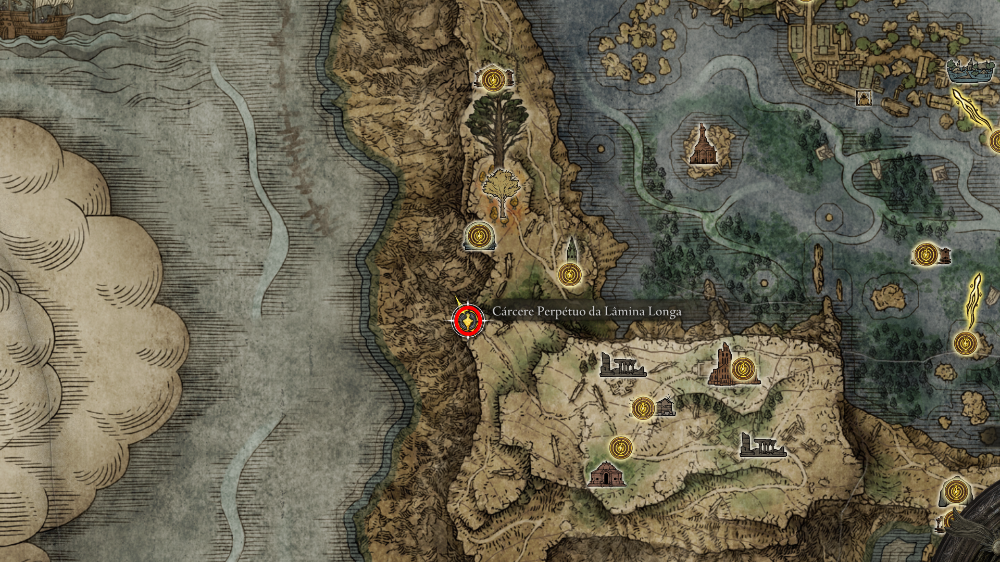
     
    <em>Localização do Cárcere Eterno do Líder no platô noroeste.</em>

    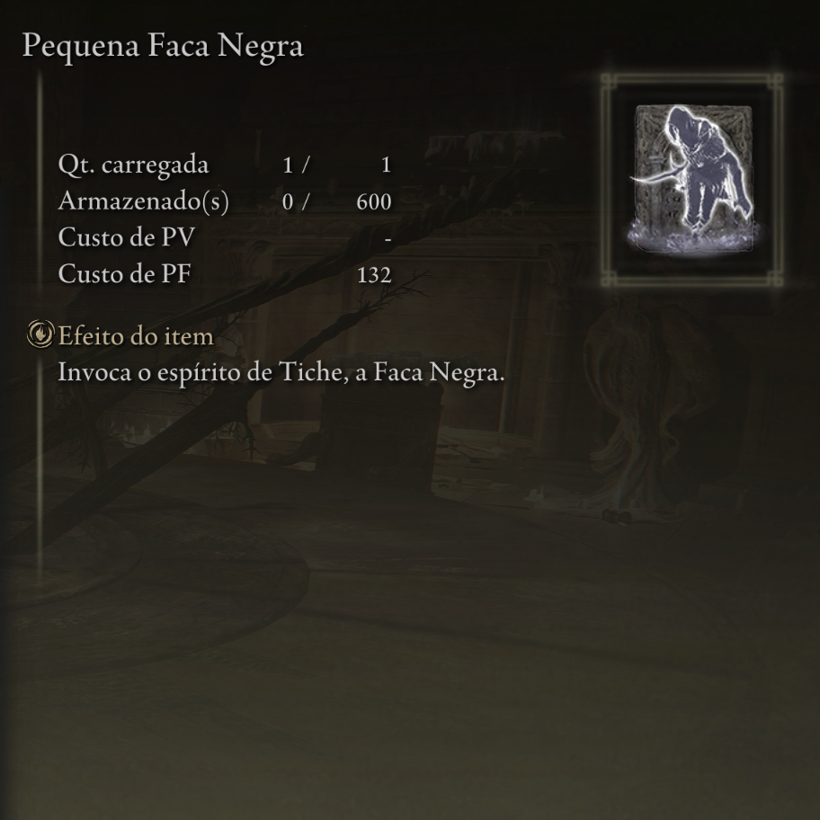
     
    <em>Tiche, a Faca Negra. Um dos espíritos lendários necessários para a platina.</em>

---

## 🌟 68. O Legado de Ranni (Item Lendário)
Siga para o sudoeste do Altar do Luar até a **Ascensão de Chelona** (Chelona's Rise) para buscar o conhecimento máximo da princesa.

**Descrição:** O selo da torre exige a resolução do enigma das "três bestas sábias". Você deve localizar e golpear três tartarugas gigantes espirituais espalhadas pelo Altar do Luar. 

**Importante:** Para que as tartarugas apareçam, interaja com a estátua próximo à porta da torre e siga com o Torrent **sem utilizar o teleporte**, pois se você viajar rapidamente, elas resetam e você terá que ativar o selo na torre novamente.

**Lore:** Este feitiço representa a lua gélida e oculta que guiou Ranni. Diferente da lua de sua mãe, Rennala, esta magia carrega o frio do cosmos e a promessa de uma jornada sob as estrelas.

* **Item:** **Lua Sombria de Ranni [FEITIÇO LENDÁRIO]**.
* **Dica:** As tartarugas estão em pontos distantes: uma atrás da torre no penhasco, uma ao leste em um desfiladeiro e a última flutuando sobre uma corrente de ar ao norte.

  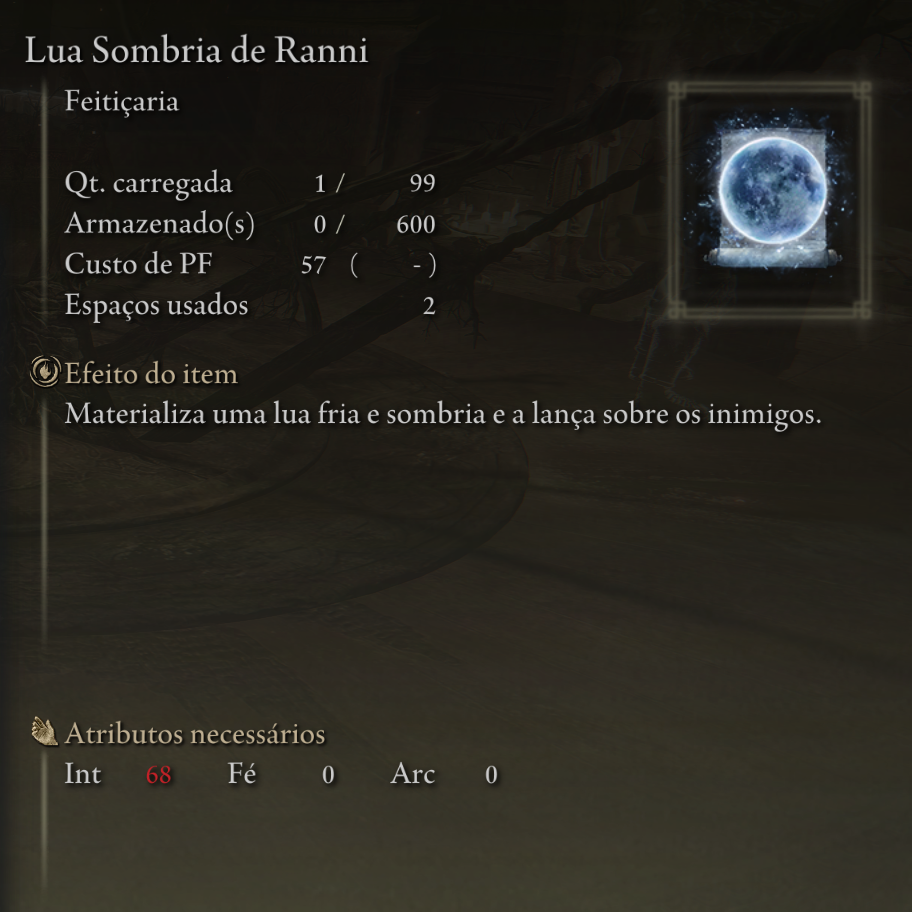
   
  <em>Figura 65: Atributos e descrição do Feitiço Lendário.</em>

    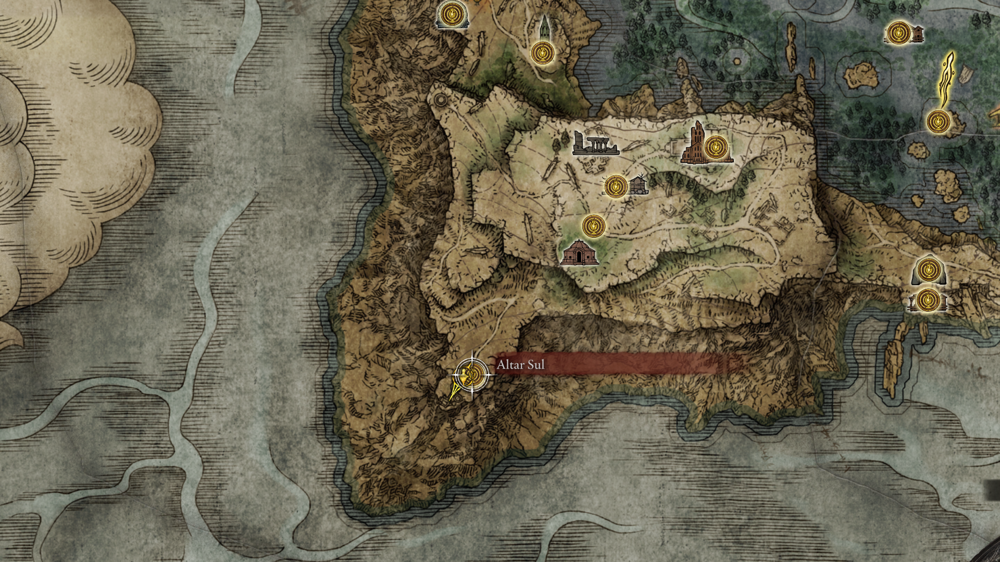
     
    <em>Figura 66: Localização inicial no Altar Sul e a estátua do enigma.</em>

    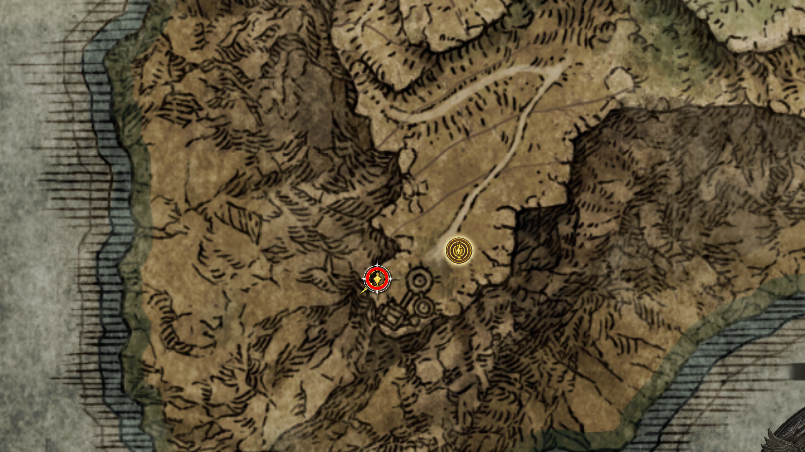
     
    <em>Figura 67: Localização da primeira tartaruga (Penhasco atrás da torre).</em>

    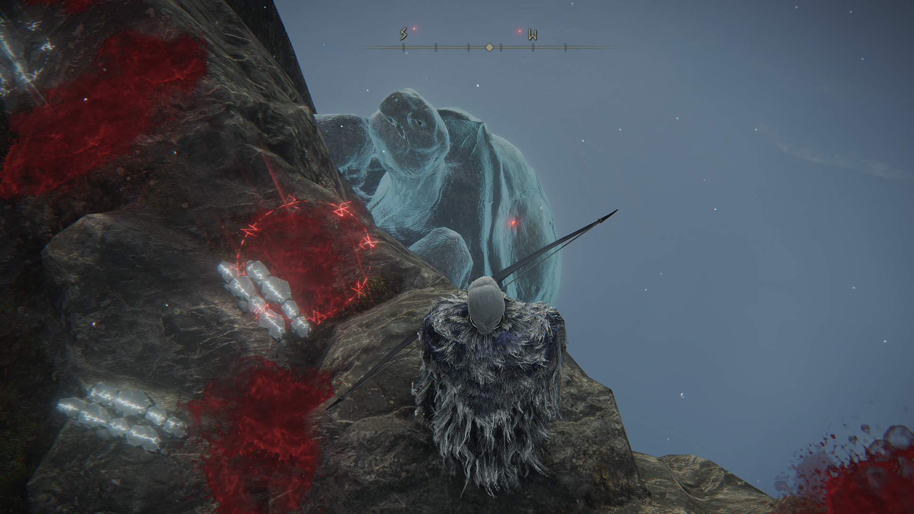
     
    <em>Figura 68: Detalhe da primeira tartaruga pendurada no despenhadeiro.</em>

    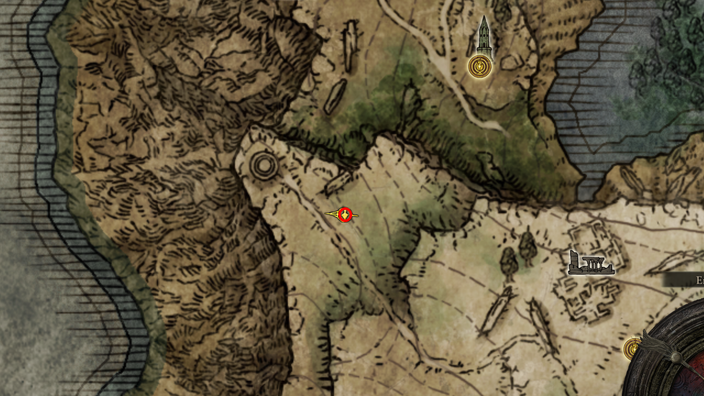
     
    <em>Figura 69: Localização da segunda tartaruga (Flutuando no céu ao Norte).</em>

    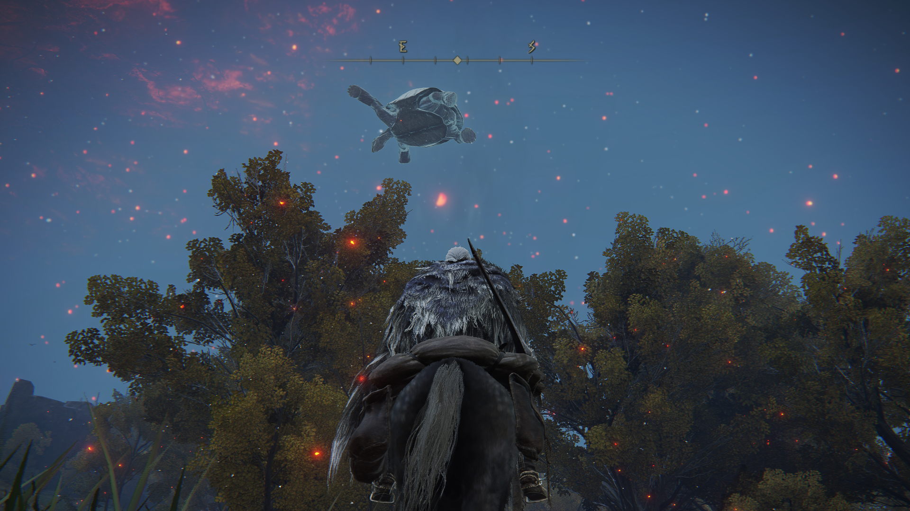
     
    <em>Figura 70: Detalhe da segunda tartaruga sobre a corrente de ar.</em>

    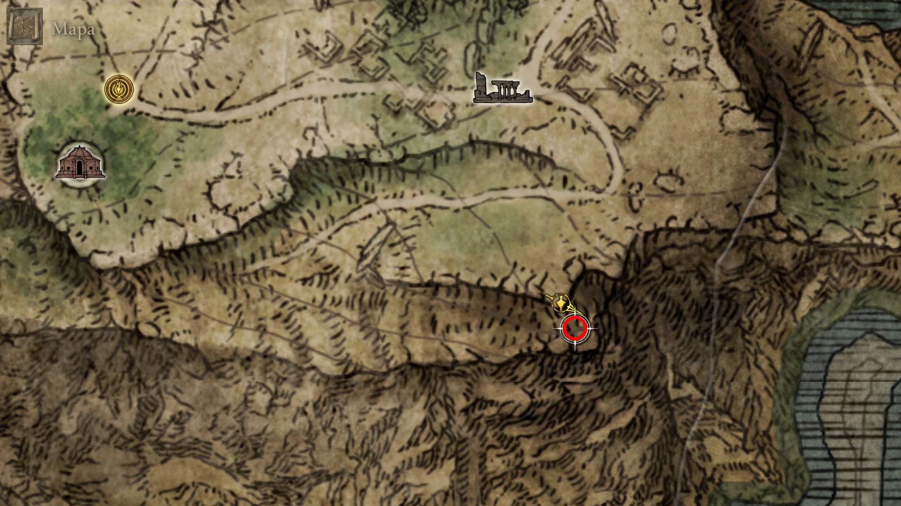
     
    <em>Figura 71: Localização da terceira tartaruga (Patamar ao Leste).</em>

    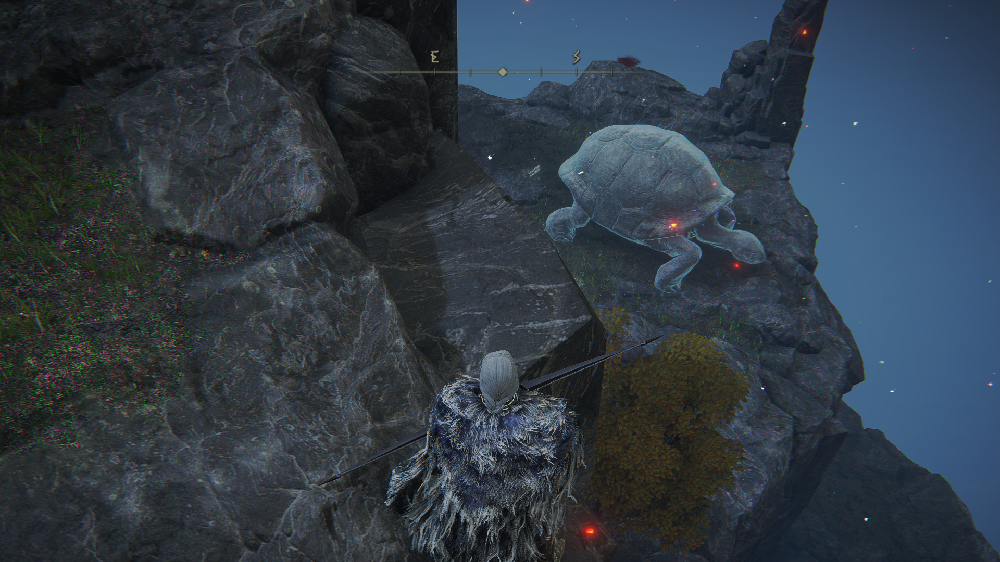
     
    <em>Figura 72: Detalhe da terceira tartaruga (Patamar ao Leste).</em>

    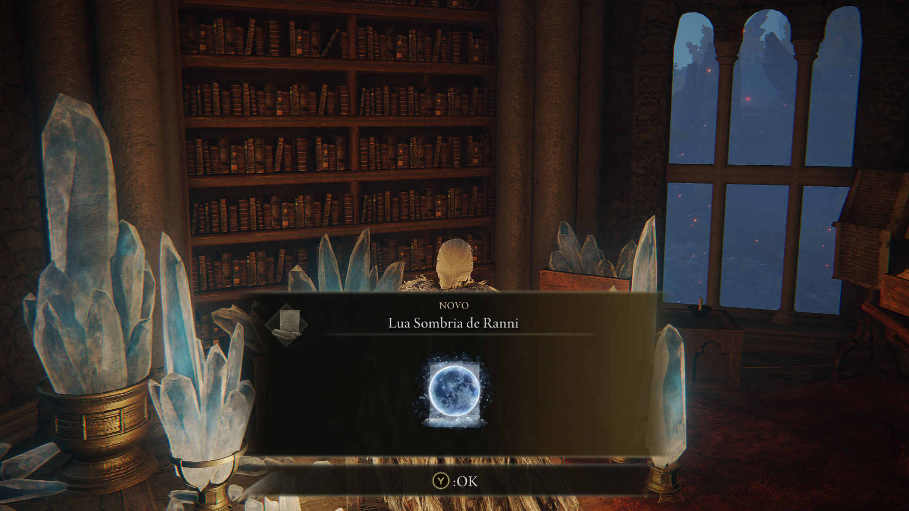
     
    <em>Figura 73: Coleta do item no baú após a quebra do selo da torre.</em>

---

## 69. Medalhão de Âmbar Cerúleo +2 (Stat Boost)
Nas **Ruínas da Regência Lunar**, localizadas a nordeste da torre, encontra-se a versão mais poderosa deste medalhão.

**Descrição:** O item está escondido em um porão selado por uma estátua de diabrete. Você precisará de uma **Chave de Espada de Pedra** para dissipar a névoa e acessar o baú.

**Lore:** Um medalhão de âmbar que contém o brilho da vida primordial. Esta gema azul simboliza a mente e o espírito, sendo que a variante +2 representa o ápice do conhecimento que os eruditos da Academia de Raya Lucaria buscavam alcançar.

* **Item:** **Medalhão de Âmbar Cerúleo +2**.
* **Dica:** Este é o melhor talismã do jogo para aumentar sua barra de mana (FP). Como a *Lua Sombria de Ranni* consome muito FP, equipar este medalhão permite que você conjure a magia mais vezes antes de precisar usar um frasco.

    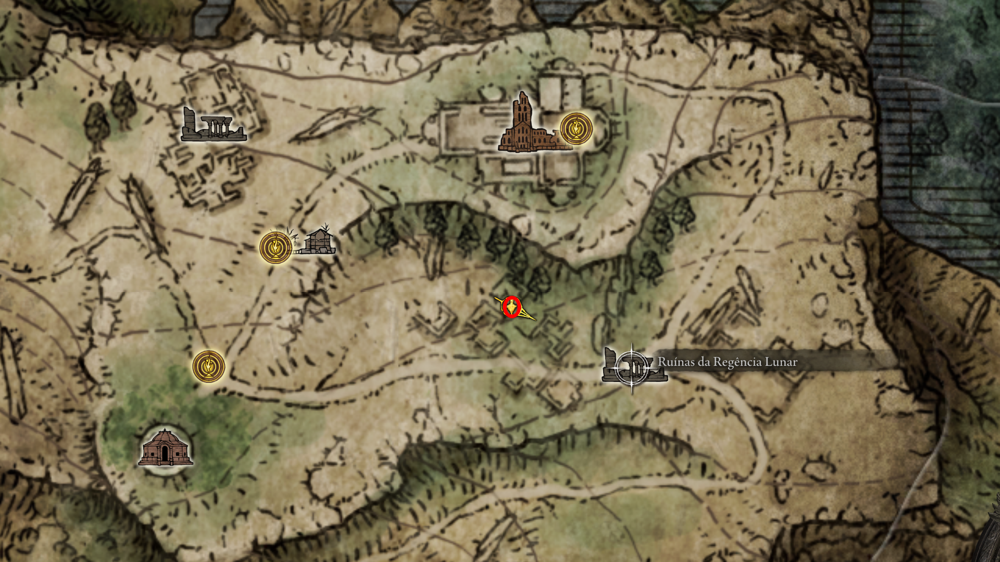
     
    <em>Figura 74: Localização nas Ruínas da Regência Lunar e atributos do talismã.</em>

---

[⬅️ Voltar para o Arquivo Principal](../README.md) | [🚩 Prosseguir par Profundezas da Raiz Profunda](../09_deeproot_depths/route.md)