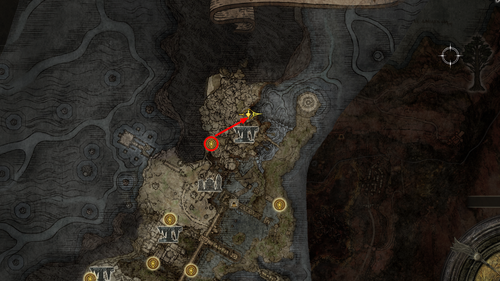
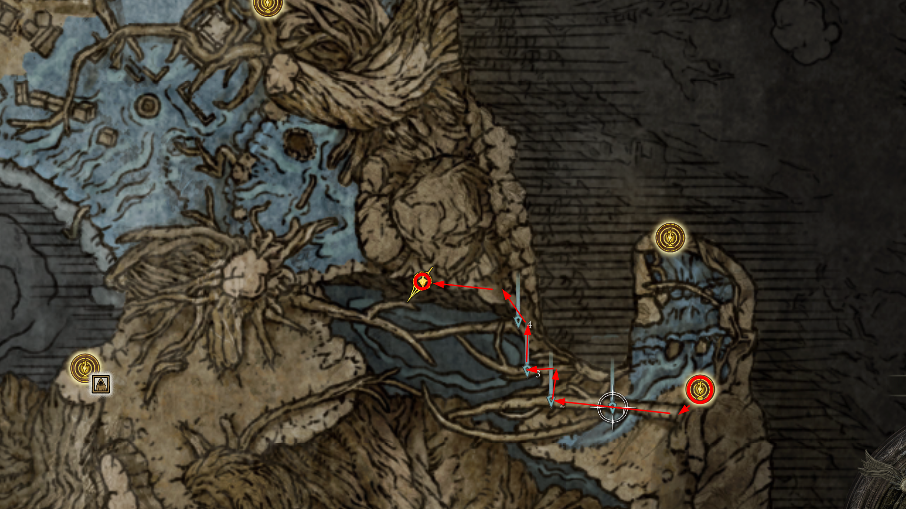
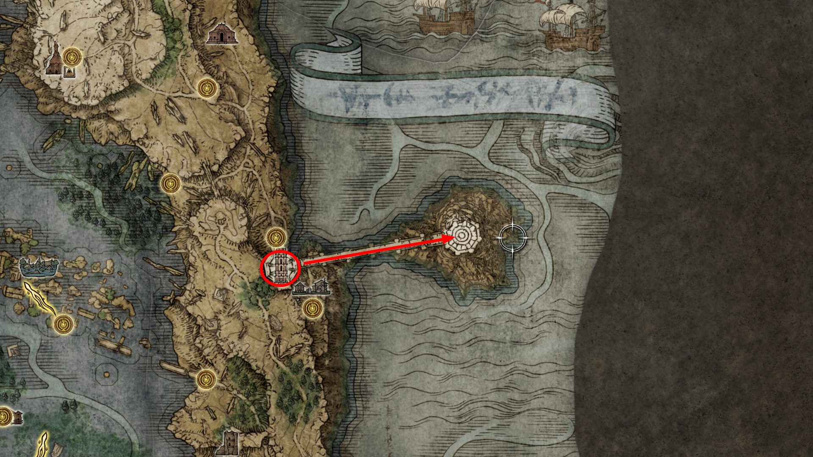
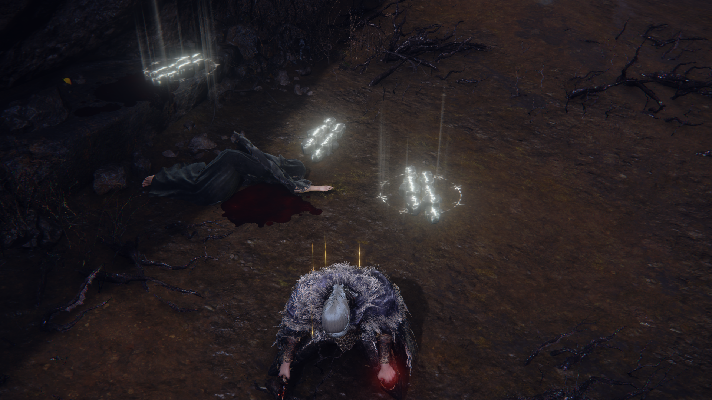

# 🗺️ Rota de Navegação e Exploração: Deeproot Depths

> **Ponto de Partida:** Aqueduto de Siofra (Nokron, a Cidade Eterna).
> **Status:** Região de Lore Crítica e Troféu de Platina.

  
   
  <em>Figura 65: Aqueduto de Siofra. O caminho para as profundezas começa aqui.</em>

---

## 🛡️ Etapa 1: O Aqueduto e o Irmão de D
Antes de acessar as profundezas, você deve atravessar o Aqueduto de Siofra, localizado ao norte da graça do "Penhasco da Vista do Aqueduto" em Nokron.

1. **O Encontro com Devin:** Logo na entrada do aqueduto, você encontrará o irmão de D sentado no chão. 
   * **Ação:** Entregue a **Armadura Inseparável** (Twinned Set) para ele agora. Isso é vital para o desfecho da quest da Fia mais tarde.
2. **Navegação:** Siga pelas plataformas superiores, eliminando os Cavaleiros do Cadinho (Crucible Knights) se desejar os itens, ou corra até a névoa do boss no final do corredor.

---

## ⚔️ O Desafio: Gárgulas Valentes (Valiant Gargoyles)
Este é o combate que bloqueia o acesso ao caixão. É uma luta de resistência e controle de arena.

* **Estratégia:** A luta começa com uma gárgula. Quando ela chegar a **50% de vida**, a segunda gárgula entrará na arena.
    * **Foco Total:** Tente matar a primeira gárgula o mais rápido possível assim que a segunda aparecer.
    * **Fraqueza:** Elas são imunes a sangramento, mas vulneráveis a **Dano de Impacto** e Magia.
    * **Dica:** Invoque a **Mimic Tear** para distrair uma enquanto finaliza a outra.

---

## 🟢 Etapa 2: O Despertar e o Mapa
Após a viagem no caixão, você estará nas raízes superiores da Térvore.

1. **Primeira Graça:** Ative "Cristas da Grande Cachoeira" (Great Waterfall Crest).
2. **[📍 MAPA] Fragmento de Mapa:** Atravesse as raízes gigantes para oeste. O mapa está em um corpo sob um pavilhão de pedra.
    * *Estratégia:* Use fogo contra as formigas de abdômen inflado para ganhar muitas runas.
3. **[🏆 PLATINA] Encantamento Lendário: Estrelas Prístinas:**
Partindo do local onde pegou o mapa, olhe para as raízes que sobem em direção à parede da caverna (nordeste).
* **O Caminho:** Siga pela raiz gigante que entra em uma abertura na rocha. Você passará por um túnel cheio de formigas gigantes.
* **Localização:** O item está em um corpo na borda de um penhasco interno, guardado por várias formigas rainhas.
* **Lore:** Diz-se que este é o encantamento mais antigo derivado da Vontade Maior. Ele representa a estrela dourada que trouxe a Besta de Elden para as Entre-terras, dando origem à Térvore.

* **Item:** **Estrelas Prístinas [ENCANTAMENTO LENDÁRIO]**.
* **Dica:** Este feitiço lança uma chuva de projéteis dourados que perseguem o inimigo. É excelente para manter pressão constante em bosses grandes, embora o dano individual das estrelas seja baixo.

    
     
    <em>Figura 65b: O Brilho Primordial. Encontrar este encantamento é um requisito obrigatório para o troféu de colecionador de magias.</em>

---

## 🔵 Etapa 3: A Cidade Submersa e Coletáveis
1. **Graça Intermediária:** Ative "Profundezas da Raiz Profunda".
2. **[⚔️ BOSS] Cavaleiro do Cadinho Siluria:** Norte/Oeste da cidade, guardando uma árvore oca.
   * **Recompensa:** Lança de Árvore de Siluria e o **Set do Cadinho (Árvore)**.
3. **[🎒 ITEM] Cajado do Príncipe da Morte:** No topo de uma torre na cidade submersa (requer parkour pelas raízes).

---

## 🟡 Etapa 4: A Ascensão e os Campeões da Fia
1. **Subida Técnica:** Use as raízes que saem da água e suba em direção aos edifícios altos.
2. **Graça de Checkpoint:** Ative "Através das Raízes" (Across the Roots).
3. **[⚔️ BOSS] Campeões da Fia:** Luta contra 5 NPCs em 3 ondas.
4. **O Abraço:** Após a luta, fale com Fia, peça para ser abraçado e **fale em segredo**.
    * *Nota:* Para avançar além daqui, você precisará do item da Etapa 5.

---

## 🔴 Etapa 5: [🏆 PLATINA] O Sonho e o Lichdragon

### 🧩 Invertendo o Salão de Estudos de Carian
1. **Localização:** **Salão de Estudos de Carian** (Leste de Liurnia).
2. **Ação:** Use a **Estátua Invertida de Carian** (presente de Ranni) no pedestal.
3. **Navegação Invertida:** Desça pelas vigas e plataformas com cuidado até o elevador final que leva à ponte.

  
   
  <em>Figura 66: Torre em Liurnia. O local onde o destino de Ranni e Fia se cruzam.</em>

### 🏰 A Torre Divina de Liurnia
1. **A Ponte:** Cruze a ponte (ignore ou mate o Nobre da Pele Divina).
2. **Item de Platina:** No topo da torre, colete a **Marca Curativa da Morte** (Cursemark of Death).

### ⚔️ BOSS LENDÁRIO: Lichdragon Fortissax
1. **O Ritual:** Volte para a Fia, entregue a Marca Curativa e descanse na fogueira até ela dormir.
2. **Ação:** Toque em Fia para entrar no "Sonho do Leito de Morte".
3. **Estratégia:** Ataque as patas traseiras. Cuidado com os raios vermelhos que causam acúmulo de Morte.
4. **Recompensa:** **Item para Troféu de Platina** e a Runa de Restauração do Príncipe da Morte.

---

## 🧗 Atalhos e Desfechos

* **A Vingança de D:** Após o dragão, recarregue a área. O irmão de D estará lá. Fale com ele, recarregue novamente e colete a **Espada Inseparável** e a armadura de volta.
* **Portal de Leyndell:** O portal ao lado de Fia agora está ativo (Requer 2 Grandes Runas).

  
   
  <em>Figura 67: Vingança de D.</em>

---

[⬅️ Voltar para o Arquivo Principal](../README.md) | [🍂 Prosseguir para Platô Altus ➡️](../10_altus_plateau/route.md)