# 🗺️ Rota de Navegação: Acesso ao Platô e Quest do Varré

> **Ponto de Partida:** Grande Elevador de Dectus ou Precipício Arruinado.
> **Status:** Ativando a rota para o Palácio Mohgwyn e suporte ao Boc.

---

## 🟢 Etapa 1: O Mapa e o Reencontro com Boc
Seu primeiro objetivo ao chegar no Platô é desbloquear a visão da área e falar com seu fiel costureiro.

1. **[📍 MAPA] Fragmento de Mapa:** Siga pela estrada principal ao norte. O monumento está do lado esquerdo, logo antes da bifurcação principal.
2. **O Boc:** Ele estará na Graça **Junção da Estrada de Altus**. Fale com ele para progredir sua linha de quest.

  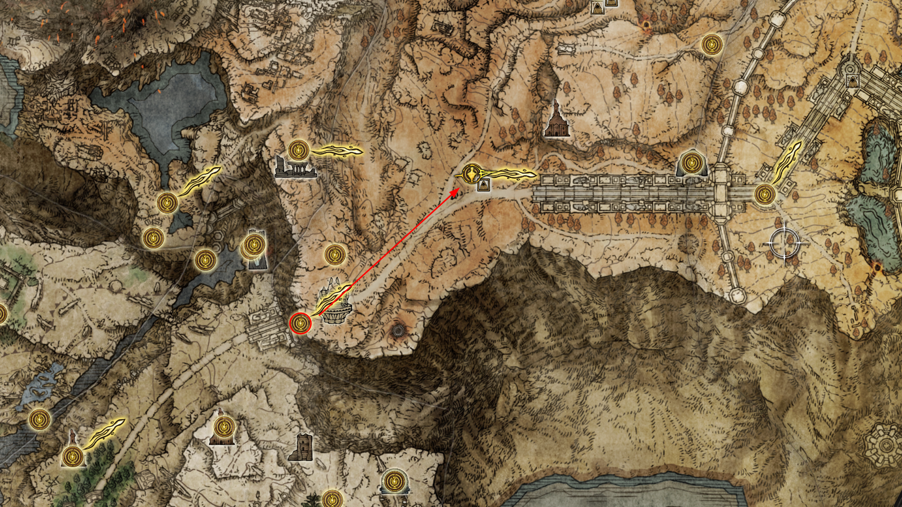
   
  <em>Figura 1: Localização do monumento do Mapa e da fogueira onde Boc se encontra.</em>

---

## 🔵 Etapa 2: Ruínas de Writheblood e o Acesso ao Palácio Mohgwyn

Esta etapa é fundamental para quem deseja acessar o Palácio de Mohg cedo no jogo sem precisar de invasões online.

1. **Localização:** Vá para o extremo norte do Platô, nas **Ruínas de Writheblood**.
2. **Ação:** Procure por um sinal de invasão vermelho no chão. Você deve invadir e derrotar o NPC **Magnus, a Garra Bestial**.
3. **Progresso:** Derrotá-lo cumpre o requisito de invasões da quest.

  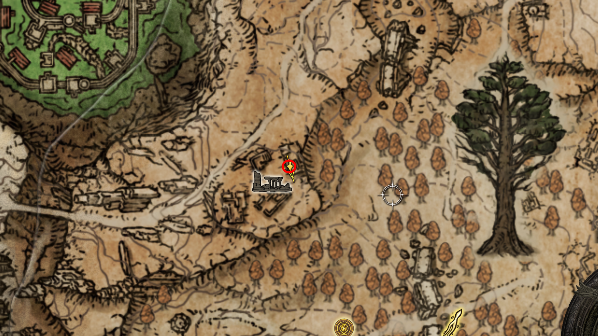
   
  <em>Figura 2: O sinal de Magnus fica dentro das ruínas. Cuidado com os cães que causam hemorragia massiva.</em>

4. **O Ritual do Sangue (Varré):**
   * Volte à **Igreja da Rosa** (em Liurnia) e fale com Varré. Ele irá te ungir e entregar o item **Favor do Senhor do Sangue** (um pano branco).
   * **A Donzela:** Para tingir o pano, vá até a **Igreja da Inibição** (ao norte de Liurnia, subindo a Vila da Chama Frenética). 
   * **Ação:** Interaja com a donzela morta sentada na cadeira para tingir o pano com o sangue dela.
5. **Recompensa Final:** Volte ao Varré, entregue o pano tingido e ele lhe dará a **Medalha de Cavaleiro de Sangue Puro**.
   * **Uso:** Ao usar este item no seu inventário, você será teletransportado diretamente para o **Palácio Mohgwyn**.

  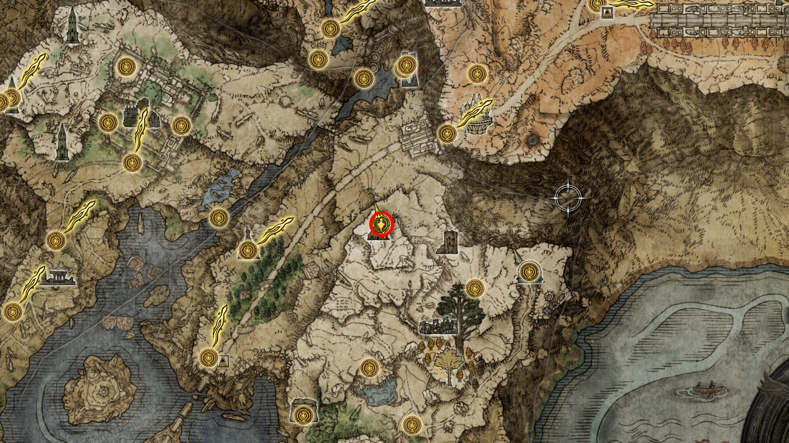
   
  <em>Figura 3: Localização da Igreja da Inibição. Cuidado com o medidor de "Loucura" ao subir a colina.</em>

---

## 🟡 Etapa 3: Segunda Igreja de Marika e o Destino do Arruaceiro

Nesta fase, garantimos itens cruciais para combater o Sangue e avançamos na história de um dos NPCs mais carismáticos (e trágicos) do jogo.

### 1. Segunda Igreja de Marika (O Fim de Yura)
Localizada a oeste da estrada principal do Platô Altus.

* **Evento:** Ao entrar na igreja, você encontrará **Yura, o Caçador de Dedos**, caído no chão. Ele lhe entregará a espada **Nagakiba** antes de morrer.
* **Invasão:** Imediatamente após, você será invadido por **Eleonora, Dedo Sangrento Violeta**.
* **[⚔️ BOSS] Estratégia contra Eleonora:**
    * Ela usa ataques rápidos de hemorragia com lâmina dupla.
    * Use ataques de quebra de postura. 
* **[🏆 ITEM CHAVE] Recompensas:**
    * **Lâmina Dupla de Eleonora:** Uma das melhores armas de Sangue/Destreza.
    * **Lágrima de Cristal Purificadora:** **OBRIGATÓRIA** para a luta contra o Mohg (anula a maldição de sangue dele).

  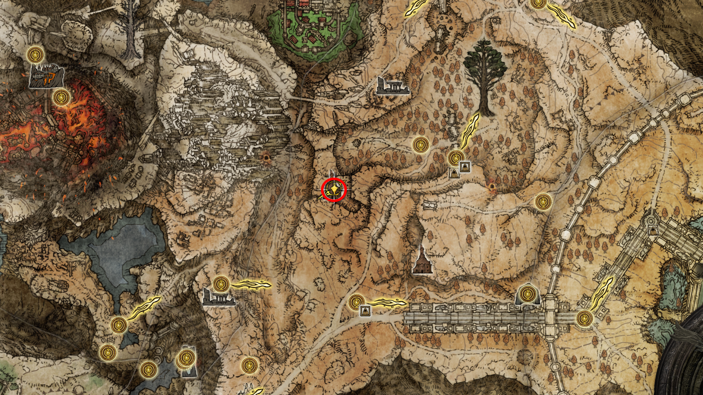
   
  <em>Figura 4: Localização da Segunda Igreja de Marika. Essencial para obter a proteção contra Mohg.</em>

---

### 2. O Arruaceiro (Blackguard Big Boggart) em Altus
Se você comprou o colar da Rya com ele e comprou seus Camarões Cozidos em Liurnia, ele se mudará para Altus.

* **Localização:** Ele estará relaxando perto de um pequeno lago/fosso ao sul da entrada da Capital Real (Leyndell).
* **Ação:** Fale com ele e compre seus novos **Caranguejos Cozidos** (o melhor item de defesa física do jogo).
* **Conexão com o Comedor de Estrumes (Dung Eater):** * Se você avançar na quest do Dung Eater, ele aparecerá aqui para atacar o Arruaceiro. 
    * *Dica:* Recomendo comprar o máximo de caranguejos que puder antes de avançar na quest do Dung Eater, para garantir seu estoque.

  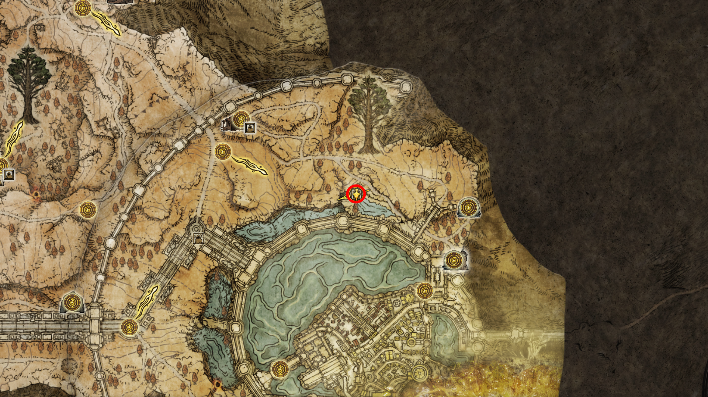
   
  <em>Figura 5: O Arruaceiro se encontra no fosso externo de Leyndell, vendendo os valiosos caranguejos.</em>

---

## 🌸 Etapa 4: A Jornada de Millicent em Altus

Antes de cruzar os portões da Capital, devemos ajudar Millicent a recuperar sua capacidade de luta.

### 1. Encontro na Colina da Árvore Erdtree
Após sair de Caelid, Millicent estará esperando por você no Platô Altus.

* **Localização:** Logo ao norte da Graça **Colina da Árvore Erdtree** (Erdtree-Gazing Hill). Ela estará olhando para a paisagem.
* **Diálogo:** Ela dirá que, embora tenha recuperado a vontade, não consegue mais empunhar uma espada sem o braço direito.

  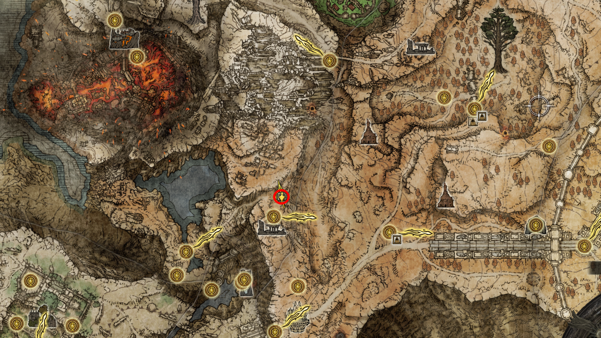
   
  <em>Figura 6: Localização da Millicent.</em>

---

### 2. O Castelo Sombreado (The Shaded Castle)
Para ajudá-la, você precisa de uma prótese que está guardada em um castelo ao norte.

* **O Item:** **Prótese da Valquíria** (Valkyrie's Prosthesis).
* **Onde encontrar:** No lado noroeste do castelo, guardada por um Cavaleiro do Cadinho em uma sala pequena. Você não precisa matar o chefe do castelo agora para pegar este item, mas é recomendado para a Platina.

  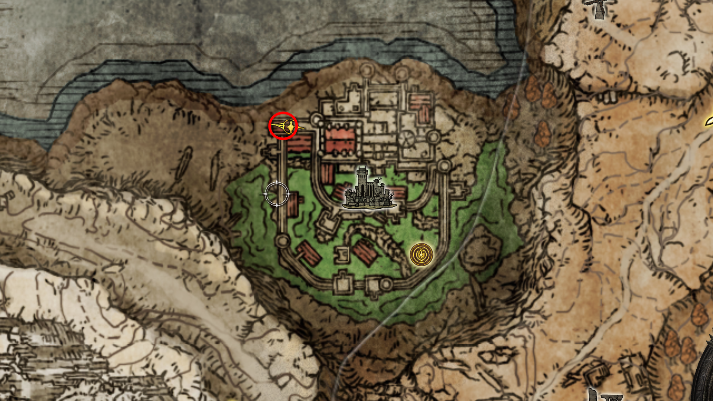
   
  <em>Figura 7: Localização da Prótese dentro do Castelo Sombreado.</em>

---

### 3. [⚔️ BOSS LENDÁRIO] Elemer do Espinheiro (Elemer of the Briar)
* **Localização:** No topo da torre central do castelo.
* **O Combate:** Ele usa ataques de telecinésia com a espada. Fique próximo dele para evitar que ele use os ataques flutuantes de longo alcance.
* **[🏆 PLATINA] Recompensa:** Dropa a **Espada de Execução de Marais** (Uma das 9 Armas Lendárias para o troféu) e o Escudo de Briar.

  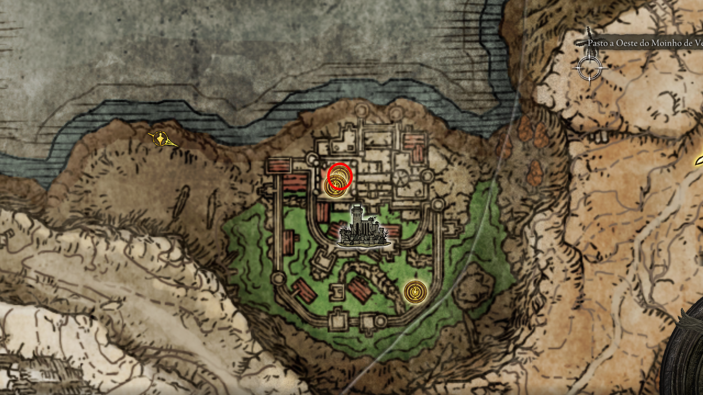
   
  <em>Figura 8: Elemer do Espinheiro na sala do trono. Vitória essencial para a conquista de colecionador de armas.</em>

---

### 4. [🎒 ITEM] Rapieira de Formiga (Antspur Rapier)
Ao sair do castelo (ou nos arredores do lado de fora, na área oeste/noroeste), você encontrará um NPC hostil.

* **NPC:** **Maleigh Marais, Shaded Castle Castellan**.
* **Localização:** Ele patrulha o campo aberto a oeste das muralhas do castelo.
* **Recompensa:** Ao derrotá-lo, você obtém a **Rapieira de Formiga**.
    * *Dica:* Esta arma é extremamente forte pois causa **Podridão Escarlate** (Scarlet Rot) passivamente e aceita Cinzas de Guerra de Sangue ou Veneno, permitindo triplo status negativo.

  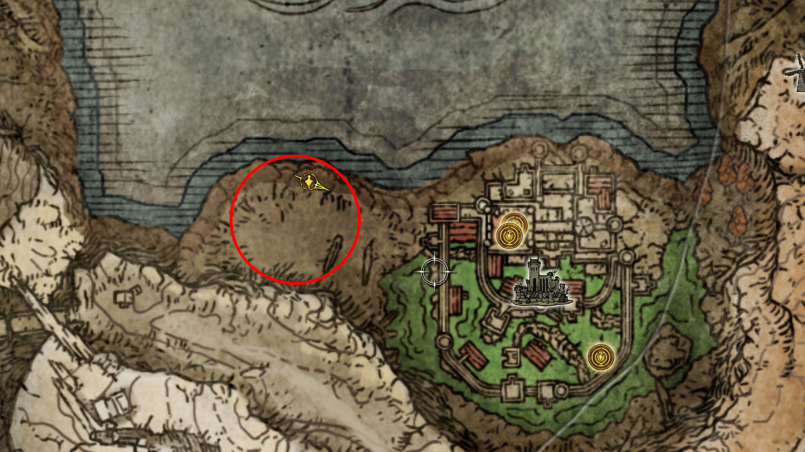
   
  <em>Figura 9: Localização do NPC Maleigh Marais nos campos externos do castelo.</em>

---

### 5. Entrega e Reencontro em Dominula
* **Ação:** Volte para a Millicent na Colina e entregue a Prótese.
* **O Próximo Passo (Dominula):** Vá para o **Vilarejo dos Moinhos** (Dominula) ao norte de Altus.
* **Evento:** Derrote o chefe **Apóstolo da Pele Divina** no topo da colina. Descanse na Graça e Millicent aparecerá lá.
    * *Dica:* Ela estará muito agradecida e pronta para ser invocada em batalhas futuras (incluindo o Sentinela de Leyndell).

  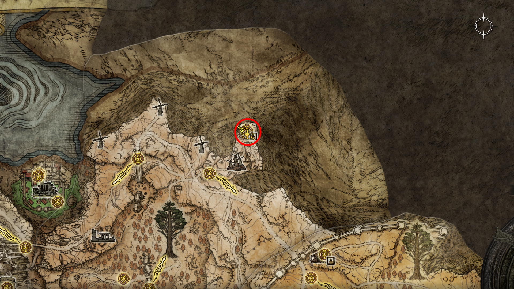
   
  <em>Figura 10: Millicent após recuperar a prótese no Vilarejo dos Moinhos.</em>

---

## 🏰 Etapa 5: Infiltração em Leyndell (Sentinela, Boc e Dung Eater)

Agora que você tem o apoio de Millicent e limpou o norte de Altus, é hora de romper o cerco da Capital Real.

### 1. O Sentinela da Árvore Draconiano
Este é o "porteiro" de Leyndell. Ele bloqueia o acesso à ponte nordeste que leva à capital.

* **Invocação:** Procure pelo sinal dourado da **Millicent** e da **Tragoth** no chão de pedra um pouco antes do boss.
* **Dica:** Ele é imune a raios, mas vulnerável a **Veneno** e **Podridão Escarlate** (use a sua nova Rapieira de Formiga aqui!).

  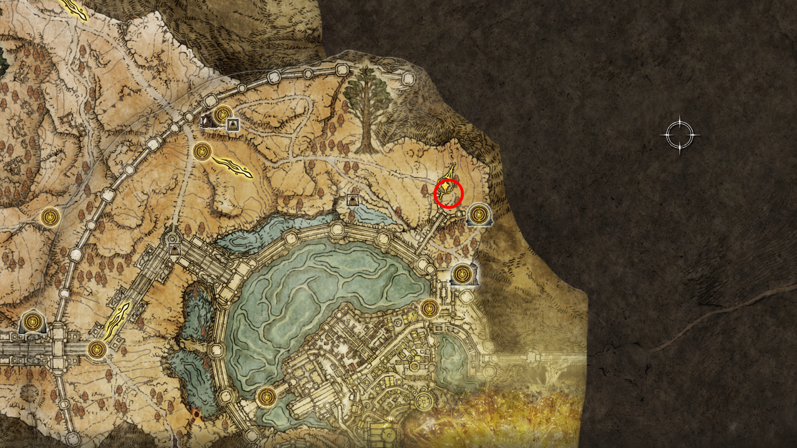
   
  <em>Figura 11: Localização do Sentinela Draconiano e área de invocação dos aliados.</em>

---

### 2. O Primeiro Checkpoint e o Destino de Boc
Após derrotar o Sentinela e subir o grande elevador, você entrará oficialmente em Leyndell.

* **Localização:** Graça **Bastião Leste da Capital** (East Capital Rampart).
* **Ação Crítica:** Fale com o **Boc**. Se ele pedir a Lágrima Larvar, **NÃO ENTREGUE**. Fique parado na frente dele e use o item de voz **"Você é Lindo"** (Prattling Pate "You're Beautiful").
* **Resultado:** Ele desistirá da ideia de renascer e aceitará quem ele é, permanecendo vivo para o resto do jogo.

  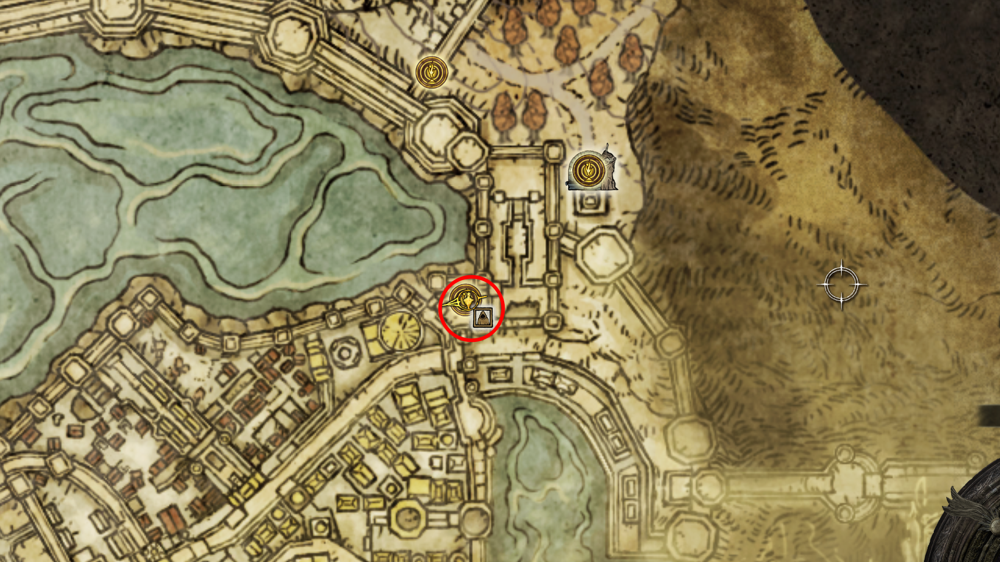
   
  <em>Figura 12: Boc sentado na fogueira do Bastião Leste. Não esqueça de falar com ele antes de avançar.</em>

---

### 3. A Primeira Maldição do Viveiro (Dung Eater)
Este item é necessário para que o Comedor de Estrumes te entregue a chave dos esgotos na Mesa-Redonda.

* **Caminho:** 
    1. Saia da sala do Boc para a varanda.
    2. Siga em frente pela muralha e entre na primeira porta à direita (onde há um elevador).
    3. No prédio à frente, suba a escada de mão. O item está em um corpo numa cadeira no topo.
* **Objetivo:** Leve a Maldição até o espectro do Comedor de Estrumes na Mesa-Redonda para receber a **Chave do Cárcere dos Esgotos**.

  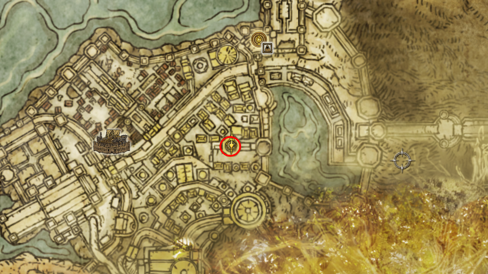
   
  <em>Figura 13: Caminho para a primeira Maldição do Viveiro dentro da Capital.</em>

---

### 4. Graça da Varanda da Avenida (Avenue Balcony)
Após coletar a Maldição do Viveiro, seu objetivo é estabelecer o ponto de controle central da cidade para facilitar a navegação futura.

* **Caminho:** 
    1. Saia do prédio da Maldição e volte para a muralha principal.
    2. Siga pelo caminho que desce em direção ao centro da cidade (você verá os telhados e o imenso Dragão de Pedra).
    3. Pegue o elevador que desce para o nível da rua.
    4. Siga pela avenida principal e procure uma escadaria à esquerda que desce para uma fogueira protegida.
* **Importância:** Este é o melhor ponto para farmar itens, acessar a asa do dragão e descer para os esgotos onde está o corpo físico do Dung Eater.

  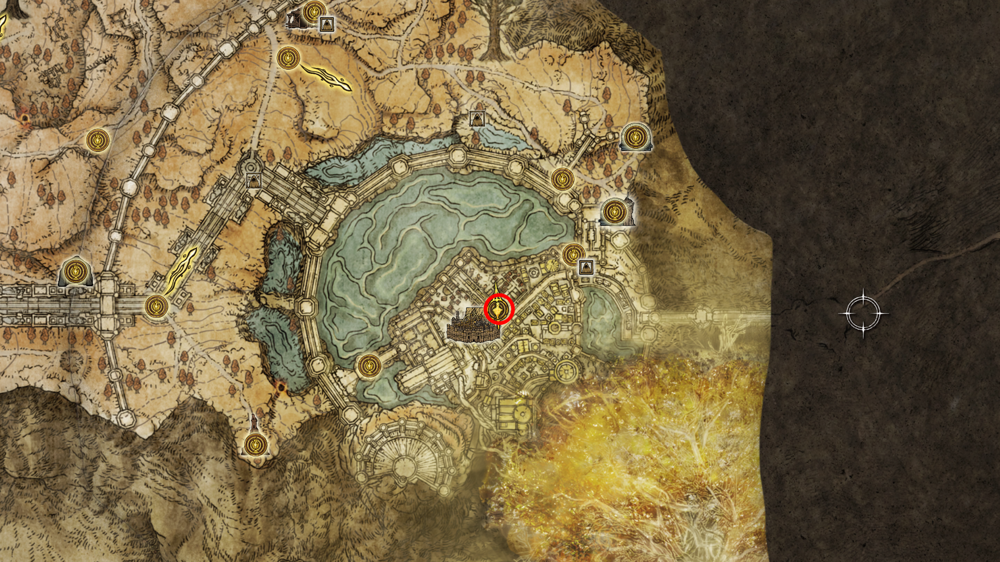
   
  <em>Figura 14: Graça Varanda da Avenida. O hub central para toda a exploração interna de Leyndell.</em>

---

## 🏰 Etapa 6: Retorno Estratégico à Mesa-Redonda

Após estabelecer sua base na Varanda da Avenida, é hora de "dar baixa" nas quests com os NPCs antes de descer aos esgotos ou subir ao trono.

### 1. Comedor de Estrumes (Dung Eater) - O Passo Decisivo
Agora que você tem a Maldição do Viveiro no inventário, o espectro dele finalmente falará com você a sério.

* **Ação:** Entregue a Maldição para ele no quarto após o mestre Hewg.
* **Recompensa:** Ele lhe entregará a **Chave do Cárcere dos Esgotos** (Sewer-Gaol Key).
* **Próximo Objetivo:** Esta chave abre a cela física dele nos esgotos de Leyndell, permitindo que você o liberte (ou o mate).

  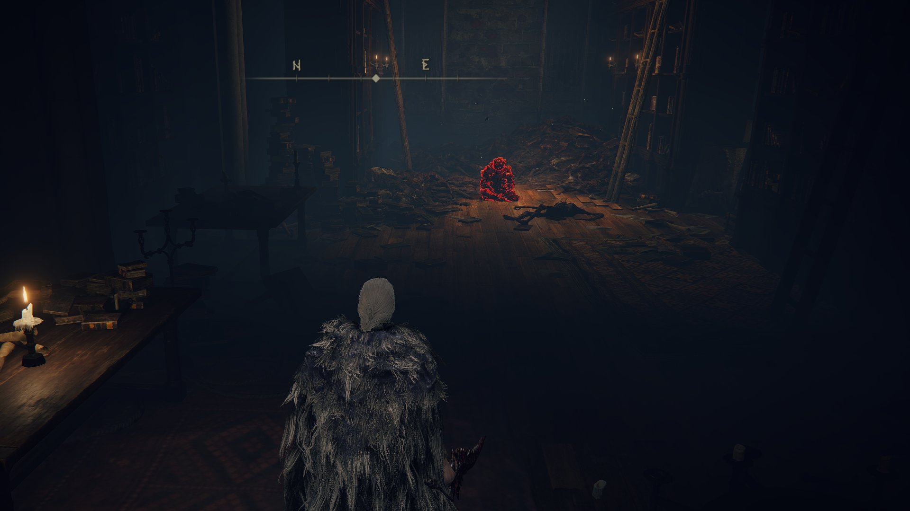
   
  <em>Figura 15: Entregando a maldição para obter a chave dos esgotos.</em>

---

### 2. Sir Gideon Ofnir (O Onisciente)
Ao entrar em Leyndell, Gideon terá novas informações sobre os Semideuses restantes.

* **Ação:** Fale com ele sobre os "Membros da Família Real" e sobre o paradeiro de Miquella e Malenia (se já tiver pistas).
* **Recompensa:** Dependendo das informações que você compartilha, ele pode te dar **Livros de Orações** ou **Receitas de Culinária** raras.

---

### 3. Mesa-Redonda: O Início da Peregrinação
Antes de qualquer coisa em Altus, você precisa "liberar" o NPC da base.

* **Ação:** Fale com o **Irmão Corhyn**. Ele dirá que pretende sair em busca do mestre **Goldmask**.
* **Resultado:** Após descansar, ele deixará a Mesa-Redonda.
* **Nota:** Se você não fizer isso, ele nunca aparecerá no Platô Altus.

  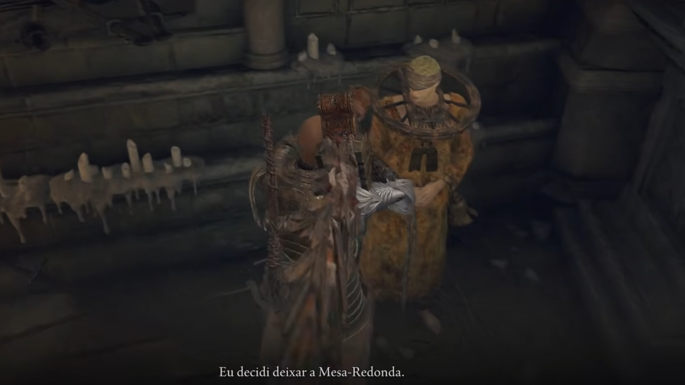
   
  <em>Figura 16: Corhyn anunciando sua partida da Mesa-Redonda.</em>

---

### 4. Platô Altus: O Reencontro e a Reunião
Agora que ele está em campo, o objetivo é reunir discípulo e mestre.

1. **Localização do Corhyn:** Ele estará parado ao lado da estrada, logo após a fogueira **Junção da Estrada de Altus** (perto de onde você pegou o mapa e falou com o Boc).

  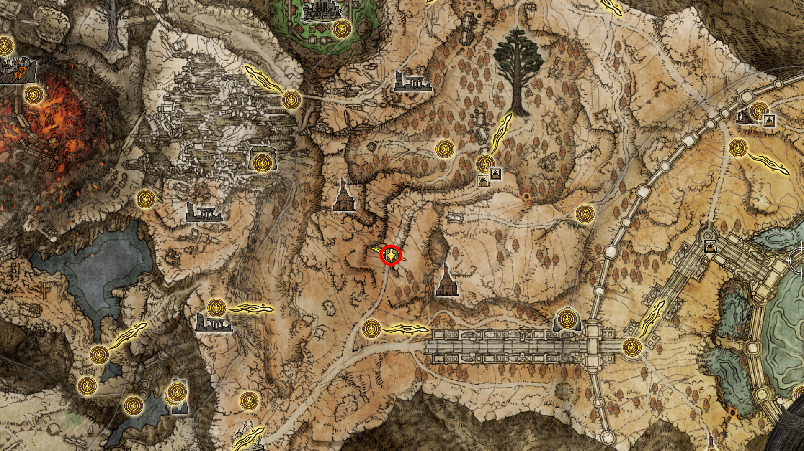
   
  <em>Figura 17: Localização de Corhyn na estrada perto do mapa.</em>

2. **Localização do Goldmask:** * Siga para o norte até a **Grande Ponte Atravessa-Floresta**. 
   * Use o portal de teletransporte no final da ponte para ir para a seção norte (quebrada).
   * Goldmask estará na ponta da ponte olhando para a Térvore. **Interaja com ele (ele ficará em silêncio).**
3. **A Reunião:** Volte ao Corhyn, conte a localização do mestre. Depois, retorne à ponte para vê-los juntos.

  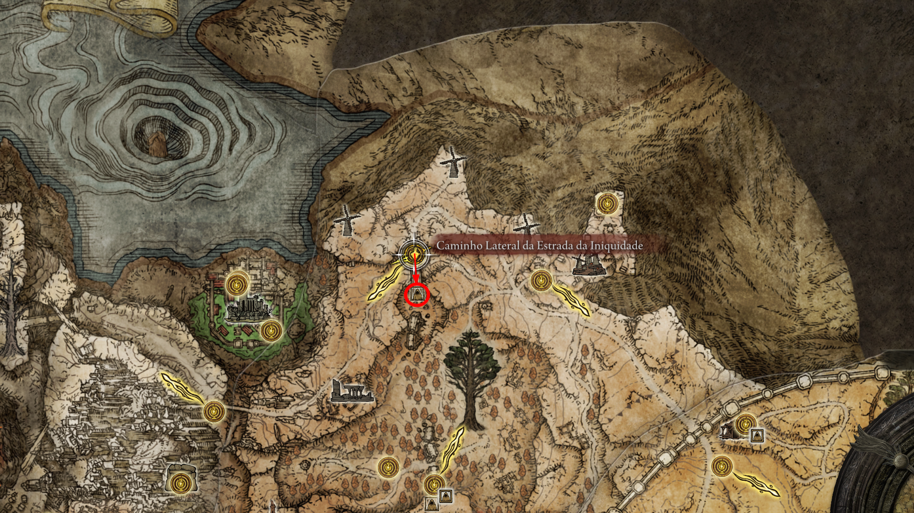
   
  <em>Figura 18: Localização de Corhyn na estrada e o posterior encontro na ponte norte.</em>

---

## 💎 Etapa 7: O Cárcere Perpetúo e Upgrades de Platina

Antes de mudar de região, precisamos garantir um dos itens lendários que fica escondido "debaixo" do grande elevador.

### 1. Cárcere Perpetúo da Linhagem Dourada (Golden Lineage Evergaol)
Este cárcere é fundamental para a Platina.
* **Localização:** Fica logo abaixo do penhasco do Grande Elevador de Dectus. Você precisa de uma **Chave de Espada de Pedra** para entrar.
* **[⚔️ BOSS] Godefroy, o Enxertado:** Uma versão mais forte do Godrick.
* **[🏆 PLATINA] Recompensa:** **Ícone de Godfrey** (Um dos 8 Talismãs Lendários para o troféu).
    * *Efeito:* Aumenta o poder de feitiços, encantamentos e habilidades carregadas.

  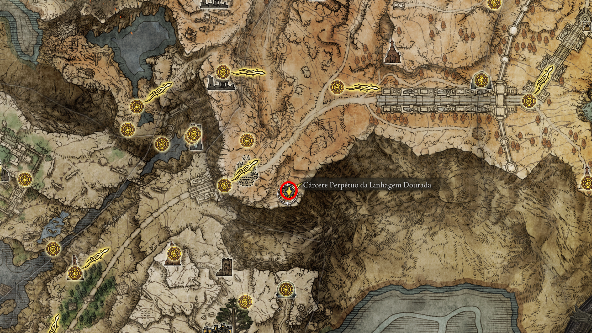
   
  <em>Figura 19: Localização do Cárcere. Use o caminho lateral logo ao chegar em Altus pelo Elevador.</em>

---

### 2. [⚔️ MINI-BOSS] Assassina da Faca Negra (Black Knife Assassin)
* **Localização:** Guardando a porta de entrada do **Túmulo do Herói de Sainted**.
* **O Combate:** Ela é extremamente ágil. Use ataques de quebra de postura ou habilidades com grande área de impacto.
* **Recompensa:** **Faca Negra** (Black Knife).
    * *Nota:* Embora não seja uma das "Armas Lendárias" para o troféu, é uma das melhores adagas do jogo para builds de Fé/Destreza devido à sua habilidade que reduz o HP máximo dos inimigos.

### 3. [🏰 DUNGEON] Túmulo do Herói de Sainted
Esta masmorra utiliza uma mecânica de luz: você precisa atrair os inimigos sombrios para os círculos de luz no chão para poder feri-los.

* **[🏆 PLATINA] Recompensa (Chefe):** **Cinzas de Kristoff, Cavaleiro do Dragão Antigo**.
    * **Status:** Este é um dos **6 Espíritos Lendários** necessários para o troféu "Espíritos Lendários".
    * **Efeito:** Um dos tanques mais poderosos do jogo, usa ataques de raio e escudo grande.

  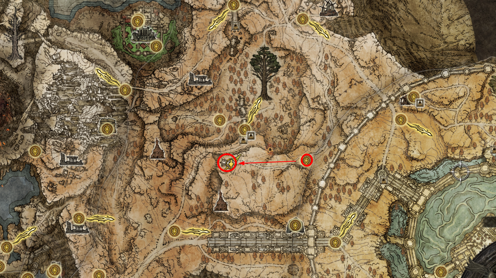
   
  <em>Figura 20: Vitória contra o Herói de Zamor. Kristoff é essencial para a coleção de platina.</em>

---

### 4. Igreja do Invocador da Tempestade (Stormcaller Church)
Após sair do túmulo, suba a colina para finalizar a área.

* **Item:** **Lágrima Sagrada** (Upgrade de frasco).
* **Localização:** No altar da igreja em ruínas. Cuidado com os raios constantes na área externa.

  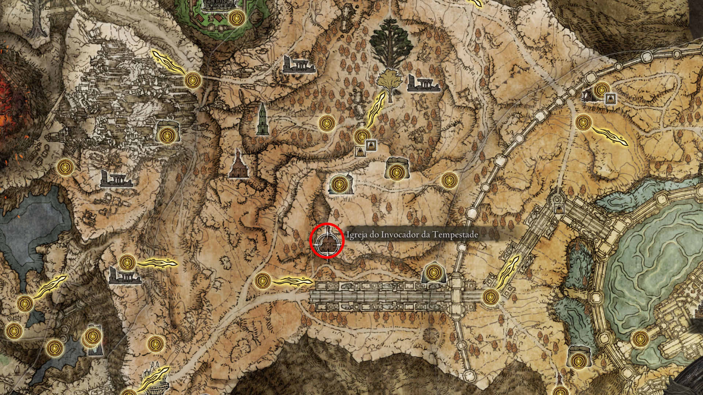
   
  <em>Figura 21: Localização da Igreja acima do túmulo.</em>

---

[⬅️ Voltar para o README.md](README.md) | [Prosseguir para Leyndell ➡️](../11_royal_capital/README.md)