## 🗺️ Rota de Navegação: Monte Gelmir e Mansão Vulcânica

## 🌒 Etapa 1: A Caçada Noturna (Bell Bearing Hunters)

**Regra Geral de Ativação:**
1. Vá até o local durante o **dia** e fale com o NPC Mercador/Mestre.
2. Descanse na Graça e mude o tempo para a **Noite**.
3. Descanse **novamente** (sem mudar o tempo) para o NPC desaparecer.
4. Entre na construção/cabana e o boss irá spawnar.

### 1. Limgrave: Cabana do Mestre da Guerra (Warmaster's Shack)
O primeiro e mais simples, ideal para testar sua build atual.
* **Recompensa:** Sino de Mercador de Ossos (Libera compra de ossos finos/pesados).
* **Dificuldade:** Baixa.

  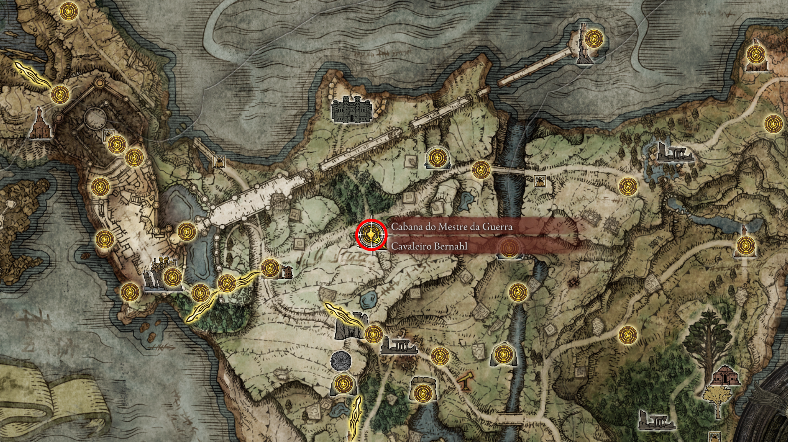
   
  <em>Figura 1: O Caçador de Sinos na Cabana do Mestre da Guerra.</em>

### 2. Liurnia: Igreja dos Votos (Church of Vows)
Onde fica a Tartaruga Miriel (o Papa Tartaruga).
* **Recompensa:** Sino de Mercador de Carnes (Libera compra de carnes de pescoço de tartaruga).
* **Dificuldade:** Média.

  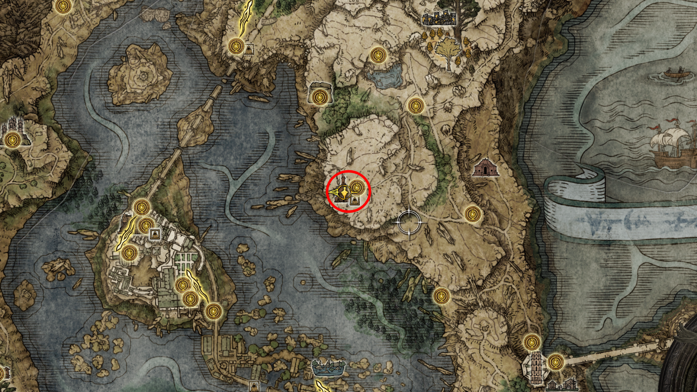
   
  <em>Figura 2: O Caçador de Sinos na Igreja dos Votos.</em>

### 3. Caelid: Cabana do Mercador Ermitão (Hermit Merchant's Shack)
Localizada no norte de Caelid (Dragonbarrow). Este é **muito forte**, cuidado com o dano massivo.
* **Recompensa:** Sino de Mercador de Pedras de Gravidade (Libera compra de leques e pedras de gravidade).
* **Dificuldade:** Altíssima.

  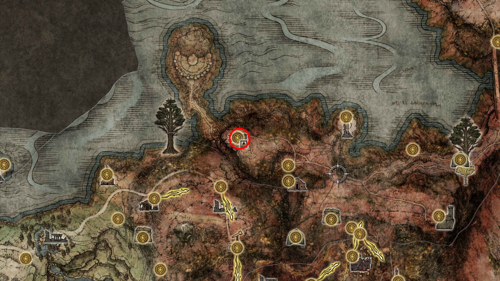
   
  <em>Figura 3: O Caçador de Sinos. Ele usa telecinésia na espada, mantenha distância ou use quebra de postura.</em>

### 4. Altus/Leyndell: Cabana do Mercador Ermitão (Capital Outskirts)
Fica do lado de fora das muralhas, na zona das escadarias antes de entrar em Leyndell.
* **Recompensa:** Sino de Mercador de Remédios (Libera compra de bolos de estancamento e neutralização).
* **Dificuldade:** Alta.

  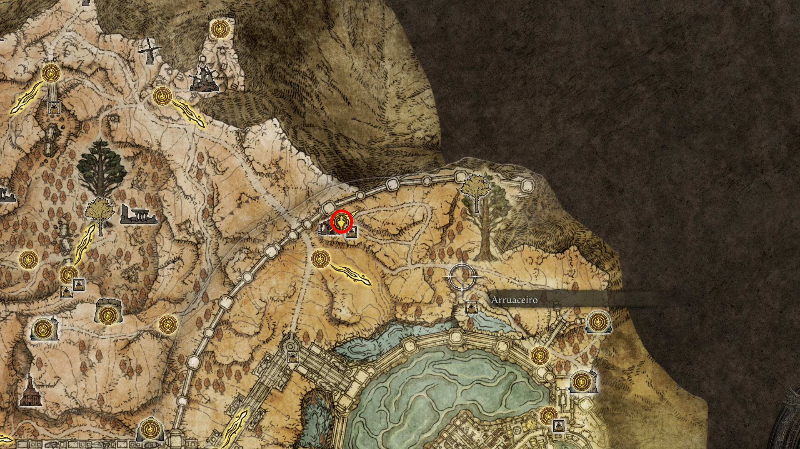
   
  <em>Figura 4: O Caçador de Sinos. Ele usa telecinésia na espada, mantenha distância ou use quebra de postura.</em>

---

## 🧗 Etapa 2: A Ascensão Inicial do Monte Gelmir (Lado de Fora)

Agora sim, com os Sinos entregues às Gêmeas na Mesa-Redonda, voltamos para a subida física da montanha.

### 1. Cabana do Comedor de Cadáveres (Corpse-Stench Shack)
Seguindo para o oeste após a ponte que liga Altus ao Monte Gelmir.

* **Invasora:** **Anastasia, Comedora de Maculados**.
* **Ação:** Ela invadirá assim que você se aproximar da cabana.
* **Recompensa:** **Faca de Açougueiro Sagrada**.

  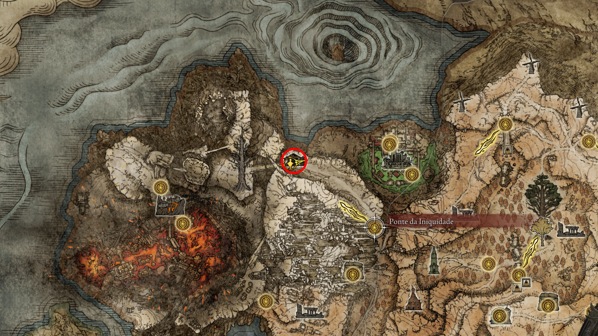
   
  <em>Figura 5: Cabana do Comedor de Cadáveres.</em>

---

### 2. O Fragmento de Mapa e a Primeira Graça
Continue descendo o morro após a Anastasia para encontrar o monólito do mapa.

* **Item:** Mapa: Monte Gelmir.
* **Graça:** Caminho da Iniquidade (Road of Iniquity).

  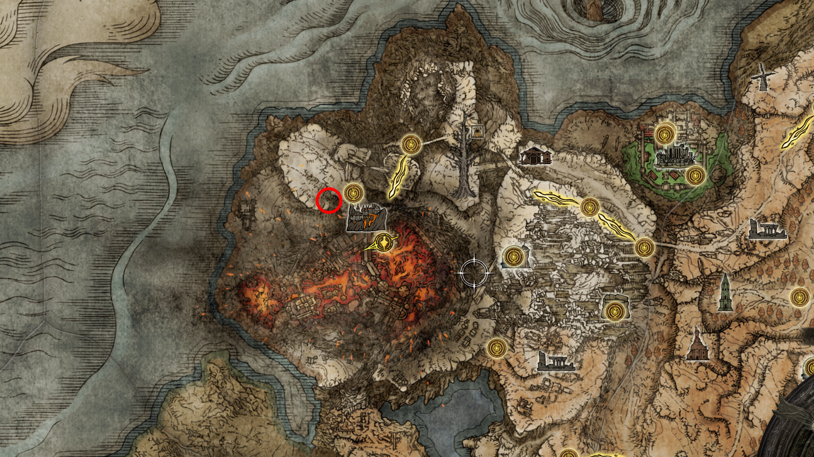
   
  <em>Figura 6: Ponto de coleta do mapa. Essencial para não se perder nos labirintos verticais da montanha.</em>

---

### 3 O Rastro de Pedras e o Reencontro com Patches
Logo após ativar a Graça **Caminho da Iniquidade**, siga a estrada em direção ao oeste.

* **O Gatilho:** Você verá várias **Pedras de Arco-Íris** brilhando no chão, perto da beira do penhasco.
* **Ação:** Aproxime-se da última pedra (perto do arbusto). O Patches aparecerá em uma cutscene e te dará o "empurrãozinho" tradicional para o fundo do desfiladeiro.
* **Diálogo:** Fale com ele antes (ele estará agachado nos arbustos próximos). Ele vai sugerir que você procure o "sequestrador" no fundo da Academia de Raya Lucaria para chegar à Mansão (embora você já esteja no caminho físico).

  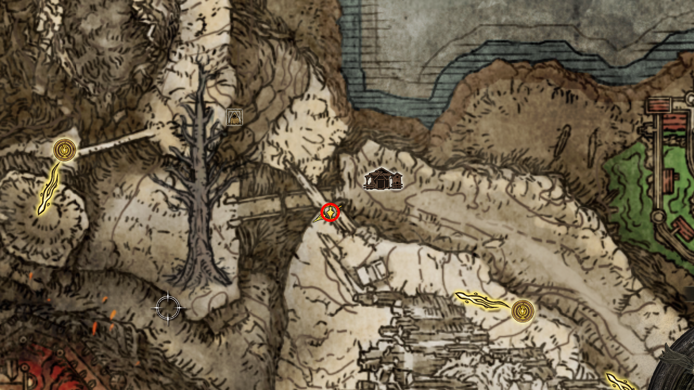
   
  <em>Figura 7: O rastro de pedras deixado pelo Patches. Fale com ele antes de ser empurrado para avançar a interação.</em>

---

### 4. O Rio de Água Fervente e o Treino do Pote
Após o "empurrão" do Patches (ou descendo com cuidado pelo caminho lateral), você estará no leito do rio. Em vez de ir direto para a Mansão, vamos contornar a montanha por baixo para pegar itens essenciais.

* **Ponto de Partida:** Graça **Rio de Água Fervente** (Seethewater River), ao norte das Ruínas de Wyndham.
* **Forte Laiedd:** Siga o desfiladeiro até o forte.
* **[👥 QUEST] Alexander:** Logo atrás do forte, no lago de lava, derrote o **Magma Wyrm**. Fale com Alexander que está treinando no meio da lava para ganhar o **Elmo de Jarro**.

  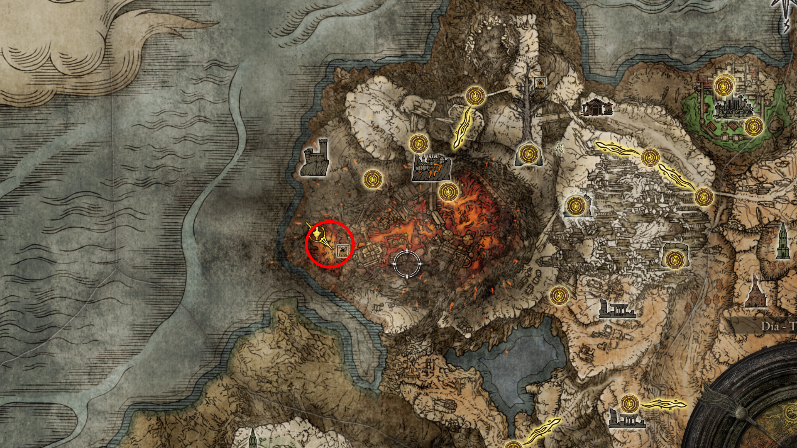
   
  <em>Figura 8: Alexander se "aquecendo" no lago de lava. Avance aqui para garantir o final da quest dele em Farum Azula.</em>

---

### 5. Vila dos Eremitas e o Segredo do Boc
Saindo do lago de lava onde está o Alexander, siga a trilha que sobe a montanha em direção ao sudeste até chegar à vila ocupada por magos e sub-humanos.

* **Item:** **Tagarela "Você é lindo"** (*Prattling Pate "You're Beautiful"*).
* **Localização:** O item está em um cadáver caído em frente a uma das casas no lado direito da vila, antes de chegar à arena da chefe Maggie.
* **Importância:** Este item é obrigatório para a quest do **Boc**. Quando ele estiver em Leyndell e expressar o desejo de renascer com a Rennala, use este item na frente dele para salvar a vida dele.

  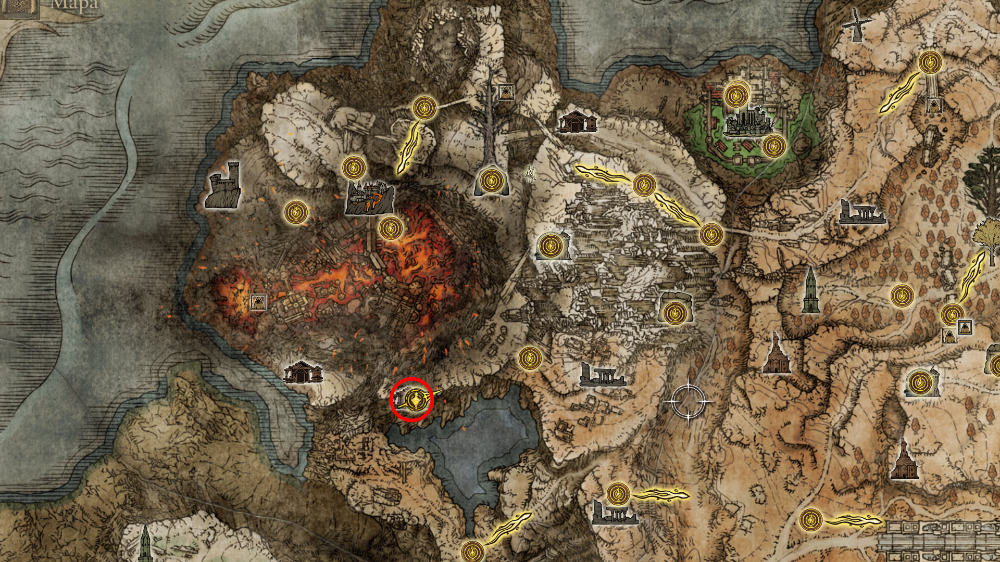
   
  <em>Figura 9: Localização na Vila dos Eremitas onde se encontra o item para a quest do Boc, procure por este cadáver encostado na varanda da casa para coletar o item</em>

---

### 6. 🧙‍♂️ O Caminho dos Eremitas e a busca pelos Mestres Primevos
Continue contornando a montanha em sentido horário.

* **Vila dos Eremitas:** Passe pela vila e derrote a **Rainha Semihumana Maggie**.
* **[🏆 PLATINA] Feiticeiro Primevo Azur:** Logo atrás da arena da Maggie, interaja com o corpo de cristal.
* **Item:** **Cometa Azur** (Um dos 7 Feitiços Lendários).

  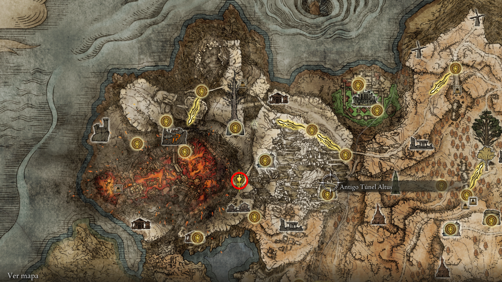
   
  <em>Figura 10: O mestre Azur. Pegar este feitiço é obrigatório para o troféu de colecionador.</em>

---

### 6.1: O Quebrador de Selo de Sellia
Retorne ao ponto de origem da quest para provar sua capacidade.

* **Localização:** Ruínas do Ponto de Passagem (Waypoint Ruins), Limgrave.
* **Ação:** Fale com a Sellen e mostre o **Cometa Azur**.
* **Recompensa:** **Quebrador de Selo de Sellia** (Sellian Sealbreaker).
* **Objetivo:** Localizar o Mestre Lusat em Caelid.

  
   
  <em>Figura 11: Sellen confia a você a tarefa de encontrar o segundo mestre primevo.</em>

---

## 🏰 6.2: O Reset do Castelo de Juba Vermelha
Com Radahn derrotado, o castelo retorna ao seu estado "normal", revelando novos desafios e um item de Platina.

### A. O Diálogo de Jerren
* **Localização:** Na sala ao norte da praça principal (onde o festival foi anunciado).
* **Ação:** Fale com **Jerren, o Caçador de Bruxas**. Ele dirá que sua obrigação com o festival acabou.
* **Importância:** Isso o move para a Península do Choro, permitindo concluir a quest da Sellen futuramente.

### B. [⚔️ BOSS] Guerreiro Bastardo & Cavaleiro do Crisol
* **Localização:** Praça Principal do Castelo (agora com névoa de chefe).
* **[🏆 PLATINA - ARMA LENDÁRIA]:** **Espada Grande de Ruínas** (Ruins Greatsword).
    * *Status:* 1 de 9 Armas Lendárias coletada nesta etapa.

  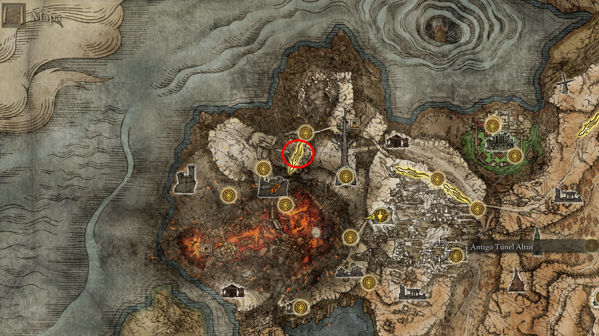
   
  <em>Figura 12: Derrote a dupla dinâmica para coletar uma das armas mais pesadas da Platina.</em>

---

## 💎 6.3: O Esconderijo de Sellia e o Segundo Mestre [🏆 PLATINA]
Agora que possui o Quebrador de Selo, localize o Mestre Lusat para garantir o segundo feitiço lendário.

* **Localização:** Caelid, Dragonbarrow. Fica ao norte da "Igreja da Praga". 
* **O Segredo:** Vá até o cemitério e ataque a parede de pedra atrás do monumento principal.
* **Exploração e Itens Ocultos:**
    * **Lança de Cristal:** Parede ilusória no lado direito da primeira sala de cristais.
    * **[🏆 LENDÁRIO] Estrelas da Ruína:** Use o selo na barreira mágica no fundo da caverna.
* **O Chefe da Masmorra:** Trio de Cristianistas Putrefatos (Dropa o feitiço **Torrente de Cristal**).

  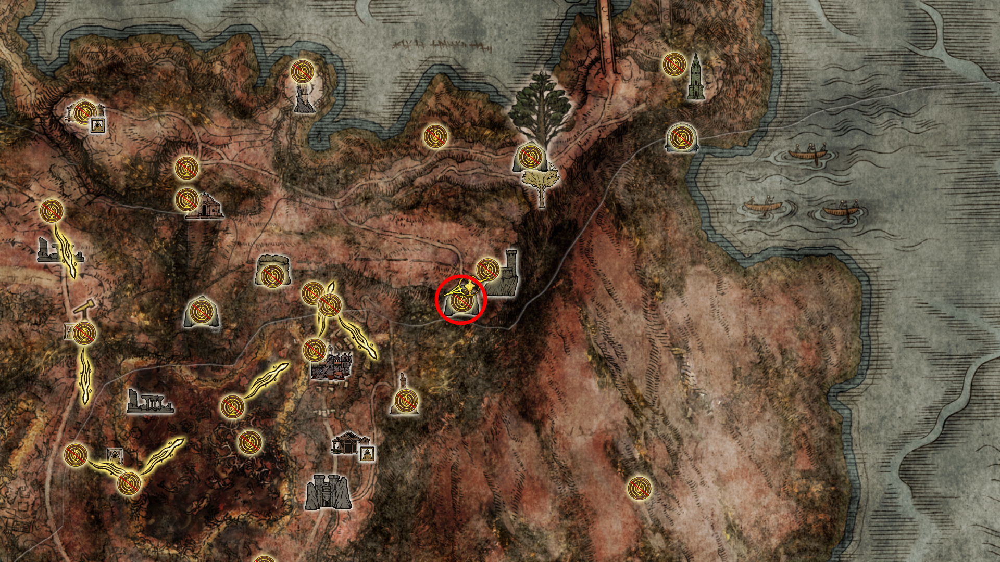
   
  <em>Figura 13: O encontro com o Mestre Lusat para o troféu de colecionador.</em>

---

## 🧙‍♂️ 6.4: A Migração da Alma (O Renascimento de Sellen)
Este é o procedimento final para mover a consciência da Sellen para um corpo capaz de tomar a Academia.

### 1. Extração: Ruínas do Flagelo das Bruxas (Península do Choro)
* **Ação:** Vá até o corpo real acorrentado e extraia a **Pedrilhante Primordial de Sellen**.
* **Check de NPC:** Jerren aparecerá aqui após você recarregar o jogo. Fale com ele sobre o cadáver.

  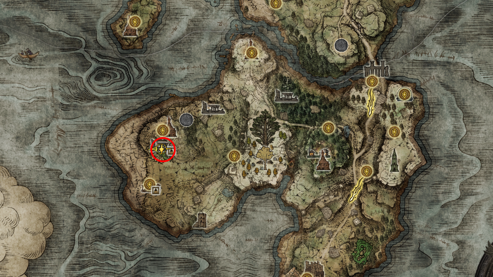
   
  <em>Figura 14: Extraindo a essência vital da Sellen para o transplante.</em>

### 2. Transplante: Laboratório Secreto de Seluvis (Liurnia)
* **Ação:** Nas ruínas entre as torres das Três Irmãs, revele a escada no chão. Atrás de uma parede falsa no fundo, insira a pedra no corpo reserva da feiticeira.

  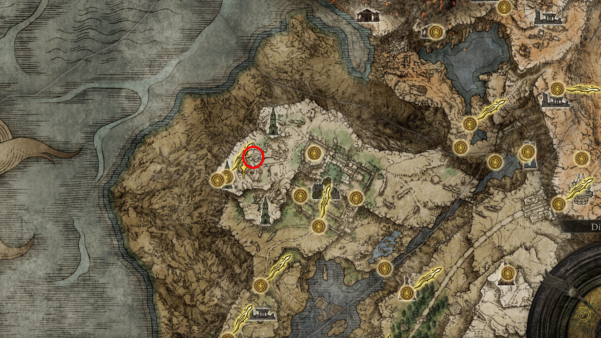
   
  <em>Figura 15: O receptáculo de Sellen no laboratório. A feiticeira está pronta para o ato final.</em>

---

## 🧙‍♂️ 6.5: O Ato Final - O Conflito na Academia
Com Sellen em seu novo corpo e os dois Mestres Primevos localizados, a feiticeira parte para reivindicar o controle da Academia de Raya Lucaria.

### 1. O Local do Duelo
* **Localização:** Vá para a Graça da **Grande Biblioteca de Raya Lucaria** (sala da Rennala).
* **Ação:** Saia pela porta principal em direção ao elevador. No chão, você verá dois sinais de invocação:
    * **Sinal Dourado:** Ajudar Sellen contra Jerren.
    * **Sinal Vermelho:** Ajudar Jerren contra Sellen.

### 2. A Escolha: Ajudar a Sellen (Recomendado)
Para obter o máximo de recompensas e itens de colecionador, escolha o **Sinal Dourado**.

* **A Luta:** Você enfrentará o Jerren, o Caçador de Bruxas, junto com a Sellen.
* **Recompensas Imediatas:**
    * **Conjunto de Armadura do Excêntrico** (Set do Jerren).
    * **Kris de Cristal** (Adaga poderosa para builds de INT - fale com ela após a luta).
    * **Feitiço Espiral de Estilhaços** (Liberado para compra na loja dela).

  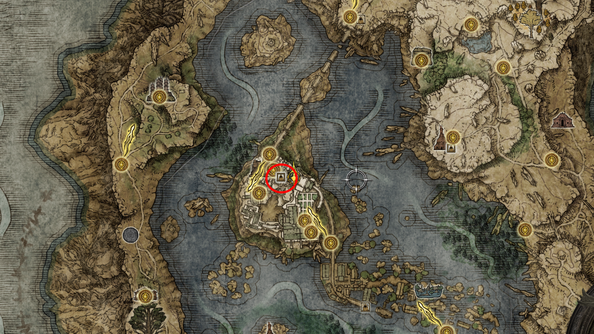
   
  <em>Figura 16: Os sinais de invocação do lado de fora da biblioteca. Escolha o dourado para apoiar sua mestra.</em>

---

### 3. O Destino dos Mestres e a Coleta de Sets
Após a conclusão da quest, Rennala retornará ao centro da biblioteca (recarregue a área se necessário) e Sellen será movida para o lado. Este evento desbloqueia os conjuntos de armadura dos mestres primevos em seus respectivos locais de repouso.

#### A. Set do Mestre Azur
* **Localização:** Retorne ao local onde você encontrou o **Feiticeiro Primevo Azur** no Monte Gelmir.
* **Item:** Conjunto completo de armadura de Azur (inclui a coroa que bufa o feitiço Cometa Azur).

  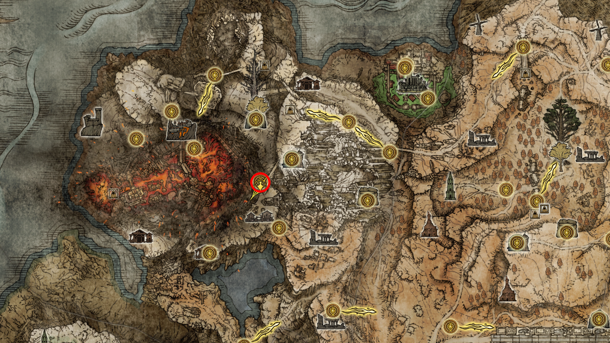
   
  <em>Figura 17: Localização do Set de Azur no Monte Gelmir. Essencial para aumentar o dano de magias de luz estelar.</em>

#### B. Set do Mestre Lusat
* **Localização:** Retorne ao **Esconderijo de Sellia** (Caelid), na câmara onde o Mestre Lusat estava selado.
* **Item:** Conjunto completo de armadura de Lusat (inclui a coroa que bufa o feitiço Estrelas da Ruína).

  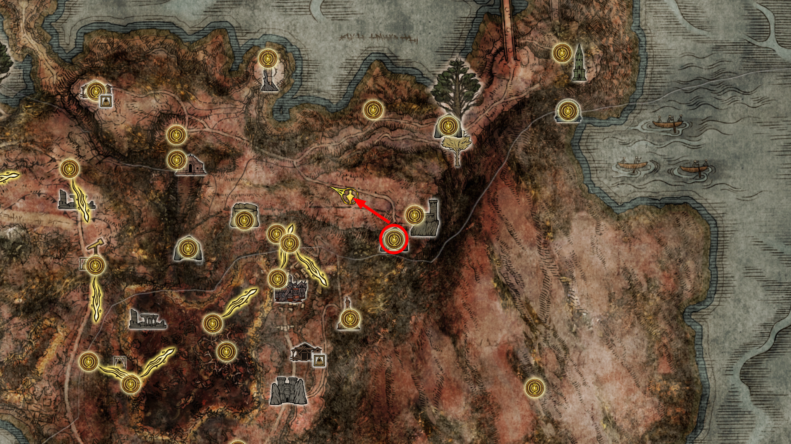
   
  <em>Figura 18: Localização do Set de Lusat em Caelid. Um dos conjuntos mais icônicos para feiticeiros de elite.</em>

---

### 7. Túmulo do Herói de Gelmir (Masmorra de Elite)
Esta é uma das masmorras mais perigosas da região devido às carruagens de lâminas, mas abriga itens únicos para a sua coleção.

* **Localização:** Atravesse a ponte de pedra natural após o Feiticeiro Azur e siga para a direita até encontrar a entrada da estrutura.
* **Item 1: [🔨 ARMA] Dedo Anelado (Ringed Finger):** * *Onde:* No início da masmorra, onde a primeira carruagem desce, você verá um caminho de lava. Em vez de subir, desça pela lava até o final do corredor. O item está em um baú.
* **Item 2: [💀 QUEST] Raiz da Morte (Deathroot):**
    * *Onde:* Recompensa por derrotar o chefe final da masmorra. Guarde este item para entregar ao clérigo Gurranq em Caelid futuramente.
* **[⚔️ BOSS] Lobo Vermelho do Campeão:** Uma versão mais resistente do lobo encontrado na Academia.

  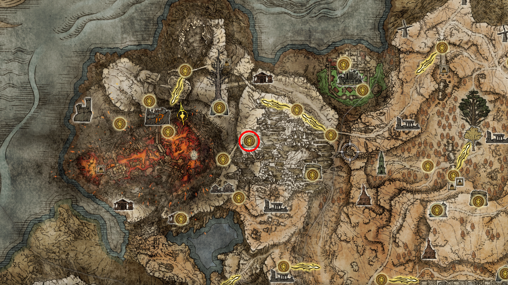
   
  <em>Figura 19: Entrada da masmorra após a ponte de pedra do Azur.</em>

---

### 8. Nono Acampamento e a Cratera do Topo
Saindo do Túmulo do Herói, siga para o norte subindo a trilha até encontrar a Graça do **Nono Acampamento do Monte Gelmir**.

* **A Ascensão:** Você tem duas opções para subir: o grande elevador de madeira ou a Corrente de Espírito (pulo com o cavalo).
* **[⚔️ BOSS] Fera de Estrela Cadente Adulta (Full-Grown Fallingstar Beast):**
    * *Localização:* Ela domina a cratera no topo da montanha.
    * *Dica:* Ela é resistente, mas bater no "rosto" (a parte branca) causa dano extra.
    * *Recompensa:* Materiais de upgrade de alto nível (Pedras de Forja Sombrias).

  
   
  <em>Figura 20: Localização da Graça do Nono Acampamento, o último respiro antes do topo.</em>

---

### 9. Espírito de Árvore Ulcerado (Árvore Áurea Menor)
Antes de descer para a Mansão, vale a pena o desvio para enfrentar o guardião da árvore local.

* **Localização:** Fica na base da montanha, acessível descendo pela encosta à direita antes de chegar na ponte que leva à Mansão Vulcânica.
* **[⚔️ BOSS] Espírito de Árvore Ulcerado:** Um combate em área aberta, o que facilita o uso do cavalo Torrent.
* **Recompensas (Lágrimas de Cristal):**
    * **Lágrima Oculta Cerúlea:** (Essencial para Magos) Elimina todo o consumo de PC por um curto período. Perfeito para usar com o **Cometa Azur**.
    * **Lágrima de Cristal Endurecida com Chumbo:** Aumenta o Equilíbrio (Poise).

  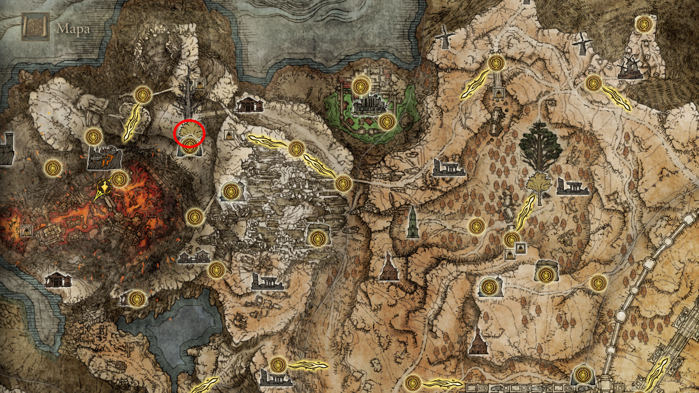
   
  <em>Figura 21: Localização do boss da Árvore Áurea Menor. O drop aqui é obrigatório para builds de Cometa Azur.</em>

---

### 10. A Chegada à Mansão Vulcânica e o Primeiro Contato
Antes de se comprometer com os Recusantes, há um clima sombrio a ser explorado no corredor principal.

* **Ação 1: O Espírito Peticionário:**
    * **Localização:** Vá até o fim do corredor dos quartos (que estarão trancados). Você verá um fantasma ajoelhado.
    * **Interação:** Fale com ele para entender o terror que reside na Mansão. Ele implora para que alguém "devore o Lorde" e menciona a grande serpente. Isso dá o contexto para o boss final desta área.

* **Ação 2: Audiência com Tanith:**
    * **Localização:** Retorne ao salão principal e fale com a **Tanith** sentada no trono, guardada pelo Cavaleiro do Crisol.
    * **Decisão:** Aceite o convite dela. Isso é necessário para obter a **Chave da Sala de Estar** e acessar as áreas trancadas onde os NPCs de Platina (Bernahl, Patches, etc.) aparecerão.

  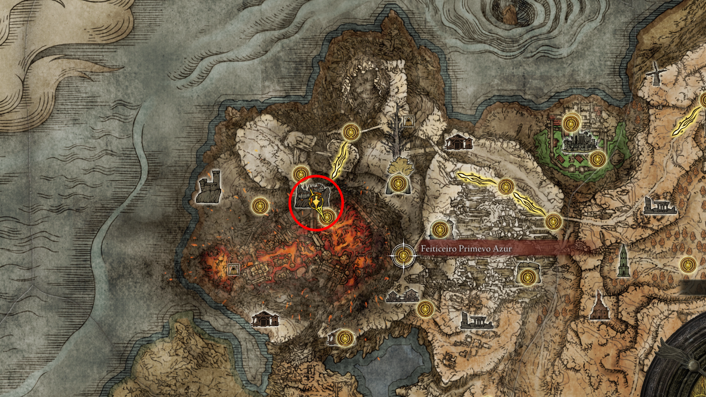
   
  <em>Figura 22: O encontro com o espírito ao fundo do corredor e a formalização do pacto com Tanith.</em>

---

### 11. O Círculo dos Recusantes: Ritos de Passagem
Antes de partir para o seu primeiro contrato, existe uma ordem de interações necessária para desbloquear todos os serviços e quests da Mansão.

* **Passo 1: O Espírito e a Tanith**
    * Primeiro, fale com o **Espírito** ajoelhado ao fundo do corredor para entender a atmosfera do local.
    * Em seguida, fale com a **Tanith** no trono. Aceite o convite para receber a **Chave da Sala de Estar**.

* **Passo 2: Exploração dos Quartos**
    * Use a chave para abrir as portas à direita. No **primeiro quarto**, colete o **Frasco de Perfume**.
    * Na **Sala de Jantar**, colete a **Carta da Mansão Vulcânica** (Contrato 1) sobre a mesa.

* **Passo 3: Diálogos com os Recusantes**
    * **Rya:** Fale com ela sobre o objetivo da Mansão.
    * **Diallos:** Interaja com ele para ver seu estado de negação e conflito.
    * **[🏆 PLATINA] Recusante Bernahl:** Fale com ele na última sala. 
        * *Nota:* Ele ainda não abrirá a loja de Cinzas de Guerra. Ele está te observando e só negociará após você provar seu valor no primeiro contrato.

* **Passo 4: O Encontro com Patches**
    * Após falar com todos nos quartos, volte ao corredor de entrada (perto da Graça) e fale com o **Patches**. 
    * Ele confirmará que também é um Recusante. Exaurir o diálogo dele aqui é vital para o contrato exclusivo dele mais tarde (Set do Touro-Bode).

  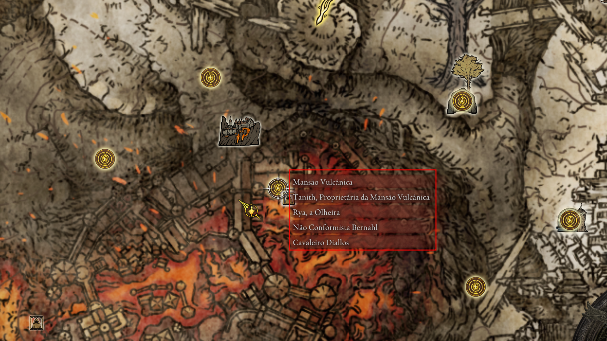
   
  <em>Figura 23: A rede de contatos na Mansão está estabelecida. Agora, o sangue deve ser derramado para ganhar o respeito deles.</em>

---

### 12: Invasão no Salão Superior (O Batismo de Fogo)
Antes de deixar a Mansão para o seu primeiro contrato oficial, explore o andar superior acima do salão da Tanith.

* **O Evento:** Assim que você subir as escadas e chegar ao fundo do salão de jantar superior, você será invadido automaticamente.
* **Invasor:** **Inquisidor Ghiza** (Inquisitor Ghiza).
* **A Luta:** Ele utiliza uma serra circular gigante que causa um acúmulo massivo de **Sangramento**. Mantenha distância e ataque após as investidas lentas dele.
* **[🔨 ARMA] Roda de Ghiza (Ghiza's Wheel):** * *Tipo:* Arma Colossal.
    * *Habilidade Única:* A serra gira continuamente, causando dano sucessivo e sangramento. É a versão de Elden Ring para a "Whirligig Saw" de Bloodborne.

  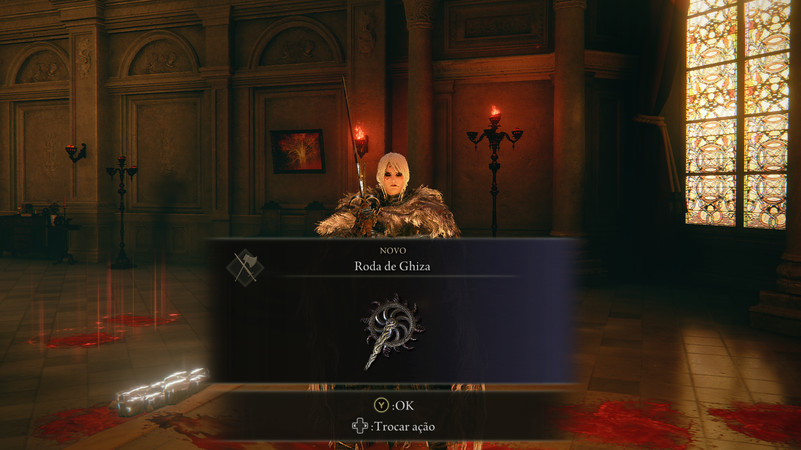
   
  <em>Figura 24: Derrotando o Inquisidor Ghiza no andar superior. Uma excelente arma de força para o seu inventário.</em>

## 🗡️ 13. Primeiro Contrato: O Cavaleiro Velho Istvan
Com o status de Recusante aceito, você deve caçar um dos cavaleiros mais antigos que ainda vagam por Limgrave.

* **Alvo:** Cavaleiro Velho Istvan (Old Knight Istvan).
* **Localização:** Limgrave, na trilha ao norte da **Cabana do Mestre de Guerra** (Warmaster's Shack), em direção ao Coliseu.
* **Ação:** No local indicado pela marca vermelha no mapa, procure pelo **sinal de invasão vermelho** no chão e aceite invadir o mundo dele.

### ⚔️ O Combate
Istvan é um cavaleiro de armadura pesada que utiliza uma Espada Grande.
* **Dica:** Ele utiliza a Cinza de Guerra **Onda de Choque**, que pode te derrubar se você ficar muito perto por muito tempo. Espere ele finalizar a sequência de golpes e ataque nas brechas.
* **Recompensa de Queda:** **Conjunto de Armadura de Escamas** (Scaled Armor Set).

  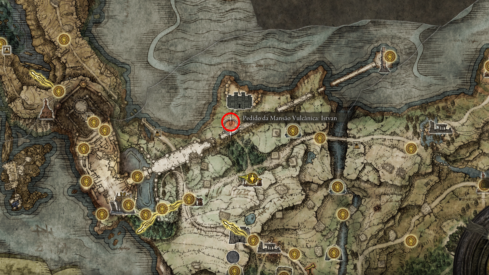
   
  <em>Figura 25: O duelo contra Istvan em Limgrave. Sua primeira prova como assassino da Mansão.</em>

---

## 🏛️ 14. O Retorno à Mansão (Consequências do Contrato)
Após derrotar Istvan, o status da Mansão Vulcânica muda. Para visualizar todas as alterações, **descanse na Graça** interna logo após chegar.

* **Ação com Tanith:** Relate o sucesso do contrato para receber o feitiço **Magma de Gelmir**.
* **NPC: [🏆 PLATINA] Recusante Bernahl:**
    * **Mudança:** Ele agora reconhece seu valor. Fale com ele na última sala à direita.
    * **Serviço:** A opção **"Aprender Habilidades"** será desbloqueada, permitindo comprar Cinzas de Guerra. Isso é essencial para manter o vínculo com ele até Farum Azula.
* **NPC Rya (Zorayas):**
    * **Mudança:** Ela não estará mais na sala de jantar. Vá até a segunda porta à direita (quarto ao lado).
    * **A Revelação:** Você a encontrará em sua forma real de serpente. Fale com ela até que ela mencione o nome **Zorayas**. (Nota: Não a ataque!).
* **NPC Diallos:**
    * **Mudança:** Ele sairá da mesa de jantar e estará em um estado de profunda crise de identidade, geralmente no corredor ou em um dos quartos laterais. Ouça suas lamentações para progredir na jornada dele rumo a Jarburg.
* **NPC Patches:**
    * **Localização:** Continua no corredor de entrada.
    * **Ação:** Fale com ele para receber o item **"Carta para Patches"**. Este é um contrato exclusivo para caçar o "Grande Tragoth" no Precipício Arruinado.

  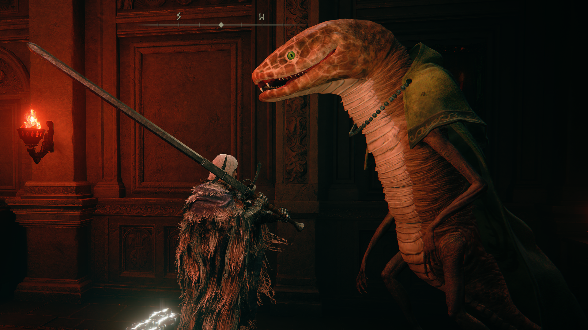
   
  <em>Figura 26: A verdadeira face de Rya e a aceitação de Bernahl. A Mansão começa a revelar seus segredos mais sombrios.</em>

---

## 🗡️ 15. Contratos Avançados: Rileigh e o Grande Tragoth

Nesta etapa, você eliminou alvos em regiões de transição e no Platô Altus, garantindo equipamentos de elite para sua coleção.

### A. O Pedido do Patches: Grande Tragoth
* **Localização:** Precipício Arruinado (Ruined Strewn Precipice), na arena do boss Magma Wyrm Makar.
* **O Alvo:** Um dos NPCs mais resistentes do jogo, usa o Martelo de Gigante e a armadura mais pesada de Elden Ring.
* **Recompensa de Queda:** **Conjunto de Armadura de Touro-Bode** (Bull-Goat Set) – Máximo Equilíbrio/Poise.
* **Logística de Recompensa:** Após a vitória, retorne ao Patches na Mansão. Fale com ele, descanse na Graça e fale novamente para ele entregar o **Castão de Magma**.

  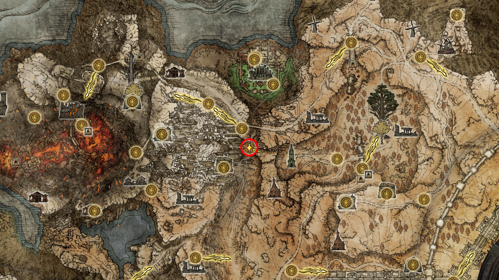
   
  <em>Figura 27: Derrotando o lendário Grande Tragoth. O set obtido aqui é o melhor do jogo para quem quer ignorar o atordoamento de ataques inimigos.</em>

### B. Segundo Contrato (Tanith): Rileigh, o Ocioso
* **Localização:** Platô Altus, em um desfiladeiro que leva ao Castelo Sombreado (Shaded Castle).
* **O Combate:** Rileigh usa uma adaga que causa podridão e uma besta com virotes rápidos. Mantenha a pressão para não deixá-lo atacar à distância.
* **Recompensa de Queda:** **Frasco de Crepus** (Talismã que silencia seus passos) e virotes de chave preta.
* **Recompensa da Tanith:** Ao reportar, você receberá a espada **Serpente de Gelmir** (Serpentbone Blade).

  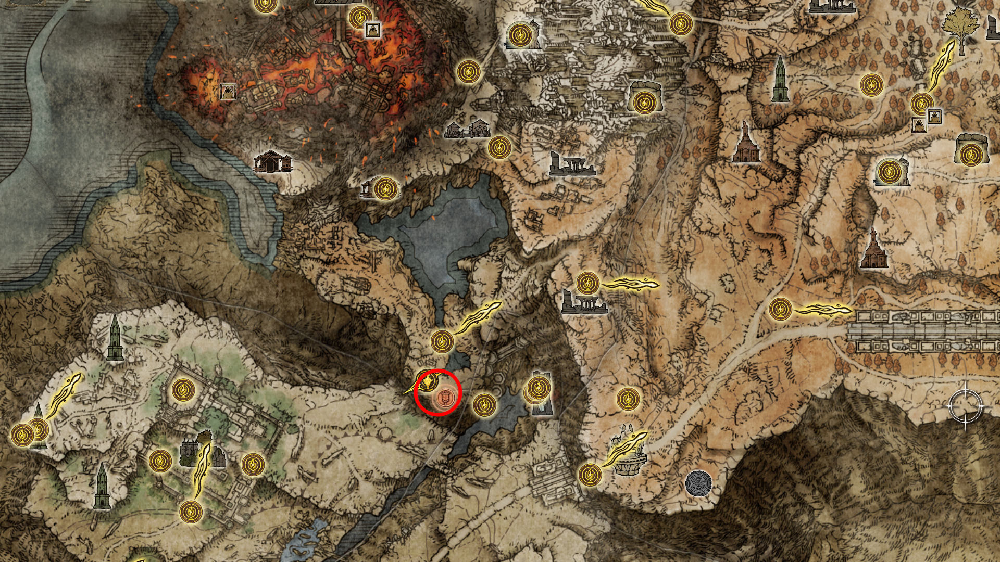
   
  <em>Figura 28: Finalizando Rileigh no Platô Altus. Mais um passo para a confiança total da Mansão.</em>

---

## 🏛️ 16. O Segredo da Mansão e a Terceira Carta
Com os contratos de nível médio concluídos, a Mansão começa a abrir suas portas mais profundas e os NPCs atingem pontos críticos de suas jornadas.

* **Ação com Tanith:** Relate a morte de Rileigh para receber a **Carta Vermelha** (Terceiro Contrato).
    * **Alvo:** Juno Hoslow, o Cavaleiro do Sangue (Localizado nas Montanhas dos Gigantes).
* **Diálogos de NPCs (Pós-Rileigh):**
    * **NPC Diallos:** Ele estará em um estado deplorável, questionando a própria linhagem e o valor da vingança. "Minhas mãos estão sujas, mas eu não sinto nada". Este é o sinal de que ele logo deixará a mansão.
    * **[🏆 PLATINA] Bernahl:** Ele agora compartilha mais de sua filosofia. Fale com ele para ele reconhecer que você "tem o estômago" para o que vem a seguir. Ele continuará vendendo Cinzas de Guerra e se preparando para o seu próprio contrato futuro.
    * **Rya (Zorayas):** Ela menciona ouvir "sons de respiração e movimento" atrás das paredes, confirmando que a Mansão esconde algo físico e sombrio.

* **Paredes Ilusórias:**
    * **Dica:** No primeiro quarto à direita (onde pegou o frasco de perfume), há uma parede falsa no canto. Ela leva à **Cidade Prisional**, a masmorra real da Mansão Vulcânica.

  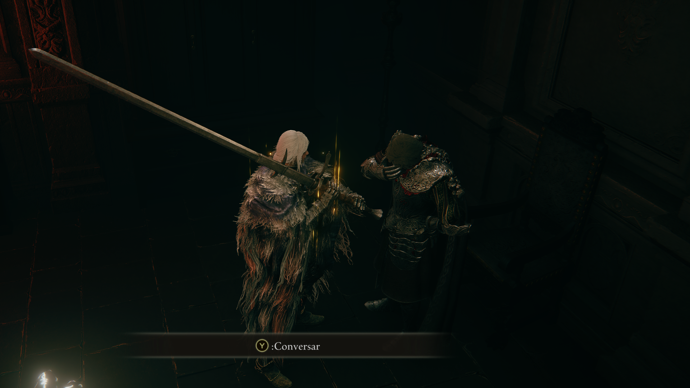
   
  <em>Figura 29: O contraste entre o desespero de Diallos e a frieza de Bernahl após os assassinatos no Platô Altus.</em>

---

## 🏰 17. A Passagem Secreta e a Cidade Prisional
Após ouvir os relatos de Zorayas (Rya) sobre sons estranhos, é hora de investigar o que existe por trás da fachada suntuosa da Mansão.

* **Acesso:** No primeiro quarto à direita do corredor (onde você coletou o Frasco de Perfume), role ou ataque a parede no canto direito para revelar o caminho.
* **O Percurso Sombrio:** * O túnel é escuro e infestado de caracóis de cristal. Use uma tocha ou a lanterna de cintura.
    * Siga pelo caminho linear até encontrar um porão com alguns inimigos menores.
* **Localização da Graça:** Continue descendo até sair nas varandas externas da cidade. À sua esquerda, haverá uma estrutura que abriga a Graça: **Igreja da Cidade Prisional** (Prison Town Church). 
    * **Ação:** Ative a Graça e **abra a porta principal** da igreja para criar o atalho.

### 🔍 Interações Cruciais (O Segredo Revelado)
Após encontrar a igreja, retorne ao interior da Mansão para atualizar os NPCs sobre sua descoberta:

* **Diálogo com Rya:** Informe a ela que você encontrou o caminho secreto. Ela ficará intrigada e isso moverá as engrenagens para a próxima fase da busca dela por identidade.
* **Diálogo com Tanith:** Você pode mencionar a descoberta para ela. Tanith manterá sua postura enigmática, mas reconhecerá sua persistência em explorar além do que lhe foi mostrado.

  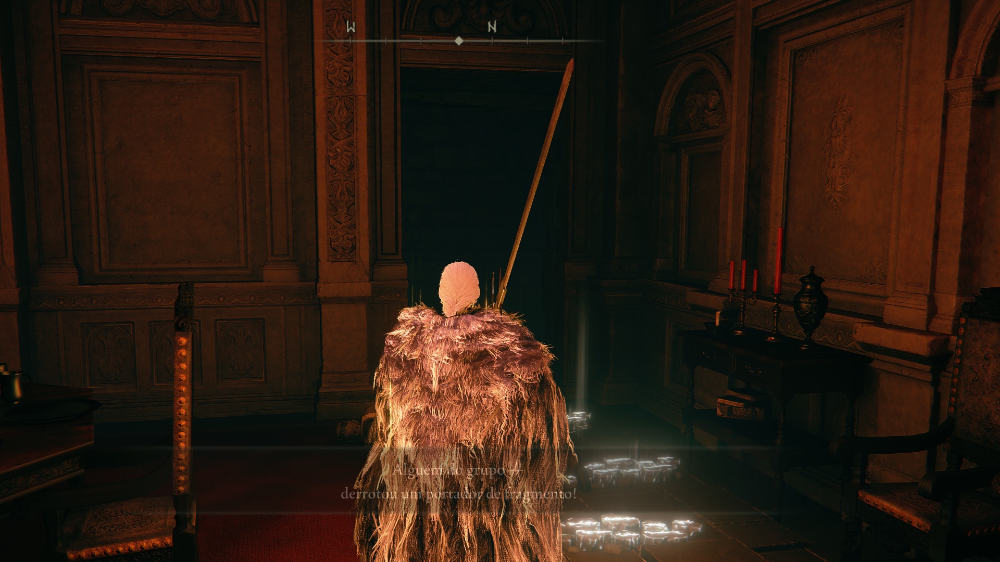
   
  <em>Figura 30: Atravessando a parede ilusória e estabelecendo o vínculo entre a Mansão e a Cidade Prisional.</em>

---

## 🏛️ 18. Igreja da Cidade Prisional
Esta Graça serve como sua base de operações para explorar a masmorra principal.

* **Ponto de Atalho:** Note que a porta principal da igreja está trancada por dentro. Você precisará dar a volta pela cidade para abri-la futuramente.
* **Próximo Objetivo:** Explorar os telhados e as ruas da cidade até alcançar o templo onde reside o **Nobre da Pele Divina** (Godskin Noble).

  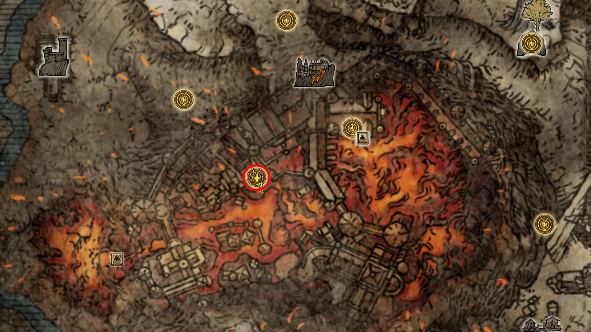
   
  <em>Figura 31: A primeira Graça dentro da masmorra. Daqui em diante, o desafio escala consideravelmente.</em>

---

## 🏰 19. Exploração da Cidade Prisional: Rumo ao Templo de Eiglay

Saindo da Igreja da Cidade Prisional, você entrará na parte urbana da masmorra. O caminho é vertical e infestado de inimigos rápidos.

### 🛤️ O Percurso de Exploração
1. **Os Telhados:** Saia da igreja e siga pelos telhados à direita. Cuidado com os pequenos gárgulas (Imps) que emboscam nos cantos.
2. **O Pátio dos Homens-Serpente:** Desça até o nível da rua. Você encontrará os primeiros Homens-Serpente. Eles têm longo alcance com chicotes e espadas.
3. **O Elevador de Atalho:** Antes de prosseguir para o boss, procure por um elevador em uma torre à direita. Ele conecta a área inferior de volta aos telhados próximos à Igreja, facilitando o retorno caso você morra.
4. **Sala de Jantar dos Convidados:** Atravesse o prédio principal. Na cozinha/sala de jantar, você encontrará o **Manual de Perfumista [4]**.

### 🔍 Itens Importantes no Caminho
* **Pedras de Forja Sombrias:** Diversas espalhadas pelos corpos nas sacadas.
* **Chave de Espada de Pedra:** Há uma em um corpo pendurado em uma varanda logo após a área dos telhados.

### 🏛️ Chegada ao Templo
Siga pela ponte de pedra guardada por um Homem-Serpente de elite (que usa uma máscara de ferro e um chicote de lava). 

* **[⚠️ MUITO IMPORTANTE] Liberar Atalho:** Antes de atravessar as portas duplas para o boss, entre na torre à direita (em frente à entrada do templo) e **acione o elevador**.
    * Isso abrirá o caminho direto da **Igreja da Cidade Prisional** até a porta do boss, economizando tempo e recursos.
* **A Entrada:** No final do caminho, você verá as grandes portas duplas que levam ao interior do Templo de Eiglay. Prepare-se para o combate.

  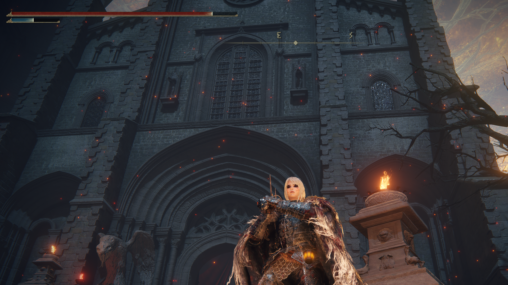
   
  <em>Figura 32: Vista da Cidade Prisional. O objetivo é o grande templo ao fundo, onde reside o Nobre da Pele Divina.</em>

---

## ⚔️ 20. [BOSS] Nobre da Pele Divina (Godskin Noble)
Este é um dos chefes mais técnicos da área e um teste de paciência.

* **Estratégia:** * Ele é vulnerável a **Sono** (Potes de Sono são extremamente eficazes aqui).
    * Cuidado com o ataque de "rolamento" na segunda fase; use as bases das colunas para se proteger.
* **Recompensas:** * **Costura da Pele Divina** (Estoque Pesado).
    * Cinza de Guerra: **Presença Nobre**.
* **[⚠️ IMPORTANTE - QUEST] Amnion do Nascimento:** Após derrotar o boss, colete o item no altar ao fundo do templo. Este item é essencial para a quest da **Zorayas (Rya)**.

  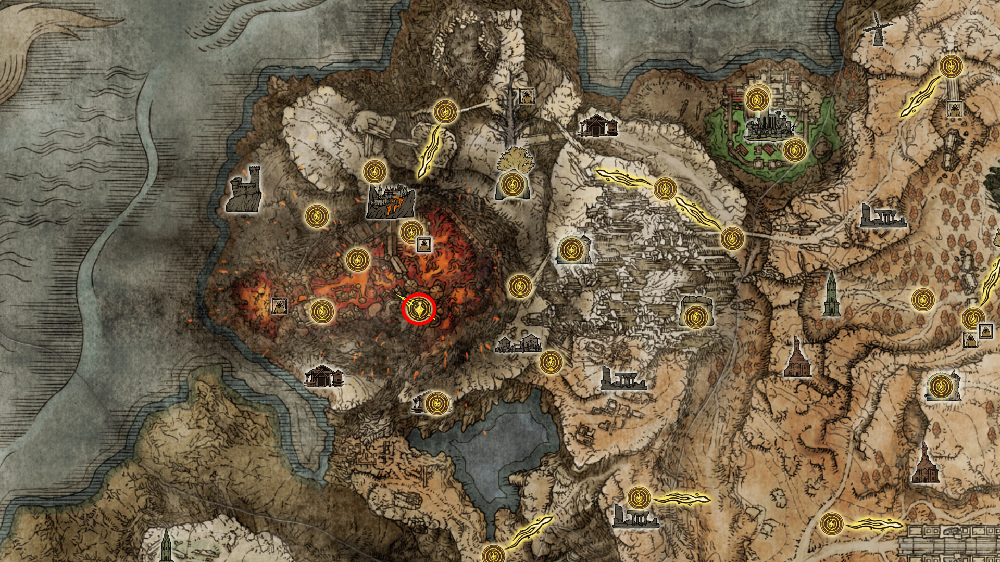
   
  <em>Figura 33: Arena do Templo de Eiglay. Não esqueça de ativar a Graça e pegar o item de quest no altar após a luta.</em>

---

## 🐍 21. A Verdade de Zorayas: Entrega do Amnion
Agora que você possui o segredo do nascimento dela, deve decidir se revelará a verdade ou manterá o mistério. Para a progressão da quest, a entrega é o caminho padrão.

### 🔄 A Sequência de Eventos
1. **Entrega do Item:** Retorne à Mansão Vulcânica e encontre **Zorayas** (Rya serpente) no seu quarto. Entregue o **Amnion do Nascimento**.
    * *Diálogo:* Ela ficará horrorizada ao descobrir as circunstâncias de sua criação e começará a questionar sua existência e o "amor" de Tanith.
2. **O Desaparecimento:** Saia do quarto e **descanse na Graça** da Mansão Vulcânica.
3. **Busca na Mansão:** Ao voltar ao quarto dela, você notará que Zorayas desapareceu.
4. **Diálogo com Tanith:** Fale com a Senhora da Mansão sobre o sumiço da filha.
    * **[⚠️ ITEM DE QUEST] Tônico do Esquecimento:** Tanith demonstrará preocupação e te entregará o **Tônico do Esquecimento**. Ela pede que, caso você a encontre sofrendo, dê a ela o tônico para que ela esqueça a dor da verdade.

  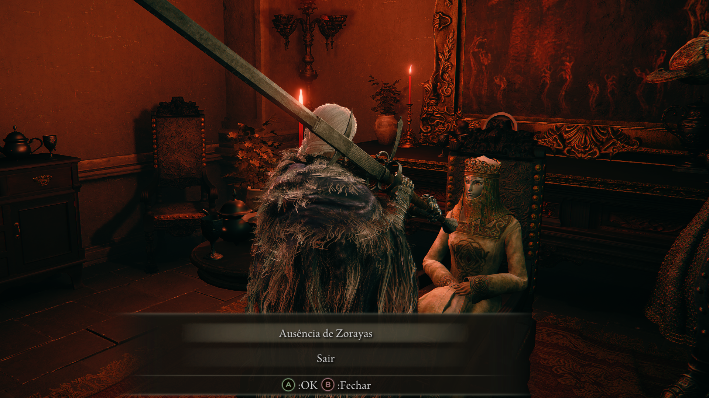
   
  <em>Figura 34: O momento da revelação. A partir daqui, o destino de Zorayas está nas suas mãos.</em>

---

## 🏛️ 22. Localizando o Esconderijo de Zorayas
Zorayas fugiu para as profundezas da Cidade Prisional, buscando isolamento.

* **O Caminho:**
    1. Parta da Graça do **Templo de Eiglay** (onde você matou o Nobre da Pele Divina).
    2. Suba pelo elevador que você ativou anteriormente (ou use o caminho das varandas externas se preferir explorar).
    3. Siga pelo caminho de lava até encontrar uma pequena janela/abertura que leva a uma área escondida sob uma ponte.
* **Localização Exata:** Ela está escondida em uma pequena sala sob uma ponte levadiça, acessível saltando por uma borda perto da lava.
* **Não fazer nada:** Deixe-a lá, que depois que derrotar o Rykard e voltaremos para falar com ela. Este é considerado o final "bom", onde ela decide seguir sua própria jornada.

  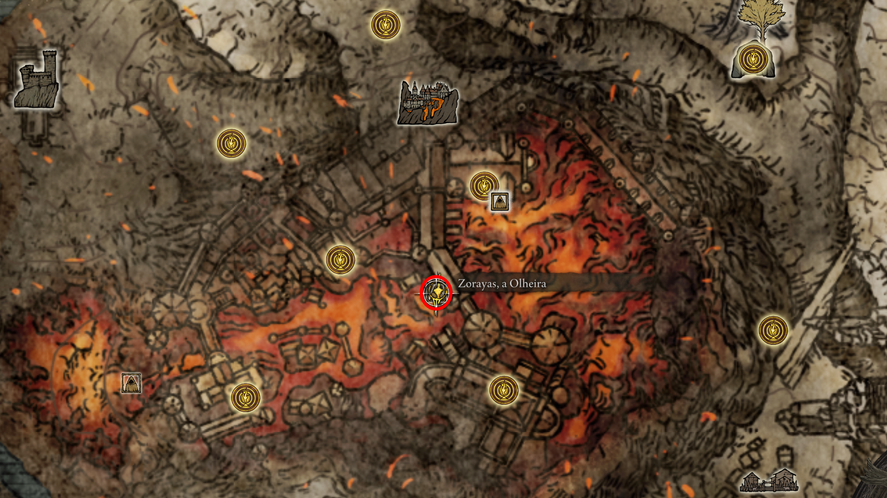
   
  <em>Figura 35: O esconderijo de Zorayas nas entranhas da Mansão.</em>

---

## 🏰 23. Rota Secreta: A Maldição do Viveiro (Quest do Comedor de Estrume)

Partindo do **Templo de Eiglay** (onde você derrotou o Nobre da Pele Divina), vamos explorar a área superior para coletar um dos itens mais importantes para a quest do Comedor de Estrume.

### 🛤️ O Caminho Passo a Passo
1. **O Elevador:** No Templo de Eiglay, use o elevador lateral para subir ao andar superior.
2. **O Fluxo de Lava:** Siga pelo caminho externo, atravessando as rochas sobre a lava. Ignore os Homens-Serpente se quiser agilizar.
3. **A Janela Secreta:** Entre em uma construção à frente e procure por uma janela que dá para um caminho de telhados. 
4. **O Portão de Névoa (Imp):** Você chegará em uma sala com um portão selado por uma estátua de demônio. Use **01 Chave de Espada de Pedra**.

### 🔍 Localização da Maldição
* Atrás do portão, você estará em uma sala escura cheia de gaiolas penduradas (muito parecida com as celas de Leyndell).
* Desça cuidadosamente pulando pelas gaiolas até o nível mais baixo.
* **O Item:** Em um corpo sentado em uma cadeira, você encontrará a **Maldição do Viveiro (Seedbed Curse)**.

  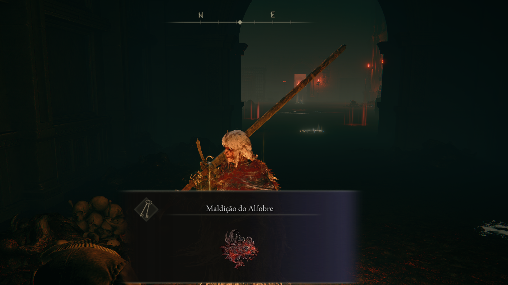
   
  <em>Figura 36: Localizando a Maldição do Viveiro. Este item é fundamental para avançar a linha de missão do Comedor de Estrume em Leyndell.</em>

---

## 🐉 24. O Pátio de Lava: Serpente de Magma e o Caminho Final
Antes de enfrentar o Lorde da Mansão, você deve atravessar o pátio de lava. Lá reside uma fera que guarda o acesso às áreas mais profundas.

### ⚔️ Mini-Boss: Serpente de Magma (Magma Wyrm)
* **Localização:** No grande lago de lava abaixo do Templo de Eiglay.
* **Estratégia:** * O combate é dificultado pela lava, que causa dano contínuo. Tente atraí-lo para as partes de terra firme nas bordas.
    * Use ataques de salto ou armas com grande alcance. Ele é vulnerável a danos de gelo e magia.
* **Recompensa:** **Coração de Dragão** e runas.

  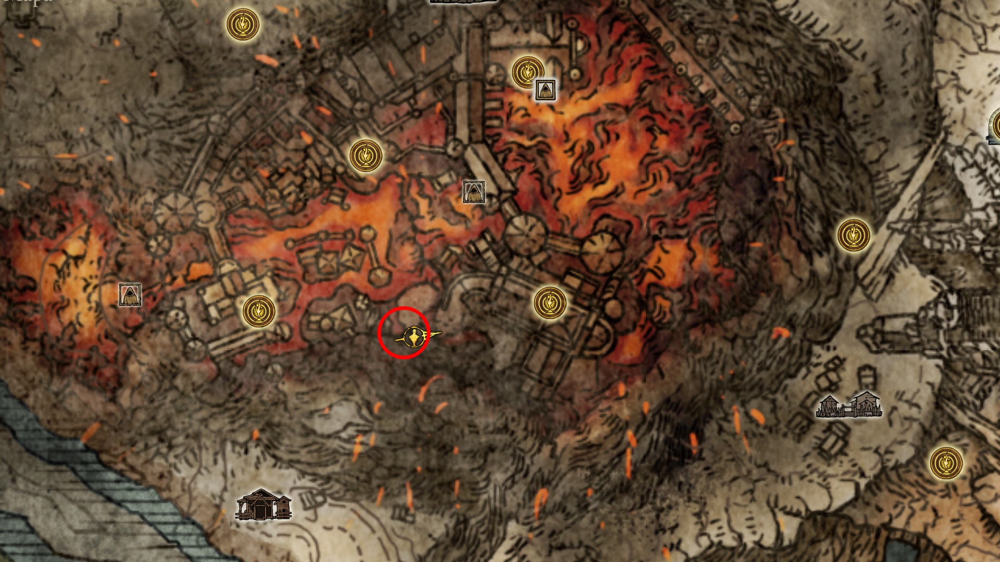
   
  <em>Figura 39: Derrotando a Serpente de Magma no pátio interno da Mansão Vulcânica.</em>

---

## 🏛️ 25. O Ponto de Retorno: Graça Caminho da Audiência
Após cruzar o portal de teleporte na área das gaiolas, você será levado a uma caverna sombria que antecede o coração da Mansão.

* **Ação:** Ative a Graça **Caminho da Audiência** (Audience Pathway).
* **[⚠️ AVISO DE PLATINA] PARE AQUI:** Não atravesse a névoa dourada. O objetivo aqui é apenas garantir o *Check-In*. Matar o Lorde da Mansão agora encerraria prematuramente as quests de Bernahl, Patches e os contratos da Tanith que ainda estão pendentes (como o de Juno Hoslow).

  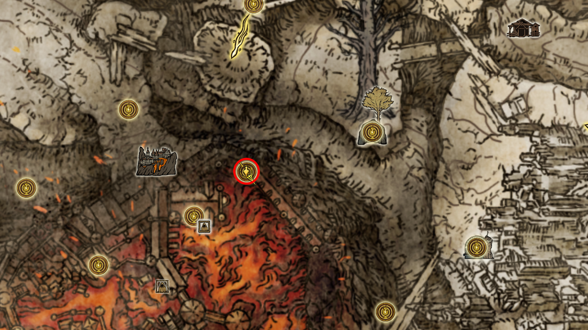
   
  <em>Figura 40: Ponto de controle estabelecido. A Graça está salva, mas o Lorde Blasphemous aguardará nosso retorno após as Montanhas dos Gigantes.</em>

---

[⬅️ Voltar para o Platô Altus](../10_altus_plateau/README.md) | [Prosseguir para Leyndell ➡️](../12_leyndell_royal_capital/README.md)