# 🌆 12. Leyndell, a Capital Real

> **Status da Região:** O Coração da Ordem Áurea (Nível 90 — 120)

Leyndell é a joia da Térvore, uma metrópole de ouro e mármore que serve como o centro político e religioso das Terras Intermédias. Mas não se deixe enganar pelo brilho: suas ruas são guardadas por cavaleiros implacáveis e seus fundamentos escondem segredos pútridos e maldições que remontam à era do Agouro.

## 👥 1. O Destino de Boc, o Alfaiate

Antes de qualquer exploração profunda, vamos garantir a sobrevivência do Boc. Como você já tem a Graça **Muralha Leste da Capital**, ele estará lá esperando por uma validação.

* **Ação Crucial:** Fale com Boc até ele expressar o desejo de renascer com a ajuda da Rennala.
* **[⚠️ PLATINA/LORE] Salvando o NPC:** * **NÃO** entregue a Lágrima Larval (isso causaria a morte dele).
    * Fique na frente dele e use o item **Cabeça de Tagarela "Você é Lindo"** (*Prattling Pate "You're Beautiful"*).
    * Fale com ele novamente para ele aceitar sua aparência original.

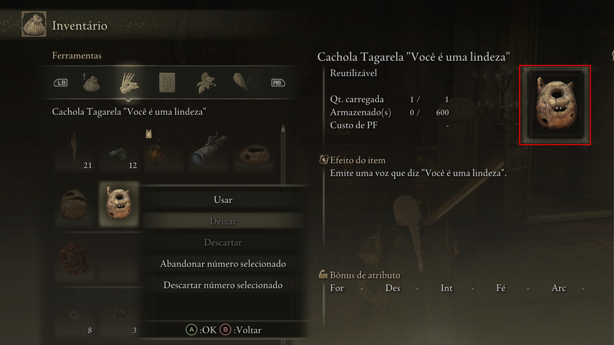
 
<em>Figura 01: Usando a voz para salvar o Boc. Um passo essencial para manter o seu alfaiate vivo.</em>

---

## 🏚️ 2. Descida ao Subterrâneo dos Desamparados

Com o Boc seguro, partiremos da Graça **Varanda da Avenida** para localizar a entrada dos esgotos.

* **O Caminho:**
    1. Desça as escadas da Graça e saia para a rua principal.
    2. Pule o parapeito à esquerda para a área das casas em ruínas.
    3. No centro desses destroços, localize e desça pelo **poço aberto**.
* **Objetivo:** Ativar a Graça **Caminho Subterrâneo** (Underground Roadside).

---

## 🧶 3. Libertando o Comedor de Estrume

Utilize a **Chave do Cárcere do Esgoto** que você recebeu na Mesa-Redonda.

* **Rota Rápida:** Saindo da Graça do esgoto, vá para a esquerda, pule no buraco da grade no chão (perto dos ratos) e siga o túnel até o final. Suba a escada de mão para chegar às celas.
* **Interação:** Abra a cela e diga para ele **"Saia da sua cela"**.
* **Progresso:** Agora o corpo físico dele está livre, o que permite a invasão no fosso externo.

---

## 💎 4. [COLETÁVEL] Mansão Fortificada: 3ª Maldição e Itens de Elite

Vamos fazer uma "limpeza" na réplica da Mesa-Redonda. Este local é idêntico ao hub, mas em ruínas no mundo real.

* **Localização:** Mansão Fortificada (Fortified Manor).
* **Como chegar:** Partindo da Graça **Varanda da Avenida**, suba as escadas, passe por baixo da asa do dragão e entre na mansão à esquerda.

### 🎒 Loot Prioritário da Mansão:
1. **Maldição do Viveiro (3ª):** Suba as escadas e vá para a sala que seria a do Comedor de Estrume. O item está no corpo amarrado à cadeira.
2. **Lâmina de Amolar Santificada:** Localizada na sala que seria a do Ferreiro Hewg, logo ao lado da bigorna. (Permite afinidades Sagradas e de Raio).
3. **Martelo:** No mesmo local da Lâmina de Amolar, no chão da oficina do ferreiro.
4. **Espada de Códices (Coded Sword):** Vá para a sala que seria a das Duas Dedos. A espada está sobre o trono.

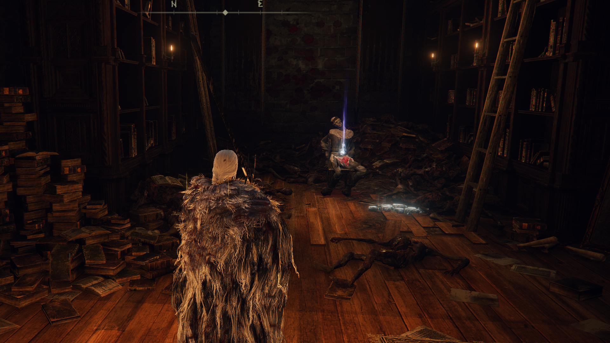
 
<em>Figura 02: Limpeza concluída na Mansão Fortificada. Maldição, Espada de Códices e Lâmina de Amolar coletadas.</em>

---

## ⚔️ 5. Contrato Especial: Invasão com Bernahl (Vargram, o Lobo Furioso)

* **Localização:** Mansão Fortificada. No salão principal, haverá um sinal de invasão vermelho no chão.
* **A Missão:** Você será sumonado para lutar ao lado de Bernahl contra Vargram e Wilhelm.
* **Recompensa:** Conjunto de Armadura do **Lobo Furioso**.
* **[⚠️ IMPORTANTE] Retorno à Mansão Vulcânica:** Após a vitória, fale com Bernahl na mansão para receber o encantamento **Fúria de Gelmir**.

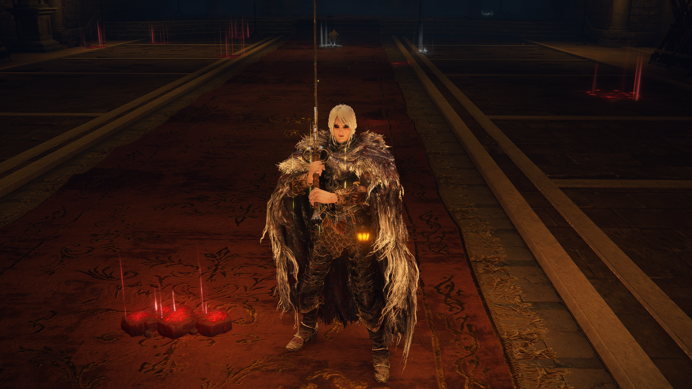
 
<em>Figura 03: Cooperativo de invasão com Bernahl para obter o set do Lobo Furioso.</em>

---

## ⚔️ 6. A Invasão no Fosso e o Destino de Boggart (4ª Maldição)

* **O Encontro no Fosso:** 1. Saia de Leyndell pelo portão nordeste em direção ao fosso raso (Capital Outskirts).
    2. Fale com Boggart. Descanse na Graça e volte.
    3. Fale com Boggart novamente. Ele deixará cair a **Maldição do Viveiro (4ª)**.
* **A Batalha:** Imediatamente após a morte de Boggart, você será invadido pelo **Comedor de Estrume**.
* **Recompensa:** **Espada de Milos**.

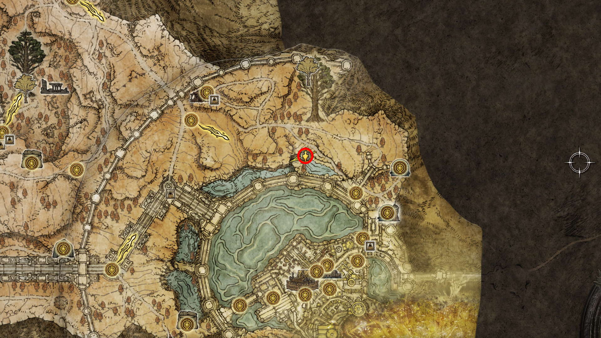
 
<em>Figura 04: A morte de Boggart garante a 4ª maldição.</em>

---

## 🧶 7. O Ciclo do Comedor de Estrume (Cárcere e Mesa-Redonda)

1. **Mesa-Redonda:** Retorne ao espírito do Comedor de Estrume. Ele pedirá que você leve as maldições ao seu corpo real.
2. **Cárcere:** Vá até a cela no esgoto e entregue as **4 Maldições** coletadas até aqui.

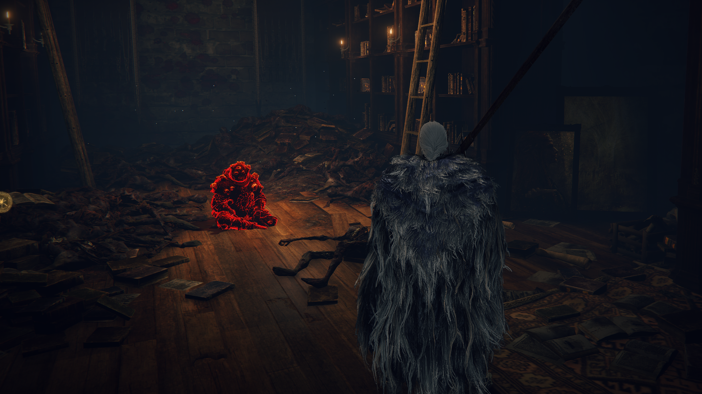
 
<em>Figura 05: O espírito reconhece sua força.</em>

---

## 🏚️ 8. Profundezas: A Algema de Mohg e a Catacumba de Leyndell

* **Algema de Mohg:** Partindo da Graça **Caminho Subterrâneo**, pule nos canos à direita até o fundo. O item está vigiado pelas lagostas gigantes.
* **[🔥 GRAÇA] Catacumbas de Leyndell:** Localizada atrás de uma das lagostas. Ative a Graça imediatamente.

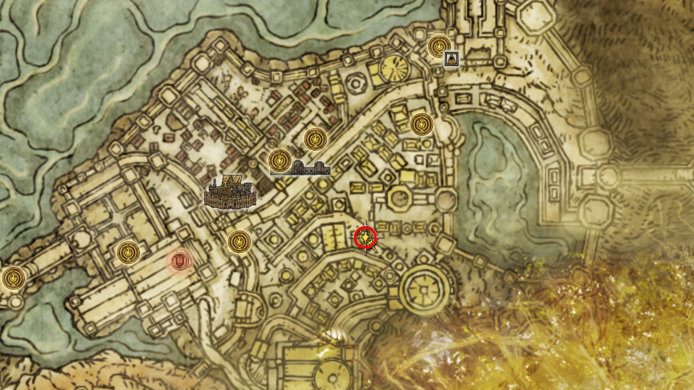
 
<em>Figura 06: Localização da Algema de Mohg no fundo do esgoto.</em>

---

## ⚔️ 9. Chefe: Godfrey, Primeiro Lorde Prístino (Sombra Áurea)

Subindo pelas raízes da Térvore a partir do andar superior da Mansão Fortificada.
* **Estratégia:** Ele é imune a status. Use dano físico.
* **Recompensa:** Bolsa de Talismã.

---

## 📜 10. [ITEM DE QUEST] Livro de Oração da Ordem Áurea

1. Saia pela varanda leste do boss Godfrey e suba na raiz.
2. Siga pelo telhado e entre pela janela superior.
3. Caminhe sobre a raiz que cruza o teto para pegar o livro.
* **Utilidade:** Aprender **Regressão da Lei** para a quest da Máscara de Ouro.

---

## 🏆 11. [ARMA LENDÁRIA] Lança de Gransax (PERDÍVEL)

1. Saia pela porta oeste (em direção ao elevador) abaixo da sala do Godfrey.
2. Desça o elevador e pule sobre a lança gigante do dragão de pedra.
* **Recompensa:** **Lança de Gransax** (Troféu de Platina).

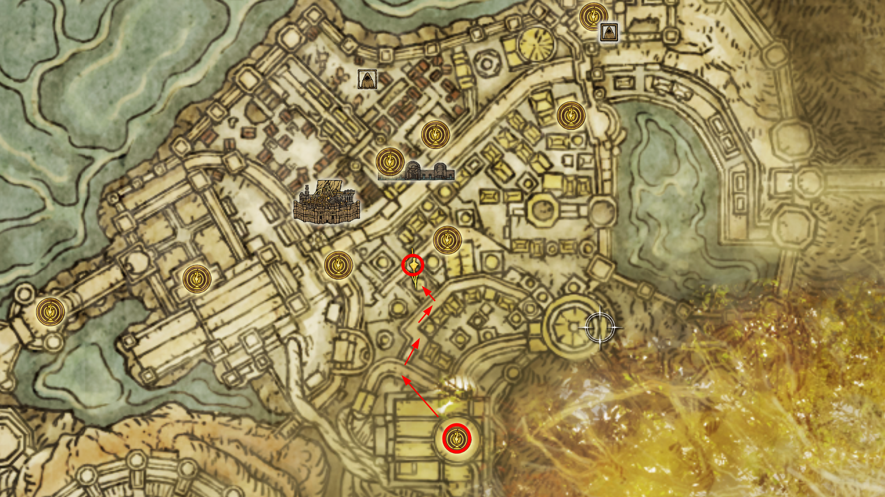
 
<em>Figura 07: Coletando a Lança de Gransax e o Livro da Ordem Áurea.</em>

---

## 🏛️ 12. O Quarto da Rainha e a Faca Negra

* **O Confronto:** Derrote a **Assassina da Faca Negra** na entrada.
* **[🔥 GRAÇA] Quarto da Rainha:** Ative este ponto de descanso.
* **Loot:** Feitiço **Bênção da Térvore**.

---

## ☀️ 13. Quest da Máscara de Ouro: O Enigma de Radagon

1. **Entrega:** Dê o livro ao Corhyn e compre **Regressão da Lei** (37 INT).
2. **O Segredo:** Vá até a estátua de Radagon (descendo o elevador perto do Santuário).
3. **Ação:** Use o feitiço sobre a mensagem no chão. Leia a nova mensagem: *"Radagon é Marika"*.
4. **Finalização:** Conte o segredo ao Máscara de Ouro no Coliseu.

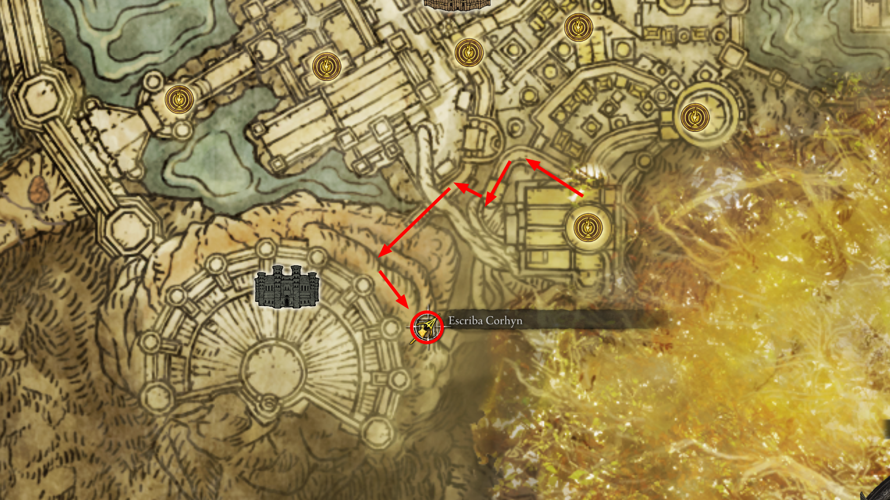
 
<em>Figura 08: Avançando na quest da Máscara de Ouro.</em>

---

## ⚔️ 14. Chefe: Morgott, o Rei do Agouro [🏆 PLATINA]

* **Preparação:** Use a **Algema de Margit**. Invoque a **Melina**.
* **Recompensa:** Runa Maior de Morgott e a Lembrança.

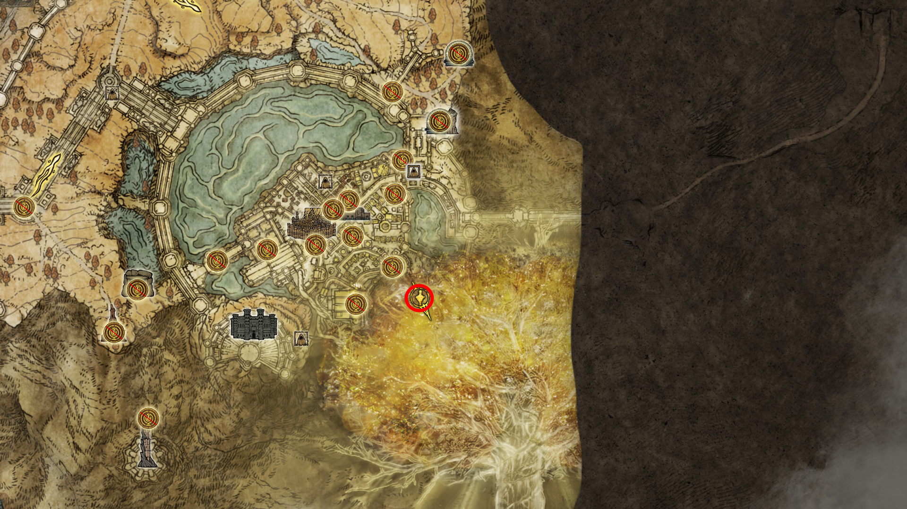
 
<em>Figura 09: O confronto final em Leyndell. Runback mínimo a partir do Quarto da Rainha.</em>

---

## 👥 15. A Ascensão de Nepheli Loux: O Trono de Limgrave

Com a queda de Morgott, o gatilho da quest é ativado.
* **Rota:** Vá para a Graça **Godrick, o Enxertado** e siga para a sala do trono.
* **Recompensas:** **2x Pedras de Forja de Dragão Antigo** (Nepheli e Gostoc).
* **[🏆 TROFÉU] Arma Matadora de Deuses:** Use a pedra para colocar uma arma no **+25** e garantir o troféu de Platina.

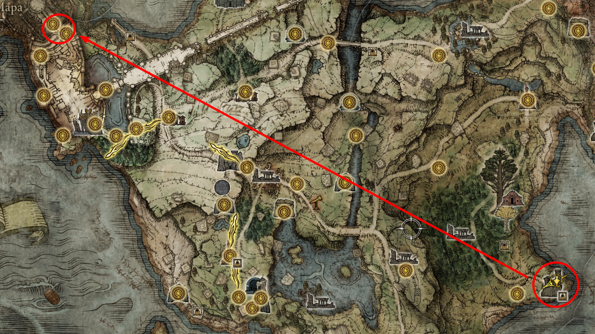
 
<em>Figura 10: Nepheli assumindo o trono.</em>

---

## 🏛️ 16. Catacumbas de Leyndell (Esgotos)

Esta masmorra está escondida atrás das lagostas gigantes no fundo do esgoto.
* **Mecânica:** O layout se repete (loop infinito). Use Pedras de Arco-Íris para se orientar.
* **Loot Crítico:** **Talismã Exultação do Lorde do Sangue** (Essencial para builds de Bleed).

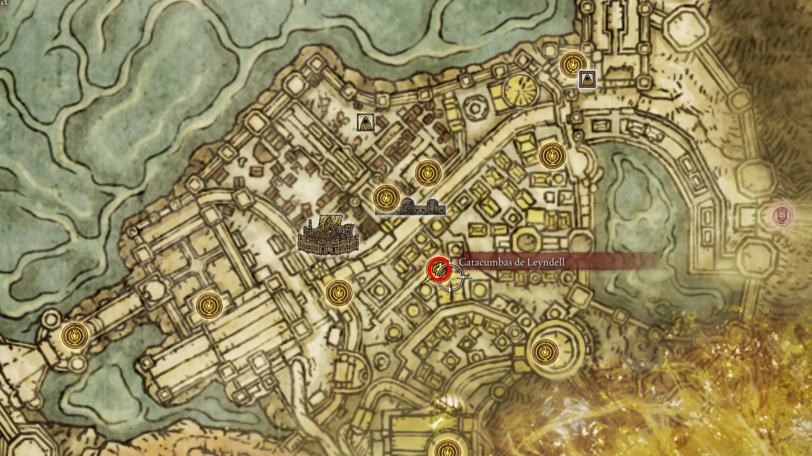
 
<em>Figura 12: Localização exata no fundo dos esgotos.</em>

---

## 🐎 17. Túmulo do Herói de Auriza

Localizado no fosso externo, descendo pelo penhasco a leste antes de entrar na cidade.
* **Dica:** Use a **Algema de Margit** no corredor principal para destruir as carruagens e coletar o **Set da Sentinela da Árvore**.
* **Boss:** Dupla de Cavaleiros do Crisol (**Espada de Ordovis**).

 
<em>Figura 13: Localização na base da muralha leste.</em>

---

## 🛡️ 18. Túmulo Auxiliar de Auriza

Diferente do anterior, este é focado em baús de transporte.
* **Mecânica:** Use os baús-armadilha para navegar entre as seções.
* **Loot:** Cinzas de Soldados de Leyndell e de Radahn.

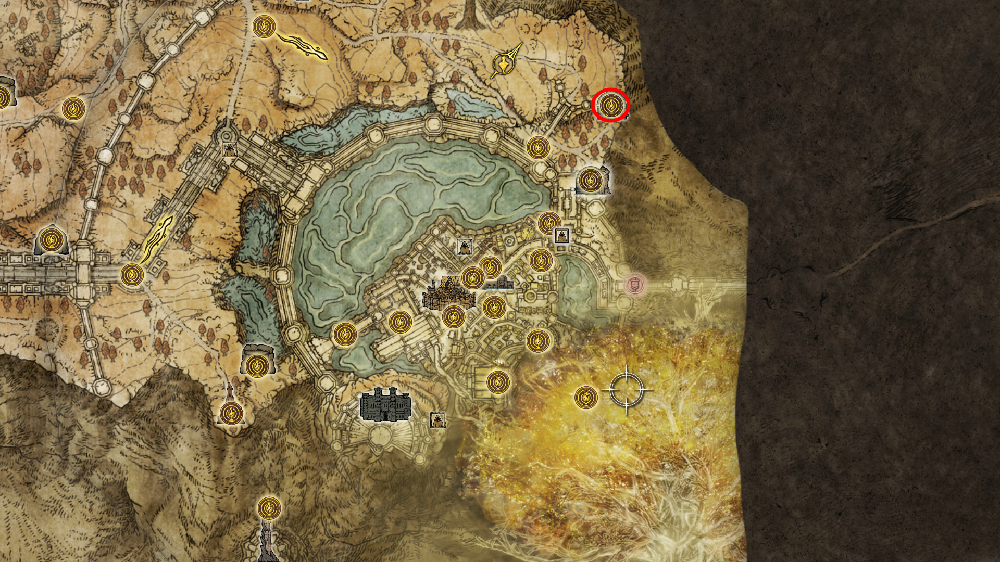
 
<em>Figura 14: Localização próxima ao Túmulo do Herói.</em>

---

## 🧪 19. Coleta Estratégica: Frasco de Perfume das Muralhas

Localizado no pátio elevado logo antes de pegar o elevador final.
* **O Item:** **Frasco de Perfume**. Permite carregar mais itens de suporte para a fase final.

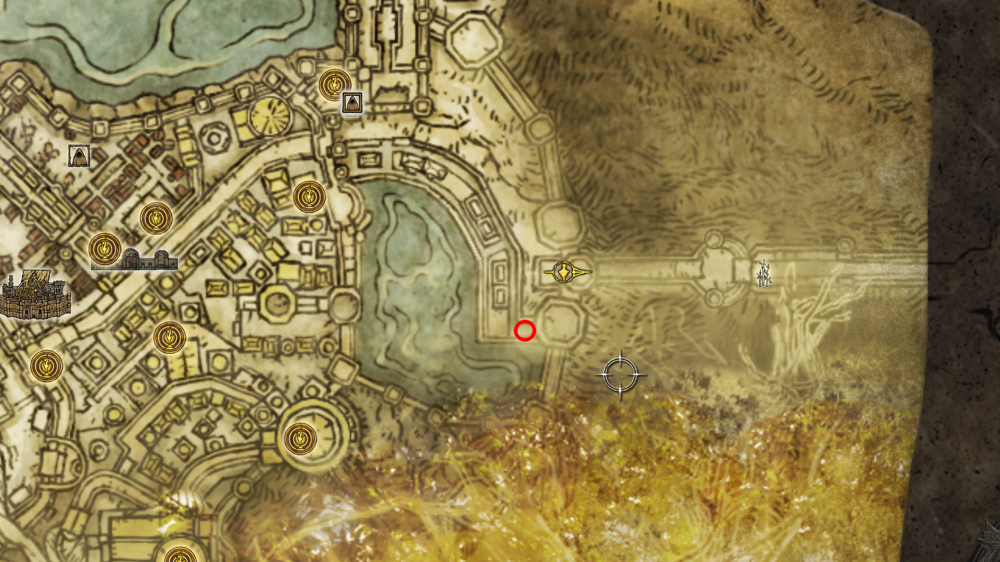
 
<em>Figura 15: Última coleta antes de sair da Capital.</em>

---

## 🏛️ 20. O Caminho Superior: Torre Divina de Altus e Runa de Morgott

Antes de descer para a neve, ative sua nova Runa Maior.
1. Saia pelo portão leste da Avenida e suba a escadaria.
2. Siga para a esquerda pela ponte longa.
3. Derrote os **Gêmeos Malditos** (Boss).
4. Ative a **Runa Maior de Morgott** (Bônus massivo de HP).

---

## 🧭 21. O Caminho para as Terras Proibidas

1. **Abertura:** Use a Graça da Avenida Principal e siga para o Leste.
2. **Elevador:** Pegue o grande elevador que desce das muralhas externas.
* **Inimigo:** Gárgula (Kindred of Rot) guarda o caminho. Você pode passar correndo de cavalo.

---

## 🧭 22. Transição Final: Rumo ao Elevador de Rold

1. Ative a Graça **Terras Proibidas**.
2. Colete a **Semente Dourada** na árvore à direita na estrada.
3. Use o **Medalhão de Rold** no Grande Elevador para subir aos Picos dos Gigantes.

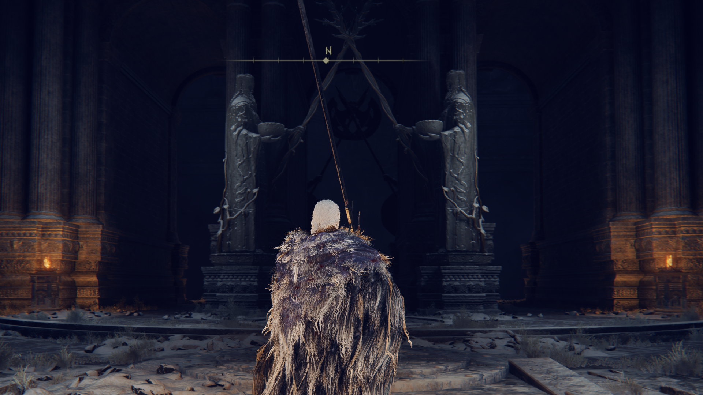
 
<em>Figura 16: O Elevador de Rold e a transição para a neve.</em>

---

## 🏔️ 23. Contrato Final: Juno Hoslow (Picos dos Gigantes)

Como você já subiu o Elevador de Rold, vamos direto ao objetivo para não perder tempo. Este é o último e mais difícil contrato da Mansão Vulcânica.

* **Localização:** Siga para o Norte a partir do Elevador de Rold até chegar à **Cabana do Inominável** (Shack of the Lofty), localizada na região oeste dos Picos dos Gigantes.
* **Ação:** Localize o sinal de invasão vermelho no chão.
* **O Alvo:** **Juno Hoslow, Cavaleiro do Sangue de Lótus**.
    * *Dica de Combate:* Ele utiliza chicotes duplos que causam hemorragia e é extremamente ágil. Mantenha a pressão para não deixá-lo ditar o ritmo da luta.
* **Recompensa:** Conjunto de Armadura do **Hoslow** e a arma **Pétala de Chicote de Hoslow**.

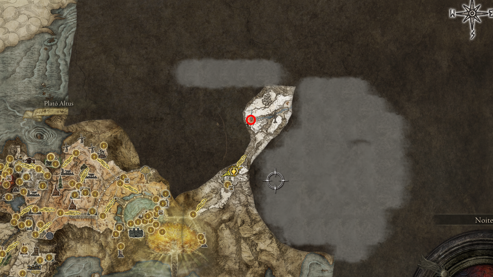
 
<em>Figura 17: O duelo final dos contratos. A saga dos Hoslow é escrita em sangue.</em>

---

## 🌋 24. O Desfecho de Rya e a Queda de Rykard

Com o contrato de Hoslow cumprido, é hora de retornar à **Mansão Vulcânica** para encerrar as pontas soltas.

### 🐍 A Escolha de Rya (Zorayas)
Antes de enfrentar o boss da área, resolva o dilema da Rya para garantir o melhor final da quest dela:
1.  **Localização:** Ela estará escondida em um templo secundário (na área da lava, acessível por um elevador secreto ou caminho lateral).
2.  **A Decisão:** Ela pedirá que você tire a vida dela.
    * **O QUE FAZER:** **NÃO a mate** e **NÃO entregue a poção**. Deixe-a viva e prossiga para o boss.

### 👑 Boss: Rykard, Lorde Blasfemo
Fale com a Tanith para ser teletransportado para a arena.
* **Ação:** Use a arma **Caçadora de Serpentes** (disponível logo na entrada). Use o ataque especial (L2/LT) para causar dano massivo à distância.
* **Recompensa:** Runa Maior de Rykard e Lembrança do Blasfemo.

---

## 🏛️ 25. Encerramento da Mansão e Destino de Rya

Após a derrota de Rykard, o ciclo da Mansão se fecha:
1.  **Tanith:** Fale com ela no salão. Ela dirá que deixará a mansão. (Você a encontrará mais tarde na arena do Rykard, se quiser o set dela).
2.  **NPCs:** Fale com Patches e Bernahl. Eles partirão para seus próximos destinos.
3.  **O Final de Rya:** Volte ao esconderijo dela. Como Rykard morreu e você a poupou, ela deixará uma carta de agradecimento e o talismã **Infortúnio de Daedica**, partindo em sua própria jornada de autodescoberta.

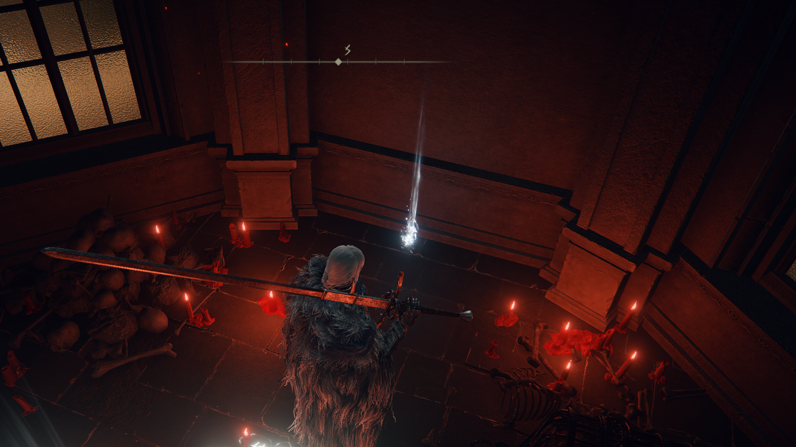
 
<em>Figura 18: Encerramento da Mansão Vulcânica. Rya poupada e o Lorde Blasfemo derrotado.</em>

---

## 🏛️ 26. O Destino de Patches: Castelo Sombreado

Após a derrota de Rykard e a dissolução da Mansão Vulcânica, Patches tentará um último gesto de lealdade à Tanith.

  * **Localização:** Vá para a ponte de madeira cheia de estátuas que leva à arena do boss (Elemer do Espinho) no **Castelo Sombreado** (Platô Altus).
  * **Ação:** Encontre o Patches sentado na ponte, ferido. Fale com ele até ele te entregar as **Castanholas do Dançarino**.
  * **O Item:** Ele pedirá que você entregue as castanholas para a Tanith, na esperança de "animá-la".

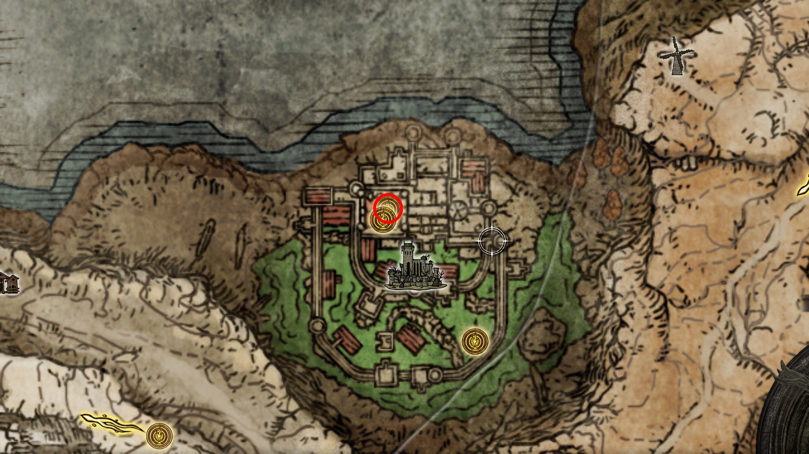
 
<em>Figura 19: Patches ferido no Castelo Sombreado. Colete as Castanholas aqui.</em>

-----

## 🩸 27. O Fim da Linhagem: Tanith e o Cavaleiro do Crisol

Agora você deve levar o item de volta para onde tudo terminou.

1.  **Localização:** Viaje para a Graça **Lorde Blasfemo** (Arena do Rykard).
2.  **Ação:** Você verá a Tanith devorando os restos de Rykard. Fale com ela e **entregue as Castanholas**.
      * *Nota:* Ela mal notará o item, pois está em transe.
3.  **O Confronto Final:** * Ataque a Tanith para matá-la.
      * Imediatamente, o **Cavaleiro do Crisol da Tanith** irá te invadir na arena.
      * **Dica:** Ele é forte, mas a arena é enorme. Use o espaço a seu favor.
4.  **Loots Únicos:**
      * **Set de Armadura da Tanith (Consolação):** Dropado ao matá-la.
      * **Encantamento Aspectos do Crisol: Sopro:** Dropado ao derrotar o Cavaleiro.

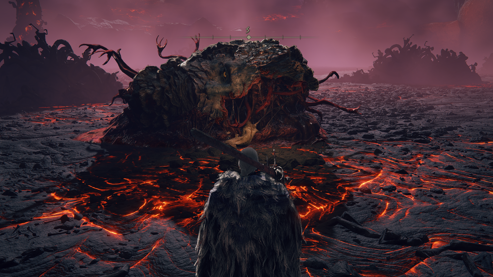
 
<em>Figura 20: O fim da Mansão Vulcânica. Mate a Tanith para enfrentar seu último defensor.</em>

-----

## 📦 28. O Ciclo Completo: Retorno à Caverna de Águas Turvas

Para encerrar definitivamente a história do Patches e obter o gesto final do jogo:

1.  **Localização:** Volte para a **Caverna de Águas Turvas** (Murkwater Cave) em Limgrave, onde você o enfrentou pela primeira vez.
2.  **O Reencontro:** Entre na sala do boss. O baú estará lá novamente. Ao tentar abri-lo, Patches te invadirá uma última vez.
3.  **Ação:** **NÃO ATAQUE.** Deixe ele te atacar até que ele te reconheça.
4.  **Recompensa:** Ele se renderá e você ganhará o gesto **Agachamento do Patches**. Agora ele abrirá a loja novamente aqui, vendendo itens básicos, encerrando sua jornada como o eterno sobrevivente.

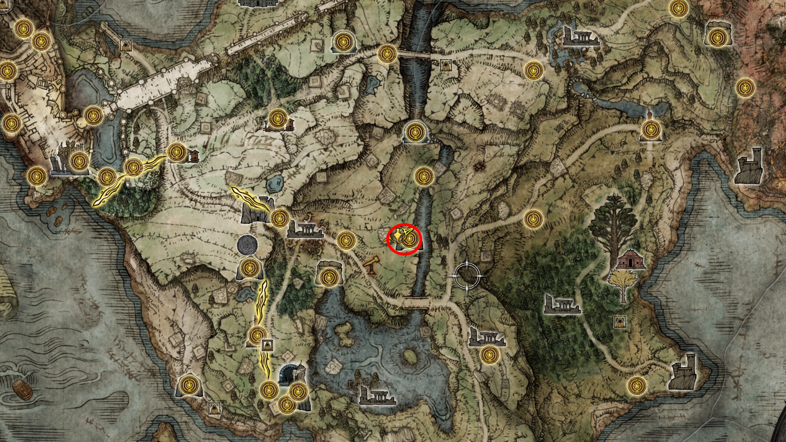
 
<em>Figura 29: O retorno à caverna inicial. O ciclo de Patches se fecha onde começou.</em>

---

[⬅️ Voltar para o README.md](README.md) | [Prosseguir para Montanha dos Gigantes ➡️](../13_mountaintops_of_the_giants/route.md)