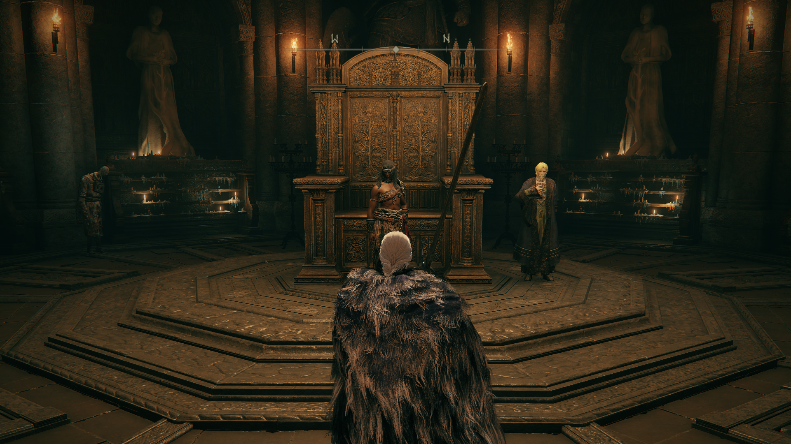

# 🌆 12. Leyndell, a Capital Real

> **Status da Região:** O Coração da Ordem Áurea (Nível 90 — 120)

Leyndell é a joia da Térvore, uma metrópole de ouro e mármore que serve como o centro político e religioso das Terras Intermédias. Mas não se deixe enganar pelo brilho: suas ruas são guardadas por cavaleiros implacáveis e seus fundamentos escondem segredos pútridos e maldições que remontam à era do Agouro.

## 👥 1. O Destino de Boc, o Alfaiate

Antes de qualquer exploração profunda, vamos garantir a sobrevivência do Boc. Como você já tem a Graça **Muralha Leste da Capital**, ele estará lá esperando por uma validação.

  * **Ação Crucial:** Fale com Boc até ele expressar o desejo de renascer com a ajuda da Rennala.
  * **[⚠️ PLATINA/LORE] Salvando o NPC:** 
  * **NÃO** entregue a Lágrima Larval (isso causaria a morte dele).
    * Fique na frente dele e use o item **Cabeça de Tagarela "Você é Lindo"** (*Prattling Pate "You're Beautiful"*).
    * Fale com ele novamente para ele aceitar sua aparência original.

 
<em>Figura 01: Usando a voz para salvar o Boc. Um passo essencial para manter o seu alfaiate vivo.</em>

-----

## 🏚️ 2. Descida ao Subterrâneo dos Desamparados

Com o Boc seguro, partiremos da Graça **Varanda da Avenida** para localizar a entrada dos esgotos.

  * **O Caminho:**
    1.  Desça as escadas da Graça e saia para a rua principal.
    2.  Pule o parapeito à esquerda para a área das casas em ruínas.
    3.  No centro desses destroços, localize e desça pelo **poço aberto**.
  * **Objetivo:** Ativar a Graça **Caminho Subterrâneo** (Underground Roadside).

-----

## 🧶 3. Libertando o Comedor de Estrume

Utilize a **Chave do Cárcere do Esgoto** que você recebeu na Mesa-Redonda.

  * **Rota Rápida:** Saindo da Graça do esgoto, vá para a esquerda, pule no buraco da grade no chão (perto dos ratos) e siga o túnel até o final. Suba a escada de mão para chegar às celas.
  * **Interação:** Abra a cela e diga para ele **"Saia da sua cela"**.
  * **Progresso:** Agora o corpo físico dele está livre, o que permite a invasão no fosso externo.

-----

## 💎 4. [COLETÁVEL] Mansão Fortificada: 3ª Maldição e Itens de Elite

Como você já coletou as maldições da Mansão Vulcânica e da entrada da Capital, vamos fazer uma "limpeza" na réplica da Mesa-Redonda. Este local é idêntico ao hub, mas em ruínas no mundo real.

* **Localização:** Mansão Fortificada (Fortified Manor).
* **Como chegar:** Partindo da Graça **Varanda da Avenida**, suba as escadas, passe por baixo da asa do dragão e entre na mansão à esquerda.

### 🎒 Loot Prioritário da Mansão:
1. **Maldição do Viveiro (3ª):** Suba as escadas e vá para a sala que seria a do Comedor de Estrume. O item está no corpo amarrado à cadeira.
2. **Lâmina de Amolar Santificada:** Localizada na sala que seria a do Ferreiro Hewg, logo ao lado da bigorna. (Permite afinidades Sagradas e de Raio).
3. **Martelo:** No mesmo local da Lâmina de Amolar, no chão da oficina do ferreiro.
4. **Espada de Códices (Coded Sword):** Vá para a sala que seria a das Duas Dedos. A espada está sobre o trono. (Uma arma que escala puramente com Fé e ignora escudos).

  
   
  <em>Figura 02: Limpeza concluída na Mansão Fortificada. Maldição, Espada de Códices e Lâmina de Amolar coletadas.</em>

---

## ⚔️ 5. Contrato Especial: Invasão com Bernahl (Vargram, o Lobo Furioso)

Antes de sair definitivamente da estrutura da Capital, devemos cumprir o contrato que Bernahl te entregou na Mansão Vulcânica. 

* **Localização:** Mansão Fortificada (o mesmo local do item anterior). No salão principal, haverá um sinal de invasão vermelho no chão.
* **A Missão:** Você será sumonado para o mundo de **Vargram** e **Wilhelm**. O Cavaleiro Bernahl lutará ao seu lado.
* **Recompensa Imediata:** Conjunto de Armadura do **Lobo Furioso** (set icônico do jogo).
* **[⚠️ IMPORTANTE] Retorno à Mansão:** 1. Após a vitória, viaje de volta para a **Mansão Vulcânica**.
    2. Fale com Bernahl no salão. Ele agradecerá sua ajuda.
    3. **Recompensa de NPC:** Ele te entregará o encantamento **Fúria de Gelmir** (Gelmir's Fury).

  
   
  <em>Figura 05: Cooperativo de invasão com Bernahl. Vital para a quest da arma lendária e para obter o set do Lobo Furioso.</em>

---

## ⚔️ 6. A Invasão no Fosso e o Destino de Boggart (4ª Maldição)

Com o corpo físico do Comedor de Estrume libertado nos esgotos (Passo 3), o espírito dele na Mesa-Redonda deixou um recado desafiando você para um duelo.

* **O Preparo (O Fator Boggart):** Graças à sua interação comprando camarões lá no passado, o Blackguard Big Boggart se mudou para o fosso de Leyndell para vender caranguejos. 
* **O Encontro no Fosso:** 1. Saia de Leyndell pelo portão nordeste em direção ao fosso raso (Capital Outskirts).
    2. **[⚠️ PASSO CRÍTICO]** Fale com o Boggart. Ele dirá que o Comedor de Estrume está rondando a área e que está com muito medo.
    3. Recarregue a área (saia, descanse em uma Graça e volte).
    4. Ao retornar, fale com Boggart novamente. Ele estará mortalmente ferido. Após o diálogo, ele deixará cair seus equipamentos (Sino de Boggart, Máscara de Ferro) e a tão desejada **Maldição do Viveiro** (sua 4ª).
* **A Batalha:** Imediatamente após a morte de Boggart, você será invadido pelo **Comedor de Estrume**.
    * **Recompensa:** Ao derrotá-lo, você recebe a **Espada de Milos** (Sword of Milos), uma excelente arma que restaura FP ao matar inimigos.

  
   
  <em>Figura 04: A trágica conclusão de Boggart garante a 4ª maldição. A invasão rende a Espada de Milos.</em>

---

## 🧶 7. O Ciclo do Comedor de Estrume (Cárcere e Mesa-Redonda)

Após libertar o corpo físico no esgoto e vencer a invasão no fosso externo (Passo 6), você deve formalizar o progresso para garantir a etapa final da quest.

1.  **Mesa-Redonda:** Retorne ao espírito do Comedor de Estrume. Ele admitirá a derrota no fosso e pedirá que você leve as maldições ao seu corpo real na cela.
2.  **Preparação:** Certifique-se de que você tem as **4 Maldições** coletadas até aqui (Mansão Vulcânica, Entrada de Leyndell, Mansão Fortificada e Fosso do Boggart).
3.  **O Destino:** Agora seu foco volta para o Subterrâneo, mas para um objetivo diferente: o fundo do abismo.

 
<em>Figura 05: O espírito reconhece sua força. A próxima interação será diretamente com o corpo físico na cela para a entrega das maldições.</em>

-----

## 🏚️ 8. Profundezas: A Algema de Mohg e a Catacumba de Leyndell

Este é o ponto mais baixo e perigoso de Leyndell. A descida exige cuidado para não ser emboscado pelas lagostas gigantes.

  * **Algema de Mohg:** Partindo da Graça **Caminho Subterrâneo**, saia da sala e pule nos canos à direita até chegar ao fundo do fosso. O item está em um corpo encostado na parede periférica, vigiado pelas lagostas.
  * **Utilidade:** Este item permite prender o boss Mohg no chão (até 2x na primeira fase), sendo vital tanto para o boss desta área quanto para o Lorde do Sangue futuramente.
  * **[🔥 GRAÇA] Catacumbas de Leyndell:** Localizada atrás de uma das lagostas. Atravesse a porta e ative a Graça imediatamente para evitar ter que repetir o caminho perigoso.

 
<em>Figura 06: Localização da Algema de Mohg. Um item de utilidade máxima para os desafios que virão.</em>

-----

## ⚔️ 9. Chefe: Godfrey, Primeiro Lorde Prístino (Sombra Áurea)

Subindo pelas raízes da Térvore a partir do andar superior da Mansão Fortificada, você chegará ao Santuário da Térvore.

  * **Estratégia:** Ele é imune a efeitos de status (Sangramento/Congelamento). Foque em dano físico.
  * **Recompensa:** Bolsa de Talismã (Aumenta o slot de talismãs).

-----

## 📜 10. [ITEM DE QUEST] Livro de Oração da Ordem Áurea

Logo após derrotar a Sombra de Godfrey, não saia da sala ainda. Existe um item vital pendurado no teto.

1.  Saia pela varanda leste da sala do boss e pule na raiz da Térvore que sobe.
2.  Siga pela raiz até o andar superior do Santuário.
3.  Saia por uma janela e caminhe pelo telhado até encontrar outra entrada.
4.  Caminhe sobre a raiz que cruza o teto da sala do boss para coletar o **Livro de Oração da Ordem Áurea**.

<!-- end list -->

  * **Utilidade:** Entregue ao Corhyn ou à Tartaruga Miriel para aprender o feitiço **Regressão da Lei** (Essencial para a quest da Máscara de Ouro).

-----

## 🏆 11. [ARMA LENDÁRIA] Lança de Gransax (PERDÍVEL)

Aproveitando que você está na área do Santuário, este é o momento de garantir a platina.

1.  Volte para o andar de baixo da sala do Godfrey e saia pela porta oeste (em direção ao elevador).
2.  Desça o elevador e siga para o parapeito.
3.  **Ação:** Pule sobre a lança gigante do dragão de pedra e suba nela.
4.  **Recompensa:** **Lança de Gransax** (Uma das 9 armas lendárias do jogo).

  
   
  <em>Figura 7: Coletando a Lança de Gransax e o Livro da Ordem Áurea. Dois itens fundamentais antes de enfrentar o Rei do Agouro.</em>

-----

## 🏛️ 12. O Quarto da Rainha e a Faca Negra

Antes de subir os degraus finais para o Trono da Térvore, faremos uma parada no antigo aposento de Marika.

  * **O Confronto:** Uma **Assassina da Faca Negra** guarda a entrada do quarto.
      * *Dica:* Ela é rápida, mas você pode usar o ambiente a seu favor. Derrotá-la limpa o caminho para a Graça.
  * **[🔥 GRAÇA] Quarto da Rainha:** Ative este ponto de descanso. É o local mais próximo para o boss principal.
  * **🎒 Coletáveis no Quarto:**
    1.  **Bênção da Térvore (Feitiço):** Um dos melhores encantamentos de cura gradual do jogo, localizado bem no centro do quarto.
    2.  **Cânone da Térvore:** Itens de lore que expandem a história de Marika.

-----

## ☀️ 13. Quest da Máscara de Ouro: O Enigma de Radagon

Com o **Livro de Oração da Ordem Áurea** em mãos e a área segura, agora você pode avançar a quest do Corhyn e do Máscara de Ouro em Leyndell.

1.  **Entrega do Livro:** Vá até o **Irmão Corhyn** (ele deve estar com o Máscara de Ouro em um penhasco perto do Coliseu de Leyndell) e entregue o livro para ele.
2.  **Aprendizado:** Compre o feitiço **Regressão da Lei** (*Law of Regression*).
      * *Nota Técnica:* Este feitiço exige **37 de Inteligência**. Se a sua build não focar nisso, use itens como a Máscara de Pedra de Karolos, o Talismã de Herança do Astrônomo e a Runa Maior de Godrick para alcançar o requisito temporariamente.
3.  **O Segredo:** Vá até a estátua gigante de Radagon (descendo o elevador perto do Santuário da Térvore).
      * Fique sobre a mensagem oficial no chão que diz *"Só o retrocesso revela segredos"* e use o feitiço **Regressão da Lei**.
      * A estátua mudará e uma nova mensagem aparecerá. Leia-a: *"Radagon é Marika"*.
4.  **Finalização da Etapa:** Volte ao Máscara de Ouro, conte o segredo a ele e fale com Corhyn para completar esta fase da quest.

  
   
  <em>Figura 8: Máscara de Ouro.</em>

-----

## ⚔️ 14. Chefe: Morgott, o Rei do Agouro [🏆 PLATINA]

Agora que o enigma foi resolvido e o Quarto da Rainha está liberado, você está pronto para o Trono.

  * **Preparação Final:** Como você já tem a **Algema de Margit** (que funciona no Morgott também), coloque-a nos itens rápidos.
  * **Invocação:** O sinal da **Melina** estará disponível na porta.
  * **Recompensa:** Runa Maior de Morgott e a Lembrança do Rei do Agouro.

  
   
  <em>Figura 9: O confronto final em Leyndell. Com o Quarto da Rainha liberado, o "runback" em caso de derrota é mínimo.</em>

-----

## 👥 15. A Ascensão de Nepheli Loux: O Trono de Limgrave

Com a queda de Morgott, as peças se alinham para o final da linhagem dos Loux. Certifique-se de ter entregue o **Rei Falcão da Tempestade** para ela na Mesa-Redonda antes de seguir para Stormveil.

### 🛠️ Pré-requisitos de Script:

1.  **Kenneth Haight:** Você deve ter liberado o Forte Haight e conversado com ele no topo da torre (onde ele diz que procura um líder legítimo).
2.  **Gostoc (O Pisoteador):** Se ele ainda estiver vivo, ele participará da cena final e abrirá uma loja especial.
3.  **Gatilho Ativado:** Morgott derrotado e diálogo com Melina na Graça do Trono concluído.

  
   
  <em>Figura 10: Forte Haight depois para a Graça **Godrick, o Enxertado**.</em>

### 🏃 Rota de Execução:

1.  Viaje para a Graça **Godrick, o Enxertado** em Stormveil.
2.  Descanse na Graça para resetar o mapa e forçar o spawn dos NPCs.
3.  Siga para a sala do trono logo à frente.
4.  **Interação:** Fale com Nepheli Loux no trono e com Kenneth Haight ao lado dela.

### 🎁 Recompensas (High-End Loot & Troféus):

  * **Pedra de Forja de Dragão Antigo (x1):** Entregue pela Nepheli.
  * **Pedra de Forja de Dragão Antigo (x1):** Vendida pelo Gostoc (se ele estiver vivo).
  * **[🏆 TROFÉU] Arma Matadora de Deuses (God-Slaying Weapon):** > Estas pedras são os únicos itens capazes de elevar uma arma comum ao nível **+25**. Ao realizar esse upgrade pela primeira vez no Ferreiro Hewg, você desbloqueia este troféu obrigatório para a **Platina**.

  
   
  <em>Figura 11: Nepheli assumindo o trono. O momento em que você garante os materiais para o seu primeiro upgrade de nível máximo (+25).</em>

-----

## 🏛️ 16. Catacumbas de Leyndell (Esgotos)

Esta masmorra está escondida no nível mais baixo do Subterrâneo dos Desamparados.

  * **Ponto de Referência:** Graça **Caminho Subterrâneo**.
  * **Como chegar:** Saia da sala da graça, vire à direita e pule nos canos. Desça até o nível do chão onde estão as duas lagostas gigantes. A entrada da masmorra fica no canto sul/sudoeste desta área, atrás de uma das lagostas.
  * **Loot:** Talismã Exultação do Lorde do Sangue.

 
<em>Figura 12: Localização exata no fundo dos esgotos. O print deve mostrar a porta atrás das lagostas.</em>

-----

## 🐎 17. Túmulo do Herói de Auriza

Localizado no fosso externo, na base das muralhas da capital.

  * **Ponto de Referência:** Graça **Muralha da Capital** (onde o Sentinela Dracônico guardava a porta).
  * **Como chegar:** Em vez de entrar na cidade, siga pelo caminho de terra que desce à direita (leste) contornando a muralha. Siga a estrada até o fim, passando por um gigante de pedra, até encontrar a estrutura do túmulo.
  * **Dica:** Use a **Algema de Margit** dentro da masmorra para destruir as carruagens e pegar o set da Sentinela da Árvore.

 
<em>Figura 13: Localização na base da muralha leste. O print deve mostrar o caminho descendo o penhasco.</em>

### 💡 Dica para Auriza:

Quando estiver no corredor onde as carruagens descem, fique em um local seguro e use a **Algema de Margit**. O "pulso" da algema ativará um pilar de luz escondido no andar de baixo, que fará as carruagens colidirem imediatamente. Isso economiza muito tempo e evita mortes frustrantes!

-----

## 🛡️ 18. Túmulo Auxiliar de Auriza

Esta masmorra fica praticamente na mesma entrada do Túmulo do Herói de Auriza, mas o foco aqui é um quebra-cabeça de teletransporte.

  * **Ponto de Referência:** Entrada leste da Capital (mesmo caminho do item 17).
  * **Mecânica:** Você deve usar os baús de armadilha para navegar entre diferentes seções da masmorra. É um labirinto que confunde a percepção de onde você está.
  * **Loots Importantes:**
    1.  **Cinzas de Soldados de Leyndell:** Encontradas durante a exploração.
    2.  **Cinzas de Soldados de Radahn:** No final da masmorra.
    3.  **Cinzas de Guerra: Batismo de Luz (Holy Ground):** Dropada pelos Sentinelas que você derrota aqui.
  * **Boss:** Sentinela da Árvore (em versão espírito).

  
   
  <em>Figura 14: Localização na base da muralha leste. O print deve mostrar o caminho descendo o penhasco.</em>

---

### 🧭 19. O Caminho para as Terras Proibidas

1.  **Abertura:** Vá para a **Graça da Avenida Principal** (aquela no meio da rua larga de Leyndell).
2.  **Direção:** Siga a avenida em direção ao **Leste** (o lado oposto de onde você enfrentou o Avatar da Térvore).
3.  **O Portão:** Você encontrará um portão monumental. Se você já derrotou o **Morgott**, esse portão poderá ser aberto manualmente.
4.  **O Elevador Interno:** Atrás do portão, suba a escadaria e pegue o grande elevador que te levará para as muralhas externas e, por fim, às **Terras Proibidas**.

---

## 🧪 20. Coleta Estratégica: Frasco de Perfume das Muralhas

No trajeto entre a saída da cidade e o elevador que desce para as Terras Proibidas, há um item de inventário importante para a criação de consumíveis de suporte.

  * **Localização:** No pátio elevado das muralhas externas, logo antes de entrar na sala do elevador que leva à névoa das Terras Proibidas.
  * **O Item:** **Frasco de Perfume**. Está em um corpo em um canto do pátio, geralmente guardado por soldados de Leyndell.
  * **Utilidade:** Permite carregar mais perfumes simultaneamente, como o *Aroma de Bolha de Ferro* (essencial para tancar o dano alto dos chefes da montanha).

  
   
  <em>Figura 15: Localização do Frasco de Perfume nas muralhas externas, último item antes da descida para o Elevador de Rold.</em>

-----

## 🏛️ 21. O Caminho Superior: Torre Divina de Altus e Runa de Morgott

Antes de descer para as Terras Proibidas, você deve subir para ativar o poder da Runa que acabou de conquistar.

1.  **O Portão da Avenida:** Após abrir o portão leste na Avenida Principal de Leyndell, suba as escadarias.
2.  **O Desvio para a Torre:** Em vez de seguir direto para o elevador que desce para a neve, siga para a **esquerda** em direção à ponte monumental.
3.  **O Confronto (Gêmeos Malditos):** Ao atravessar a ponte em direção à Torre Divina, a tela ficará preta e você enfrentará os chefes **Gêmeos Malditos** em um vazio total.
      * *Dica:* Eles são vulneráveis a ataques de salto e quebra de postura.
4.  **Ativação:** Após a luta, você chegará à **Torre Divina de Altus Leste**. Suba ao topo para ativar a **Runa Maior de Morgott**.
      * **Efeito:** Aumenta drasticamente o HP máximo (muito superior à runa do Godrick para o end-game).

---

## 🧭 22. Transição Final para as Terras Proibidas

Agora sim, com a **Runa de Morgott** ativada na Torre Divina e o **Frasco de Perfume** no inventário, você está pronto para deixar a região da Capital.

1.  **O Elevador:** Pegue o grande elevador que desce para o nível do solo fora das muralhas.
2.  **A Graça:** Assim que sair do elevador, você entrará em uma área de névoa densa. Ative a Graça **Terras Proibidas** imediatamente.
3.  **Upgrade:** Não esqueça de pegar a **Semente Dourada** na árvore à direita, logo no início da estrada de neve.

-----

[⬅️ Voltar para o README.md](README.md) | [Prosseguir para Montanha dos Gigantes ➡️](../13_mountaintops_of_the_giants/route.md)