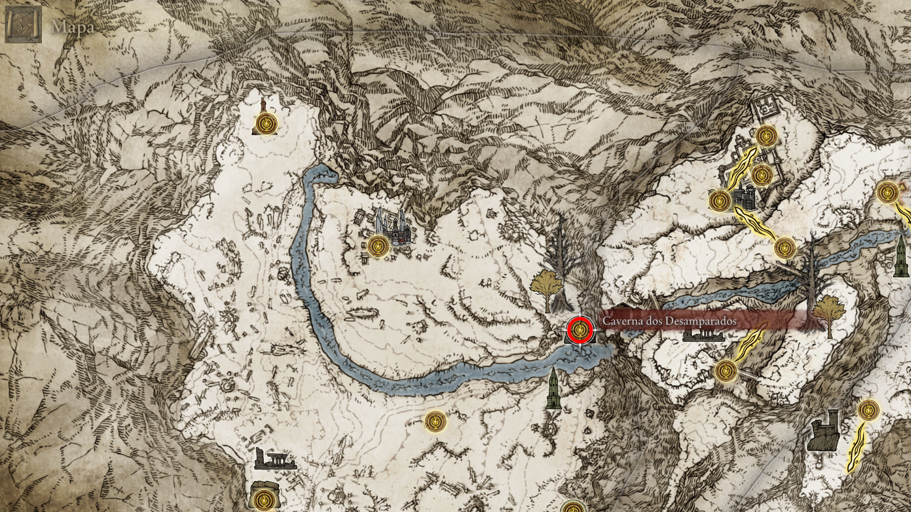

# 🏔️ 13. O Caminho do Fogo e do Gelo

> **Status da Região:** Transição para o End-game (Nível 110 — 140)

Este roteiro cobre desde as profundezas de Leyndell até o topo da Montanha e o Reino de Sangue.

---

## ⚔️ 01. Derrotar o Mohg do Esgoto
O guardião que protege o acesso ao segredo mais profundo da Capital. Ele é uma projeção colocada ali para selar o caminho para a Chama Frenética.

* **Estratégia:** Ele é imune a Sangramento. Use a **Algema de Mohg** para prendê-lo 2x no chão durante a primeira fase.
* **Dica:** Ataque o altar atrás do baú após a luta para revelar a passagem secreta.

    
     
    <em>Figura 1: Projeção de Mohg derrotada no Labirinto Subterrâneo.</em>

---

## 🕯️ 02. Conclusão da Quest de Hyetta: A Chama Frenética
Você deve ter entregue as **3 Uvas Shabriri** e a **Uva Dedital** para ela em Liurnia. Agora, ela está no ponto mais profundo do mundo, aguardando o próximo Lorde.

  * **Localização:** Vá para a Graça **Catedral dos Desamparados**.
  * **O Caminho Oculto:** Desça pelo "puzzle de pulo" nas lápides até o fundo do poço. É um dos trajetos mais difíceis de plataforma do jogo.
  * **Ação:** 1. Fale com Hyetta perto da porta de pedra selada.
    2. **[⚠️ PLATINA]** Para o final correspondente, tire toda a sua armadura e abra a porta.
    3. Após a cena, fale com Hyetta novamente e toque nela.
  * **Recompensa:** **Selo da Chama Frenética**.

 
<em>Figura 2: O sacrifício final para o Lorde da Chama Frenética.</em>

---

## 🐲 03. O Sentinela das Terras Proibidas: Gárgula
O último teste de habilidade antes de acessar o Grande Elevador de Rold.

* **Estratégia:** Cuidado com o rugido que lança ondas de choque. Foque nas pernas para quebrar a postura.
* **Loot:** Alabarda e Lâmina Negra do Gárgula.

    
     
    <em>Figura 3: O portão para as montanhas está aberto.</em>

---

## ❄️ 04. Picos dos Gigantes: Shabriri e Mapa Oeste
Sua chegada oficial ao topo do mundo. Você encontrará o corpo de Yura possuído por Shabriri.

* **Ação:** Como você já abraçou a chama, mate Shabriri imediatamente para pegar o **Set do Ronin**.
* **Mapa:** Siga a estrada; o monólito está visível à direita após as ruínas iniciais.

    
     
    <em>Figura 4: Localização do primeiro fragmento de mapa (Oeste).</em>

---

## 🔔 05. Reforços de Forja: Sinos de Mineiro [3]
Essencial para comprar pedras de nível médio ilimitadas (5 e 6).

* **Localização:** Porão nas **Ruínas de Zamor**.
* **Estratégia:** Os inimigos aqui são ágeis; use dano de fogo ou armas colossais para interromper os ataques.

    
     
    <em>Figura 5: Item essencial para progressão de armas.</em>

---

## 👥 06. A Busca de Millicent: Vale das Neves
Millicent continua sua jornada em busca da Árvore Sacra de Miquella.

* **Localização:** Graça **Antigo Vale das Neves**.
* **Ação:** Esgote o diálogo. Ela menciona que o Castelo Sol ao norte guarda a chave para a passagem secreta.

    
     
    <em>Figura 6: Millicent avançando em sua busca.</em>

---

## ⛵ 07. O Barqueiro do Vale: Marinheiro Tibia
Uma versão mais perigosa que invoca um esqueleto gigante do chão.

* **Localização:** No penhasco próximo ao vale das ruínas.
* **Estratégia:** Ignore o gigante. Foque 100% no barqueiro montado no cavalo.
* **Loot:** Raiz da Morte e Espada *Helphen's Steeple*.

    
     
    <em>Figura 7: Batalha no topo do mundo.</em>

---

## 🌟 08. Magia Ancestral: Chuva de Estrelas Fundadora [🏆 PLATINA]
Um dos feitiços lendários necessários para o troféu.

* **Localização:** **Ascensão Herética**.
* **O Puzzle:** A ponte é invisível. Siga as partículas de neve no ar. Na metade, a ponte sobe em rampa para a esquerda.
* **Dica:** Use Pedras de Arco-Íris para marcar o chão com segurança.

    
     
    <em>Figura 8: Travessia invisível para o feitiço lendário.</em>

---

## 🌳 09. Térvore Menor: Lágrima de Cristal de Bolha
Este Avatar se divide em dois quando o HP chega na metade.

* **Estratégia:** Use fogo. O dano causado no clone reduz a barra do boss principal.
* **Loot:** Lágrima que te cura automaticamente ao receber um golpe fatal.

    
     
    <em>Figura 9: Localização do Avatar no vale gélido.</em>

---

## 🎐 10. O Reencontro: Lâmina de Pedrilhante Primordial [🏆 PLATINA]
Um momento emocionante para a Aurelia e um item de platina para você.

* **Localização:** **Ruínas de Astrônomo**.
* **Ação:** Invoque sua cinza de **Água-viva Aurelia** perto da estátua onde outra água-viva está chamando por "irmã".
* **Loot:** Talismã Lendário que reduz custo de FP.

    
     
    <em>Figura 10: O reencontro das irmãs.</em>

---

## 👥 11. O Destino da Ordem: Máscara de Ouro
A conclusão do enigma "Radagon é Marika" leva os peregrinos ao norte.

* **Localização:** Ponte ao sul do Castelo Sol.
* **Ação:** Fale com Corhyn e Máscara de Ouro para avançar a quest até o estágio final na capital cinzenta.

    
     
    <em>Figura 11: Ponto de encontro com os buscadores da Ordem Áurea.</em>

---

## 🐲 12. Borealis, a Névoa Congelante
O dragão que domina o lago congelado.

* **Estratégia:** Quando ele começar a rugir, fuja imediatamente! O gelo no chão causa dano contínuo.
* **Dica:** Derrotá-lo limpa a névoa do lago permanentemente.

    
     
    <em>Figura 12: Batalha no Lago Congelado.</em>

---

## 🔔 13. Sinos de Pedra Sombria [4]
Acesso a pedras de upgrade nível 7 e 8.

* **Localização:** **Primeira Igreja de Marika**.
* **Ação:** O item está em um corpo na entrada da igreja. Aproveite para pegar a Lágrima Sagrada no altar.

    
     
    <em>Figura 13: Item para levar armas especiais ao nível máximo.</em>

---

## ⚔️ 14. O Lorde Contendor: Vyke no Cárcere
Vyke foi o maculado que chegou mais perto de ser Lorde antes de sucumbir à loucura.

* **Localização:** Cárcere do Lorde Contendor.
* **Estratégia:** Seja agressivo. Ele causa Loucura rápido, então use itens de foco se necessário.
* **Loot:** Armadura Digital (a da capa do jogo).

    
     
    <em>Figura 14: Localização do Cárcere do Lorde Contendor.</em>

---

## 🗺️ 15. Mapa Leste: Posto de Túmulo dos Gigantes
Revela a área da Forja e dos picos finais.

* **Localização:** Monólito logo após cruzar a ponte de corrente gigante.

    
     
    <em>Figura 15: Segundo fragmento de mapa da região.</em>

---

## 🛡️ 16. O Canhão Móvel: Escudo de Um Olho
A fortificação que guarda a entrada para a Forja.

* **Localização:** Guarnição dos Guardiões. Derrote o Chefe Arghanthy.
* **Loot:** Escudo que dispara bolas de fogo e o **Livro de Orações dos Gigantes**.

    
     
    <em>Figura 16: O poderoso escudo que dispara bolas de fogo.</em>

---

## 🩸 17. O Retorno de Okina: Rios de Sangue
**[⚠️ MUITO IMPORTANTE]** Você DEVE matá-lo antes do Gigante de Fogo.

* **Localização:** **Igreja do Repouso**.
* **Estratégia:** Okina causa hemorragia extrema. Mantenha distância e use quebra de postura.
* **Loot:** Katana Rios de Sangue e Máscara de Okina.

    
     
    <em>Figura 17: Invasão do NPC que dropa a Rios de Sangue.</em>

---

## 👥 18. Túmulo do Conquistador de Gigantes
Masmorra de fim de jogo com mecânicas de luz.

* **Mecânica:** Atraia os inimigos sombras para os selos dourados no chão para torná-los vulneráveis.
* **Recompensa:** **Pedra de Forja de Dragão Antigo (+25)**.

    
     
    <em>Figura 18: Graça liberada no topo da montanha.</em>

---

## 👹 19. O Gigante de Fogo [🏆 PLATINA]
O último de sua raça e guardião da Chama do Caos.

* **Estratégia:** Fase 1: Foque no pé esquerdo (com a tala). Fase 2: Foque nas mãos ou no olho no peito quando ele se curvar.
* **Dica:** Alexander pode ser invocado se você seguiu a quest dele.

    
     
    <em>Figura 19: Batalha épica para liberar o fim do jogo.</em>

---

## 🌋 20. A Forja dos Gigantes
O ponto de decisão que altera o mundo.

* **Ação:** Suba na forja e descanse na graça. Fale com Melina (ou ouça as chamas) para queimar a Árvore.
* **Aviso:** Isso te teleportará para Farum Azula. Só faça isso se já pegou a Rios de Sangue.

    
     
    <em>Figura 20: O incêndio da Árvore Térvore.</em>

---

## ⚔️ 21. O Comandante Niall e o Shotel [🏆 PLATINA]
O portão de ferro para o acesso a Malenia.

* **Localização:** Topo do **Castelo Sol**.
* **Estratégia:** Use um **Ramo Enfeitiçado** nos cavaleiros fantasmas dele.
* **Loot:** **Shotel do Eclipse** (Arma Lendária) e o Medalhão Secreto (Esquerda).

    
     
    <em>Figura 21: Vitória contra Niall para liberar o acesso secreto.</em>

---

## 🚠 22. O Caminho Secreto: Elevador de Rold
Acesso à região mais escondida do mapa.

* **Ação:** No Elevador de Rold, selecione **"Içar Medalhão Secreto"** (mude a opção no direcional).
* **Destino:** Campo de Neve Consagrado.

    
     
    <em>Figura 22: Transição para a região secreta.</em>

---

## ⚔️ 23. Invasão Anastasia (Snowfield)
A terceira e última aparição da devoradora de maculados.

* **Localização:** Margem do rio congelado ao norte.
* **Recompensa:** **Pedra de Forja de Dragão Antigo** (+25).

    
     
    <em>Figura 23: Coleta de pedra de upgrade máximo.</em>

---

## 🩸 24. O Nobre Sanguíneo: Guardião do Portal
Este inimigo protege o portal para o Mohg.

* **Localização:** Bosque nevado ao oeste.
* **Dica:** Mate-o rápido para limpar o caminho para o portal de sangue.

    
     
    <em>Figura 24: Invasão obrigatória.</em>

---

## 🌀 25. Frenesi Insuportável
Um dos encantamentos mais fortes de Loucura do jogo.

* **Localização:** Porão nas Ruínas de Yelough Anix.
* **Dica:** Os ratos aqui causam loucura, limpe a área antes de descer.

    
     
    <em>Figura 25: Item para build de Chama Frenética.</em>

---

## 🧩 26. Torre Albinaúrica: Talismã Lendário [🏆 PLATINA]
Um puzzle de inteligência artificial.

* **Localização:** Torre no leste do Campo de Neve.
* **Puzzle:** Use um **Dardo de Cristal** nos diabretes da entrada para que eles briguem entre si.
* **Loot:** Massa de Pedrilhante de Amálgama (Talismã Lendário).

    
     
    <em>Figura 26: Resolução do puzzle da torre.</em>

---

## 🐲 27. Theodorix e a Espada Grande da Ordem Áurea [🏆 PLATINA]
O Wyrm que guarda a arma lendária.

* **Localização:** Fim do rio ao norte.
* **Estratégia:** Atraia Theodorix para os polvos gigantes próximos; eles lutarão entre si.
* **Loot:** **Espada Grande da Ordem Áurea** (Arma Lendária).

    
     
    <em>Figura 27: Dragão de Magma e entrada da masmorra lendária.</em>

    
     
    <em>Figura 27b: Caverna dos Desamparados.</em>

---

## 🌳 28. Térvore Menor: Lágrima Espinhosa
Aumenta o poder de ataque sucessivo (Perfeito para Katanas).

* **Localização:** Térvore Menor do Campo de Neve Consagrado.
* **Estratégia:** Cuidado com o ataque de estrelas do avatar.

    
     
    <em>Figura 28: Localização da Térvore no campo de neve.</em>

---

## 🛒 29. Comboio dos Gigantes: Tocha de Santa Trina
Dois gigantes puxando itens de raridade máxima.

* **Loot:** Tocha de Santa Trina (Sono) e a Espada Curva do Riacho.

    
     
    <em>Figura 29: Saque dos baús móveis.</em>

---

## 👥 30. A Promessa de Latenna: Upgrade Final
O fim da jornada da arqueira albinaúrica.

* **Localização:** Igreja Abandonada do Apóstata.
* **Ação:** Invoque Latenna na frente da gigante albinaúrica.
* **Recompensa:** **Pedra Dracônica Sombria (+10)**.

    
     
    <em>Figura 30: Conclusão da jornada da Latenna.</em>

---

## 🕯️ 31. Ordina, Cidade Sacramental
O puzzle de tochas para acessar a Árvore Sacra.

* **Ação:** Acenda 4 tochas no Cárcere Eterno.
* **Dica:** Use a Tocha da Sentinela para ver as assassinas invisíveis.

    
     
    <em>Figura 31: Abertura do portal para Miquella's Haligtree.</em>

---

## 🩸 32. Portal para a Dinastia Mohgwyn
Acesso direto ao Reino do Sangue.

* **Localização:** Penhasco ao oeste do Campo de Neve. Portal sangrento.

    
     
    <em>Figura 32: Entrada alternativa para a área de fim de jogo.</em>

---

## ⚔️ 33. Invasões do Varré: Set Máscara Branca
O set indispensável para qualquer build de sangramento.

* **Ação:** Derrote as 3 invasões de Máscaras Brancas no pântano de sangue.
* **Loot:** Máscara Branca (Aumenta dano após sangramento).

    
     
    <em>Figura 33: Farm do set essencial.</em>

---

## ⚔️ 34. Invasão e Morte do Varré
O acerto de contas com quem te chamou de "Sem Donzela".

* **Localização:** Sinal vermelho no chão no túnel antes do boss Mohg.
* **Loot:** Buquê do Varré.

    
     
    <em>Figura 34: Encerramento da quest do Varré.</em>

---

## 🩸 35. Mohg, Lorde do Sangue [🏆 PLATINA]
O boss final desta rota e um dos mais fortes do jogo.

* **Dica Crucial:** Use a **Lágrima Purificadora** no seu frasco para anular o ritual "NIHIL".
* **Loot:** Runa Maior e Troféu de Platina. Pegue a Pedra Sombria Dracônica no baú atrás do altar.

    
     
    <em>Figura 35: Conclusão da Dinastia Mohgwyn para a platina.</em>

---

[⬅️ Voltar para o README.md](README.md) | [Prosseguir Árvore Sacra de Miquella ➡️](../14_miquellas_haligtree/route.md)