# 🌳 14. Árvore Sacra de Miquella (Miquella's Haligtree)

> **Status da Região:** Masmorra Legado Secreta (Nível 140 — 160+)

A Árvore Sacra é o refúgio criado por Miquella para ser uma alternativa à Térvore, um lugar onde os rejeitados pela Ordem Áurea (Albinaúricos, Misbegotten) pudessem viver. É aqui que reside o desafio final para muitos maculados.

## 🏺 O Desafio do Grande Jarro (Caelid Setentrional)

> **Requisito:** 2 Chaves de Espada de Pedra (Stonesword Keys).
> **Recompensa:** **Arsenal do Grande Jarro** (Aumenta vastamente a Carga de Equipamento).

### 📍 Como Chegar: O Caminho Oculto
Você não chega ao Grande Jarro por Caelid central (estrada comum). O caminho é por baixo:

1.  **O Rio Siofra:** Vá para o **Poço do Rio Siofra** em Limgrave (perto da Térvore Menor de Limgrave Leste).
2.  **A Travessia:** Atravesse todo o mapa subterrâneo do Rio Siofra até o extremo norte.
3.  **O Elevador de Saída:** Você encontrará um elevador que exige **2 Chaves de Espada de Pedra** para ser ativado. Ele te levará para o desfiladeiro de **Dragonbarrow** em Caelid.
4.  **O Desfiladeiro:** Siga o caminho pelo desfiladeiro. Você terá que passar por **dois Gigantes Golems** armados com arcos gigantes.
    * *Dica:* Mate os Golems ou passe correndo com o Torrente, mas cuidado: as flechas deles têm rastreio e causam um dano absurdo.

    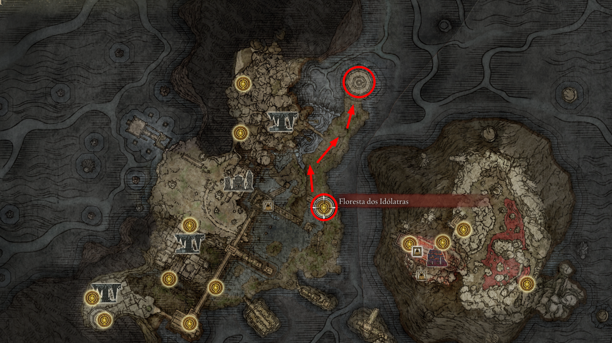
     
    <em>Figura 1: Acesso via Elevador Profundo no Rio Siofra.</em>

    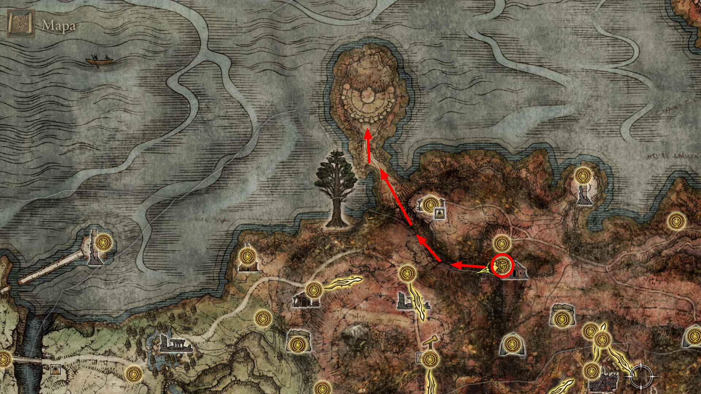
     
    <em>Figura 2: Caminho pelo desfiladeiro em Caelid (Dragonbarrow).</em>

---

### ⚔️ Como Concluir a "Quest"
O Grande Jarro não fala, mas ele te desafia através de combate.

1.  **Fale com o Jarro:** Ele estará sentado em frente a um grande coliseu selado. Ele apenas emitirá um som "..."
2.  **Os Sinais de Invocação:** Três sinais vermelhos de "Cavaleiros do Grande Jarro" aparecerão no chão à frente dele.
3.  **O Desafio:** Você deve derrotar os **3 guerreiros seguidos**, sem morrer. Se você morrer para o terceiro, terá que derrotar os três novamente.

    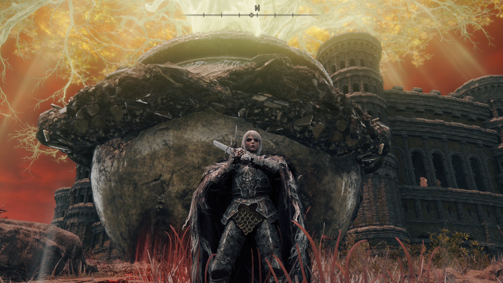
     
    <em>Figura 3: O Grande Jarro e os sinais de duelo no Coliseu.</em>

### 💡 Dicas de Estratégia (O "Pulo do Gato")

* **Modo Offline vs. Online:** * Se você jogar **Online**, os fantasmas que você invoca são baseados em *builds* de jogadores reais. Isso pode ser um pesadelo (muita gente usando *Rivers of Blood* ou magias de hit kill).
    * Se você jogar **Offline**, o jogo invocará 3 NPCs com *builds* padrão da FromSoftware, que são muito mais fáceis de prever e derrotar.
* **O Truque do Penhasco:** Se estiver muito difícil, você pode se posicionar na beirada do penhasco à esquerda dos sinais de invocação. Muitas vezes, a IA dos NPCs tenta te atacar e acaba caindo no abismo.
* **Agulha de Miquella/Fogo:** Como você está focado em builds de dano alto, use ataques que quebrem a postura deles rapidamente, pois eles têm muito HP.

---

## 🌿 01. Dossel da Árvore Sacra: O Início Vertical
Você começa literalmente nos galhos mais altos. Esta área é extremamente perigosa devido ao risco de queda e aos inimigos de longo alcance.

    ** Item tagarrela meu amo

    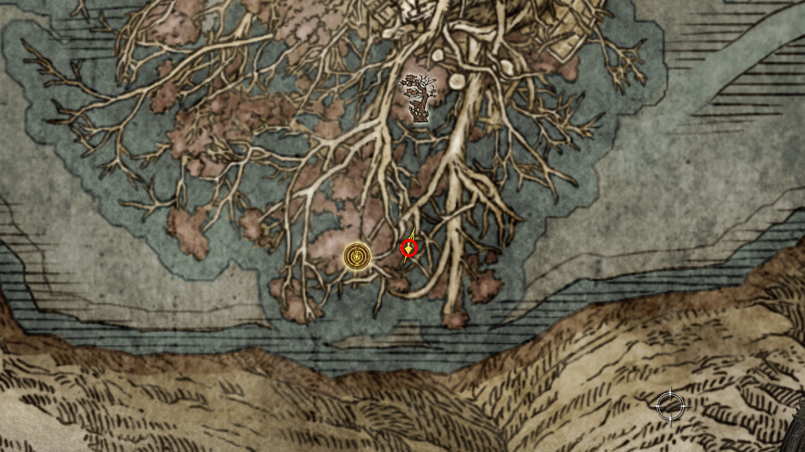
     
    <em>Figura 4: .</em>

---

## 🌿 02. 
breve descricao , lore e o que pode aconter.

    ** Item Cinza do Enviado do Oráculo
    ** Dica

    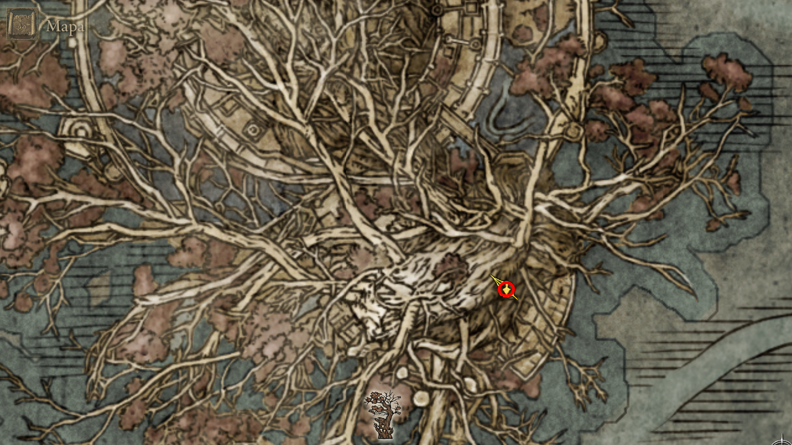
     
    <em>Figura 5: .</em>

---

## 🌿 03. 
breve descricao , lore e o que pode aconter.

    ** Item talisma draco perola +2
    ** Dica subir a escada depois da graca cidade da arvore sacra

    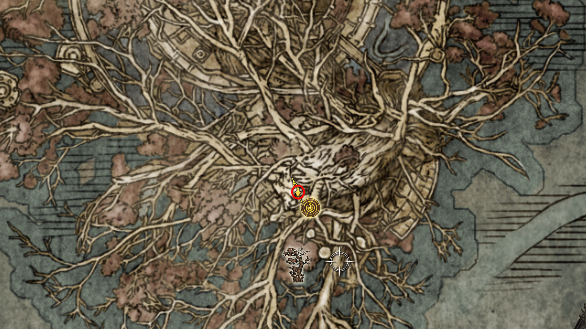
     
    <em>Figura 6: .</em>

---

## 🌿 04. 
breve descricao , lore e o que pode aconter.

    ** Item medalha ambar viridiano +2 e pedra dragao anciao a frente tbm
    ** Dica dentro de um bau

    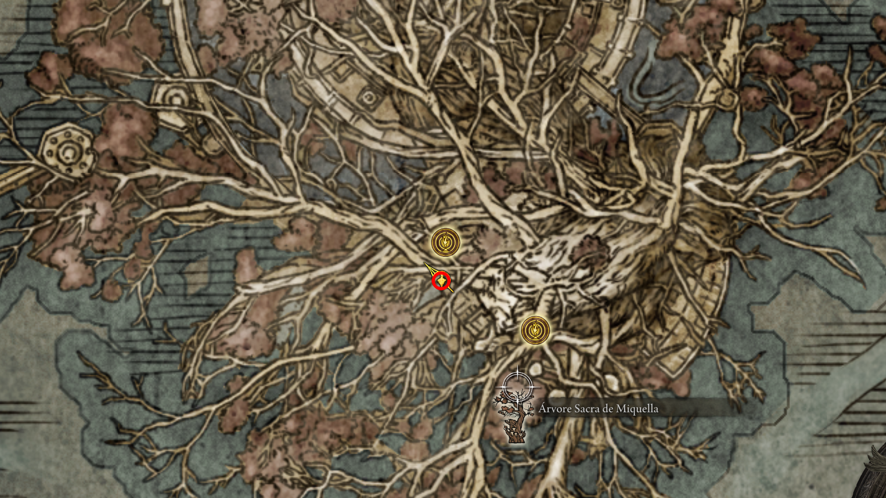
     
    <em>Figura 7: .</em>

---

## ⚔️ 05. Loretta, Cavaleira da Árvore Sacra [🏆 PLATINA]
Loretta não é mais uma projeção real como em Liurnia. Ela está aqui fisicamente para proteger o santuário dos Albinaúricos.

* **Estratégia:** Ela usa feitiçarias de elite. Mantenha-se próximo para evitar os arcos mágicos, mas cuidado com os ataques de estocada da alabarda.
* **Loot:** Feitiço **Arco de Pedrilhante de Loretta** e a foice **Alabarda de Guerra de Loretta**.
* **item** apos a arena no bau outra pedra dragao anciao(explique a localizacao)

    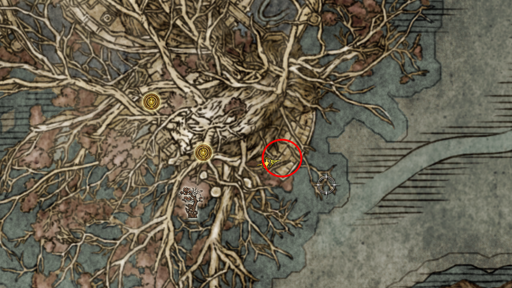
     
    <em>Figura 8: Arena de batalha contra a guardiã do portão de Elphael.</em>

---

## 👥 06. Millicent: O Clímax em Elphael
Millicent está exausta, mas sente que Malenia está perto. Ela busca devolver a dignidade e a vontade de lutar para a sua "mãe".

* **Localização:** Graça **Sala de Oração**.
* **Ação:** Fale com ela até esgotar o diálogo. Ela agradecerá por toda a ajuda até aqui.
* **Atenção:** Não ataque Millicent por acidente! Isso cancelará a quest no estágio final.

    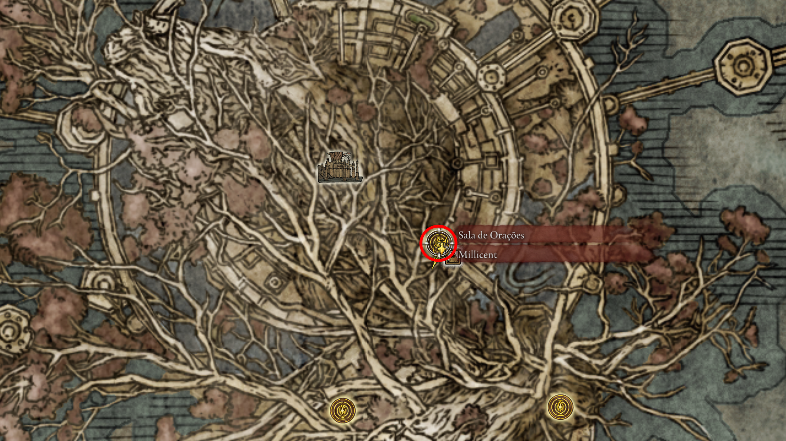
     
    <em>Figura 9: Millicent descansando antes do confronto final.</em>

---

## 🌿 07. 
breve descricao , lore e o que pode aconter.

    ** Item Madicao do alfobre(quest do comedor de estrume), tem mais uma pedra draconica sombria no bau antes da maldicao alfobre
    ** Dica
    

    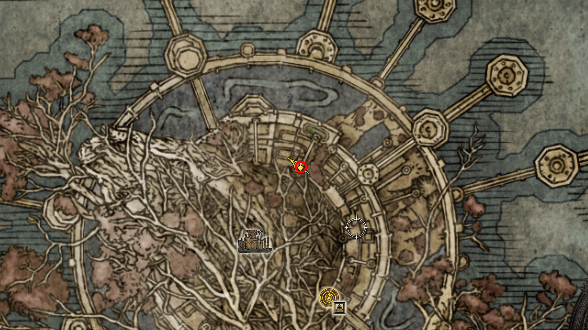
     
    <em>Figura 10: localizacao do primeiro.</em>

    

    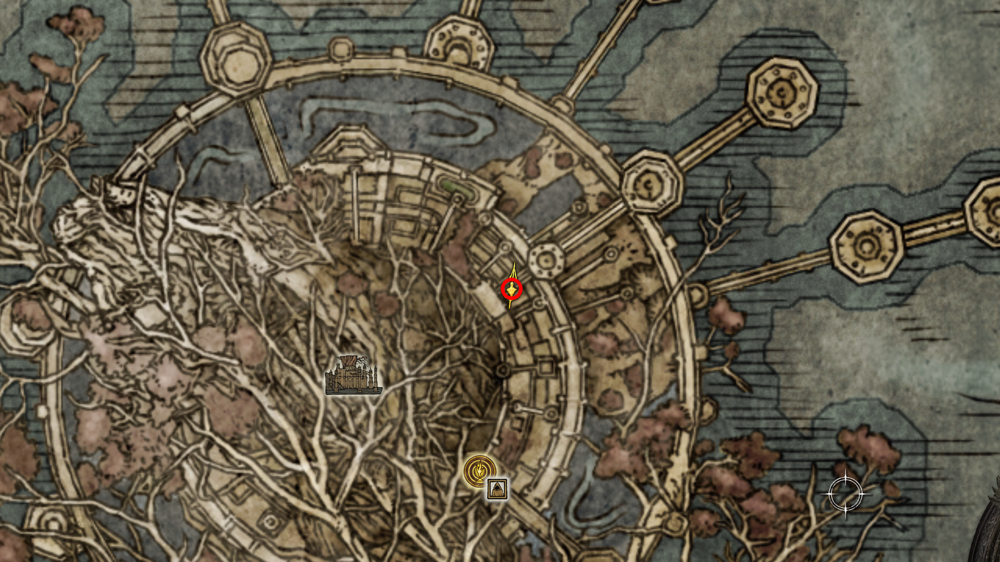
     
    <em>Figura 11: localizacao do segundo.</em>

---

## 🌿 08. Selo da ferida de Marila (item platina)
breve descricao , lore e o que pode aconter.

    ** Item Selo da ferida de Marila
    ** Dica

    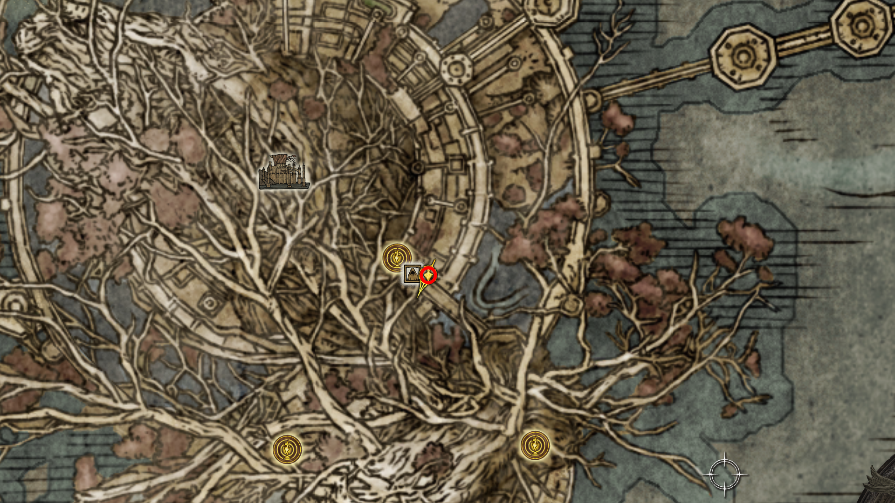
     
    <em>Figura 12: .</em>

---

## 🌿 09. Cinzas de Finlay, Cavalaria da Podridao Imaculada (Item platina)
breve descricao , lore e o que pode aconter.

    ** Item dentro do Cinzas de Finlay, Cavalaria da Podridao Imaculada
    ** Dica derrotar inimigo que protege

    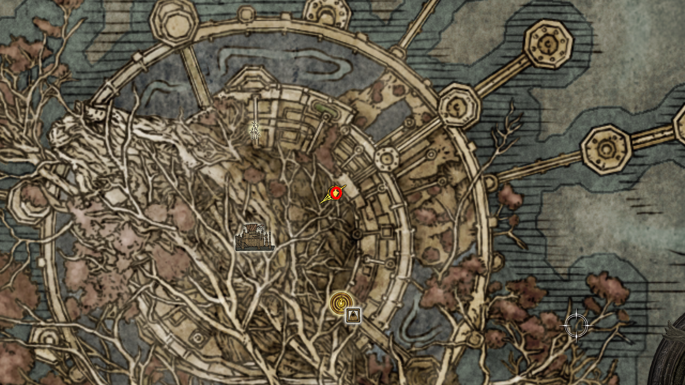
     
    <em>Figura 13: .</em>

---

## 🌿 10. Lanca e Espada de cristal apodrecida 
breve descricao , lore e o que pode aconter.

    ** Item Lanca e Espada de cristal apodrecida 
    ** Dica fica depois da graca interior da muralha elphael

    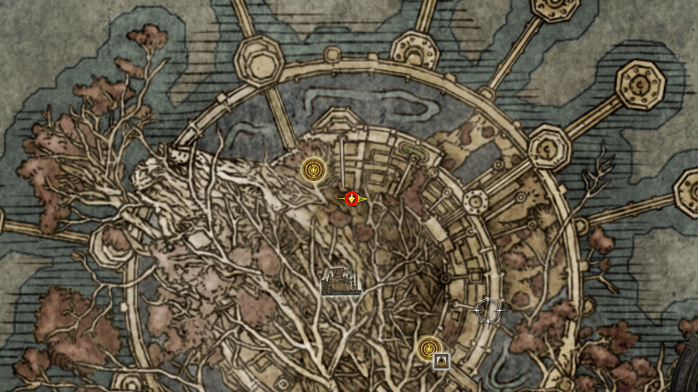
     
    <em>Figura 14: .</em>

---

## 🌿 11. Espada do cavalheiro de Mikella e cajado apodrecido da tervore menor que fica nas proximidades
breve descricao , lore e o que pode aconter.

    ** Item Espada do cavalheiro de Mikella e cajado apodrecido
    ** Dica fica proxima graca sala de oracoes subindo as escadas embaixo do sino

    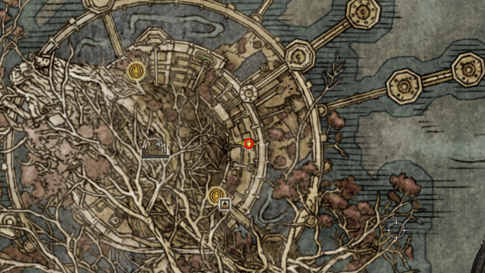
     
    <em>Figura 15: .</em>

---

## 👥 08. Invasão das Irmãs de Millicent
O teste final da linhagem de Gowry. Você deve escolher entre ajudar ou trair Millicent.

* **Localização:** Pântano de Podridão perto da graça **Canal de Escoamento**. Derrote o Espírito da Árvore Ulcerada primeiro.
* **Ação [RECOMENDADO]:** Use o sinal dourado para AJUDAR Millicent contra suas 4 irmãs.
* **Recompensa:** **Insignia de Espada Alada Podre** (Aumenta muito o dano de ataques sucessivos).
* Fale com Growry em Caelid 
* Fale com a Millicent ela vai estar caida no chao

    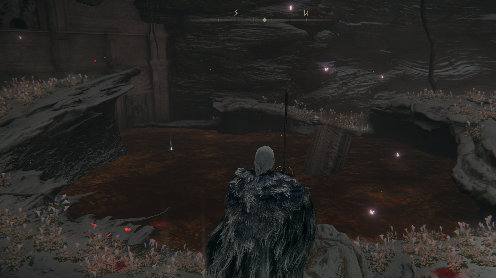
     
    <em>Figura 16: Sinais de invocação no pântano de podridão escarlate.</em>

---

## 🌿 09. Item da agulha de ouro no corpo da Millicent
breve descricao , lore e o que pode aconter.

    ** Item 
    ** Dica
    ** Voltar e derrotar o Growry que dara o talisma tela de bando e o seu sino

    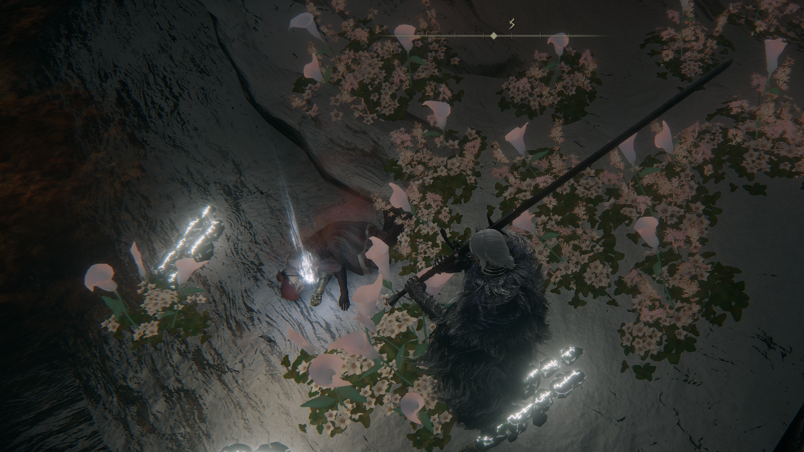
     
    <em>Figura 17: .</em>

---

## 🌿 10. Item talisma escudo grande com brasao de dragao(platina)
breve descricao , lore e o que pode aconter.

    ** Item tal
    ** Dica

    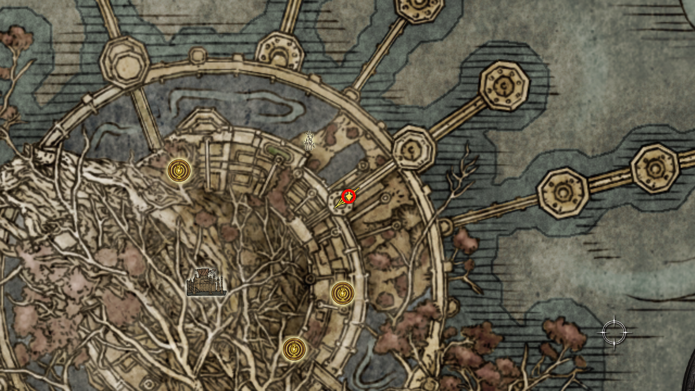
     
    <em>Figura 18: .</em>

---

## 🌿 11. Sino para lirio
breve descricao , lore e o que pode aconter.

    ** Item Sino para lirio
    ** Dica

    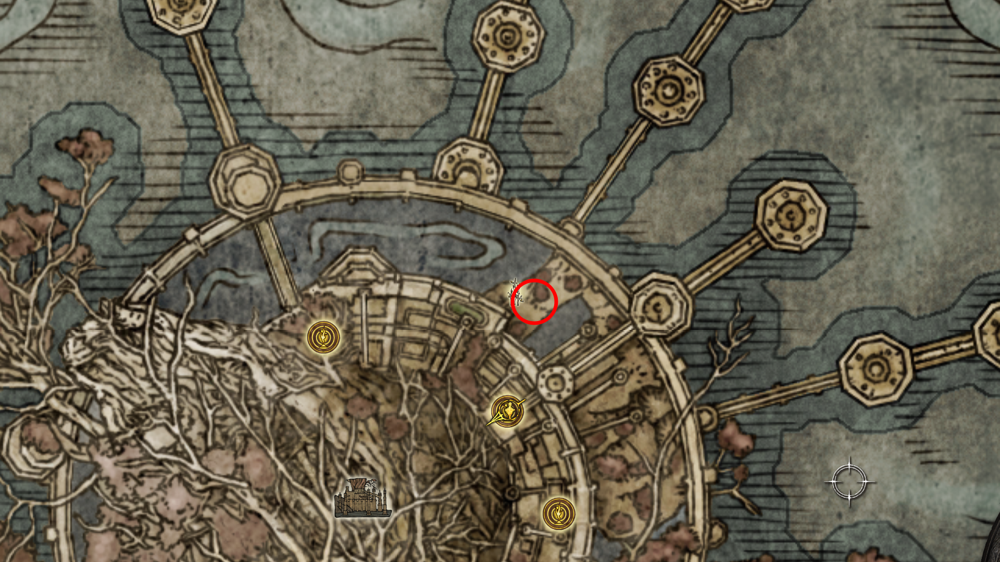
     
    <em>Figura 19: .</em>

---

## 🦋 12. Malenia, Espada de Miquella [🏆 PLATINA]
A batalha mais icônica e difícil de Elden Ring. Ela nunca conheceu a derrota.

* **Estratégia Fase 1:** Cuidado com o "Waterfowl Dance" (Dança das Aves Aquáticas). Quando ela pular, corra para longe e desvie dos últimos cortes.
* **Estratégia Fase 2:** Malenia torna-se a Deusa da Podridão. Esquive do mergulho inicial da flor e não ataque enquanto as pétalas estiverem vermelhas.
* **Recompensa:** Runa Maior de Malenia e Lembrança da Deusa da Podridão.

    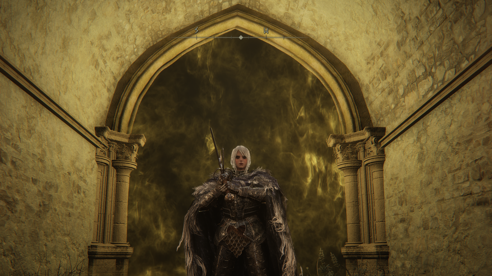
     
    <em>Figura 20: O confronto final no pé da Árvore Sacra.</em>

---

## 💉 13. A Agulha de Miquella e a Cura da Chama
Se você pegou a Chama Frenética (Etapa 13.02) mas quer fazer outro final, esta é sua única saída.

* **Ação:** Após derrotar Malenia, uma flor vermelha aparecerá na arena. Use a **Agulha de Millicent** (obtida no fim da quest dela) na flor.
* **Recompensa:** **Agulha de Miquella**.
* **Uso:** Vá para a arena do Placidusax em Farum Azula para usar a agulha e remover a Chama Frenética do seu personagem.

    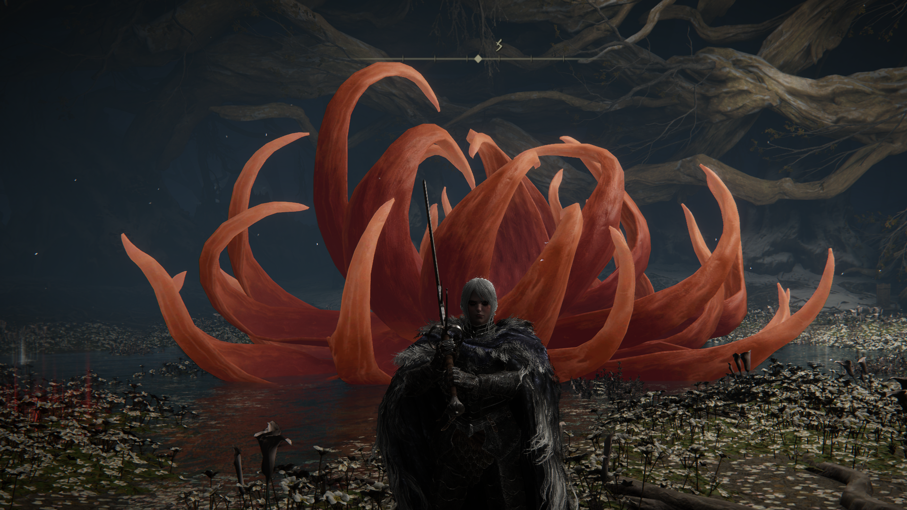
     
    <em>Figura : .</em>

---

## 14. final da quest do comedor de estrume(platina)

    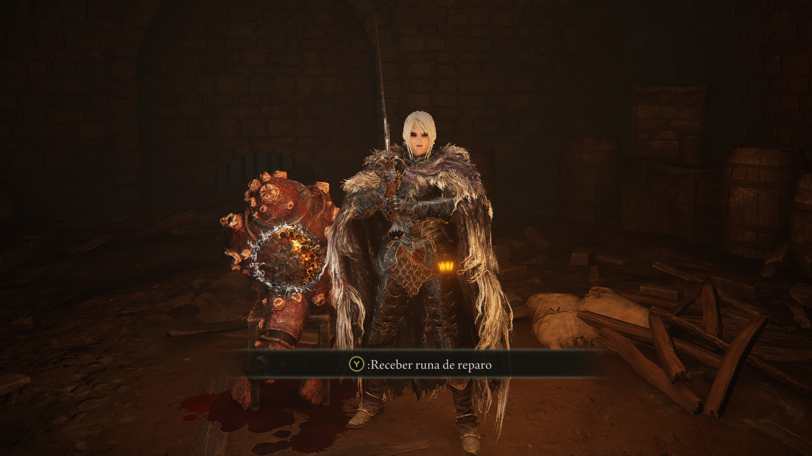
     
    <em>Figura 22: .</em>

---

## 15. Derrote o gigante de gelo

    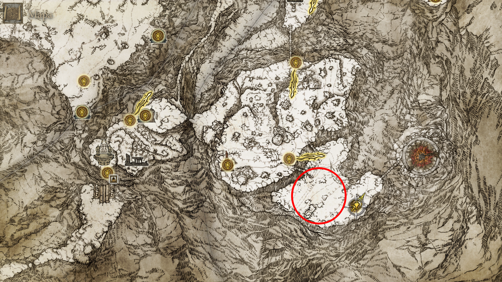
     
    <em>Figura 23: .</em>

---

## 16. Melina se sacrifica

    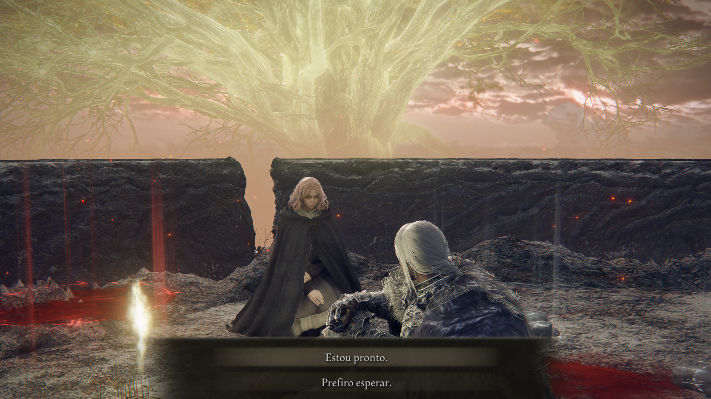
     
    <em>Figura 24: .</em>

---

[⬅️ Voltar para o README.md](README.md) | [Prosseguir para Farum Azula ➡️](../15_farum_azula/route.md)

