# 🌪️ 15. Farum Azula: Rota de Navegação

> **Foco:** Progressão pelas Ruínas, Sinos de Mineração e Duelos Lendários.
> **Checkpoint de Platina:** Certifique-se de ter a Lança de Gransax em mãos antes de prosseguir.

Farum Azula é um labirinto de pedras flutuantes onde o tempo não corre da mesma forma. A navegação exige cuidado com quedas e com os constantes ataques de Dragões e Homens-Fera de Azula.

---

## 🏺 Busca pelas Raízes da Morte (Quest de Gurranq)

> **Contexto:** Entregar as 9 raízes para o Clérigo Bestial no Santuário Bestial (Caelid) garante itens poderosos e altera a cena inicial do chefe Maliketh em Farum Azula.

---

## 01. Local 1: Limgrave (Vila das Águas Invocantes)
O início da corrupção. O Barqueiro de Tíbia navega em águas rasas evocando esqueletos.

* **Item:** Raiz da Morte e Cinzas do Esqueleto Miliciano.
* **Dica:** Use o Torrente para evitar os ataques de área do barco e foque no barqueiro.

    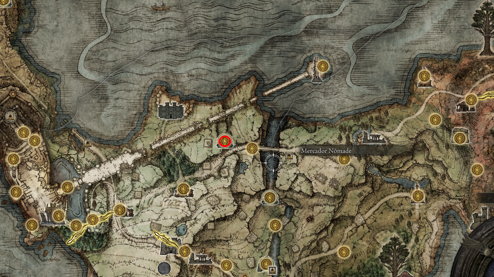
     
    <em>Figura 1: O primeiro encontro com o Barqueiro de Tíbia.</em>

---

## 02. Local 2: Liurnia (Próximo à Igreja dos Votos)
Outro Barqueiro de Tíbia assombra a região pantanosa ao sul da Igreja dos Votos (onde fica o Papa Tartaruga).

* **Item:** Raiz da Morte e Cinzas do Esqueleto Bandido.
* **Dica:** Cuidado com os esqueletos gigantes que surgem da água para socar o jogador.

    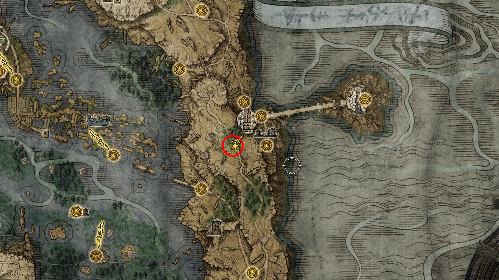
     
    <em>Figura 2: Barqueiro localizado nos lagos rasos de Liurnia.</em>

---

## 03. Local 3: Liurnia (Catacumbas das Facas Negras)
Escondida em um baú após o chefe principal da masmorra (Assassina da Faca Negra).

* **Item:** Raiz da Morte.
* **Dica:** Para chegar ao chefe, você precisa subir na armadilha de guilhotina que sobe e desce para acessar o andar superior.

    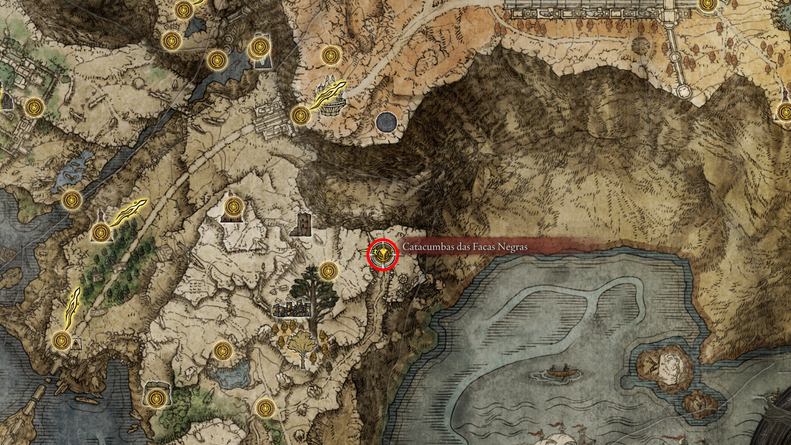
     
    <em>Figura 3: Baú de recompensa após o chefe das catacumbas.</em>

---

## 04. Local 4: Monte Gelmir (Túmulo do Herói de Gelmir)
Uma das masmorras mais irritantes devido às carruagens de lava.

* **Item:** Raiz da Morte.
* **Dica:** Derrote o Lobo Vermelho do Campeão no final da masmorra para abrir o baú.

    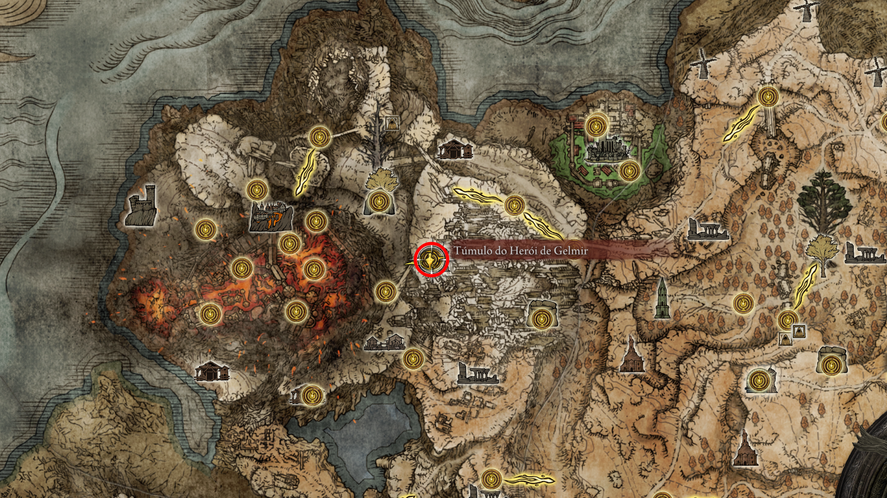
     
    <em>Figura 4: Recompensa no final da descida pela lava.</em>

---

## 05. Local 5: Ruínas de Wyndham (Monte Gelmir)
Nas colinas acima das ruínas, outro Barqueiro de Tíbia aguarda.

* **Item:** Raiz da Morte e Feitiço de Tíbia.
* **Dica:** Use o terreno elevado para se proteger dos ataques mágicos do barqueiro.

    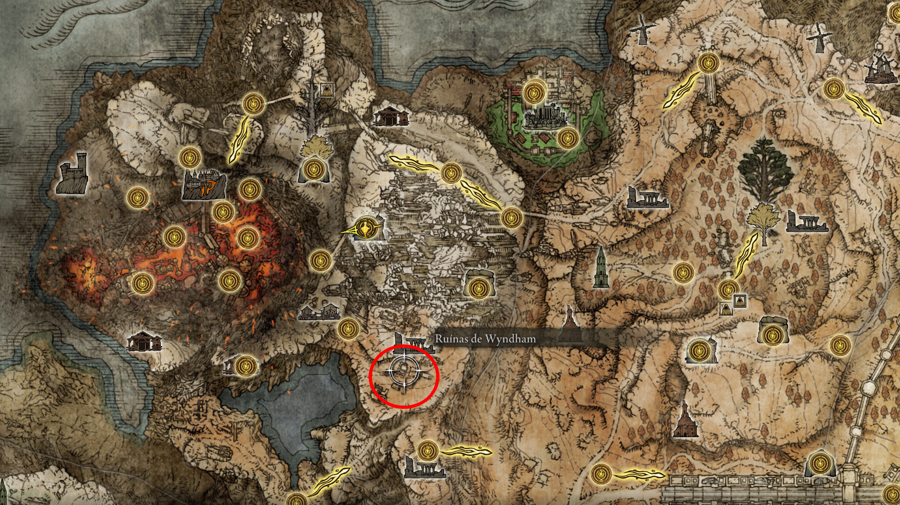
     
    <em>Figura 5: O Barqueiro localizado nas ruínas elevadas.</em>

---

## 06. Local 6: Caminho para a Árvore Sacra (Passagem Invisível)
Na masmorra "Caminho Oculto para a Árvore Sacra" (acessada pelo Elevador de Rold com o medalhão secreto).

* **Item:** Raiz da Morte.
* **Dica:** Existe um caminho com chão invisível. Jogue pedras de arco-íris ou observe as mensagens no chão para não cair. Derrote o Espírito da Árvore Ulcerada.

    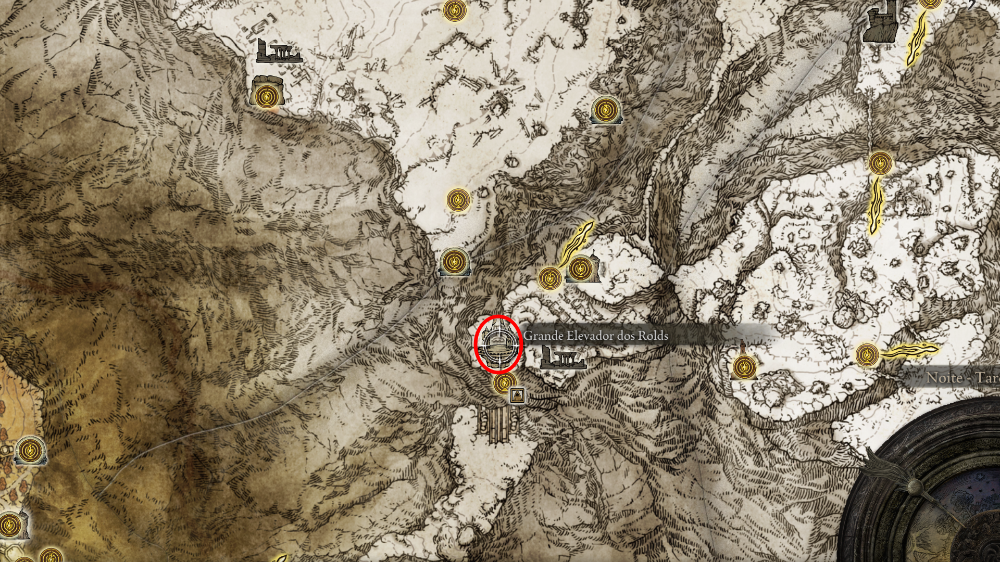
     
    <em>Figura 6: Localização secreta no caminho para o Campo de Neve Consagrado.</em>

---

## 07. Local 7: Catacumbas do Topo da Montanha
Localizada nos Picos dos Gigantes, perto do início da região.

* **Item:** Raiz da Morte.
* **Dica:** O chefe é um Espírito da Árvore Ulcerada. Mantenha-se colado ao corpo dele para evitar as explosões de fogo/luz.

    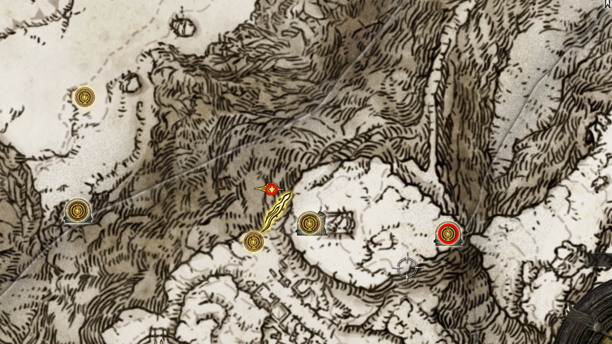
     
    <em>Figura 7: Baú final após o chefe das catacumbas geladas.</em>

---

## 08. Local 8: Campo de Neve Consagrado (Próximo ao Castelo Sol)
O último Barqueiro de Tíbia do jogo, localizado no vale congelado.

* **Item:** Raiz da Morte e Cajado de Tíbia.
* **Dica:** Ele invoca um esqueleto gigante que causa muito dano. Foque no barco e ignore os summons.

    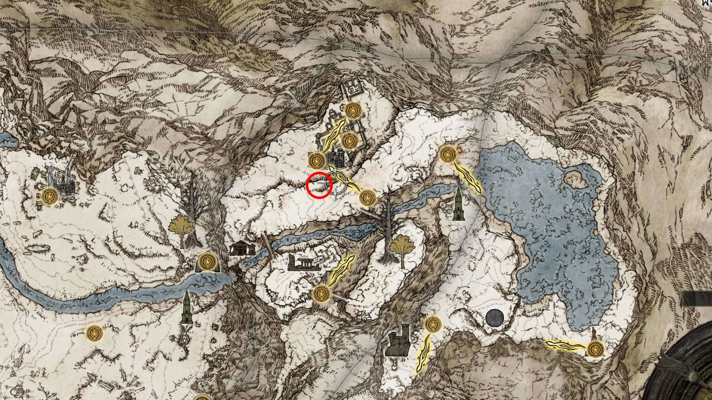
     
    <em>Figura 8: O último barqueiro antes da conclusão da quest.</em>

---

## 09. O Santuário Bestial: Início das Entregas
Gurranq é um NPC faminto por Raízes da Morte para tentar "curar" sua condição bestial.

* **Lore:** Gurranq é na verdade Maliketh, agindo como um penitente por ter deixado a Runa da Morte ser roubada.

    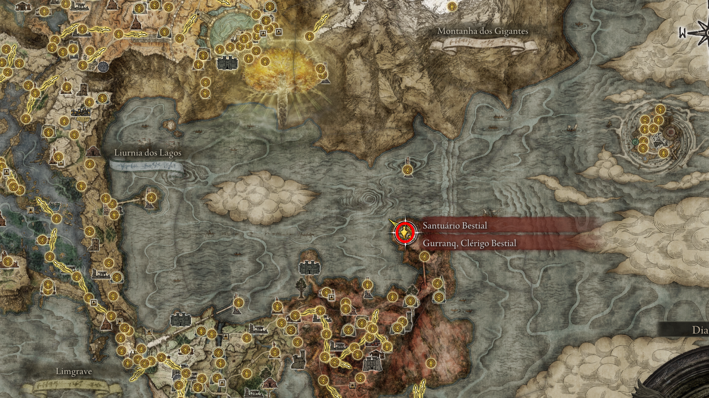
     
    <em>Figura 9: Encontro com o Clérigo Bestial em Caelid.</em>

---

## 10. Recompensas Iniciais
A cada raiz entregue, Gurranq concede poderes bestiais.

* **Item:** **Funda da Besta** (Pedregulhos rápidos), **Vitalidade Bestial** (Regeneração de HP) e Cinza de Guerra: **Rugido da Fera**.
* **Dica:** A Vitalidade Bestial é excelente para poupar frascos de vida durante a exploração.

    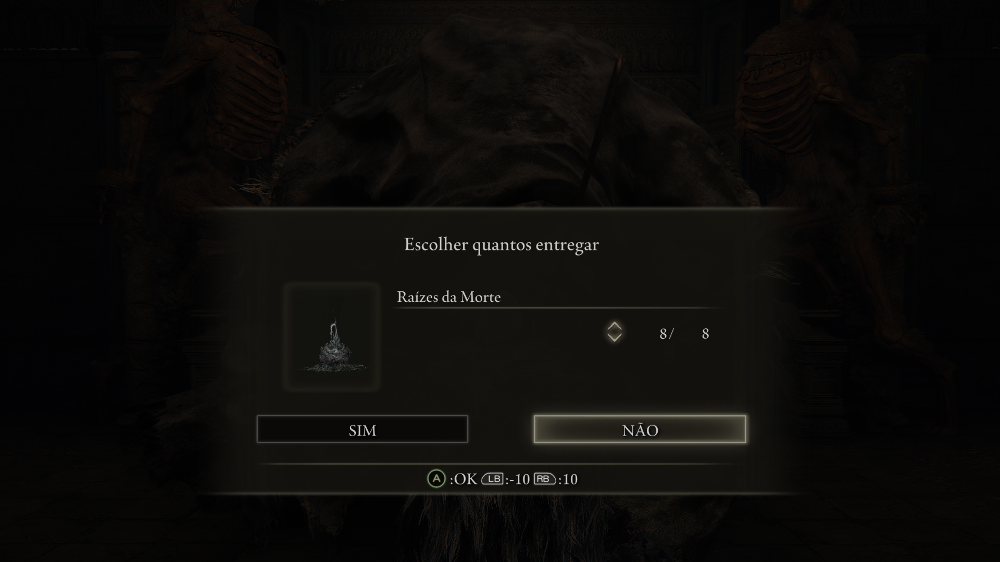
     
    <em>Figura 10: Primeiros encantamentos bestiais recebidos.</em>

---

## 11. O Surto de Fome (Luta Intermediária)
Após a 4ª raiz, Gurranq ficará agressivo e atacará o jogador assim que você entrar no santuário.

* **Ação:** Reduza o HP dele em cerca de 10-15%. Ele parará de atacar e pedirá desculpas.
* **Dica:** Não use summons muito fortes aqui para não matá-lo por acidente. Descanse na Graça após ele se render.

    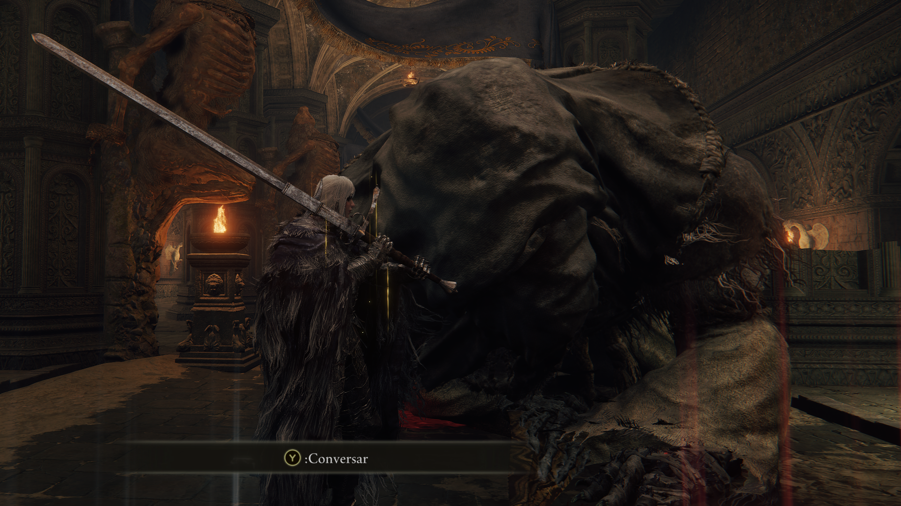
     
    <em>Figura 11: O momento em que o Clérigo perde o controle.</em>

---

## 12. Conclusão e Drops Finais
Entregando as últimas raízes (incluindo a 9ª).

* **Item:** **Garra de Fera de Gurranq**, **Grande Martelo de Garra**, **Pedra de Gurranq** e uma **Pedra de Forja de Dragão Ancião**.
* **Dica:** Se você entregar todas as 9 raízes, ele terá um diálogo especial de despedida e sumirá do santuário, deixando um presente final.

    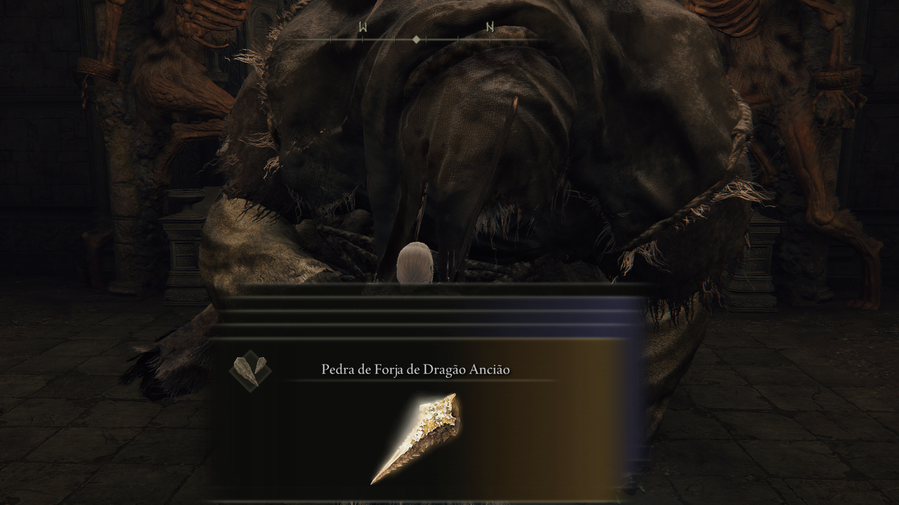
     
    <em>Figura 12: Recompensas lendárias e upgrade máximo de arma.</em>

---

## 13. O Guardião do Santuário (Gárgula Negra)
Ao sair do santuário, você enfrentará o Parente da Lâmina Negra que guarda a porta.

* **Item:** **Alabarda Negra da Gárgula** e **Lâmina Negra da Gárgula**.
* **Dica:** Ele é muito forte contra dano sagrado. Use dano físico ou fogo.

---

## 14. O Saber de Gideon Ofnir
Falar com o "Sabe-Tudo" na Mesa Redonda após suas descobertas.

* **Item:** Encantamentos como **Proteção da Térvore** e **Hálito de Luz**.
* **Dica:** Gideon recompensa o jogador com informações e magias baseadas nos semideuses que você derrotou ou localizou (Malenia, Miquella, Mohg).

    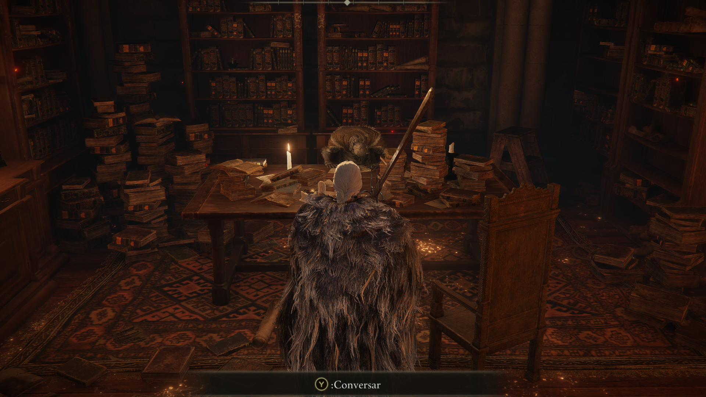
     
    <em>Figura 13: Reportando as descobertas ao líder da Távola Redonda.</em>

---

## 🐉 15. Dragão de Farum Azula (Início)
Logo na chegada à cidade desmoronante, um dragão pousa na ponte curva para te testar.

* **Item:** Pedra de Forja de Dragão Ancião (se derrotado).
* **Dica:** Você pode passar correndo por baixo dele se não quiser lutar agora, mas ele dropa o material de upgrade máximo.

    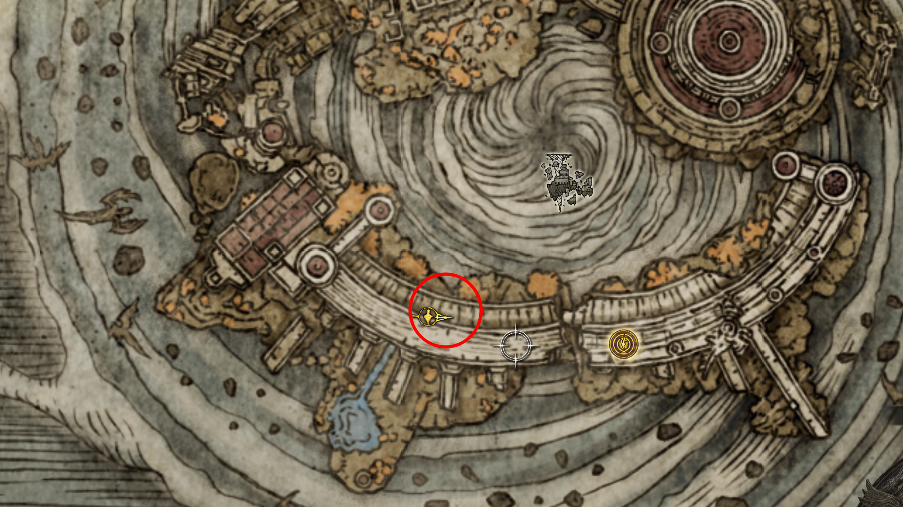
     
    <em>Figura 14: O guardião da primeira ponte de Farum Azula.</em>

---

## 📖 16. Livro de Oração do Dragão Ancião
Contém encantamentos de raio vermelho extremamente poderosos, herança dos dragões.

* **Item:** **Livro de Oração do Dragão Ancião** (Entregue ao Corhyn ou Miriel).
* **Dica:** Fica em um corpo no centro de uma sala circular logo após a primeira Graça "Falésias da Tempestade".

    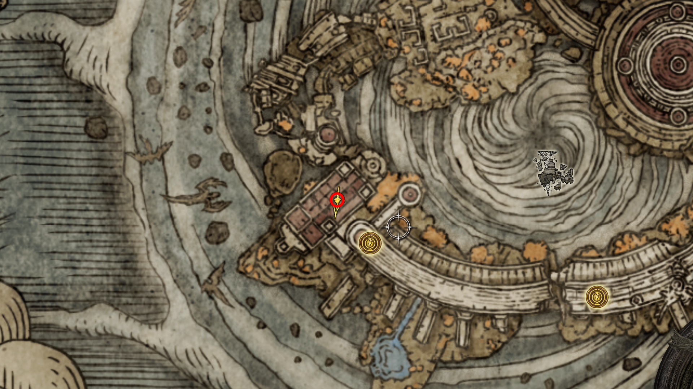
     
    <em>Figura 15: Conhecimento sagrado dos dragões antigos.</em>

---

## 🔔 17. Sino de Minerador de Pedra Sombria [4]
Libera a compra infinita de Pedras Sombrias 7 e 8 nas Gêmeas Idosas.

* **Item:** **Sino de Minerador de Pedra Sombria [4]**.
* **Dica:** Encontrado em um corpo caído em um pequeno coreto perto da Graça "Templo do Dragão".

    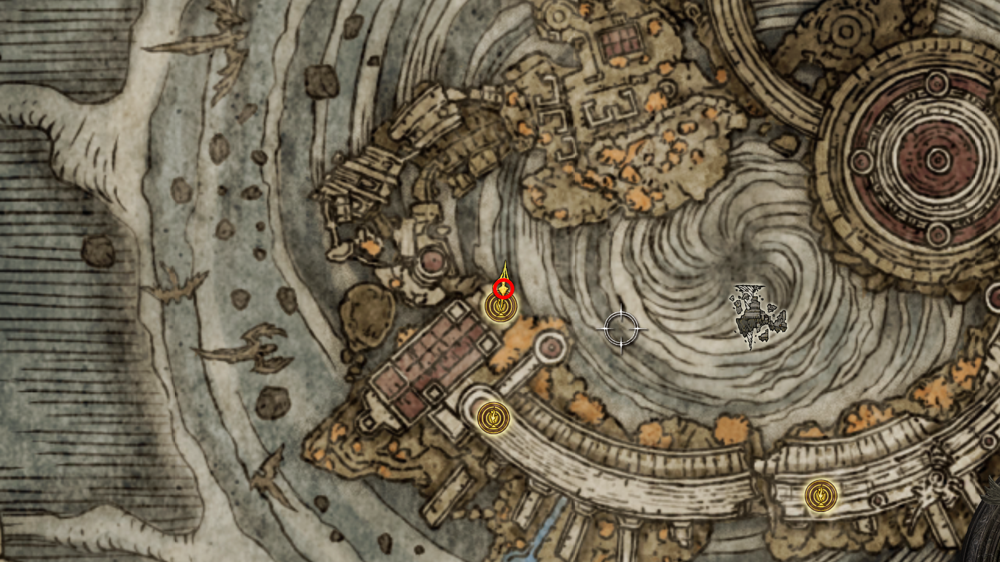
     
    <em>Figura 16: Upgrade essencial para armas especiais (+8).</em>

---

## 🌸 18. Sino de Catador de Lírio do Vale [3]
Permite comprar flores fantasmas para upar cinzas de invocação até o nível +9.

* **Item:** **Sino de Catador de Lírio do Vale [3]**.
* **Dica:** Suba pelo elevador próximo à área do Alexander e procure em um gazebo guardado por Homens-Fera.

    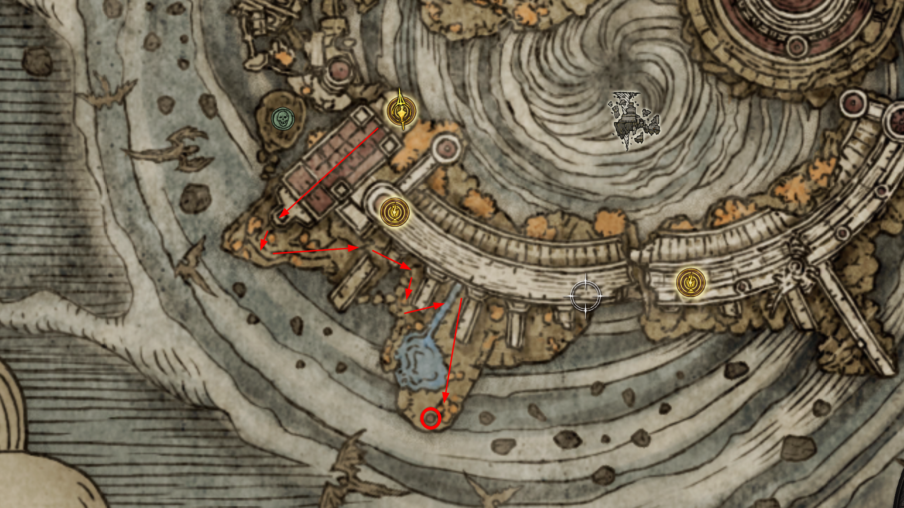
     
    <em>Figura 17: Item para fortalecer suas invocações ao máximo.</em>

---

## ⚔️ 19. Dupla da Pele Divina (Godskin Duo)
Um dos chefes obrigatórios mais difíceis do jogo. Eles compartilham a mesma barra de vida geral.

* **Item:** **Sino de Minerador de Pedra de Forja [4]** e Cinza de Guerra: **Tornado de Chama Negra**.
* **Dica:** Use o Cavaleiro Bernahl como invocação (o sinal dourado fica fora da névoa) e abuse de potes de sono para apagar um deles enquanto foca no outro.

    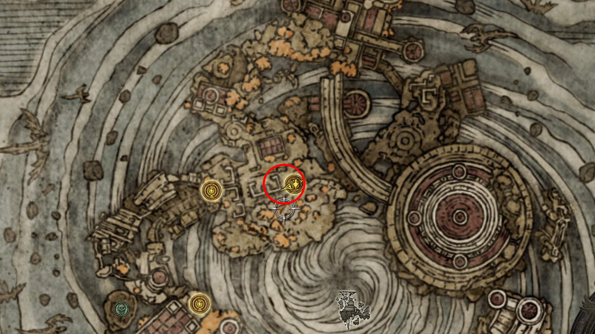
     
    <em>Figura 18: O duelo contra os apóstolos no Templo do Dragão.</em>

---

## 🏺 20. O Fim da Quest de Alexander
O guerreiro jarro chegou ao seu destino final e quer um último duelo honrado contra um verdadeiro campeão.

* **Item:** **Fragmento de Alexander** (Aumenta muito o dano da habilidade da arma) e Entranhas de Alexander.
* **Dica:** Ele estará em uma plataforma de pedra flutuante elevada após passar pelo Templo do Dragão.

    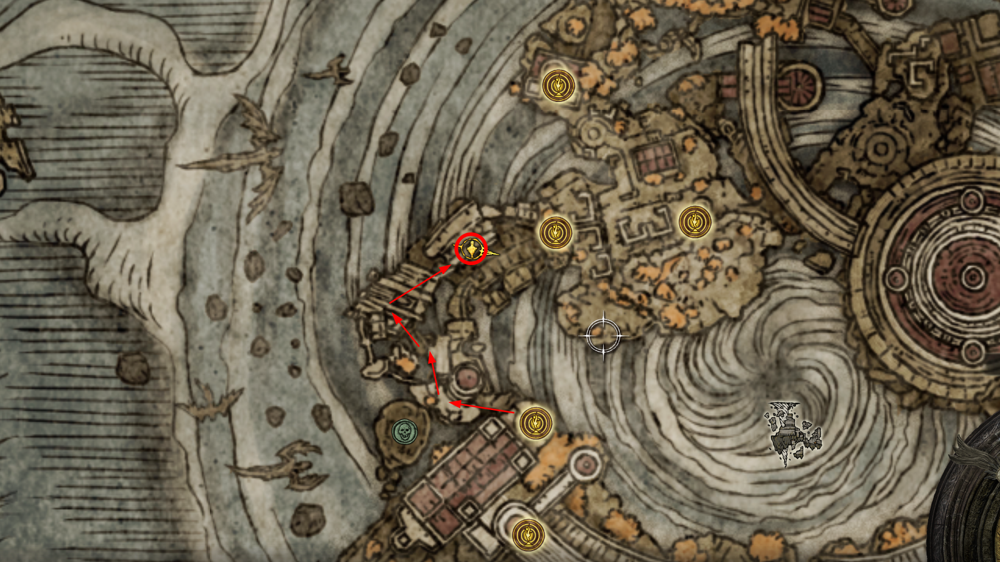
     
    <em>Figura 19: O adeus digno ao maior guerreiro jarro de todos.</em>

---

## 📜 21. Livro de Receitas do Apóstolo do Dragão Ancião [4]
Permite criar potes de raio do dragão antigo e graxas elétricas.

* **Item:** **Livro de Receitas [4]**.
* **Dica:** Localizado em uma torre logo atrás do local onde o duelo com Alexander acontece.

    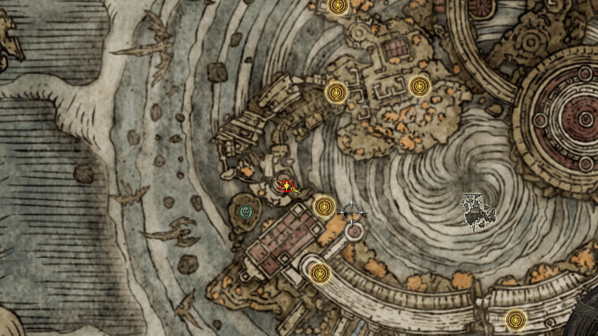
     
    <em>Figura 20: Expansão de itens de arremesso elétricos.</em>

---

## 🛡️ 22. Talismã de Escudo de Brasão de Dragão +2
Aumenta massivamente a defesa física do personagem.

* **Item:** **Talismã de Escudo de Brasão de Dragão +2**.
* **Dica:** Pule cuidadosamente nos escombros flutuantes perto da Graça "Telhado do Templo do Dragão".

    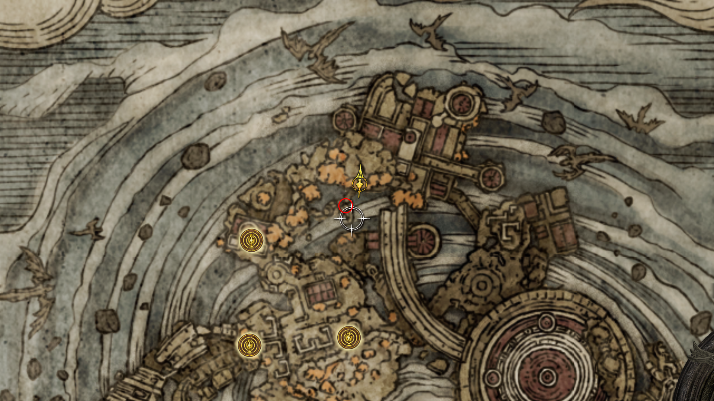
     
    <em>Figura 21: Proteção física de alto nível para o end-game.</em>

---

## 🔔 23. Sino de Minerador de Pedra Sombria [5]
O último sino de pedra sombria do jogo. Libera a compra da Pedra Sombria [9].

* **Item:** **Sino de Minerador de Pedra Sombria [5]**.
* **Dica:** Fica em um corpo em um altar dentro de uma capela, pouco antes da ponte principal que leva ao Maliketh.

    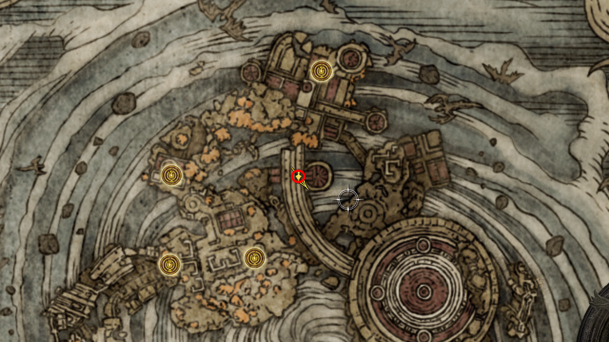
     
    <em>Figura 22: O passo final para colocar armas no +9 infinitamente.</em>

---

## 🔴 24. Invasão de Bernahl [🏆 PLATINA]
O Recusante Bernahl te invade se você concluiu a quest da Mansão Vulcânica.

* **Item:** **Cetro do Devorador** (Arma Lendária) e **Garra Blasfema**.
* **Dica:** A Garra Blasfema é um item vital que pode ser colocado na barra de atalho para aparar (parry) os ataques de aura dourada do Maliketh.

    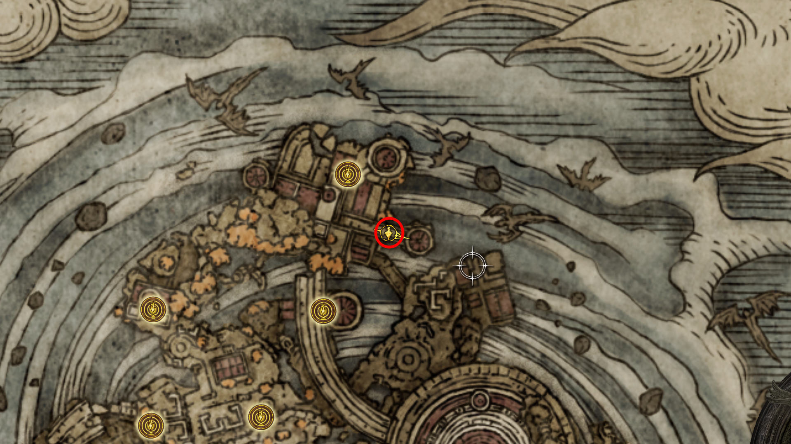
     
    <em>Figura 23: O confronto final contra o mestre das Cinzas de Guerra.</em>

---

## ⏳ 25. Talismã do Velho Lorde [🏆 PLATINA]
Aumenta a duração de todos os feitiços e encantamentos aplicados.

* **Item:** **Talismã do Velho Lorde**.
* **Dica:** Fica em um baú dentro da torre guardada por Homens-Fera, na mesma rota sem saída onde Bernahl invade o seu mundo.

    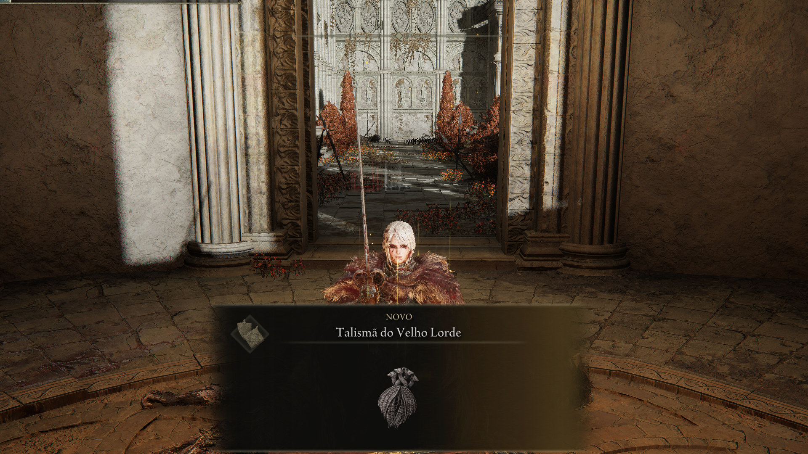
     
    <em>Figura 24: Item lendário necessário para o troféu de colecionador.</em>

---

## 🪖 26. Set do Cavaleiro Draco
Uma armadura com visual único, escamas incrustadas e boa resistência elemental.

* **Item:** **Conjunto de Armadura do Cavaleiro Draco**.
* **Dica:** Escondido em um baú na parte externa do templo. Para chegar lá, você deve descer por escombros flutuantes a partir do elevador do Templo do Dragão.

    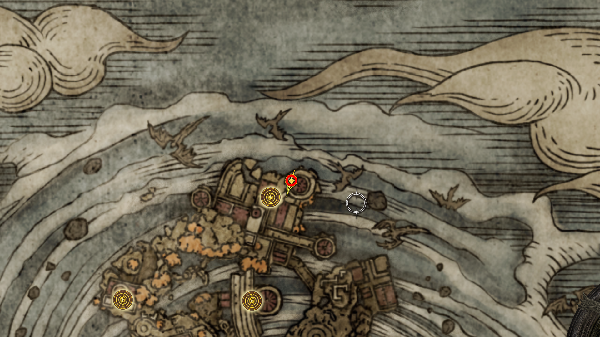
     
    <em>Figura 25: Visual imponente usado pelos antigos caçadores de dragões.</em>

---

## 🛡️ 27. Escudo Torre de Dragão
Um escudo colossal que oferece excelente guarda e estabilidade contra ataques físicos pesados.

* **Item:** **Escudo Torre de Dragão**.
* **Dica:** Localizado em um baú no meio dos escombros de pilares caídos na área inferior de Farum Azula.

    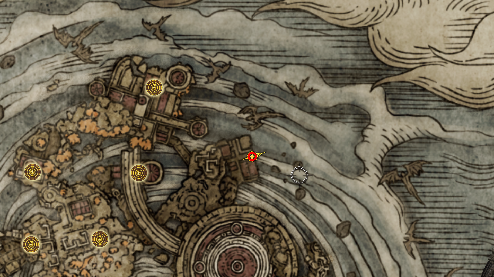
     
    <em>Figura 26: Escudo massivo, ideal para builds de Força Pura.</em>

---

## ⚡ 28. Talismã de Draco Elétrico +2
O melhor talismã defensivo para resistir a danos de raio (extremamente útil para a luta secreta desta área).

* **Item:** **Talismã de Draco Elétrico +2**.
* **Dica:** Fica pendurado em uma plataforma perigosa acessada ao pular por telhados próximos ao Elevador do Templo do Dragão.

    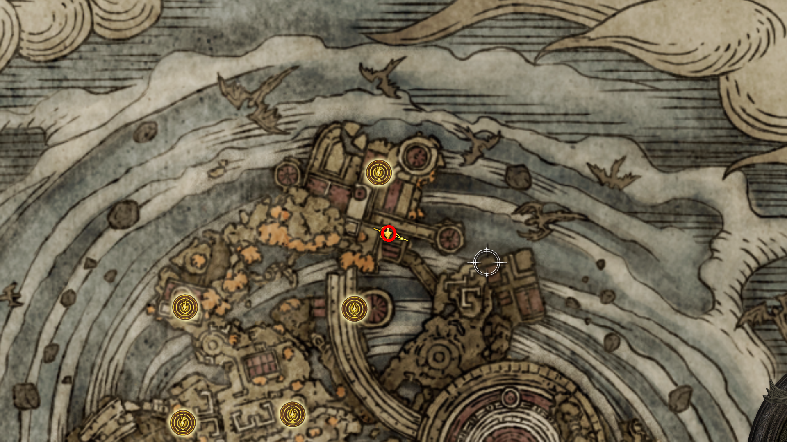
     
    <em>Figura 27: Defesa essencial para sobreviver aos raios da tempestade.</em>

---

## 🏺 29. Quest em Jarrosburgo (Localização)
Uma vila secreta e pacífica habitada por jarros vivos (guerreiros em treinamento). 

* **Item:** Vários materiais de criação (Ramo de Sorveira, Flores, etc).
* **Dica:** Fica em Liurnia. Para acessar, vá até a "Sala de Estudos Carianos" e siga para o sul pela beirada do penhasco. Olhe para baixo e desça cuidadosamente usando as lápides gigantes presas na parede da montanha.

    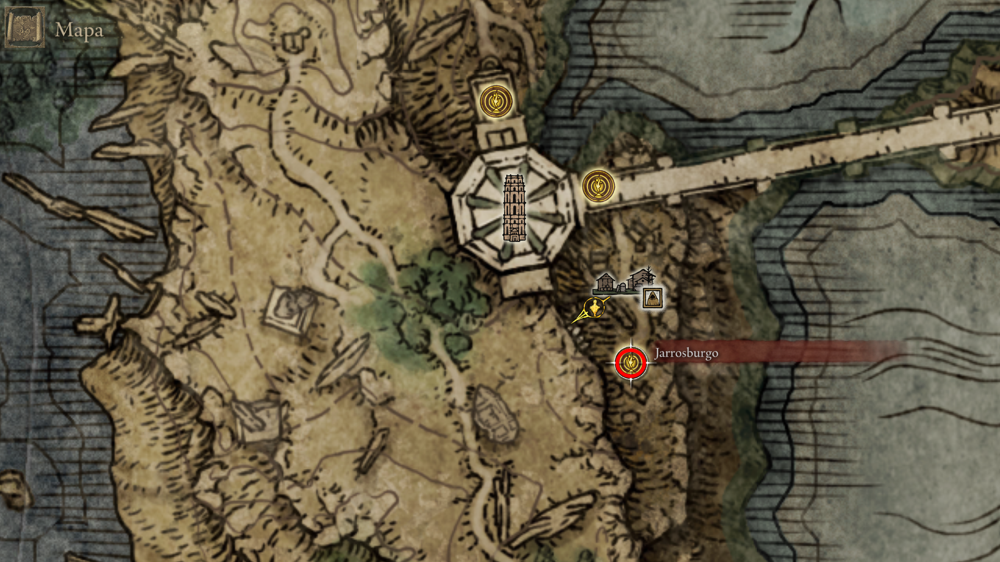
     
    <em>Figura 28: A descida pelas lápides para acessar a vila secreta.</em>

---

## 🍯 30. Jarrosburgo: Conhecendo o Jarrinho (Jar Bairn)
O Jarrinho é o sobrinho de Alexander e sonha em ser um guerreiro.

* **Item:** Nenhum neste momento.
* **Dica:** Ele está sentado nos degraus de uma cabana. Ele perguntará se você quer ser o "Potentado" (líder da vila). Diga que sim, mas ele recusará dizendo que suas mãos "não são lisas o suficiente".

    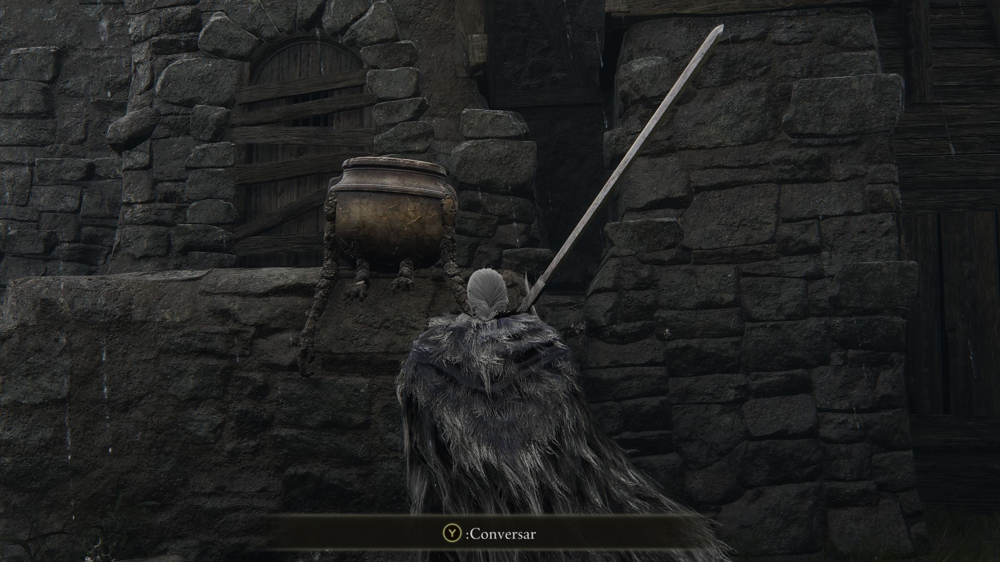
     
    <em>Figura 29: O pequeno Jarrinho sentado nos degraus de sua casa.</em>

---

## 🗣️ 31. Jarrosburgo: A chegada do novo Potentado
Avance a quest recarregando a área na Graça e conversando com o Jarrinho várias vezes.

* **Item:** Nenhum.
* **Dica:** Faça isso até que ele mencione que um "novo Potentado" chegou à vila. *Nota: A quest de Diallos na Mansão Vulcânica precisa estar concluída (ou a Mansão desfeita) para que ele venha para cá.*

    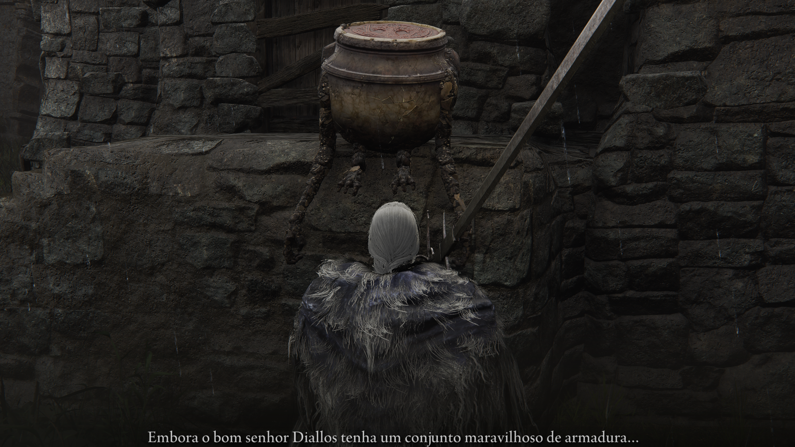
     
    <em>Figura 30: Esgotando as opções de diálogo com o Jarrinho.</em>

---

## 🛡️ 32. Jarrosburgo: Diallos cuidando dos Jarros
Diallos Hoslow finalmente encontrou um lugar onde se sente útil e em paz, cuidando dos pequenos jarros.

* **Item:** Nenhum.
* **Dica:** Encontre Diallos no centro da vila, curvado trabalhando com os jarros. Converse com ele; ele dirá que é um tolo, mas que finalmente sente que está fazendo algo bom.

    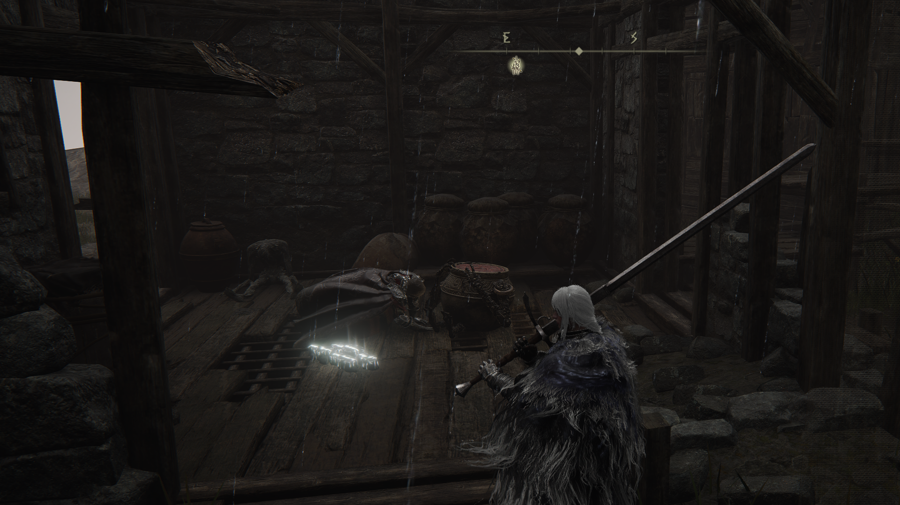
     
    <em>Figura 31: Diallos Hoslow trabalhando pacificamente na vila.</em>

---

## 🔥 33. Jarrosburgo: O Ataque dos Caçadores
Avance o tempo e recarregue a área algumas vezes. Eventualmente, você notará que a vila foi atacada e destruída por Caçadores de Jarros.

* **Item:** Nenhum.
* **Dica:** O Jarrinho não estará mais nos degraus. Ele estará no chão, ferido, mas vivo. Fale com ele para entender o que aconteceu.

    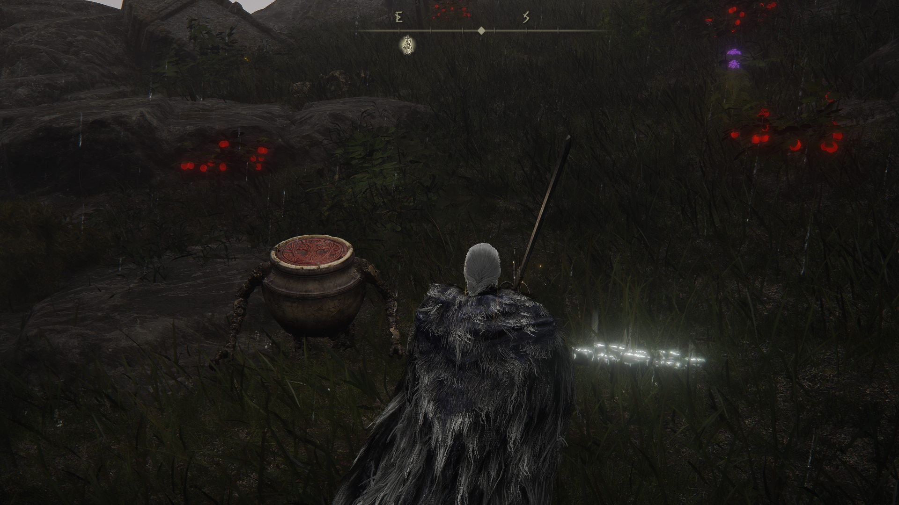
     
    <em>Figura 32: As consequências do ataque dos caçadores à vila pacífica.</em>

---

## 🩸 34. Jarrosburgo: O Sacrifício de Diallos
Diallos lutou bravamente para proteger a vila, mas sofreu ferimentos letais no processo.

* **Item:** Nenhum.
* **Dica:** Vá até Diallos caído no centro da vila. Ele perguntará, com seu último suspiro, se ele conseguiu defender os jarros. Responda **"Você os defendeu"** para que ele morra em paz como o herói que sempre quis ser.

    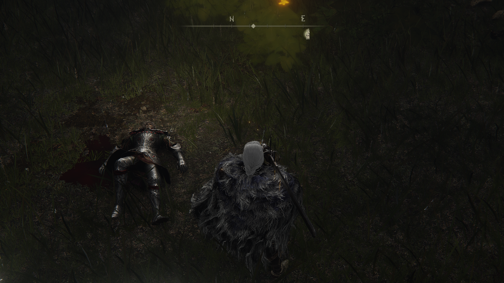
     
    <em>Figura 33: As últimas palavras do homem que encontrou sua coragem.</em>

---

## 🏺 35. Jarrosburgo: O Luto do Jarrinho
Recarregue a área novamente na Graça e retorne ao local onde Diallos estava.

* **Item:** Nenhum.
* **Dica:** O Jarrinho estará ao lado do corpo de Diallos, absorvendo seus restos mortais para carregar a força do Potentado consigo. Fale com ele.

    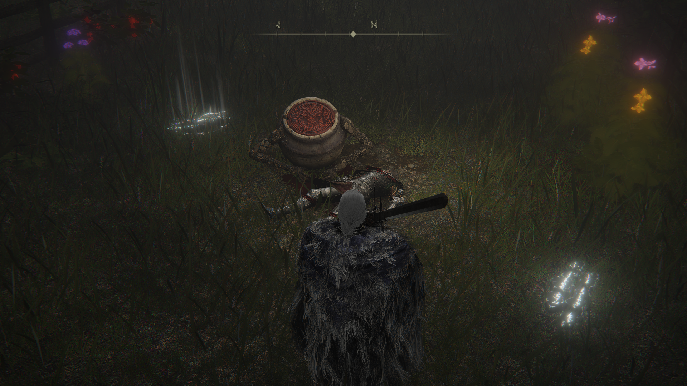
     
    <em>Figura 34: O rito de passagem dos guerreiros jarro.</em>

---

## ⚔️ 36. Jarrosburgo: O Legado de Alexander
Recarregue a área. O Jarrinho voltará aos degraus originais. É a hora de concluir a jornada dele.

* **Item (Entrega):** Entregue as **Entranhas de Alexander** (obtidas ao derrotar Alexander em Farum Azula).
* **Dica:** Ao receber as entranhas do tio, o Jarrinho ganha a coragem definitiva para partir de Jarrosburgo e se tornar um verdadeiro guerreiro.

    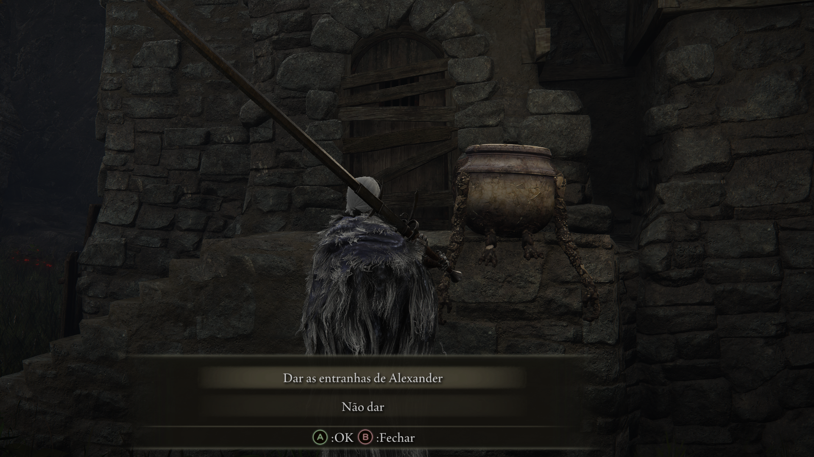
     
    <em>Figura 35: Passando a tocha (e as entranhas) para a nova geração.</em>

---

## 🎁 37. Jarrosburgo: O Saque de Diallos
Onde o corpo de Diallos repousava, agora ficam seus equipamentos.

* **Item:** **Máscara de Diallos**, **Chicote de Pétalas de Hoslow** e uma **Runa de Numen**.
* **Dica:** Ter um segundo Chicote de Pétalas de Hoslow é excelente para builds de sangramento usando *Power Stance* (empunhadura dupla).

    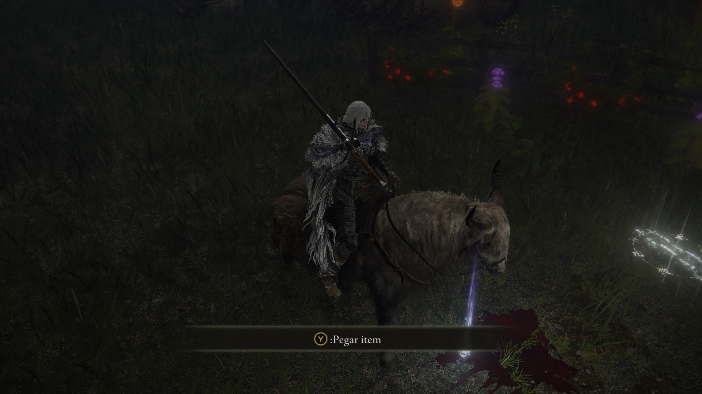
     
    <em>Figura 36: A armadura e a arma deixadas pelo herói da vila.</em>

---

## ✨ 38. Jarrosburgo: A Despedida (Talismã Lendário)
Recarregue a área uma última vez. O Jarrinho terá partido para sua jornada, deixando um último presente para você.

* **Item:** **Talismã do Jarro Companheiro** (Companion Jar).
* **Dica:** Fica no chão onde ele costumava sentar. Este talismã aumenta o dano de todos os potes/frascos arremessáveis em 20%. Fim emocionante da questline.

    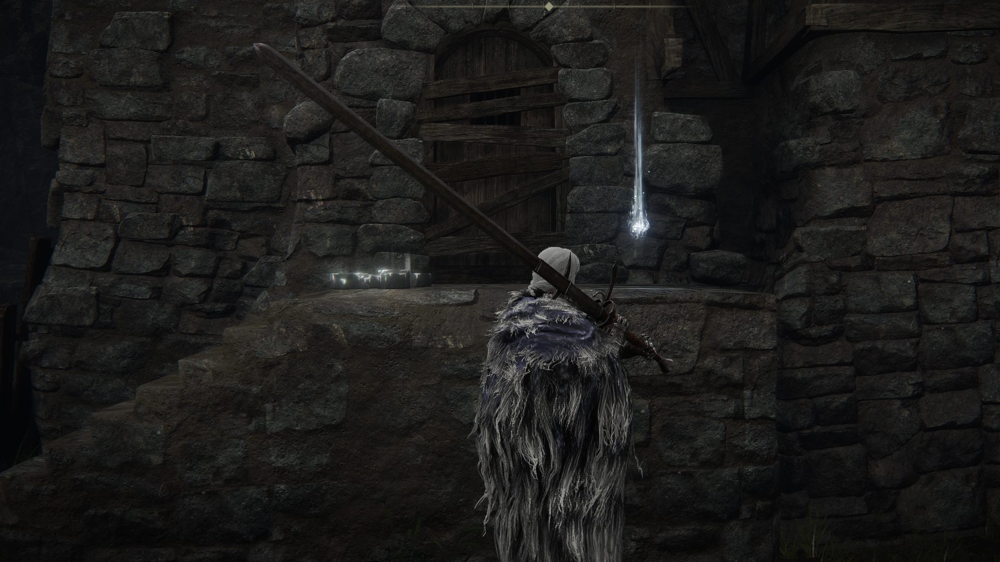
     
    <em>Figura 37: A recompensa final pela ajuda prestada em Jarrosburgo.</em>

---

## ⏳ 39. Caminho para o Lorde Dragão Placidusax
O acesso ao chefe secreto não é feito por portas de névoa convencionais, mas sim voltando no tempo.

* **Localização:** Partindo da Graça "Lateral da Grande Ponte" (antes do Maliketh), desça pelo elevador. Saia do templo e vá para a beira do penhasco em frente, olhando para baixo. Pule cuidadosamente pelos escombros flutuantes.
* **Dica:** Desça até a plataforma final flutuando no tornado. Aproxime-se do nicho vazio no chão, sem esqueleto, e escolha a opção "Deitar-se". A cutscene o levará de volta no tempo.

    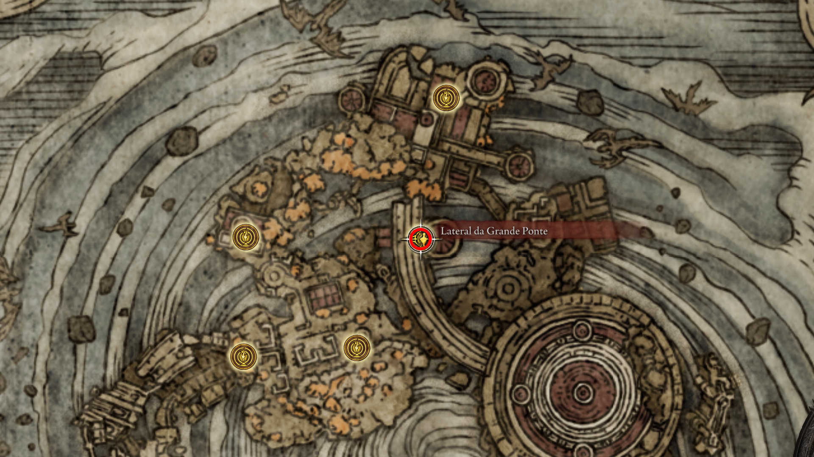
     
    <em>Figura 38: Deitando-se no epicentro da tempestade atemporal.</em>

---

## 🐉 40. Lorde Dragão Placidusax [🏆 PLATINA]
O chefe secreto de Farum Azula. Um antigo Lorde de duas cabeças que aguarda no epicentro da tempestade, isolado do tempo.

* **Item:** **Lembrança do Lorde Dragão**.
* **Dica de Lore/Mecânica:** Este é o **único lugar do jogo** onde você pode usar a "Agulha de Miquella" (concluindo a quest da Millicent) para curar a Chama Frenética do seu corpo, caso queira evitar o final caótico. Na Fase 2, quando ele desaparecer no ar, trave a câmera (lock-on) rapidamente no céu para desviar de seu rasante sônico.

    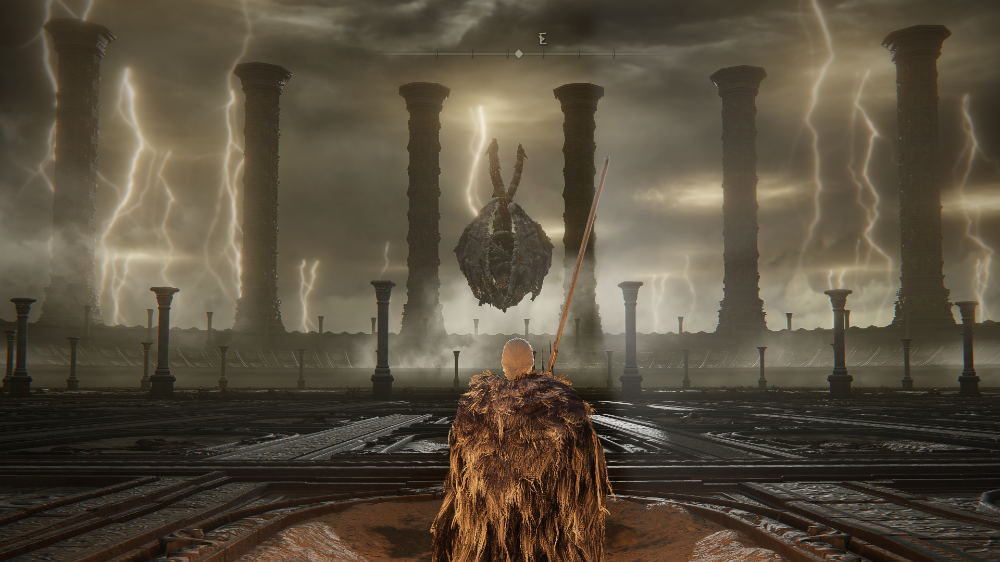
     
    <em>Figura 39: O confronto atemporal contra o lorde dragão original.</em>

    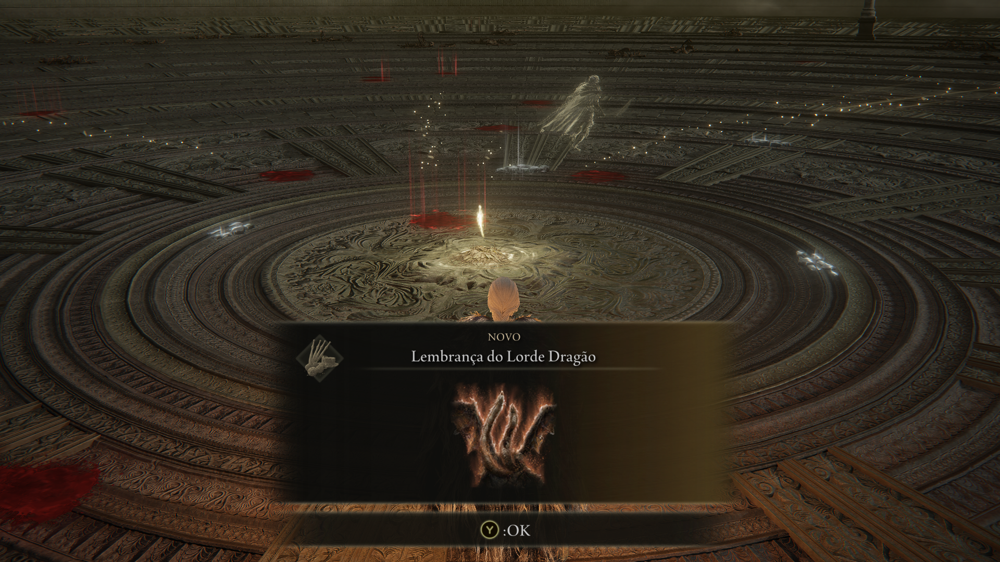
     
    <em>Figura 40: A lembrança do lorde dragão derrotado.</em>

---

## 🛡️ 41. Sentinela da Árvore Dracônico (Ponte Final)
Guardião implacável posicionado logo antes da porta de névoa do chefe Maliketh.

* **Item:** **Conjunto de Armadura do Dragão Malformado** (Set completo).
* **Dica:** Diferente dos outros, este Sentinela **não respawna** após ser morto. Ele lança relâmpagos mortais e tem muito HP. Use o pilar na rampa para se defender dos projéteis de fogo dele. Se achar muito difícil, você pode passar correndo diretamente para a névoa do Maliketh.

    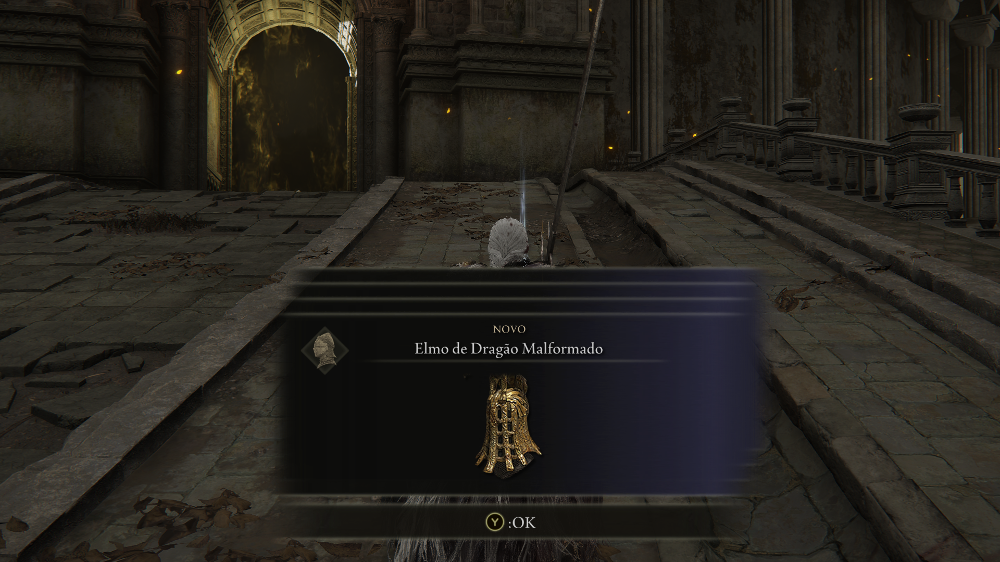
     
    <em>Figura 41: O último obstáculo antes do embate contra a Morte.</em>

---

## 🛑 AVISO GERAL: O PONTO DE NÃO RETORNO (Capital das Cinzas)
**ATENÇÃO:** Entrar na arena e derrotar Maliketh causará um evento irreversível na história. A Térvore queimará por completo e Leyndell será soterrada em cinzas. Todos os itens e inimigos da versão original da capital desaparecerão para sempre nesta jornada.

Antes de prosseguir, verifique se você já coletou/concluiu o seguinte em Leyndell:

### ⚔️ Armas e Ferramentas Perdíveis
- [ ] **Lança de Gransax [🏆 PLATINA]:** Arma Lendária. Fica escalando a lança de ouro gigante no centro de Leyndell. **Se não pegar agora, perde a platina nesta run!**
- [ ] **Lâmina de Amolar Santificada:** Permite colocar afinidade Sagrada e de Raio nas armas. Encontrada na Mansão Fortificada (cópia da Mesa Redonda em Leyndell).
- [ ] **Selo de Cascalho:** O melhor selo para encantamentos de Dragão. Dropa do Cavaleiro de Leyndell com lança, do lado de fora da Mansão Fortificada.
- [ ] **Arco Negro:** Excelente arco para aplicar status. Encontrado nos telhados de Leyndell.
- [ ] **Punhos de Estrela (Star Fist):** Arma de punho (excelente para builds de sangramento/postura). Fica perto do Coliseu de Leyndell.

### 🪖 Sets de Armadura Perdíveis
- [ ] **Set de Lionel e Vestido de Leito de Morte:** Encontrados na cama no prédio da Igreja da Capital Inferior.
- [ ] **Set de Alberich:** O set de mago vermelho, encontrado no salão principal da Mansão Fortificada.
- [ ] **Set de Duelista (Farm):** Os gladiadores com capa vermelha perto do Coliseu sumirão. Se quiser a armadura e machados deles, farme agora.

### 📜 Quests que Falham ou Travam
- [ ] **A Máscara de Ouro / Irmão Corhyn:** Você DEVE ter resolvido o puzzle da estátua (usando a magia "Lei da Regressão" para revelar que Radagon é Marika) e contado a eles. Se não fizer isso, não conseguirá a Runa de Reparo da Ordem Perfeita.
- [ ] **Comedor de Estrume (Maldição do Alfobre):** Existem 2 Maldições do Alfobre em Leyndell (uma na Mansão Fortificada, outra em uma sala perto da Graça da Muralha Oriental). Pegue-as para não faltar na quest dele.
- [ ] **Nepheli Loux, Kenneth Haight e Gostoc:** Certifique-se de que a quest deles avançou e eles se mudaram para a sala do trono de Godrick, em Limgrave. Se Gostoc morrer na capital em chamas, você perde a chance de comprar a Pedra de Forja de Dragão Ancião que ele vende no final da quest.

### 🏺 Recipientes de Criação Perdíveis (Crafting)
Atenção especial caso você utilize itens arremessáveis e perfumes, pois Leyndell possui 3 recipientes que desaparecem após a queima da Térvore:
- [ ] **Pote Rachado (1x):** Guardado por um Cavaleiro de Leyndell na área inferior perto da Sacada na Avenida.
- [ ] **Frascos de Perfume (2x):** Um escondido em um baú na torre perto do elevador da Muralha Oriental, e o outro no chão guardado por um Bastardo Leonino em um beco sem saída da cidade baixa.

---

## 🐺 42. Maliketh, a Lâmina Negra [🏆 PLATINA]
A sombra emial de Marika e o guardião da Runa da Morte. A conclusão desta luta muda o mundo permanentemente.

* **Estratégia:** A Fase 1 (Clérigo Bestial) é focada em ataques rápidos e projéteis. A Fase 2 (Maliketh) causa dano que reduz o HP máximo. Use a Garra Blasfema nos ataques onde a espada dele brilha em dourado para criar aberturas.
* **Atenção:** Derrotar Maliketh queima a Térvore e transforma Leyndell na Capital das Cinzas. Todas as quests não finalizadas lá serão perdidas.

    
     
    <em>Figura 42: Libertando o Destino da Morte nas Terras Intermédias.</em>

---

[⬅️ Voltar para o README.md](README.md) | [Prosseguir para Leyndell, Capital das Cinzasa ➡️](../16_ashen_capital/route.md)