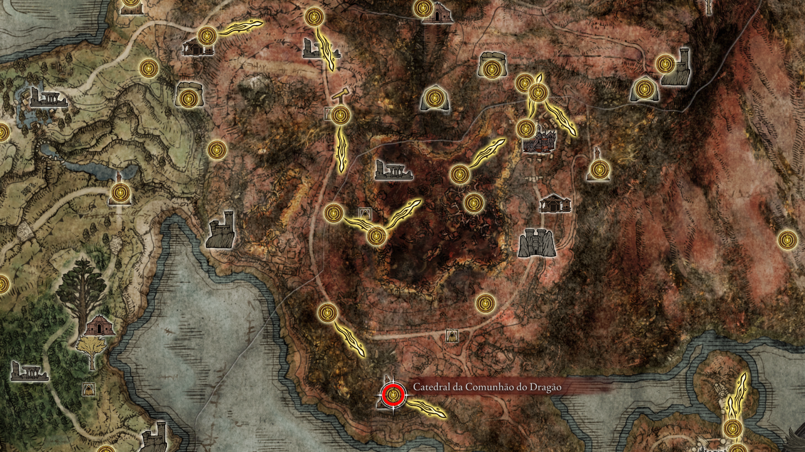
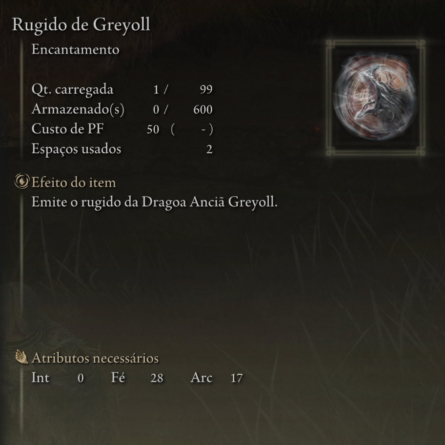

# 🌋 16. Leyndell, Capital das Cinzas: O Fim da Jornada

> **Foco:** Coleta do último talismã lendário, Boss Rush Final e Escolha dos Finais.
> **Checkpoint de Platina:** O mundo mudou para sempre. A Térvore queima e a capital está soterrada em cinzas. Prepare-se para os confrontos definitivos.

---

## 01. O Destino de Corhyn e a Montanha dos Gigantes
Ao chegar na Capital das Cinzas, o ciclo do instrutor de milagres se aproxima do fim. Você o encontrará próximo à base da grande escadaria ou no local onde ele estava nos Picos dos Gigantes.

* **Lore:** Corhyn, consumido pela dúvida ao ver seu mestre questionar a perfeição da Ordem Áurea, entra em colapso. Ele representa a fé cega que não suporta a verdade das rachaduras na Ordem.
* **Item:** **Sino de Corhyn** e **Veste de Corhyn**.
* **Dica:** Se ele não estiver na Capital, verifique a ponte nas Ruínas dos Astrônomos (Picos dos Gigantes). Esgote todos os diálogos antes de recarregar a área.

    
     
    <em>Figura 1: O lamento final de Corhyn diante da capital soterrada.</em>

---

## 02. O Espólio do Instrutor (Reset de Área)
Para que os itens físicos de Corhyn apareçam, é necessário que o mundo "processe" o fim de sua jornada.

* **Ação:** Após o diálogo final, descanse em uma Graça ou saia para o menu principal e volte.
* **Lore:** O sino deixado para trás contém todo o conhecimento litúrgico acumulado por Corhyn durante sua peregrinação.
* **Item:** **Esfera de Corhyn** (Sino).
* **Dica:** Entregue este sino às Gêmeas Idosas na Mesa-Redonda para recuperar o acesso a quaisquer encantamentos que não tenha comprado.

    
     
    <em>Figura 2: O Sino e as vestes deixadas para trás no local do repouso final.</em>

---

## 03. O Fim da Meditação: Localização do Máscara Dourada
Abaixo do Coliseu de Leyndell, seguindo pelo caminho das cinzas em direção ao penhasco, você encontrará o corpo imóvel do mestre.

* **Lore:** O Máscara Dourada finalmente concluiu seus cálculos sobre a Térvore. Sua descoberta foi radical: a imperfeição da Ordem não era divina, mas sim fruto da volatilidade dos corações humanos e dos próprios Deuses.
* **Item:** **Runa de Reparação da Ordem Perfeita**.
* **Dica:** O corpo dele está na base das falésias abaixo do Santuário da Térvore. Atravesse a ponte de troncos e desça com cuidado.

    
     
    <em>Figura 3: O corpo do Máscara Dourada após alcançar a verdade última.</em>

---

## 04. A Runa de Reparação da Ordem Perfeita
Este é o item fundamental para desbloquear um dos finais alternativos de Lorde Elden.

* **Descrição:** Uma runa rúnica que permite restaurar o Anel de Elden com um novo conceito: a exclusão da influência subjetiva dos deuses.
* **Lore:** Representa a tentativa de criar uma "Ordem Pura", onde as falhas da Rainha Marika e sua linhagem não possam mais causar o caos.
* **Item:** **Runa de Reparação da Ordem Perfeita**.
* **Dica:** Mesmo que planeje o final da Ranni, este item é essencial para o completionist e para entender o ápice da filosofia do jogo.

    
     
    <em>Figura 4: O símbolo da geometria sagrada que promete a perfeição absoluta.</em>

---

## 05. O Espólio do Mestre (Set do Máscara Dourada)
As vestes do maior matemático das Terras Intermédias tornam-se disponíveis após a coleta da Runa.

* **Descrição:** Recarregue o jogo ou descanse na Graça após coletar a Runa para encontrar o conjunto completo no corpo.
* **Item:** **Conjunto do Máscara Dourada** (Capa, Braceletes e Calças). 
* **Dica:** Este set é extremamente leve e aumenta em 10% o dano de encantamentos da linhagem da Ordem Áurea.

    
     
    <em>Figura 5: As vestes ascéticas do Máscara Dourada.</em>

---

## 06. Local da Máscara de Ouro Radiante
Ao contrário do resto do set, a máscara física foi deixada para trás durante a jornada nos picos nevados.

* **Localização:** Retorne à ponte quebrada nos **Picos dos Gigantes** (próximo à Graça das Ruínas dos Astrônomos). O item estará no final da estrutura.
* **Lore:** Uma máscara solar radiante que impede o usuário de expressar emoções, mantendo o foco total nos cálculos da Térvore.
* **Item:** **Máscara de Ouro Radiante**.
* **Dica:** Equipe-a junto com o set coletado no passo anterior para maximizar builds de Fé "Pureza".

    
     
    <em>Figura 6: A máscara solar deixada para trás na ponte dos Gigantes.</em>

---

## 09. Encantamento: Cura da Térvore (Quarto da Rainha)
Subindo em direção ao confronto final, você encontrará a relíquia de cura mais poderosa da linhagem de Marika.

* **Descrição:** Encontrado na Graça **Quarto da Rainha** (Queen's Bedchamber), sobre a cama de pedra.
* **Lore:** O ápice dos encantamentos de cura da Térvore. Diz-se que apenas os mais próximos da Rainha Marika conheciam este nível de restauração.
* **Item:** **Cura da Térvore (Erdtree Heal)**.
* **Dica:** Este feitiço cura uma quantidade massiva de HP (seu e de aliados próximos). Requer **42 de Fé**. É vital para a sobrevivência na Boss Rush final.

    
     
    <em>Figura 9a: O Quarto da Rainha, o último ponto de descanso antes do trono.</em>

    
     
    <em>Figura 9b: Coletando o encantamento de restauração máxima.</em>

---

## 🦁 10. Godfrey / Hoarah Loux, o Guerreiro [🏆 PLATINA]
O Primeiro Elden Lord retorna para reivindicar seu título. Uma das lutas mais épicas e físicas do jogo.

* **Item:** **Lembrança de Hoarah Loux**.
* **Estratégia Fase 1 (Godfrey):** Ele ataca com um machado gigante e causa tremores no chão (pule para esquivar dos tremores, rolar é menos eficiente).
* **Estratégia Fase 2 (Hoarah Loux):** Ele descarta o leão Serosh e luta com as próprias mãos. Seus ataques de agarrão dão instakill na maioria das builds. Mantenha distância quando ele levantar os braços e prepare-se para pular os ataques em área brutais.

    
     
    <em>Figura 3: Enfrentando a fúria primitiva do Primeiro Elden Lord.</em>

---

## 👑 11. Radagon da Ordem Áurea e a Fera Elden [🏆 PLATINA]
O embate final. Duas lutas seguidas, sem checkpoint entre elas. Você lutará dentro da Térvore.

* **Item:** **Lembrança da Fera Elden** e o coração de um deus.
* **Dica para Radagon:** Ele é imune a Sangramento e muito resistente a Dano Sagrado. Use armas de Dano Físico (Strike/Esmagamento) ou Fogo.
* **Dica para a Fera Elden:** Uma batalha de resistência e corrida. O talismã "Dádiva da Térvore +2" e o "Talismã de Draco Sagrado +2" (Haligdrake Talisman) são fundamentais aqui para sobreviver aos ataques de luz. A magia de fogo "Tornado de Chama Negra" derrete o HP da Fera Elden.

    
     
    <em>Figura 4: A batalha dupla definitiva pelo destino das Terras Intermédias.</em>

---

## 12. O Sacrifício Final: Rugido de Greyoll [🏆 PLATINA]
Com o Trono de Elden garantido, é hora de realizar o último sacrifício necessário para a coleção de magias lendárias.

* **Descrição:** O processo exige a derrota da Grande Dragão Greyoll e a troca do seu coração na Catedral da Comunhão Dragônica em Caelid.

* **Lore:** Um encantamento lendário que emite o rugido da grande dragão anciã. Greyoll era a mãe de todos os dragões, e seu rugido é um lamento que diminui o poder de ataque e defesa dos inimigos próximos.

* **Item:** **Rugido de Greyoll [ENCANTAMENTO LENDÁRIO]**.
* **Checklist de Platina:** Ao adquirir este item, se você seguiu todos os passos anteriores (Chama do Deus Caído e Estrelas Prístinas), o troféu de **Encantamentos Lendários** será desbloqueado.

    
     
    <em>Figura 5a: Ponto de Partida. A Grande Dragão Greyoll e seus filhotes na Fortaleza Faroth.</em>

    
     
    <em>Figura 5b: O Altar de Heresia. Localização da Catedral da Comunhão Dragônica ao sul de Caelid.</em>

    
     
    <em>Figura 5c: Descrição do Rugido de Greyoll. O selo final da sua jornada como colecionador lendário.</em>

---

# 🏆 Checkpoint Final: Auditoria de Platina

> **Status:** Pós-Fera Elden / Pré-Final do Jogo.
> **Ação:** Verifique cada item no seu inventário. Se algum estiver faltando, busque-o ANTES de interagir com a estátua ou o sinal de invocação.

---

## ⚔️ Armas Lendárias (9/9)
*Necessário para o troféu "Armas Lendárias".*

- [ ] **Espadão de Lâmina Enxertada:** (Castelo Morne) Drop do chefe final da área.
- [ ] **Espada da Noite e da Chama:** (Mansão Caria) Baú nos jardins superiores.
- [ ] **Espadão da Lua Sombria:** (Quest da Ranni) Recompensa final da linha de missões.
- [ ] **Espadão das Ruínas:** (Castelo Redmane) Recompensa do Boss Fight pós-Radahn.
- [ ] **Espada de Execução de Marais:** (Castelo Sombrio) Drop de Elemer dos Espinhos.
- [ ] **Lança de Gransax:** (Leyndell - Pré-Cinzas) Localizada na lança gigante. **[PERDÍVEL]**
- [ ] **Espada Grande da Ordem Áurea:** (Campo de Neve) Caverna dos Desamparados.
- [ ] **Shotel do Eclipse:** (Castelo Sol) No altar da Igreja do Eclipse.
- [ ] **Cetro do Devorador:** (Farum Azula) Drop do Recusante Bernahl após invasão.

---

## 🛡️ Talismãs Lendários (8/8)
*Necessário para o troféu "Talismãs Lendários".*

- [ ] **Dádiva da Térvore +2:** (Capital das Cinzas) Pátio com os Espíritos da Árvore Ulcerada.
- [ ] **Ícone de Radagon:** (Raya Lucaria) No segundo andar da Sala de Debate.
- [ ] **Ícone de Godfrey:** (Platô Altus) Cárcere Perpétua da Linhagem Dourada.
- [ ] **Lua de Nokstella:** (Nokstella) Baú no topo da catedral da cidade eterna.
- [ ] **Talismã de Escudo de Brasão de Dragão:** (Elphael) Baú em cima da capela elevada.
- [ ] **Talismã do Velho Lorde:** (Farum Azula) Baú na torre antes da invasão do Bernahl.
- [ ] **Cicatriz de Radagon (Soreseal):** (Forte Faroth) Encontrado em um corpo no parapeito interno.
- [ ] **Cicatriz de Marika (Soreseal):** (Elphael) Altar trancado com Chave de Espada de Pedra.

---

## 🧙 Feitiços e Encantamentos Lendários (7/7)
*Necessário para o troféu "Feitiços e Encantamentos Lendários".*

- [ ] **Chuva de Estrelas Fundadora:** (Picos dos Gigantes) Dentro da Torre Herege.
- [ ] **Lua Sombria de Ranni:** (Altar do Luar) Torre da Ascensão de Chelona.
- [ ] **Bólido Escuro:** (Monte Gelmir) Falando com o Mestre Azur.
- [ ] **Plêiades:** (Caelid) Entregue por Lusat no Esconderijo de Sellia.
- [ ] **Chama do Deus Caído:** (Liurnia) Cárcere Perpétua do Malfeitor.
- [ ] **Rugido de Greyoll:** (Caelid) Comprado na Igreja da Comunhão Dragônica após matar o dragão gigante.
- [ ] **Estrelas Prístinas:** (Abismo das Raízes Profundas) Caverna de formigas perto da cachoeira.

---

## 👻 Cinzas de Invocação Lendárias (6/6)
*Necessário para o troféu "Cinzas Lendárias".*

- [ ] **Lágrima Imitadora:** (Nokron) Baú atrás da névoa de Chave de Espada.
- [ ] **Tiche, a Faca Negra:** (Altar do Luar) Recompensa da Cárcere Perpétua do Ladrão.
- [ ] **Lhutel, a Sem Cabeça:** (Península das Lágrimas) Catacumbas do Túmulo.
- [ ] **Finlay, Cavaleira da Imundície:** (Elphael) Baú perto da Graça "Sala de Oração".
- [ ] **Ogha, Cavaleiro da Juba Vermelha:** (Caelid) Catacumbas dos Mortos da Guerra.
- [ ] **Kristoff, Cavaleiro do Dragão Ancião:** (Platô Altus) Túmulo do Herói Santificado.

---

## 🐲 Chefes Opcionais (Checklist de Troféus)
Se algum destes ainda estiver vivo, você não terá a platina:

- [ ] **Malenia, Espada de Miquella:** (Elphael, Suporte da Árvore Sacra).
- [ ] **Mohg, Senhor do Sangue:** (Palácio Mohgwyn).
- [ ] **Lorde Dragão Placidusax:** (Farum Azula - Caminho Secreto).
- [ ] **Lichdragon Fortissax:** (Final da Quest da Fia).
- [ ] **Regalt Ancestor Spirit:** (Nokron - Acender os 6 pilares).

---

## 💾 13. O Checkpoint dos Finais (BACKUP DO SAVE)
**ATENÇÃO CAÇADOR DE PLATINA:** Após derrotar a Fera Elden, você estará na plataforma de pedra com a deusa Marika estilhaçada e uma Graça. **NÃO INTERAJA COM NADA AINDA!**

* **Procedimento:** Descanse na Graça e saia do jogo. Faça o backup do seu save (na nuvem do PlayStation/Xbox ou copiando a pasta de save no PC).
* **Objetivo:** Com o backup feito, você pode recarregar o mesmo ponto para fazer os 3 finais exigidos pela Platina sem precisar jogar o jogo inteiro mais duas vezes (NG+ e NG++).

    
     
    <em>Figura 6: O momento exato para fazer o backup do save antes de escolher o final.</em>

---

[⬅️ Voltar para o README.md](README.md)