# 🌋 16. Leyndell, Capital das Cinzas: O Fim da Jornada

> **Foco:** Coleta do último talismã lendário, Boss Rush Final e Escolha dos Finais.
> **Checkpoint de Platina:** O mundo mudou para sempre. A Térvore queima e a capital está soterrada em cinzas. Prepare-se para os confrontos definitivos.

---

## 01. pegar a primeira graca na capital das cinzas, finalizar a quest do Corhryn, na montanha dos gigantes
breve descricao , lore e o que pode aconter.

    ** Item sino e set
    ** Dica

    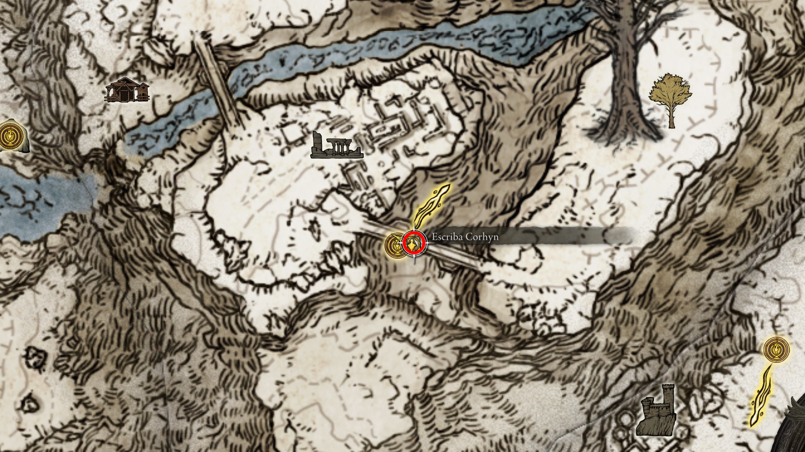
     
    <em>Figura : .</em>

---

## 02. recarregar o jogo depois de falar com o Corhyn para pegar o set e sino
breve descricao , lore e o que pode aconter.

    ** Item sino e set
    ** Dica

    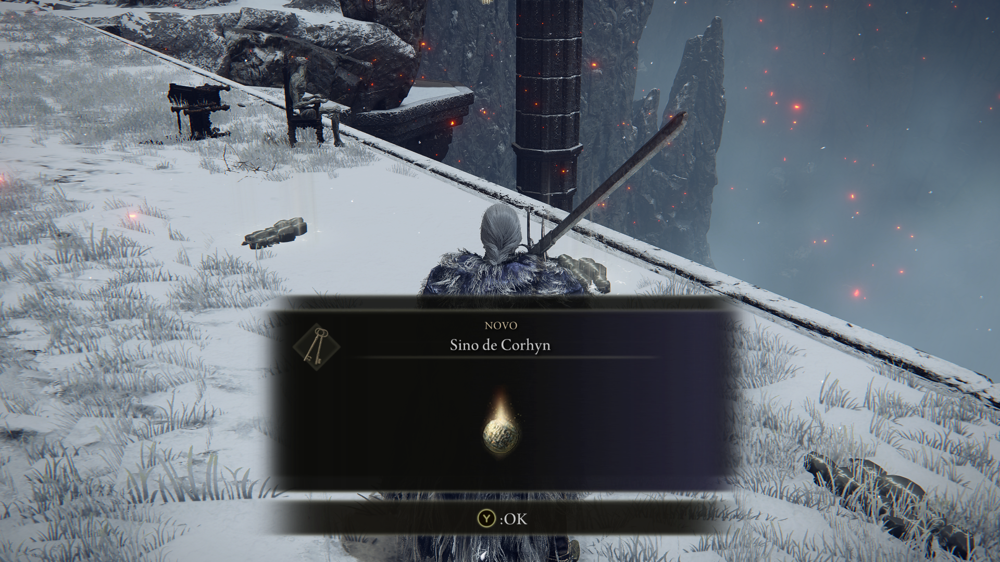
     
    <em>Figura : .</em>

---

## 03. finalizar a quest do mascara dourada, localizacao  
breve descricao , lore e o que pode aconter.

    ** Item
    ** Dica

    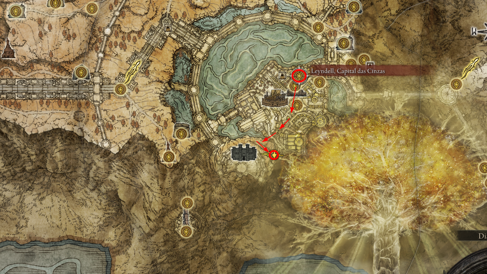
     
    <em>Figura : .</em>

---

## 04. colete o item runa de reparo da ordem perfeita
breve descricao , lore e o que pode aconter.

    ** Item
    ** Dica

    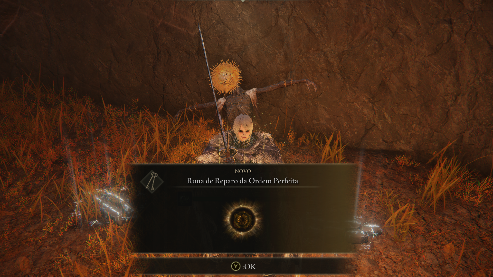
     
    <em>Figura : .</em>

---

## 05. recarregue o jogo para coletar o set
breve descricao , lore e o que pode aconter.

    ** Item
    ** Dica

    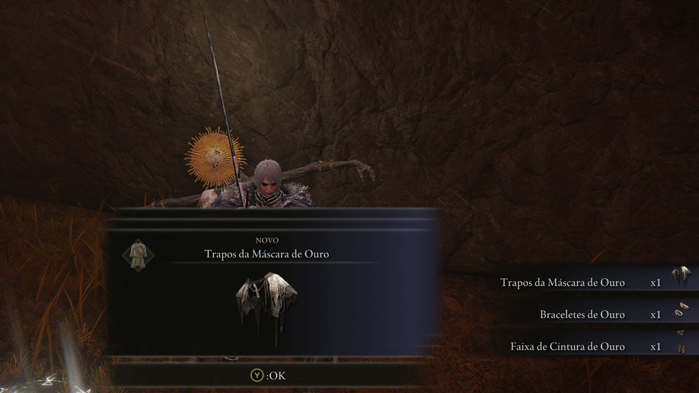
     
    <em>Figura : .</em>

---

## 06. local da mascara de ouro radiante
breve descricao , lore e o que pode aconter.

    ** Item
    ** Dica

    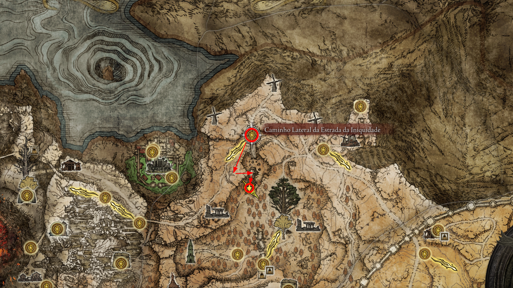
     
    <em>Figura : .</em>

---

## 🛡️ 07. Talismã da Dádiva da Térvore +2 [🏆 PLATINA]
Antes de subir para o trono, há um último talismã lendário escondido nas cinzas. Ele aumenta muito o HP, Vigor e Carga de Equipamento.

* **Item:** **Talismã da Dádiva da Térvore +2** (Erudtree's Favor +2).
* **Dica:** A partir da Graça da Terras proibidas volte pelo elevador, em direção a um grande pátio que antes tinha água. O pátio agora está coberto de cinzas e patrulhado por três **Espíritos da Árvore Ulcerada** (você pode passar correndo por eles). O talismã está no topo de um tronco saindo das cinzas.

    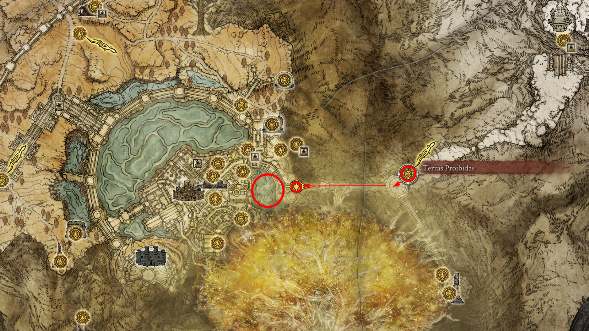
     
    <em>Figura : caminho da graca da terras ate o elevador.</em>

    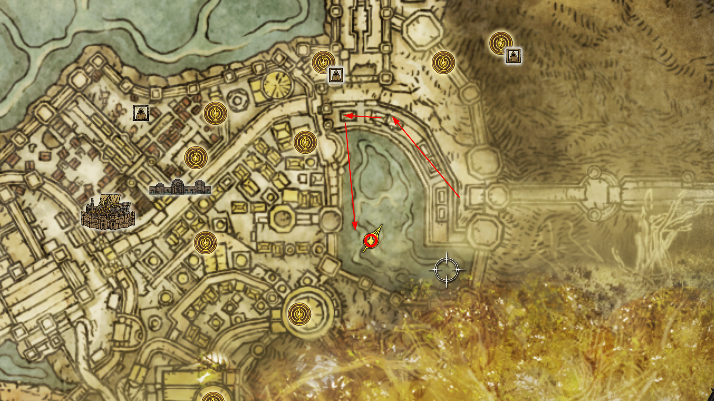
     
    <em>Figura : do elevador ate o item.</em>

    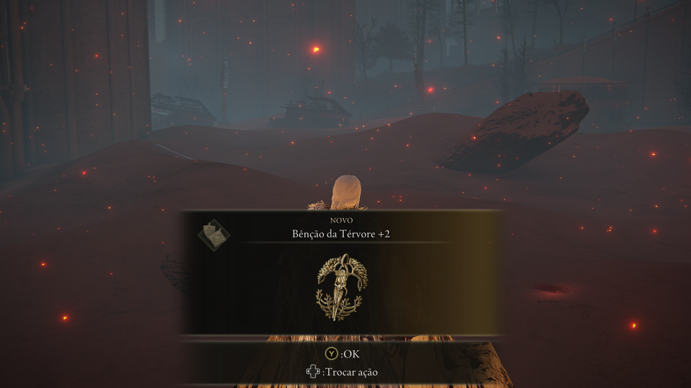
     
    <em>Figura : print da coleta do item.</em>

---

## 👁️ 08. Sir Gideon Ofnir, o Sabe-Tudo
O líder da Távola Redonda decide que um Maculado não pode se tornar um Lorde e tenta impedir seu avanço.

* **Item:** **Cetro do Sabe-Tudo** e **Conjunto de Armadura do Sabe-Tudo**.
* **Dica:** A luta acontece no Santuário da Térvore (onde você lutou contra o fantasma de Godfrey antes). Gideon usa muitas magias em área. Aproveite o longo monólogo inicial dele para se aproximar e causar o máximo de dano ou aplicar efeitos de status (Sangramento/Podridão) antes da luta realmente começar.

    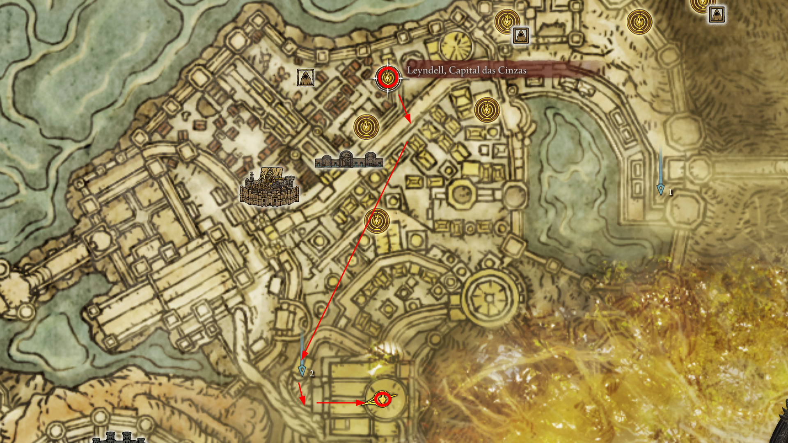
     
    <em>Figura 7: localizacao.</em>

    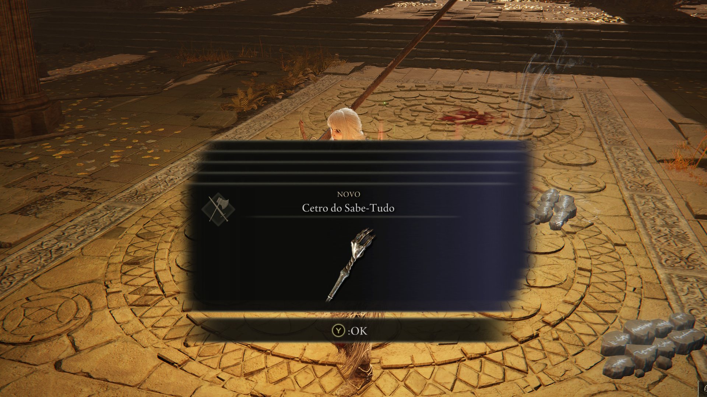
     
    <em>Figura 8: O confronto contra o Maculado que acumulou todo o conhecimento.</em>

---

## 09. Encatamento Cura da Tervore na graca quarto da rainha 
breve descricao , lore e o que pode aconter.

    ** Item
    ** Dica

    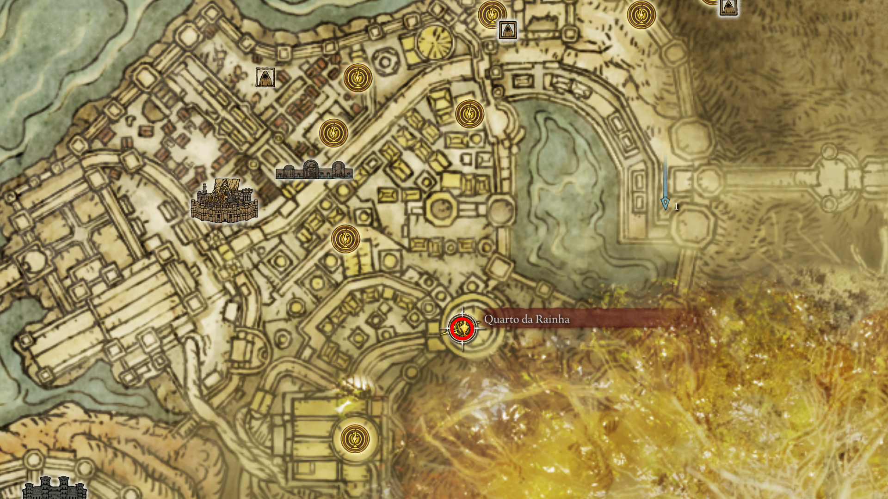
     
    <em>Figura : localizacao.</em>

    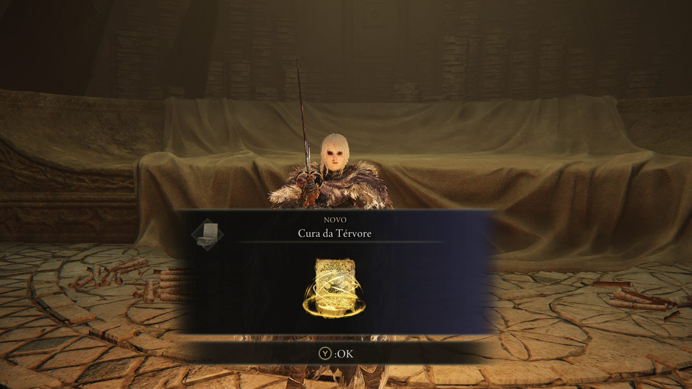
     
    <em>Figura : print da coleta.</em>

---

## 🦁 10. Godfrey / Hoarah Loux, o Guerreiro [🏆 PLATINA]
O Primeiro Elden Lord retorna para reivindicar seu título. Uma das lutas mais épicas e físicas do jogo.

* **Item:** **Lembrança de Hoarah Loux**.
* **Estratégia Fase 1 (Godfrey):** Ele ataca com um machado gigante e causa tremores no chão (pule para esquivar dos tremores, rolar é menos eficiente).
* **Estratégia Fase 2 (Hoarah Loux):** Ele descarta o leão Serosh e luta com as próprias mãos. Seus ataques de agarrão dão instakill na maioria das builds. Mantenha distância quando ele levantar os braços e prepare-se para pular os ataques em área brutais.

    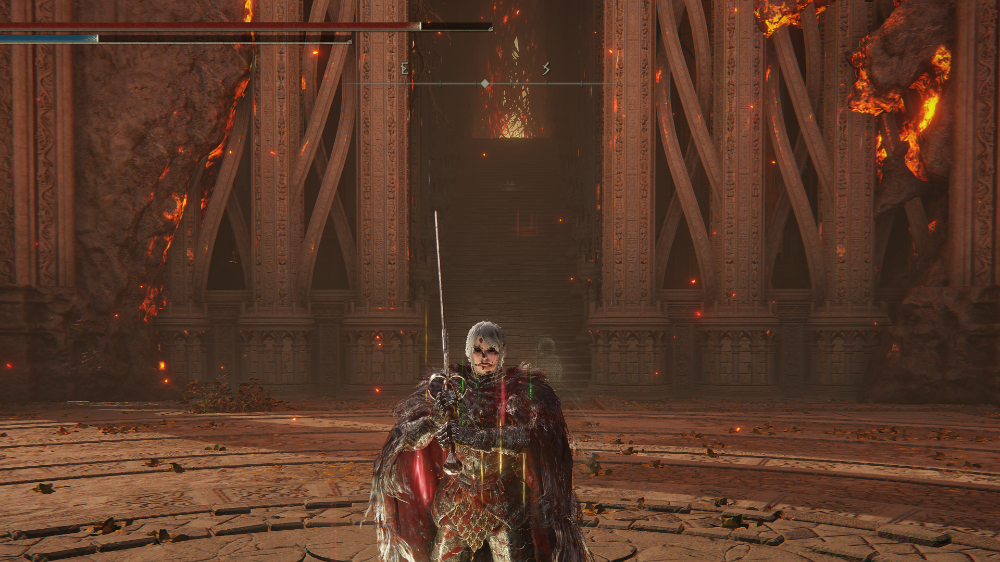
     
    <em>Figura 3: Enfrentando a fúria primitiva do Primeiro Elden Lord.</em>

---

## 👑 11. Radagon da Ordem Áurea e a Fera Elden [🏆 PLATINA]
O embate final. Duas lutas seguidas, sem checkpoint entre elas. Você lutará dentro da Térvore.

* **Item:** **Lembrança da Fera Elden** e o coração de um deus.
* **Dica para Radagon:** Ele é imune a Sangramento e muito resistente a Dano Sagrado. Use armas de Dano Físico (Strike/Esmagamento) ou Fogo.
* **Dica para a Fera Elden:** Uma batalha de resistência e corrida. O talismã "Dádiva da Térvore +2" e o "Talismã de Draco Sagrado +2" (Haligdrake Talisman) são fundamentais aqui para sobreviver aos ataques de luz. A magia de fogo "Tornado de Chama Negra" derrete o HP da Fera Elden.

    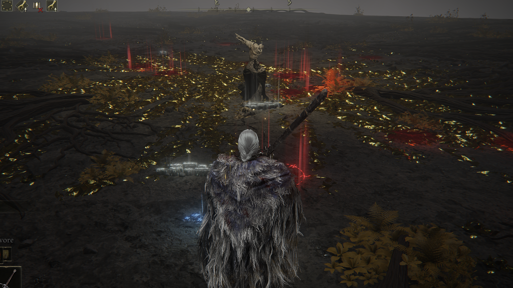
     
    <em>Figura 4: A batalha dupla definitiva pelo destino das Terras Intermédias.</em>

---

# 🏆 Checkpoint Final: Auditoria de Platina

> **Status:** Pós-Fera Elden / Pré-Final do Jogo.
> **Ação:** Verifique cada item no seu inventário. Se algum estiver faltando, busque-o ANTES de interagir com a estátua ou o sinal de invocação.

---

## ⚔️ Armas Lendárias (9/9)
*Necessário para o troféu "Armas Lendárias".*

- [ ] **Espadão de Lâmina Enxertada:** (Castelo Morne) Drop do chefe final da área.
- [ ] **Espada da Noite e da Chama:** (Mansão Caria) Baú nos jardins superiores.
- [ ] **Espadão da Lua Sombria:** (Quest da Ranni) Recompensa final da linha de missões.
- [ ] **Espadão das Ruínas:** (Castelo Redmane) Recompensa do Boss Fight pós-Radahn.
- [ ] **Espada de Execução de Marais:** (Castelo Sombrio) Drop de Elemer dos Espinhos.
- [ ] **Lança de Gransax:** (Leyndell - Pré-Cinzas) Localizada na lança gigante. **[PERDÍVEL]**
- [ ] **Espadão da Ordem Áurea:** (Campo de Neve) Caverna dos Desamparados.
- [ ] **Shotel do Eclipse:** (Castelo Sol) No altar da Igreja do Eclipse.
- [ ] **Cetro do Devorador:** (Farum Azula) Drop do Recusante Bernahl após invasão.

---

## 🛡️ Talismãs Lendários (8/8)
*Necessário para o troféu "Talismãs Lendários".*

- [ ] **Dádiva da Térvore +2:** (Capital das Cinzas) Pátio com os Espíritos da Árvore Ulcerada.
- [ ] **Ícone de Radagon:** (Raya Lucaria) No segundo andar da Sala de Debate.
- [ ] **Ícone de Godfrey:** (Platô Altus) Cárcere Perpétua da Linhagem Dourada.
- [ ] **Lua de Nokstella:** (Nokstella) Baú no topo da catedral da cidade eterna.
- [ ] **Talismã de Escudo de Brasão de Dragão:** (Elphael) Baú em cima da capela elevada.
- [ ] **Talismã do Velho Lorde:** (Farum Azula) Baú na torre antes da invasão do Bernahl.
- [ ] **Cicatriz de Radagon (Soreseal):** (Forte Faroth) Encontrado em um corpo no parapeito interno.
- [ ] **Cicatriz de Marika (Soreseal):** (Elphael) Altar trancado com Chave de Espada de Pedra.

---

## 🧙 Feitiços e Encantamentos Lendários (7/7)
*Necessário para o troféu "Feitiços e Encantamentos Lendários".*

- [ ] **Chuva Fundadora de Estrelas:** (Picos dos Gigantes) Dentro da Torre Herege.
- [ ] **Lua Sombria de Ranni:** (Altar do Luar) Torre da Ascensão de Chelona.
- [ ] **Cometa Azur:** (Monte Gelmir) Falando com o Mestre Azur.
- [ ] **Estrelas da Ruína:** (Caelid) Entregue por Lusat no Esconderijo de Sellia.
- [ ] **Chama do Deus Caído:** (Liurnia) Cárcere Perpétua do Malfeitor.
- [ ] **Rugido de Greyoll:** (Caelid) Comprado na Igreja da Comunhão Dragônica após matar o dragão gigante.
- [ ] **Estrelas de Elden:** (Abismo das Raízes Profundas) Caverna de formigas perto da cachoeira.

---

## 👻 Cinzas de Invocação Lendárias (6/6)
*Necessário para o troféu "Cinzas Lendárias".*

- [ ] **Lágrima Imitadora:** (Nokron) Baú atrás da névoa de Chave de Espada.
- [ ] **Tiche, a Faca Negra:** (Altar do Luar) Recompensa da Cárcere Perpétua do Ladrão.
- [ ] **Lhutel, a Sem Cabeça:** (Península das Lágrimas) Catacumbas do Túmulo.
- [ ] **Finlay, Cavaleira da Imundície:** (Elphael) Baú perto da Graça "Sala de Oração".
- [ ] **Ogha, Cavaleiro da Juba Vermelha:** (Caelid) Catacumbas dos Mortos da Guerra.
- [ ] **Kristoff, Cavaleiro do Dragão Ancião:** (Platô Altus) Túmulo do Herói Santificado.

---

## 🐲 Chefes Opcionais (Checklist de Troféus)
Se algum destes ainda estiver vivo, você não terá a platina:

- [ ] **Malenia, Espada de Miquella:** (Elphael, Suporte da Árvore Sacra).
- [ ] **Mohg, Senhor do Sangue:** (Palácio Mohgwyn).
- [ ] **Lorde Dragão Placidusax:** (Farum Azula - Caminho Secreto).
- [ ] **Lichdragon Fortissax:** (Final da Quest da Fia).
- [ ] **Regalt Ancestor Spirit:** (Nokron - Acender os 6 pilares).

---

## 💾 12. O Checkpoint dos Finais (BACKUP DO SAVE)
**ATENÇÃO CAÇADOR DE PLATINA:** Após derrotar a Fera Elden, você estará na plataforma de pedra com a deusa Marika estilhaçada e uma Graça. **NÃO INTERAJA COM NADA AINDA!**

* **Procedimento:** Descanse na Graça e saia do jogo. Faça o backup do seu save (na nuvem do PlayStation/Xbox ou copiando a pasta de save no PC).
* **Objetivo:** Com o backup feito, você pode recarregar o mesmo ponto para fazer os 3 finais exigidos pela Platina sem precisar jogar o jogo inteiro mais duas vezes (NG+ e NG++).

    
     
    <em>Figura 5: O momento exato para fazer o backup do save antes de escolher o final.</em>

<!-- 

---

## . 
breve descricao , lore e o que pode aconter.

    ** Item
    ** Dica

    
     
    <em>Figura : .</em>

---

## . 
breve descricao , lore e o que pode aconter.

    ** Item
    ** Dica

    
     
    <em>Figura : .</em>

--- 
-->

