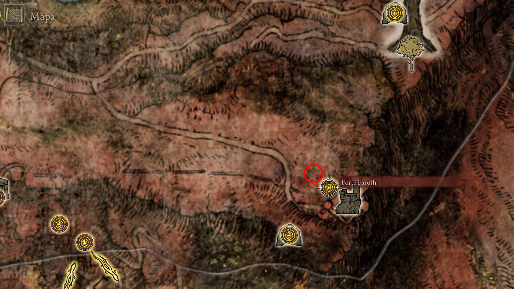
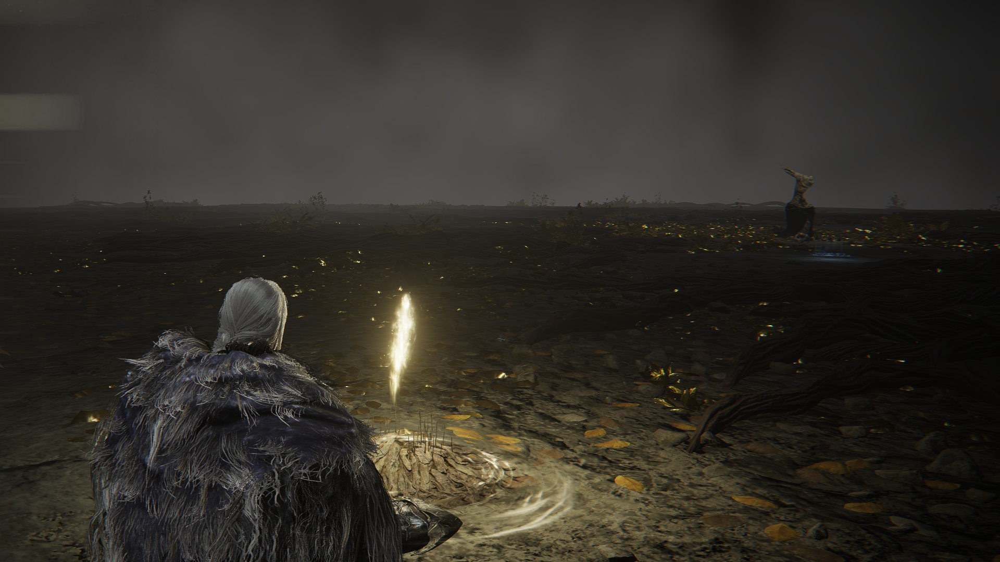

# 🌋 16. Leyndell, Capital das Cinzas: O Fim da Jornada

> **Foco:** Coleta do último talismã lendário, Boss Rush Final e Escolha dos Finais.
> **Checkpoint de Platina:** O mundo mudou para sempre. A Térvore queima e a capital está soterrada em cinzas. Prepare-se para os confrontos definitivos.

---

## 🧭 01. O Destino de Corhyn e a Montanha dos Gigantes
Ao chegar na Capital das Cinzas, o ciclo do instrutor de milagres se aproxima do fim. Você o encontrará próximo à base da grande escadaria.

* **Lore:** Corhyn, consumido pela dúvida ao ver seu mestre questionar a Ordem Áurea, entra em colapso. Ele representa a fé cega que não suporta a verdade das rachaduras na Ordem.
* **Item:** **Sino de Corhyn** e **Veste de Corhyn**.
* **Dica:** Se ele não estiver na Capital, verifique a ponte nas Ruínas dos Astrônomos (Picos dos Gigantes). Esgote todos os diálogos antes de recarregar a área.

    
     
    <em>Figura 1: O lamento final de Corhyn diante da capital soterrada.</em>

---

## ⚙️ 02. O Espólio do Instrutor (Reset de Área)
Para que os itens físicos de Corhyn apareçam, é necessário que o mundo "processe" o fim de sua jornada.

* **Ação:** Após o diálogo final, descanse em uma Graça ou saia para o menu principal e volte.
* **Item:** **Esfera de Corhyn** (Sino).
* **Dica:** Entregue este sino às Gêmeas Idosas na Mesa-Redonda para recuperar o acesso a quaisquer encantamentos que não tenha comprado.

    
     
    <em>Figura 2: O Sino e as vestes deixadas para trás no local do repouso final.</em>

---

## 🧘 03. O Fim da Meditação: Localização do Máscara Dourada
Abaixo do Coliseu de Leyndell, seguindo pelo caminho das cinzas em direção ao penhasco, você encontrará o corpo imóvel do mestre.

* **Lore:** O Máscara Dourada concluiu seus cálculos: a imperfeição da Ordem era fruto da volatilidade dos corações humanos e dos próprios Deuses, não algo divino em si.
* **Item:** **Runa de Reparação da Ordem Perfeita**.
* **Dica:** O corpo dele está na base das falésias abaixo do Santuário da Térvore. Atravesse a ponte de troncos e desça com cuidado.

    
     
    <em>Figura 3: O corpo do Máscara Dourada após alcançar a verdade última.</em>

---

## 💠 04. A Runa de Reparação da Ordem Perfeita
Este é o item fundamental para desbloquear o final **"Era da Ordem"**.

* **Descrição:** Uma runa que permite restaurar o Anel de Elden excluindo a influência subjetiva dos deuses.
* **Lore:** Representa a tentativa de criar uma "Ordem Pura", onde as falhas da Rainha Marika não causem mais o caos.

    
     
    <em>Figura 4: O símbolo da geometria sagrada que promete a perfeição absoluta.</em>

---

## 🎭 05. O Espólio do Mestre (Set do Máscara Dourada)
As vestes do maior matemático das Terras Intermédias tornam-se disponíveis após a coleta da Runa.

* **Item:** **Conjunto do Máscara Dourada**. 
* **Dica:** Este set aumenta em 10% o dano de encantamentos da Ordem Áurea.

    
     
    <em>Figura 5: As vestes ascéticas do Máscara Dourada.</em>

---

## ☀️ 06. Local da Máscara de Ouro Brilhante
A máscara física foi deixada para trás durante a jornada nos picos nevados.

* **Localização:** Retorne à ponte quebrada nos **Picos dos Gigantes** (próximo à Graça das Ruínas dos Astrônomos).
* **Item:** **Máscara de Ouro Brilhante**.

    
     
    <em>Figura 6: A máscara solar deixada para trás na ponte dos Gigantes.</em>

---

## 🛡️ 07. Talismã da Dádiva da Térvore +2 [🏆 PLATINA]
O último talismã lendário escondido nas cinzas.

* **Item:** **Dádiva da Térvore +2** (Erdtree's Favor +2).
* **Dica:** Partindo da Graça "Terras Proibidas", volte pelo elevador para o pátio coberto de cinzas. Patrulhado por três Espíritos da Árvore Ulcerada. O item está no topo de um tronco.

    
     
    <em>Figura 7: Caminho da Graça até o elevador de acesso.</em>

    
     
    <em>Figura 8: Saída do elevador em direção ao centro do pátio de cinzas.</em>

    
     
    <em>Figura 9: Coleta do talismã lendário.</em>

---

## 👁️ 08. Sir Gideon Ofnir, o Sabe-Tudo
O líder da Távola Redonda tenta impedir seu avanço para o trono.

* **Drops:** **Cetro do Sabe-Tudo** e **Set de Armadura do Sabe-Tudo**.
* **Dica:** Aproveite o longo monólogo inicial dele para aplicar buffs e desferir os primeiros golpes.

    
     
    <em>Figura 10: Entrada do Santuário da Térvore.</em>

    
     
    <em>Figura 11: O confronto contra o Maculado que acumulou todo o conhecimento.</em>

---

## ✨ 09. Encantamento: Cura da Térvore
A relíquia de cura mais poderosa da linhagem de Marika.

* **Local:** Graça **Quarto da Rainha** (Queen's Bedchamber).
* **Item:** **Cura da Térvore** (Erdtree Heal).
* **Requisito:** 42 de Fé.

    
     
    <em>Figura 12: O último ponto de descanso antes do trono.</em>

    
     
    <em>Figura 13: Coletando o encantamento de restauração máxima.</em>

---

## 🦁 10. Godfrey / Hoarah Loux [🏆 PLATINA]
O Primeiro Elden Lord retorna para seu julgamento final.

* **Drops:** **Lembrança de Hoarah Loux**.
* **Dica:** Fase 1 (Godfrey) use pulos para evitar os choques no chão. Fase 2 (Hoarah Loux) mantenha distância dos ataques de agarrão.

    
     
    <em>Figura 14: Enfrentando a fúria primitiva do Primeiro Elden Lord.</em>

---

## 👑 11. Radagon e a Fera Elden [🏆 PLATINA]
O embate final. Duas lutas seguidas sem checkpoint.

* **Drops:** **Lembrança da Fera Elden**.
* **Dica:** Use o **Talismã de Draco Sagrado +2** para reduzir o dano de Radagon e da Fera. Radagon é vulnerável a Fogo; a Fera Elden é vulnerável a **Chama Negra**.

    
     
    <em>Figura 15: A batalha dupla definitiva pelo destino das Terras Intermédias.</em>

---

## 🐉 12. Ritual Final: Rugido de Greyoll [🏆 PLATINA]
Com o trono garantido, finalize a coleção lendária em Caelid.

* **Requisito:** Matar a dragão Greyoll em Dragonbarrow e trocar o coração na **Catedral da Comunhão Dragônica** (Sul de Caelid).
* **Item:** **Rugido de Greyoll** (Heal from Afar).
* **Nota:** Este é o gatilho final para o troféu de Feitiços Lendários.

    
     
    <em>Figura 16: Local de troca do coração do dragão lendário.</em>

---

# 🏆 Checkpoint Final: Auditoria de Platina

> **Status:** Pós-Fera Elden / Pré-Final do Jogo.
> **Ação:** Verifique cada item no seu inventário. Se algum estiver faltando, busque-o ANTES de interagir com a estátua ou o sinal de invocação.

---

## ⚔️ Armas Lendárias (9/9)
*Necessário para o troféu "Armas Lendárias".*

- [ ] **Espadão de Lâmina Enxertada:** (Castelo Morne) Drop do chefe final da área.
- [ ] **Espada da Noite e da Chama:** (Mansão Caria) Baú nos jardins superiores.
- [ ] **Espadão da Lua Sombria:** (Quest da Ranni) Recompensa final da linha de missões.
- [ ] **Espadão das Ruínas:** (Castelo Redmane) Recompensa do Boss Fight pós-Radahn.
- [ ] **Espada de Execução de Marais:** (Castelo Sombrio) Drop de Elemer dos Espinhos.
- [ ] **Lança de Gransax:** (Leyndell - Pré-Cinzas) Localizada na lança gigante. **[PERDÍVEL]**
- [ ] **Espada Grande da Ordem Áurea:** (Campo de Neve) Caverna dos Desamparados.
- [ ] **Shotel do Eclipse:** (Castelo Sol) No altar da Igreja do Eclipse.
- [ ] **Cetro do Devorador:** (Farum Azula) Drop do Recusante Bernahl após invasão.

---

## 🛡️ Talismãs Lendários (8/8)
*Necessário para o troféu "Talismãs Lendários".*

- [ ] **Dádiva da Térvore +2:** (Capital das Cinzas) Pátio com os Espíritos da Árvore Ulcerada.
- [ ] **Ícone de Radagon:** (Raya Lucaria) No segundo andar da Sala de Debate.
- [ ] **Ícone de Godfrey:** (Platô Altus) Cárcere Perpétua da Linhagem Dourada.
- [ ] **Lua de Nokstella:** (Nokstella) Baú no topo da catedral da cidade eterna.
- [ ] **Talismã de Escudo de Brasão de Dragão:** (Elphael) Baú em cima da capela elevada.
- [ ] **Talismã do Velho Lorde:** (Farum Azula) Baú na torre antes da invasão do Bernahl.
- [ ] **Cicatriz de Radagon (Soreseal):** (Forte Faroth) Encontrado em um corpo no parapeito interno.
- [ ] **Cicatriz de Marika (Soreseal):** (Elphael) Altar trancado com Chave de Espada de Pedra.

---

## 🧙 Feitiços e Encantamentos Lendários (7/7)
*Necessário para o troféu "Feitiços e Encantamentos Lendários".*

- [ ] **Chuva de Estrelas Fundadora:** (Picos dos Gigantes) Dentro da Torre Herege.
- [ ] **Lua Sombria de Ranni:** (Altar do Luar) Torre da Ascensão de Chelona.
- [ ] **Bólido Escuro:** (Monte Gelmir) Falando com o Mestre Azur.
- [ ] **Plêiades:** (Caelid) Entregue por Lusat no Esconderijo de Sellia.
- [ ] **Chama do Deus Caído:** (Liurnia) Cárcere Perpétua do Malfeitor.
- [ ] **Rugido de Greyoll:** (Caelid) Comprado na Igreja da Comunhão Dragônica após matar o dragão gigante.
- [ ] **Estrelas Prístinas:** (Abismo das Raízes Profundas) Caverna de formigas perto da cachoeira.

---

## 👻 Cinzas de Invocação Lendárias (6/6)
*Necessário para o troféu "Cinzas Lendárias".*

- [ ] **Lágrima Imitadora:** (Nokron) Baú atrás da névoa de Chave de Espada.
- [ ] **Tiche, a Faca Negra:** (Altar do Luar) Recompensa da Cárcere Perpétua do Ladrão.
- [ ] **Lhutel, a Sem Cabeça:** (Península das Lágrimas) Catacumbas do Túmulo.
- [ ] **Finlay, Cavaleira da Imundície:** (Elphael) Baú perto da Graça "Sala de Oração".
- [ ] **Ogha, Cavaleiro da Juba Vermelha:** (Caelid) Catacumbas dos Mortos da Guerra.
- [ ] **Kristoff, Cavaleiro do Dragão Ancião:** (Platô Altus) Túmulo do Herói Santificado.

---

## 🐲 Chefes Opcionais (Checklist de Troféus)
Se algum destes ainda estiver vivo, você não terá a platina:

- [ ] **Malenia, Espada de Miquella:** (Elphael, Suporte da Árvore Sacra).
- [ ] **Mohg, Senhor do Sangue:** (Palácio Mohgwyn).
- [ ] **Lorde Dragão Placidusax:** (Farum Azula - Caminho Secreto).
- [ ] **Lichdragon Fortissax:** (Final da Quest da Fia).
- [ ] **Regalt Ancestor Spirit:** (Nokron - Acender os 6 pilares).

---

## 💾 13. Backup do Save (The Final Step)
**IMPORTANTE:** Após derrotar a Fera Elden, descanse na Graça dentro da Árvore. **NÃO TOQUE NA ESTÁTUA.**

1. Saia do jogo.
2. Faça o backup do Save.
3. Recarregue para fazer os finais: **Era das Estrelas (Ranni)**, **Lorde da Chama Frenética** e **Lorde Elden**.

    
     
    <em>Figura 17: O momento exato para o backup do save.</em>

---

[⬅️ Voltar para o README.md](README.md)