# 🗺️ Rota de Exploração: 17. Planície das Sepulturas

> **Status:** Início da DLC *Shadow of the Erdtree*.
> **Dificuldade Estimada:** Alta (Escalamento de Umbrárvore).

Nesta região, o Maculado atravessa o véu para a Terra das Sombras, um lugar oculto pela Térvore onde o destino de Miquella, o Gentil, aguarda. É uma terra de cemitérios vastos, exércitos queimados e segredos que a Ordem Áurea tentou apagar da história.

---

## 🛡️ 00. Pré-requisitos de Entrada (The Gatekeepers)

Antes de iniciar a jornada na Terra das Sombras, dois objetivos críticos devem ter sido concluídos no jogo base:

1. **Derrotar Radahn, o Flagelo das Estrelas:** Necessário para o destino das estrelas e acesso a áreas ligadas a Miquella.
2. **Derrotar Mohg, Senhor do Sangue:** O acesso à DLC é feito através do casulo de Miquella na arena de Mohg (Palácio Mohgwyn).

### 🦋 O Primeiro Passo: Falar com Leda
Após derrotar Mohg, a NPC **Needle Knight Leda** aparecerá ao lado do casulo.
* **Ação:** Interaja com ela para ouvir sobre os seguidores de Miquella.
* **Entrada:** Toque no braço murcho que sai do casulo para ser transportado para a Planície das Sepulturas.

    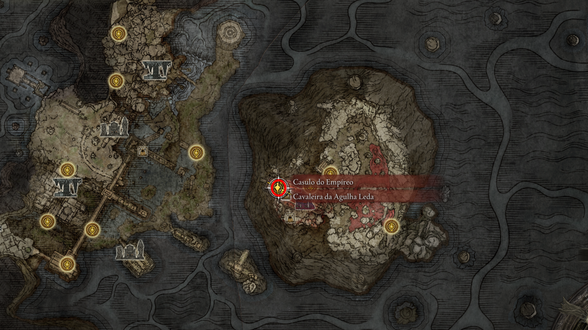
     
    <em>Figura 1: indo para DLC, local aonde falamos com a Leda.</em>

    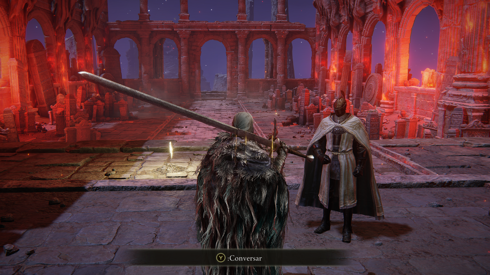
     
    <em>Figura 2: Interaja com ela para ouvir sobre os seguidores de Miquella.</em>

    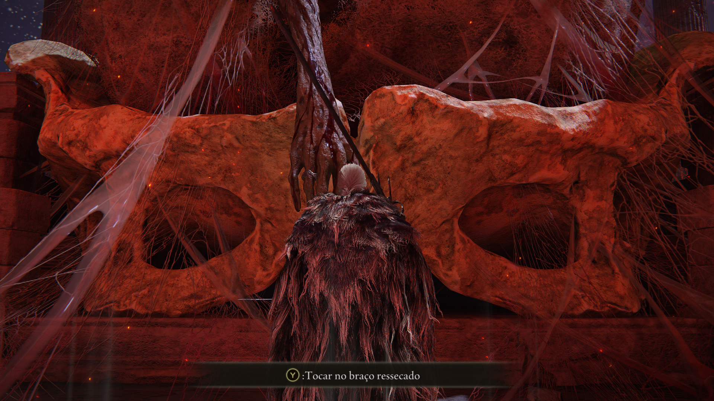
     
    <em>Figura 3: Toque no braço murcho que sai do casulo para ser transportado para a Planície das Sepulturas.</em>

---

## 🧭 01. Chegada: A Primeira Graça e o Mapa
Ao aparecer na Terra das Sombras, sua prioridade é orientação e o primeiro upgrade de poder.

* **Lore:** Você surge no Reino das Sombras, uma terra física que foi "separada" das Terras Intermédias.
* **Ação:** Siga para o norte até encontrar a primeira Graça (**Planície das Sepulturas**). 
* **Item:** O **Mapa da Região** está em um pilar logo à frente, visível da estrada principal.

    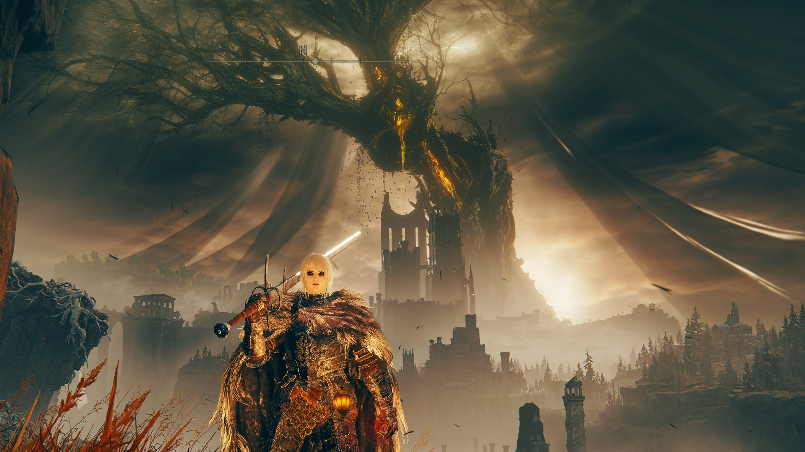
     
    <em>Figura 4: O primeiro vislumbre da Umbrárvore e o pilar do mapa.</em>

    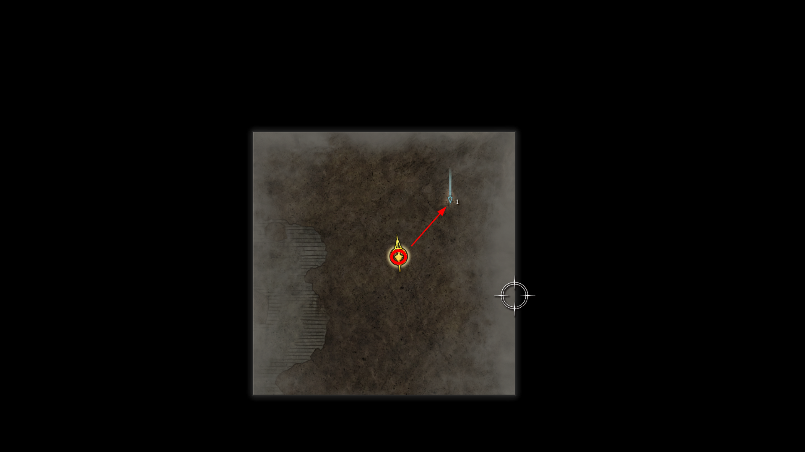
     
    <em>Figura 5: Pilar de coleta do Mapa: Planície das Sepulturas.</em>

---

## 🏛️ 02. Mausoléu Anônimo do Oeste (Opcional)
Localizado a noroeste da primeira Graça, este mausoléu guarda um dos guerreiros mais resilientes da planície. É um desafio curto, mas intenso, que serve como "batismo de fogo" para a escala de dano da DLC.

* **Descrição:** Uma estrutura solitária de pedra que abriga o repouso de um guerreiro de renome.
* **Inimigo:** **Cavaleiro do Cárcere** (Blackgaol Knight).
* **Estratégia:** Ele utiliza uma Espada Grande com ataques de vácuo e uma besta de repetição. Tente punir os ataques pesados dele ou use magias de longo alcance; ele possui alta estabilidade (Poise).

    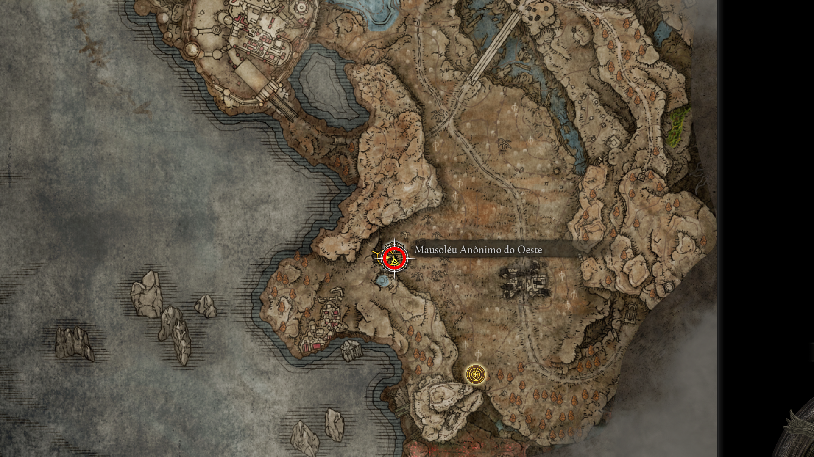
     
    <em>Figura 6: Entrada do Mausoléu Anônimo do Oeste.</em>

---

## ⚔️ 03. Set e Arma da Solidão (Recompensa)
Ao derrotar o Cavaleiro do Cárcere, você recebe um dos melhores conjuntos de armadura para o início da DLC, com altíssima negação de dano físico.

* **Descrição:** Equipamentos obtidos automaticamente após a vitória no Mausoléu.
* **Itens:** * **Espada Grande da Solidão** (Arma com excelente escalamento em Força).
    * **Set da Solidão** (Elmo, Armadura, Manoplas e Grevas).
* **Uso:** Excelente para builds de "Tanque" que precisam sobreviver aos combos rápidos dos chefes da Terra das Sombras.

    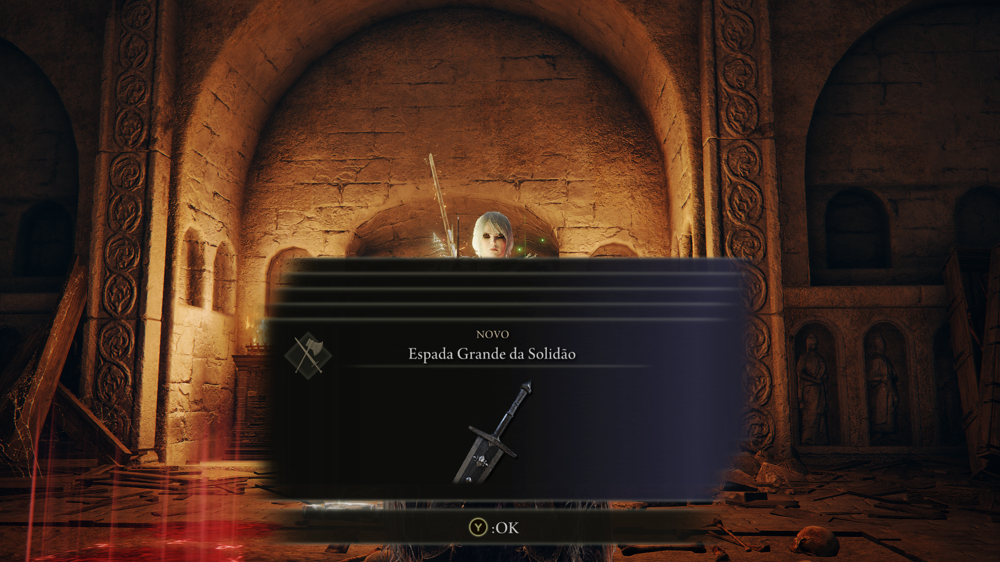
     
    <em>Figura 7: Coleta do Set e Espada da Solidão após o combate.</em>

---

## ⚔️ 04. Cinza de Guerra: Garra do Leão Selvagem
Esta é uma das melhores Cinzas de Guerra para builds de força, sendo uma evolução direta da Garra do Leão do jogo base.

* **Descrição:** Localizada em um acampamento de Messmer logo ao norte da planície inicial.
* **Inimigos:** Soldados de Messmer guardando o acampamento.
* **Item:** **Cinza de Guerra: Garra do Leão Selvagem** (Savage Lion's Claw).

    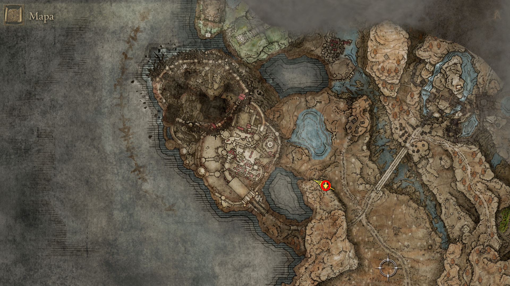
     
    <em>Figura 8: Acampamento onde se encontra a nova versão da Garra do Leão.</em>

--- 

## ✝️ 05. A Cruz de Três Caminhos e os NPCs
Seguindo a estrada para o noroeste, você encontrará a primeira **Cruz de Miquella**.

* **Descrição:** Estas cruzes marcam onde Miquella "descartou" partes de sua carne e linhagem divina.
* **NPCs:** Aqui você encontrará **Hornsent** (o nativo) e **Freyja** (a guerreira de Radahn). Fale com ambos até esgotar o diálogo para progredir suas quests.
* **Item Crítico:** Pegue o seu primeiro **Fragmento de Umbrárvore** no pé da cruz.

    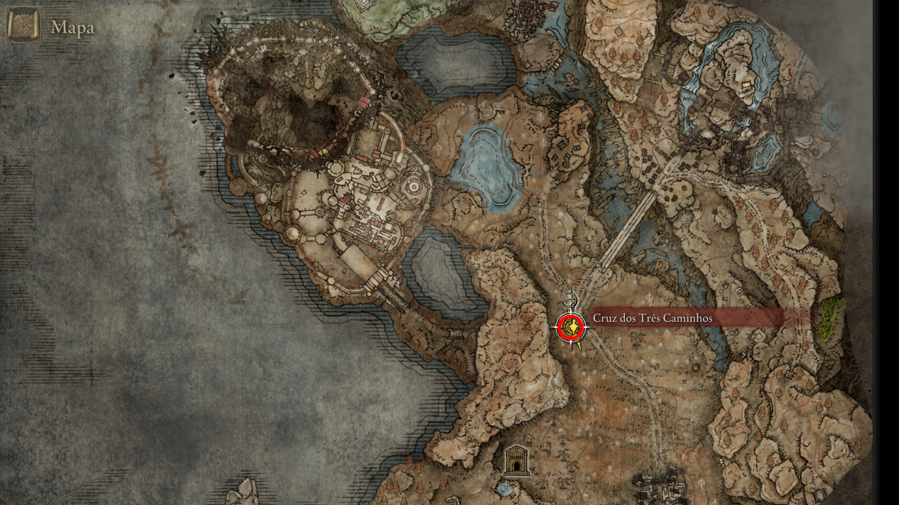
     
    <em>Figura 9: Interagindo com os seguidores de Miquella e coletando o Fragmento.</em>

---

## ⛪ 06. Igreja da Consolação (Sudeste)
Uma parada obrigatória no extremo sudeste da planície para obter upgrades massivos de poder inicial.

* **Descrição:** Uma igreja em ruínas guardada por um Cavaleiro de Fogo.
* **Boss (Elite):** **Cavaleiro de Fogo**. Ao derrotá-lo, você garante o **Grande Martelo de Aço Preto**.
* **Itens:** **2x Fragmentos de Umbrárvore** localizados no altar principal.

    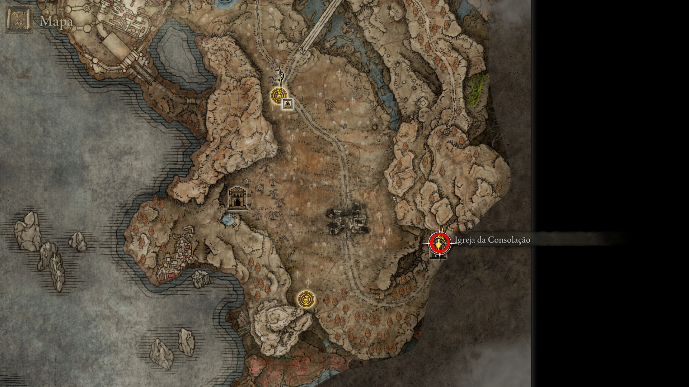
     
    <em>Figura 10: Altar da Igreja com os dois fragmentos e o combate contra o Cavaleiro.</em>

--- 

## 🏚️ 07. Ruínas Queimadas e o NPC de Pote
Indo em direção às ruínas próximas ao início, você encontrará um dos "Forrageiros" de Miquella.

* **Descrição:** Uma área devastada pelo fogo de Messmer.
* **NPCs:** Um NPC com pote na cabeça (Forager Brood). **Não o ataque!** Ele é amigável se você não o assustar.
* **Item:** Próximo a ele você encontrará um **Fragmento de Umbrárvore** e o **Livro de Receitas do Forrageiro [2]**.

    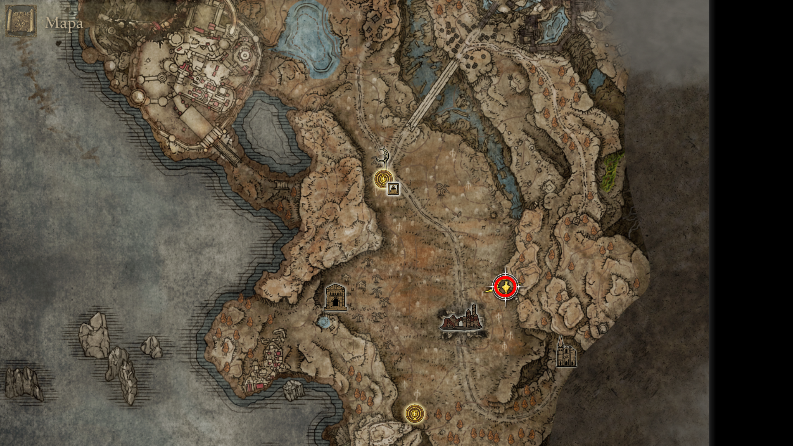
     
    <em>Figura 11: Localização do Fragmento nas Ruínas Queimadas.</em>

--- 

## 🛡️ 08. Cruz do Portão Principal: Moore e Ansbach
Localizada logo antes da entrada para Belurat, esta cruz reúne dois NPCs fundamentais para a economia e a lore da DLC.

* **Descrição:** Ponto de parada principal antes da primeira Legacy Dungeon.
* **NPCs:** **Moore** (o mercador) e **Sir Ansbach** (o erudito de Mohg).
* **Item:** **Fragmento de Umbrárvore** ao pé da cruz. Aproveite para comprar suprimentos com Moore.

    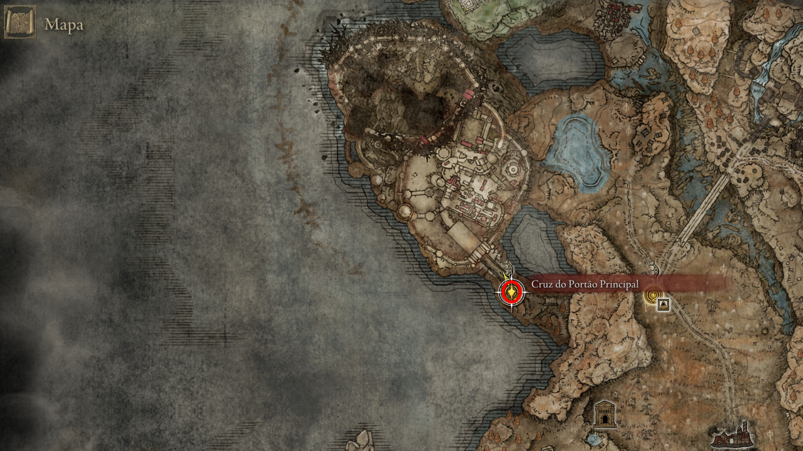
     
    <em>Figura 12: Encontro com Moore e Ansbach.</em>

---

## ⛰️ 09. Terminal da Estrada do Penhasco
Uma rota lateral que leva a uma vista panorâmica e mais upgrades.

* **Descrição:** Seguindo a oeste da Cruz do Portão Principal.
* **Ação:** Derrote o inimigo com um pote brilhante na cabeça para garantir o drop.
* **Item:** **Fragmento de Umbrárvore**.

    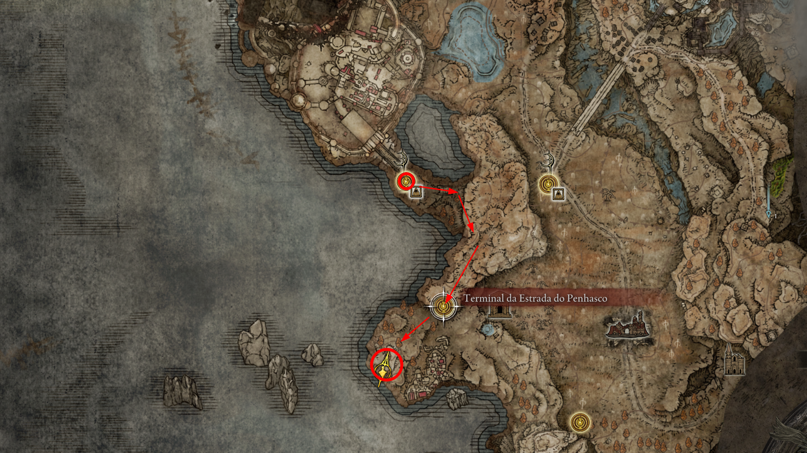
     
    <em>Figura 13: Caminho para o terminal da estrada do penhasco.</em>

--- 

## 🌉 10. Grande Ponte Ellac e Estátua de Marika
A ponte que conecta a planície inicial ao Castelo Ensis e Scadu Altus.

* **Descrição:** Uma ponte massiva guardada por balistas.
* **Ação:** No pé da estátua de Marika, antes de atravessar a ponte.
* **Item:** **Fragmento de Umbrárvore**.

    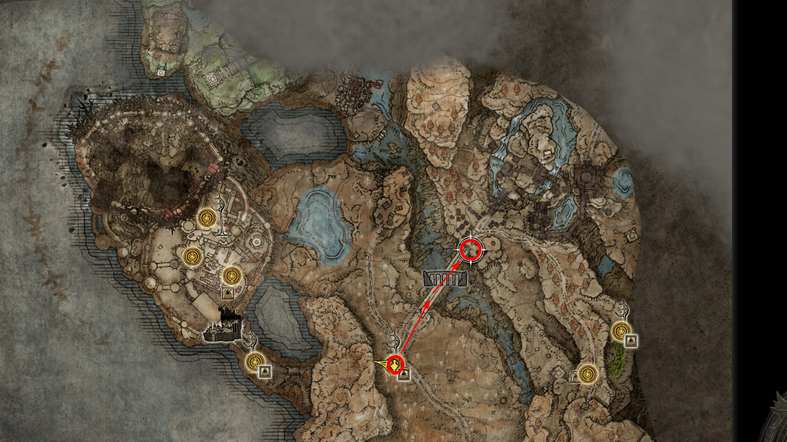
     
    <em>Figura 14: Fragmento localizado na base da Estátua de Marika.</em>

--- 

## 🧪 11. Cruz do Caminho do Pilar e Thiollier
Seguindo o caminho que sobe para o sul antes da ponte, você encontrará o NPC mais melancólico da DLC.

* **NPCs:** **Thiollier**, o mestre dos venenos.
* **Item:** **Fragmento de Umbrárvore** na cruz ao lado dele. Fale com ele sobre seu cansaço e venenos.

    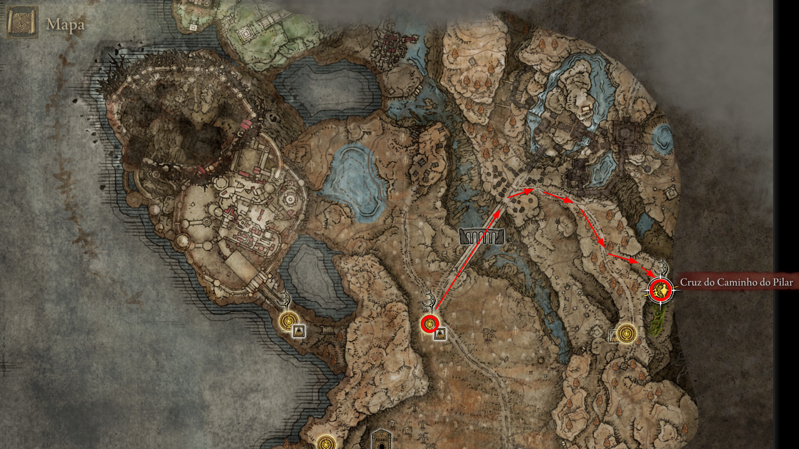
     
    <em>Figura 15: Encontro com Thiollier na Cruz do Caminho do Pilar.</em>

--- 

## 🍯 12. A Quest do Xarope Preto
Início da cadeia de missões que conecta Moore, Ansbach e Thiollier.

* **Ação:** Fale com Moore após encontrar os Forrageiros. Ele lhe entregará o **Xarope Preto** (Black Syrup).
* **Interação:** Leve o item até Sir Ansbach para que ele possa analisá-lo e te dar orientações.
* **Item:** **Xarope Preto**.

    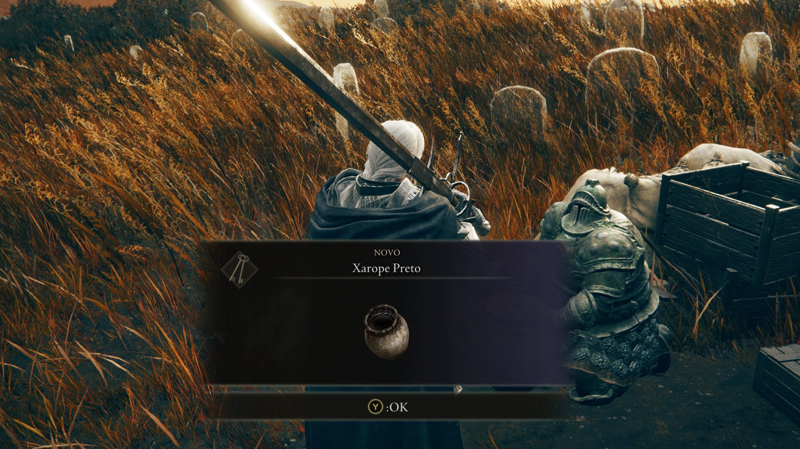
     
    <em>Figura 16: Obtendo o Xarope Preto com o Moore.</em>

--- 

## 😴 13. Mistura de Thiollier
Finalizando a etapa inicial da quest dos venenos.

* **Ação:** Entregue o xarope para Thiollier. Ele ficará grato e, após recarregar a área, te dará um item especial.
* **Item:** **Mistura de Thiollier** (Thiollier's Concoction). 
* **Nota:** Este item é necessário para a quest da Santa Trina futuramente.

    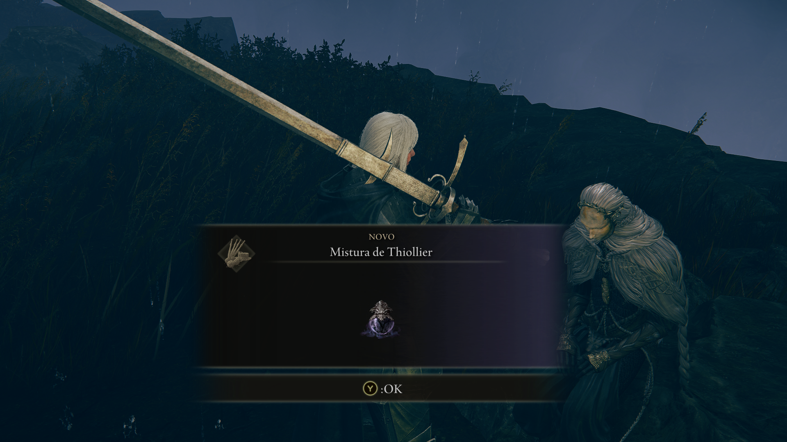
     
    <em>Figura 17: Thiollier entregando sua mistura especial.</em>

--- 

## 🐲 14. Igon e o Caminho do Pico Escarpado
O encontro com o caçador de dragões mais icônico da expansão.

* **Descrição:** Localizado logo à frente da Graça "Ponto de Paragem do Caminho do Pilar".
* **NPCs:** **Igon**. Ele estará gritando de dor no chão.
* **Ação:** Fale com ele exaustivamente. Ele falará sobre o dragão Bayle, o Terrível. Recarregue o jogo se necessário para liberar novos diálogos.

    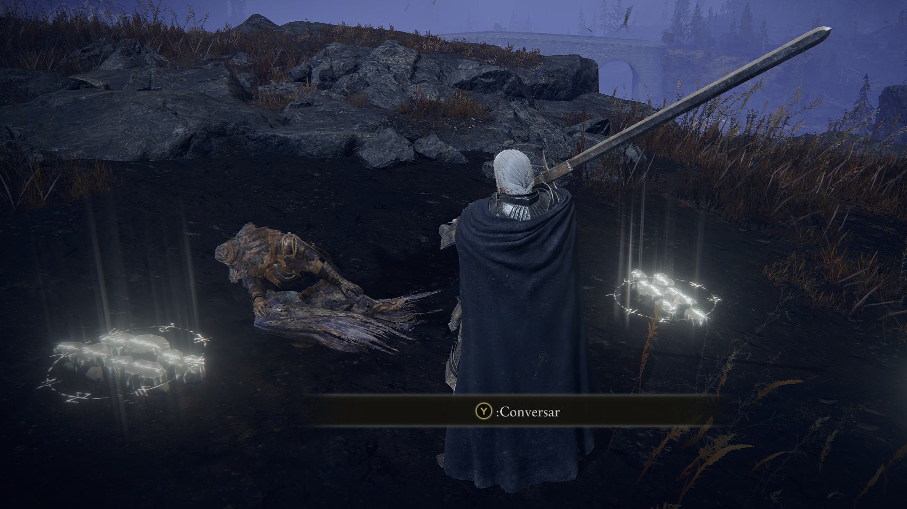
     
    <em>Figura 18: Conversando com Igon sobre sua caçada eterna.</em>

---

[⬅️ Voltar para o README.md](../README.md) | [Prosseguir Belurat, Assentamento da Torre ➡️](../18_belurat_tower_settlement/route.md)

