# 🏯 Rota de Exploração: 18. Belurat, Assentamento da Torre

> **Status:** Primeira Legacy Dungeon.
> **Dificuldade:** Média/Alta.

---

## 🧭 01. Entrada em Belurat e Primeira Cinza
Ao cruzar o portão principal, a verticalidade da torre se torna evidente. O foco inicial é coleta e sobrevivência.

* **Descrição:** Logo após subir a primeira escadaria, antes de entrar nos corredores estreitos, olhe para a direita.
* **Item:** **Cinza de Espírito Reverenciada (1)**.

    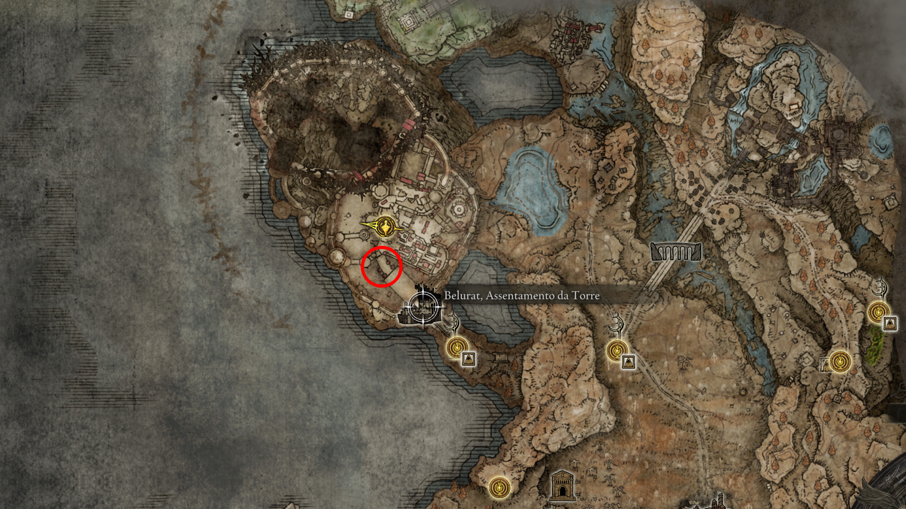
     
    <em>Figura 1: Coleta da primeira cinza espiritual logo na entrada.</em>

--- 

## 🔑 02. Chave do Depósito (Storeroom Key)
Item essencial para progredir na quest da Progenitora Hornsent.

* **Descrição:** Localizada no nível superior, em uma sala acessível pelos telhados ou passando pela área dos escorpiões.
* **Item:** **Chave do Depósito**.

    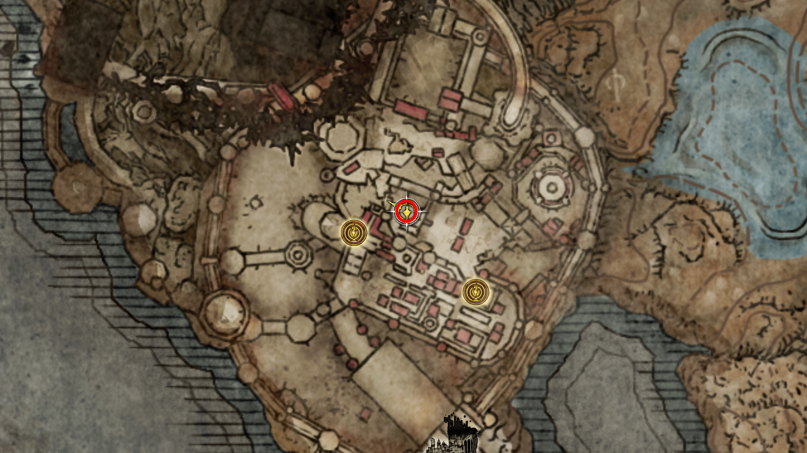
     
    <em>Figura 2: Localização da sala que guarda a chave.</em>

    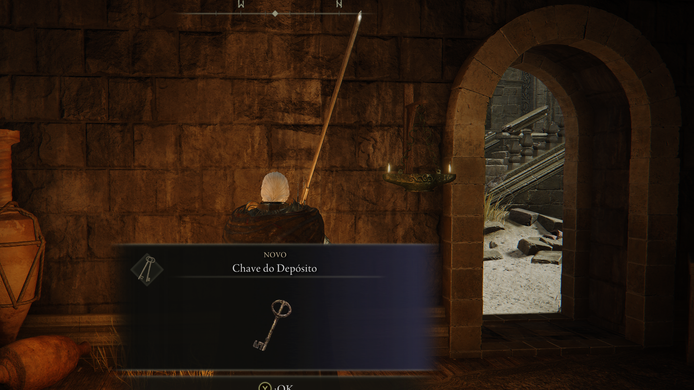
     
    <em>Figura 3: Coleta da Chave do Depósito.</em>

--- 

## ⚙️ 03. Atalho: Elevador do Depósito
Após obter a chave, você pode liberar um dos atalhos mais importantes de Belurat, conectando a área superior à primeira Graça.

* **Descrição:** Ative o elevador na sala próxima ao depósito para facilitar o "runback" caso morra.

    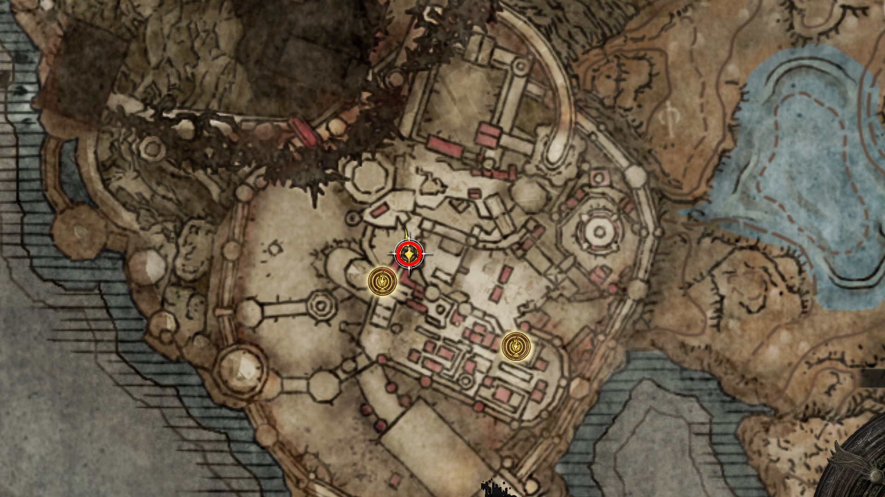
     
    <em>Figura 4: Ativação do elevador de serviço.</em>

--- 

## ✝️ 04. Fragmento de Umbrárvore na Cruz de Miquella
O ponto de descanso e upgrade no meio da subida da torre.

* **Descrição:** Localizada no pátio antes de subir a escadaria principal para o boss.
* **NPCs:** Sir Ansbach e Moore podem ter diálogos adicionais aqui se você seguiu a rota 17 corretamente.
* **Item:** **Fragmento de Umbrárvore**.

    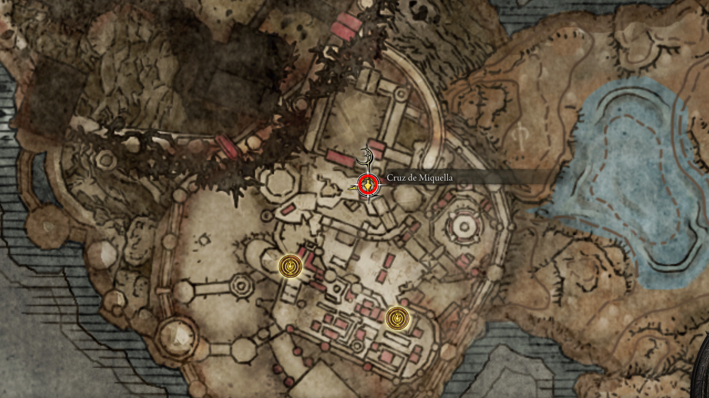
     
    <em>Figura 5: Cruz de Belurat e coleta do fragmento.</em>

--- 

## 🏹 05. Coleta: Arco Ósseo (Opcional)
Uma das novas armas utilitárias da DLC, excelente para atrair inimigos de longe.

* **Descrição:** No nível superior, após passar pela área dos escorpiões e subir a escada de mão.
* **Item:** **Arco Ósseo** (Bone Bow).

    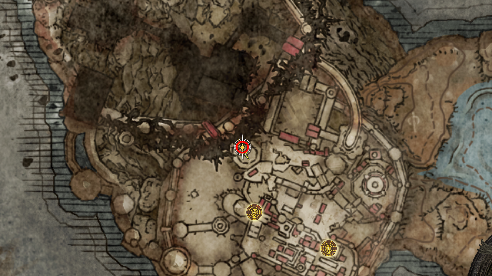
     
    <em>Figura 6: Localização tática do Arco Ósseo.</em>

--- 

## 💍 06. Talismã: Buquê Seco (Opcional)
Um talismã situacional, mas poderoso para builds que utilizam invocações.

* **Descrição:** Em um altar escondido perto da torre do elevador.
* **Item:** **Buquê Seco** (Dried Bouquet).

    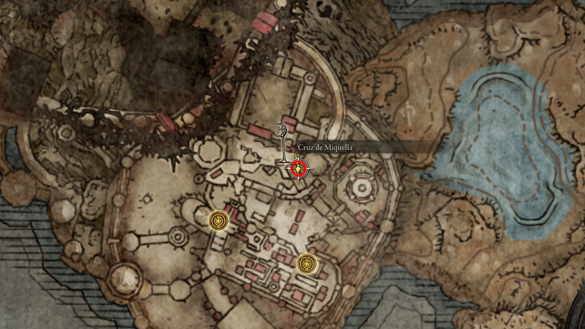
     
    <em>Figura 7: Altar de coleta do Buquê Seco.</em>

---  

## 👵 07. Progenitora Hornsent (Anciã Enviada do Chifre)
A guardiã dos segredos de Belurat e peça chave para a lore dos Hornsent.

* **Descrição:** Use a Chave do Depósito para abrir a porta no andar superior.
* **NPCs:** Hornsent Grandam.
* **Dica:** Retorne aqui após derrotar o boss da área usando a máscara dele para novos diálogos.

    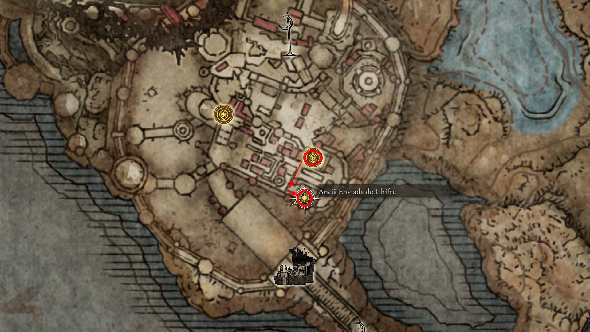
     
    <em>Figura 8: Localização da porta do Depósito.</em>

    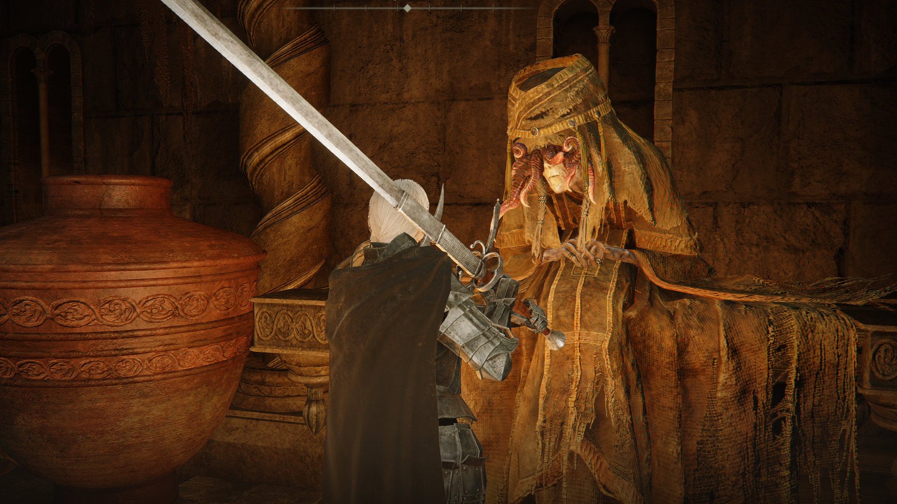
     
    <em>Figura 9: Diálogo inicial com a Anciã.</em>

--- 

## 🗡️ 08. Invasão: Queelign, o Cavaleiro de Fogo
O defensor de Messmer tenta impedir sua subida pela torre.

* **Descrição:** No pátio com água e estátuas antes da subida final.
* **Inimigo:** Queelign (Invasor).
* **Item:** **Insígnia da Cruzada**.

    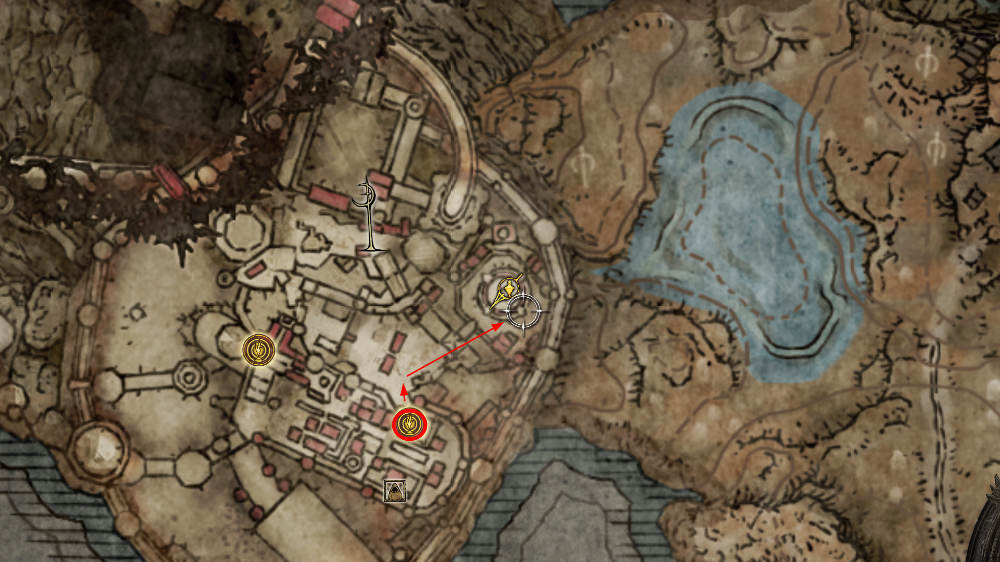
     
    <em>Figura 10: Combate contra o invasor Queelign no pátio alagado.</em>

--- 

## ✨ 09. Cinzas de Espírito Reverenciadas (Caminho do Boss)
Dois upgrades finais para suas cinzas antes do desafio principal.

* **Descrição:** A primeira está com um NPC de pote próximo à ponte; a segunda está no altar final.
* **Itens:** **Cinza de Espírito Reverenciada (2 e 3)**.

    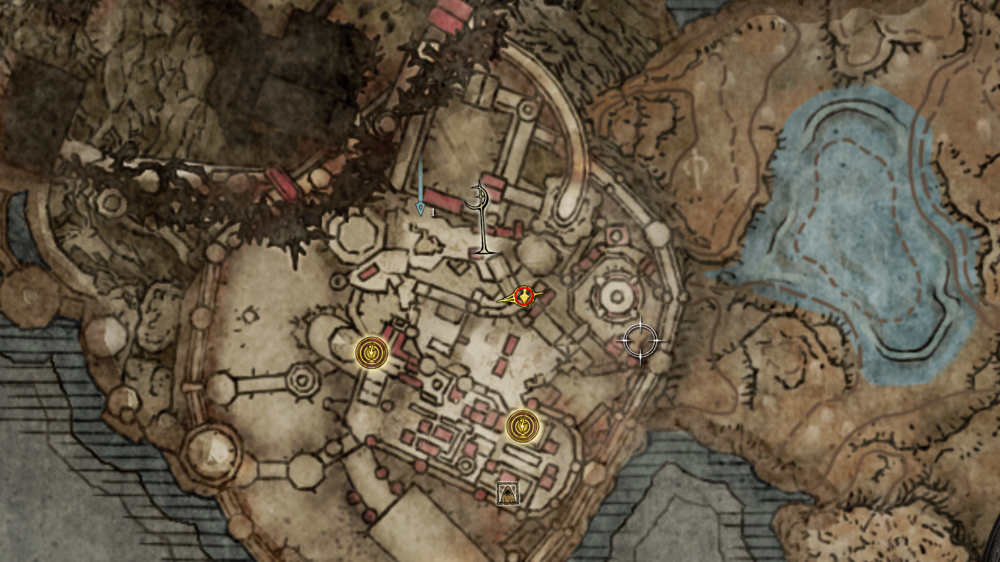
     
    <em>Figura 11: Drop do inimigo com pote.</em>

    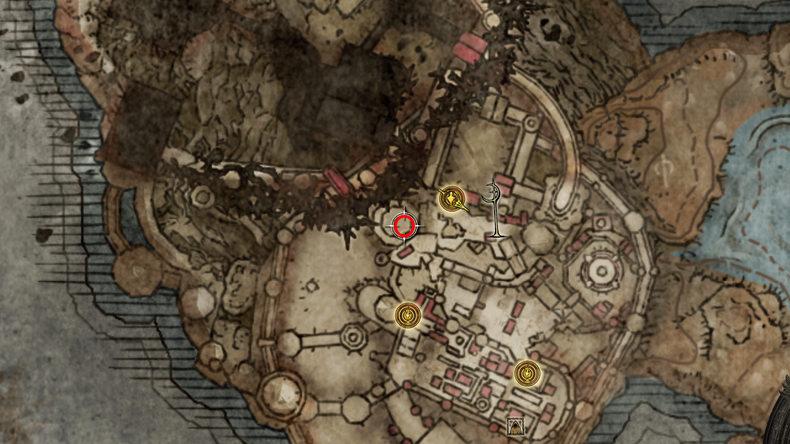
     
    <em>Figura 12: Coleta no altar final de Belurat.</em>

--- 

## 🏁 10. Graça: Frente do Palco
O último ponto de descanso antes do primeiro boss de reminiscência da DLC.

* **Descrição:** Ative para garantir o checkpoint para a luta contra a Besta Divina.

    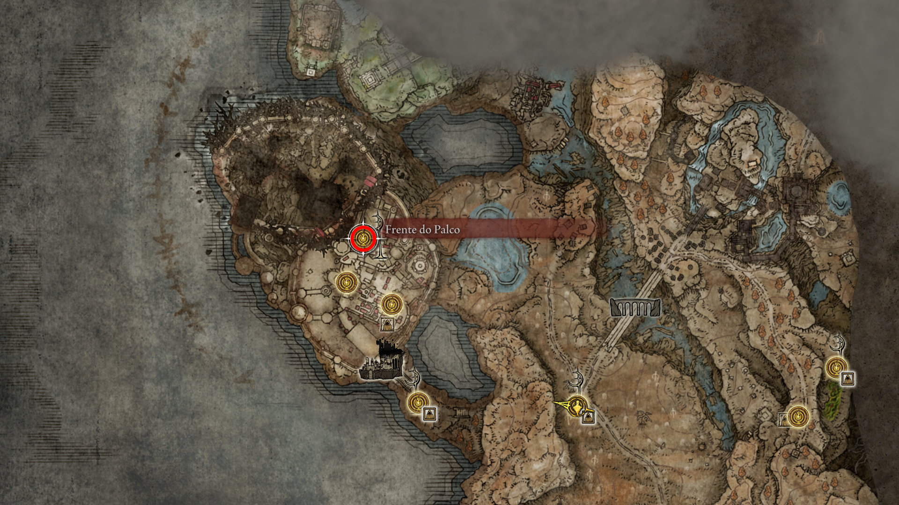
     
    <em>Figura 13: Graça Frente do Palco ativada.</em>

---

## 🦁 11. O Boss: Besta Divina Dançante
A luta contra o primeiro grande chefe de reminiscência da DLC.

* **Descrição:** Use o sinal de invocação dourado do lado de fora da névoa.
* **NPCs:** **Freyja (Juba Vermelha)** está disponível para ajudar no combate.
* **Estratégia:** O boss alterna entre gelo, raio e vento. Mantenha a Freyja viva para que ela chame a atenção do boss enquanto você ataca pelos flancos.

    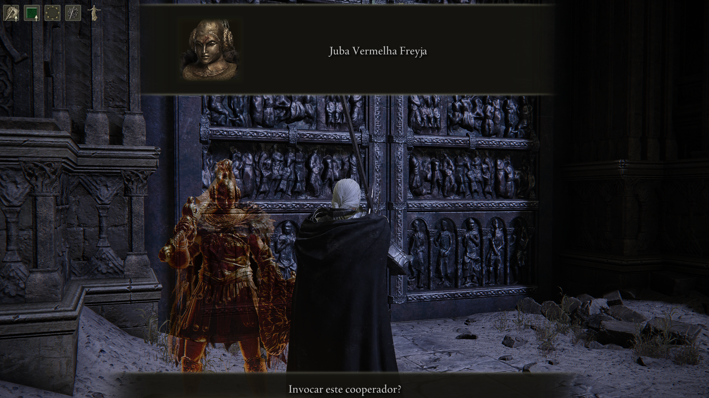
     
    <em>Figura 14: Sinal de invocação da Freyja antes da névoa do boss.</em>

--- 

## 🏆 12. Recompensas da Vitória
Itens fundamentais para o progresso da lore e novas builds.

* **Descrição:** Obtidos automaticamente ao derrotar a Besta Divina Dançante.
* **Itens:** * **Lembrança da Besta Divina** (Pode ser trocada na Enia por arma ou feitiço).
    * **Cabeça de Fera Divina** (Equipamento essencial para falar com a Anciã).

    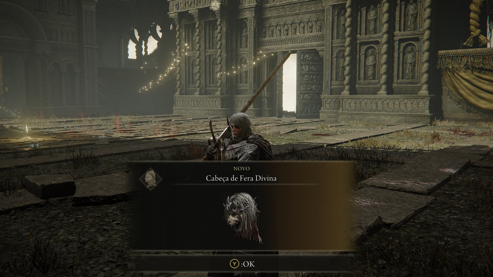
     
    <em>Figura 15: Coleta da Cabeça de Fera Divina e Lembrança.</em>

--- 

## ✨ 13. Cinza Espirital Reverenciada Pós-Boss
Não saia da arena sem subir o elevador final da torre.

* **Descrição:** Após a luta, pegue o elevador no fundo da arena e siga pelo caminho linear.
* **Item:** **Cinza Espirital Reverenciada (4)**.

    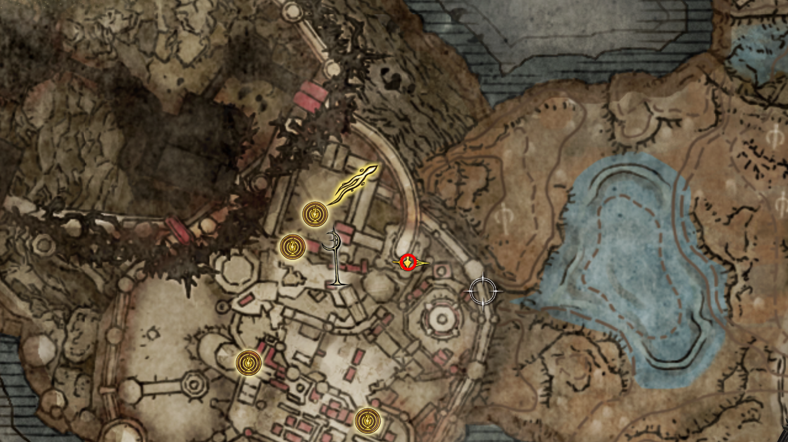
     
    <em>Figura 16: Localização da cinza no topo da torre de Belurat.</em>

--- 

## 🎭 14. Ritual da Progenitora Hornsent
Um segredo fundamental para obter itens de regeneração e feitiços.

* **Descrição:** Volte ao depósito e **equipe a Cabeça de Fera Divina** antes de falar com ela.
* **NPCs:** Hornsent Grandam (Anciã).
* **Item:** **Feitiço: Espírito Protetor** (Vigilant Guardian). Ela reconhecerá você como um enviado divino.

    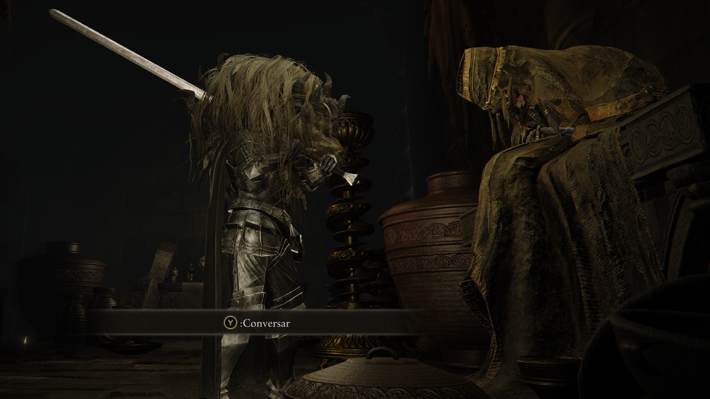
     
    <em>Figura 17: Falando com a Anciã usando a máscara do Boss.</em>

--- 

## 🍲 15. O Ensopado de Escorpião
Item de quest e consumível potente.

* **Descrição:** Recarregue a área na Graça e fale com a Anciã novamente.
* **NPCs:** Hornsent Grandam.
* **Item:** **Ensopado de Escorpião** (Aumenta a negação de dano físico e recupera HP gradualmente).

    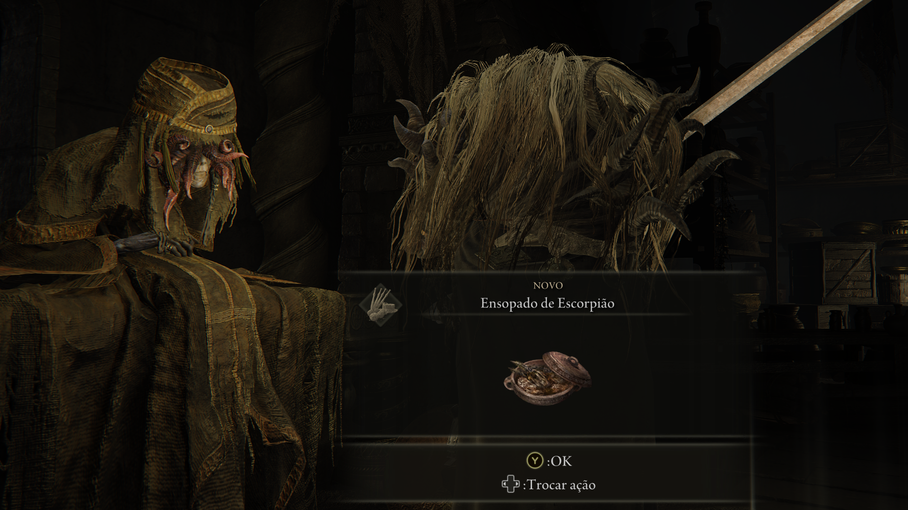
     
    <em>Figura 18: Recebendo o Ensopado de Escorpião.</em>

--- 

## ⚔️ 16. Atualização de Missão: Freyja
Reportando o progresso para a aliada de Miquella.

* **Descrição:** Viaje para a Graça **Cruz de Três Caminhos**.
* **NPCs:** Freyja (Juba Vermelha).
* **Ação:** Fale com ela sobre a batalha em Belurat. Ela comentará sobre sua força e o progresso da jornada.

--- 

## 🗺️ 17. O Mapa do Hornsent e o Ensopado
Finalizando as interações iniciais com o nativo de chifres.

* **Descrição:** Localize o Hornsent (ele costuma estar na Cruz de Três Caminhos ou na Cruz da Estrada Principal).
* **NPCs:** Hornsent.
* **Ação:** Entregue o **Ensopado de Escorpião** para ele.
* **Recompensa:** **3x Face da Fornalha** (Furnace Face) e ele lhe dará um mapa indicando as próximas Cruzes de Miquella.

    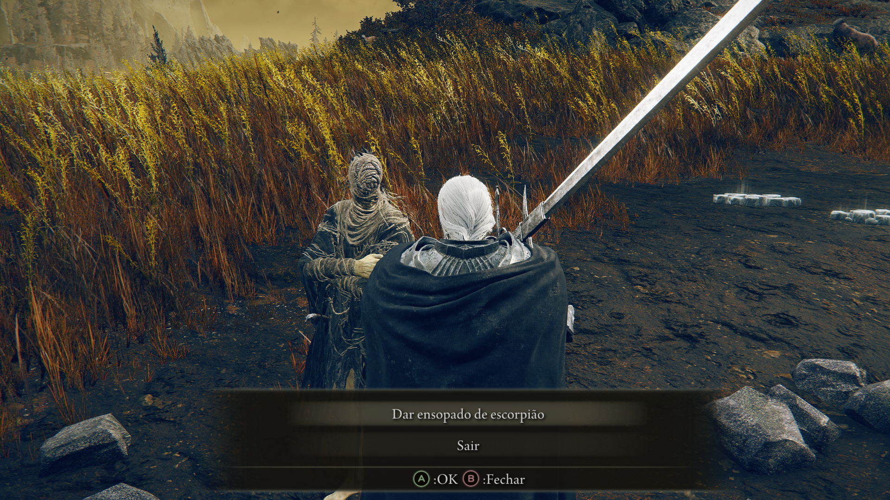
     
    <em>Figura 19: Hornsent entregando as Faces da Fornalha após o ensopado.</em>

--- 

[⬅️ Voltar para o README.md](../README.md) | [Prosseguir para o Castelo Ensis ➡️](../19_castle_ensis/route.md)