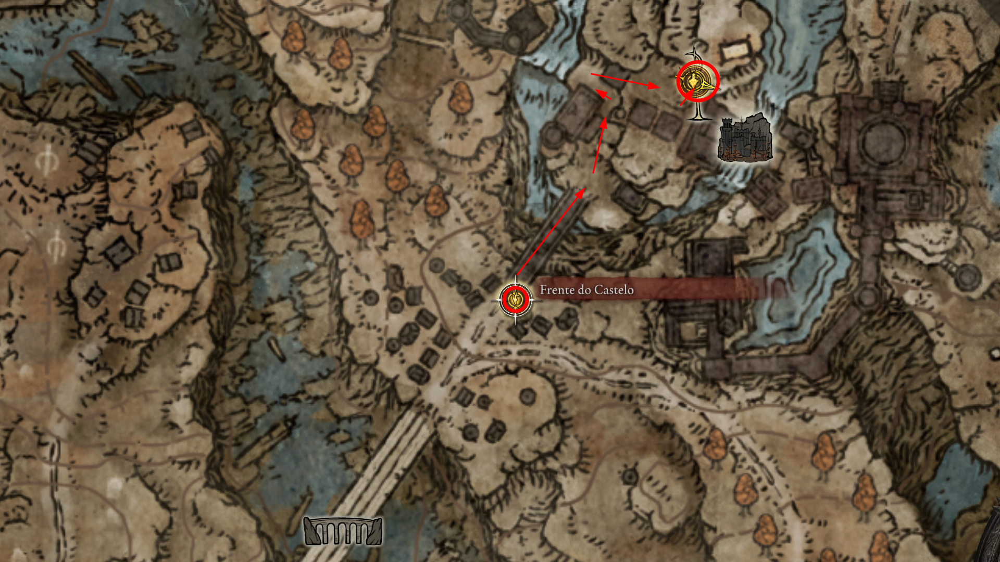
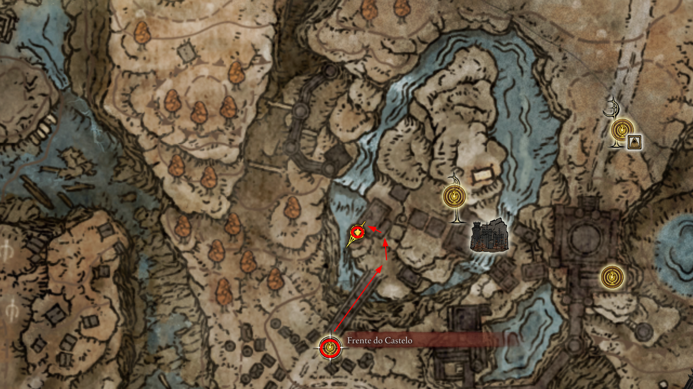
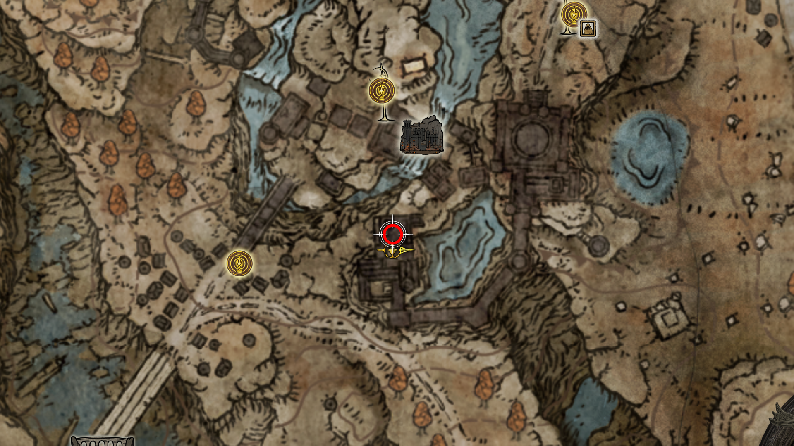
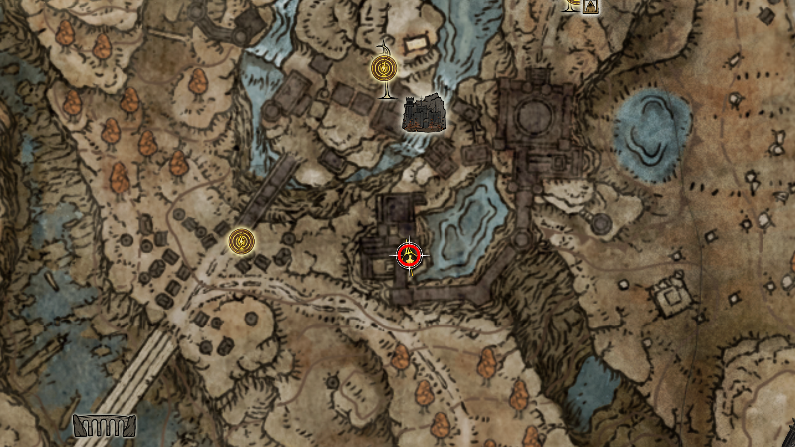
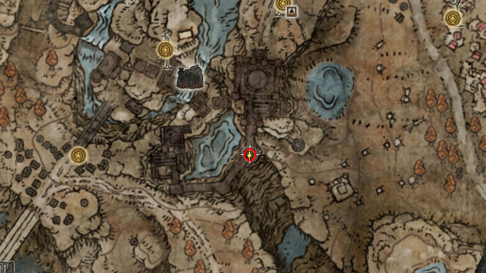
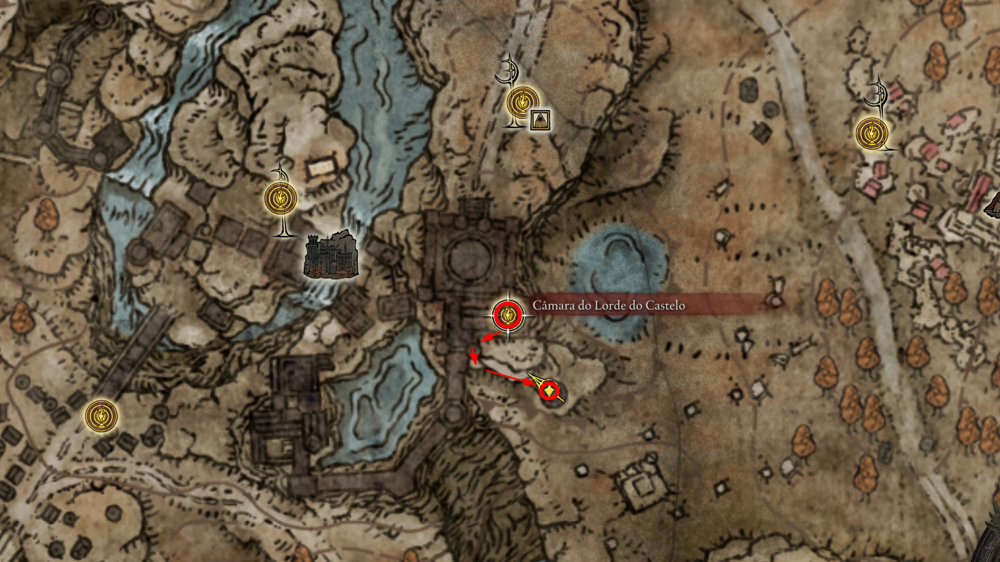
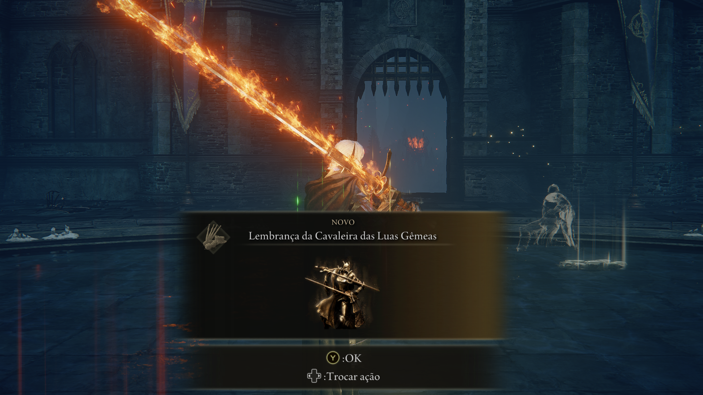

# 🏰 Rota de Exploração: 19. Castelo Ensis

> **Status:** Ponto de transição para o Scadu Altus.
> **Dificuldade:** Alta.
> **Foco:** Rellana, a Milady e Fragmentos Críticos.

O Castelo Ensis é a fortaleza que guarda a passagem para as terras altas. Ele é comandado por **Rellana**, a irmã de Rennala (Rainha da Lua Cheia), que renunciou à sua linhagem real para seguir Messmer em sua cruzada.

---

## 🧭 01. Posto de Controle de Ensis (Entrada)
Antes de cruzar a ponte principal, garanta o upgrade.

* **Descrição:** Logo ao chegar na Graça "Posto de Controle do Castelo Ensis".
* **NPCs:** Você encontrará uma mensagem de Leda no chão.
* **Item:** **Fragmento de Umbrárvore (1)** localizado logo ao lado da Graça, em frente a uma pequena estátua.

    
     
    <em>Figura 1: Coleta do primeiro fragmento antes da entrada do castelo.</em>

---

## 🗡️ 02. Coleta: Milady (Nova Categoria)
Uma das armas mais elegantes da DLC e a primeira da categoria **Grandes Espadas Ligeiras**.

* **Descrição:** Após cruzar a ponte e subir as escadas, procure por uma torre de vigia à esquerda.
* **Item:** **Milady** (Light Greatsword).
* **Lore:** Uma arma que favorece a destreza e o estilo de combate fluído dos cavaleiros de elite de Ensis.

    
     
    <em>Figura 2: Localização da Milady na torre de vigia.</em>

---

## 🛡️ 03. O Portão Principal e a Cavaleira Moonrithyll
O primeiro grande bloqueio interno do castelo.

* **Descrição:** Siga pelo acampamento, ative a alavanca para abrir o portão de ferro e prepare-se para o combate contra a defensora da área.
* **Inimigo:** **Cavaleira Moonrithyll** (Moonrithyll, Carian Knight).
* **Item:** **Espada da Cavaleira Moonrithyll** (Espada Colossal com dano mágico).

    
     
    <em>Figura 3: Combate contra a Cavaleira Moonrithyll após a abertura do portão.</em>

--- 

## 💍 04. Talismã: Camafeu de Rellana
Essencial para builds que usam Postura (Stance).

* **Descrição:** Localizado em uma capela guardada por um Cavaleiro de Carian, logo após a área da Moonrithyll.
* **Item:** **Camafeu de Rellana** (Rellana's Cameo).
* **Efeito:** Aumenta o dano de ataques feitos após manter uma postura por um curto tempo.

    
     
    <em>Figura 4: Capela interna guardando o talismã da suserana.</em>

---

## 🔑 05. Chave de Espada Imbuída
Um item de utilidade que servirá para desbloquear um teleporte secreto mais à frente na DLC.

* **Descrição:** Localizada em um baú de madeira dentro de uma pequena torre, próxima à área da cachoeira no castelo.
* **Item:** **Chave de Espada Imbuída** (Imbued Sword Key).

    
     
    <em>Figura 5: Baú contendo a Chave de Espada Imbuída.</em>

--- 

## ⚔️ 06. Cinza de Guerra: Postura da Asa
A habilidade suprema para a arma que você coletou no início do castelo.

* **Descrição:** Localizada no topo de uma torre de vigia na parte final da exploração, antes de chegar ao pátio da boss.
* **Item:** **Cinza de Guerra: Postura da Asa** (Wing Stance).
* **Uso:** Essencial para a arma Milady; permite ataques de estocada e combos aéreos potentes.

    
     
    <em>Figura 6: Baú no topo da torre contendo a Postura da Asa.</em>

---

## 🤝 07. Invocação: Needle Knight Leda
Para progredir na lore e ter ajuda no boss.

* **Descrição:** Logo antes da névoa de Rellana, você verá o sinal de invocação dourado no chão.
* **NPCs:** **Leda**. Invocá-la aqui não é obrigatório para a quest, mas garante diálogos adicionais e ela serve como excelente distração contra a agressividade da boss.

---

## 🌙 08. Boss: Rellana, Cavaleira da Lua Gêmea
O ápice da técnica de combate Carian fundida com as chamas de Messmer.

* **Estratégia:** Ela ataca com magia (espada azul) e fogo (espada vermelha). No estágio final, ela usará o ataque supremo das Luas Gêmeas — você deve **pular** as duas primeiras ondas de choque e esquivar da explosão final.
* **Drops:** **Lembrança da Cavaleira da Lua Gêmea**.
* **Lore:** Ao derrotá-la, você entende que ela era a "Lua" que iluminava o caminho sombrio de Messmer.

    
     
    <em>Figura 7: Derrotando a suserana do castelo.</em>

> ⚠️ **ALERTA DE QUEST:** Ao derrotar Rellana e passar pela porta atrás da arena dela, você chegará em Scadu Altus. Dar alguns passos nessa nova região causará a **Quebra da Grande Runa** de Miquella. Assim que isso acontecer, o encanto sobre os NPCs será desfeito. **Antes de explorar o Umbra Altus, retorne a todos os NPCs que você conheceu (Moore, Thiollier, Hornsent, Ansbach, Freyja) para novos diálogos e escolhas de quest.**

---

[⬅️ Voltar para o README.md](../README.md) | [Prosseguir para o Umbra Altus ➡️](../20_scadu_altus/route.md)