# 🌅 Rota de Exploração: 20. Altus da Sombra (Scadu Altus)

> **Status:** Região central da Terra das Sombras.
> **Foco:** Progressão de NPCs, Coleta massiva de Fragmentos e Quebra da Runa.

---

## 🧭 01. Encontro na Cruz da Estrada Principal
Logo após vencer Rellana e sair do castelo, você encontrará os primeiros aliados de Miquella.

* **Descrição:** Converse com os NPCs próximos à Graça para entender o objetivo atual: o Castelo das Sombras.
* **NPCs:** **Leda** e **Hornsent** (Enviado do Chifre).
* **Item:** Mapa das Cruzes.

    
     
    <em>Figura 1: Reagrupamento dos Maculados na saída do Castelo Ensis.</em>

--- 

## 🛡️ 02. Atalho e Puzzle: Forte da Reprimenda
Um caminho alternativo que conecta a Caverna do Rio Ellac ao platô superior.

* **Descrição:** Existe uma fonte espiritual (tufo de vento) selada. Para liberar, você pode destruir o selo de pedras próximo ou usar a **Algema de Margit/Mohg** para ativar o mecanismo à distância.
* **Objetivo:** Deixar o caminho liberado para facilitar o trânsito entre as regiões baixas e o Altus.

    
     
    <em>Figura 2: Utilizando itens de utilidade para desbloquear o acesso ao Forte.</em>

---

## ⚔️ 03. Exploração do Forte da Reprimenda (Loot de Elite)
O Forte guarda itens cruciais para builds de força, fé e defesa contra fogo.

### A. Cinza da Guerra: Aspectos do Crisol (Asas)
* **Descrição:** Obtida ao derrotar o Cavaleiro do Crisol que protege o pátio interno do forte. Ele utiliza ataques aéreos devastadores.
* **Item:** **Cinza de Guerra: Aspectos do Crisol (Asas)**.

    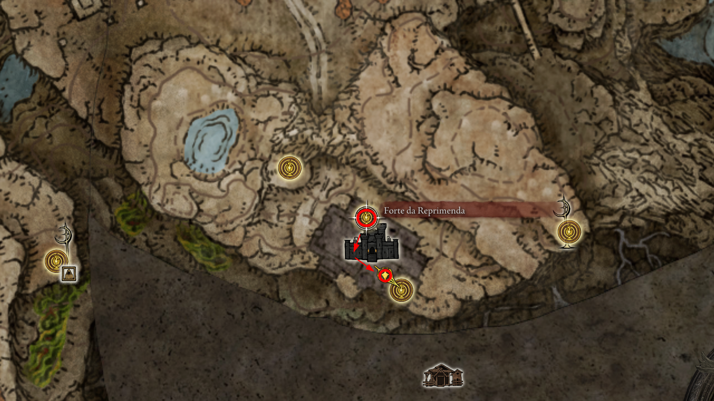
     
    <em>Figura 3a: Localização do Cavaleiro no pátio interno.</em>

    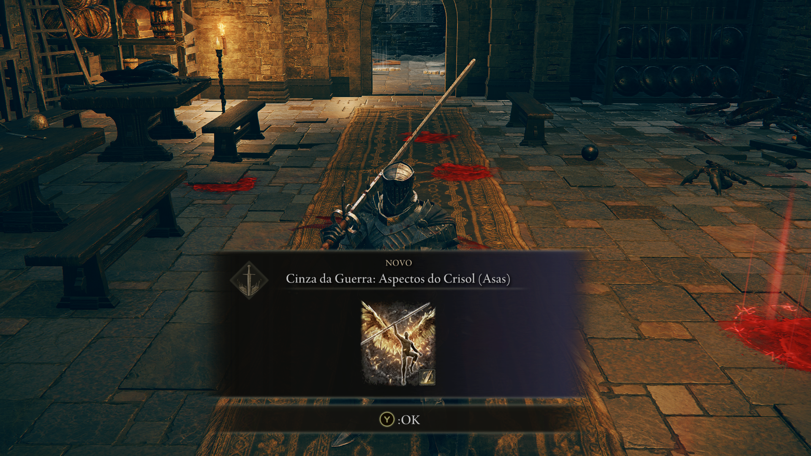
     
    <em>Figura 3b: Cinza de Guerra que permite investidas voadoras.</em>

### B. Livro de Receitas do Devoto das Batalhas [2]
* **Descrição:** Encontrado em um cadáver nos níveis superiores das muralhas, após subir as escadas do pátio.
* **Item:** **Livro de Receitas do Devoto das Batalhas [2]**.

    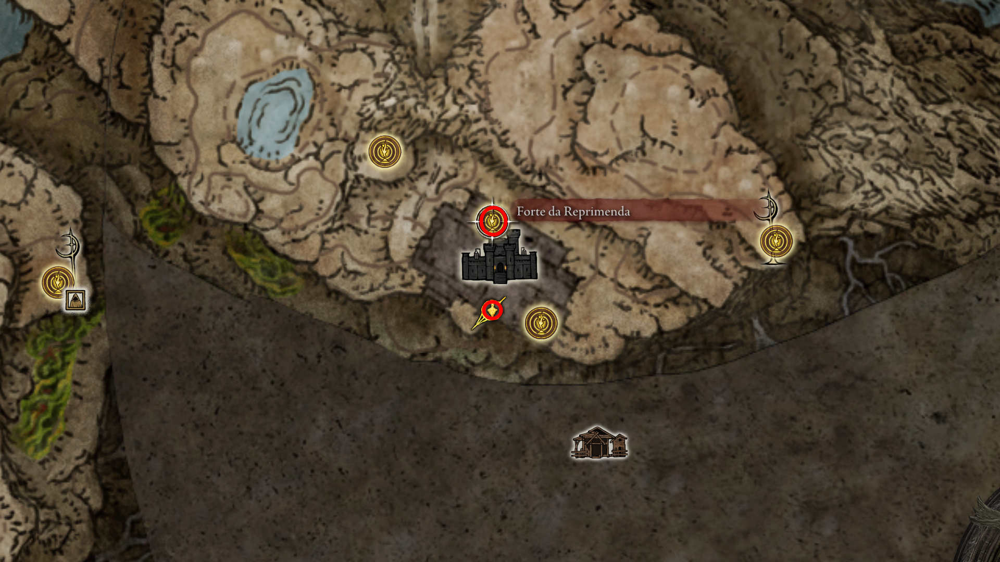
     
    <em>Figura 3c: Localização do livro nas muralhas.</em>

    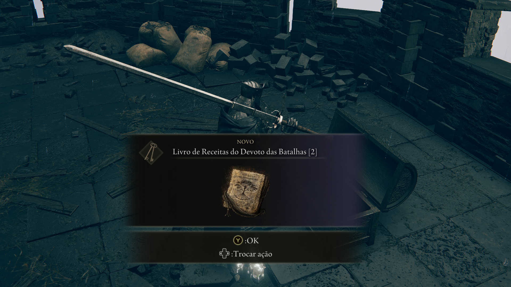
     
    <em>Figura 3d: Receita para novos consumíveis de batalha.</em>

### C. Talismã de Draco de Fogo +3
* **Descrição:** Escondido em um baú em uma sala atrás da área das fossas. Essencial para enfrentar os inimigos do Castelo das Sombras.
* **Item:** **Talismã de Draco de Fogo +3** (Aumenta massivamente a negação de dano de fogo).

    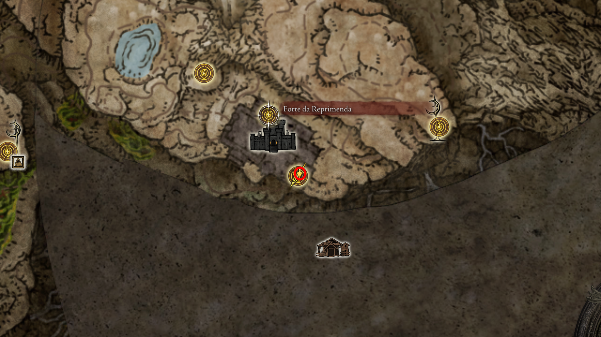
     
    <em>Figura 3e: Localização do baú de tesouro.</em>

    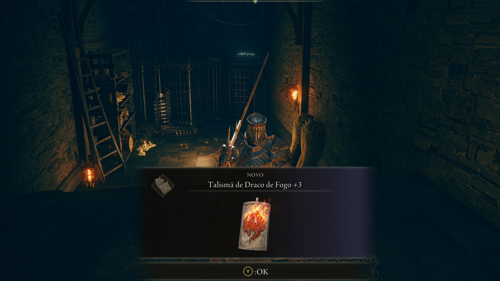
     
    <em>Figura 3f: Um dos melhores talismãs defensivos da DLC.</em>

### D. Íris da Ocultação
* **Descrição:** Dropada ao derrotar o Matador de Agouros (*Omenkiller*) que habita a área escura do subsolo do forte.
* **Item:** **Íris da Ocultação** (Usada em quests de NPCs).

    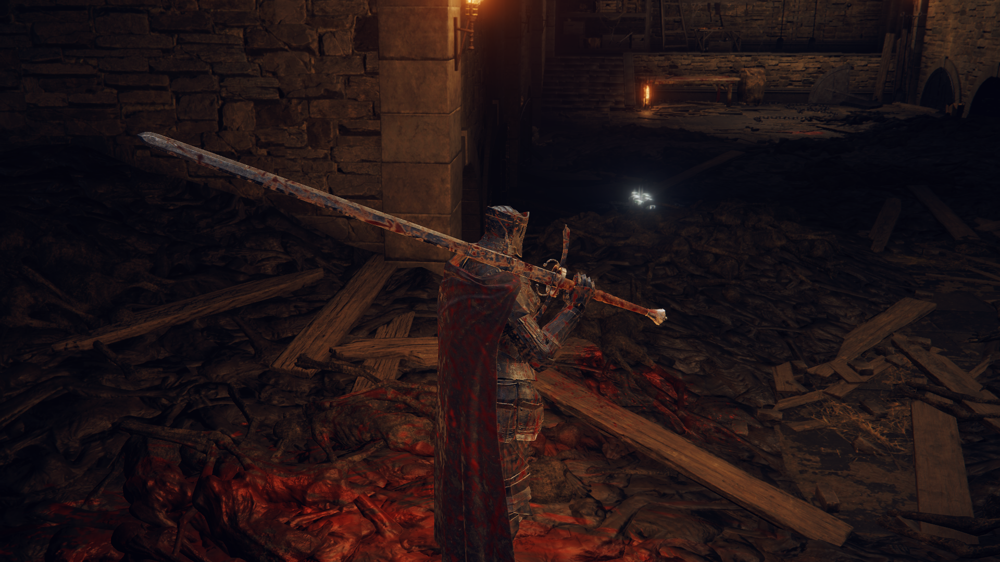
     
    <em>Figura 3g: O subsolo onde o inimigo de elite reside.</em>

    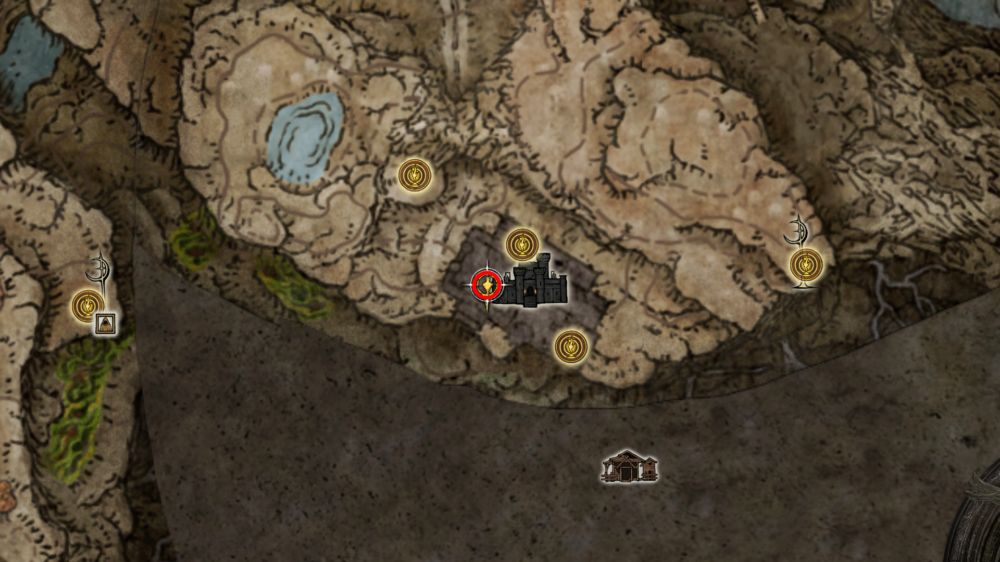
     
    <em>Figura 3h: Material de quest importante.</em>

### E. Cinzas de Soldado de Messmer
* **Descrição:** Encontradas em um corpo na borda de uma das torres de vigia externas do forte.
* **Item:** **Cinzas de Soldado de Messmer** (Invocação de grupo).

    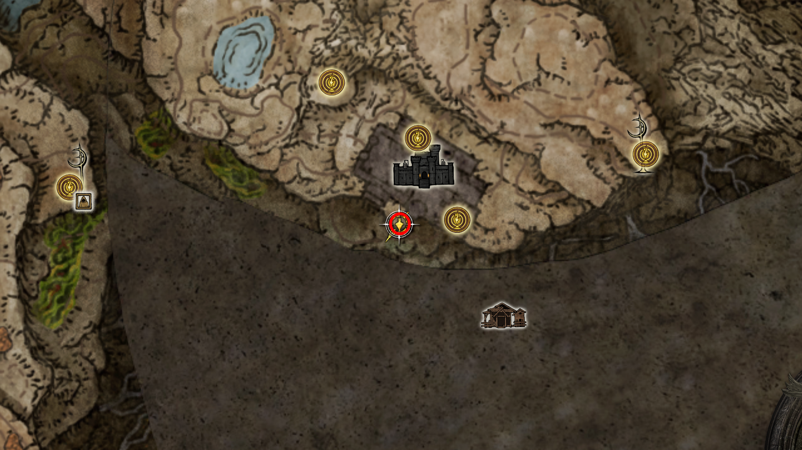
     
    <em>Figura 3i: Localização da invocação.</em>

    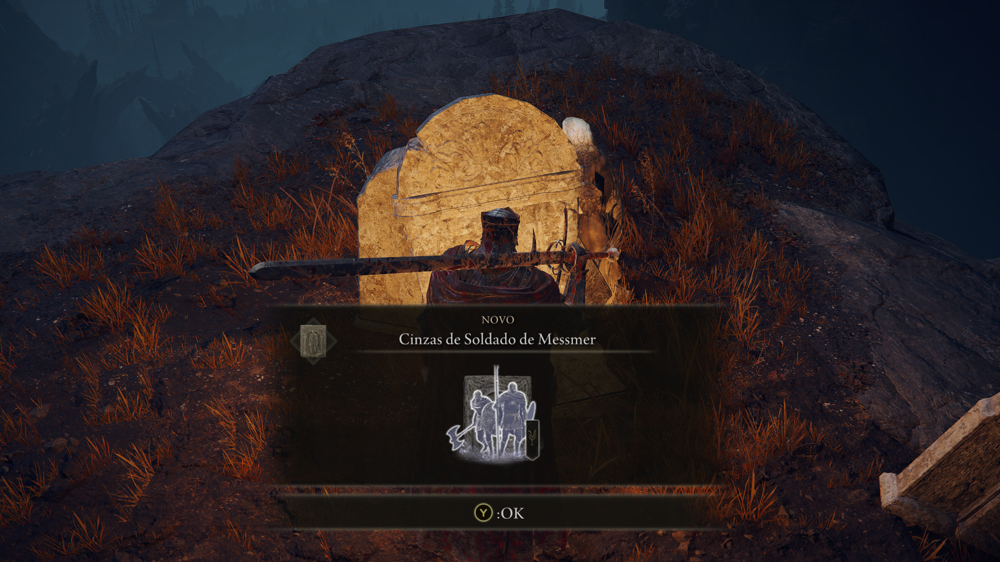
     
    <em>Figura 3j: Cinzas para invocar uma pequena brigada de Messmer.</em>

--- 

## 🏺 04. Fragmento de Umbrárvore: Ruínas de Moorth
Um local de lore denso que conecta os Maculados ao povo da Vila Bonny.

* **Descrição:** Localizado diretamente na Cruz de Miquella no centro das ruínas.
* **Item:** **Fragmento de Umbrárvore (1)**.

    
     
    <em>Figura 4: Coleta obrigatória para fortalecer o personagem antes do Castelo.</em>

--- 

## 🗺️ 05. Coleta do Mapa: Altus da Sombra
O item que revela toda a geografia da zona central da DLC.

* **Descrição:** Localizado no obelisco de pedra na beira da estrada principal.

    
     
    <em>Figura 5: Mapa da região central da Terra das Sombras.</em>

--- 

## ✨ 06. Fragmento: Cruz da Estrada Principal
Outro ponto de parada de Miquella com itens de utilidade e lore.

* **Descrição:** Localizado na cruz onde Leda e Hornsent estão acampados.
* **Itens:** **Fragmento de Umbrárvore (1)**, Gesto e Mapa das Cruzes atualizado.

    
     
    <em>Figura 6: Ponto central de NPCs e upgrade.</em>

--- 

## 🔥 07. Fragmento: Próximo ao Gigante da Fornalha
Seguindo pela estrada que leva ao Castelo das Sombras.

* **Descrição:** Encontrado em uma estátua no gramado, próximo à patrulha do Gigante da Fornalha.
* **Upgrade:** **Fragmento de Umbrárvore (1)**.

    
     
    <em>Figura 7: Localização perigosa próxima ao inimigo colossal.</em>

--- 

## 👊 08. Duelo: Dryleaf Dane (Folhaseca)
Um encontro com um dos seguidores mais leais de Miquella.

* **Descrição:** Use o gesto **"Que o Melhor Vença"** (May the Best Win) diante dele na Graça das Ruínas de Moorth para iniciar o duelo.
* **Itens:** **Artes da Folhaseca** e **Chapéu do Dane**.

    
     
    <em>Figura 8a: O ritual de desafio para o monge guerreiro.</em>

    
     
    <em>Figura 8b: Recompensas de vitória: o estilo de combate desarmado.</em>

--- 

## ⛪ 09. Invasão: Queelign e Igreja da Cruzada
O Cavaleiro de Fogo realiza sua segunda emboscada.

* **Invasor:** Cavaleiro de Fogo Queelign.
* **Itens:** **Cinza de Guerra: Espeto Flamejante** e **Chave da Sala de Orações**.
* **Upgrade:** No altar da igreja, há **2x Fragmentos de Umbrárvore**.

    
     
    <em>Figura 9: Alvo da invasão e upgrade duplo de fragmentos.</em>

--- 

## 🧭 10. Fragmento: Caminho para Moorth
Localizado entre a estrada principal e as ruínas.

* **Descrição:** Encontrado em um cadáver ou estátua no caminho gramado.
* **Item:** **Fragmento de Umbrárvore (1)**.

    
     
    <em>Figura 10: Coleta rápida durante a transição de áreas.</em>

---

## 💨 11. Fragmento: Cruz de Umbravista (Fonte Espiritual)
Um segredo acessível apenas por quem domina o terreno.

* **Ação:** Encontre a fonte espiritual selada e use a Algema de Margit para facilitar a quebra do selo.
* **Item:** **Fragmento de Umbrárvore (1)** e ativação da Graça "Cruz de Umbravista".

    
     
    <em>Figura 11a: Local da fonte espiritual bloqueada.</em>

    
     
    <em>Figura 11b: Usando a algema para liberar o selo rapidamente.</em>

    
     
    <em>Figura 11c: No topo, a Cruz de Miquella e o upgrade.</em>

--- 

## 🏺 12. Fragmento: Ruínas de Moorth (NPC Pote)
Próximo à descida que leva para a Vila Bonny.

* **Descrição:** Cuidado com os inimigos próximos ao NPC que carrega um pote na cabeça.
* **Item:** **Fragmento de Umbrárvore (1)**.

    
     
    <em>Figura 12: Fragmento coletado de um NPC específico na área das ruínas.</em>

---

## 🗽 13. Fragmento: Estátua de Marika ao Norte
Localizado no extremo norte das Ruínas de Moorth, descendo em direção ao pequeno lago.

* **Descrição:** O fragmento está na base de uma estátua de Marika.
* **Item:** **Fragmento de Umbrárvore (1)**.

    
     
    <em>Figura 13: Coleta na estátua que marca a descida para a ravina.</em>

---

## ⚕️ 14. Encantamento: Cura de Longe
Escondido no final da ravina, após a estátua de Marika.

* **Descrição:** Siga pelo caminho da água até encontrar uma caverna ou base de árvore dourada.
* **Item:** **Cura de Longe** (Heal from Afar).

    
     
    <em>Figura 14: Localização de um dos melhores encantamentos de cura da DLC.</em>

--- 

## 💔 15. O Evento: Quebra da Grande Runa
Ao se aproximar do Castelo das Sombras, o encanto de Miquella se desfaz.

* **Descrição:** Você ouvirá um som de vidro estilhaçando. Este é o ponto sem retorno para a primeira fase das quests de NPCs.
* **Mensagem:** "Uma Grande Runa se quebrou e um poderoso feitiço foi desfeito".

    
     
    <em>Figura 15a: O aviso visual e sonoro da mudança no mundo.</em>

    
     
    <em>Figura 15b: O momento em que a vontade própria retorna aos aliados.</em>

---

## 🐜 16. NPC Moore: A Escolha Decisiva
Após a runa quebrar, Moore entrará em depressão.

* **Escolha:** Ao falar com ele, responda **"Permanecer triste para sempre"**.
* **Efeito:** Isso fará com que ele morra em seguida, permitindo coletar seus itens agora em vez de esperar o final do jogo.

    
     
    <em>Figura 16: Definindo o destino do coletor de itens.</em>

--- 

## 📜 17. Diálogo: Sir Ansbach
O seguidor de Mohg agora recuperou sua lucidez.

* **Ação:** Fale com ele na Cruz da Estrada Principal. Use o teleporte para a mesma Graça para forçar o progresso da saída de NPCs da área.

    
     
    <em>Figura 17: Ansbach começa sua investigação sobre o castelo.</em>

--- 

## 🛡️ 18. Diálogo: Freyja (Juba Vermelha)
A guerreira de Radahn agora busca seu próprio caminho.

* **Ação:** Converse com ela para entender suas intenções de batalha futura.

    
     
    <em>Figura 18: A lealdade de Freyja é testada após o fim do encanto.</em>

--- 

## 🗡️ 19. Diálogo: Leda e a Purga
Leda começa a suspeitar de traição entre os aliados.

* **Ação:** Ela pedirá sugestões de quem deve ser eliminado. A escolha não altera drasticamente a história agora, mas libera diálogos extras.

    
     
    <em>Figura 19: Leda revela sua natureza implacável como agulha de Miquella.</em>

--- 

## 👹 20. Diálogo: Hornsent (Enviado do Chifre)
Consumido pelo ódio, ele agora só pensa em Messmer.

* **Ação:** Ele revelará seu plano de vingança total contra o Impalador.

    
     
    <em>Figura 20: O enviado do chifre foca sua fúria no Castelo das Sombras.</em>

--- 

## 🎒 21. Coleta Final: O Espólio de Moore
Como resultado da escolha no Passo 16, o corpo de Moore pode ser encontrado.

* **Local:** Próximo à Igreja da Cruzada, cercado pelos seus amigos insetos.
* **Itens:** **Sino de Moore**, **Set Completo de Azinhavre** e **Escudo de Azinhavre**.

    
     
    <em>Figura 21a: O descanso final de Moore.</em>

    
     
    <em>Figura 21b: Mapa da localização para coleta do set de armadura pesada.</em>

---

## 🪨 22. Talismã da Pedra Quebrada (Vilarejo Bonny)
Aproveite a descida para o Vilarejo Bonny após passar pelo NPC do pote.

* **Descrição:** Atravesse a primeira ponte de corda no Vilarejo Bonny; o item está em um corpo logo à frente.
* **Item:** **Talismã da Pedra Quebrada** (Aumenta o dano de chutes e ataques de pisada).

    
     
    <em>Figura 22: Item essencial para builds de combate corpo a corpo.</em>

--- 

## 💫 23. Encantamento: Arcos de Ouro
O encantamento **Arcos de Ouro** (*Golden Arcs*) é um dos primeiros feitiços dos "Cornigulados".

* **Descrição:** Dispara arcos de luz dourada em sucessão. Excelente para controle de grupo.
* **Localização:** Nas **Ruínas do Templo** (*Temple Town Ruins*), dentro de um baú.

    
     
    <em>Figura 23: Localização do feitiço ofensivo nas Ruínas do Templo.</em>

--- 

## 🏘️ 24. Ativando Graça: Vilarejo Bonny
Ponto de descanso central para explorar as valas de "recheio de potes".

* **Descrição:** Localizada logo após atravessar a primeira ponte de corda vindo das Ruínas de Moorth.

    
     
    <em>Figura 24: Ponto de controle seguro dentro da vila.</em>

--- 

## 🙏 25. Coleta: Gesto "Ó, Mãe"
Um dos itens mais importantes para o *late game* da DLC.

* **Descrição:** Encontrado em um corpo ajoelhado em frente a uma estátua ao norte do vilarejo.
* **Uso:** Essencial para abrir a estátua secreta no Castelo das Sombras mais tarde.

    
     
    <em>Figura 25a: Coleta do gesto ritualístico.</em>

    
     
    <em>Figura 25b: Posição exata do corpo com o item.</em>

--- 

## 🔪 26. Limpeza de Área: Loot do Vilarejo
Itens espalhados pelas áreas de "preparação" dos potes.

* **Itens:** (2) Potes Pesados, Cinza Espiritual Reverenciada, Faca do Açougueiro de Bonny, Chicote Dentado.

    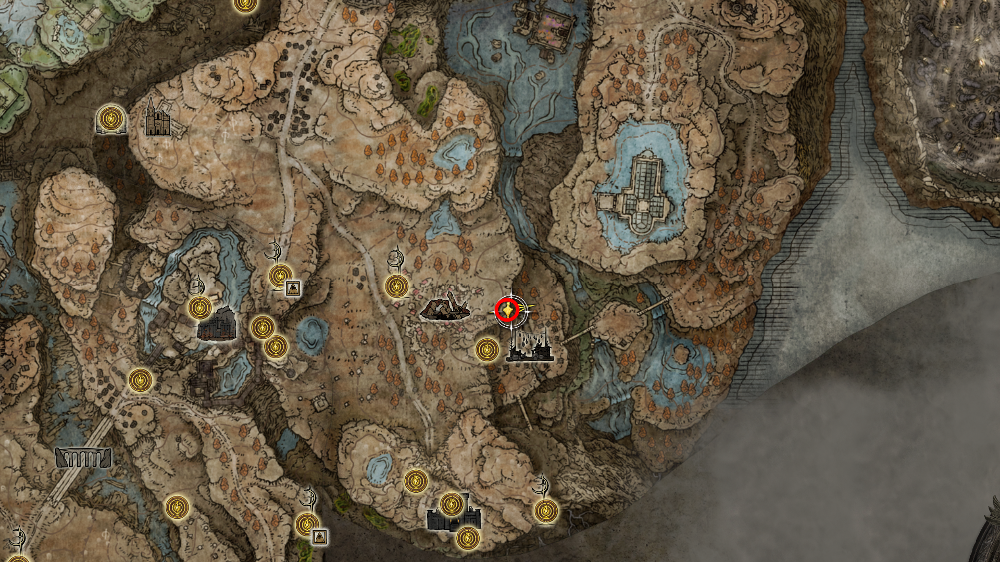
     
    <em>Figura 26a: Localização da Cinza Espiritual Reverenciada.</em>

    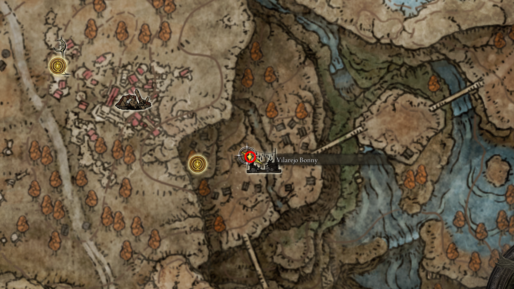
     
    <em>Figura 26b: Local de coleta da Faca do Açougueiro de Bonny.</em>

    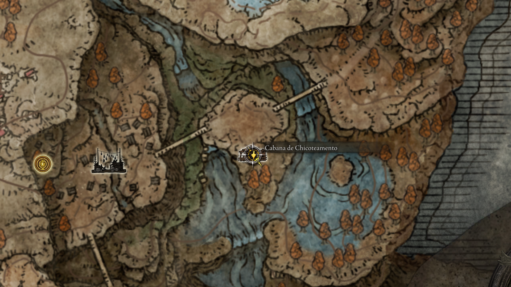
     
    <em>Figura 26c: Chicote Dentado encontrado na cabana de tortura.</em>

---

## 🏗️ 27. Entrada pelo Distrito da Igreja e Drenagem
Esta rota alternativa pelo lado leste da fortaleza permite acessar áreas submersas.

* **Descrição:** Avance pela rampa lateral até o Distrito da Igreja. Faça o parkour pelos telhados para alcançar a alavanca central que drena a água.

    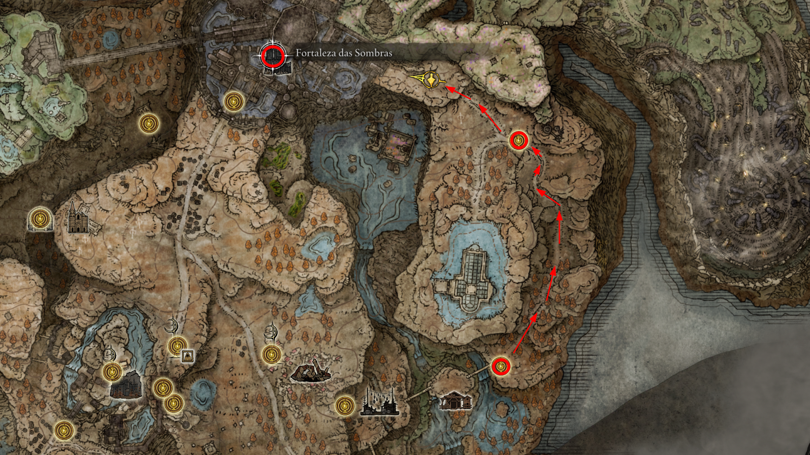
     
    <em>Figura 27a: Caminho pela rampa lateral até a entrada.</em>

    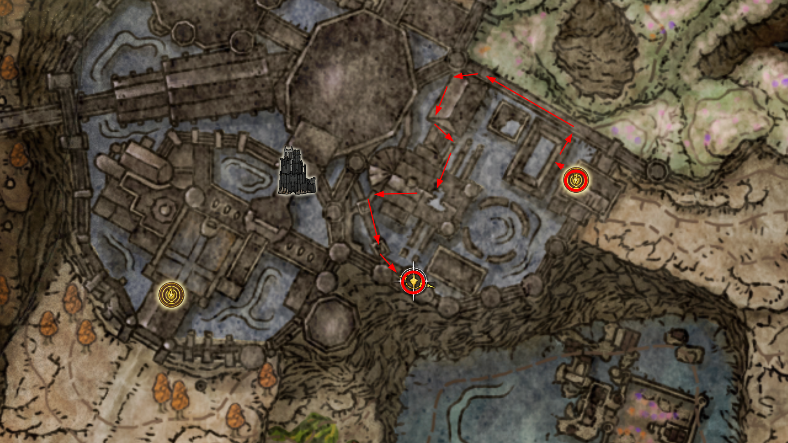
     
    <em>Figura 27b: Trajeto pelos telhados.</em>

    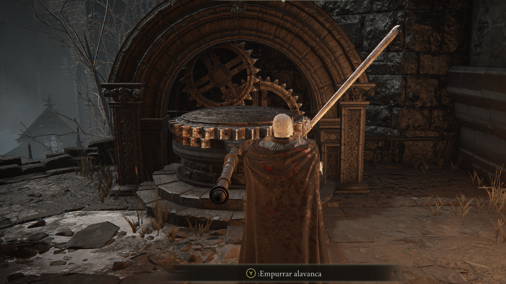
     
    <em>Figura 27c: Acionamento da alavanca para revelar o nível inferior.</em>

--- 

## 🗽 28. Fragmento de Umbrárvore: Estátua de Marika
* **Descrição:** Com a água drenada, o fragmento torna-se acessível nas mãos de uma estátua de Marika no pátio.

    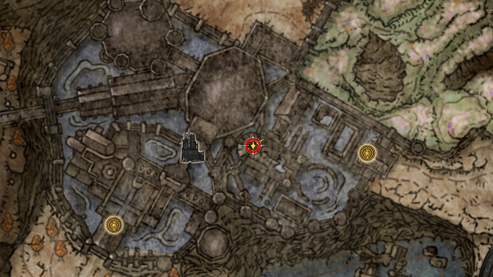
     
    <em>Figura 28a: Localização da estátua após a drenagem.</em>

    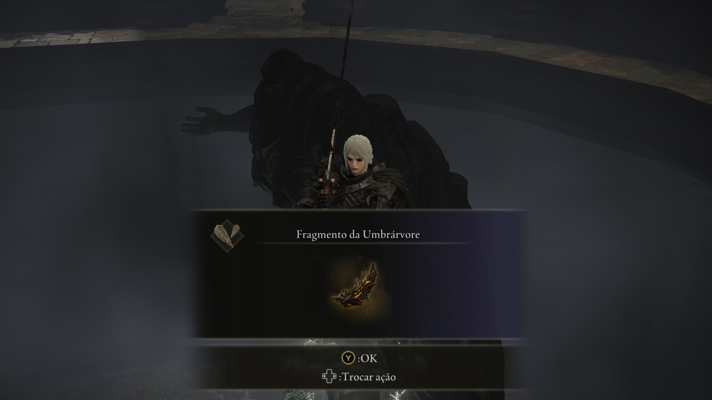
     
    <em>Figura 28b: Coleta do upgrade essencial.</em>

--- 

## 🔥 29. Selo do Cavaleiro de Fogo
* **Descrição:** Localizado em uma das salas laterais do Distrito da Igreja, acessível após a drenagem.
* **Item:** **Selo do Cavaleiro de Fogo** (Potencializa encantamentos de Messmer).

    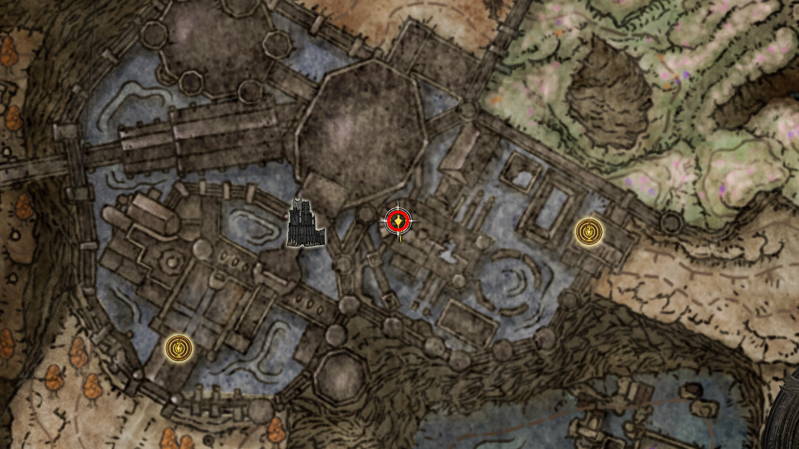
     
    <em>Figura 29a: Sala de tesouro no nível inferior.</em>

    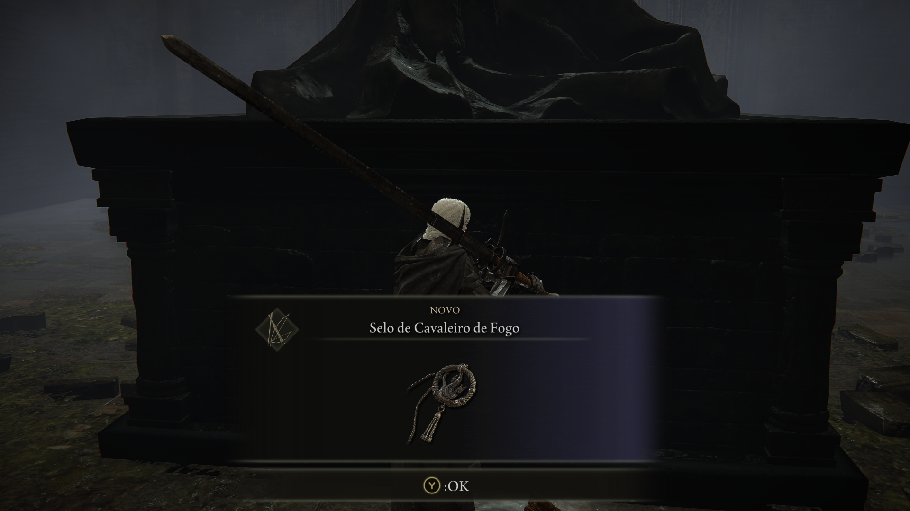
     
    <em>Figura 29b: Catalisador poderoso para builds de fé.</em>

--- 

## 🎒 30. Graça: Armazém, Parte de Trás
O ponto de conexão final que leva à subida para o topo do castelo.

* **Descrição:** Utilize o elevador no Distrito da Igreja para subir até a seção posterior do Armazém de Espécimes.

    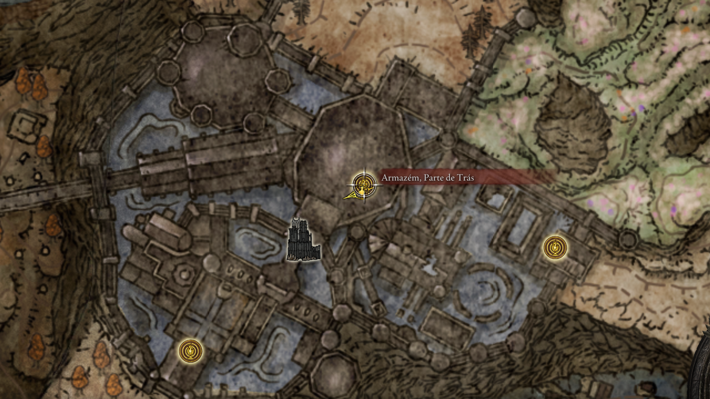
     
    <em>Figura 30: Conexão estabelecida com a parte interna da fortaleza.</em>

--- 

[⬅️ Voltar para o README.md](../README.md) | [Prosseguir para o Castelo das Sombras ➡️](../21_shadow_keep/route.md)