## 01. Apos venceu a Rellana, saia para a graca na frente do castelo e vera a Leda e o enviado do chife fale com eles
intro
* **Descrição:** 
* **NPCs:** 
* **Item:** 

    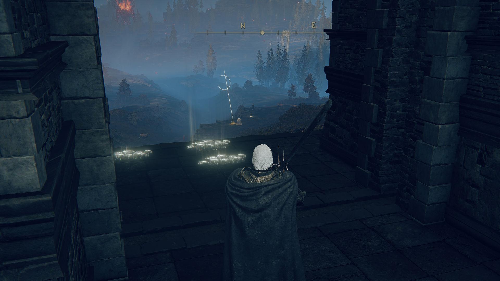
     
    <em>Figura : .</em>

--- 

## 02. Ativando as gracas partindo da graca caverna do rio Ellac, para o Forte Reprimenda tem um puzle podendo usar o item de margit ou ativando ali perto para subir para o forte, uma caminho alternativo para deixar liberado
intro
* **Descrição:** 
* **NPCs:** 
* **Item:** 

    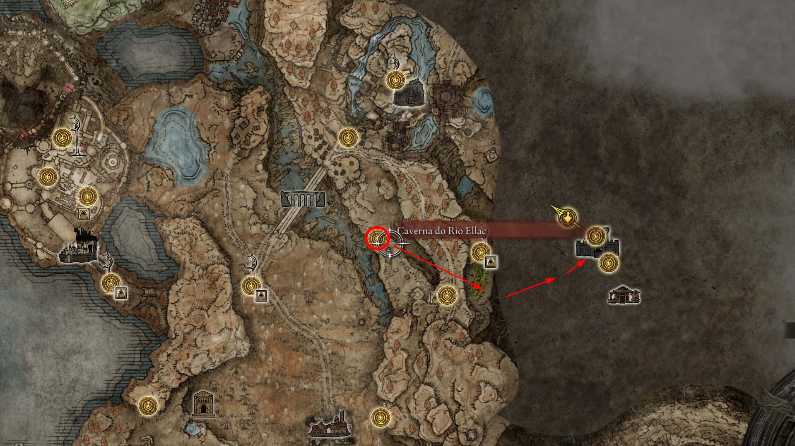
     
    <em>Figura : .</em>

--- 

## 03. Fragmento de umbrarvore na cruz de Miquella na Ruinas Moorth
intro
* **Descrição:** 
* **NPCs:** 
* **Item:** 

    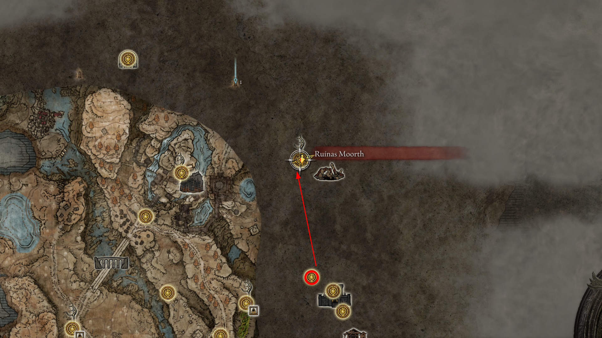
     
    <em>Figura : .</em>

--- 

## 04. Coleto o Mapa Umbra ALtus (obs. poderia ser coletado saindo do castelo ensis tbm)
intro
* **Descrição:** 
* **NPCs:** 
* **Item:** 

    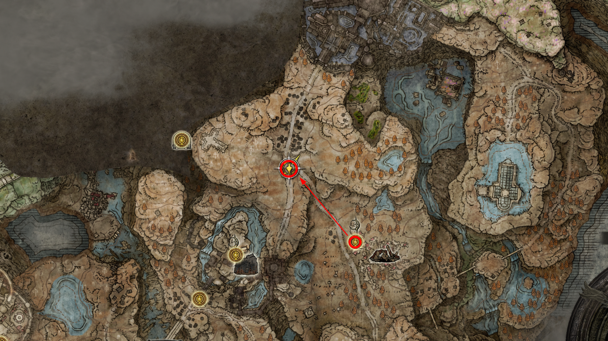
     
    <em>Figura : .</em>

--- 

## 05. Fragmento de umbrarvore na cruz da estrada principal, aonde ja conversamos com a Leda e o Enviado do chife, pode ser coletado um gesto e um novo mapa das cruzes 
intro
* **Descrição:** 
* **NPCs:** 
* **Item:** 

    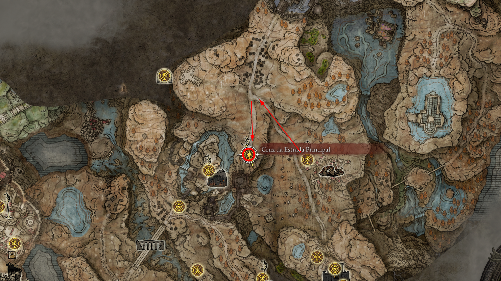
     
    <em>Figura : .</em>

--- 

## 06. Fragmento de umbrarvore saindo da graca da cruz da estrada principal sentido ao castelo proximo do gigante da fornalha
intro
* **Descrição:** 
* **NPCs:** 
* **Item:** 

    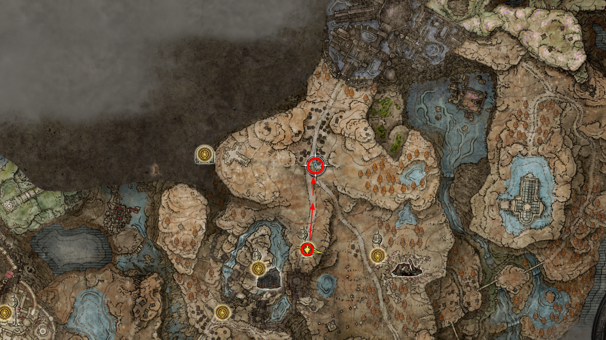
     
    <em>Figura : .</em>

--- 

## 07. Siga para a graca ruinas moorth e use o gesto que o melhor venca que tera que lutar contra ele
intro
* **Descrição:** 
* **NPCs:** 
* **Item:** artes da folhaseca e chapeu de Dane

    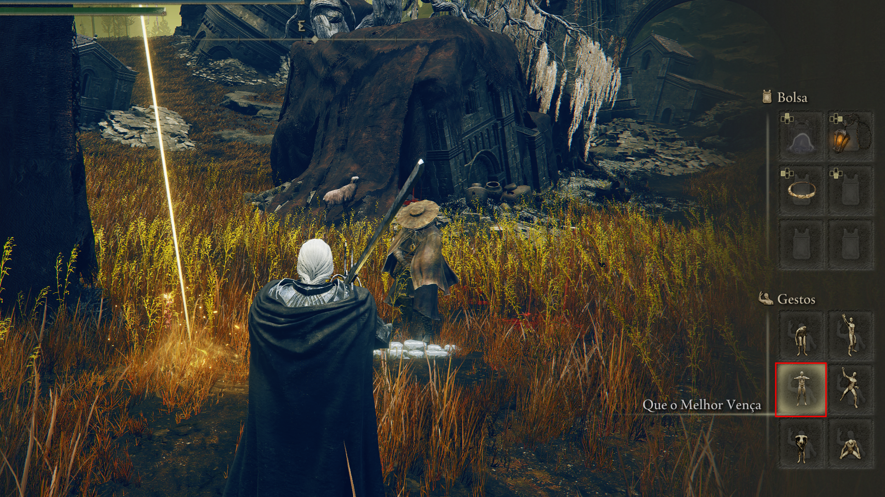
     
    <em>Figura : gesto .</em>

    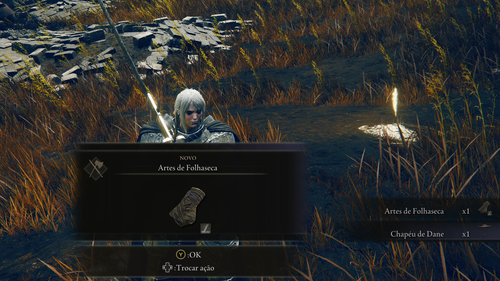
     
    <em>Figura : itens ao vencer.</em>

--- 

## 08. segunda Invasao do Queeling na igreja cruzada, (2x) fragmentos de umbravore, cinza de guerra: espeto flamejante e chave da sala de oracoes
intro
* **Descrição:** 
* **NPCs:** 
* **Item:** 

    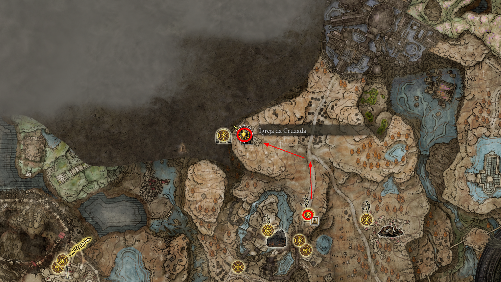
     
    <em>Figura : .</em>

--- 

## 09. Fragmento de umbrarvore saindo da graca da cruz da estrada principal sentido as ruinas moorth
intro
* **Descrição:** 
* **NPCs:** 
* **Item:** 

    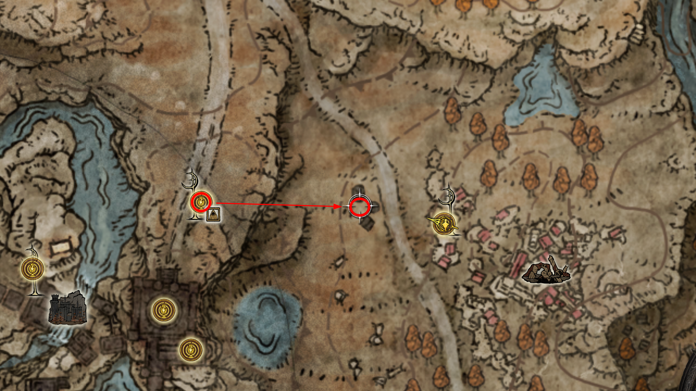
     
    <em>Figura : .</em>

---

## 10. Fragmento de umbrarvore saindo da graca ruinas moorth
intro
* **Descrição:** 
* **NPCs:** 
* **Item:** 

    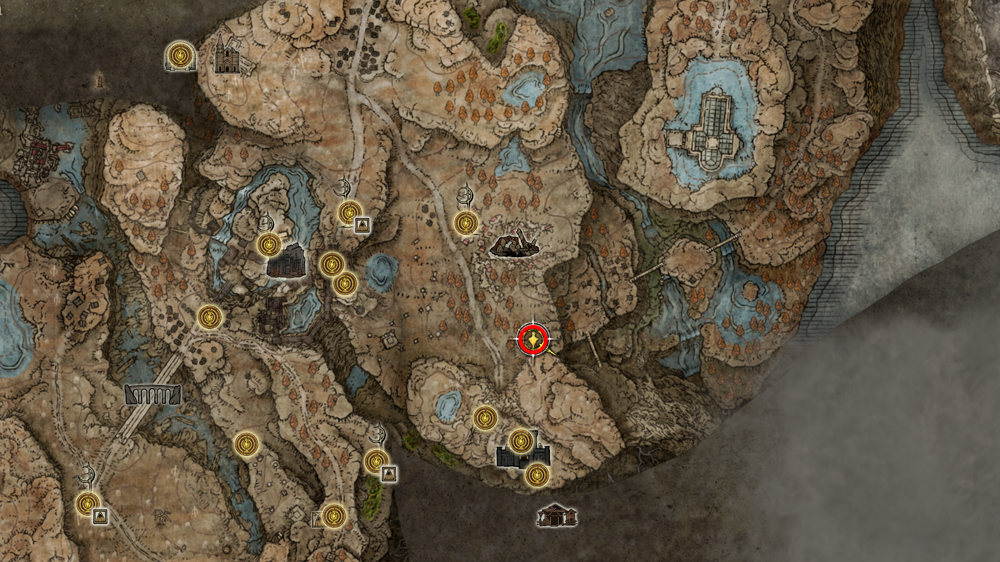
     
    <em>Figura : Local aonde tem uma fonte espiritual(tufo de vento) bloqueado.</em>

    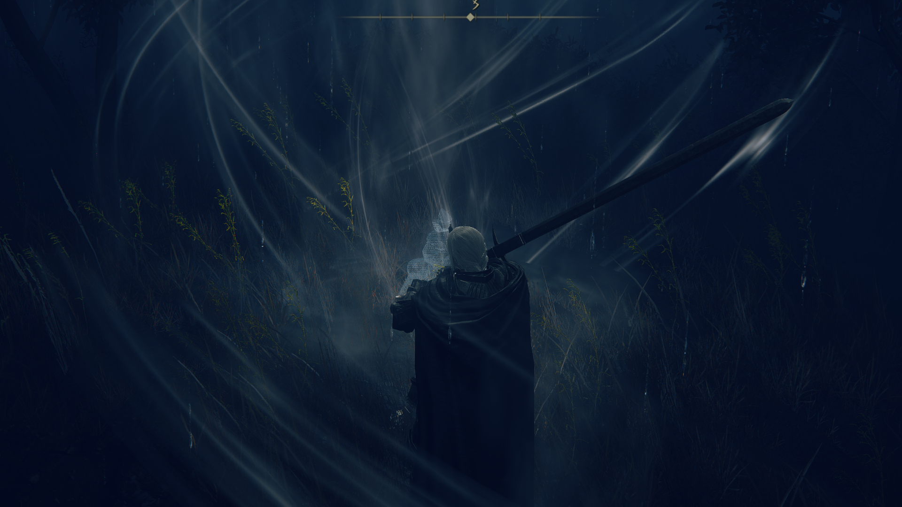
     
    <em>Figura : use a algema de margit para falicitar, ou pode encontrar o item mais adinte pelo canto da parede.</em>

    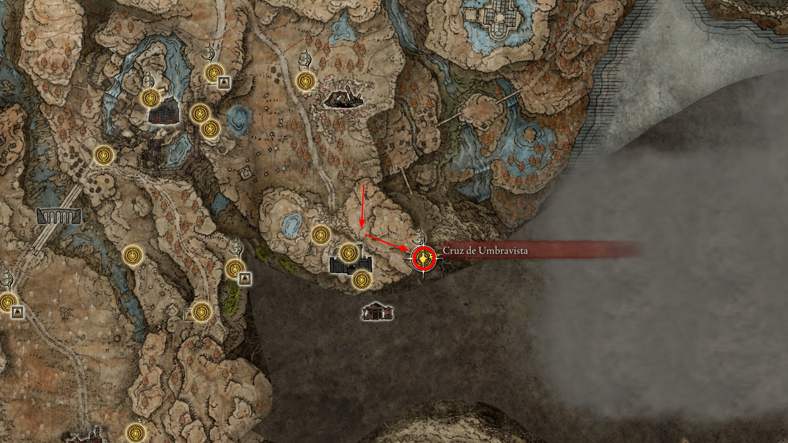
     
    <em>Figura : no topo da montanha encontrara a cruz de miquella e a graca Cruz de Umbravista junto com o fragmento.</em>

--- 

## 11. Fragmento de umbrarvore saindo da graca ruinas moorth bem proximo das ruinas com o npc com pote na cabeca
intro
* **Descrição:** cuidado com o outro npc que pode te atacar
* **NPCs:** 
* **Item:** 

    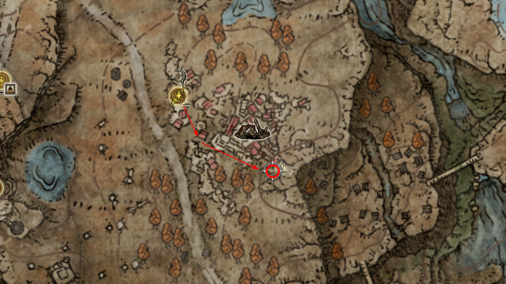
     
    <em>Figura : .</em>

---

## 12. Fragmento de umbrarvore saindo da graca ruinas moorth bem proximo sentido ao pequeno lado ao norte no pes da estatua de marika
intro
* **Descrição:** 
* **NPCs:** 
* **Item:** 

    
     
    <em>Figura : .</em>

---

## 13. Encantamento Cura de longe no fundo da caverna depois da estatua aonde pegou o fragmento de umbravore (opcional)
intro
* **Descrição:** 
* **NPCs:** 
* **Item:** 

    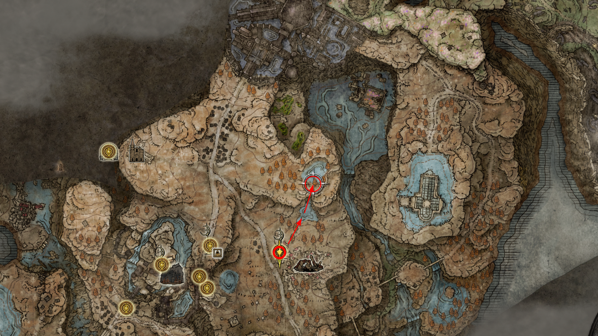
     
    <em>Figura : .</em>

--- 

## . Avancar para o catelo para quebrar o selo
intro
* **Descrição:** 
* **NPCs:** 
* **Item:** 

    
     
    <em>Figura : .</em>

---

<!-- 

## 
intro
* **Descrição:** 
* **NPCs:** 
* **Item:** 

    
     
    <em>Figura : .</em>

--- 
-->