# 🌅 Rota de Exploração: 20. Altus da Sombra (Scadu Altus)

> **Status:** Região central da Terra das Sombras.
> **Foco:** Progressão de NPCs, Coleta massiva de Fragmentos e Quebra da Runa.

---

## 🧭 01. Encontro na Cruz da Estrada Principal
Logo após vencer Rellana e sair do castelo, você encontrará os primeiros aliados de Miquella.

* **Descrição:** Converse com os NPCs próximos à Graça para entender o objetivo atual: o Castelo das Sombras.
* **NPCs:** **Leda** e **Hornsent** (Enviado do Chifre).
* **Item:** Mapa das Cruzes.

    
     
    <em>Figura 1: Reagrupamento dos Maculados na saída do Castelo Ensis.</em>

--- 

## 🛡️ 02. Atalho e Puzzle: Forte da Reprimenda
Um caminho alternativo que conecta a Caverna do Rio Ellac ao platô superior.

* **Descrição:** Existe uma fonte espiritual (tufo de vento) selada. Para liberar, você pode destruir o selo de pedras próximo ou usar a **Algema de Margit/Mohg** para ativar o mecanismo à distância.
* **Objetivo:** Deixar o caminho liberado para facilitar o trânsito entre as regiões baixas e o Altus.

    
     
    <em>Figura 2: Utilizando itens de utilidade para desbloquear o acesso ao Forte.</em>

--- 

## 🏺 03. Fragmento de Umbrárvore: Ruínas de Moorth
Um local de lore denso que conecta os Maculados ao povo da Vila Bonny.

* **Descrição:** Localizado diretamente na Cruz de Miquella no centro das ruínas.
* **Item:** **Fragmento de Umbrárvore (1)**.

    
     
    <em>Figura 3: Coleta obrigatória para fortalecer o personagem antes do Castelo.</em>

--- 

## 🗺️ 04. Coleta do Mapa: Altus da Sombra
O item que revela toda a geografia da zona central da DLC.

* **Descrição:** Localizado no obelisco de pedra na beira da estrada principal.
* **Dica:** Pode ser coletado vindo do Castelo Ensis ou pelo atalho do Rio Ellac.

    
     
    <em>Figura 4: Mapa da região central da Terra das Sombras.</em>

--- 

## ✨ 05. Fragmento: Cruz da Estrada Principal
Outro ponto de parada de Miquella com itens de utilidade e lore.

* **Descrição:** Localizado na cruz onde Leda e Hornsent estão acampados.
* **Itens:** **Fragmento de Umbrárvore (1)**, Gesto e Mapa das Cruzes atualizado.

    
     
    <em>Figura 5: Ponto central de NPCs e upgrade.</em>

--- 

## 🔥 06. Fragmento: Próximo ao Gigante da Fornalha
Seguindo pela estrada que leva ao Castelo das Sombras.

* **Descrição:** Encontrado em uma estátua no gramado, próximo à patrulha do Gigante da Fornalha.
* **Upgrade:** **Fragmento de Umbrárvore (1)**.

    
     
    <em>Figura 6: Localização perigosa próxima ao inimigo colossal.</em>

--- 

## 👊 07. Duelo: Dryleaf Dane (Folhaseca)
Um encontro com um dos seguidores mais leais de Miquella.

* **Descrição:** Use o gesto **"Que o Melhor Vença"** (May the Best Win) diante dele na Graça das Ruínas de Moorth para iniciar o duelo.
* **Itens:** **Artes da Folhaseca** e **Chapéu do Dane**.

    
     
    <em>Figura 7a: O ritual de desafio para o monge guerreiro.</em>

    
     
    <em>Figura 7b: Recompensas de vitória: o estilo de combate desarmado.</em>

--- 

## ⛪ 08. Invasão: Queelign e Igreja da Cruzada
O Cavaleiro de Fogo realiza sua segunda emboscada.

* **Invasor:** Cavaleiro de Fogo Queelign.
* **Itens:** **Cinza de Guerra: Espeto Flamejante** e **Chave da Sala de Orações**.
* **Upgrade:** No altar da igreja, há **2x Fragmentos de Umbrárvore**.

    
     
    <em>Figura 8: Alvo da invasão e upgrade duplo de fragmentos.</em>

--- 

## 🧭 09. Fragmento: Caminho para Moorth
Localizado entre a estrada principal e as ruínas.

* **Descrição:** Encontrado em um cadáver ou estátua no caminho gramado.
* **Item:** **Fragmento de Umbrárvore (1)**.

    
     
    <em>Figura 9: Coleta rápida durante a transição de áreas.</em>

---

## 💨 10. Fragmento: Cruz de Umbravista (Fonte Espiritual)
Um segredo acessível apenas por quem domina o terreno.

* **Ação:** Encontre a fonte espiritual selada e use a Algema de Margit para facilitar a quebra do selo.
* **Item:** **Fragmento de Umbrárvore (1)** e ativação da Graça "Cruz de Umbravista".

    
     
    <em>Figura 10a: Local da fonte espiritual bloqueada.</em>

    
     
    <em>Figura 10b: Usando a algema para liberar o selo rapidamente.</em>

    
     
    <em>Figura 10c: No topo, a Cruz de Miquella e o upgrade.</em>

--- 

## 🏺 11. Fragmento: Ruínas de Moorth (NPC Pote)
Próximo à descida que leva para a Vila Bonny.

* **Descrição:** Cuidado com os inimigos próximos ao NPC que carrega um pote na cabeça.
* **Item:** **Fragmento de Umbrárvore (1)**.

    
     
    <em>Figura 11: Fragmento coletado de um NPC específico na área das ruínas.</em>

---

## 🗽 12. Fragmento: Estátua de Marika ao Norte
Localizado no extremo norte das Ruínas de Moorth, descendo em direção ao pequeno lago.

* **Descrição:** O fragmento está na base de uma estátua de Marika.
* **Item:** **Fragmento de Umbrárvore (1)**.

    
     
    <em>Figura 12: Coleta na estátua que marca a descida para a ravina.</em>

---

## ⚕️ 13. Encantamento: Cura de Longe
Escondido no final da ravina, após a estátua de Marika.

* **Descrição:** Siga pelo caminho da água até encontrar uma caverna ou base de árvore dourada.
* **Item:** **Cura de Longe** (Heal from Afar).

    
     
    <em>Figura 13: Localização de um dos melhores encantamentos de cura da DLC.</em>

--- 

## 💔 14. O Evento: Quebra da Grande Runa
Ao se aproximar do Castelo das Sombras, o encanto de Miquella se desfaz.

* **Descrição:** Você ouvirá um som de vidro estilhaçando. Este é o ponto sem retorno para a primeira fase das quests de NPCs.
* **Mensagem:** "Uma Grande Runa se quebrou e um poderoso feitiço foi desfeito".

    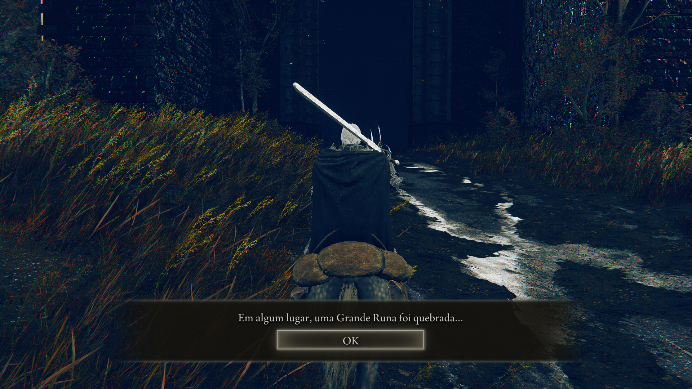
     
    <em>Figura 14a: O aviso visual e sonoro da mudança no mundo.</em>

    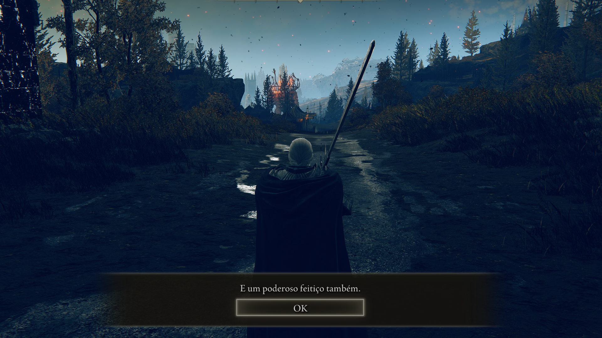
     
    <em>Figura 14b: O momento em que a vontade própria retorna aos aliados.</em>

---

## 🐜 15. NPC Moore: A Escolha Decisiva
Após a runa quebrar, Moore entrará em depressão.

* **Escolha:** Ao falar com ele, responda **"Permanecer triste para sempre"**.
* **Efeito:** Isso fará com que ele morra em seguida, permitindo coletar seus itens agora em vez de esperar o final do jogo.

    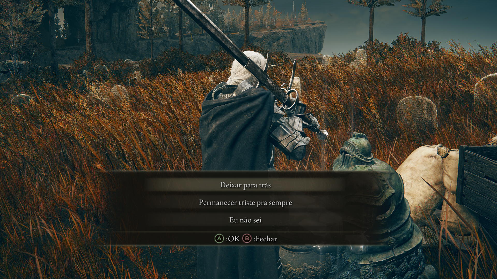
     
    <em>Figura 15: Definindo o destino do coletor de itens.</em>

--- 

## 📜 16. Diálogo: Sir Ansbach
O seguidor de Mohg agora recuperou sua lucidez.

* **Ação:** Fale com ele na Cruz da Estrada Principal. Use o teleporte para a mesma Graça para forçar o progresso da saída de NPCs da área.

    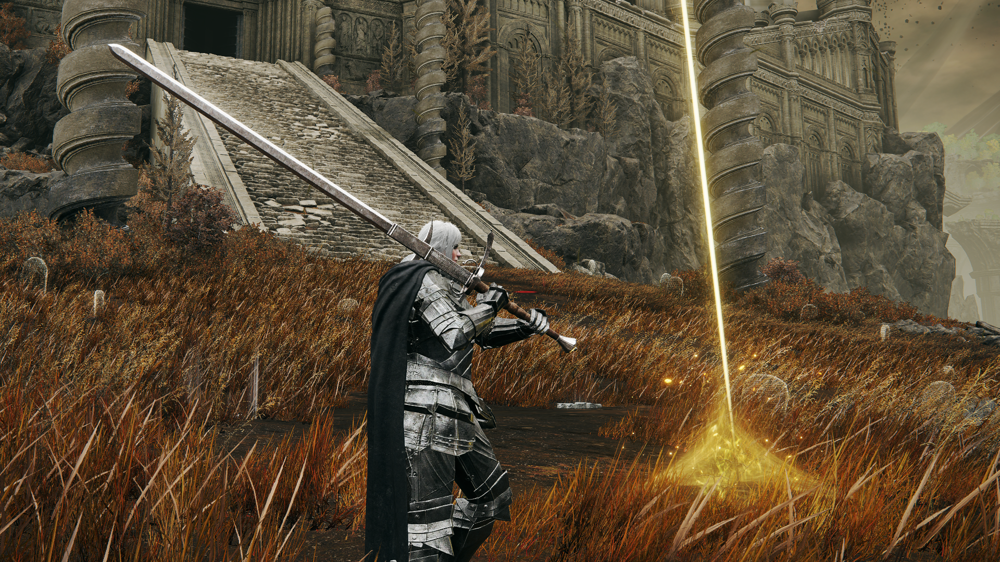
     
    <em>Figura 16: Ansbach começa sua investigação sobre o castelo.</em>

--- 

## 🛡️ 17. Diálogo: Freyja (Juba Vermelha)
A guerreira de Radahn agora busca seu próprio caminho.

* **Ação:** Converse com ela para entender suas intenções de batalha futura.

    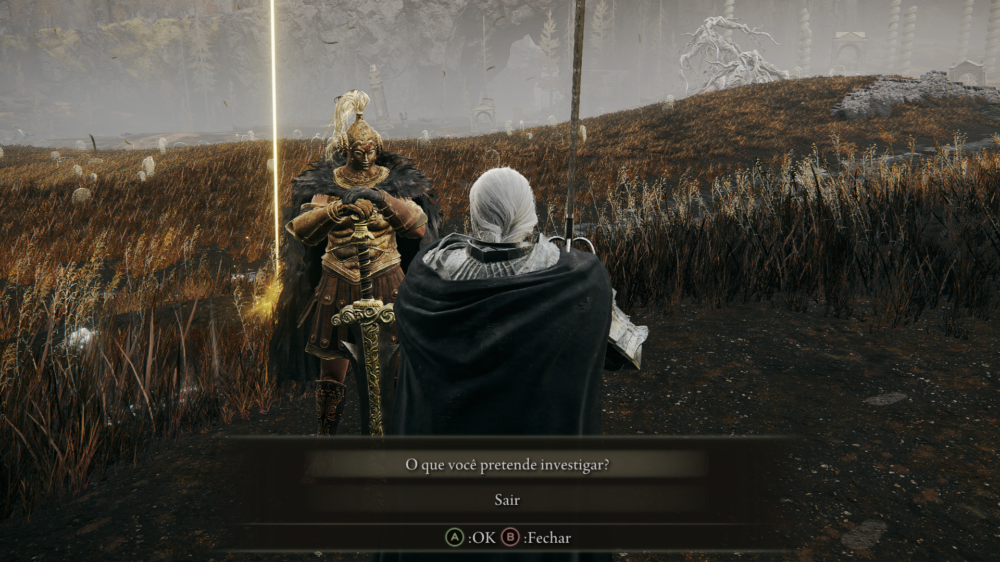
     
    <em>Figura 17: A lealdade de Freyja é testada após o fim do encanto.</em>

--- 

## 🗡️ 18. Diálogo: Leda e a Purga
Leda começa a suspeitar de traição entre os aliados.

* **Ação:** Ela pedirá sugestões de quem deve ser eliminado. A escolha não altera drasticamente a história agora, mas libera diálogos extras.

    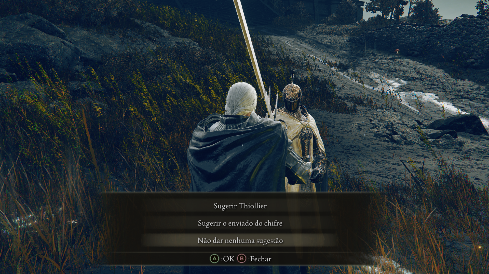
     
    <em>Figura 18: Leda revela sua natureza implacável como agulha de Miquella.</em>

--- 

## 👹 19. Diálogo: Hornsent (Enviado do Chifre)
Consumido pelo ódio, ele agora só pensa em Messmer.

* **Ação:** Ele revelará seu plano de vingança total contra o Impalador.

    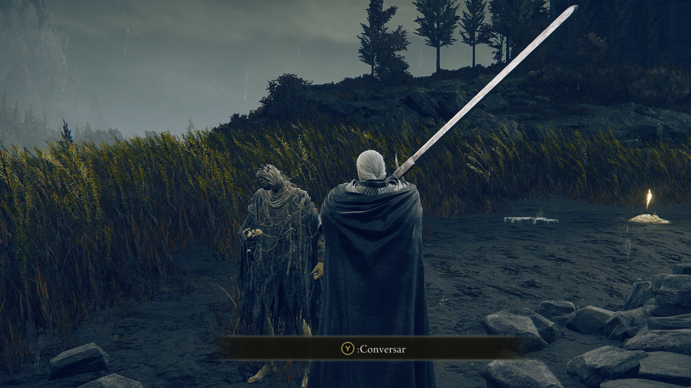
     
    <em>Figura 19: O enviado do chifre foca sua fúria no Castelo das Sombras.</em>

--- 

## 🎒 20. Coleta Final: O Espólio de Moore
Como resultado da escolha no Passo 15, o corpo de Moore pode ser encontrado.

* **Local:** Próximo à Igreja da Cruzada, cercado pelos seus amigos insetos.
* **Itens:** **Sino de Moore**, **Set Completo de Azinhavre** e **Escudo de Azinhavre**.

    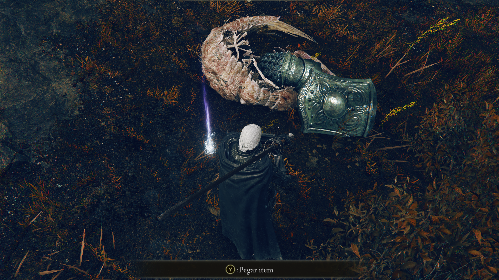
     
    <em>Figura 20a: O descanso final de Moore.</em>

    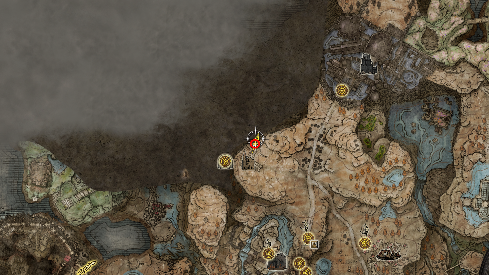
     
    <em>Figura 20b: Mapa da localização para coleta do set de armadura pesada.</em>

---

## 21. Talismã da Pedra Quebrada (Vilarejo Bonny)
Aproveite a descida para o Vilarejo Bonny após passar pelo NPC do pote.

* **Descrição:** Atravesse a primeira ponte de corda no Vilarejo Bonny; o item está em um corpo logo à frente.
* **Item:** **Talismã da Pedra Quebrada** (Aumenta o dano de chutes e ataques de pisada).
* **Sinergia:** Perfeito para usar com as **Artes da Folhaseca** (Dryleaf Arts).

    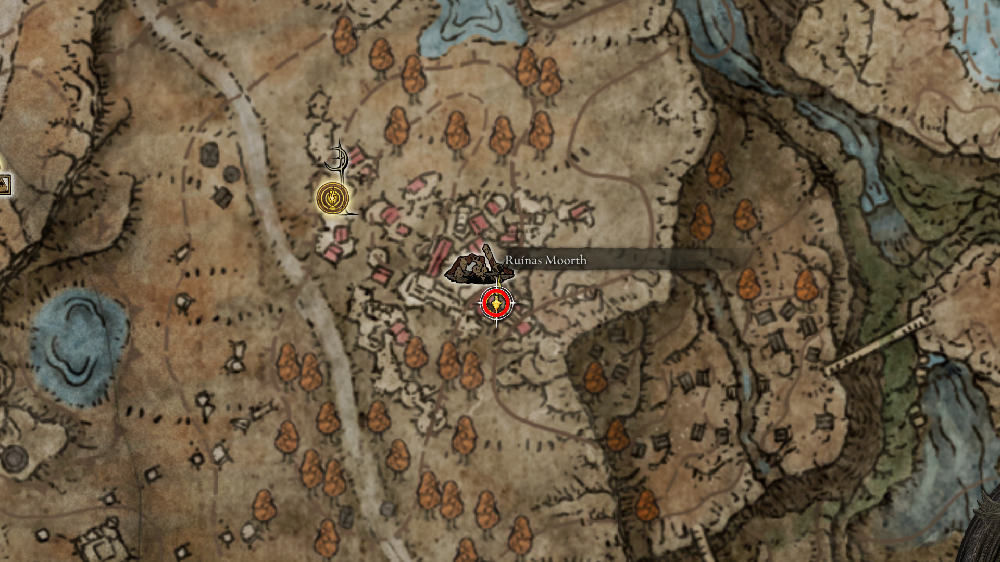
     
    <em>Figura 11b: Item essencial para builds de combate corpo a corpo.</em>

--- 

## 22. Encantamento Arcos de Ouro
O encantamento **Arcos de Ouro** (*Golden Arcs*) é um dos primeiros feitiços dos "Cornigulados" que encontramos. Seguindo a sua estrutura de pastas, ele deve ser classificado como um encantamento de **ataque direto**.
* **Item:** Arcos de Ouro (*Golden Arcs*).
* **Categoria:** Encantamento de Ofensiva (Offense).
* **Localização:** Nas **Ruínas do Templo** (*Temple Town Ruins*), dentro de um baú em uma sala acessível por um telhado.
* **Descrição:** Dispara arcos de luz dourada em sucessão. É excelente para controle de grupo no início da DLC.
* **Requisito:** 12 de Fé.

    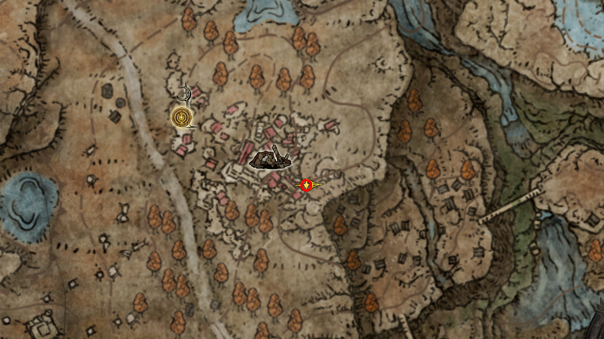
     
    <em>Figura : .</em>

--- 

## 23. ativando graca do vilarejo Bonny
intro
* **Descrição:** 
* **NPCs:** 
* **Item:** 

    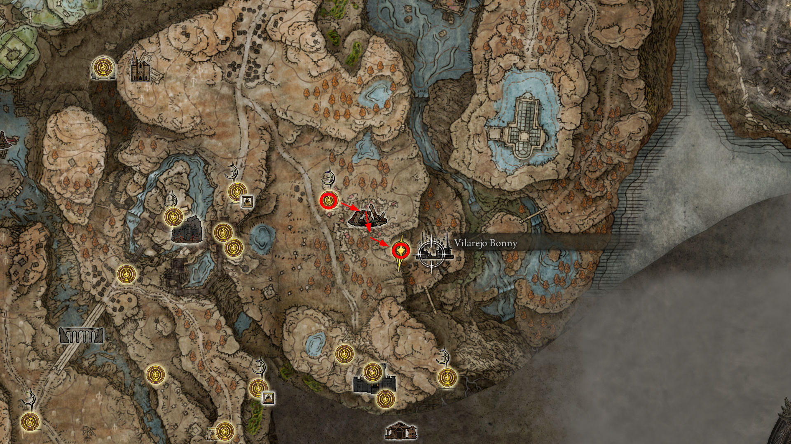
     
    <em>Figura : .</em>

--- 

## 24. Coletar gesto Ó, Mãe
intro
* **Descrição:** 
* **NPCs:** 
* **Item:** 

    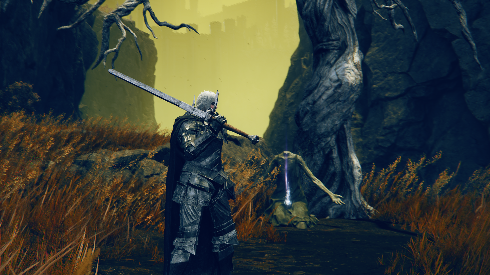
     
    <em>Figura : item.</em>

    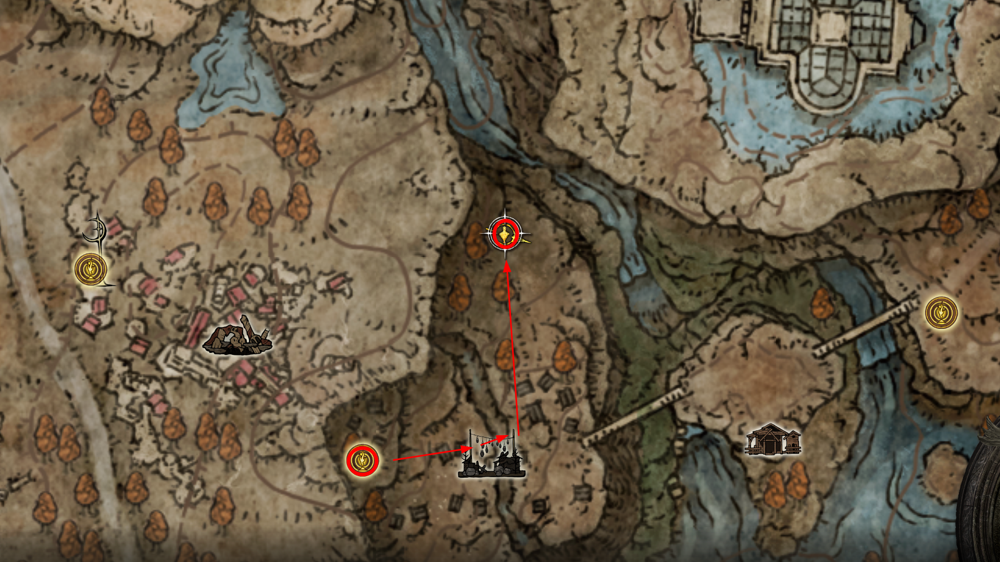
     
    <em>Figura : localizacao.</em>

--- 

## 25. Coleta de itens...
intro
* **Descrição:** 
* **NPCs:** 
* **Item:** (2) potes pesados, cinza espritual reverenciada, faca do acogueiro de bonny, chicote dentado

    
     
    <em>Figura : .</em>

--- 

[⬅️ Voltar para o README.md](../README.md) | [Prosseguir para o Castelo das Sombras ➡️](../21_shadow_keep/route.md)

<!-- 

## 
intro
* **Descrição:** 
* **NPCs:** 
* **Item:** 

    
     
    <em>Figura : .</em>

--- 
-->