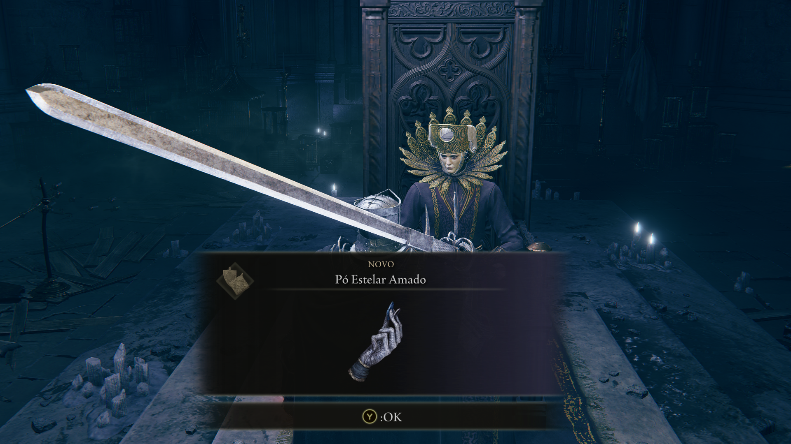
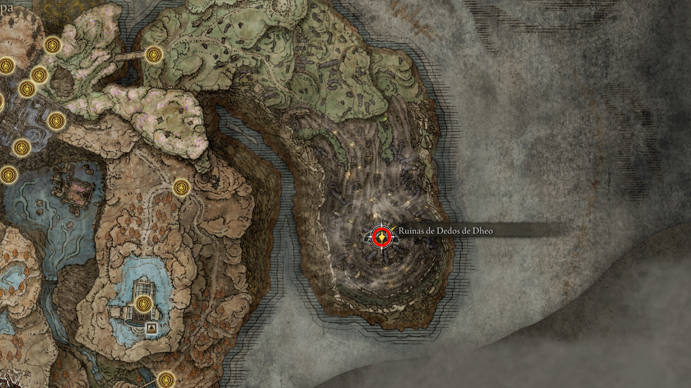
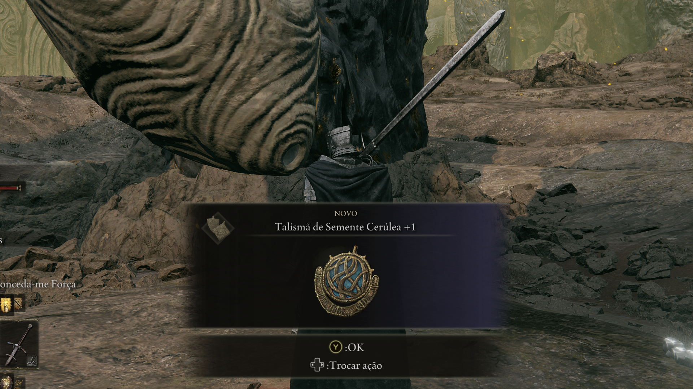
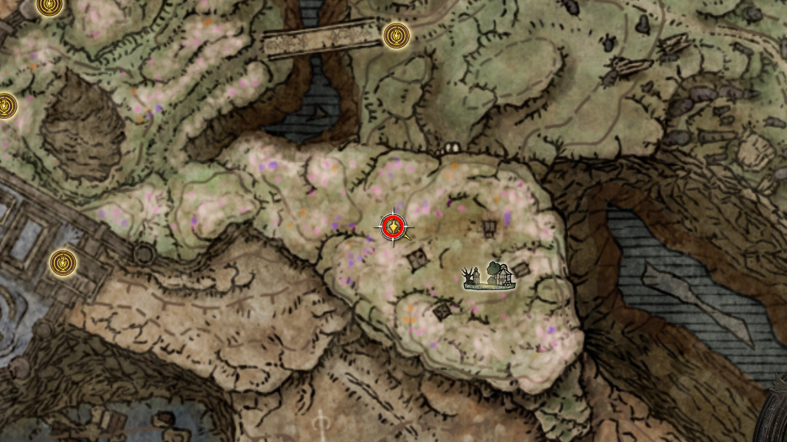
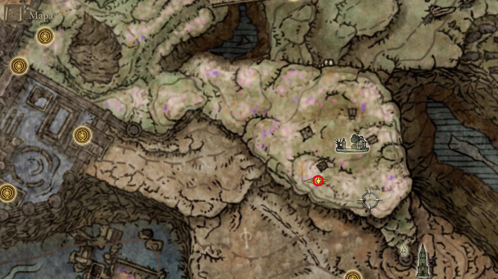
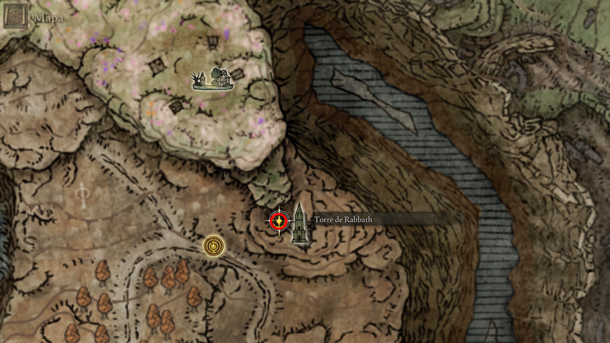
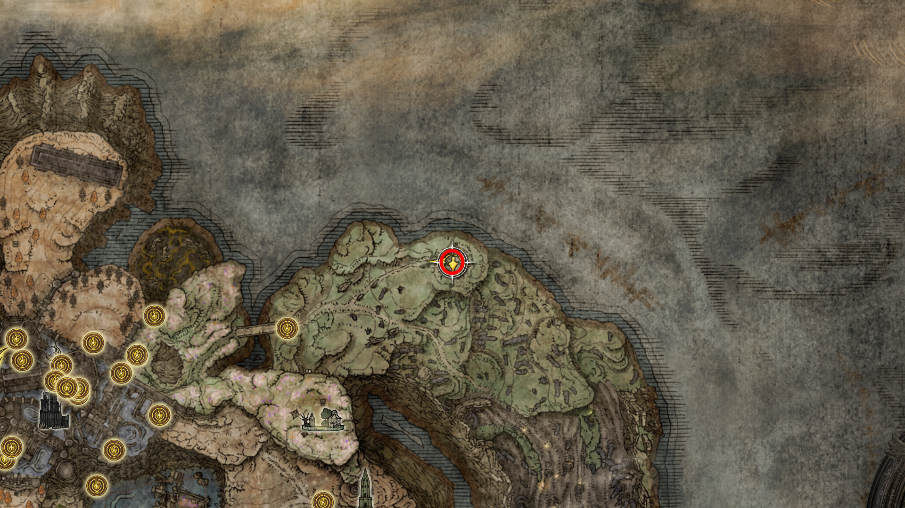

# 🏰 Rota de Exploração: 21. Castelo das Sombras (Shadow Keep)

> **Status:** Fortaleza principal de Messmer, o Impalador.
> **Dificuldade:** Alta.
> **Objetivo:** Derrotar Messmer e acessar a região das Ruínas de Rauh e Vista da Umbra.

---

## 🦛 01. Chefe: Hipopótamo Dourado
Logo na entrada pelo portão principal, este inimigo bloqueia o acesso ao pátio da fortaleza.

* **Auxílio de NPC:** Invoque a **Freyja (Juba Vermelha)**. O sinal está à direita, antes da névoa. 
* **Estratégia:** Ele inicia a luta com uma investida de boca aberta; role para os lados. Na Fase 2 (50% HP), ele ativa os espinhos. Mantenha distância quando ele pular para o alto.
* **Recompensa:** **2x Fragmentos de Umbrárvore** e Cinza de Guerra: **Aspectos do Crisol: Espinhos**.

    
     
    <em>Figura 1a: Entrada da arena com o sinal de invocação da Freyja.</em>

    
     
    <em>Figura 1b: Cinza de Guerra: Aspectos do Crisol (Espinhos).</em>

    
     
    <em>Figura 1c: Drop duplo de Fragmentos de Umbrárvore (Upgrade).</em>

    
     
    <em>Figura 1d: Arena de combate no pátio inferior do Castelo das Sombras.</em>

---

## 📚 02. Armazém de Espécimes (Primeiro Andar)
Uma biblioteca vertical massiva que serve como hub para todo o castelo.

* **Descrição:** Ative a Graça e comece a subida. Logo no primeiro andar, escondida entre as estantes de livros à esquerda (atrás de um Cavaleiro de Fogo), você encontrará a Main-gauche.
* **Item:** **Main-gauche** (Adaga de Aparagem).
* **Categoria:** `weapons/daggers`.

    
     
    <em>Figura 2a: A base da torre de pesquisa de Messmer.</em>

    
     
    <em>Figura 2b: Localização da Main-gauche entre as estantes do primeiro andar.</em>

---

## 03. Siga para a graca do 4 andar, pelas escadas depois subindo pelo pe da estatua
intro
* **Descrição:** 
* **NPCs:** 
* **Item:** 

    
     
    <em>Figura : imagem da estatua por onde deve subir.</em>

--- 

## 04. Umbravore do lado da graca do 4 andar, junto com a mensagem da cruz do armazem
intro
* **Descrição:** 
* **NPCs:** 
* **Item:** 

    
     
    <em>Figura : .</em>

--- 

## 05. Pergaminho de Rito Secreto, descendo as escadas 
intro
* **Descrição:** 
* **NPCs:** 
* **Item:** 

    
     
    <em>Figura : .</em>

--- 

## 06. Suba para o setimo andar para falar com a juba vermelha, que pedira para falar com sir Ansbach
intro
* **Descrição:** 
* **NPCs:** 
* **Item:** 

    
     
    <em>Figura : .</em>

--- 

## 07. Proximo da graca do primeiro andar fale com sir Ansbach e entregue o Pergaminho de Rito Secreto
intro
* **Descrição:** 
* **NPCs:** 
* **Item:** 

    
     
    <em>Figura : .</em>

--- 

## 08. Fale para ele sobre a juba vermelha, que ele lhe dara uma carta para ela
intro
* **Descrição:** 
* **NPCs:** 
* **Item:** 

    
     
    <em>Figura : .</em>

--- 

## 09. Entregue a carta no setimo andar para a juba vermelha
intro
* **Descrição:** 
* **NPCs:** 
* **Item:** 

    
     
    <em>Figura : .</em>

--- 

## 10. A juba vermelha tre dara o item escudo do leao dourado
intro 
* **Descrição:** ele fala quem sabe nos veremos no campo de batalha
* **NPCs:** 
* **Item:** 

    
     
    <em>Figura : .</em>

--- 

## 11. Volte na graca cruz da estrada principal e fale com a leda no qual ela vai querer ir atraz do enviado do chifre
intro
* **Descrição:** 
* **NPCs:** 
* **Item:** 

    
     
    <em>Figura : .</em>

---

## 12. Cinza espiritual revirencia proximo da graca do 7 andar 
intro
* **Descrição:** 
* **NPCs:** 
* **Item:** 

    
     
    <em>Figura : .</em>

--- 

## 13. Ative a alavanca ali no 7 andar 
intro
* **Descrição:** 
* **NPCs:** 
* **Item:** 

    
     
    <em>Figura : localizacao da alavanca.</em>

    
     
    <em>Figura : imagem da alavanca.</em>

--- 

## 14. Na porta que segue para graca entrada da camara escura, tem um cavaleiro que dropa o Elmo da Serpente Alada e a cinza da guerra: Lanca Flamejante 
intro
* **Descrição:** 
* **NPCs:** 
* **Item:** 

    
     
    <em>Figura : elmo.</em>

    
     
    <em>Figura : cinzas da guerra.</em>

--- 

## 15. Ao abrir a porta que segue para graca entrada da camara escura encontrara um fragmento de umbravore, libere a graca
intro
* **Descrição:** 
* **NPCs:** 
* **Item:** 

    
     
    <em>Figura : .</em>

--- 

## 16. Subir as escadas a partir da graca armazem parte de traz, para liberar a graca Armazem sotao
intro
* **Descrição:** 
* **NPCs:** 
* **Item:** 

    
     
    <em>Figura : .</em>

--- 

## 17. apos ativar as escadas explorando a area podemos encontrar uma espirito de invocacao cavaleira de fogo hilde e um encantamento ira de longe
intro
* **Descrição:** 
* **NPCs:** 
* **Item:** 

    
     
    <em>Figura :espirito de invocacao cavaleira de fogo hilde loc .</em>

    
     
    <em>Figura :espirito de invocacao cavaleira de fogo hilde item .</em>

    
     
    <em>Figura : encantamento ira de longe loc .</em>

    
     
    <em>Figura : encantamento ira de longe item .</em>

--- 

## 18. Avancando um pouco encontrara uma saida bem no top com um elevador que dara acesso a graca Fortaleza das Sombras, portao dos fundos
intro
* **Descrição:** 
* **NPCs:** 
* **Item:** 

    
     
    <em>Figura : .</em>

--- 

## 19. Fragmento de umbravore a direita da graca graca Fortaleza das Sombras, portao dos fundos
intro
* **Descrição:** 
* **NPCs:** 
* **Item:** 

    
     
    <em>Figura : .</em>

--- 

## 20. cinzas da guerra: paredes de faiscas, partindo da graca armazem do primeiro andar indo para o elevador para regiao dos vasos
intro
* **Descrição:** 
* **NPCs:** 
* **Item:** 

    
     
    <em>Figura : .</em>

--- 

## 21. liberar a graca forte oeste saindo da graca armazem do primeiro andar
intro
* **Descrição:** 
* **NPCs:** 
* **Item:** 

    
     
    <em>Figura : caminho para a graca .</em>

--- 

## 22. Siga pela porta e podera usar o torrent siga pela ponte ate ver um cavaleiro de fogo que ao derrotar dropara capuz de salza e o encantamento chuva de fogo e depois siga para a graca torre menor do viaduto
intro
* **Descrição:** 
* **NPCs:** 
* **Item:** 

    
     
    <em>Figura : local do cavaleiro com drop.</em>

    
     
    <em>Figura : graca torre menor do viaduto.</em>

--- 

## 23. Voltando para o elevador que fica perto da graca do primeiro andar teremos dois sinais proximo da rampa da entrada fortaleza, teremos no chao dois sinais um da leda e outro do enviado dos chifes, pode ajudar um ou outro ou ate nenhum opcao que escolhi, pois nao perde nenhum drop dos npc
intro
* **Descrição:** 
* **NPCs:** 
* **Item:** 

    
     
    <em>Figura : .</em>

--- 

## 24. seguin ali proximo dos sinais podemos descer uma escada passar por uma parede falsa e entrar num caixao ate liberar a graca fonte do castelo
intro
* **Descrição:** 
* **NPCs:** 
* **Item:** 

    
     
    <em>Figura : imagem do caixao.</em>

--- 

## 25. Volte para a graca entrada da camara escura para enfrentar o mesmer, aonde recebera a lembranca do impalador e a acendalha de Mesmer
intro
* **Descrição:** 
* **NPCs:** 
* **Item:** 

    
     
    <em>Figura : lembranca.</em>

    
     
    <em>Figura : acendalha.</em>

--- 

## 26. Converse com o enviado do chifre apos descancar na graca da arena
intro
* **Descrição:** 
* **NPCs:** 
* **Item:** 

    
     
    <em>Figura : .</em>

--- 

## 27. Converse com a Leda na graca da cruz da estrada principal, ela vai querer ir ate do Sir Ansbach
intro
* **Descrição:** 
* **NPCs:** 
* **Item:** 

    
     
    <em>Figura : .</em>

--- 

## 28. No mesmo lugar aonde falamos com o sir Ansbach tera dois sinais um para ajudar ele e outra para leda, tbm pode ser ignorado como anteriormente, foi o que escolhi
intro
* **Descrição:** 
* **NPCs:** 
* **Item:** 

    
     
    <em>Figura : .</em>

---  

## 29. Iris da ocultacao enfrentando o boss proximo da graca entrada distrito da igreja
intro
* **Descrição:** 
* **NPCs:** 
* **Item:** 

    
     
    <em>Figura : localizacao.</em>

    
     
    <em>Figura : coleta do item.</em>

--- 

## 30. Item receitas do revolto das batalhas [1]
intro
* **Descrição:** 
* **NPCs:** 
* **Item:** 

    
     
    <em>Figura : localizacao.</em>

    
     
    <em>Figura : item .</em>

--- 

## 31. Saindo da graca capela submersa vamos atras da iris da graca, por um elevador proximo da graca que chegara na graca passagem de adoracao a arvore.
intro
* **Descrição:** 
* **NPCs:** 
* **Item:** 

    
     
    <em>Figura : .</em>

--- 

## 32. seguindo pelo caminho chegara ate um altar com o item conforme a imagem, colete e descendo as escadas ative a graca santuario de adoraca a arvore
intro
* **Descrição:** 
* **NPCs:** 
* **Item:** 

    
     
    <em>Figura : .</em>

--- 

## 33. VOltando para a graca armazem do primeiro andar, indo novamante para o elevador aonde encontramos os jarros tem outra iris da graca 
intro
* **Descrição:** 
* **NPCs:** 
* **Item:** 

    
     
    <em>Figura : localizacao.</em>

    
     
    <em>Figura : item.</em>

--- 

## 🏹 34. Continuidade na quest do Igor, seguindo a partir da graca ponto de paragem do caminho do PIlar aon o Igon se encontra deitado
intro
* **Descrição:** 
* **NPCs:** 
* **Item:** 

    
     
    <em>Figura : .</em>

--- 

## 35. Seguindo pelo caminho seremos invadido pelo Homem dragao ansiao 
intro
* **Descrição:** 
* **NPCs:** 
* **Item:** 

    
     
    <em>Figura : .</em>

--- 

## 36. Seguindo pelo caminho que mostra na imagem chegaremos a uma caverna o Poco do dragao, aonde pode se seguir ate cair num burraco(ou nome que for melhor) que encontraremos o chefe da area
intro
* **Descrição:** 
* **NPCs:** 
* **Item:** 

    
     
    <em>Figura : .</em>

--- 

## 37. Derrote o Homem dragao ansiao que recebera a Katana Grande do Caçador de Dragão, que seguindo apos a luta podera ativar a graca terminal do poco do dragao
intro
* **Descrição:** 
* **NPCs:** 
* **Item:** 

    
     
    <em>Figura : .</em>

--- 

## 38. Siga pela rota demarcada, ative a graca sopé do pico irregular, sipa para onde havera 2 dragoes lutando que ao derrotalos podermos falar com Igon
intro
* **Descrição:** 
* **NPCs:** 
* **Item:** 

    
     
    <em>Figura : .</em>

--- 

## 39. Apos derrotar os dragoes recebera, 1 coracao e 1 carne de esama de dragao 
intro
* **Descrição:** 
* **NPCs:** 
* **Item:** 

    
     
    <em>Figura : .</em>

--- 

## 40. Fale com o Igon, ele te dara o seu dedo enrolado para poder chama-lo na luta contra Bayle
intro
* **Descrição:** 
* **NPCs:** 
* **Item:** 

    
     
    <em>Figura : .</em>

--- 

## 41. Seguiremos para a porta do Bayle, mais no caminho proximo as pedras que ficam caindo tera um fragmento de umbravore
intro
* **Descrição:** 
* **NPCs:** 
* **Item:** 

    
     
    <em>Figura : .</em>

--- 

## 42. Seguindo mais a frente encontraremos mais um dragao Sanesaxx que dropara 2 pedra de dragao
intro
* **Descrição:** 
* **NPCs:** 
* **Item:** 

    
     
    <em>Figura : dragao.</em>

    
     
    <em>Figura : pedras.</em>

--- 

## 43. Seguindo ativara a graca encosta do pico irregular, aonde seguiremos ate a graca do Cume do pico irregular que fica diante a arena do Bayle
intro
* **Descrição:** 
* **NPCs:** 
* **Item:** 

    
     
    <em>Figura : localizcao das gracas.</em>

    
     
    <em>Figura : arena do Bayle.</em>

--- 

## 44. Seguir para o grande altar da comunhao do dragao a partir da graca terminal do poco do dragao, aonde no lago tem um dragao derroto o para obter o coracao e uma escama
intro
* **Descrição:** 
* **NPCs:** 
* **Item:** 

    
     
    <em>Figura : .</em>

--- 

## 45. Fale com a sacerdotisa, aonde devera devorar a essencia draconica e recebera a bencao de dragao ansiao
intro
* **Descrição:** 
* **NPCs:** 
* **Item:** 

    
     
    <em>Figura : sacerdotisa.</em>

    
     
    <em>Figura : bencao.</em>

--- 

## 46. Volte para graca e passe o tempo para de noite ate a sacerdotisa dormir aonde sera possivel ministrar a pocao do Thioller para ela dormir
intro
* **Descrição:** 
* **NPCs:** 
* **Item:** 

    
     
    <em>Figura : .</em>

--- 
 
## 47. Volte para a arena do Bayle para derrotar ele, invoque o Igon na luta com seu dedo
intro
* **Descrição:** 
* **NPCs:** 
* **Item:** 

    
     
    <em>Figura : Coracao do bayle.</em>

--- 

## 48. Volta para coletar o set do Igon no lugar aonde ele deu o dedo
intro
* **Descrição:** 
* **NPCs:** 
* **Item:** 

    
     
    <em>Figura : localizacao .</em>

    
     
    <em>Figura : corpo de igon .</em>

    
     
    <em>Figura : set, sino e arco .</em>

--- 

## 49. Volte para falar com a sacerdotisa, diga que voce fez ela dormir e ela te dara a seu espirito de invocacao e um encantamento
intro
* **Descrição:** 
* **NPCs:** 
* **Item:** 

    
     
    <em>Figura : 21_florissax_dragonbolt_item.</em>

    
     
    <em>Figura : 21_ancient_dragon_florissax_item.</em>

--- 

## 50. Voltando para a fortaleza das sombras, para finalizar a quest Queelign
intro
* **Descrição:** 
* **NPCs:** 
* **Item:** 

    
     
    <em>Figura : .</em>

--- 

## 51. Pode escolher entre usar a iris da graca ou da ocultacao com ele, aonde cada um da um drop diferente(detalhar os drops)
intro
* **Descrição:** 
* **NPCs:** 
* **Item:** 

    
     
    <em>Figura : .</em>

--- 

## 52. siga para a catedral de manus de Metyr, converse com Ymir para te dar um colar de pingente com furos e o mapa das ruinas, esgote os dialagos e com ele podera comprar alguns encantamentos tbm, antes de sair conversa com a Jolan para dar inicio a sua quest
intro
* **Descrição:** 
* **NPCs:** 
* **Item:** 

    
     
    <em>Figura : localizacao.</em>

    
     
    <em>Figura : Ymir.</em>

    
     
    <em>Figura : itens .</em>

    
     
    <em>Figura : itens .</em>

--- 

## 53. Ir para primeira ruina, que pode ser acessado a partir da catedral da comunhao do dragao
intro
* **Descrição:** 
* **NPCs:** 
* **Item:** 

    
     
    <em>Figura : localizacao.</em>

    
     
    <em>Figura : caminho por onde deve ir.</em>

--- 

## 54. Seguir para o local Ruinas de Dedos de Rhia para tocar o sino pendurado
intro
* **Descrição:** 
* **NPCs:** 
* **Item:** 

    
     
    <em>Figura : .</em>

--- 

## 55. livro de receita no caminho
intro
* **Descrição:** 
* **NPCs:** 
* **Item:** 

    
     
    <em>Figura : .</em>

--- 

## 55. tocar o sino e recebera o talisma de semente carmesim +1
intro
* **Descrição:** 
* **NPCs:** 
* **Item:** 

    
     
    <em>Figura : tocar o sino.</em>

    
     
    <em>Figura : recebera o talisma de semente carmesim +1.</em>

--- 

## 56. Volte para a catedral de manus de Metyr, fale com Ymir para receber o segundo mapa mais um talisma po estelar amado, nao esquecer de esgotar os dialogos(pode comentar sobre o que ele fala nos dialagos) e depois com a Jolan
intro
* **Descrição:** 
* **NPCs:** 
* **Item:** 

    
     
    <em>Figura : mapa 2.</em>

    
     
    <em>Figura : talisma.</em>

--- 

## 57. Siga para o segundo mapa, que sairemos da graca Fortaleza das Sombras, portao dos fundos
intro
* **Descrição:** 
* **NPCs:** 
* **Item:** 

    
     
    <em>Figura : .</em>

--- 

## 58. Como ja pegamos o gesto O, mae no vilarejo bonny, podemos fazer a estatua abrir o caminho para tocar o sino
intro
* **Descrição:** 
* **NPCs:** 
* **Item:** 

    
     
    <em>Figura : usar gesto.</em>

    
     
    <em>Figura : passagem aberta.</em>

--- 

## 59. siga o caminho para tocar o sino, no caminho pode ativar as gracas terrafunda, ponte da terrafunda
intro
* **Descrição:** 
* **NPCs:** 
* **Item:** 

    
     
    <em>Figura : .</em>

--- 

## 60. Toque o sino nas ruinas dos dedos Dheo, e recebera um talisma de semente cerulea +1
intro
* **Descrição:** 
* **NPCs:** 
* **Item:** 

    
     
    <em>Figura : tocar o sino .</em>

    
     
    <em>Figura : localizacao .</em>

    
     
    <em>Figura : talima semente cerulea +1 .</em>

--- 

## 61. Volte para a catedral de manus de Metyr, fale com Ymir para receber o terceiro mapa e com a Jolan para dar sequencia na quest, com isso devemos recarregar a area para eles sairem do local para poder interragir com a cadeira para liberar a passagem secreta. Aonde ao descer as escadas chegaremos as ruinas de Metyr
intro
* **Descrição:** 
* **NPCs:** 
* **Item:** 

    
     
    <em>Figura : Examine a cadeira para liberar a passagem secreta.</em>

    
     
    <em>Figura : ruinas de Metyr, no final da estra tera mais um sino para tocar.</em>

--- 

## 62. no caminho seremos invadidos pela espadachim da noite Anna, que dropara as garras da noite 
intro
* **Descrição:** 
* **NPCs:** 
* **Item:** 

    
     
    <em>Figura : drop garras da noite .</em>

--- 

## 63. Toque o sino, aonde sera teleportado para arena do chefe, a mae dos dedos, que ao derreta-la ganharremos sua lembranca
intro
* **Descrição:** 
* **NPCs:** 
* **Item:** 

    
     
    <em>Figura : tocar o sino.</em>

    
     
    <em>Figura : enfrentar o chefe.</em>

    
     
    <em>Figura : lembranca.</em>

--- 

## 64. Volte para a catedral de manus de Metyr, aonde seremos invadido pela Jolan e o Ymmir, que dropara seu set de sumo sacerdote, seu sino e o cajado Maternal
intro
* **Descrição:** 
* **NPCs:** 
* **Item:** 

    
     
    <em>Figura : .</em>

--- 

## 65. Recarregue o jogo(teleportando tbm pode ser), aonde encontraremos a Jolan deitada, que poderemos usar a iris da graca ou da ocultacao, aonde cada uma da recompensa diferente seu espirito ou sua arma, eu escolhi o espirito de invocacao, pois podemos uni-lo ao da Anna
intro
* **Descrição:** 
* **NPCs:** 
* **Item:** 

    
     
    <em>Figura : escolher qual iris usar.</em>

    
     
    <em>Figura : espirito de invocacao o que eu escolhi.</em>

--- 

## 66. Caso tenha usado ou nao a iris da graca para ganhar o espirito do invocacao, podemos ir coletar o espirito de invocacao da espadachim Anna tbm, partindo da graca terrafunda seguindo pelo caminho marcado, tomando cuidado na descida da torre.
intro
* **Descrição:** 
* **NPCs:** 
* **Item:** 

    
     
    <em>Figura : .</em>

--- 

## 67. No caminho encontrara um encantamento da tervore menor no vilarejo xamanico
intro
* **Descrição:** 
* **NPCs:** 
* **Item:** 

    
     
    <em>Figura : localizacao.</em>

    
     
    <em>Figura : item.</em>

--- 

## 68. ainda no vilarejo xamanico tem um talisma tranca dourada, no interior de uma arvore
intro
* **Descrição:** 
* **NPCs:** 
* **Item:** 

    
     
    <em>Figura : localizacao .</em>

    
     
    <em>Figura : item.</em>

--- 

## 69. Chegando na dentro do pico da torre de rabbath encontraremos a marionete(corpo da espadachim Anna), se interragir poderemos unificar o espirito de invocacao caso tenho pego o espirito de jolan
intro
* **Descrição:** 
* **NPCs:** 
* **Item:** 

    
     
    <em>Figura : localizacao.</em>

    
     
    <em>Figura : opcao de poder unir o espirito de invocacao de anna e jolan.</em>

    
     
    <em>Figura : espirito de invocacao de anna e jolan.</em>

--- 

## 70. Ainda na torre de rabbath depois de interragir com a marionete de anna ao descer encontraremos o sino de maquinomago e ao descer mais uns andares pulando encontraremos um bau com o canhao de rabbath
intro
* **Descrição:** 
* **NPCs:** 
* **Item:** 

    
     
    <em>Figura : sino de maquinomago.</em>

    
     
    <em>Figura : canhao de rabbath.</em>

---  

## 71. saindo da graca ponte da terrafunda poderemos obter um encantamento missil gravitacional derrotando a Besta da Estrela Cadente 
intro
* **Descrição:** 
* **NPCs:** 
* **Item:** 

    
     
    <em>Figura : localizacao.</em>

    
     
    <em>Figura : item.</em>

--- 
