# 🏰 Rota de Exploração: 21. Castelo das Sombras (Shadow Keep)

> **Status:** Fortaleza principal de Messmer, o Impalador.
> **Dificuldade:** Alta.
> **Objetivo:** Derrotar Messmer e acessar a região das Ruínas de Rauh e Vista da Umbra.

---

## 🦛 01. Chefe: Hipopótamo Dourado
Logo na entrada pelo portão principal, este inimigo bloqueia o acesso ao pátio da fortaleza. O Hipopótamo Dourado é uma criatura manifestada pelo Crisol, apresentando ataques brutais e uma segunda fase carregada de energia sagrada.

* **Auxílio de NPC:** Invoque a **Freyja (Juba Vermelha)**. O sinal está à direita, antes da névoa.
* **Estratégia:** Ele inicia a luta com uma investida de boca aberta; role para os lados. Na Fase 2 (50% HP), ele ativa os espinhos. Mantenha distância quando ele pular para o alto.
* **Recompensa:** **2x Fragmentos de Umbrárvore** e Cinza de Guerra: **Aspectos do Crisol: Espinhos**.

    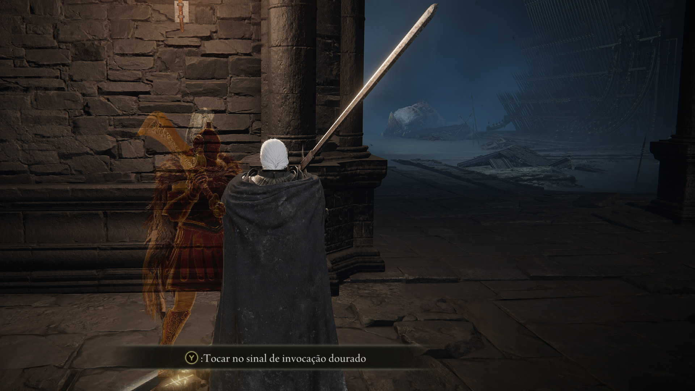
     
    <em>Figura 1a: Entrada da arena com o sinal de invocação da Freyja.</em>

    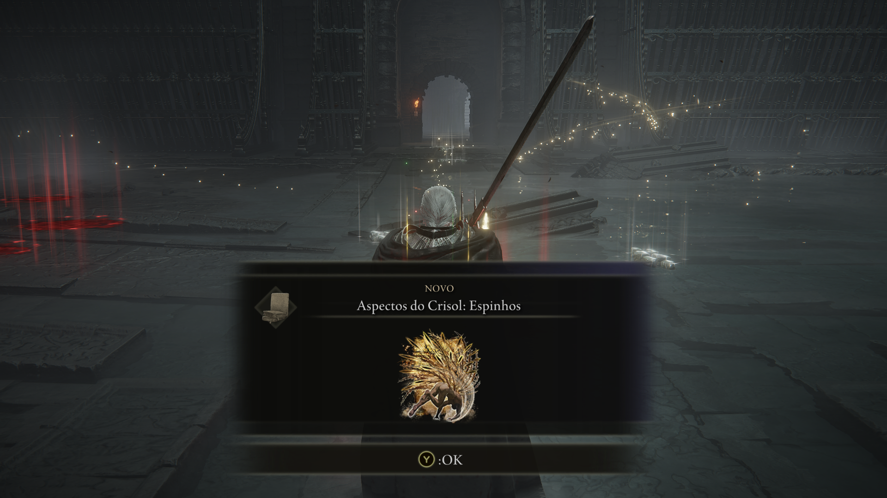
     
    <em>Figura 1b: Cinza de Guerra: Aspectos do Crisol (Espinhos).</em>

    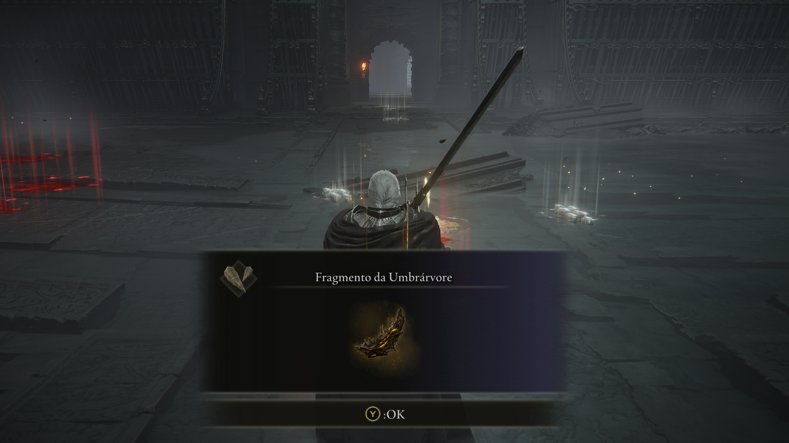
     
    <em>Figura 1c: Drop duplo de Fragmentos de Umbrárvore (Upgrade).</em>

    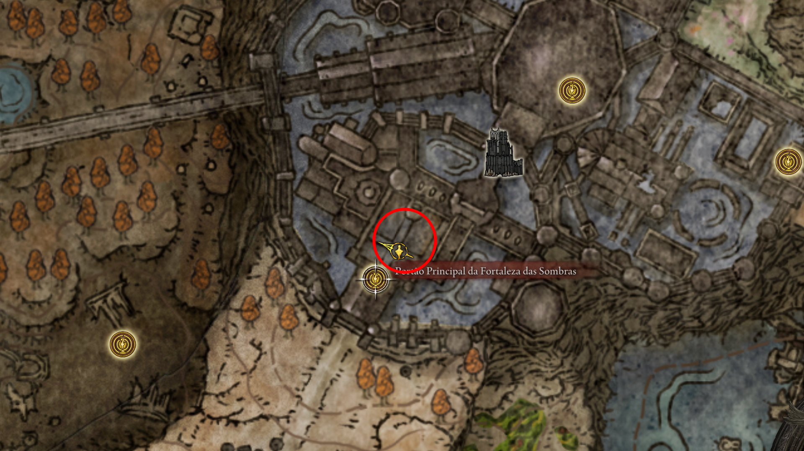
     
    <em>Figura 1d: Arena de combate no pátio inferior do Castelo das Sombras.</em>

---

## 📚 02. Armazém de Espécimes (Primeiro Andar)
Uma biblioteca vertical massiva que serve como centro de pesquisa de Messmer sobre as criaturas e a história das Terras das Sombras.

* **Descrição:** Ative a Graça e comece a subida. Logo no primeiro andar, escondida entre as estantes de livros à esquerda (atrás de um Cavaleiro de Fogo), você encontrará a Main-gauche.
* **Item:** **Main-gauche** (Adaga de Aparagem).
* **Categoria:** `weapons/daggers`.

    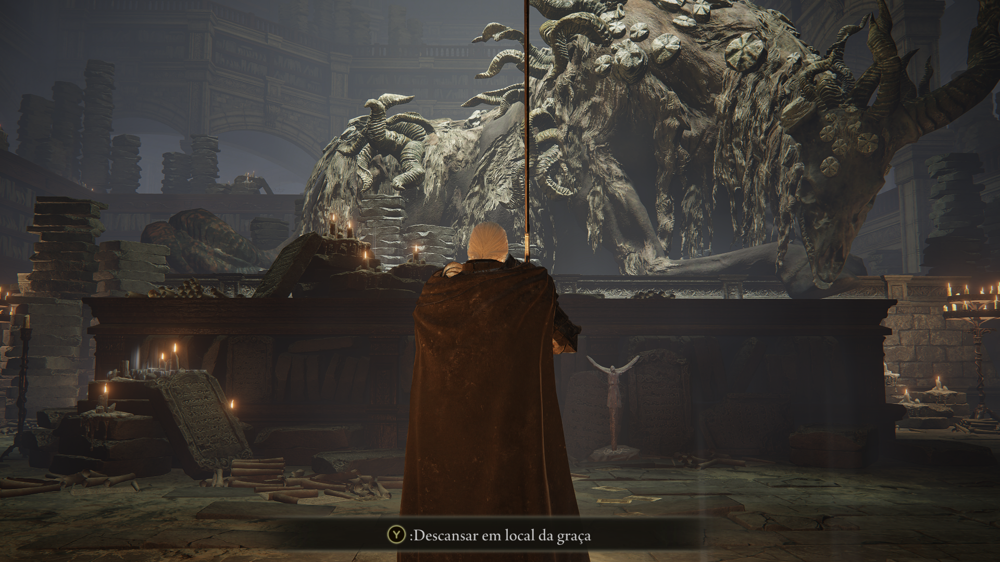
     
    <em>Figura 2a: A base da torre de pesquisa de Messmer.</em>

    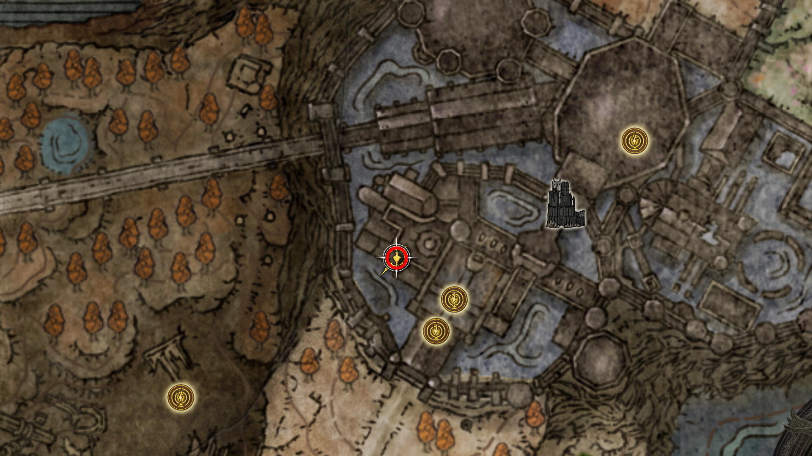
     
    <em>Figura 2b: Localização da Main-gauche entre as estantes do primeiro andar.</em>

---

## 🪜 03. Ascensão Vertical (Acesso ao 4º Andar)
Para progredir no Armazém, é necessário utilizar a arquitetura central e as estátuas de espécimes suspensas.

* **Descrição:** Siga pelas escadas atrás do local da Main-gauche. Suba as estruturas de madeira e utilize o pé da estátua colossal para alcançar o nível superior.
* **Ação:** Prossiga até encontrar e ativar a Graça do 4º Andar.

    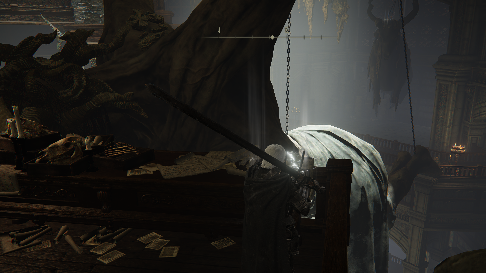
     
    <em>Figura 3: Imagem da estátua por onde deve subir para o 4º andar.</em>

--- 

## ✨ 04. Fragmento e Cruz de Miquella (4º Andar)
Um ponto de descanso crucial que oferece visão externa da fortaleza.

* **Descrição:** Localizado na varanda externa, logo ao lado da Graça do 4º Andar.
* **Item:** **Fragmento de Umbrárvore (1)**.
* **Lore:** Aqui você encontrará uma mensagem da Cruz de Miquella, indicando sua passagem pelo armazém.

    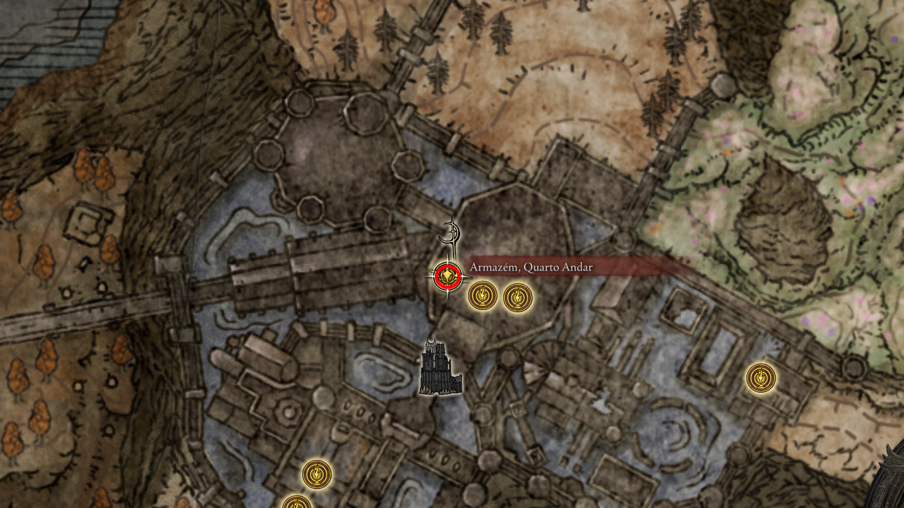
     
    <em>Figura 4: Localização do fragmento e da Cruz do Armazém.</em>

--- 

## 📜 05. Pergaminho de Rito Secreto
Este documento contém informações proibidas sobre os rituais de divindade de Miquella.

* **Descrição:** A partir da Graça do 4º andar, desça as escadas em direção à área de estudos menor à esquerda. O item está em um corpo sobre uma mesa.
* **Item:** **Pergaminho de Rito Secreto**.

    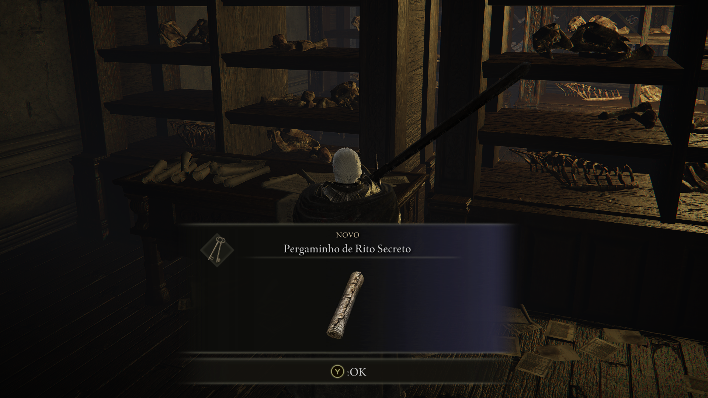
     
    <em>Figura 5: Local do Pergaminho de Rito Secreto.</em>

--- 

## 🛡️ 06. Diálogo com Freyja (7º Andar)
A guerreira Juba Vermelha busca entender o que seu antigo mestre, Radahn, tem a ver com os planos de Miquella.

* **Descrição:** Suba até o 7º andar. Freyja estará próxima à lareira.
* **NPC:** **Freyja**. Ela pedirá que você fale com Sir Ansbach para esclarecer suas dúvidas sobre o "Rito Secreto".

    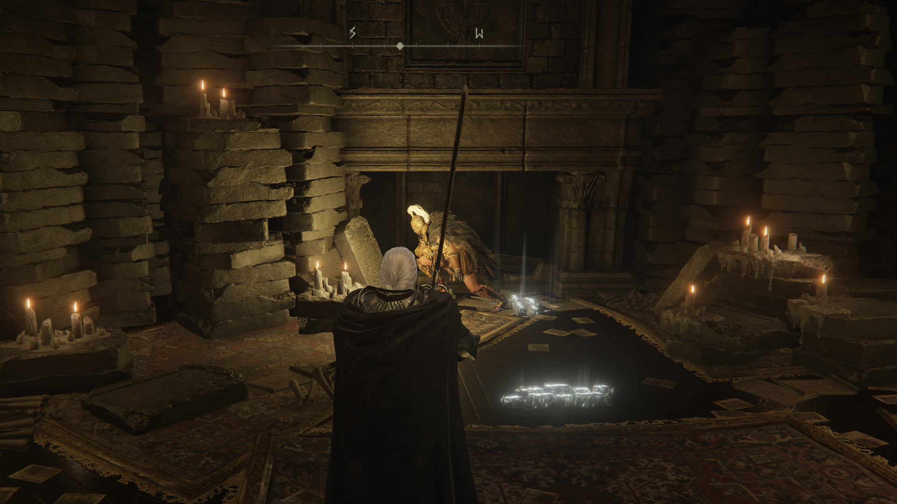
     
    <em>Figura 6: Encontro com Freyja no 7º andar do armazém.</em>

--- 

## 🧐 07. Sir Ansbach e a Descoberta
O erudito dos Cavaleiros de Sangue está no primeiro andar tentando decifrar as intenções de Miquella.

* **Descrição:** Volte para a Graça do Primeiro Andar e fale com Sir Ansbach na sala lateral.
* **Ação:** Entregue o **Pergaminho de Rito Secreto** para ele.
* **NPC:** **Sir Ansbach**.

    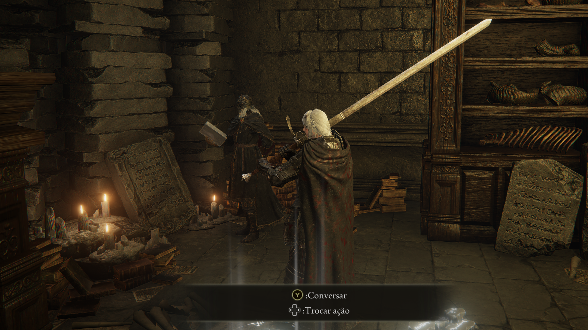
     
    <em>Figura 7: Entregando o pergaminho para Sir Ansbach.</em>

--- 

## ✉️ 08. A Carta de Ansbach
Ansbach demonstra respeito pela curiosidade de Freyja e decide ajudá-la.

* **Descrição:** Após entregar o pergaminho, fale com ele novamente sobre a Juba Vermelha.
* **Item:** **Carta para Freyja**.
* **Lore:** A carta contém informações que mudarão o destino da guerreira no conflito final.

    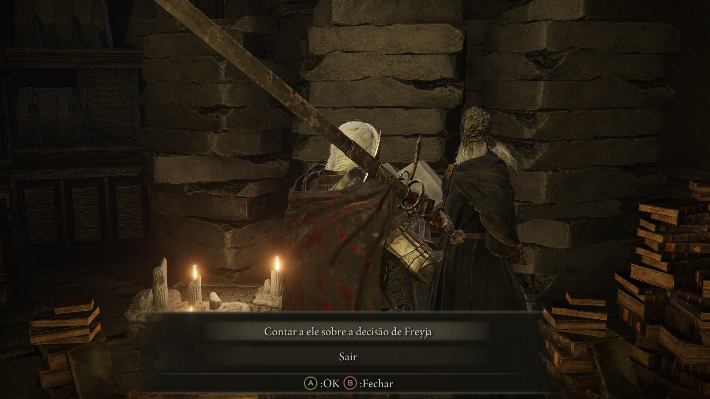
     
    <em>Figura 8: Sir Ansbach entregando a carta destinada à Freyja.</em>

--- 

## 🤝 09. Conclusão da Intermediação
Retorne ao topo para selar a cooperação entre os dois veteranos.

* **Descrição:** Entregue a carta de Ansbach para Freyja no 7º andar.
* **Resultado:** Freyja recupera seu propósito de batalha.

    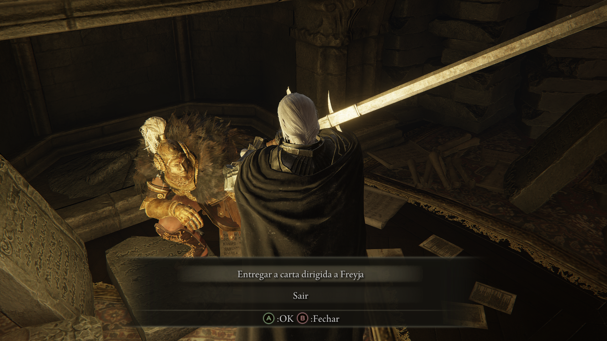
     
    <em>Figura 9: Entregando a carta de Ansbach no 7º andar.</em>

--- 

## 🦁 10. Recompensa: Escudo do Leão Dourado
Freyja presenteia o jogador em gratidão por sua ajuda.

* **Descrição:** Ao falar com ela após a entrega da carta, ela dirá: "Quem sabe nos veremos no campo de batalha".
* **Item:** **Escudo do Leão Dourado**.
* **Categoria:** `weapons/shields`.

    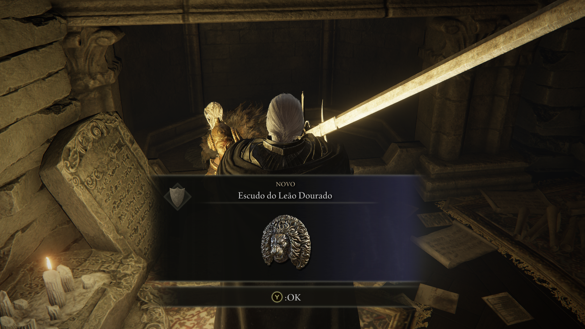
     
    <em>Figura 10: Item Escudo do Leão Dourado recebido de Freyja.</em>

--- 

## 🗡️ 11. A Intenção de Leda
Leda começa a duvidar da lealdade dos outros seguidores.

* **Descrição:** Vá até a Graça "Cruz da Estrada Principal" (Main Gate Cross).
* **Ação:** Fale com Leda. Ela expressará o desejo de eliminar o **Enviado do Chifre** (Hornsent), considerando-o uma ameaça aos planos de Miquella.

    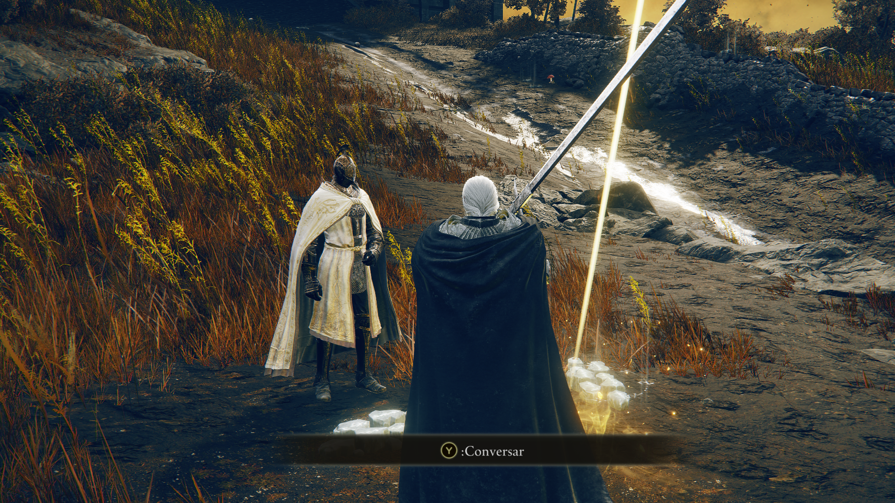
     
    <em>Figura 11: Diálogo com Leda sobre a caça ao Enviado do Chifre.</em>

---

## ✨ 12. Cinza Espiritual Reverenciada (7º Andar)
Item essencial para o upgrade das cinzas de invocação.

* **Descrição:** Localizada próxima à Graça do 7º andar, em um corpo pendurado nos espécimes centrais.
* **Item:** **Cinza Espiritual Reverenciada**.

    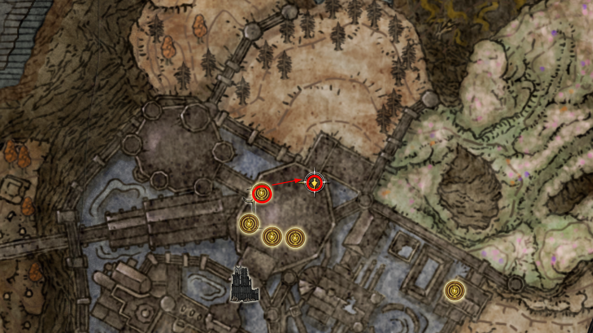
     
    <em>Figura 12: Localização da Cinza Espiritual Reverenciada no 7º andar.</em>

--- 

## ⚙️ 13. Mecanismo do Armazém
Ativar este mecanismo altera a altura dos espécimes e libera novos caminhos.

* **Descrição:** Puxe a alavanca localizada no 7º andar, na área central.
* **Ação:** Isso moverá as estátuas suspensas, permitindo acesso ao andar de Messmer e ao sótão.

    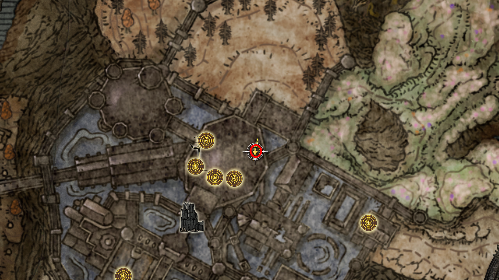
     
    <em>Figura 13a: Localização exata da alavanca.</em>

    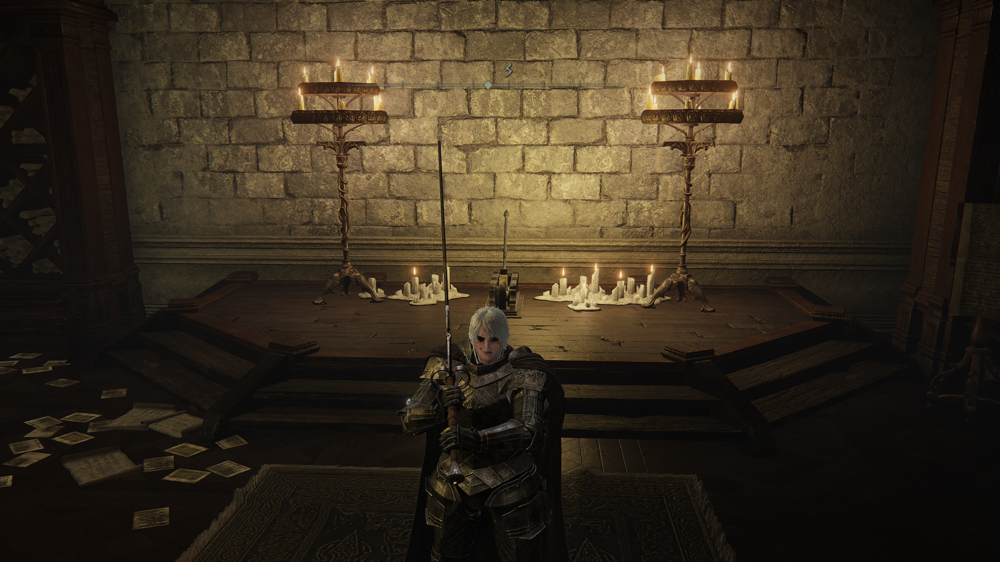
     
    <em>Figura 13b: Imagem visual da alavanca de controle do armazém.</em>

--- 

## 🐍 14. O Guardião da Câmara Escura
Um Cavaleiro de Fogo de elite protege a entrada para os aposentos de Messmer.

* **Descrição:** No caminho que leva à Graça "Entrada da Câmara Escura", você enfrentará este inimigo.
* **Drops:** **Elmo da Serpente Alada** e Cinza de Guerra: **Lança Flamejante**.

    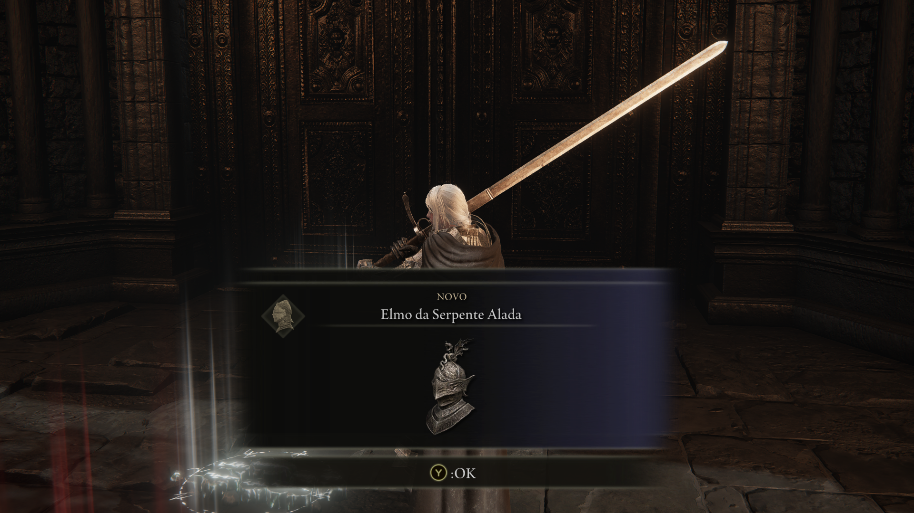
     
    <em>Figura 14a: Elmo da Serpente Alada coletado do Cavaleiro.</em>

    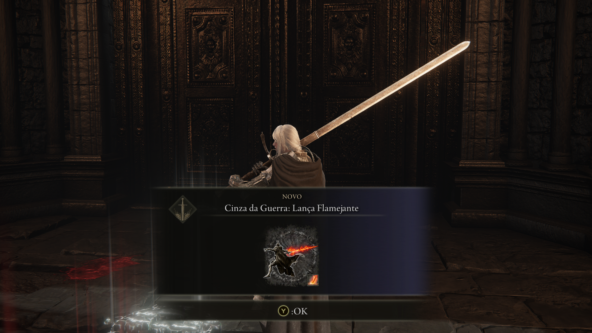
     
    <em>Figura 14b: Cinza de Guerra: Lança Flamejante.</em>

--- 

## ✨ 15. Fragmento da Câmara Escura
Último upgrade antes do boss principal da área.

* **Descrição:** Logo após abrir a porta que segue para a Graça "Entrada da Câmara Escura".
* **Item:** **Fragmento de Umbrárvore (1)**.

    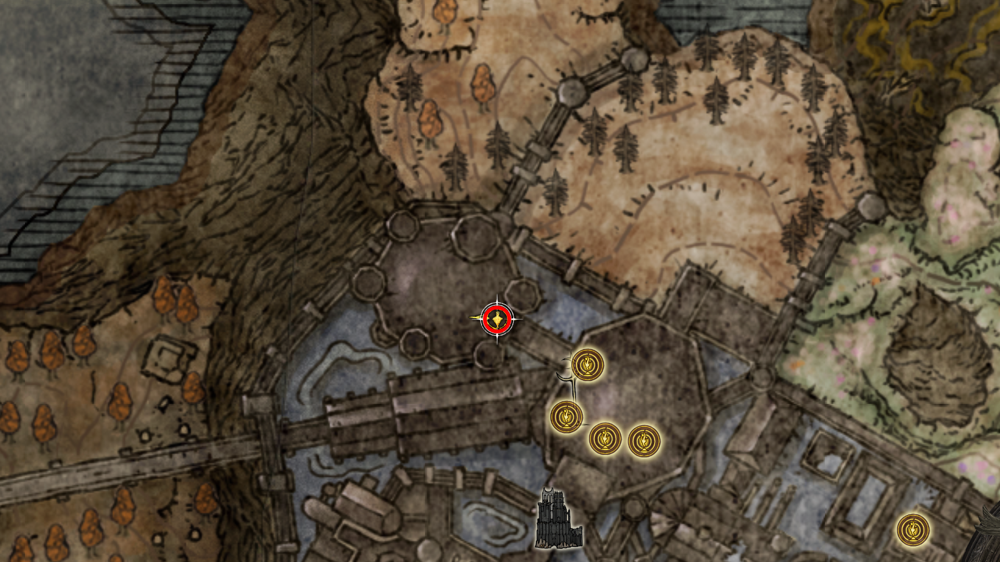
     
    <em>Figura 15: Fragmento localizado na antecâmara de Messmer.</em>

--- 

## 🏗️ 16. Acesso ao Sótão do Armazém
Uma área estrutural acima da biblioteca, repleta de morcegos e cavaleiros de fogo.

* **Descrição:** A partir da Graça "Armazém, Parte de Trás" (acessível pelo Distrito da Igreja), suba as escadas e elevadores.
* **Ação:** Libere a Graça "Armazém, Sótão".

    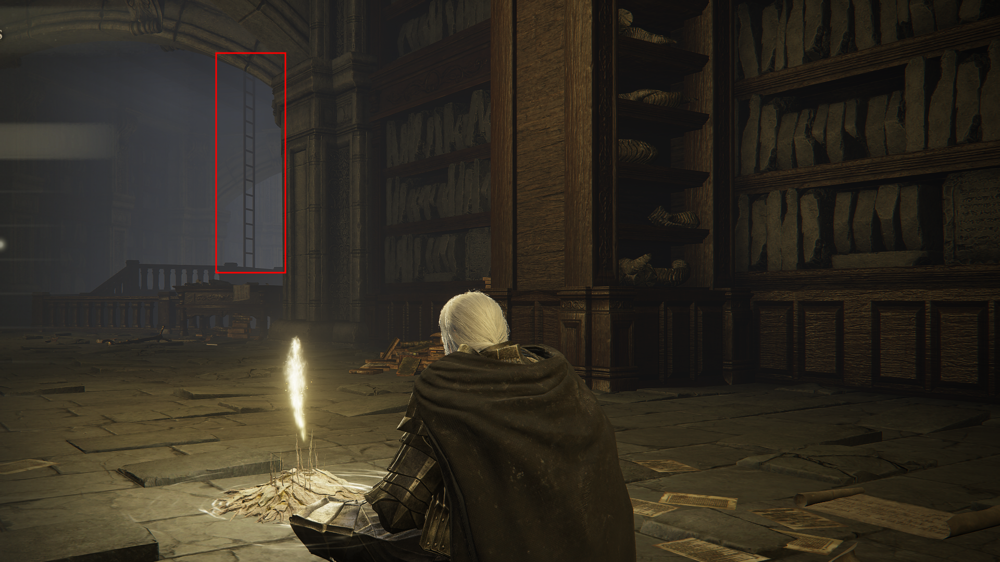
     
    <em>Figura 16: Vista do caminho para o Sótão do Armazém.</em>

--- 

## ⚔️ 17. Tesouros do Sótão: Hilde e Ira de Longe
Exploração lateral nas vigas superiores do castelo.

* **Descrição:** Navegue pelas vigas. Você encontrará o espírito de uma cavaleira de elite e um encantamento de força.
* **Itens:** Cinza de Invocação **Cavaleira de Fogo Hilde** e Encantamento **Ira de Longe**.

    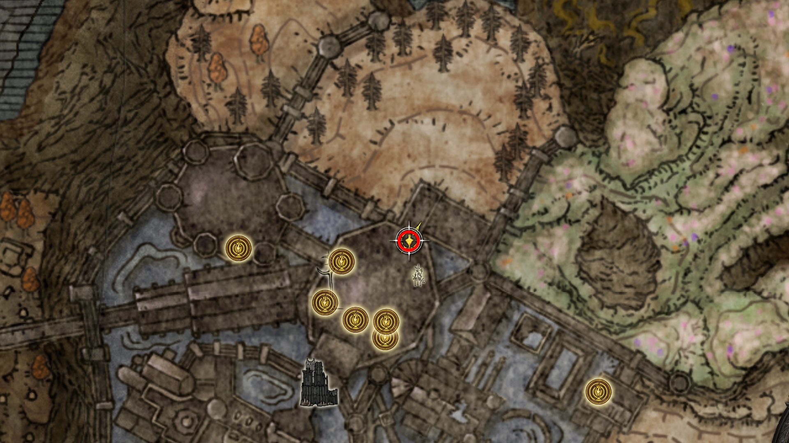
     
    <em>Figura 17a: Localização da Cinza da Cavaleira de Fogo Hilde.</em>

    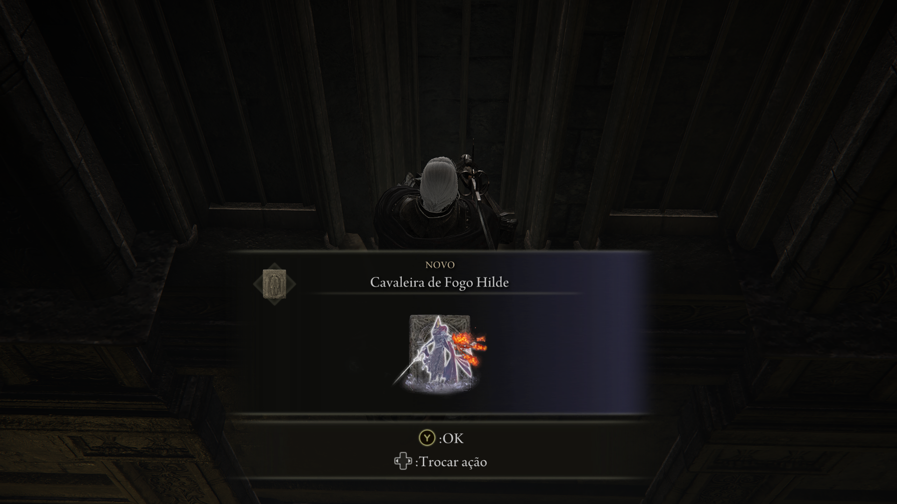
     
    <em>Figura 17b: Item Cinza de Invocação Cavaleira de Fogo Hilde.</em>

    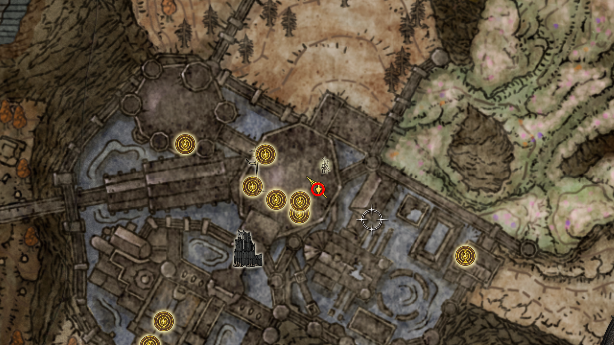
     
    <em>Figura 17c: Localização do Encantamento Ira de Longe.</em>

    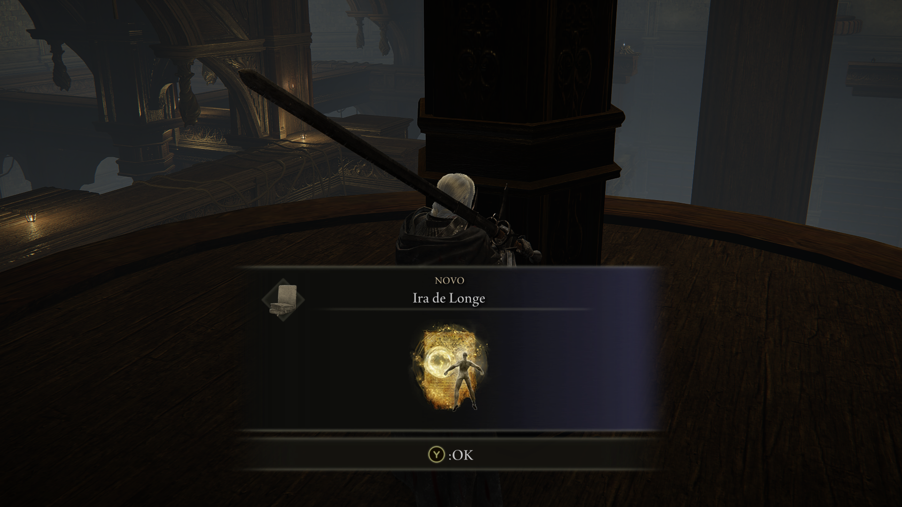
     
    <em>Figura 17d: Item Encantamento Ira de Longe.</em>

--- 

## 🚪 18. Portão dos Fundos (Acesso às Terras Altas)
Uma saída secreta que leva ao nordeste do mapa (Hinterlands).

* **Descrição:** Avance pelas vigas do sótão até encontrar o elevador que desce para a Graça "Fortaleza das Sombras, Portão dos Fundos".
* **Ação:** Ative a Graça.

    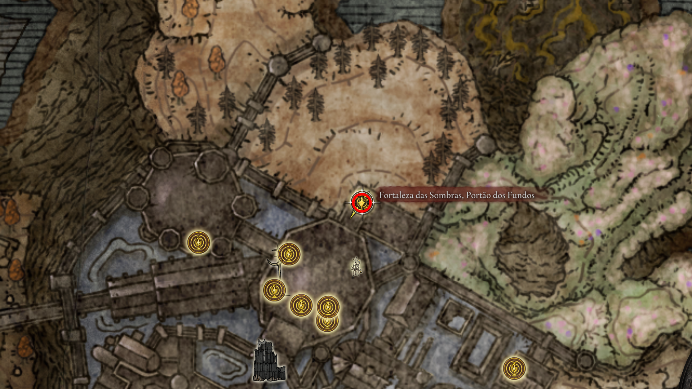
     
    <em>Figura 18: Área do Portão dos Fundos da fortaleza.</em>

--- 

## ✨ 19. Fragmento do Portão dos Fundos
* **Descrição:** Localizado à direita da Graça "Fortaleza das Sombras, Portão dos Fundos", em frente a uma estátua.
* **Item:** **Fragmento de Umbrárvore (1)**.

    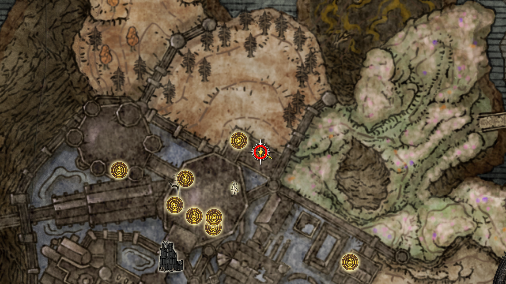
     
    <em>Figura 19: Fragmento de Umbrárvore na saída dos fundos.</em>

--- 

## 🎇 20. Cinzas da Guerra: Paredes de Faíscas
* **Descrição:** Partindo da Graça do 1º Andar do Armazém, utilize o elevador que leva à região inferior onde estão os jarros gigantes.
* **Item:** **Cinzas de Guerra: Paredes de Faíscas**.

    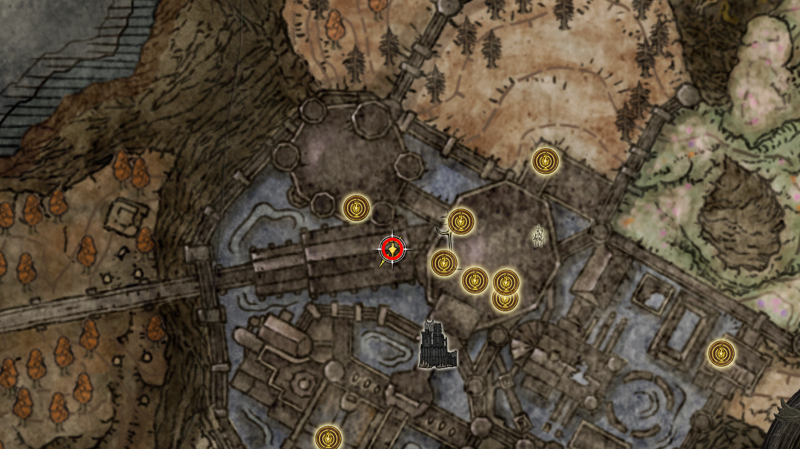
     
    <em>Figura 20: Localização das Cinzas de Guerra: Paredes de Faíscas.</em>

--- 

## 🏰 21. Graça: Forte Oeste
Acesso à muralha externa que conecta a áreas secundárias do viaduto.

* **Descrição:** Saindo da Graça do Primeiro Andar do Armazém, siga para o lado oposto ao elevador principal até sair na muralha.
* **Ação:** Ative a Graça "Forte Oeste".

    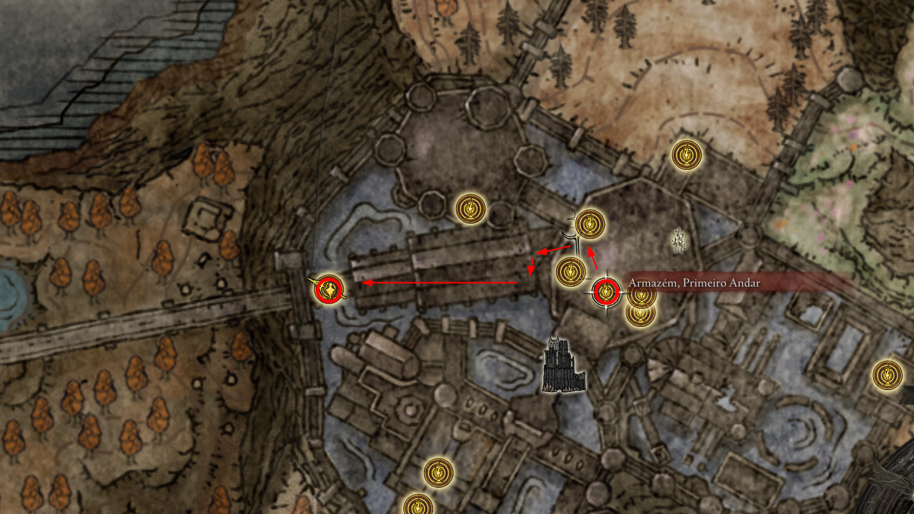
     
    <em>Figura 21: Caminho para a Graça do Forte Oeste.</em>

--- 

## 🌧️ 22. Viaduto e o Capuz de Salza
Uma travessia perigosa sob chuva de fogo.

* **Descrição:** Use o Torrent para atravessar a ponte longa. No final, derrote o Cavaleiro de Fogo na torre.
* **Drops:** **Capuz de Salza** e Encantamento **Chuva de Fogo**.
* **Fim:** Ative a Graça "Torre Menor do Viaduto".

    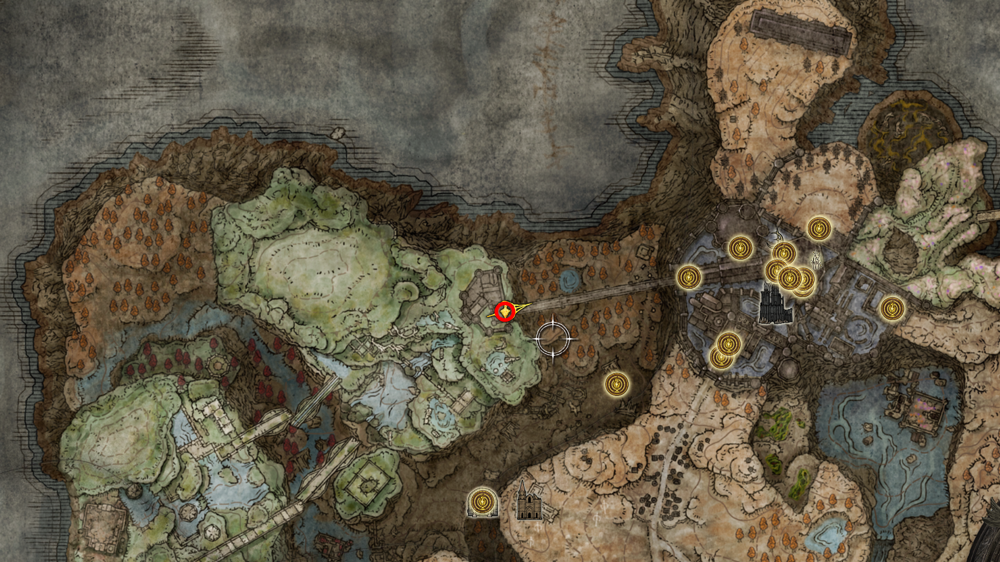
     
    <em>Figura 22a: Local do combate contra o cavaleiro de fogo no viaduto.</em>

    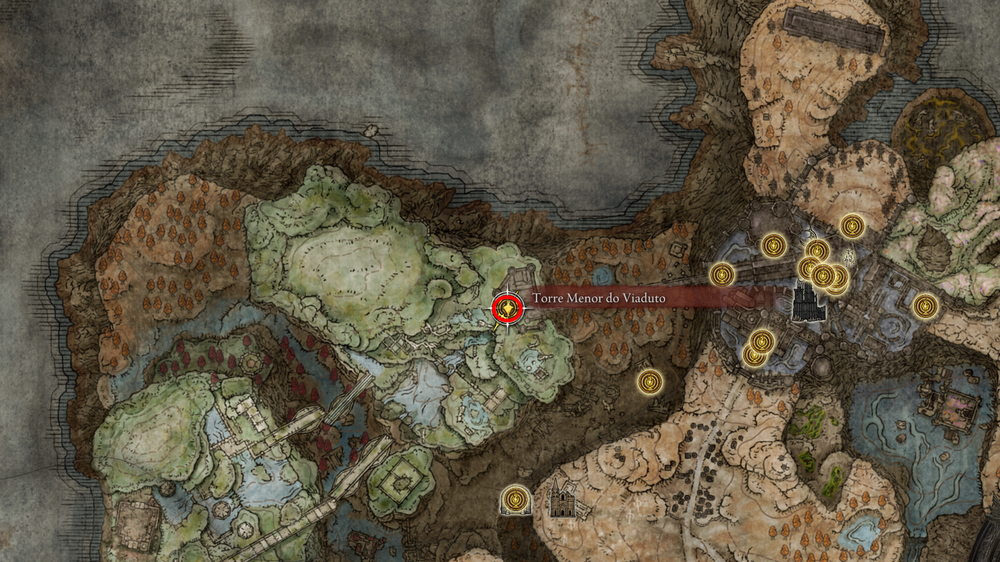
     
    <em>Figura 22b: Localização da Graça Torre Menor do Viaduto.</em>

--- 

## ⚔️ 23. Sinais de Invasão: Leda vs Hornsent
O conflito entre os seguidores de Miquella chega a um ponto crítico.

* **Descrição:** Próximo à rampa da entrada da fortaleza (perto da Graça do 1º Andar), você verá dois sinais no chão.
* **Opções:** Ajudar Leda a matar Hornsent, ajudar Hornsent a repelir Leda, ou **ignorar ambos** (opção escolhida para manter todas as quests ativas e não perder drops).

    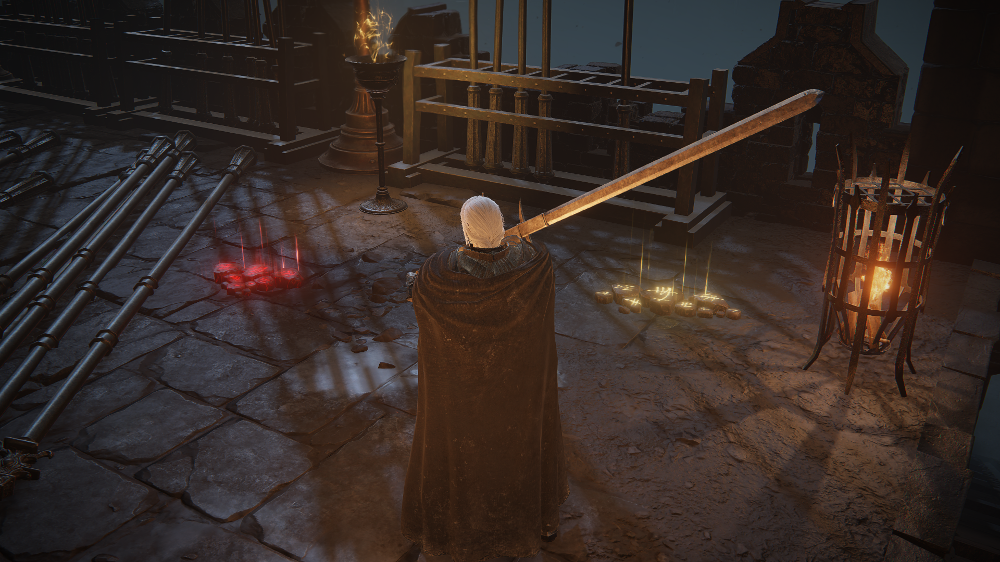
     
    <em>Figura 23: Sinais de invasão localizados no pátio próximo à escadaria.</em>

--- 

## ⚰️ 24. O Caixão para a Região Inferior
Atalho secreto para a base do castelo e o Rio de Reclusão.

* **Descrição:** Perto dos sinais de invasão de Ansbach e Leda, desça a escada lateral que leva ao canal de água, passe por uma parede falsa atrás da cachoeira e entre no caixão.
* **Transporte:** O caixão levará você até a Graça "Fonte do Castelo" (Castle Watering Hole).
* **Coleta de Fragmento:** Ao sair na área inundada e seguir em direção ao Gigante da Fornalha, você encontrará um **Fragmento de Umbravore** dentro de um caixão de pedra submerso.

    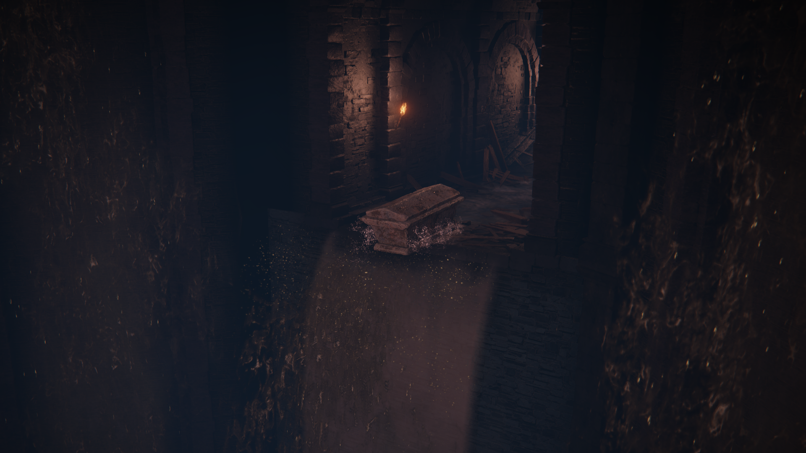
     
    <em>Figura 24a: Imagem do caixão que serve de transporte para a base do castelo.</em>

    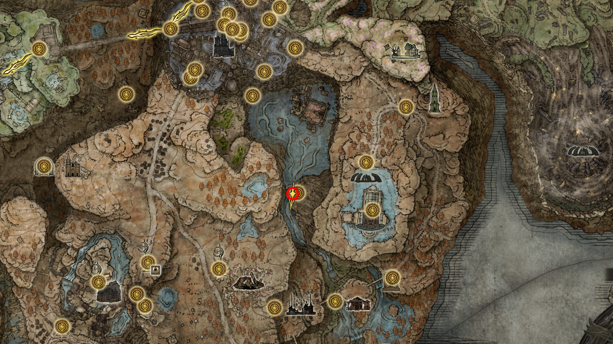
     
    <em>Figura 24b: Localização da Umbravore no caixão inundado (Ref: 21_location_36_loc).</em>

    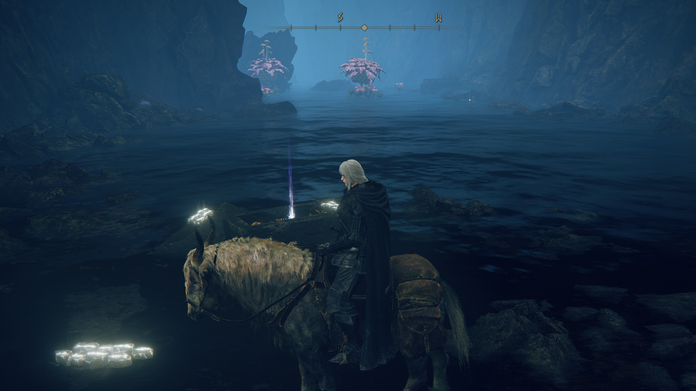
     
    <em>Figura 24c: Coleta da Umbravore (Ref: 21_location_36_item).</em>

---

## 🔥 25. Confronto: Messmer, o Impalador
O "filho indesejado" de Marika e senhor desta fortaleza. Ele possui uma forma de serpente amaldiçoada que libera na segunda fase da luta.

* **Local:** Graça "Entrada da Câmara Escura".
* **Recompensas:** **Lembrança do Impalador** e **Acendalha de Messmer**.
* **Lore:** A Acendalha de Messmer é o item necessário para queimar a Árvore Selada em Enir-Ilim mais tarde.

    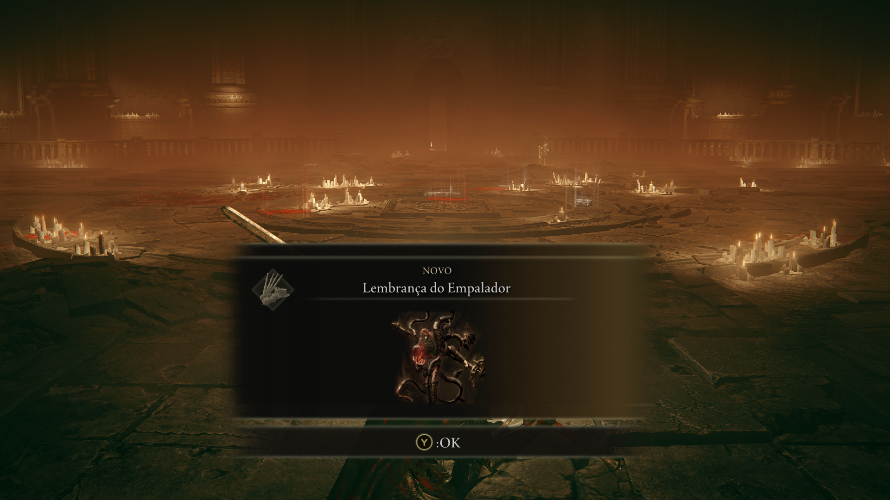
     
    <em>Figura 25a: Lembrança do Impalador obtida após a vitória.</em>

    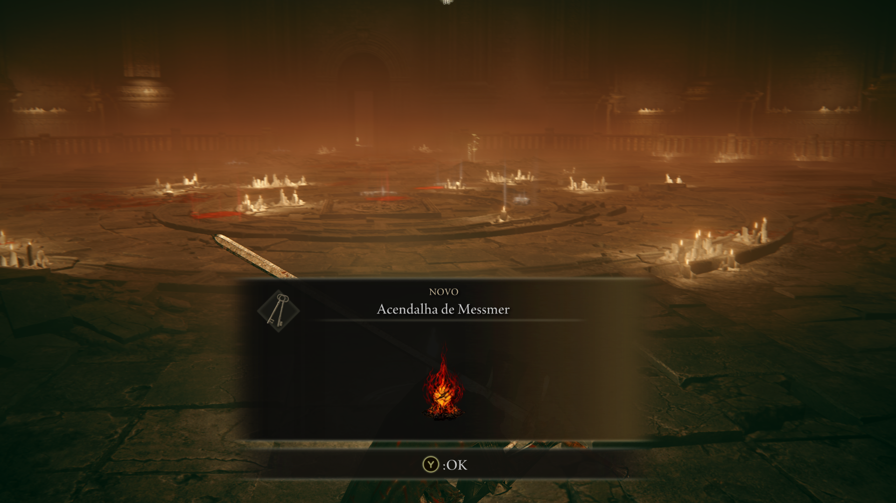
     
    <em>Figura 25b: Item de progressão Acendalha de Messmer.</em>

--- 

## 🗣️ 26. Diálogo com Hornsent Pós-Luta
* **Descrição:** Após derrotar Messmer e descansar na Graça da arena, fale com o Enviado do Chifre que aparecerá no local.
* **Contexto:** Ele expressará seu ódio consumado agora que Messmer caiu, mas seu caminho ainda cruza o seu.

    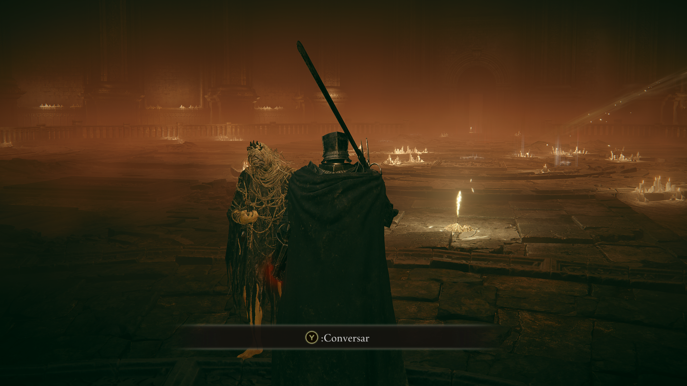
     
    <em>Figura 26: Conversando com Hornsent na arena de Messmer.</em>

--- 

## 🗡️ 27. O Próximo Alvo de Leda: Ansbach
Com Hornsent fora de seu foco imediato, Leda volta sua paranoia para o erudito.

* **Descrição:** Volte para a Graça "Cruz da Estrada Principal" e fale com Leda.
* **Ação:** Ela dirá que o próximo a ser purificado é Sir Ansbach.

    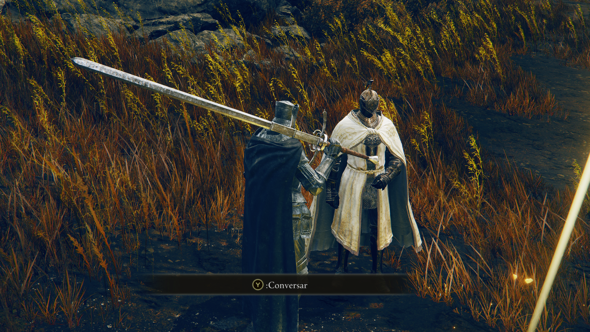
     
    <em>Figura 27: Leda revelando sua intenção de eliminar Sir Ansbach.</em>

--- 

## ⚔️ 28. Segundos Sinais de Invasão
* **Local:** No exato lugar onde Sir Ansbach estava no 1º Andar do Armazém.
* **Opção:** Como anteriormente, ignorar os sinais preserva a quest de ambos os personagens para o confronto final em Enir-Ilim.

    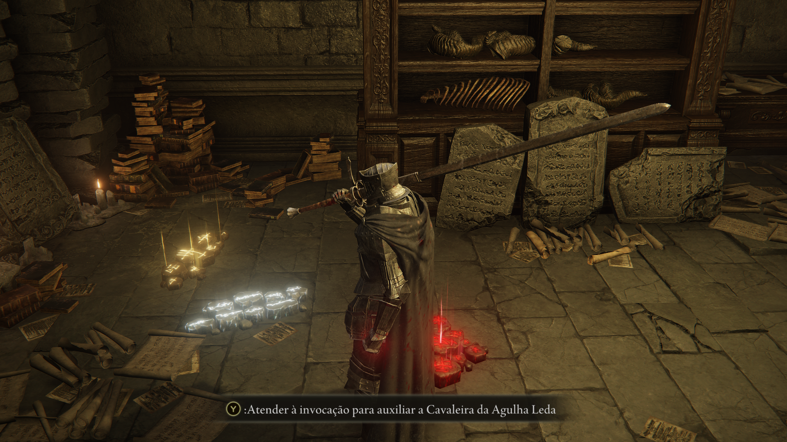
     
    <em>Figura 28: Sinais de invasão na sala de estudos de Ansbach.</em>

---  

## 👁️ 29. Íris da Ocultação: Distrito da Igreja
O Distrito da Igreja está submerso. Após drenar a água (alavanca nas muralhas), você pode explorar a base.

* **Descrição:** Derrote o boss de elite (Espirito de Árvore Ulcerado) na área central após drenar a água.
* **Recompensa:** **Íris da Ocultação**.

    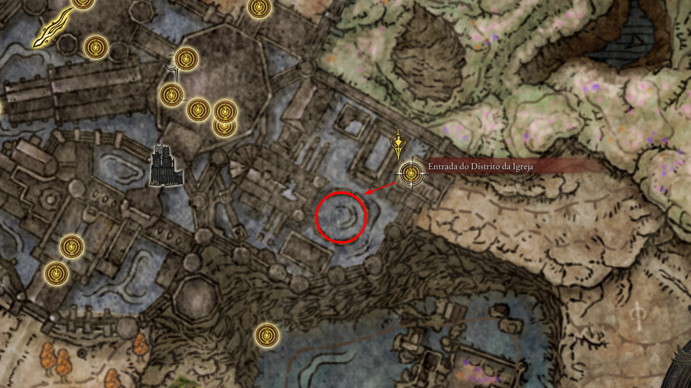
     
    <em>Figura 29a: Localização onde o boss aparece no Distrito da Igreja.</em>

    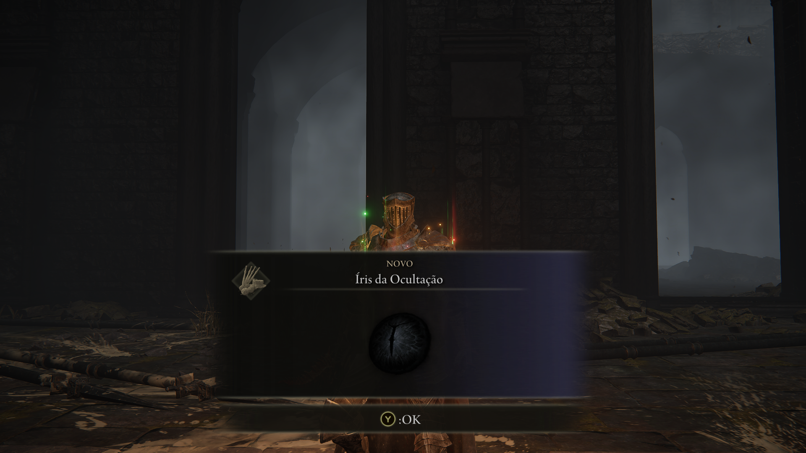
     
    <em>Figura 29b: Coleta da Íris da Ocultação.</em>

--- 

## 📜 30. Livro de Receitas do Devoto [1]
* **Local:** No nível inferior do Distrito da Igreja, em uma pequena sala após a drenagem.
* **Item:** **Livro de Receitas do Devoto das Batalhas [1]**.

    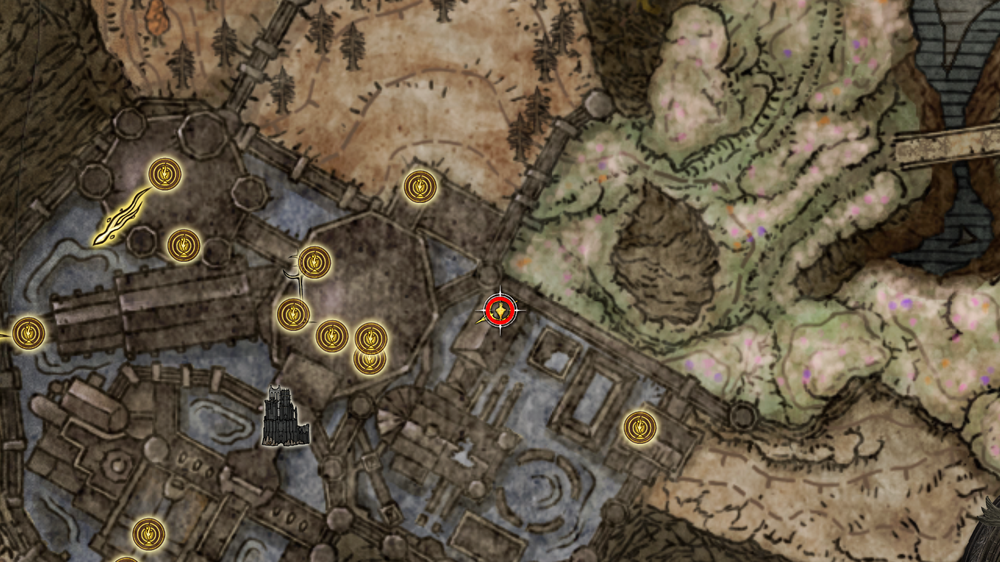
     
    <em>Figura 30a: Localização exata da receita.</em>

    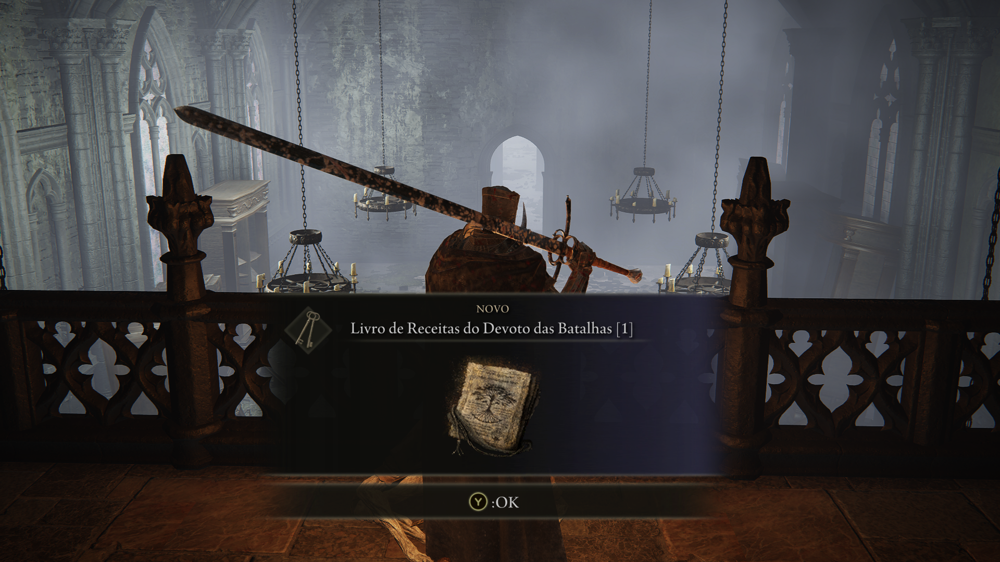
     
    <em>Figura 30b: Coleta do Livro de Receitas.</em>

--- 

## ✨ 31. Buscando a Íris da Graça
Um item opcional usado para concluir quests de NPCs de forma "benevolente".

* **Descrição:** A partir da Graça "Capela Submersa", pegue o elevador próximo que leva à Graça "Passagem de Adoração à Árvore".

    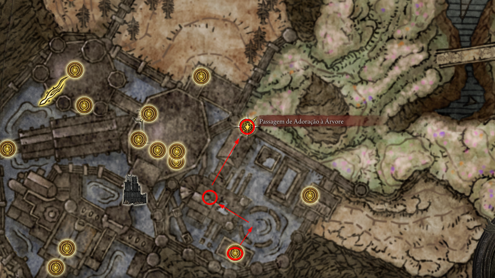
     
    <em>Figura 31: Elevador para a Passagem de Adoração à Árvore.</em>

--- 

## 🕯️ 32. Altar e Graça do Santuário
* **Ação:** No final do caminho da passagem, você encontrará um altar com a **Íris da Graça**.
* **Fim:** Desça as escadas para ativar a Graça "Santuário de Adoração à Árvore".

    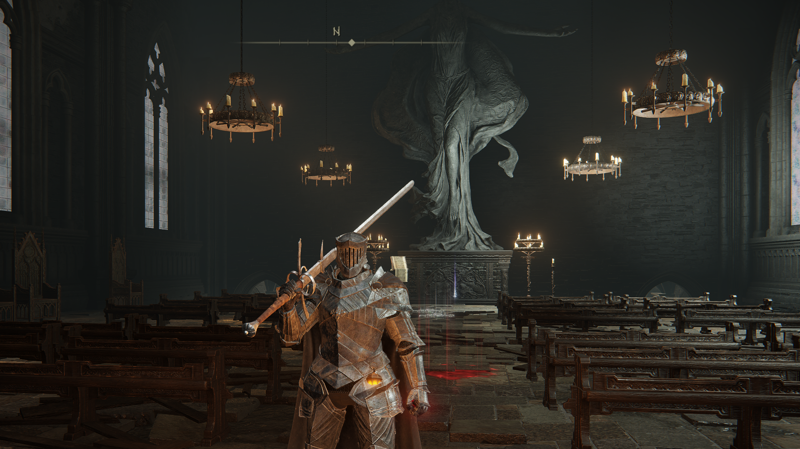
     
    <em>Figura 32: Altar contendo a Íris da Graça.</em>

--- 

## ✨ 33. Segunda Íris da Graça
* **Localização:** Volte para a Graça do 1º Andar do Armazém. Vá novamente para o elevador da região dos jarros (onde pegou a parede de faíscas).
* **Item:** **Íris da Graça** (segunda unidade).

    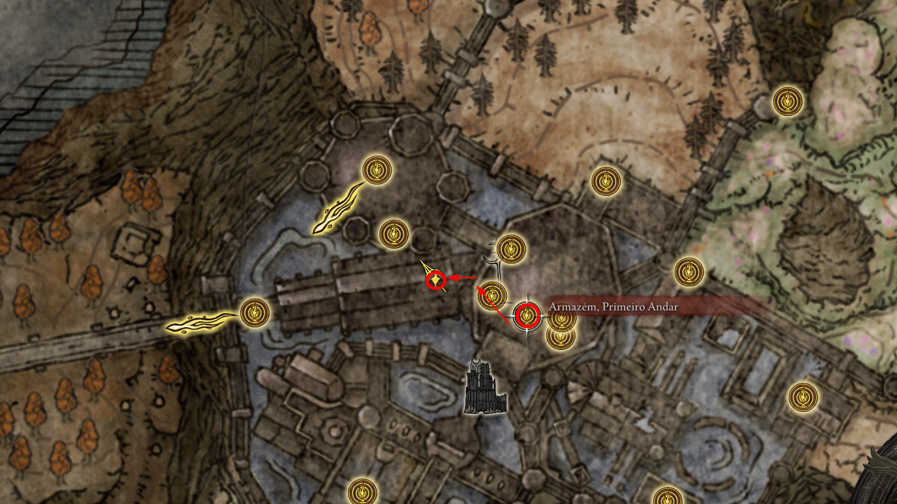
     
    <em>Figura 33a: Localização visual do item nos níveis inferiores.</em>

    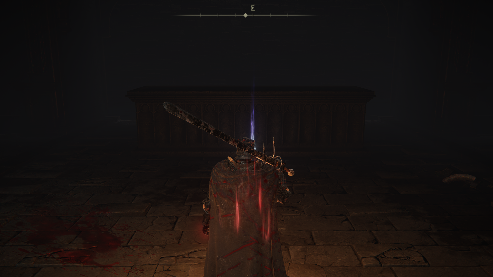
     
    <em>Figura 33b: Coleta da segunda Íris da Graça.</em>

--- 

## 🏹 34. Continuidade na quest do Igon (Ponto de Paragem do Caminho do Pilar)
**Intro:** Retomamos a jornada de vingança de Igon contra o terrível Bayle, o Temível. Ele se encontra em estado deplorável no caminho para o pico.
* **Descrição:** Ponto de encontro inicial para a subida do Pico Irregular.
* **NPCs:** **Igon** (gritando de dor no chão).
* **Item:** Nenhum neste ponto exato, apenas diálogo.

    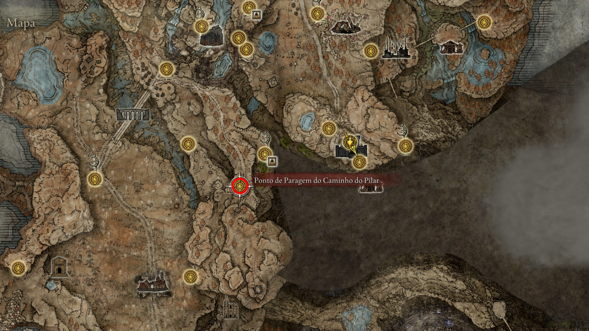
     
    <em>Figura 34: Igon em agonia no Ponto de Paragem do Caminho do Pilar.</em>

--- 

## 35. Invasão do Homem-Dragão Ancião
**Intro:** Ao avançar pelo caminho rochoso, o espírito de um antigo guerreiro draconiano guardará a passagem.
* **Descrição:** Evento de invasão obrigatório para progredir na área.
* **NPCs:** **Homem-Dragão Ancião** (Invasor).
* **Item:** **Graspa de Carne de Dragão** (consumível derrubado pelo invasor).

    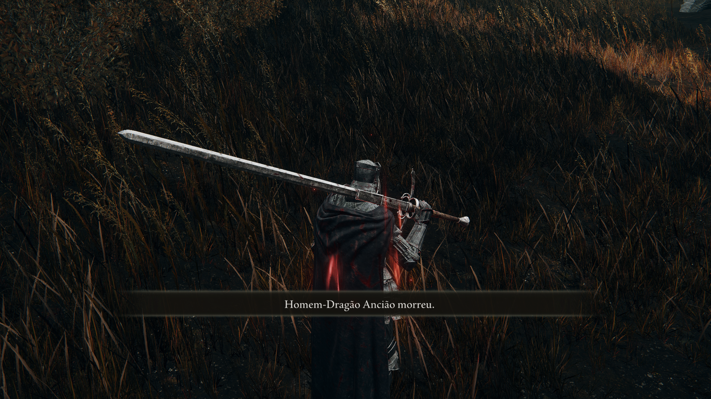
     
    <em>Figura 35: Local da invasão do Homem-Dragão Ancião na subida do pico.</em>

--- 

## 36. Poço do Dragão (Dragon's Pit)
**Intro:** Uma masmorra curta que serve como túnel de acesso ao Pico Irregular. O caminho termina em um abismo que intimida os jogadores.
* **Descrição:** Caverna repleta de mortos-vivos e guerreiros que cultuam dragões.
* **Dica:** Não tenha medo do buraco no final; pular nele é a única forma de chegar à arena do chefe.

    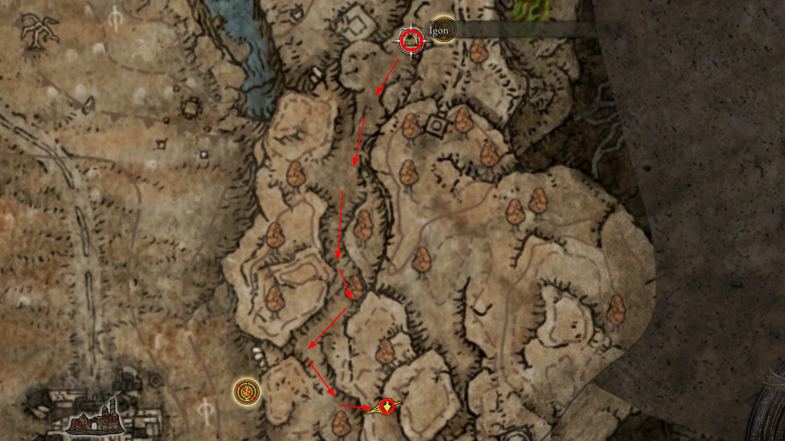
     
    <em>Figura 36: Entrada da masmorra Poço do Dragão e o caminho para o abismo.</em>

--- 

## 37. Chefe: Homem-Dragão Ancião (Forma Humana)
**Intro:** Ao cair no buraco, você enfrentará a forma física do invasor anterior.
* **Descrição:** Vitória sobre o guardião do Poço.
* **Item:** **Katana Grande do Caçador de Dragão** (Arma essencial para enfrentar Bayle devido ao dano bônus contra dragões).

    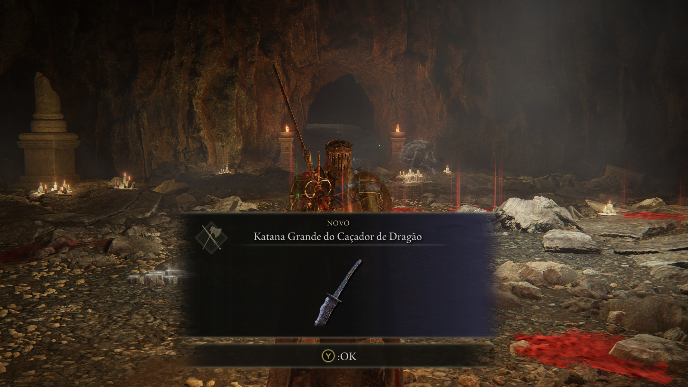
     
    <em>Figura 37: Katana Grande do Caçador de Dragão, sua melhor aliada nesta área.</em>

--- 

## 38. Sopé do Pico Irregular e os Dragões em Combate
**Intro:** Ao sair do Poço, você encontrará um vale onde dois dragões estão em uma luta territorial encarniçada.
* **Descrição:** Área aberta com clima tempestuoso.
* **Dica:** Deixe-os lutarem entre si para reduzir o HP de ambos antes de intervir.

    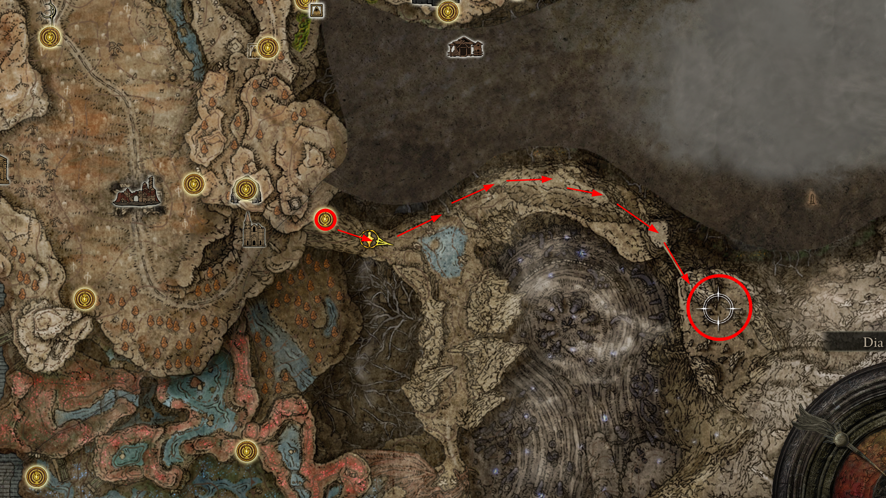
     
    <em>Figura 38: Panorama do Sopé do Pico Irregular com os dragões em combate.</em>

--- 

## 39. Recompensas da Luta Dracônica
**Intro:** Coleta de materiais após a derrota dos dragões no vale.
* **Itens:** **Coração de Dragão** e **Carne de Escama de Dragão**.

    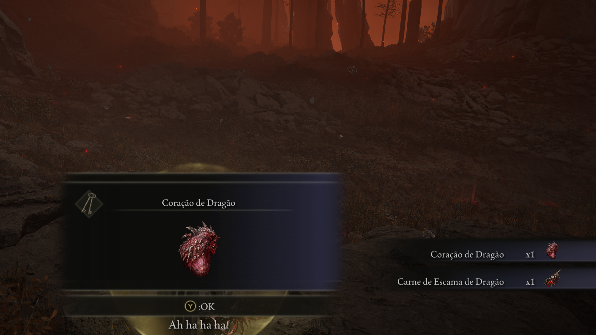
     
    <em>Figura 39: Itens de comunhão draconiana obtidos.</em>

--- 

## 40. O Dedo Enrolado de Igon
**Intro:** Igon está caído logo após o local da luta dos dragões. Seu corpo está quebrado, mas sua vontade de ver Bayle morto é absoluta.
* **Descrição:** Diálogo final antes da escalada definitiva.
* **Item:** **Dedo Enrolado de Igon** (permite invocá-lo especificamente dentro da arena de Bayle).

    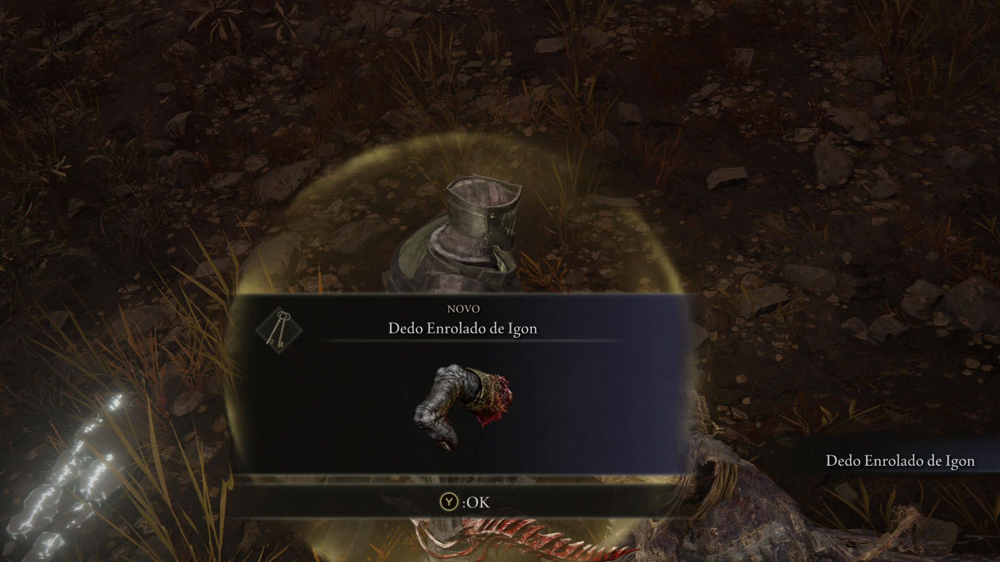
     
    <em>Figura 40: Igon entrega seu dedo para que você o leve até a batalha final.</em>

--- 

## 41. Fragmento de Umbravore no Pico
**Intro:** A subida é perigosa e cheia de rochas que caem (avalanches causadas por dragões).
* **Descrição:** Upgrade de status essencial para a DLC.
* **Localização:** Próximo às encostas onde as pedras rolam constantemente.

    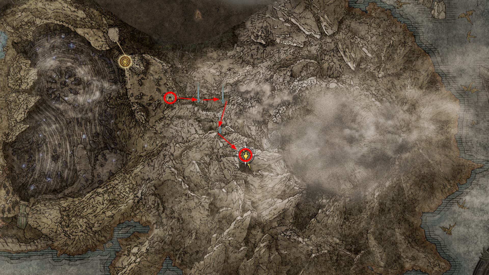
     
    <em>Figura 41: Fragmento de Umbravore escondido no caminho das pedras.</em>

--- 

## 42. Sanesaxx, o Dragão Ancião
**Intro:** Um dragão enorme e antigo que bloqueia o caminho para o cume. Ele utiliza ataques de raios vermelhos devastadores.
* **Descrição:** Sub-chefe de elite.
* **Items:** **Pedra de Forja de Dragão Ancião** e **Pedra de Forja Sombria de Dragão Ancião**.

    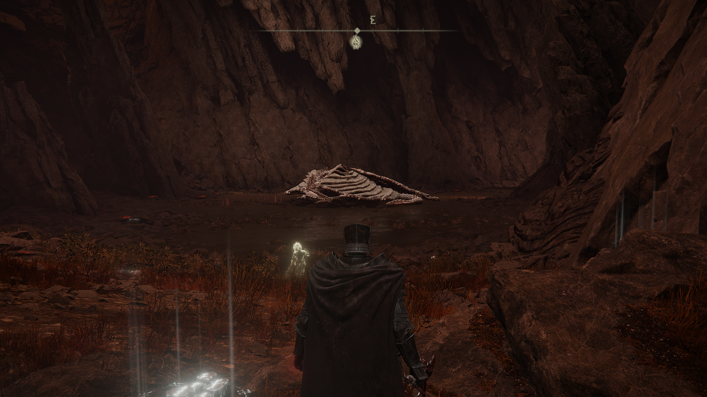
     
    <em>Figura 42a: O temível Dragão Ancião Sanesaxx.</em>

    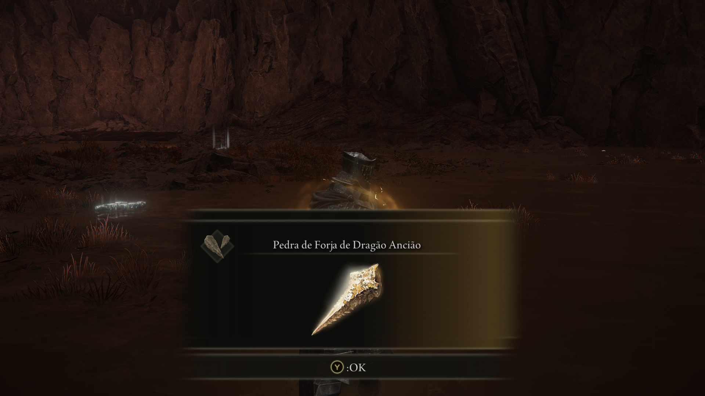
     
    <em>Figura 42b: Recompensas de upgrade máximo para armas.</em>

--- 

## 43. Chegada ao Cume do Pico Irregular
**Intro:** O ponto final da jornada. O céu fica vermelho e a eletricidade corta o ar.
* **Descrição:** Graças "Encosta do Pico Irregular" e "Cume do Pico Irregular".
* **Lore:** A arena de Bayle é o topo do vulcão onde ele se refugiou após lutar contra Placidusax.

    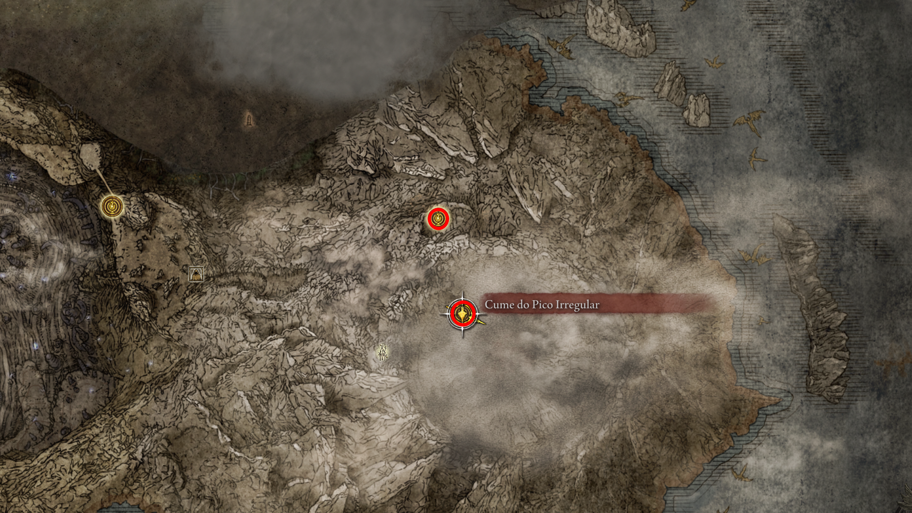
     
    <em>Figura 43a: Localização das últimas Graças antes do Boss.</em>

    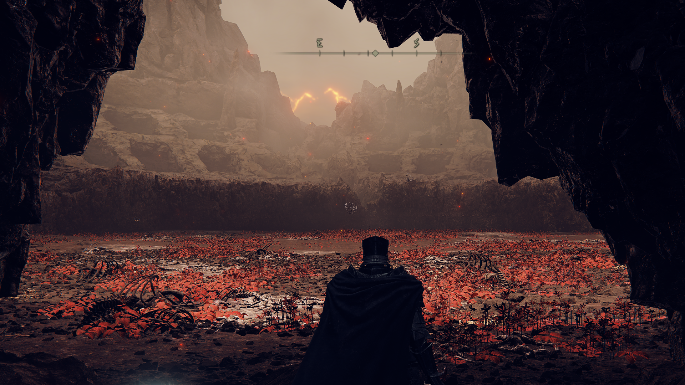
     
    <em>Figura 43b: A entrada para a arena de Bayle, o Temível.</em>

--- 

## 44. Grande Altar da Comunhão do Dragão
**Intro:** Acessível ao descer pelo caminho sul após o Poço do Dragão.
* **Descrição:** Um local de rituais onde jaz o corpo de um dragão gigante.
* **Combate:** Derrote o dragão no lago raso para limpar a área.

    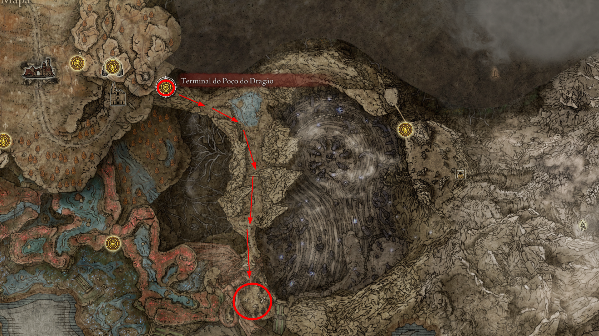
     
    <em>Figura 44: O Grande Altar da Comunhão do Dragão.</em>

--- 

## 45. A Sacerdotisa da Comunhão do Dragão
**Intro:** Uma serva de Lorde Placidusax que busca a morte de Bayle.
* **Descrição:** NPC que oferece rituais e informações sobre a guerra dos dragões.
* **Item:** **Bênção de Dragão Ancião** (item de buff consumível).

    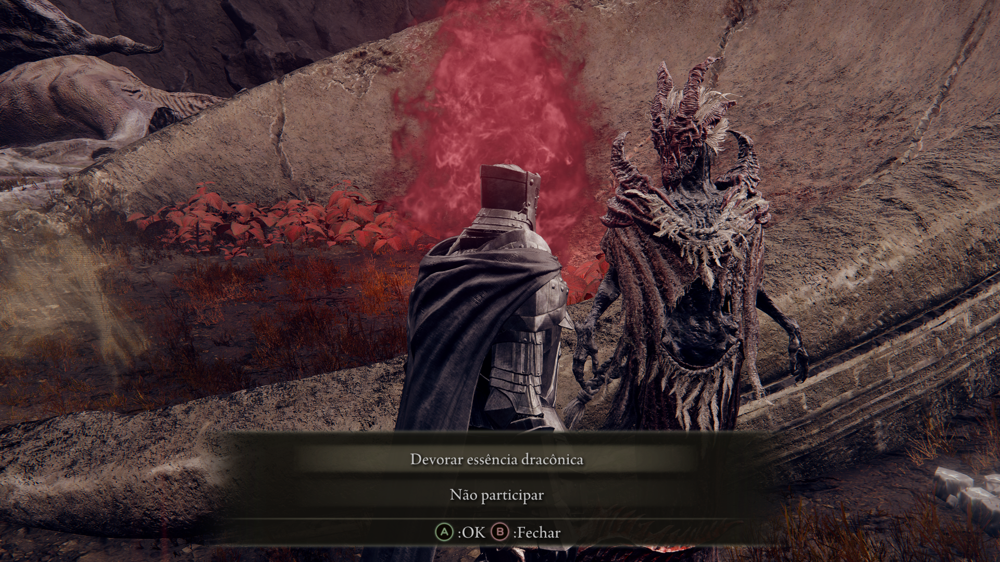
     
    <em>Figura 45a: A Sacerdotisa da Comunhão do Dragão.</em>

    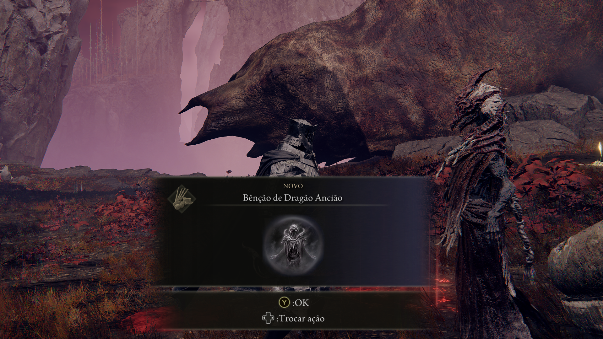
     
    <em>Figura 45b: Bênção recebida ao aceitar a missão.</em>

--- 

## 46. Usando a Poção de Thiollier na Sacerdotisa
**Intro:** Se você obteve a poção com Thiollier, pode intervir no destino dela.
* **Descrição:** Passe o tempo para a noite. Se ela estiver dormindo, use a poção.
* **Dica:** Isso altera o drop final que você receberá dela após a morte de Bayle.

    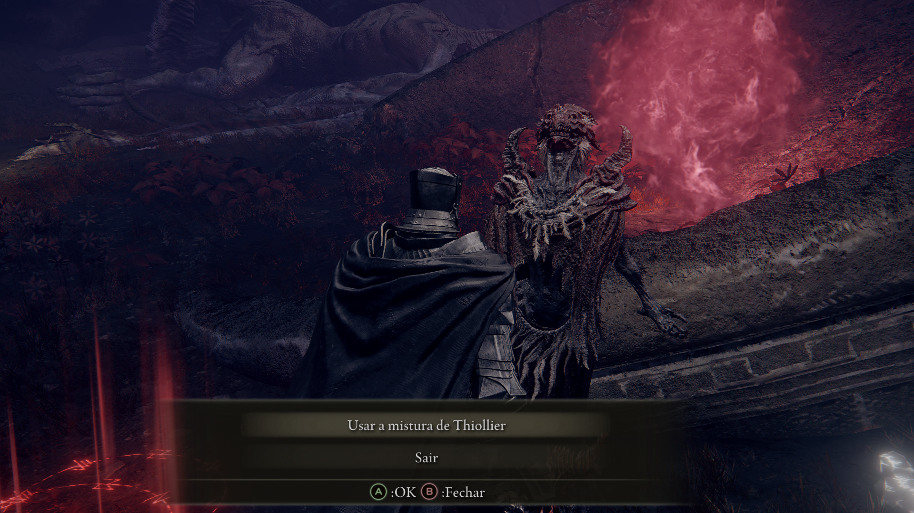
     
    <em>Figura 46: Momento exato para ministrar a poção de Thiollier.</em>

--- 

## 47. A Batalha contra Bayle, o Temível
**Intro:** Um dos chefes mais espetaculares da DLC. Invoque Igon para ouvir um dos melhores diálogos de dublagem do jogo.
* **Dica:** Use a Katana do Caçador de Dragão. O sinal de invocação do Igon está **dentro** da arena, à esquerda.
* **Item:** **Coração de Bayle** (pode ser trocado por encantamentos únicos no altar).

    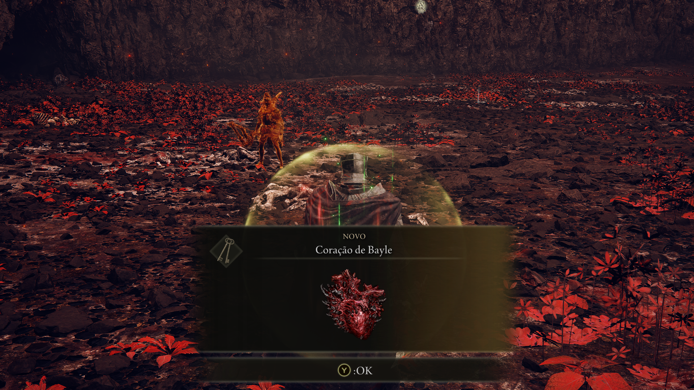
     
    <em>Figura 47: O triunfo sobre o tirano dos dragões.</em>

--- 

## 48. O Destino de Igon
**Intro:** Após a morte de Bayle, Igon finalmente pode descansar em paz.
* **Descrição:** Volte ao local onde ele estava anteriormente no Pico Irregular.
* **Itens:** **Set de Armadura de Igon**, **Sino de Igon** e o **Arco de Igon**.

    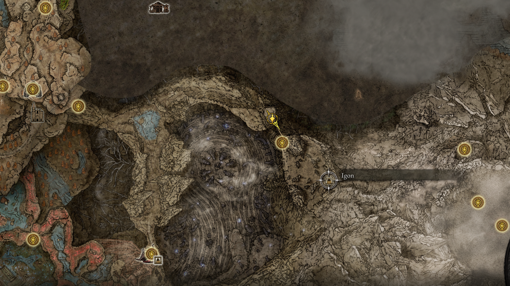
     
    <em>Figura 48a: Localização do descanso final de Igon.</em>

    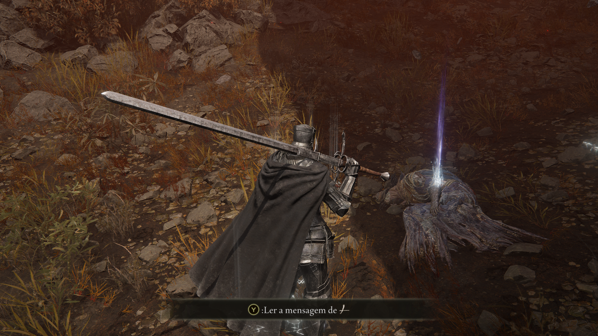
     
    <em>Figura 48b: Os restos mortais do guerreiro.</em>

    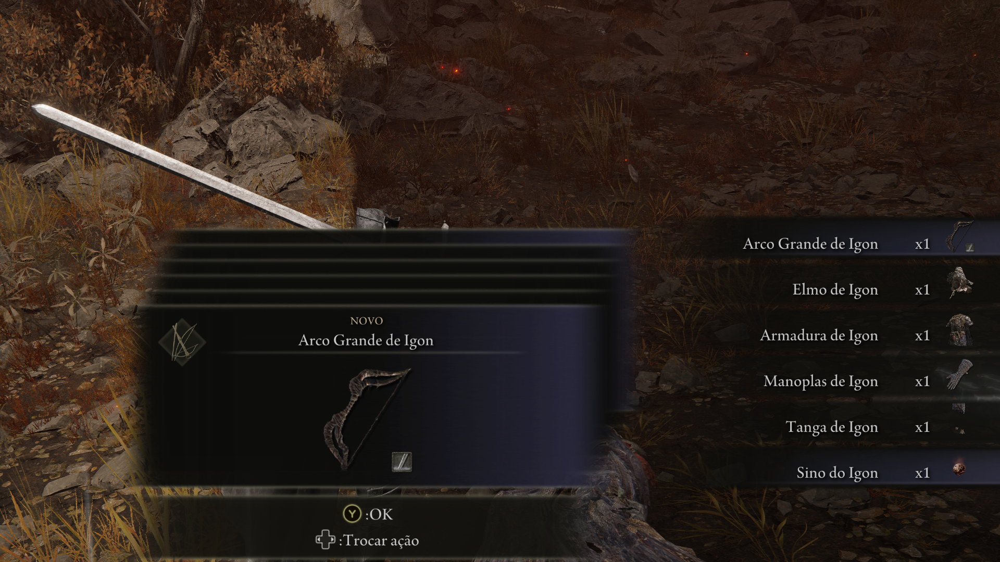
     
    <em>Figura 48c: O espólio de Igon, incluindo seu arco potente.</em>

--- 

## 49. Recompensa da Sacerdotisa (Florissax)
**Intro:** Ao retornar ao altar após a morte de Bayle (tendo usado a poção anteriormente).
* **Itens:** **Florissax's Dragonbolt** (Encantamento) e as Cinzas de Invocação **Florissax, o Dragão Ancião**.

    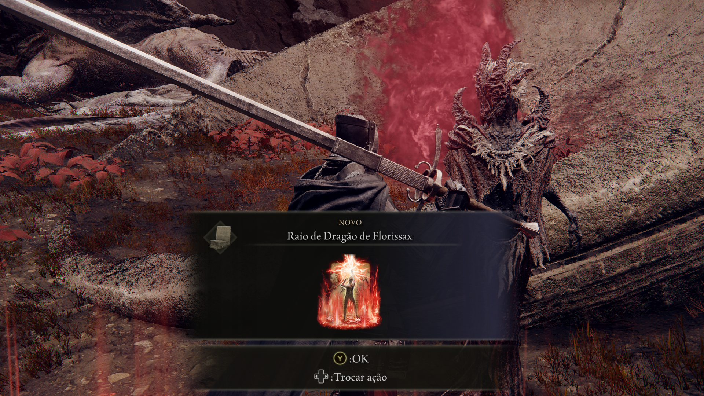
     
    <em>Figura 49a: Encantamento de relâmpago de Florissax.</em>

    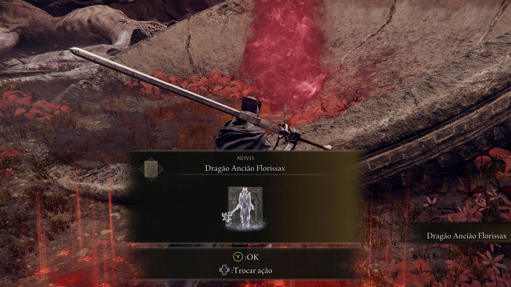
     
    <em>Figura 49b: Cinzas de invocação da Sacerdotisa Florissax.</em>

--- 

## 50. Finalizando a Quest de Queelign
**Intro:** Cavaleiro de Fogo Queelign pode ser encontrado em sua forma miserável em uma sala na Fortaleza das Sombras (requer a Chave da Sala de Oração).
* **NPCs:** Queelign (Invasor recorrente).

    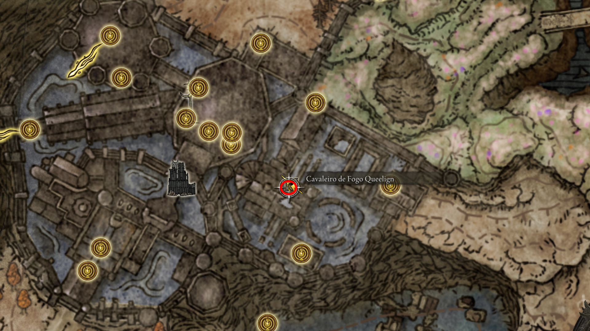
     
    <em>Figura 50: Localização da sala de oração de Queelign.</em>

--- 

## 51. Escolha da Íris: Graça vs Ocultação
**Intro:** O destino de Queelign depende da Íris que você entregar a ele.
* **Íris da Graça:** Concede as **Cinzas de Invocação de Queelign**.
* **Íris da Ocultação:** Concede a arma **Espada Grande de Queelign**.

    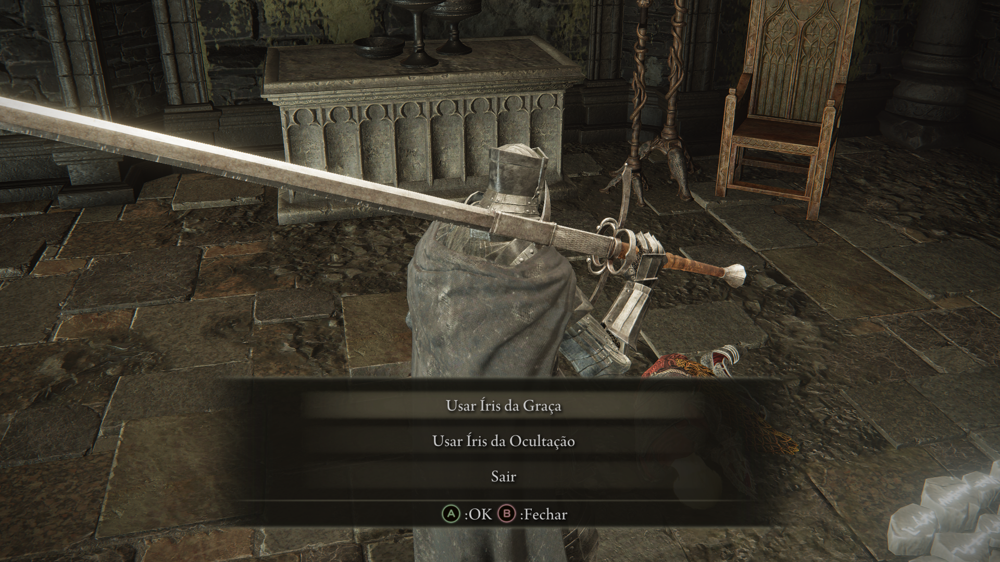
     
    <em>Figura 51: Momento da escolha das recompensas.</em>

--- 

## 52. Selo de Folhaseca (Dryleaf Seal)
**Intro:** Um selo sagrado essencial para builds que utilizam encantamentos de artes marciais e espiritualidade de Dane.
* **Descrição:** Encontrado em um corpo em um vilarejo abandonado na região do Rio de Reclusão.
* **NPCs:** Nenhum no local.
* **Item:** **Selo de Folhaseca**.

    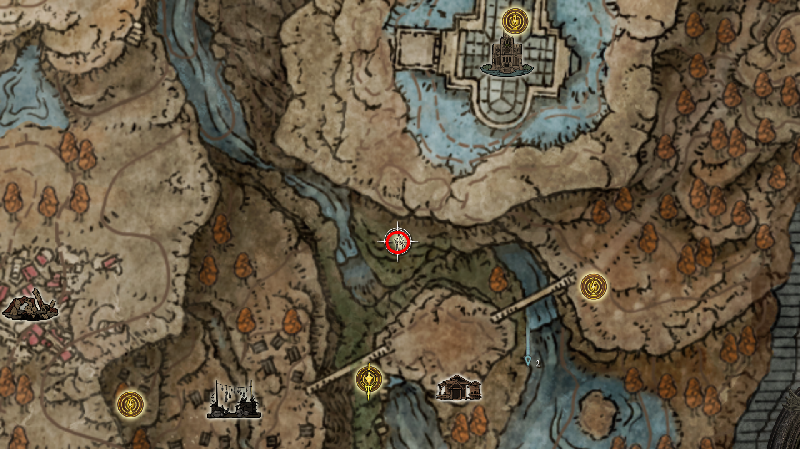
     
    <em>Figura 52: Localização do selo no vilarejo do Rio de Reclusão.</em>

--- 

## 53. Mausoléu Oriental: Set e Katana Grande de Rakshasa
**Intro:** Um dos confrontos mais desafiadores das áreas inferiores, guardando um set focado em alto dano e risco.
* **Descrição:** Localizado no Mausoléu Oriental do Deserto, acessível seguindo o curso do Rio de Reclusão.
* **NPCs:** Rakshasa (Chefe do Mausoléu).
* **Item:** **Set de Rakshasa** e **Katana Grande de Rakshasa**.

    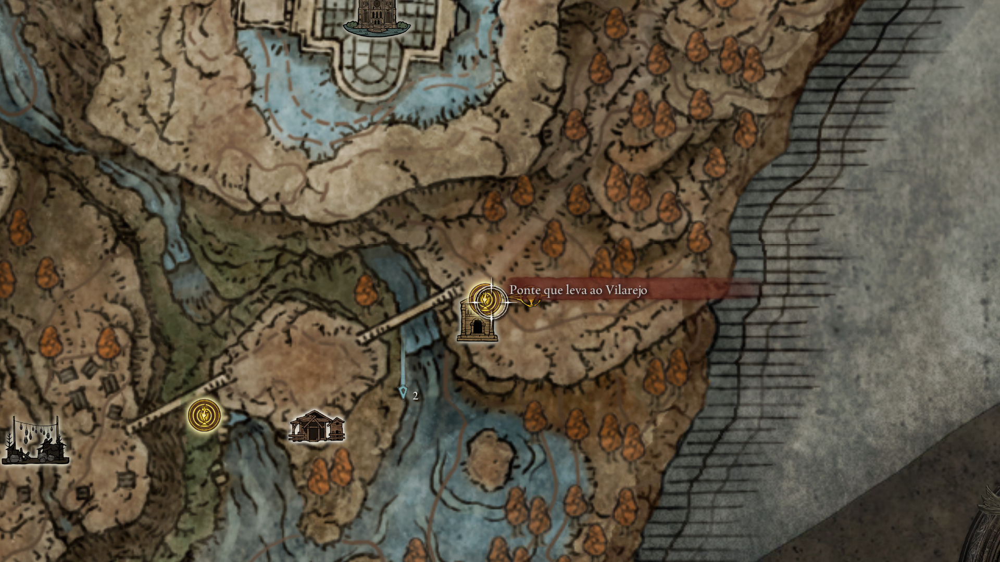
     
    <em>Figura 53a: Entrada do Mausoléu Oriental.</em>

    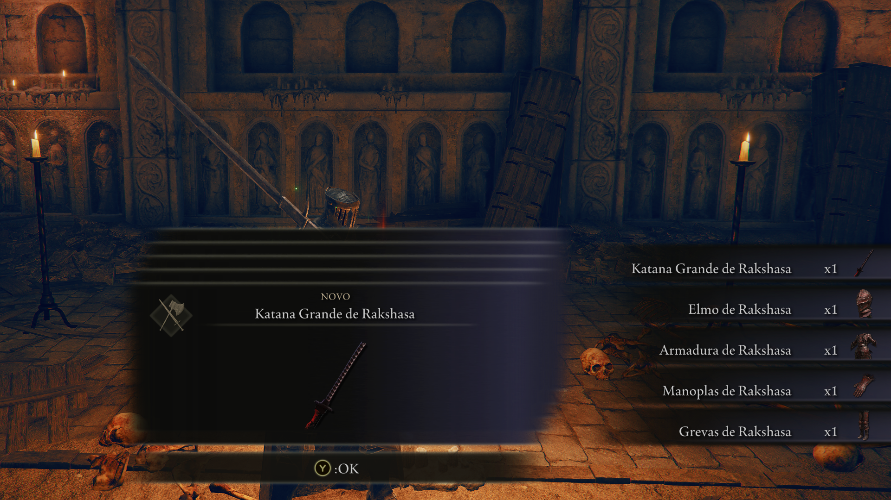
     
    <em>Figura 53b: Equipamentos obtidos após a vitória.</em>

--- 

## 54. Confronto dos Javalis: Fragmentos de Umbravore [2x]
**Intro:** Dois javalis selvagens guardam uma área estreita no caminho para as catacumbas.
* **Descrição:** Derrote os dois inimigos de elite para garantir o upgrade duplo da sua benção.
* **NPCs:** Javalis de Presas Grandes.
* **Item:** **2x Fragmentos de Umbravore**.

    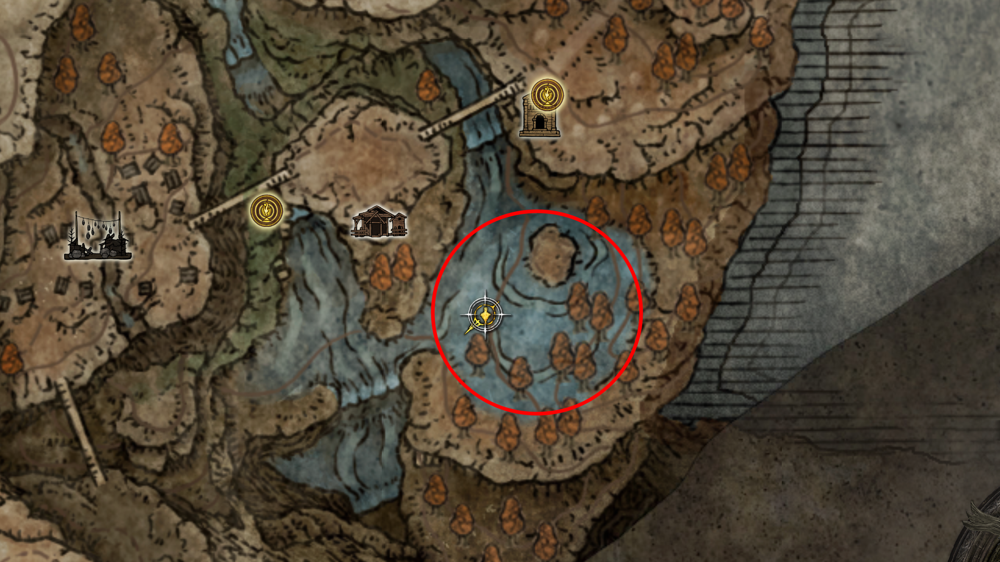
     
    <em>Figura 54: Ponto de combate antes da entrada das catacumbas.</em>

--- 

## 55. Catacumbas da Luz Negra e Jori, Inquisidor Ancião
**Intro:** Esta masmorra serve como o único ponto de acesso para a região secreta do Abismo de Lúgubre.
* **Descrição:** Uma catacumba longa e escura que culmina no combate contra Jori.
* **NPCs:** Jori, Inquisidor Ancião.
* **Item:** **Cajado-Lança Farpado** e acesso à área do Abismo.

    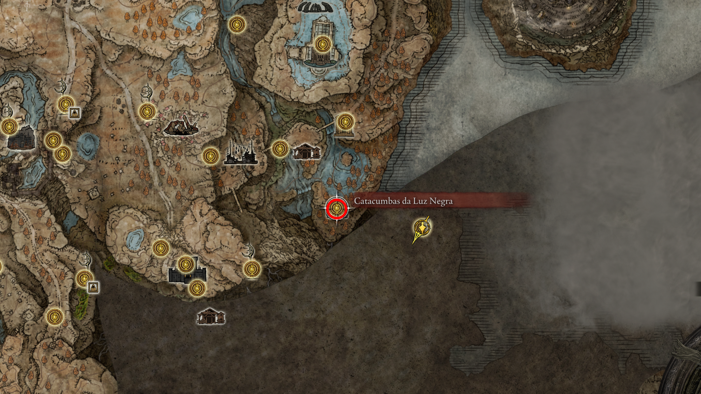
     
    <em>Figura 55: O portal de entrada para as Catacumbas da Luz Negra.</em>

--- 

[⬅️ Voltar para o README.md](../README.md) | [Prosseguir para Ruínas de Rauh ➡️](../22_rauh_base_and_ancient_ruins/route.md)