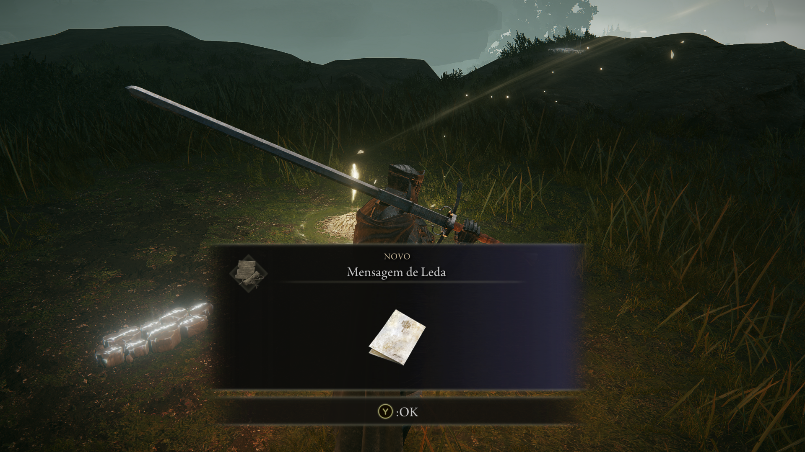
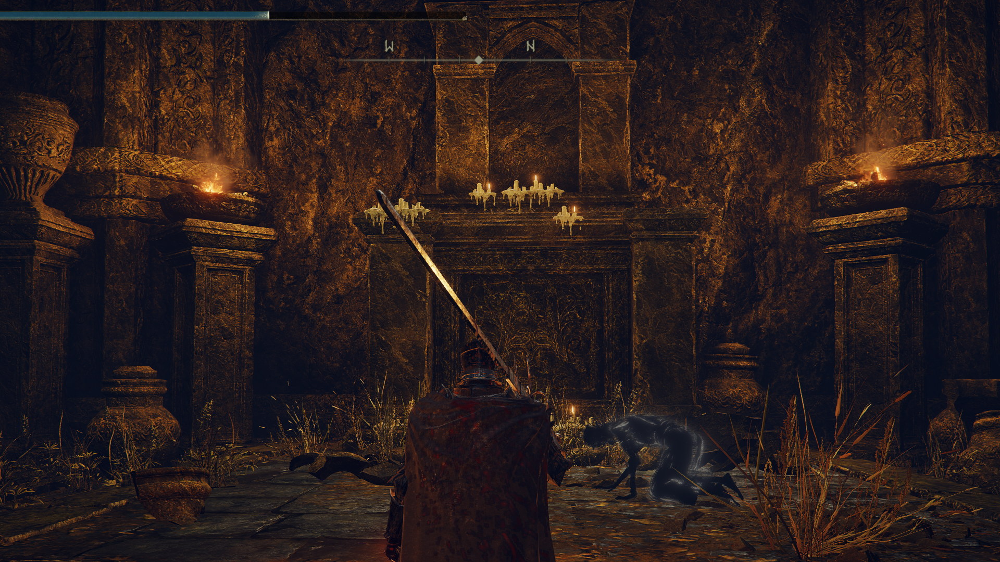
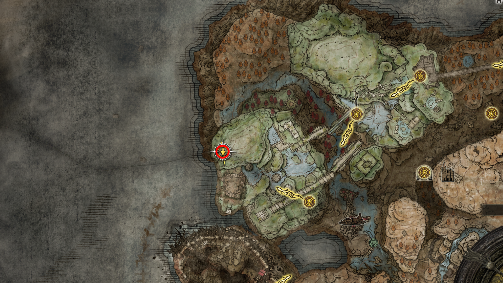
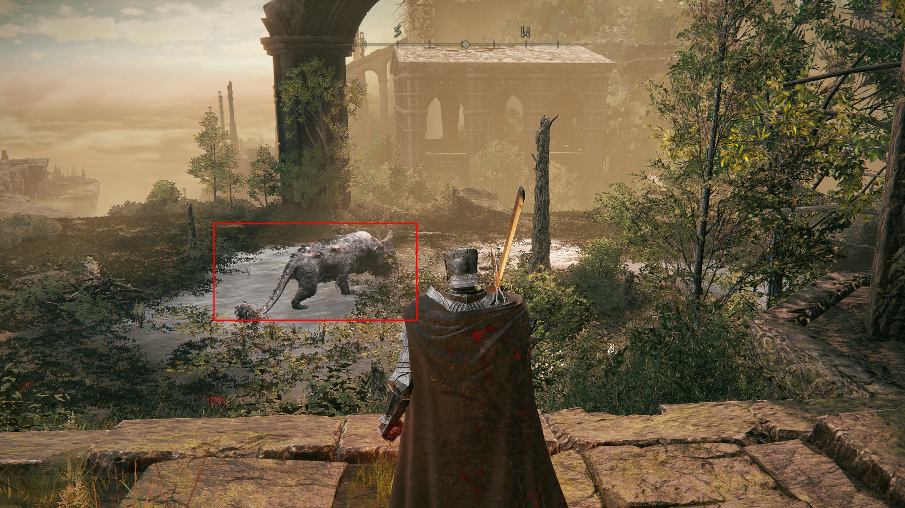
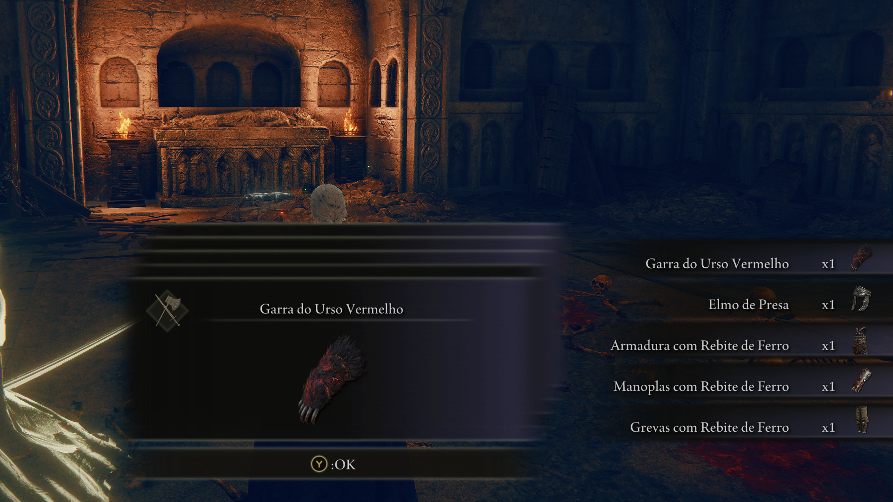
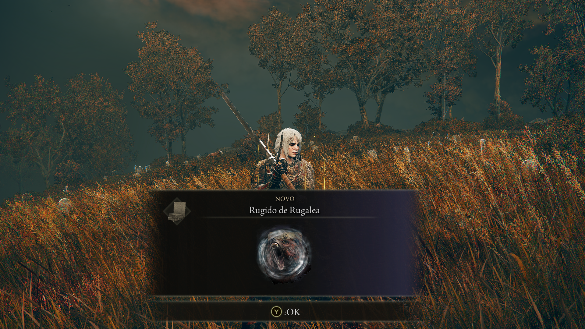

## 01. Ativar a graca Base das Antigas Ruinas, partindo da graca cruz da entrada principal
intro
* **Descrição:** 
* **NPCs:** 
* **Item:** 

    
     
    <em>Figura : .</em>

--- 

## 02. Pegue o Mapa da regiao 
intro
* **Descrição:** 
* **NPCs:** 
* **Item:** 

    
     
    <em>Figura : caminho ate o mapa.</em>

--- 

## 03. fragmento de umbravore NPC com pote na cabeca
intro
* **Descrição:** 
* **NPCs:** 
* **Item:** 

    
     
    <em>Figura : loc.</em>

    
     
    <em>Figura : item.</em>

--- 

## 04. Seguindo para graca antiga ruinas de rauh, leste, proximo da graca encontrara uma mensagem da cruz das ruinas antigas, um fragmento de umbravore e uma mensagem da Leda
intro
* **Descrição:** 
* **NPCs:** 
* **Item:** 

    
     
    <em>Figura : mensagem da cruz.</em>

    
     
    <em>Figura : mensagem da Leda.</em>

    
     
    <em>Figura : mensagem da Leda.</em>

--- 

## 05. Um fragmento de umbravore 
intro
* **Descrição:** 
* **NPCs:** 
* **Item:** 

    
     
    <em>Figura : localizacao.</em>

    
     
    <em>Figura : item.</em>

--- 

## 06. cinza espiritual reverenciada
intro
* **Descrição:** 
* **NPCs:** 
* **Item:** 

    
     
    <em>Figura : .</em>

--- 

## 07. seguindo pela regiao seremos invadido pelo enviado do chifre, que ao vencer ele dropara seu set e a arma Falx fica na regiao da podridao subindo as escadas, aproveite libera a graca igreja do broto, entrada principal
intro
* **Descrição:** 
* **NPCs:** 
* **Item:** 

    
     
    <em>Figura : itens.</em>

    
     
    <em>Figura : localizacao.</em>

--- 

## 08. Um fragmento de umbravore ao derrotar o javali
intro
* **Descrição:** 
* **NPCs:** 
* **Item:** 

    
     
    <em>Figura : localizacao.</em>

    
     
    <em>Figura : item.</em>

--- 

## 09. Como acessar o mausoleu anonimo do norte, pelo ventos espirituais e tera que derrotar o urso vermelho para ganhar seu set e a garra do urso vermelho
intro
* **Descrição:** 
* **NPCs:** 
* **Item:** 

    
     
    <em>Figura como acessar: .</em>

    
     
    <em>Figura : set e arma.</em>

--- 

## 10. Derrote o grande urso vermelho rugalea para ganhar o rugido
intro
* **Descrição:** 
* **NPCs:** 
* **Item:** 

    
     
    <em>Figura : localizacao.</em>

    
     
    <em>Figura : item.</em>

--- 

## 11. derrote a Romina e colete sua lembranca
intro
* **Descrição:** 
* **NPCs:** 
* **Item:** 

    
     
    <em>Figura : .</em>

--- 

<!-- 

## 
intro
* **Descrição:** 
* **NPCs:** 
* **Item:** 

    
     
    <em>Figura : .</em>

--- 
-->