# 🌌 Rota de Exploração: 22. Base de Rauh e Ruínas Antigas (Rauh Base & Ancient Ruins)

> **Status:** Região de múltiplos níveis composta por planícies inferiores e ruínas elevadas.
> **Foco:** Coleta do mapa regional, progressão de upgrades (Umbravore) e confronto com a Santa do Broto.

---

### 📖 Descrição da Jornada
A **Rota da Base de Rauh e Ruínas Antigas** explora as estruturas mais antigas das Terras das Sombras. A jornada começa na base das ruínas, acessível por um desfiladeiro ao norte do Castelo de Ensis, e sobe até os complexos labirínticos repletos de podridão e história. Este caminho é essencial para obter o selo que protege a árvore sagrada.

---

## 01. Ativar a Graça: Base das Antigas Ruínas
**Intro:** O ponto de entrada principal para as terras baixas de Rauh, partindo da Cruz da Entrada Principal.
* **Descrição:** Siga pelo caminho ao norte do Castelo das Sombras para descer ao vale arborizado.
* **NPCs:** Nenhum no ponto imediato.
* **Item:** Nenhum.

    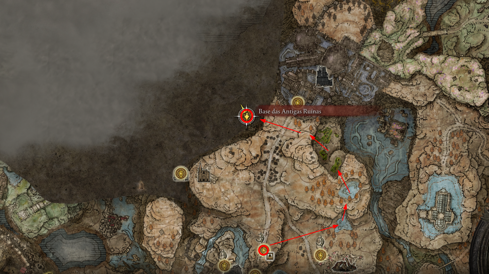
     
    <em>Figura 1: Chegada à primeira graça da região.</em>

--- 

## 02. Coleta do Mapa Regional
**Intro:** Essencial para navegar pela densa floresta e estruturas de pedra da base.
* **Descrição:** Localizado em um pilar de mapa típico, seguindo a estrada principal para o oeste a partir da graça inicial.
* **NPCs:** Nenhum.
* **Item:** **Mapa: Ruínas Antigas de Rauh**.

    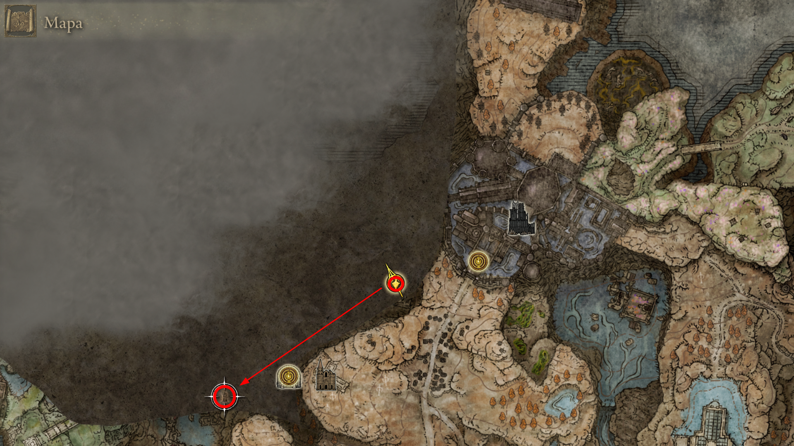
     
    <em>Figura 2: Caminho até o mapa da região.</em>

--- 

## 03. Fragmento de Umbravore (NPC do Pote)
**Intro:** Um inimigo comum que carrega um pote na cabeça esconde um tesouro valioso.
* **Descrição:** Localizado na base, elimine rapidamente o NPC com o pote antes que ele desapareça.
* **NPCs:** Sombra do Pote (Inimigo).
* **Item:** **Fragmento de Umbravore**.

    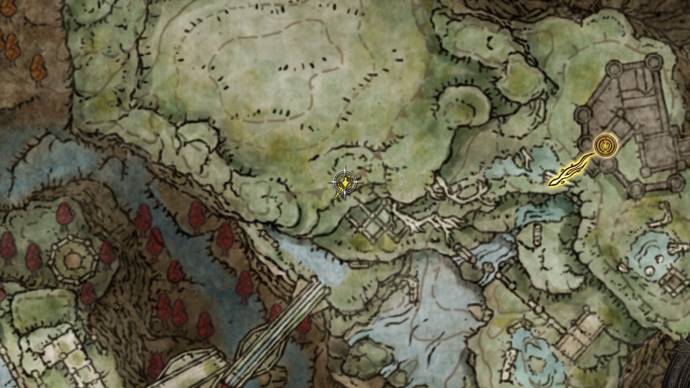
     
    <em>Figura 3a: Localização exata do portador do pote.</em>

    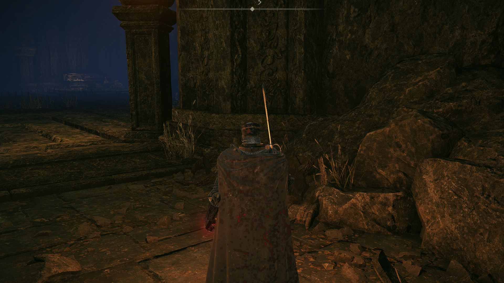
     
    <em>Figura 3b: Upgrade garantido após a derrota.</em>

--- 

## 04. Cruz das Ruínas Antigas e Mensagem da Leda
**Intro:** Um ponto de descanso crucial que revela pistas sobre a perseguição de Miquella.
* **Descrição:** Localizada na parte superior leste, próxima à graça, onde há uma Cruz de Miquella e notas deixadas pelos seguidores.
* **NPCs:** Nenhum (Apenas mensagens de Leda).
* **Item:** **Fragmento de Umbravore** e Carta de Leda.

    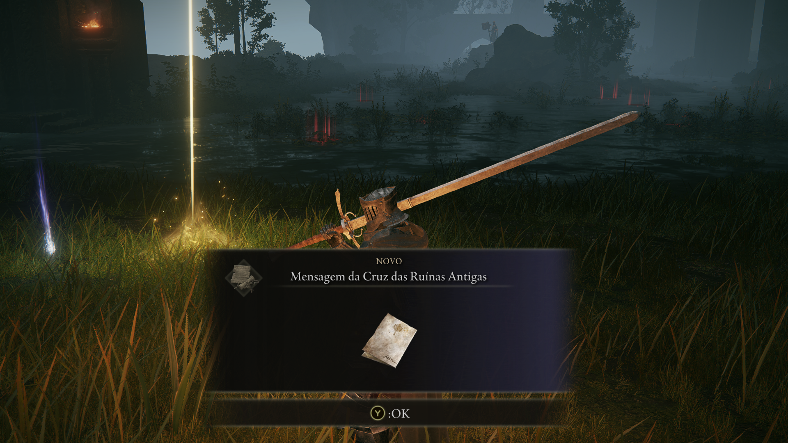
     
    <em>Figura 4a: A Cruz de Miquella e a mensagem no chão.</em>

    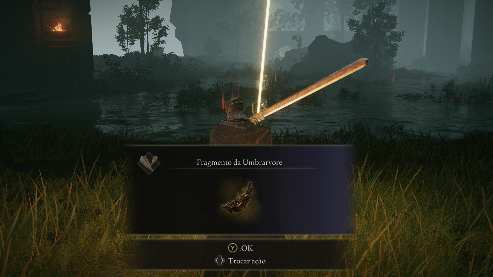
     
    <em>Figura 4b: Fragmento de Umbravore encontrado na cruz.</em>

--- 

## 05. Fragmento de Umbravore Adicional
**Intro:** Mais um ponto de fortalecimento escondido nas ruínas.
* **Descrição:** Encontrado em um altar de pedra rodeado por inimigos nas ruínas elevadas.
* **NPCs:** Nenhum.
* **Item:** **Fragmento de Umbravore**.

    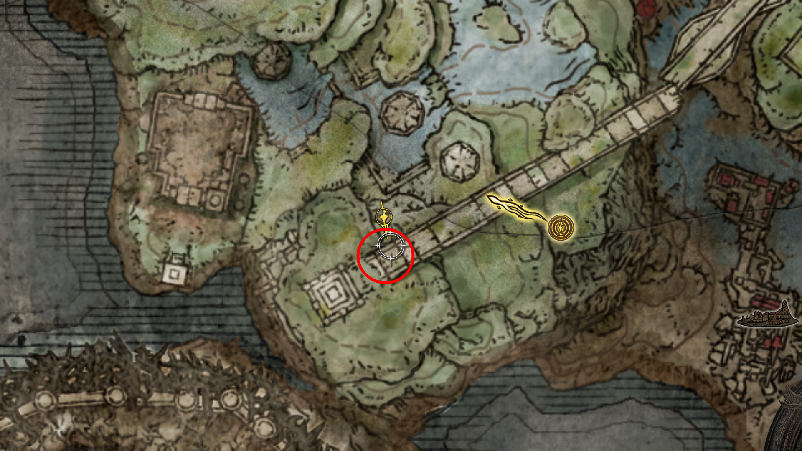
     
    <em>Figura 5a: Altar de pedra onde o fragmento repousa.</em>

--- 

## 06. Cinza Espiritual Reverenciada
**Intro:** Upgrade essencial para o seu Torrent e invocações de cinzas.
* **Descrição:** Localizada em um corpo próximo a uma estrutura em ruínas na zona leste.
* **NPCs:** Nenhum.
* **Item:** **Cinza Espiritual Reverenciada**.

    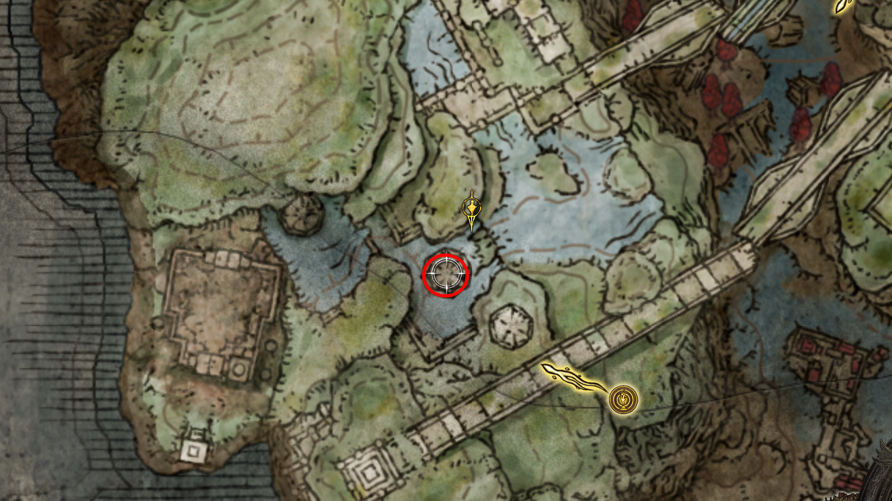
     
    <em>Figura 6: Localização para fortalecer suas invocações.</em>

--- 

## 07. Invasão: Enviado do Chifre e Igreja do Broto
**Intro:** Um confronto agressivo em uma zona tomada pela podridão escarlate.
* **Descrição:** Ao subir as escadas na região da podridão, você será invadido. Após a luta, libere a Graça da Igreja do Broto.
* **NPCs:** Enviado do Chifre (Invasor).
* **Item:** **Set do Enviado** e Arma **Falx**.

    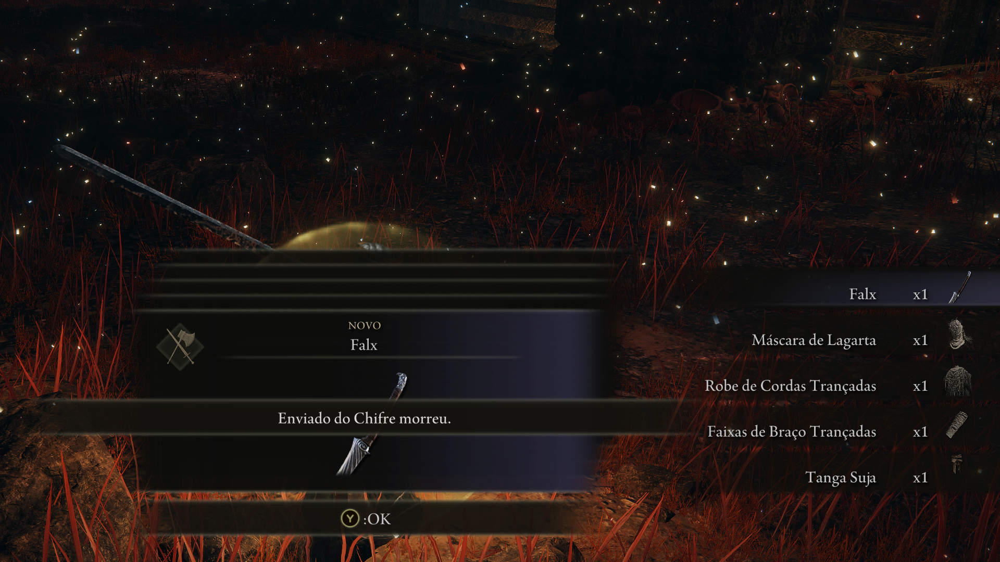
     
    <em>Figura 7a: Equipamentos e arma Falx obtidos.</em>

--- 

## 08. Fragmento de Umbravore: O Javali de Elite
**Intro:** Um inimigo robusto que guarda uma passagem estreita.
* **Descrição:** Derrote o grande javali selvagem para coletar o upgrade automático.
* **NPCs:** Javali de Presas Grandes.
* **Item:** **Fragmento de Umbravore**.

    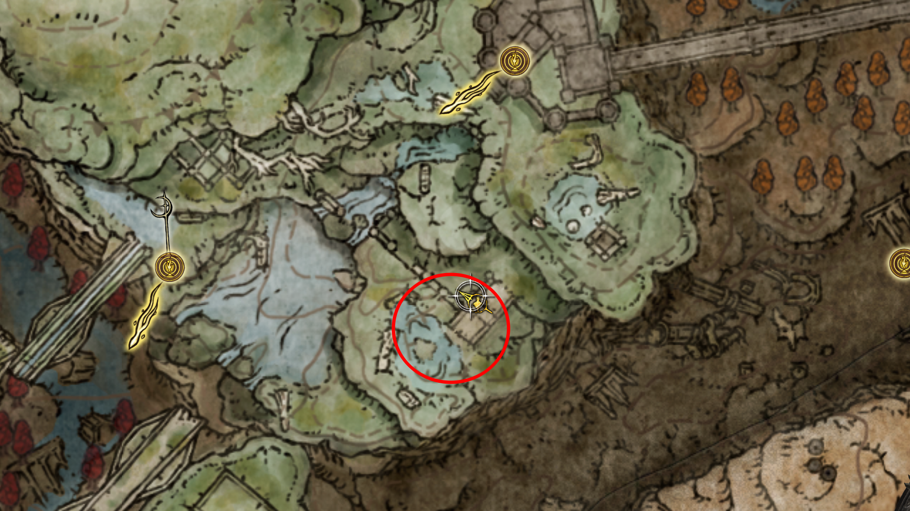
     
    <em>Figura 8: Local do combate contra a besta de elite.</em>

--- 

## 09. Mausoléu Anônimo do Norte: O Urso Vermelho
**Intro:** Um local secreto acessível apenas por correntes de vento espiritual (Spiritsprings).
* **Descrição:** Use o Torrent para saltar no vento, quebre o selo de pedras se necessário e enfrente o guerreiro urso.
* **NPCs:** Urso Vermelho (Chefe do Mausoléu).
* **Item:** **Set do Urso Vermelho** e **Garras do Urso Vermelho**.

    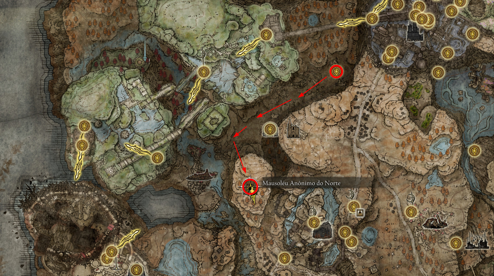
     
    <em>Figura 9: Ponto de salto para acessar o mausoléu isolado.</em>

--- 

## 10. Chefe de Campo: Rugalea, o Grande Urso Vermelho
**Intro:** Uma fera colossal que domina a floresta na base de Rauh.
* **Descrição:** Derrote o urso gigante Rugalea para obter um poderoso encantamento de rugido.
* **NPCs:** Rugalea (World Boss).
* **Item:** **Rugido de Rugalea** (Encantamento).

    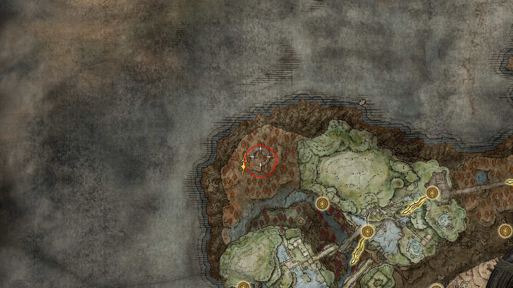
     
    <em>Figura 10: Arena natural onde o urso vermelho reside.</em>

--- 

## 11. Chefe da Região: Romina, Santa do Broto
**Intro:** A guardiã final das ruínas e do caminho para a árvore de selo.
* **Descrição:** Localizada na Igreja do Broto, Romina utiliza ataques de podridão e movimentos de centopeia.
* **NPCs:** Romina, Santa do Broto.
* **Item:** **Lembrança da Santa do Broto**.

    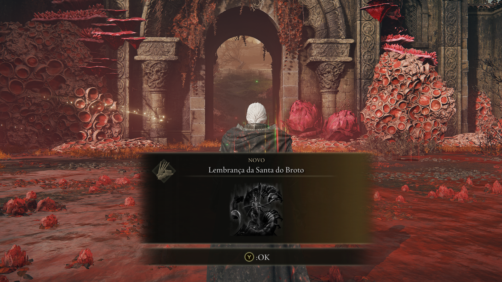
     
    <em>Figura 11: Vitória sobre a Santa do Broto.</em>

--- 

[⬅️ Voltar para o README.md](../README.md) | [Prosseguir para Costa Cerúlea ➡️](../23_southern_shore_and_cerulean_coast/route.md)