# 🌊 Rota de Exploração: 23. Costa Cerúlea e Costa Sul (Cerulean Coast & Southern Shore)

> **Status:** Região costeira de tons cianos e flores de sono no extremo sul.
> **Foco:** Coleta do mapa regional, progressão da quest de Thollier e St. Trina, e exploração da Fenda.

---

### 📖 Descrição da Jornada
A **Rota da Costa Cerúlea e Costa Sul** leva o jogador às margens do Reino das Sombras, onde o azul domina a paisagem. Este percurso é essencial para desvendar a dualidade entre Miquella e St. Trina, exigindo uma descida profunda até a Fenda do Sono Eterno. A jornada mescla a coleta de upgrades cruciais com um dos arcos de NPCs mais melancólicos da expansão.

---

## 01. Mapa da Costa Cerúlea
**Intro:** O ponto de entrada principal para a região sul, revelando a geografia da orla.
* **Descrição:** O caminho sai da frente do castelo e passa pela Graça da Costa Cerúlea; o mapa da região está logo à frente.
* **NPCs:** Nenhum.
* **Item:** **Mapa: Costa Sul**.

    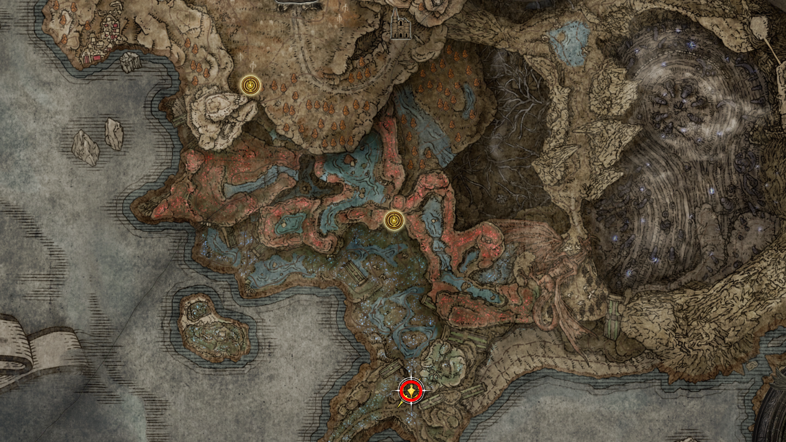
     
    <em>Figura 1: Trajeto da graça até o pilar do mapa regional.</em>

--- 

## 02. Fragmento de Umbravore: Cruz da Costa Cerúlea
**Intro:** Um ponto de repouso de Miquella que oferece um upgrade vital.
* **Descrição:** Localizado diretamente na Cruz de Miquella encontrada na região central da costa.
* **NPCs:** Nenhum.
* **Item:** **Fragmento de Umbravore**.

    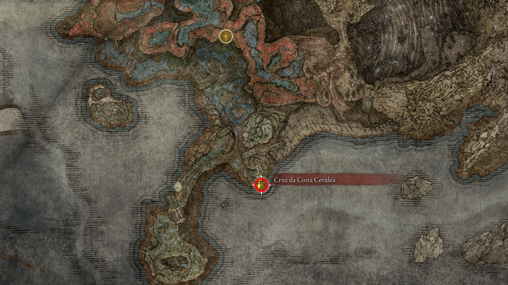
     
    <em>Figura 2: Upgrade coletado no ponto de descanso da cruz.</em>

--- 

## 03. Fragmento de Umbravore (Oeste)
**Intro:** Reforço adicional escondido nas falésias ocidentais.
* **Descrição:** Partindo da Graça da Costa Cerúlea, siga para a direção oeste para encontrar o item.
* **NPCs:** Nenhum.
* **Item:** **Fragmento de Umbravore**.

    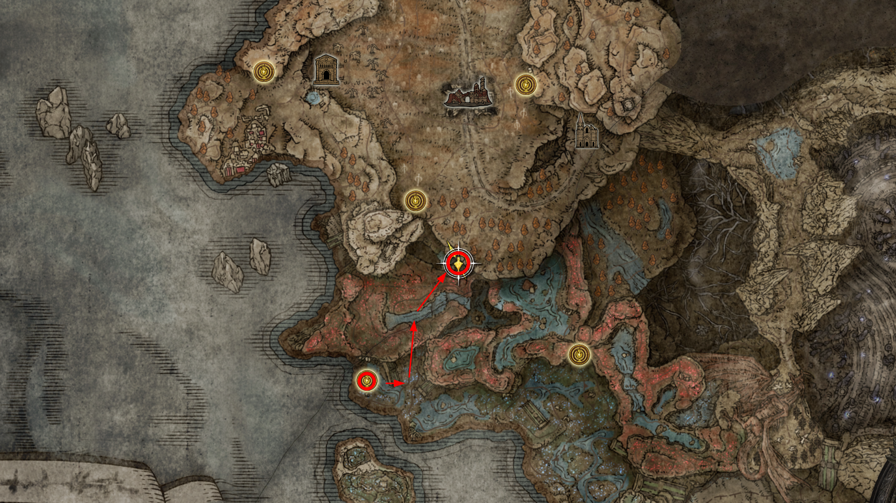
     
    <em>Figura 3: Coleta de upgrade na extremidade oeste.</em>

--- 

## 04. Livro de Receitas do Guardião de Túmulos [2]
**Intro:** Instruções de fabricação para itens temáticos da região.
* **Descrição:** Encontrado em um corpo localizado nas ruínas de pedra da costa.
* **NPCs:** Nenhum.
* **Item:** **Livro de Receitas do Guardião de Túmulos [2]**.

    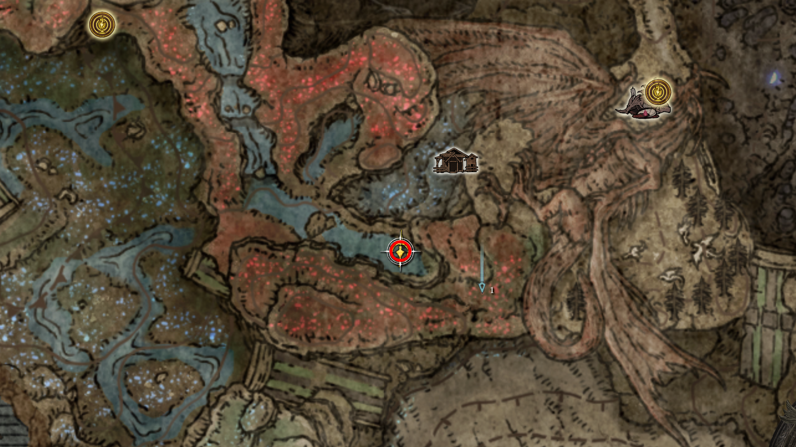
     
    <em>Figura 4a: Localização exata do livro de receitas.</em>

    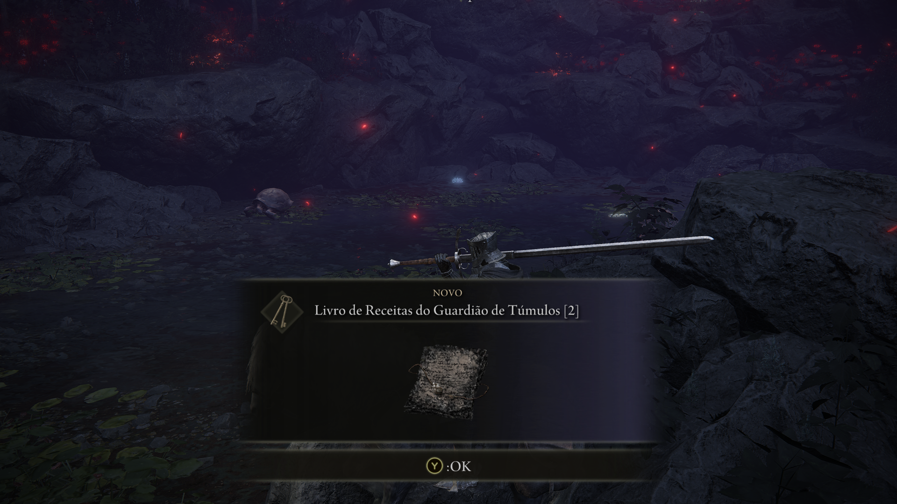
     
    <em>Figura 4b: Visual do item coletado.</em>

--- 

## 05. Livro de Receita de Tibia
**Intro:** Obtido ao derrotar o clássico navegador que assombra as águas rasas.
* **Descrição:** O Marinheiro de Tibia deve ser derrotado para que ele drope seu livro de receitas.
* **NPCs:** Marinheiro de Tibia (Chefe de Campo).
* **Item:** **Livro de Receita de Tibia**.

    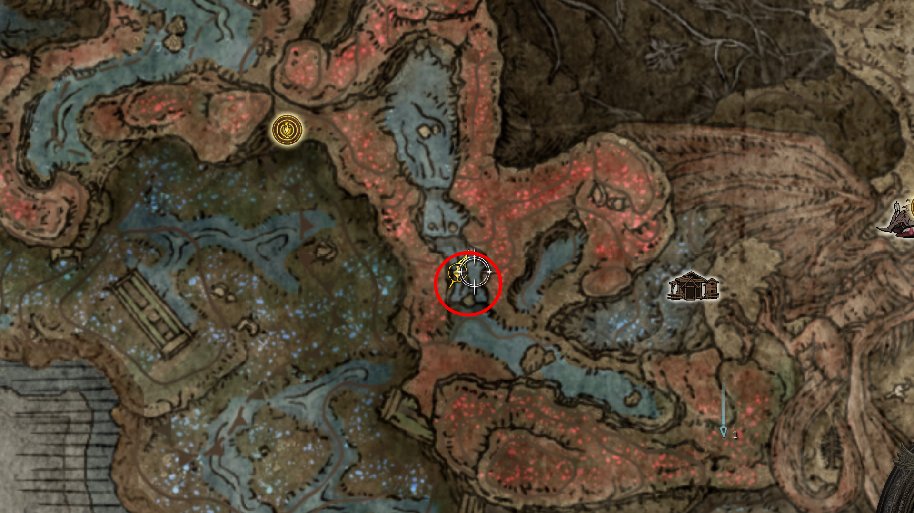
     
    <em>Figura 5a: Área de combate contra o Marinheiro.</em>

    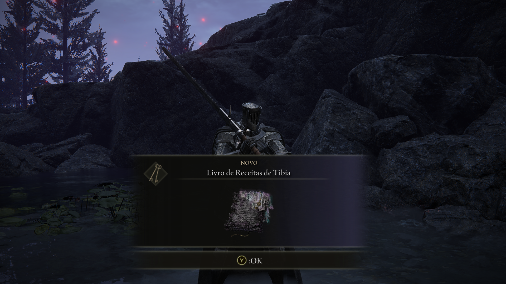
     
    <em>Figura 5b: Recompensa após a vitória.</em>

--- 

## 06. Umbravore do Javali (Grande Altar)
**Intro:** Um upgrade guardado por uma fera de elite perto da comunhão dragônica.
* **Descrição:** Partindo da Graça do Grande Altar da Comunhão do Dragão, siga o caminho para encontrar e derrotar o javali.
* **NPCs:** Javali de Presas Grandes.
* **Item:** **Fragmento de Umbravore**.

    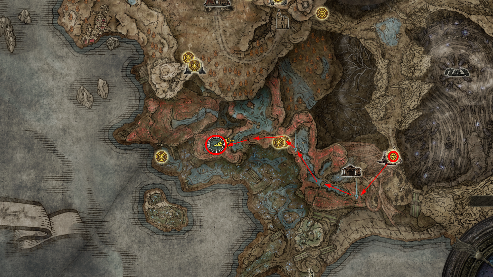
     
    <em>Figura 6a: Localização do inimigo de elite.</em>

 

    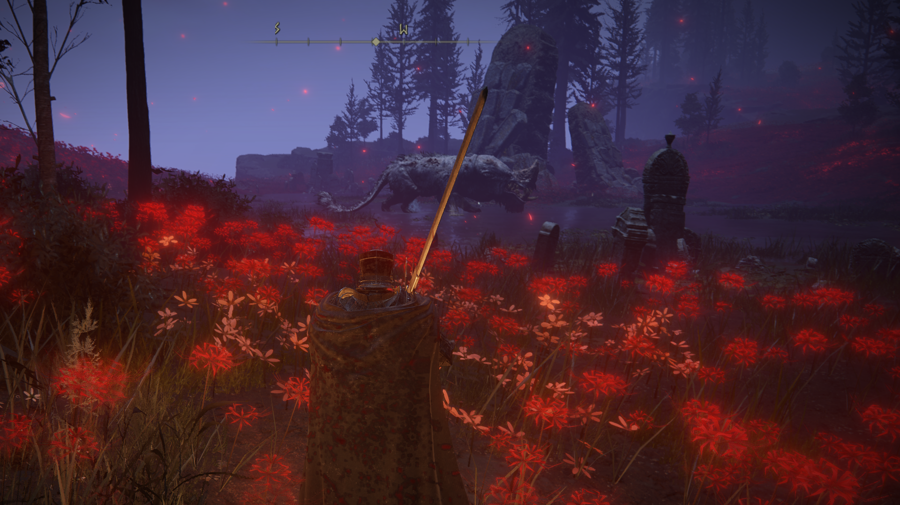
     
    <em>Figura 6b: Fragmento coletado.</em>

--- 

## 07. Cinzas de Pássaro dos Túmulos
**Intro:** Nova invocação de espírito encontrada entre as ruínas litorâneas.
* **Descrição:** As cinzas estão localizadas em um corpo dentro de uma estrutura aberta na costa.
* **NPCs:** Nenhum.
* **Item:** **Cinzas de Pássaro dos Túmulos**.

    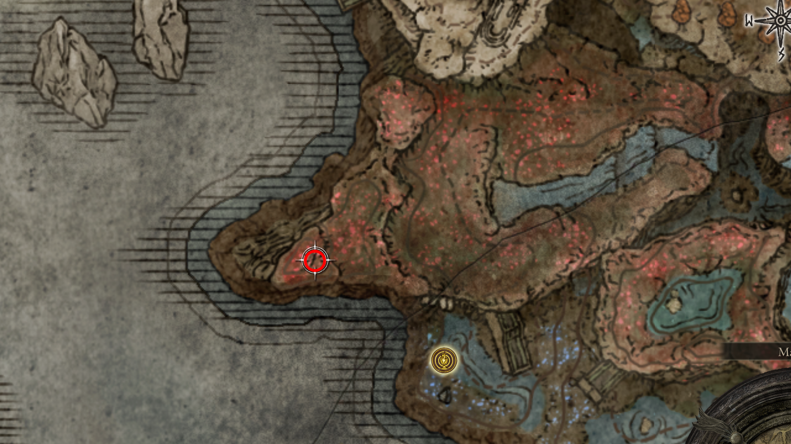
     
    <em>Figura 7: Localização das cinzas de invocação.</em>

--- 

## 08. Rumo à Fenda dos Caixões de Pedra
**Intro:** Transição para a zona profunda e secreta da Costa Sul.
* **Descrição:** Avance para a Graça da Fenda e, em seguida, desça para a Fenda dos Caixões de Pedra.
* **NPCs:** Nenhum.
* **Item:** Acesso à masmorra da Fenda.

    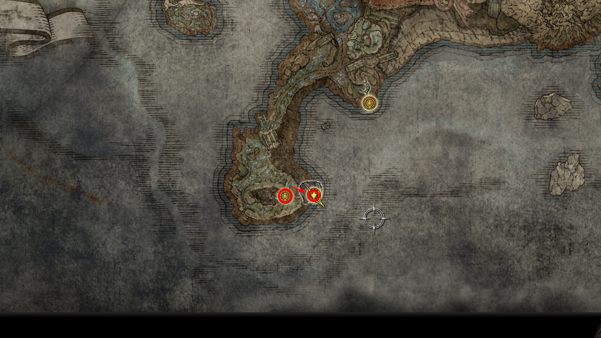
     
    <em>Figura 8: Ponto de entrada para a área profunda.</em>

--- 

## 09. Fragmento de Umbravore: Cruz da Fenda
**Intro:** Upgrade final localizado dentro da própria estrutura da fenda.
* **Descrição:** Encontrado na Cruz de Miquella situada nas plataformas internas da Fenda.
* **NPCs:** Nenhum.
* **Item:** **Fragmento de Umbravore**.

    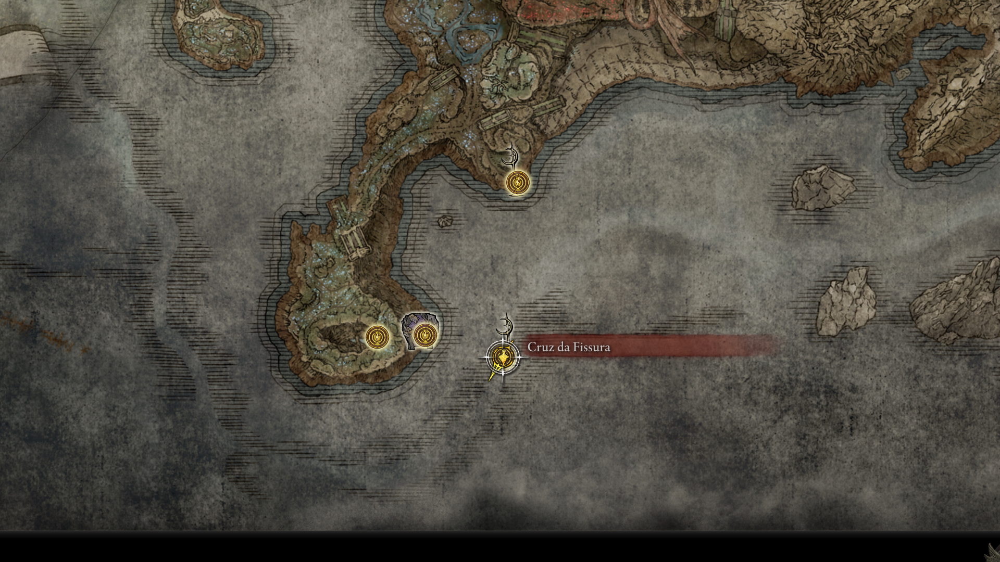
     
    <em>Figura 9a: Localização da cruz na descida.</em>

    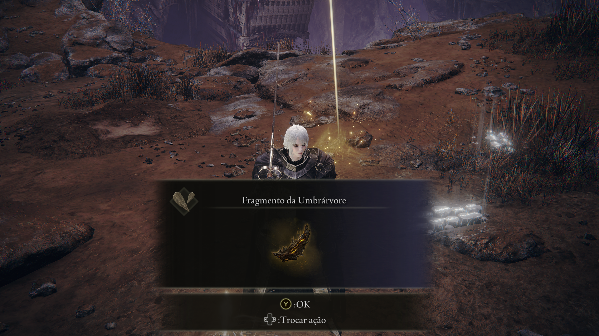
     
    <em>Figura 9b: Coleta do fragmento.</em>

--- 

## 10. Graça: Profundezas da Fenda
**Intro:** O último checkpoint antes do grande confronto da área.
* **Descrição:** Siga até o final da masmorra para ativar a graça próxima à arena do chefe.
* **NPCs:** Nenhum.
* **Item:** Nenhum.

    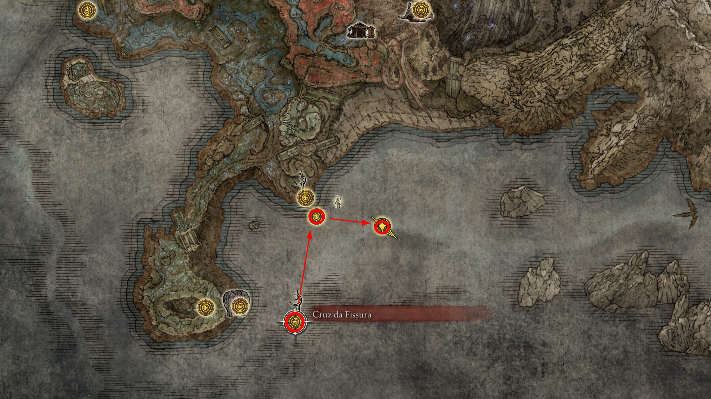
     
    <em>Figura 10: Ponto de descanso pré-boss.</em>

--- 

## 11. Entrada na Arena
**Intro:** O salto necessário para desafiar o guardião do sono.
* **Descrição:** Pule no abismo indicado para cair na arena do Cavaleiro Putrefato.
* **NPCs:** Nenhum.
* **Item:** Nenhum.

    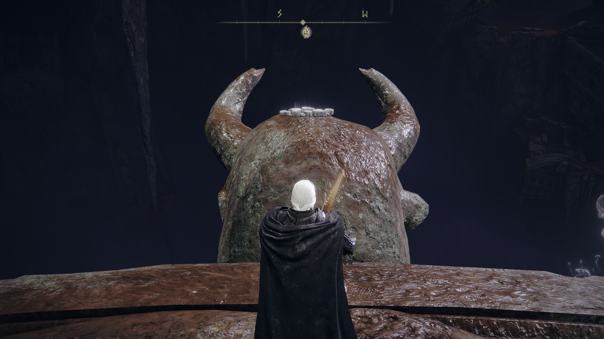
     
    <em>Figura 11: A queda para o combate.</em>

--- 

## 12. Chefe: Cavaleiro Putrefato
**Intro:** O combate principal que libera o acesso ao Jardim de Veludo Roxo.
* **Descrição:** Derrote o cavaleiro montado para coletar sua lembrança.
* **NPCs:** Cavaleiro Putrefato.
* **Item:** **Lembrança do Putrefato**.

    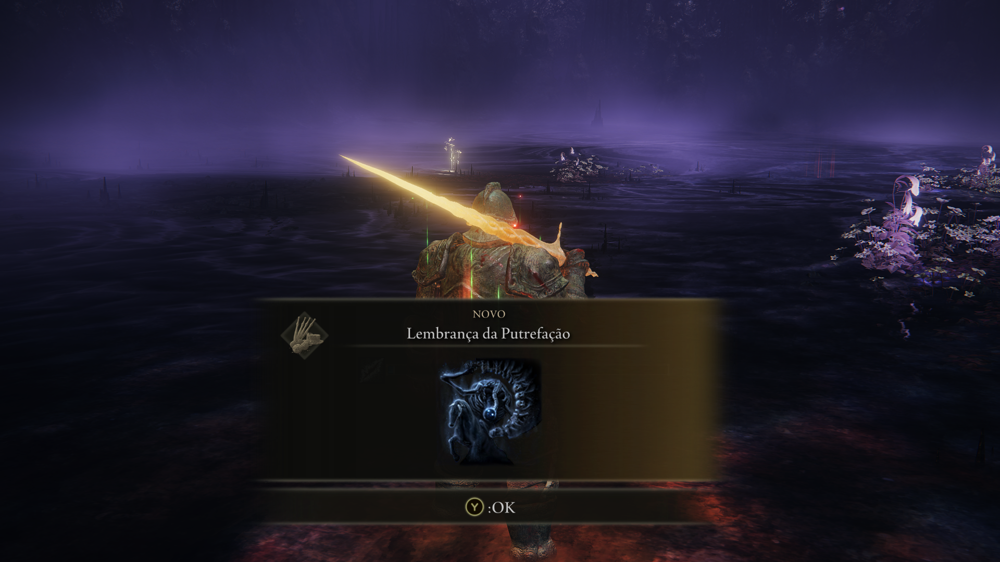
     
    <em>Figura 12: Vitória sobre o guardião da fenda.</em>

--- 

## 13. Encontro com St. Trina
**Intro:** Interação com a divindade do sono profundo.
* **Descrição:** Fale com St. Trina e tome seu néctar para progredir na narrativa.
* **NPCs:** **St. Trina**.
* **Item:** Nenhum imediato.

    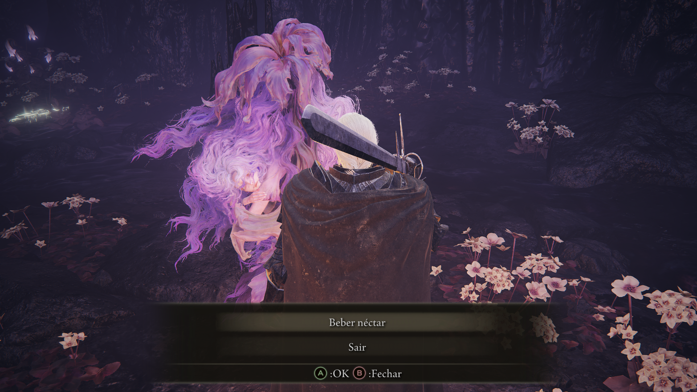
     
    <em>Figura 13: O ritual do néctar no jardim.</em>

--- 

## 14. O Chamado de Thollier
**Intro:** Movimentação do NPC Thollier para o local final de sua jornada.
* **Descrição:** Após beber o néctar, fale com Thollier para que ele se desloque para próximo de St. Trina.
* **NPCs:** **Thollier**.
* **Item:** Nenhum.

    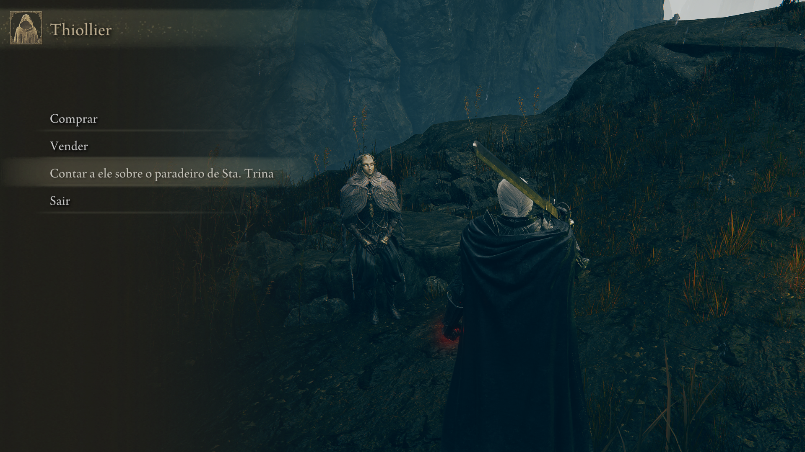
     
    <em>Figura 14: Thollier partindo para o jardim.</em>

--- 

## 15. Diálogo no Jardim de Veludo Roxo
**Intro:** Reencontro com o NPC nas profundezas da fenda.
* **Descrição:** Fale com Thollier no jardim onde St. Trina repousa.
* **NPCs:** **Thollier**.
* **Item:** Nenhum.

    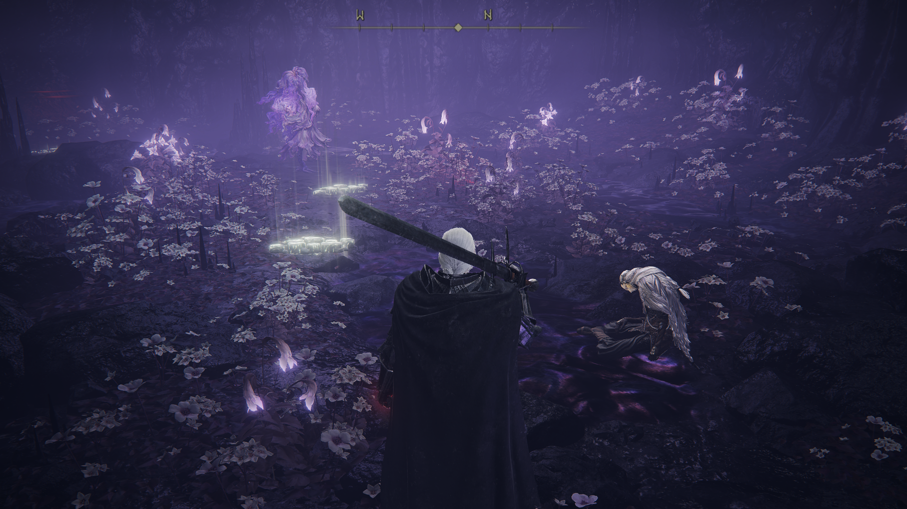
     
    <em>Figura 15: Thollier no local de descanso final.</em>

--- 

## 16. A Mensagem de St. Trina
**Intro:** A revelação sobre o destino de Miquella através do sono.
* **Descrição:** Beba o néctar repetidamente até que St. Trina fale sobre Miquella.
* **NPCs:** **St. Trina**.
* **Item:** Nenhum.

    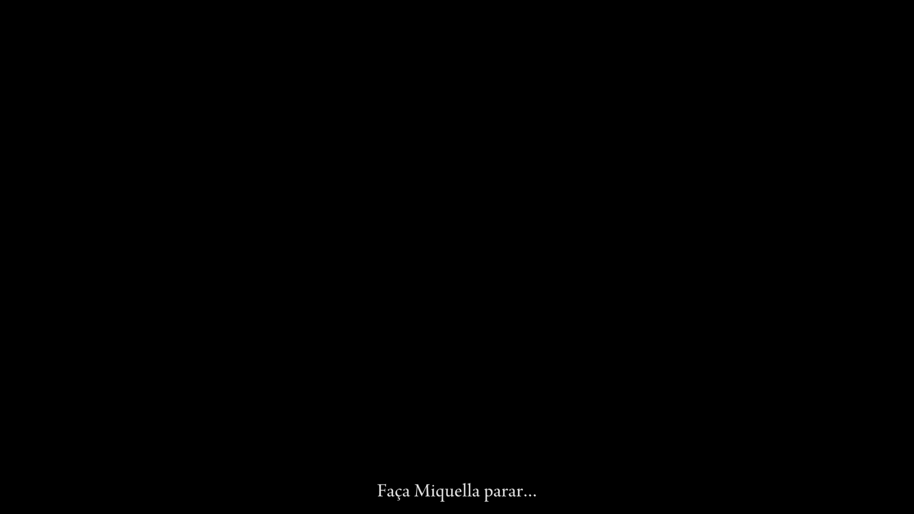
     
    <em>Figura 16: O momento em que a divindade rompe o silêncio.</em>

--- 

## 17. Confronto Ideológico com Thollier
**Intro:** A negação do devoto perante as palavras de sua senhora.
* **Descrição:** Conte a Thollier o que St. Trina disse; ele não acreditará e você deve retornar à graça.
* **NPCs:** **Thollier**.
* **Item:** Nenhum.

    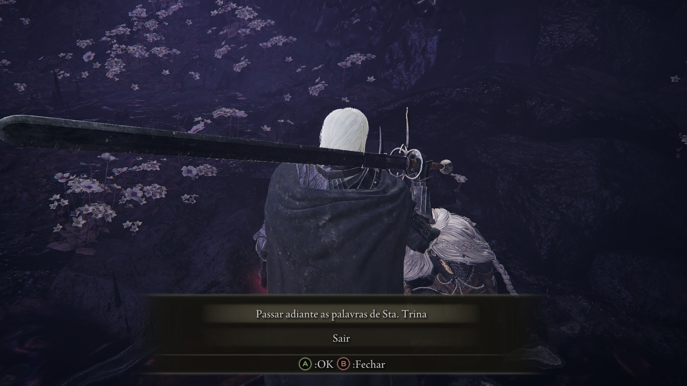
     
    <em>Figura 17: A tensão crescente entre o jogador e o NPC.</em>

--- 

## 18. Invasão e Talismã Sorriso de St. Trina
**Intro:** O duelo inevitável contra o protetor de St. Trina.
* **Descrição:** Thollier irá invadir o seu mundo; derrote-o para obter sua recompensa.
* **NPCs:** Thollier (Invasor).
* **Item:** **Sorriso de St. Trina** (Talismã).

    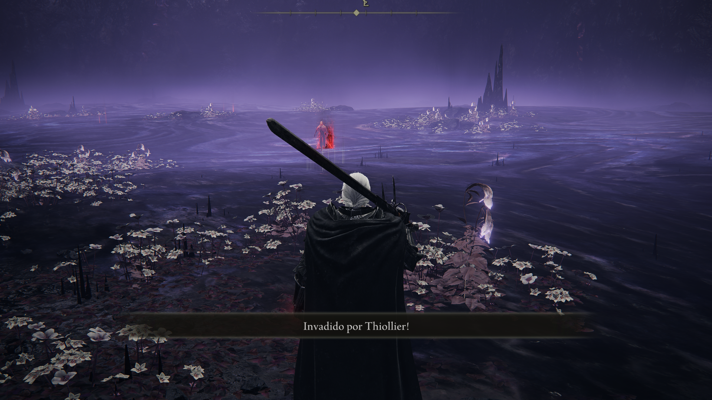
     
    <em>Figura 18a: O combate contra o invasor.</em>

    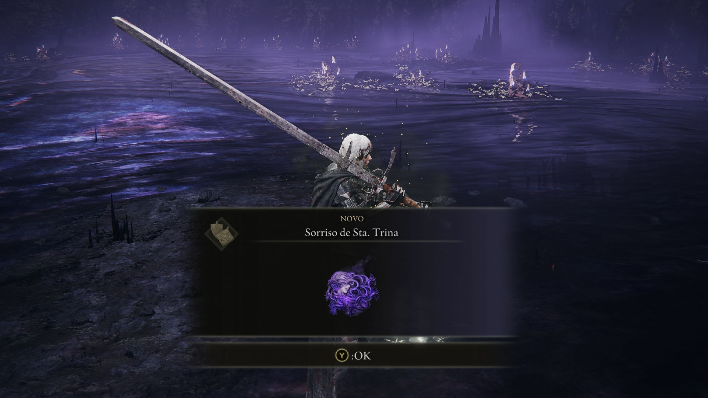
     
    <em>Figura 18b: Talismã obtido após a vitória.</em>

--- 

## 19. O Destino de Miquella
**Intro:** A conclusão da quest no jardim antes do confronto final do jogo.
* **Descrição:** Fale com Thollier deitado e beba o néctar mais vezes até St. Trina pedir para matar Miquella, liberando o diálogo final.
* **NPCs:** **St. Trina** e **Thollier**.
* **Item:** Diálogo final desbloqueado.

    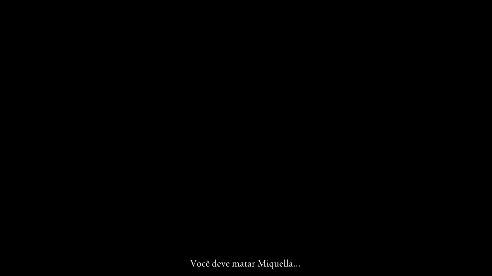
     
    <em>Figura 19a: A ordem direta de St. Trina.</em>

    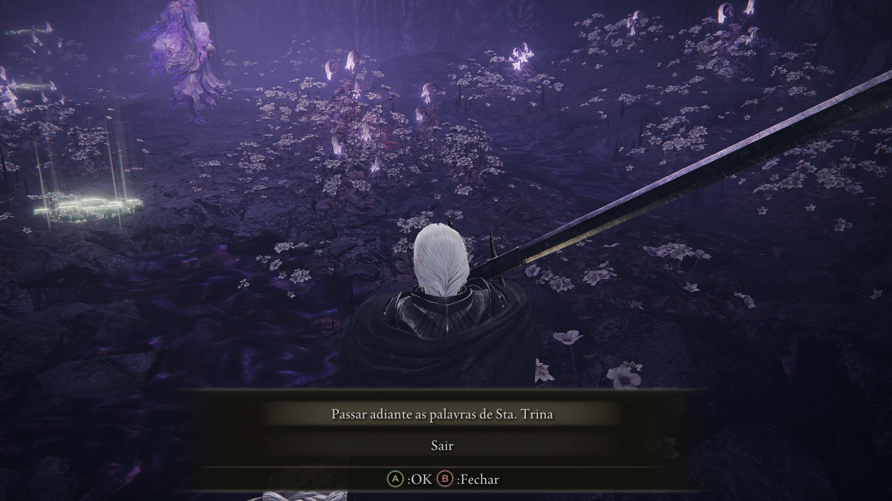
     
    <em>Figura 19b: A aceitação de Thollier sobre o destino.</em>

--- 

[⬅️ Voltar para o README.md](../README.md) | [Prosseguir para Floresta Abissal ➡️](../24_abyssal_woods/route.md)