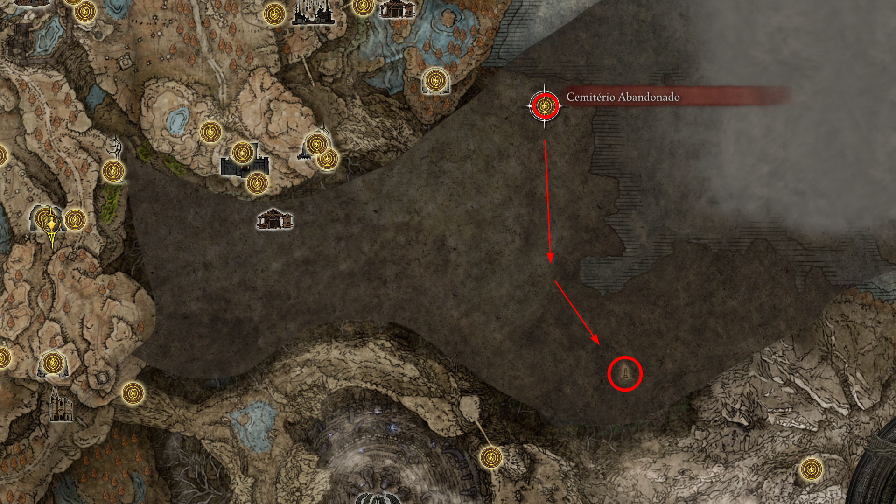
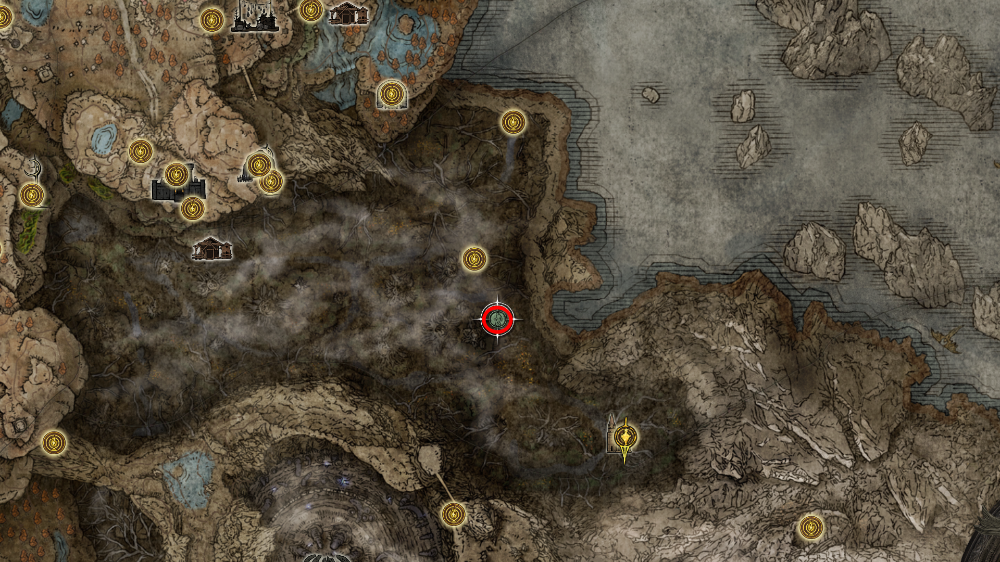
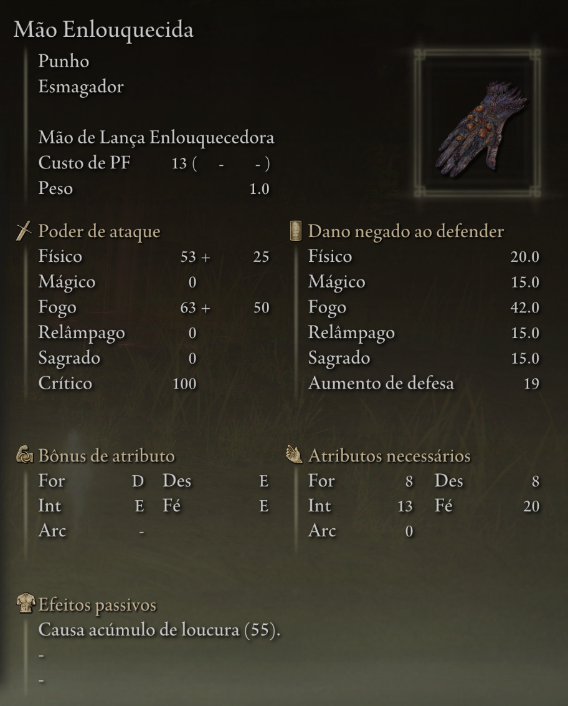
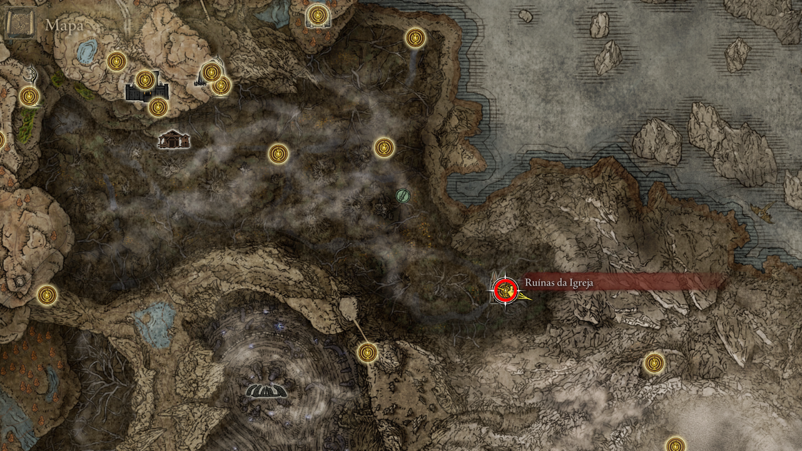
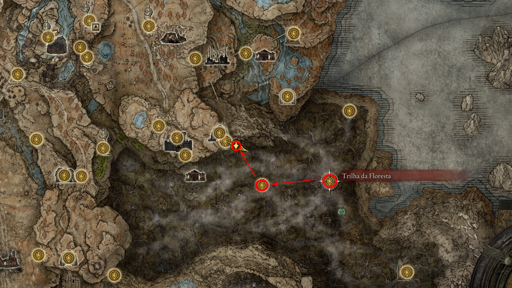
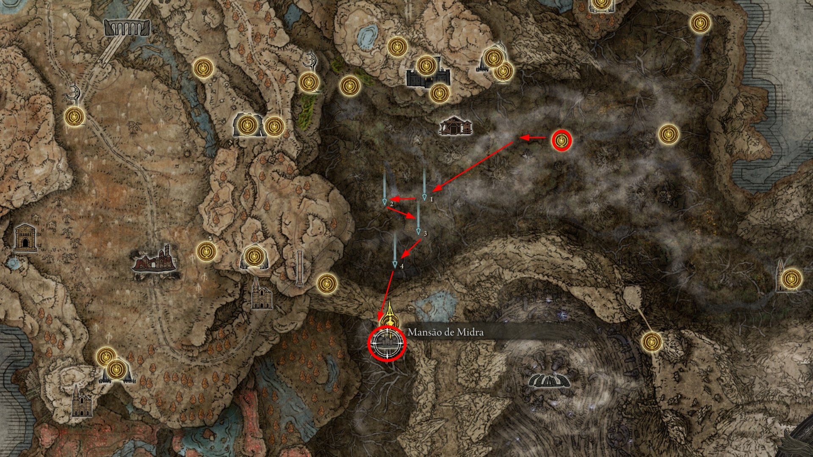
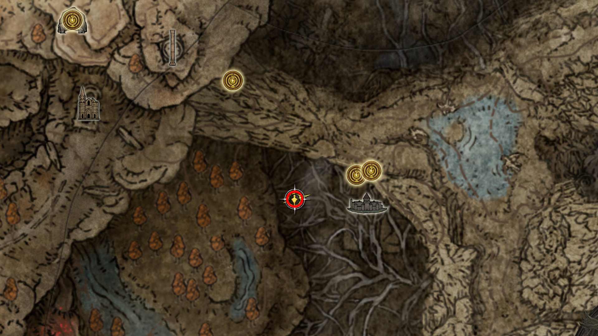
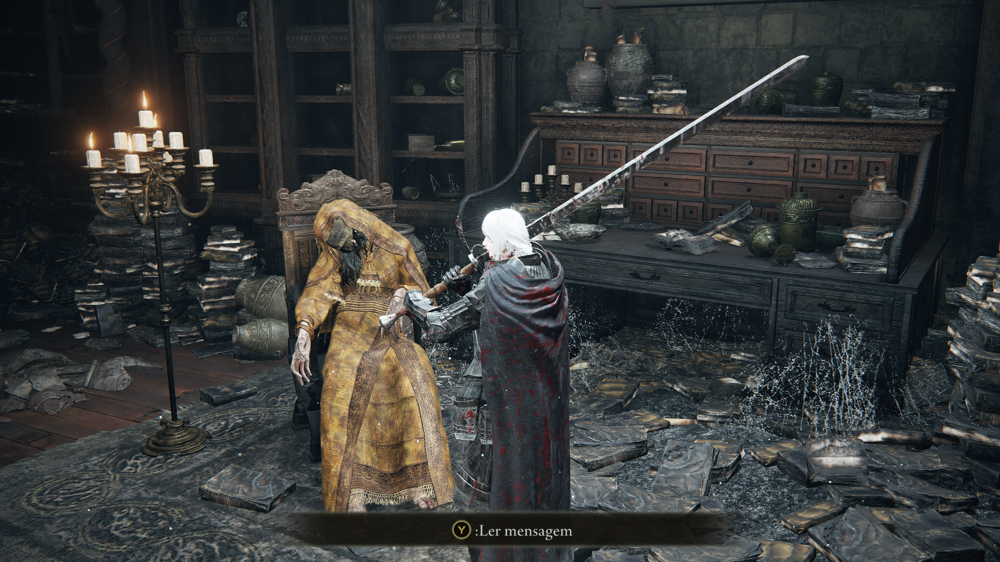
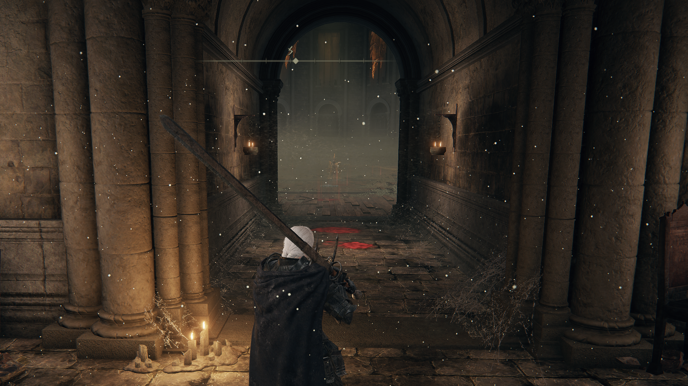
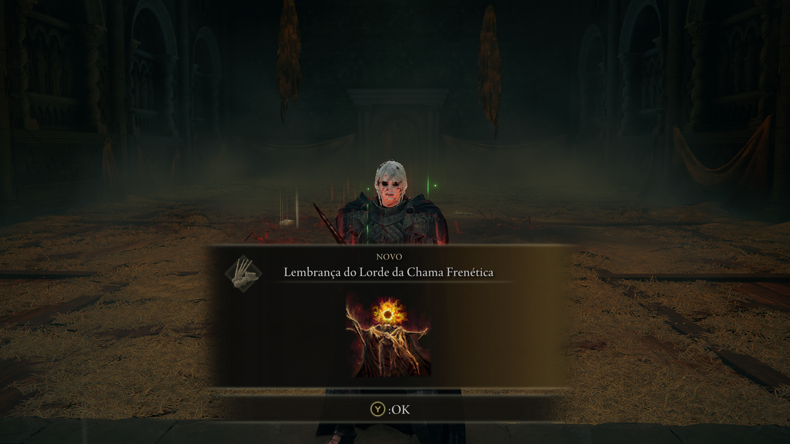

## 01. seguir para a graca ceminterio abandonado apos derrotar o jori, inquisitor anciao, poderemos ir em busca do mapa da regiao
intro
* **Descrição:** 
* **NPCs:** 
* **Item:** 

    
     
    <em>Figura : .</em>

--- 

## 02. proximo a graca trilha da floresta, havera um npc mao enlouquecida que dropara a arma a mao enlouquecida
intro
* **Descrição:** 
* **NPCs:** 
* **Item:** 

    
     
    <em>Figura : localizacao.</em>

    
     
    <em>Figura : item.</em>

--- 

## 03. Proximo ao mapa tem a ruinas da igreja aonde tem uma graca e 2 fragmentos de umbravores
intro
* **Descrição:** 
* **NPCs:** 
* **Item:** 

    
     
    <em>Figura : .</em>

--- 

## 04. voltando para a graca trilha da floresta por esse caminho seguiremos para coletar um fragmento de umbravore
intro
* **Descrição:** 
* **NPCs:** 
* **Item:** 

    
     
    <em>Figura : .</em>

--- 

## 05. caminho para a mansao do midra, tome cuidado com os npc da loucura que para derrotar precisa dar um parry
intro
* **Descrição:** 
* **NPCs:** 
* **Item:** 

    
     
    <em>Figura : caminho.</em>

--- 

## 06. tocha de nanaya no corpo 
intro
* **Descrição:** 
* **NPCs:** 
* **Item:** 

    
     
    <em>Figura : localizacao.</em>

    
     
    <em>Figura : item.</em>

--- 

## 07. Derrote o midra e ganhe sua lembranca
intro
* **Descrição:** 
* **NPCs:** 
* **Item:** 

    
     
    <em>Figura : porta da arena.</em>

    
     
    <em>Figura : lembranca.</em>

--- 

<!-- 

## 
intro
* **Descrição:** 
* **NPCs:** 
* **Item:** 

    
     
    <em>Figura : .</em>

--- 
-->