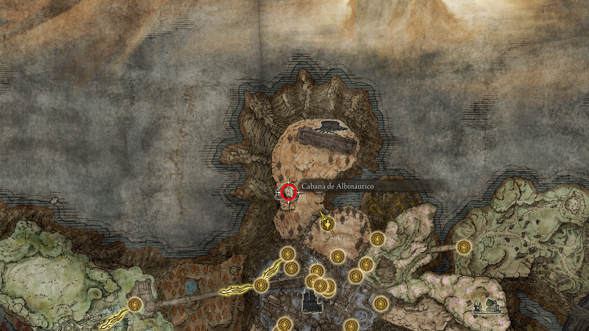

## 52. Catedral de Manus Metyr (Quest de Ymir e Jolán)
**Intro:** O centro das missões relacionadas aos dedos e ao cosmos.
* **NPCs:** **Conde Ymir** e **Jolán, a Espadachim da Noite**.
* **Itens Iniciais:** Colar de pingente e o primeiro mapa das ruínas de dedos.

    
     
    <em>Figura 52a: Catedral de Manus Metyr no leste do mapa.</em>

    
     
    <em>Figura 52b: Conde Ymir em seu trono.</em>

    
     
    <em>Figura 52c: Primeiro mapa recebido.</em>

--- 

## 53. Rumo à Primeira Ruína (Rhia)
**Intro:** As ruínas de Rhia ficam ao sul, acessíveis pela costa azul.
* **Caminho:** Saia da Catedral da Comunhão do Dragão e siga para as praias ao sul.

    
     
    <em>Figura 53a: Localização das Ruínas de Rhia.</em>

    
     
    <em>Figura 53b: Caminho descendo para a costa.</em>

--- 

## 54. Ruínas de Dedos de Rhia
**Intro:** Um local estranho cercado por criaturas que parecem mãos e dedos.
* **Objetivo:** Chegar ao centro e interagir com o grande sino pendurado.

    
     
    <em>Figura 54: O visual alienígena das Ruínas de Rhia.</em>

--- 

## 55. Receita e Talismã de Semente Carmesim +1
**Intro:** Recompensas por explorar e tocar o primeiro sino.
* **Item:** Livro de Receita de Tecelão de Dedos.
* **Talismã:** **Semente Carmesim +1** (Aumenta significativamente a cura do Frasco de Lágrimas Carmesins).

    
     
    <em>Figura 55a: Livro de receitas encontrado no caminho.</em>

    
     
    <em>Figura 55b: Talismã essencial para sobrevivência.</em>

--- 

## 56. Segundo Mapa e Pó Estelar Amado
**Intro:** Volte a Ymir. Ele ficará satisfeito e lhe dará o segundo objetivo.
* **NPC:** Fale com Jolán encostada no pilar para avançar sua lore.
* **Item:** **Pó Estelar Amado** (Acelera a conjuração de magias, mas aumenta o dano recebido).

    
     
    <em>Figura 56a: O segundo mapa de ruínas.</em>

    
     
    <em>Figura 56b: Talismã para builds de magos.</em>

--- 

## 57. Rumo ao Segundo Mapa (Dheo)
**Intro:** Este local é mais escondido. Requer acesso pela área norte da Fortaleza das Sombras.
* **Graça Inicial:** Fortaleza das Sombras, Portão dos Fundos.

    
     
    <em>Figura 57: Ponto de partida para as ruínas do norte.</em>

--- 

## 58. O Segredo do Gesto "Ó, Mãe"
**Intro:** Há uma estátua perto da Graça do Portão dos Fundos que esconde uma passagem.
* **Ação:** Use o gesto "Ó, Mãe" (obtido no Vilarejo Bonny) na frente da estátua de Marika.
* **Resultado:** A estátua se move, revelando o caminho para o interior do Pico Irregular/Ruínas.

    
     
    <em>Figura 58a: Usando o gesto correto.</em>

    
     
    <em>Figura 58b: A passagem secreta revelada.</em>

--- 

## 59. Caminho da Terrafunda
**Intro:** Uma área verdejante e isolada que leva às ruínas do norte.
* **Graças:** Terrafunda e Ponte da Terrafunda.

    
     
    <em>Figura 59: Travessia pela Ponte da Terrafunda.</em>

--- 

## 60. Ruínas de Dedos de Dheo e Semente Cerúlea +1
**Intro:** Toque o segundo sino no centro desta cratera de dedos.
* **Talismã:** **Semente Cerúlea +1** (Aumenta a recuperação de PF pelos Frascos Cerúleos).

    
     
    <em>Figura 60a: Tocando o segundo sino.</em>

    
     
    <em>Figura 60b: Recompensa para gestão de mana.</em>

--- 

## 61. Passagem Secreta para Metyr
**Intro:** Ao retornar e falar com Ymir e Jolán pela última vez, descanse na Graça. Eles desaparecerão temporariamente.
* **Ação:** Interaja com o trono de Ymir (a cadeira) para revelar uma escada escondida.
* **Local:** Ruínas de Metyr (abaixo da catedral).

    
     
    <em>Figura 61a: O segredo sob o trono do Conde.</em>

    
     
    <em>Figura 61b: O caminho final para a Mãe dos Dedos.</em>

--- 

## 62. Invasão: Espadachim da Noite Anna
**Intro:** Enquanto desce para o último sino, a irmã de Jolán atacará.
* **NPC:** Anna, Espadachim da Noite.
* **Item:** **Garras da Noite** (arma de destreza muito rápida com passiva de sangramento).

    
     
    <em>Figura 62: Vitória sobre Anna e coleta de sua arma.</em>

--- 

## 63. Metyr, Mãe dos Dedos
**Intro:** Toque o terceiro sino para ser transportado para o cosmos. Metyr é uma criatura estelar, a primeira enviada da Vontade Maior.
* **Descrição:** Chefe principal de quest.
* **Item:** **Lembrança da Mãe dos Dedos**.

    
     
    <em>Figura 63a: O toque final que convoca o Boss.</em>

    
     
    <em>Figura 63b: Combate contra a entidade cósmica.</em>

--- 

## 64. O Confronto Final na Catedral
**Intro:** Ao sair da arena de Metyr, Jolán e Ymir (agora enlouquecido) atacarão você por "matar a mãe".
* **NPCs:** Jolán e depois **Ymir, Mãe dos Dedos** (ele assume a forma).
* **Items:** Set de Sumo Sacerdote, Sino de Ymir e o **Cajado Maternal**.

    
     
    <em>Figura 64: O fim da linhagem de Ymir.</em>

--- 

## 65. O Destino de Jolán e as Cinzas
**Intro:** Jolán estará caída no trono. Use uma Íris nela.
* **Escolha:** **Íris da Graça** para obter as cinzas dela.
* **Item:** **Espadachim da Noite Jolán** (Cinzas de Invocação).

    
     
    <em>Figura 65a: Oferecendo a luz da Graça para Jolán.</em>

    
     
    <em>Figura 65b: Cinzas de Jolán prontas para uso.</em>

--- 

## 66. Vilarejo Xamânico (O Segredo de Marika)
**Intro:** Partindo da Graça Terrafunda, suba o caminho para encontrar o local de origem da Rainha Marika.
* **Dica:** É uma área de paz, sem inimigos, repleta de flores douradas.

    
     
    <em>Figura 66: Entrada do belo e melancólico Vilarejo Xamânico.</em>

--- 

## 67. Encantamento: Térvore Menor (Minor Erdtree)
**Intro:** Encontrado sob a árvore principal do vilarejo.
* **Efeito:** Cria uma pequena Térvore que regenera HP continuamente para você e aliados próximos.

    
     
    <em>Figura 67: Um dos encantamentos de cura mais fortes do jogo.</em>

--- 

## 68. Trança Dourada (Golden Braid)
**Intro:** Localizado dentro do tronco de uma árvore no Vilarejo Xamânico.
* **Efeito:** **Talismã de Defesa Máxima** contra dano Sagrado.
* **Lore:** Dizem ser uma trança cortada pela própria Marika antes de partir para as Terras Entre.

    
     
    <em>Figura 68: O item de defesa sagrada definitivo.</em>

--- 

## 69. Unificando as Irmãs: Jolán e Anna
**Intro:** Vá para a Torre de Rabbath (acessível pelo Vilarejo Xamânico, descendo pelas bordas).
* **Ação:** Encontre o corpo de Anna no topo e use as cinzas de Jolán nele.
* **Resultado:** Suas cinzas evoluem para invocar **ambas** as irmãs simultaneamente.

    
     
    <em>Figura 69a: O ritual para unir as almas das espadachins.</em>

    
     
    <em>Figura 69b: Jolán e Anna, uma das melhores invocações da DLC.</em>

--- 

## 70. Canhão de Rabbath
**Intro:** Explorando os níveis inferiores da Torre de Rabbath.
* **Itens:** Sino de Maquinomago e o **Canhão de Rabbath** (arma de longo alcance que dispara projéteis explosivos).

    
     
    <em>Figura 70: Uma arma pesada para builds de força/inteligência.</em>

--- 

## 71. Missil Gravitacional (Besta da Estrela Cadente)
**Intro:** No final do caminho da Ponte da Terrafunda, uma Besta da Estrela Cadente Adulta guarda uma cratera.
* **Combate:** Inimigo extremamente agressivo. Use ataques de impacto na cabeça.
* **Item:** Encantamento **Missil Gravitacional** (puxa inimigos para o centro de uma explosão).

    
     
    <em>Figura 71: Magia de gravidade poderosa obtida na cratera.</em>

---

## 72. Siga para a graca da Fortaleza das sombras, portao dos fundos para derrotar o comandante Gaius 
intro
* **Descrição:** 
* **NPCs:** 
* **Item:** 

    
     
    <em>Figura : lembraca.</em>

--- 

## 73. Talisma de tiro preciso na cabana do albinaurico, trevas de Gaius ao derrotar a albinaurica
intro
* **Descrição:** 
* **NPCs:** 
* **Item:** 

    
     
    <em>Figura : talisma local.</em>

    
     
    <em>Figura : trevas de Gaius.</em>

--- 

## 74. apos a luta siga para o Calice da umbravore aonde podera coletar 5 umbravore
intro
* **Descrição:** 
* **NPCs:** 
* **Item:** 

    
     
    <em>Figura : localizacao.</em>

    
     
    <em>Figura : 5 umbravores.</em>

